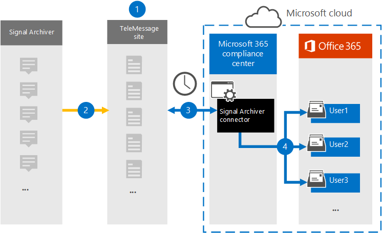

# Een verbindingslijn instellen voor het archiveren van Signal-communicatiegegevens (voorbeeld)Set up a connector to archive Signal communications data (preview)

Gebruik de TeleMessage-connector in de Microsoft 365-compliancecentrum om Signal-chats, bijlagen, bestanden en verwijderde berichten en oproepen te importeren en te archiveren.Use the TeleMessage connector in the Microsoft 365 compliance center to import and archive Signal chats, attachments, files, and deleted messages and calls. Nadat u een verbindingslijn hebt ingesteld en geconfigureerd, maakt deze verbinding met het TeleMessage-account van uw organisatie en importeert u de mobiele communicatie van werknemers met de TeleMessage Signal Archiver naar postvakken in Microsoft 365.After you set up and configure a connector, it connects to your organization's TeleMessage account, and imports the mobile communication of employees using the TeleMessage Signal Archiver to mailboxes in Microsoft 365.

Nadat gegevens van signaalarchiveringsconnector zijn opgeslagen in gebruikerspostvakken, kunt u Microsoft 365 compliancefuncties zoals Proces bewaring, Inhoud zoeken en Microsoft 365 op Signal-communicatiegegevens toepassen.After Signal Archiver connector data is stored in user mailboxes, you can apply Microsoft 365 compliance features such as Litigation Hold, Content search, and Microsoft 365 retention policies to Signal communications data. U kunt bijvoorbeeld signaalcommunicatie zoeken met inhoud zoeken of het postvak met de connectorgegevens van de Signal Archiver koppelen aan een bewaarder in een Advanced eDiscovery geval.For example, you can search Signal communication using Content search or associate the mailbox that contains the Signal Archiver connector data with a custodian in an Advanced eDiscovery case. Als u een connector voor signaalarchivering gebruikt om gegevens te importeren en te archiveren in Microsoft 365 kan uw organisatie voldoen aan de regelgeving voor bedrijfsbeheer en regelgevingsbeleid.Using a Signal Archiver connector to import and archive data in Microsoft 365 can help your organization stay compliant with corporate governance regulations and regulatory policies.

## Overzicht van het archiveren van signaalcommunicatiegegevensOverview of archiving Signal communications data

In het volgende overzicht wordt uitgelegd hoe het gebruik van een verbindingslijn voor het archiveren van signaalcommunicatiegegevens in Microsoft 365.The following overview explains the process of using a connector to archive  Signal communication data in Microsoft 365.

1. Uw organisatie werkt met TeleMessage om een connector voor signaalarchivering in te stellen.Your organization works with TeleMessage to set up a Signal Archiver connector. Zie De [TeleMessage Signal Archiver](https://www.telemessage.com/microsoft-365-activation-for-signal-archiver/)activeren voor meer Microsoft 365.For more information, see [Activating the TeleMessage Signal Archiver for Microsoft 365](https://www.telemessage.com/microsoft-365-activation-for-signal-archiver/).

2. In realtime worden de Signaalgegevens van uw organisatie gekopieerd naar de TeleMessage-site.In real time, your organization's Signal data is copied to the TeleMessage site.

3. De connector Signal Archiver die u in de Microsoft 365-compliancecentrum maakt, maakt elke dag verbinding met de TeleMessage-site en brengt de e-mailberichten van de afgelopen 24 uur over naar een beveiligd Azure Storage-gebied in de Microsoft Cloud.The Signal Archiver connector that you create in the Microsoft 365 compliance center connects to the TeleMessage site every day and transfers the email messages from the previous 24 hours to a secure Azure Storage area in the Microsoft Cloud.

4. De verbindingslijn importeert de mobiele communicatie-items naar het postvak van een specifieke gebruiker.The connector imports the mobile communication items to the mailbox of a specific user. Er wordt een nieuwe map met de naam Signal Archiver gemaakt in het postvak van de specifieke gebruiker en de items worden in het postvak geïmporteerd.A new folder named Signal Archiver will be created in the specific user's mailbox and the items will be imported to it. De connector doet de toewijzing met behulp van de waarde van de *eigenschap E-mailadres van de* gebruiker.The connector does the mapping by using the value of the *User's Email address* property. Elk e-mailbericht bevat deze eigenschap, die wordt gevuld met het e-mailadres van elke deelnemer van het e-mailbericht.Every email message contains this property, which is populated with the email address of every participant of the email message.

> Naast automatische gebruikerstoewijzing met  de waarde van de eigenschap E-mailadres van de gebruiker, kunt u ook een aangepaste toewijzing definiëren door een CSV-toewijzingsbestand te uploaden.In addition to automatic user mapping using the value of the *User's Email address* property, you can also define a custom mapping by uploading a CSV mapping file. Dit toewijzingsbestand moet het mobiele nummer van de gebruiker en het bijbehorende Microsoft 365 postvak voor elke gebruiker bevatten.This mapping file should contain User's mobile Number and the corresponding Microsoft 365 mailbox address for each user. Als u automatische gebruikerstoewijzing inschakelen en een aangepaste toewijzing biedt, wordt voor elk e-mailitem eerst naar aangepast toewijzingsbestand gekijken.If you enable automatic user mapping and provide a custom mapping, for every email item the connector will first look at custom mapping file. Als er geen geldige Microsoft 365 wordt gevonden die overeenkomt met het mobiele nummer van een gebruiker, gebruikt de verbindingslijn de eigenschap E-mailadres van de gebruiker van het e-mailitem.If it doesn't find a valid Microsoft 365 user that corresponds to a user's mobile number, the connector will use the User ‘s email address property of the email item. Als de verbindingslijn geen geldige Microsoft 365-gebruiker vindt in het  aangepaste toewijzingsbestand of de eigenschap van het e-mailadres van het e-mailitem, wordt het item niet geïmporteerd.If the connector doesn't find a valid Microsoft 365 user in either the custom mapping file or the *user's email address* property of the email item, the item won't be imported.

## Voordat u een verbindingslijn in steltBefore you set up a connector

- Bestel de [Signal Archiver-service bij TeleMessage](https://www.telemessage.com/mobile-archiver/order-mobile-archiver-for-o365/) en ontvang een geldig beheeraccount voor uw organisatie.Order the [Signal Archiver service from TeleMessage](https://www.telemessage.com/mobile-archiver/order-mobile-archiver-for-o365/) and get a valid administration account for your organization. U moet zich aanmelden bij dit account wanneer u de verbindingslijn maakt in het compliancecentrum.You'll need to sign into this account when you create the connector in the compliance center.

- Registreer alle gebruikers die Signal moeten archiveren in het TeleMessage-account.Register all users that require Signal archiving in the TeleMessage account. Wanneer u gebruikers registreert, moet u hetzelfde e-mailadres gebruiken dat wordt gebruikt voor hun Microsoft 365 account.When registering users, be sure to use the same email address that's used for their Microsoft 365 account.

- Installeer de Signal Archiver-app op de mobiele telefoons van uw werknemers en activeer deze.Install the Signal Archiver app on the mobile phones of your employees and activate it. Met de app Signal Archiver kunnen ze communiceren en chatten met andere Signal-gebruikers.The Signal Archiver app allows them to communicate and chat with other Signal users.

- De gebruiker die in stap 3 een verbindingslijn voor signaalarchiver maakt, moet de rol Postvak importeren exporteren in Exchange Online.The user who creates a Signal Archiver connector in Step 3 must be assigned the Mailbox Import Export role in Exchange Online. Dit is vereist om verbindingslijnen toe te voegen op de pagina **Gegevensconnectors** in de Microsoft 365-compliancecentrum.This is required to add connectors in the **Data connectors** page in the Microsoft 365 compliance center. Deze rol is standaard niet toegewezen aan een rollengroep in Exchange Online.By default, this role isn't assigned to any role group in Exchange Online. U kunt de rol Postvak importeren exporteren toevoegen aan de rollengroep Organisatiebeheer in Exchange Online.You can add the Mailbox Import Export role to the Organization Management role group in Exchange Online. U kunt ook een rollengroep maken, de rol Postvak importeren exporteren toewijzen en vervolgens de juiste gebruikers toevoegen als leden.Or you can create a role group, assign the Mailbox Import Export role, and then add the appropriate users as members. Zie de secties  Rollengroepen  maken of Rollengroepen wijzigen in het artikel 'Rollengroepen beheren in Exchange Online'.For more information, see the [Create role groups](/Exchange/permissions-exo/role-groups#create-role-groups) or [Modify role groups](/Exchange/permissions-exo/role-groups#modify-role-groups) sections in the article "Manage role groups in Exchange Online".

## Een verbindingslijn voor signaalarchivering makenCreate a Signal Archiver connector

Nadat u de vereisten hebt voltooid die in de vorige sectie zijn beschreven, kunt u de connector Signal Archiver maken in de Microsoft 365-compliancecentrum.After you've completed the prerequisites described in the previous section, you can create the Signal Archiver connector in the Microsoft 365 compliance center. De verbindingslijn gebruikt de informatie die u verstrekt om verbinding te maken met de TeleMessage-site en overdracht van signaalcommunicatiegegevens naar de bijbehorende postvakken van gebruikers in Microsoft 365.The connector uses the information you provide to connect to the TeleMessage site and transfers Signal communications data to the corresponding user mailbox boxes in Microsoft 365.

1. Ga naar <https://compliance.microsoft.com> en klik vervolgens op **Gegevensconnectoren Signal**  >  **Archiver**.Go to <https://compliance.microsoft.com> and then click **Data connectors** > **Signal Archiver**.

2. Klik op **de pagina Productbeschrijving van** Signal Archiver op **Verbindingslijn toevoegen.**On the **Signal Archiver** product description page, click **Add connector.**

3. Klik op **de pagina Servicevoorwaarden** op **Accepteren.**On the **Terms of service** page, click **Accept**.

4. Voer op de pagina Aanmelden bij **TeleMessage** onder Stap 3 de vereiste informatie in de volgende vakken in en klik vervolgens op **Volgende**.On the **Login to TeleMessage** page, under Step 3, enter the required information in the following boxes and then click **Next**.

    - **Gebruikersnaam:** Uw TeleMessage-gebruikersnaam.**Username:** Your TeleMessage username.

    - **Wachtwoord:** Uw TeleMessage-wachtwoord.**Password:** Your TeleMessage password.

5. Nadat de verbindingslijn is gemaakt, kunt u het pop-upvenster sluiten en naar de volgende pagina gaan.After the connector is created, you can close the pop-up window and go to the next page.

6. Schakel op **de pagina Gebruikerstoewijzing** automatische gebruikerstoewijzing in.On the **User mapping** page, enable automatic user mapping. Als u aangepaste toewijzing wilt inschakelen, uploadt u een CSV-bestand dat de gebruikerstoewijzingsgegevens bevat en klikt u vervolgens op **Volgende.**To enable custom mapping, upload a CSV file that contains the user mapping information, and then click **Next**.

7. Controleer de instellingen en klik vervolgens op **Voltooien om** de verbindingslijn te maken.Review your settings, and then click **Finish** to create the connector.

8. Ga naar het tabblad Connectors op de pagina **Gegevensconnectors** om de voortgang van het importproces voor de nieuwe verbindingslijn te bekijken.Go to the Connectors tab in **Data connectors** page to see the progress of the import process for the new connector.

## Bekende problemenKnown issues

- Op dit moment bieden we geen ondersteuning voor het importeren van bijlagen of items die groter zijn dan 10 MB.At this time, we don't support importing attachments or items that are larger than 10 MB. Ondersteuning voor grotere items is op een later tijdstip beschikbaar.Support for larger items will be available at a later date.
