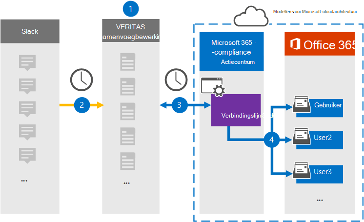

# Een connector instellen voor het archiveren van Slack eDiscovery-gegevensSet up a connector to archive Slack eDiscovery data

Gebruik een Veritas-connector in het Microsoft 365 compliancecentrum om gegevens van derden uit sociale media, chat- en documentsamenwerkingsplatforms te importeren en te archiveren in postvakken in uw Microsoft 365 organisatie.Use a Veritas connector in the Microsoft 365 compliance center to import and archive third-party data from social media, instant messaging, and document collaboration platforms to mailboxes in your Microsoft 365 organization. Veritas biedt een [Slack-connector](https://globanet.com/slack/) die is geconfigureerd om items uit de gegevensbron van derden vast te leggen (op regelmatige basis) en deze items vervolgens te importeren in Microsoft 365.Veritas provides a [Slack](https://globanet.com/slack/) connector that's configured to capture items from the third-party data source (on a regular basis) and then import those items to Microsoft 365. Slack haalt berichten en bestanden uit de Slack-API en converteert deze naar een e-mailberichtindeling en importeert het item vervolgens in postvakken van gebruikers.Slack pulls messages and files from the Slack API and converts them to an email message format and then imports the item to user mailboxes.

Nadat Slack eDiscovery-gegevens zijn opgeslagen in gebruikerspostvakken, kunt u Microsoft 365 compliancefuncties toepassen, zoals Litigation Hold, eDiscovery, bewaarbeleid en bewaarlabels en communicatie compliance.After Slack eDiscovery data is stored in user mailboxes, you can apply Microsoft 365 compliance features such as Litigation Hold, eDiscovery, retention policies and retention labels, and communication compliance. Als u een Slack-connector gebruikt voor het importeren en archiveren van gegevens in Microsoft 365 uw organisatie kan voldoen aan overheids- en regelgevingsbeleid.Using a Slack connector to import and archive data in Microsoft 365 can help your organization stay compliant with government and regulatory policies.

## Overzicht van het archiveren van Slack eDiscovery-gegevensOverview of archiving Slack eDiscovery data

In het volgende overzicht wordt uitgelegd hoe het gebruik van een verbindingslijn wordt gebruikt om de Slack-informatie in Microsoft 365.The following overview explains the process of using a connector to archive the Slack information in Microsoft 365.

1. Uw organisatie werkt met Slack om een Slack-site in te stellen en te configureren.Your organization works with Slack to set up and configure a Slack site.

2. Eens in de 24 uur worden chatberichten van Slack eDiscovery gekopieerd naar de Veritas Merge1-site.Once every 24 hours, chat messages from Slack eDiscovery are copied to the Veritas Merge1 site. De connector converteert ook de inhoud van een chatbericht naar een e-mailberichtindeling.The connector also converts the content of a chat message to an email message format.

3. De Slack eDiscovery-connector die u maakt in het Microsoft 365-compliancecentrum, maakt elke dag verbinding met de Veritas Merge1-site en brengt de chatberichten over naar een veilige Azure Storage-locatie in de Microsoft-cloud.The Slack eDiscovery connector that you create in the Microsoft 365 compliance center, connects to the Veritas Merge1 site every day and transfers the chat messages to a secure Azure Storage location in the Microsoft cloud.

4. De connector importeert de geconverteerde chatberichten in de postvakken van specifieke gebruikers met behulp van de waarde van de eigenschap *E-mail* en automatische gebruikerstoewijzing, zoals beschreven in stap 3.The connector imports the converted chat message items to the mailboxes of specific users using the value of the *Email* property and automatic user mapping, as described in Step 3. Er wordt een nieuwe submap in de map Postvak IN met de naam **Slack eDiscovery** gemaakt in de postvakken van gebruikers en de chatberichtenitems worden geïmporteerd in die map.A new subfolder in the Inbox folder named **Slack eDiscovery** is created in the user mailboxes, and the chat message items are imported to that folder. De verbindingslijn bepaalt in welk postvak items moeten worden geïmporteerd met behulp van de waarde van de eigenschap *E-mail.*The connector determines which mailbox to import items to by using the value of the *Email* property. Elk chatbericht bevat deze eigenschap, die wordt gevuld met het e-mailadres van elke deelnemer aan het chatbericht.Every chat message contains this property, which is populated with the email address of every participant of the chat message.

## Voordat u begintBefore you begin

- Maak een Veritas Merge1-account voor Microsoft-connectors.Create a Veritas Merge1 account for Microsoft connectors. Neem contact op met [Veritas Customer Support](https://globanet.com/ms-connectors-contact)om een account te maken.To create an account, contact [Veritas Customer Support](https://globanet.com/ms-connectors-contact). U meld u aan bij dit account wanneer u de verbindingslijn maakt in stap 1.You will sign into this account when you create the connector in Step 1.

- Verkrijg de gebruikersnaam en het wachtwoord voor het Slack Enterprise-account van uw organisatie.Obtain the username and password for your organization's Slack enterprise account. U moet zich aanmelden bij dit account in stap 2 wanneer u Slack configureert.You'll need to sign into this account in Step 2 when you configure Slack.

- De gebruiker die de Slack eDiscovery-connector maakt in stap 1 (en deze voltooit in stap 3), moet worden toegewezen aan de rol Postvak importeren exporteren in Exchange Online.The user who creates the Slack eDiscovery connector in Step 1 (and completes it in Step 3) must be assigned to the Mailbox Import Export role in Exchange Online. Deze rol is vereist om verbindingslijnen toe te voegen op de pagina **Gegevensconnectors** in het Microsoft 365 compliancecentrum.This role is required to add connectors on the **Data connectors** page in the Microsoft 365 compliance center. Deze rol is standaard niet toegewezen aan een rollengroep in Exchange Online.By default, this role is not assigned to a role group in Exchange Online. U kunt de rol Postvak importeren exporteren toevoegen aan de rollengroep Organisatiebeheer in Exchange Online.You can add the Mailbox Import Export role to the Organization Management role group in Exchange Online. U kunt ook een rollengroep maken, de rol Postvak importeren exporteren toewijzen en vervolgens de juiste gebruikers toevoegen als leden.Or you can create a role group, assign the Mailbox Import Export role, and then add the appropriate users as members. Zie de secties  Rollengroepen  maken of Rollengroepen wijzigen in het artikel 'Rollengroepen beheren in Exchange Online'.For more information, see the [Create role groups](/Exchange/permissions-exo/role-groups#create-role-groups) or [Modify role groups](/Exchange/permissions-exo/role-groups#modify-role-groups) sections in the article "Manage role groups in Exchange Online".

## Stap 1: De Slack eDiscovery-connector instellenStep 1: Set up the Slack eDiscovery connector

De eerste stap is toegang tot de pagina Gegevensconnectoren in het Microsoft 365 compliancecentrum en een **verbindingslijn** maken voor Slack-gegevens.The first step is to access to the **Data Connectors** page in the Microsoft 365 compliance center and create a connector for Slack data.

1. Ga naar [https://compliance.microsoft.com](https://compliance.microsoft.com/) en klik vervolgens op **Gegevensconnectoren**  >  **Slack eDiscovery**.Go to [https://compliance.microsoft.com](https://compliance.microsoft.com/) and then click **Data connectors** > **Slack eDiscovery**.

2. Klik op **de pagina Productbeschrijving van Slack eDiscovery** op **Verbindingslijn toevoegen.**On the **Slack eDiscovery** product description page, click **Add connector**.

3. Klik op **de pagina Servicevoorwaarden** op **Accepteren.**On the **Terms of service** page, click **Accept**.

4. Voer een unieke naam in die de verbindingslijn identificeert en klik vervolgens op **Volgende.**Enter a unique name that identifies the connector, and then click **Next**.

5. Meld u aan bij uw Merge1-account om de verbindingslijn te configureren.Sign in to your Merge1 account to configure the connector.

## Stap 2: Slack eDiscovery configurerenStep 2: Configure Slack eDiscovery

De tweede stap is het configureren van de Slack eDiscovery-connector op de site Samenvoegen1.The second step is to configure the Slack eDiscovery connector on the Merge1 site. Zie Gebruikershandleiding voor connectors van derden [samenvoegen1](https://docs.ms.merge1.globanetportal.com/Merge1%20Third-Party%20Connectors%20Slack%20eDiscovery%20User%20Guide.pdf)voor meer informatie over het configureren van de Slack eDiscovery-connector op de site Veritas Merge1.For more information about how to configure the Slack eDiscovery connector on the Veritas Merge1 site, see [Merge1 Third-Party Connectors User Guide](https://docs.ms.merge1.globanetportal.com/Merge1%20Third-Party%20Connectors%20Slack%20eDiscovery%20User%20Guide.pdf).

Nadat u op **Opslaan &** Voltooien  hebt geklikt, wordt de pagina Gebruikerstoewijzing in de wizard verbindingslijn in het Microsoft 365 compliancecentrum weergegeven.After you click **Save & Finish**, the **User mapping** page in the connector wizard in the Microsoft 365 compliance center is displayed.

## Stap 3: Gebruikers in kaart brengen en de configuratie van de connector voltooienStep 3: Map users and complete the connector setup

1. Schakel op **de pagina Externe gebruikers toewijzen Microsoft 365 gebruikers in,** automatische gebruikerstoewijzing in.On the **Map external users to Microsoft 365 users** page, enable automatic user mapping.

   Slack eDiscovery-items bevatten een eigenschap met de naam *E-mail,* die e-mailadressen bevat voor gebruikers in uw organisatie.Slack eDiscovery items include a property called *Email*, which contains email addresses for users in your organization. Als de verbindingslijn dit adres kan koppelen aan Microsoft 365 gebruiker, worden de items geïmporteerd in het postvak van die gebruiker.If the connector can associate this address with a Microsoft 365 user, the items are imported to that user's mailbox.

2. Klik **op Volgende,** bekijk uw instellingen en ga naar de pagina Gegevensconnectors om de voortgang van het importproces voor de nieuwe **verbindingslijn** te bekijken.Click **Next**, review your settings, and go to the **Data connectors** page to see the progress of the import process for the new connector.

## Stap 4: De Slack eDiscovery-connector controlerenStep 4: Monitor the Slack eDiscovery connector

Nadat u de Slack eDiscovery-verbindingslijn hebt gebruikt, kunt u de verbindingslijnstatus weergeven in het Microsoft 365 compliancecentrum.After you create the Slack eDiscovery connector, you can view the connector status in the Microsoft 365 compliance center.

1. Ga naar [https://compliance.microsoft.com](https://compliance.microsoft.com) en klik op **Gegevensconnectoren** in het linkernavigatievenster.Go to [https://compliance.microsoft.com](https://compliance.microsoft.com) and click **Data connectors** in the left nav.

2. Klik op **het tabblad Verbindingslijnen** en selecteer vervolgens de **Slack eDiscovery-connector** om de flyoutpagina weer te geven.Click the **Connectors** tab and then select the **Slack eDiscovery** connector to display the flyout page. Deze pagina bevat de eigenschappen en informatie over de verbindingslijn.This page contains the properties and information about the connector.

3. Klik **onder Verbindingsstatus met bron** op de koppeling Logboek **downloaden** om het statuslogboek voor de verbindingslijn te openen (of op te slaan).Under **Connector status with source**, click the **Download log** link to open (or save) the status log for the connector. Dit logboek bevat informatie over de gegevens die zijn geïmporteerd in de Microsoft-cloud.This log contains information about the data that has been imported to the Microsoft cloud.

## Bekende problemenKnown issues

- Op dit moment bieden we geen ondersteuning voor het importeren van bijlagen of items die groter zijn dan 10 MB.At this time, we don't support importing attachments or items that are larger than 10 MB. Ondersteuning voor grotere items is op een later tijdstip beschikbaar.Support for larger items will be available at a later date.