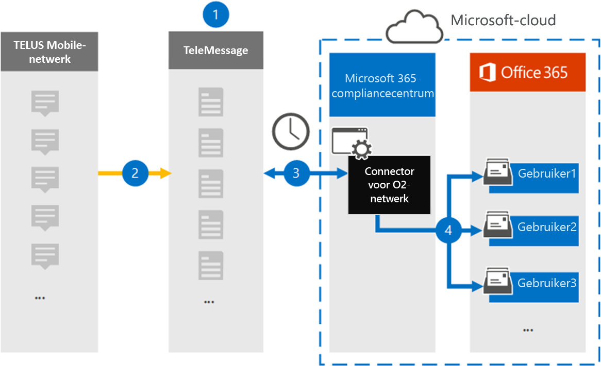

# Een verbindingslijn instellen voor het archiveren van TELUS-netwerkgegevens

Gebruik de TeleMessage-connector in het Microsoft 365 compliancecentrum om gegevens van de Short Messaging Service (Sms) uit het TELUS-netwerk van uw organisatie te importeren en te archiveren. Nadat u een verbindingslijn hebt ingesteld en geconfigureerd, wordt er eenmaal per dag verbinding met het TELUS-netwerk van uw organisatie en worden Sms gegevens geïmporteerd in postvakken in Microsoft 365.

Nadat Sms berichten zijn opgeslagen in postvakken van gebruikers, kunt u Microsoft 365 compliancefuncties zoals Proces bewaring, Inhoud zoeken en Microsoft 365 op TELUS-gegevens toepassen. U kunt bijvoorbeeld zoeken in TELUS Sms berichten met Inhoud zoeken of het postvak met de TELUS-gegevens koppelen aan een bewaarder in een Advanced eDiscovery geval. Als u een TELUS-netwerkconnector gebruikt om gegevens te importeren en te archiveren in Microsoft 365 kan uw organisatie voldoen aan overheids- en regelgevingsbeleid.

## Overzicht van het archiveren van TELUS-netwerkgegevens

In het volgende overzicht wordt uitgelegd hoe het gebruik van een verbindingslijn voor het archiveren van TELUS-netwerkgegevens in Microsoft 365.

1. Uw organisatie werkt met TeleMessage en TELUS om een TELUS-netwerkconnector in te stellen. Zie [TELUS Network Archiver](https://www.telemessage.com/office365-activation-for-telus-network-archiver/)voor meer informatie.

2. In realtime worden Sms berichten van het TELUS-netwerk van uw organisatie gekopieerd naar de TeleMessage-site.

3. De TELUS-netwerkconnector die u in het Microsoft 365-compliancecentrum maakt, maakt elke dag verbinding met de TeleMessage-site en brengt de Sms-berichten van de afgelopen 24 uur over naar een veilige Azure Storage-locatie in de Microsoft-cloud. De connector converteert ook de inhoud van Sms berichten naar een e-mailberichtindeling.

4. De verbindingslijn importeert de mobiele communicatie-items naar het postvak van een specifieke gebruiker. Er wordt een nieuwe map **met de Sms Netwerkarchiver** gemaakt in het postvak van de specifieke gebruiker en de items worden er in geïmporteerd. De verbindingslijn wordt toegewezen met behulp van de waarde van de eigenschap *E-mailadres van de* gebruiker. Elk Sms bevat deze eigenschap, die wordt gevuld met het e-mailadres van elke deelnemer van het Sms bericht.

   Naast automatische gebruikerstoewijzing met  de waarde van de eigenschap E-mailadres van de gebruiker, kunt u ook aangepaste toewijzing implementeren door een CSV-toewijzingsbestand te uploaden. Dit toewijzingsbestand bevat het mobiele telefoonnummer en het bijbehorende Microsoft 365 e-mailadres voor gebruikers in uw organisatie. Als u zowel automatische gebruikerstoewijzing als aangepaste toewijzing inschakelen, wordt voor elk TELUS-item eerst naar aangepast toewijzingsbestand gesurfd. Als er geen geldige Microsoft 365-gebruiker wordt gevonden die overeenkomt met het mobiele telefoonnummer van een gebruiker, gebruikt de verbindingslijn de waarden in de eigenschap e-mailadres van het item dat het probeert te importeren. Als de verbindingslijn geen geldige Microsoft 365 in het aangepaste toewijzingsbestand of in de eigenschap e-mailadres van het TELUS-item vindt, wordt het item niet geïmporteerd.

## Voordat u een verbindingslijn in stelt

Sommige implementatiestappen die nodig zijn om TELUS-netwerkgegevens te archiveren, zijn extern Microsoft 365 en moeten zijn voltooid voordat u een verbindingslijn kunt maken in het compliancecentrum.

- Bestel de [TELUS Network Archiver-service bij TeleMessage](https://www.telemessage.com/mobile-archiver/order-mobile-archiver-for-o365) en ontvang een geldig beheeraccount voor uw organisatie. U moet zich aanmelden bij dit account wanneer u de verbindingslijn maakt in het compliancecentrum.

- Verkrijg uw TELUS-netwerkaccount en factureringscontactgegevens, zodat u de onboardingformulieren voor TeleMessage kunt invullen en de berichtarchiveringsservice kunt bestellen bij TELUS.

- Registreer alle gebruikers die TELUS-Sms netwerkarchivering vereisen in het TeleMessage-account. Wanneer u gebruikers registreert, moet u hetzelfde e-mailadres gebruiken dat wordt gebruikt voor hun Microsoft 365 account.

- Uw werknemers moeten mobiele telefoons in het mobiele netwerk vanTELUS hebben die eigendom zijn van uw bedrijf en die aansprakelijk zijn voor bedrijven. Het archiveren van berichten in Microsoft 365 is niet beschikbaar voor BYOD-apparaten (Bring Your Own Devices).

- De gebruiker die een TELUS-netwerkconnector maakt, moet de rol Postvak importeren exporteren in Exchange Online. Dit is vereist om verbindingslijnen toe te voegen op de pagina **Gegevensconnectors** in het Microsoft 365 compliancecentrum. Deze rol is standaard niet toegewezen aan een rollengroep in Exchange Online. U kunt de rol Postvak importeren exporteren toevoegen aan de rollengroep Organisatiebeheer in Exchange Online. U kunt ook een rollengroep maken, de rol Postvak importeren exporteren toewijzen en vervolgens de juiste gebruikers toevoegen als leden. Zie de secties  Rollengroepen  maken of Rollengroepen wijzigen in het artikel 'Rollengroepen beheren in Exchange Online'.

- Deze gegevensconnector is beschikbaar in GCC omgevingen in de Microsoft 365 amerikaanse overheidscloud. Toepassingen en services van derden kunnen betrekking hebben op het opslaan, verzenden en verwerken van klantgegevens van uw organisatie op systemen van derden die buiten de Microsoft 365-infrastructuur vallen en daarom niet worden gedekt door de toezeggingen van Microsoft 365 compliance en gegevensbescherming. Microsoft geeft niet aan dat het gebruik van dit product om verbinding te maken met toepassingen van derden betekent dat deze toepassingen van derden compatibel zijn met FEDRAMP.

## Een TELUS-netwerkconnector maken

Nadat u de vereisten hebt voltooid die in de vorige sectie zijn beschreven, kunt u verbindingslijn TELUS-netwerk maken in het Microsoft 365 compliancecentrum. De verbindingslijn gebruikt de informatie die u verstrekt om verbinding te maken met de TeleMessage-site en Sms berichten over te brengen naar de bijbehorende postvakken van gebruikers in Microsoft 365.

1. Ga naar [https://compliance.microsoft.com](https://compliance.microsoft.com/) en klik vervolgens op **Gegevensconnectoren**  >  **TELUS Network**.

2. Klik op **de pagina productbeschrijving** van TELUS Network op **Verbindingslijn toevoegen**

3. Klik op **de pagina Servicevoorwaarden** op **Accepteren.**

4. Voer op de pagina Aanmelden bij **TeleMessage** onder Stap 3 de vereiste informatie in de volgende vakken in en klik vervolgens op **Volgende**.

   - **Gebruikersnaam:** Uw TeleMessage-gebruikersnaam.

   - **Wachtwoord:** Uw TeleMessage-wachtwoord.

5. Nadat de verbindingslijn is gemaakt, kunt u het pop-upvenster sluiten en naar de volgende pagina gaan.

6. Schakel op **de pagina Gebruikerstoewijzing** automatische gebruikerstoewijzing in en klik op **Volgende.** Als u aangepaste toewijzing nodig hebt, uploadt u een CSV-bestand en klikt u op **Volgende.**

7. Controleer de instellingen en klik vervolgens op **Voltooien om** de verbindingslijn te maken.

8. Ga naar het tabblad Connectors op de pagina **Gegevensconnectors** om de voortgang van het importproces voor de nieuwe verbindingslijn te bekijken.

## Bekende problemen

- Op dit moment bieden we geen ondersteuning voor het importeren van bijlagen of items die groter zijn dan 10 MB. Ondersteuning voor grotere items is op een later tijdstip beschikbaar.
