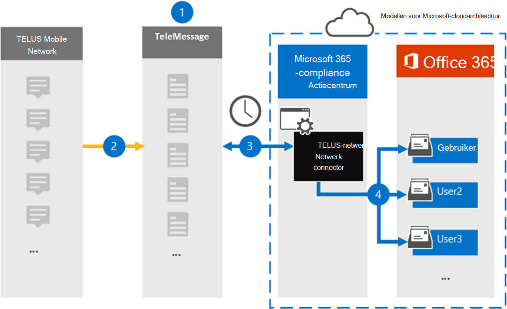

# Een verbindingslijn instellen voor het archiveren van TELUS-netwerkgegevensSet up a connector to archive TELUS Network data

Gebruik de TeleMessage-connector in het Microsoft 365 compliancecentrum om gegevens van de Short Messaging Service (Sms) uit het TELUS-netwerk van uw organisatie te importeren en te archiveren.Use the TeleMessage connector in the Microsoft 365 compliance center to import and archive Short Messaging Service (SMS) data from your organization's TELUS Network. Nadat u een verbindingslijn hebt ingesteld en geconfigureerd, wordt er eenmaal per dag verbinding met het TELUS-netwerk van uw organisatie en worden Sms gegevens geïmporteerd in postvakken in Microsoft 365.After you set up and configure a connector, it connects to your organization's TELUS Network once every day, and imports SMS data to mailboxes in Microsoft 365.

Nadat Sms berichten zijn opgeslagen in postvakken van gebruikers, kunt u Microsoft 365 compliancefuncties zoals Proces bewaring, Inhoud zoeken en Microsoft 365 op TELUS-gegevens toepassen.After SMS messages are stored in user mailboxes, you can apply Microsoft 365 compliance features such as Litigation Hold, Content Search, and Microsoft 365 retention policies to TELUS data. U kunt bijvoorbeeld zoeken in TELUS Sms berichten met Inhoud zoeken of het postvak met de TELUS-gegevens koppelen aan een bewaarder in een Advanced eDiscovery geval.For example, you can search TELUS SMS messages using Content Search or associate the mailbox that contains the TELUS data with a custodian in an Advanced eDiscovery case. Als u een TELUS-netwerkconnector gebruikt om gegevens te importeren en te archiveren in Microsoft 365 kan uw organisatie voldoen aan overheids- en regelgevingsbeleid.Using a TELUS Network connector to import and archive data in Microsoft 365 can help your organization stay compliant with government and regulatory policies.

## Overzicht van het archiveren van TELUS-netwerkgegevensOverview of archiving TELUS Network data

In het volgende overzicht wordt uitgelegd hoe het gebruik van een verbindingslijn voor het archiveren van TELUS-netwerkgegevens in Microsoft 365.The following overview explains the process of using a connector to archive TELUS Network data in Microsoft 365.

1. Uw organisatie werkt met TeleMessage en TELUS om een TELUS-netwerkconnector in te stellen.Your organization works with TeleMessage and TELUS to set up a TELUS Network connector. Zie [TELUS Network Archiver](https://www.telemessage.com/office365-activation-for-telus-network-archiver/)voor meer informatie.For more information, see [TELUS Network Archiver](https://www.telemessage.com/office365-activation-for-telus-network-archiver/).

2. In realtime worden Sms berichten van het TELUS-netwerk van uw organisatie gekopieerd naar de TeleMessage-site.In real time, SMS messages from your organization's TELUS Network are copied to the TeleMessage site.

3. De TELUS-netwerkconnector die u in het Microsoft 365-compliancecentrum maakt, maakt elke dag verbinding met de TeleMessage-site en brengt de Sms-berichten van de afgelopen 24 uur over naar een veilige Azure Storage-locatie in de Microsoft-cloud.The TELUS Network connector that you create in the Microsoft 365 compliance center connects to the TeleMessage site every day and transfers the SMS messages from the previous 24 hours to a secure Azure Storage location in the Microsoft cloud. De connector converteert ook de inhoud van Sms berichten naar een e-mailberichtindeling.The connector also converts the content of SMS messages to an email message format.

4. De verbindingslijn importeert de mobiele communicatie-items naar het postvak van een specifieke gebruiker.The connector imports the mobile communication items to the mailbox of a specific user. Er wordt een nieuwe map **met de Sms Netwerkarchiver** gemaakt in het postvak van de specifieke gebruiker en de items worden er in geïmporteerd.A new folder named **TELUS SMS Network Archiver** is created in the specific user's mailbox and the items are imported to it. De verbindingslijn wordt toegewezen met behulp van de waarde van de eigenschap *E-mailadres van de* gebruiker.The connector does mapping by using the value of the *User's Email address* property. Elk Sms bevat deze eigenschap, die wordt gevuld met het e-mailadres van elke deelnemer van het Sms bericht.Every SMS message contains this property, which is populated with the email address of every participant of the SMS message.

   Naast automatische gebruikerstoewijzing met  de waarde van de eigenschap E-mailadres van de gebruiker, kunt u ook aangepaste toewijzing implementeren door een CSV-toewijzingsbestand te uploaden.In addition to automatic user mapping using the value of the *User’s Email address* property, you can also implement custom mapping by uploading a CSV mapping file. Dit toewijzingsbestand bevat het mobiele telefoonnummer en het bijbehorende Microsoft 365 e-mailadres voor gebruikers in uw organisatie.This mapping file contains the mobile phone number and corresponding Microsoft 365 email address for users in your organization. Als u zowel automatische gebruikerstoewijzing als aangepaste toewijzing inschakelen, wordt voor elk TELUS-item eerst naar aangepast toewijzingsbestand gesurfd.If you enable both automatic user mapping and custom mapping, for every TELUS item the connector first looks at custom mapping file. Als er geen geldige Microsoft 365-gebruiker wordt gevonden die overeenkomt met het mobiele telefoonnummer van een gebruiker, gebruikt de verbindingslijn de waarden in de eigenschap e-mailadres van het item dat het probeert te importeren.If it doesn't find a valid Microsoft 365 user that corresponds to a user's mobile phone number, the connector will use the values in the email address property of the item it's trying to import. Als de verbindingslijn geen geldige Microsoft 365 in het aangepaste toewijzingsbestand of in de eigenschap e-mailadres van het TELUS-item vindt, wordt het item niet geïmporteerd.If the connector doesn't find a valid Microsoft 365 user in either the custom mapping file or in the email address property of the TELUS item, the item won't be imported.

## Voordat u een verbindingslijn in steltBefore you set up a connector

Sommige implementatiestappen die nodig zijn om TELUS-netwerkgegevens te archiveren, zijn extern Microsoft 365 en moeten zijn voltooid voordat u een verbindingslijn kunt maken in het compliancecentrum.Some of the implementation steps required to archive TELUS Network data are external to Microsoft 365 and must be completed before you can create a connector in the compliance center.

- Bestel de [TELUS Network Archiver-service bij TeleMessage](https://www.telemessage.com/mobile-archiver/order-mobile-archiver-for-o365) en ontvang een geldig beheeraccount voor uw organisatie.Order the [TELUS Network Archiver service from TeleMessage](https://www.telemessage.com/mobile-archiver/order-mobile-archiver-for-o365) and get a valid administration account for your organization. U moet zich aanmelden bij dit account wanneer u de verbindingslijn maakt in het compliancecentrum.You'll need to sign into this account when you create the connector in the compliance center.

- Verkrijg uw TELUS-netwerkaccount en factureringscontactgegevens, zodat u de onboardingformulieren voor TeleMessage kunt invullen en de berichtarchiveringsservice kunt bestellen bij TELUS.Obtain your TELUS Network account and billing contact details so you can fill-out the TeleMessage onboarding forms and order the message archiving service from TELUS.

- Registreer alle gebruikers die TELUS-Sms netwerkarchivering vereisen in het TeleMessage-account.Register all users that require TELUS SMS Network archiving in the TeleMessage account. Wanneer u gebruikers registreert, moet u hetzelfde e-mailadres gebruiken dat wordt gebruikt voor hun Microsoft 365 account.When registering users, be sure to use the same email address that's used for their Microsoft 365 account.

- Uw werknemers moeten mobiele telefoons in het mobiele netwerk vanTELUS hebben die eigendom zijn van uw bedrijf en die aansprakelijk zijn voor bedrijven.Your employees must have corporate-owned and corporate-liable mobile phones on theTELUS mobile network. Het archiveren van berichten in Microsoft 365 is niet beschikbaar voor BYOD-apparaten (Bring Your Own Devices).Archiving messages in Microsoft 365 isn't available for employee-owned or Bring Your Own Devices (BYOD) devices.

- De gebruiker die een TELUS-netwerkconnector maakt, moet de rol Postvak importeren exporteren in Exchange Online.The user who creates a TELUS Network connector must be assigned the Mailbox Import Export role in Exchange Online. Dit is vereist om verbindingslijnen toe te voegen op de pagina **Gegevensconnectors** in het Microsoft 365 compliancecentrum.This is required to add connectors in the **Data connectors** page in the Microsoft 365 compliance center. Deze rol is standaard niet toegewezen aan een rollengroep in Exchange Online.By default, this role isn't assigned to any role group in Exchange Online. U kunt de rol Postvak importeren exporteren toevoegen aan de rollengroep Organisatiebeheer in Exchange Online.You can add the Mailbox Import Export role to the Organization Management role group in Exchange Online. U kunt ook een rollengroep maken, de rol Postvak importeren exporteren toewijzen en vervolgens de juiste gebruikers toevoegen als leden.Or you can create a role group, assign the Mailbox Import Export role, and then add the appropriate users as members. Zie de secties  Rollengroepen  maken of Rollengroepen wijzigen in het artikel 'Rollengroepen beheren in Exchange Online'.For more information, see the [Create role groups](/Exchange/permissions-exo/role-groups#create-role-groups) or [Modify role groups](/Exchange/permissions-exo/role-groups#modify-role-groups) sections in the article "Manage role groups in Exchange Online".

- Deze gegevensconnector is beschikbaar in GCC omgevingen in de Microsoft 365 amerikaanse overheidscloud.This data connector is available in GCC environments in the Microsoft 365 US Government cloud. Toepassingen en services van derden kunnen betrekking hebben op het opslaan, verzenden en verwerken van klantgegevens van uw organisatie op systemen van derden die buiten de Microsoft 365-infrastructuur vallen en daarom niet worden gedekt door de toezeggingen van Microsoft 365 compliance en gegevensbescherming.Third-party applications and services might involve storing, transmitting, and processing your organization's customer data on third-party systems that are outside of the Microsoft 365 infrastructure and therefore are not covered by the Microsoft 365 compliance and data protection commitments. Microsoft geeft niet aan dat het gebruik van dit product om verbinding te maken met toepassingen van derden betekent dat deze toepassingen van derden compatibel zijn met FEDRAMP.Microsoft makes no representation that use of this product to connect to third-party applications implies that those third-party applications are FEDRAMP compliant.

## Een TELUS-netwerkconnector makenCreate a TELUS Network connector

Nadat u de vereisten hebt voltooid die in de vorige sectie zijn beschreven, kunt u verbindingslijn TELUS-netwerk maken in het Microsoft 365 compliancecentrum.After you've completed the prerequisites described in the previous section, you can create TELUS Network connector in the Microsoft 365 compliance center. De verbindingslijn gebruikt de informatie die u verstrekt om verbinding te maken met de TeleMessage-site en Sms berichten over te brengen naar de bijbehorende postvakken van gebruikers in Microsoft 365.The connector uses the information you provide to connect to the TeleMessage site and transfer SMS messages to the corresponding user mailbox boxes in Microsoft 365.

1. Ga naar [https://compliance.microsoft.com](https://compliance.microsoft.com/) en klik vervolgens op **Gegevensconnectoren**  >  **TELUS Network**.Go to [https://compliance.microsoft.com](https://compliance.microsoft.com/) and then click **Data connectors** > **TELUS Network**.

2. Klik op **de pagina productbeschrijving** van TELUS Network op **Verbindingslijn toevoegen**On the **TELUS Network** product description page, click **Add connector**

3. Klik op **de pagina Servicevoorwaarden** op **Accepteren.**On the **Terms of service** page, click **Accept**.

4. Voer op de pagina Aanmelden bij **TeleMessage** onder Stap 3 de vereiste informatie in de volgende vakken in en klik vervolgens op **Volgende**.On the **Login to TeleMessage** page, under Step 3, enter the required information in the following boxes and then click **Next**.

   - **Gebruikersnaam:** Uw TeleMessage-gebruikersnaam.**Username:** Your TeleMessage username.

   - **Wachtwoord:** Uw TeleMessage-wachtwoord.**Password:** Your TeleMessage password.

5. Nadat de verbindingslijn is gemaakt, kunt u het pop-upvenster sluiten en naar de volgende pagina gaan.After the connector is created, you can close the pop-up window and go to the next page.

6. Schakel op **de pagina Gebruikerstoewijzing** automatische gebruikerstoewijzing in en klik op **Volgende.**On the **User mapping** page, enable automatic user mapping and click **Next**. Als u aangepaste toewijzing nodig hebt, uploadt u een CSV-bestand en klikt u op **Volgende.**In case you need custom mapping upload a CSV file, and click **Next**.

7. Controleer de instellingen en klik vervolgens op **Voltooien om** de verbindingslijn te maken.Review your settings, and then click **Finish** to create the connector.

8. Ga naar het tabblad Connectors op de pagina **Gegevensconnectors** om de voortgang van het importproces voor de nieuwe verbindingslijn te bekijken.Go to the Connectors tab in **Data connectors** page to see the progress of the import process for the new connector.

## Bekende problemenKnown issues

- Op dit moment bieden we geen ondersteuning voor het importeren van bijlagen of items die groter zijn dan 10 MB.At this time, we don't support importing attachments or items that are larger than 10 MB. Ondersteuning voor grotere items is op een later tijdstip beschikbaar.Support for larger items will be available at a later date.
