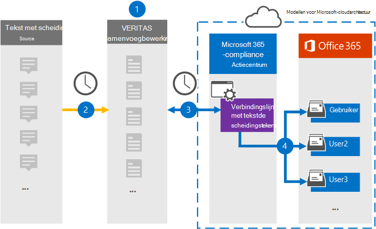

# Een verbindingslijn instellen voor het archiveren van gegevens met tekstSet up a connector to archive text-delimited data

Gebruik een Veritas-verbindingslijn in het Microsoft 365 compliancecentrum om tekst met scheidingstekens te importeren en te archiveren in gebruikerspostvakken in uw Microsoft 365 organisatie.Use a Veritas connector in the Microsoft 365 compliance center to import and archive text-delimited data to user mailboxes in your Microsoft 365 organization. Veritas biedt  een verbindingslijn met tekst die is geconfigureerd om items uit een externe gegevensbron vast te leggen (op regelmatige basis) en deze items te importeren in Microsoft 365.Veritas provides a [text-delimited connector](https://globanet.com/text-delimited) that's configured to capture items from a third-party data source (on a regular basis) and import those items to Microsoft 365. De verbindingslijn converteert inhoud van de gegevensbron met tekst naar een e-mailberichtindeling en importeert deze items vervolgens in het postvak van de gebruiker in Microsoft 365.The connector converts content from the text-delimited data source to an email message format and then imports those items to the user's mailbox in Microsoft 365.

Nadat gegevens met tekst zijn opgeslagen in postvakken van gebruikers, kunt u Microsoft 365 compliancefuncties toepassen, zoals Litigation Hold, eDiscovery en bewaarbeleid en bewaarlabels.After text-delimited data is stored in user mailboxes, you can apply Microsoft 365 compliance features such as Litigation Hold, eDiscovery, and retention policies and retention labels. Als u een gegevensconnector met tekst scheidingstekens gebruikt om gegevens te importeren en te archiveren in Microsoft 365 kan uw organisatie voldoen aan het overheids- en regelgevingsbeleid.Using a text-delimited data connector to import and archive data in Microsoft 365 can help your organization stay compliant with government and regulatory policies.

## Overzicht van het archiveren van de gegevens met tekstde scheidingstekensOverview of archiving the text-delimited data

In het volgende overzicht wordt uitgelegd hoe u een verbindingslijn gebruikt om brongegevens met tekst te archiveren in Microsoft 365.The following overview explains the process of using a connector to archive text-delimited source information in Microsoft 365.

1. Uw organisatie werkt met de bron met tekstde scheidingstekens om een site met tekst te configureren en te configureren.Your organization works with the text-delimited source to set up and configure a text-delimited site.

2. Eens in de 24 uur worden chatberichten uit de bron met tekst scheidingstekens gekopieerd naar de Veritas Merge1-site.Once every 24 hours, chat messages from the text-delimited source are copied to the Veritas Merge1 site. De verbindingslijn converteert ook de inhoud naar een e-mailberichtindeling.The connector also converts the content to an email message format.

3. De verbindingslijn met tekst die u in het Microsoft 365-compliancecentrum maakt, maakt elke dag verbinding met de Veritas Merge1-site en brengt de berichten over naar een veilige Azure Storage-locatie in de Microsoft-cloud.The text-delimited connector that you create in the Microsoft 365 compliance center connects to the Veritas Merge1 site every day and transfers the messages to a secure Azure Storage location in the Microsoft cloud.

4. De connector importeert de geconverteerde berichtitems naar de postvakken van specifieke gebruikers met behulp van de waarde van de eigenschap *E-mail* van de automatische gebruikerstoewijzing, zoals beschreven in stap 3.The connector imports the converted message items to the mailboxes of specific users using the value of the *Email* property of the automatic user mapping as described in Step 3. Er wordt een nieuwe submap gemaakt in de map Postvak IN met de naam **Tekst-** Scheidingstekens in de postvakken van de gebruiker en de berichtitems worden geïmporteerd in die map.A new subfolder in the Inbox folder named **Text- Delimited** is created in the user mailboxes, and the message items are imported to that folder. De verbindingslijn bepaalt in welk postvak items moeten worden geïmporteerd met behulp van de waarde van de eigenschap *E-mail.*The connector determines which mailbox to import items to by using the value of the *Email* property. Elk bericht bevat deze eigenschap, die wordt ingevuld met het e-mailadres van elke deelnemer.Every message contains this property, which is populated with the email address of every participant.

## Voordat u begintBefore you begin

- Maak een Veritas Merge1-account voor Microsoft-connectors.Create a Veritas Merge1 account for Microsoft connectors. Neem contact op met [Veritas Customer Support](https://globanet.com/ms-connectors-contact)om dit account te maken.To create this account, contact [Veritas Customer Support](https://globanet.com/ms-connectors-contact). U meld u aan bij dit account wanneer u de verbindingslijn maakt in stap 1.You will sign into this account when you create the connector in Step 1.

- De gebruiker die de verbindingslijn met tekst in stap 1 maakt (en deze voltooit in stap 3), moet worden toegewezen aan de rol Postvak importeren exporteren in Exchange Online.The user who creates the text-delimited connector in Step 1 (and completes it in Step 3) must be assigned to the Mailbox Import Export role in Exchange Online. Deze rol is vereist om verbindingslijnen toe te voegen op de pagina **Gegevensconnectors** in het Microsoft 365 compliancecentrum.This role is required to add connectors on the **Data connectors** page in the Microsoft 365 compliance center. Deze rol is standaard niet toegewezen aan een rollengroep in Exchange Online.By default, this role is not assigned to a role group in Exchange Online. U kunt de rol Postvak importeren exporteren toevoegen aan de rollengroep Organisatiebeheer in Exchange Online.You can add the Mailbox Import Export role to the Organization Management role group in Exchange Online. U kunt ook een rollengroep maken, de rol Postvak importeren exporteren toewijzen en vervolgens de juiste gebruikers toevoegen als leden.Or you can create a role group, assign the Mailbox Import Export role, and then add the appropriate users as members. Zie de secties  Rollengroepen  maken of Rollengroepen wijzigen in het artikel 'Rollengroepen beheren in Exchange Online'.For more information, see the [Create role groups](/Exchange/permissions-exo/role-groups#create-role-groups) or [Modify role groups](/Exchange/permissions-exo/role-groups#modify-role-groups) sections in the article "Manage role groups in Exchange Online".

## Stap 1: de verbindingslijn met tekst scheidingstekens instellenStep 1: Set up the text-delimited connector

De eerste stap is om toegang te krijgen tot de pagina Gegevensconnectoren in het Microsoft 365 compliancecentrum en een **verbindingslijn** te maken voor gegevens met tekst.scheidingstekens.The first step is to access to the **Data Connectors** page in the Microsoft 365 compliance center and create a connector for text-delimited data.

1. Ga naar [https://compliance.microsoft.com](https://compliance.microsoft.com/) en klik vervolgens op **Gegevensconnectoren**  >  **Tekst-scheidingstekens**.Go to [https://compliance.microsoft.com](https://compliance.microsoft.com/) and then click **Data connectors** > **Text-Delimited**.

2. Klik op **de pagina productbeschrijving** met tekst scheidingstekens op **Verbindingslijn toevoegen.**On the **text-delimited** product description page, click **Add connector**.

3. Klik op **de pagina Servicevoorwaarden** op **Accepteren.**On the **Terms of service** page, click **Accept**.

4. Voer een unieke naam in die de verbindingslijn identificeert en klik vervolgens op **Volgende.**Enter a unique name that identifies the connector, and then click **Next**.

5. Meld u aan bij uw Merge1-account om de verbindingslijn te configureren.Sign in to your Merge1 account to configure the connector.

## Stap 2: De verbindingslijn met tekst met scheidingstekens configureren op de Veritas Merge1-siteStep 2: Configure the Text-delimited connector on the Veritas Merge1 site

De tweede stap is het configureren van de verbindingslijn met tekst die is scheidingstekens op de site Samenvoegen1.The second step is to configure the text-delimited connector on the Merge1 site. Zie Handleiding Verbindingslijnen van derden samenvoegen voor informatie over het configureren van de [verbindingslijn](https://docs.ms.merge1.globanetportal.com/Merge1%20Third-Party%20Connectors%20text-delimited%20User%20Guide%20.pdf)met tekst die is scheidingstekens op de site Veritas Samenvoegen1.For information about configuring  the text-delimited connector on the Veritas Merge1 site, see [Merge1 Third-Party Connectors User Guide](https://docs.ms.merge1.globanetportal.com/Merge1%20Third-Party%20Connectors%20text-delimited%20User%20Guide%20.pdf).

Nadat u op **Opslaan &** Voltooien  hebt geklikt, wordt de pagina Gebruikerstoewijzing in de wizard verbindingslijn in het Microsoft 365 compliancecentrum weergegeven.After you click **Save & Finish**, the **User mapping** page in the connector wizard in the Microsoft 365 compliance center is displayed.

## Stap 3: Gebruikers in kaart brengen en de configuratie van de connector voltooienStep 3: Map users and complete the connector setup

Als u gebruikers wilt in kaart brengen en de configuratie van de verbindingslijn wilt voltooien in het Microsoft 365 compliancecentrum, volgt u de volgende stappen:To map users and complete the connector setup in the Microsoft 365 compliance center, follow these steps:

1. Schakel op **de pagina Externe gebruikers toewijzen Microsoft 365 gebruikers in,** automatische gebruikerstoewijzing in.On the **Map external users to Microsoft 365 users** page, enable automatic user mapping. De bronitems met tekst- scheidingstekens bevatten een eigenschap *met* de naam E-mail, die e-mailadressen bevat voor gebruikers in uw organisatie.The Text- Delimited source items include a property called *Email*, which contains email addresses for users in your organization. Als de verbindingslijn dit adres kan koppelen aan Microsoft 365 gebruiker, worden de items geïmporteerd in het postvak van die gebruiker.If the connector can associate this address with a Microsoft 365 user, the items are imported to that user’s mailbox.

2. Klik **op Volgende,** controleer uw instellingen en ga naar de pagina Gegevensconnectors om de voortgang van het importproces voor de nieuwe **verbindingslijn** te bekijken.Click **Next**, review your settings, and then go to the **Data connectors** page to see the progress of the import process for the new connector.

## Stap 4: De verbindingslijn met tekstde scheidingstekens controlerenStep 4: Monitor the text-delimited connector

Nadat u de verbindingslijn Tekst- scheidingstekens hebt maken, kunt u de verbindingslijnstatus weergeven in het Microsoft 365 compliancecentrum.After you create the Text- Delimited connector, you can view the connector status in the Microsoft 365 compliance center.

1. Ga naar [https://compliance.microsoft.com](https://compliance.microsoft.com) en klik op **Gegevensconnectoren** in het linkernavigatievenster.Go to [https://compliance.microsoft.com](https://compliance.microsoft.com) and click **Data connectors** in the left nav.

2. Klik op **het tabblad Verbindingslijnen** en selecteer vervolgens de **verbindingslijn Tekst- scheidingstekens** om de flyoutpagina weer te geven.Click the **Connectors** tab and then select the **Text- Delimited** connector to display the flyout page. Deze pagina bevat de eigenschappen en informatie over de verbindingslijn.This page contains the properties and information about the connector.

3. Klik **onder Verbindingsstatus met bron** op de koppeling Logboek **downloaden** om het statuslogboek voor de verbindingslijn te openen (of op te slaan).Under **Connector status with source**, click the **Download log** link to open (or save) the status log for the connector. Dit logboek bevat informatie over de gegevens die zijn geïmporteerd in de Microsoft-cloud.This log contains information about the data that has been imported to the Microsoft cloud.

## Bekende problemenKnown issues

- Op dit moment bieden we geen ondersteuning voor het importeren van bijlagen of items die groter zijn dan 10 MB.At this time, we don't support importing attachments or items that are larger than 10 MB. Ondersteuning voor grotere items is op een later tijdstip beschikbaar.Support for larger items will be available at a later date.