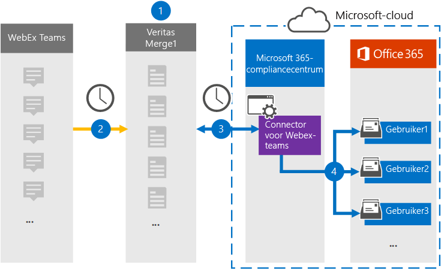

# Een verbindingslijn instellen om Webex-Teams archiveren

Gebruik een Veritas-connector in het Microsoft 365 compliancecentrum om gegevens uit Webex-Teams te importeren en te archiveren in gebruikerspostvakken in uw Microsoft 365 organisatie. Veritas biedt een [Webex-verbindingslijn Teams](https://globanet.com/webex-teams/) is geconfigureerd om Webex-Teams vast te leggen en te importeren in Microsoft 365. De verbindingslijn converteert inhoud van Webex Teams, zoals 1:1-chats, groepsgesprekken, kanaalgesprekken en bijlagen van het Webex-Teams-account van uw organisatie, naar een e-mailberichtindeling en importeert deze items vervolgens in het postvak van de gebruiker in Microsoft 365.

Nadat Webex Teams gegevens is opgeslagen in gebruikerspostvakken, kunt u Microsoft 365 compliancefuncties toepassen, zoals Litigation Hold, eDiscovery, bewaarbeleid en bewaarlabels en communicatie compliance. Als u een Webex-Teams voor het importeren en archiveren van gegevens in Microsoft 365 kan uw organisatie voldoen aan het overheids- en regelgevingsbeleid.

## Overzicht van het archiveren van Webex-Teams gegevens

In het volgende overzicht wordt uitgelegd hoe het gebruik van een verbindingslijn voor het archiveren van Webex-Teams gegevens in Microsoft 365.

1. Uw organisatie werkt samen met Webex Teams webex-site in te stellen en Teams configureren.

2. Elke 24 uur worden webex-Teams gekopieerd naar de Veritas Merge1-site. De connector converteert ook de Webex-Teams naar een e-mailberichtindeling.

3. De Webex Teams-connector die u maakt in het Microsoft 365-compliancecentrum, maakt elke dag verbinding met de Veritas Merge1 en draagt de Webex-Teams-items over naar een veilige Azure Storage-locatie in de Microsoft-cloud.

4. De connector importeert items naar de postvakken van specifieke gebruikers met behulp van de waarde van de eigenschap *E-mail* van de automatische gebruikerstoewijzing, zoals beschreven in [stap 3.](#step-3-map-users-and-complete-the-connector-setup) Een submap in de map Postvak IN met **de naam Webex Teams** wordt gemaakt in de gebruikerspostvakken en de items worden geïmporteerd in die map. De verbindingslijn doet dit met behulp van de waarde van de eigenschap *E-mail.* Elk Webex-Teams bevat deze eigenschap, die wordt gevuld met het e-mailadres van elke deelnemer van het item.

## Voordat u begint

- Maak een Veritas Merge1-account voor Microsoft-connectors. Neem contact op met [Veritas Customer Support](https://globanet.com/ms-connectors-contact)om dit account te maken. U meld u aan bij dit account wanneer u de verbindingslijn maakt in stap 1.

- Maak een toepassing op [https://developer.webex.com/](https://developer.webex.com) om gegevens op te halen uit uw Webex-Teams account. Zie Gebruikershandleiding voor connectors van derden samenvoegen [voor stapsgewijs](https://docs.ms.merge1.globanetportal.com/Merge1%20Third-Party%20Connectors%20Webex%20Teams%20User%20Guide%20.pdf) instructies over het maken van de toepassing

   Wanneer u deze toepassing maakt, genereert het Webex-platform een set unieke referenties. Deze referenties worden gebruikt in stap 2 wanneer u de Webex-Teams op de site Globale samenvoeging1 configureert.

- De gebruiker die de Webex-Teams maakt in stap 1 (en deze voltooit in stap 3), moet worden toegewezen aan de rol Postvak importeren in Exchange Online. Deze rol is vereist om verbindingslijnen toe te voegen op de pagina **Gegevensconnectors** in het Microsoft 365 compliancecentrum. Deze rol is standaard niet toegewezen aan een rollengroep in Exchange Online. U kunt de rol Postvak importeren exporteren toevoegen aan de rollengroep Organisatiebeheer in Exchange Online. U kunt ook een rollengroep maken, de rol Postvak importeren exporteren toewijzen en vervolgens de juiste gebruikers toevoegen als leden. Zie de secties  Rollengroepen  maken of Rollengroepen wijzigen in het artikel 'Rollengroepen beheren in Exchange Online'.

## Stap 1: De Webex-verbindingslijn Teams instellen

De eerste stap is om toegang te krijgen tot de **gegevensconnectoren** en de [Webex-verbindingslijn Teams](https://globanet.com/webex-teams/) instellen.

1. Ga naar [https://compliance.microsoft.com](https://compliance.microsoft.com/) en klik vervolgens op **Gegevensconnectors**  >  **Webex Teams.**

2. Klik op **de pagina Webex Teams** productbeschrijving op **Verbindingslijn toevoegen.**

3. Klik op **de pagina Servicevoorwaarden** op **Accepteren.**

4. Voer een unieke naam in die de verbindingslijn identificeert en klik vervolgens op **Volgende.**

5. Meld u aan bij uw Merge1-account om de verbindingslijn te configureren.

## Stap 2: De Webex-verbindingslijn Teams de Veritas Merge1-site configureren

De tweede stap is het configureren van de Webex-Teams verbindingslijn op de site Samenvoegen1. Zie Handleiding Connectors van derden samenvoegen voor informatie over het configureren van de [Webex-Teams](https://docs.ms.merge1.globanetportal.com/Merge1%20Third-Party%20Connectors%20Webex%20Teams%20User%20Guide%20.pdf)connector.

Nadat u op **Opslaan &** Voltooien  hebt geklikt, wordt de pagina Gebruikerstoewijzing in de wizard verbindingslijn in het Microsoft 365 compliancecentrum weergegeven.

## Stap 3: Gebruikers in kaart brengen en de configuratie van de connector voltooien

Als u gebruikers wilt in kaart brengen en de configuratie van de verbindingslijn wilt voltooien in het Microsoft 365 compliancecentrum, volgt u de volgende stappen:

1. Schakel op **de pagina Webex Teams gebruikers automatisch toewijzen Microsoft 365** gebruikers in. De Webex Teams items bevatten een eigenschap met de naam E-mail, die e-mailadressen bevat voor gebruikers in uw organisatie. Als de verbindingslijn dit adres kan koppelen aan Microsoft 365 gebruiker, worden de items geïmporteerd in het postvak van die gebruiker.

2. Klik **op Volgende,** controleer uw instellingen en ga naar de pagina Gegevensconnectors om de voortgang van het importproces voor de nieuwe **verbindingslijn** te bekijken.

## Stap 4: De Webex-verbindingslijn Teams controleren

Nadat u de Webex-verbindingslijn Teams, kunt u de verbindingslijnstatus weergeven in het Microsoft 365 compliancecentrum.

1. Ga naar [https://compliance.microsoft.com](https://compliance.microsoft.com) en klik op **Gegevensconnectoren** in het linkernavigatievenster.

2. Klik op **het tabblad Verbindingslijnen** en selecteer vervolgens de **Webex-Teams** verbindingslijn om de flyoutpagina weer te geven. Deze pagina bevat de eigenschappen en informatie over de verbindingslijn.

3. Klik **onder Verbindingsstatus met bron** op de koppeling Logboek **downloaden** om het statuslogboek voor de verbindingslijn te openen (of op te slaan). Dit logboek bevat informatie over de gegevens die zijn geïmporteerd in de Microsoft-cloud.

## Bekende problemen

- Op dit moment bieden we geen ondersteuning voor het importeren van bijlagen of items die groter zijn dan 10 MB. Ondersteuning voor grotere items is op een later tijdstip beschikbaar.