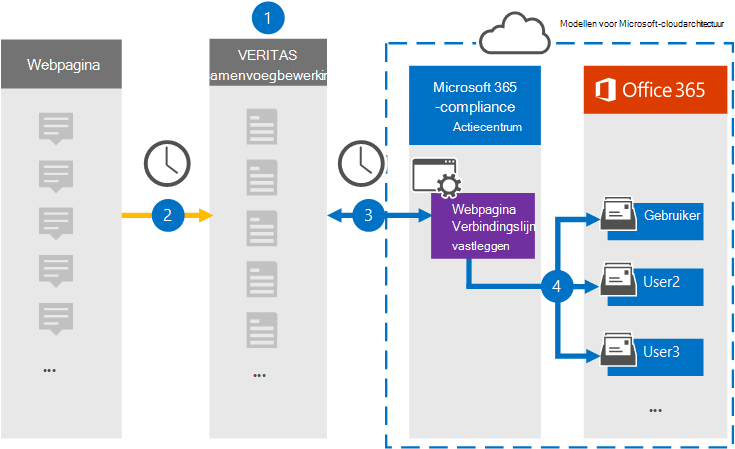

# Een verbindingslijn instellen voor het archiveren van webpaginagegevens

Gebruik een Veritas-connector in het Microsoft 365 compliancecentrum om gegevens van webpagina's te importeren en te archiveren in gebruikerspostvakken in uw Microsoft 365 organisatie. Veritas biedt een [verbindingslijn Voor](https://globanet.com/webpage-capture) het vastleggen van webpagina's die specifieke webpagina's (en eventuele koppelingen op die pagina's) op een specifieke website of een heel domein vastleggen. De verbindingslijn converteert de inhoud van de webpagina naar een PDF-, PNG- of aangepaste bestandsindeling en koppelt de geconverteerde bestanden vervolgens aan een e-mailbericht en importeert deze e-mailitems in gebruikerspostvakken in Microsoft 365.

Nadat inhoud van webpagina's is opgeslagen in postvakken van gebruikers, kunt u Microsoft 365 compliancefuncties toepassen, zoals Litigation Hold, eDiscovery en bewaarbeleid en bewaarlabels. Als u een connector Voor het vastleggen van webpagina's gebruikt om gegevens te importeren en te archiveren in Microsoft 365 kan uw organisatie voldoen aan overheids- en regelgevingsbeleid.

## Overzicht van het archiveren van webpaginagegevens

In het volgende overzicht wordt uitgelegd hoe het gebruik van een verbindingslijn voor het archiveren van webpagina-inhoud in Microsoft 365.

1. Uw organisatie werkt met de webpaginabron om een site voor het vastleggen van webpagina's in te stellen en te configureren.

2. Elke 24 uur worden de items van de webpaginabronnen gekopieerd naar de Veritas Merge1-site. De verbindingslijn converteert ook en koppelt de inhoud van een webpagina aan een e-mailbericht.

3. De verbindingslijn Webpagina vastleggen die u maakt in het Microsoft 365 compliancecentrum, maakt elke dag verbinding met de Veritas Merge1-site en draagt de webpagina-items over naar een veilige Azure Storage-locatie in de Microsoft-cloud.

4. De connector importeert de geconverteerde webpagina-items in de postvakken van specifieke gebruikers met behulp van de waarde van de eigenschap *E-mail* van de automatische gebruikerstoewijzing, zoals beschreven in [stap 3.](#step-3-map-users-and-complete-the-connector-setup) Een submap in de map Postvak IN met de naam **Webpagina** vastleggen wordt gemaakt in de postvakken van de gebruiker en de webpagina-items worden geïmporteerd in die map. De verbindingslijn doet dit met behulp van de waarde van de eigenschap *E-mail.* Elk webpagina-item bevat deze eigenschap, die wordt gevuld met de e-mailadressen die worden opgegeven wanneer u de connector Webpagina vastleggen configureert in [stap 2.](#step-2-configure-the-webpage-capture-connector-on-the-veritas-merge1-site)

## Voordat u begint

- Maak een Veritas Merge1-account voor Microsoft-connectors. Neem contact op met [Veritas Customer Support](https://www.veritas.com/content/support/)om dit account te maken. U meld u aan bij dit account wanneer u de verbindingslijn maakt in stap 1.

- U moet met de ondersteuning van Veritas werken om een aangepaste bestandsindeling in te stellen om de webpagina-items naar te converteren. Zie de gebruikershandleiding Connectors van derden [samenvoegen1 voor meer informatie.](https://docs.ms.merge1.globanetportal.com/Merge1%20Third-Party%20Connectors%20Web%20Page%20Capture%20User%20Guide%20.pdf)

- De gebruiker die de connector Voor het vastleggen van webpagina's maakt in stap 1 (en deze voltooit in stap 3), moet worden toegewezen aan de rol Postvak importeren exporteren in Exchange Online. Deze rol is vereist om verbindingslijnen toe te voegen op de pagina **Gegevensconnectors** in het Microsoft 365 compliancecentrum. Deze rol is standaard niet toegewezen aan een rollengroep in Exchange Online. U kunt de rol Postvak importeren exporteren toevoegen aan de rollengroep Organisatiebeheer in Exchange Online. U kunt ook een rollengroep maken, de rol Postvak importeren exporteren toewijzen en vervolgens de juiste gebruikers toevoegen als leden. Zie de secties  Rollengroepen  maken of Rollengroepen wijzigen in het artikel 'Rollengroepen beheren in Exchange Online'.

## Stap 1: De verbindingslijn Webpagina vastleggen instellen

De eerste stap is toegang tot de gegevensconnectoren en het maken van een **verbindingslijn** voor brongegevens van webpagina's.

1. Ga naar [https://compliance.microsoft.com](https://compliance.microsoft.com/) en klik vervolgens op **Gegevensconnectors**  >  **Webpagina vastleggen**.

2. Klik op **de pagina Webpagina** Productbeschrijving vastleggen op **Verbindingslijn toevoegen.**

3. Klik op **de pagina Servicevoorwaarden** op **Accepteren.**

4. Voer een unieke naam in die de verbindingslijn identificeert en klik vervolgens op **Volgende.**

5. Meld u aan bij uw Merge1-account om de verbindingslijn te configureren.

## Stap 2: De verbindingslijn Webpagina vastleggen configureren op de Veritas Merge1-site

De tweede stap is het configureren van de connector Webpagina vastleggen op de Veritas Merge1-site. Zie Handleiding [Verbindingslijnen](https://docs.ms.merge1.globanetportal.com/Merge1%20Third-Party%20Connectors%20Web%20Page%20Capture%20User%20Guide%20.pdf)van derden samenvoegen voor informatie over het configureren van de connector Voor het vastleggen van webpagina's.

Nadat u op **Opslaan &** Voltooien  hebt geklikt, wordt de pagina Gebruikerstoewijzing in de wizard verbindingslijn in het Microsoft 365 compliancecentrum weergegeven.

## Stap 3: Gebruikers in kaart brengen en de configuratie van de connector voltooien

Als u gebruikers wilt in kaart brengen en de configuratie van de verbindingslijn wilt voltooien in het Microsoft 365 compliancecentrum, volgt u de onderstaande stappen:

1. Schakel op **de pagina Kaart webpagina Gebruikers vastleggen Microsoft 365 gebruikerspagina** in, automatische gebruikerstoewijzing inschakelen. De items voor het vastleggen van webpagina's bevatten een eigenschap *met* de naam E-mail, die e-mailadressen bevat voor gebruikers in uw organisatie. Als de verbindingslijn dit adres kan koppelen aan Microsoft 365 gebruiker, worden de items geïmporteerd in het postvak van die gebruiker.

2. Klik **op Volgende,** bekijk uw instellingen en ga naar de pagina Gegevensconnectors om de voortgang van het importproces voor de nieuwe **verbindingslijn** te bekijken.

## Stap 4: De verbindingslijn Webpagina vastleggen controleren

Nadat u de verbindingslijn Webpagina vastleggen hebt geopend, kunt u de verbindingslijnstatus weergeven in het Microsoft 365 compliancecentrum.

1. Ga naar [https://compliance.microsoft.com](https://compliance.microsoft.com) en klik op **Gegevensconnectoren** in het linkernavigatievenster.

2. Klik op **het tabblad Verbindingslijnen** en selecteer vervolgens de verbindingslijn **Webpagina vastleggen** om de flyoutpagina weer te geven. Deze pagina bevat de eigenschappen en informatie over de verbindingslijn.

3. Klik **onder Verbindingsstatus met bron** op de koppeling Logboek **downloaden** om het statuslogboek voor de verbindingslijn te openen (of op te slaan). Dit logboek bevat gegevens die zijn geïmporteerd in de Microsoft-cloud.

## Bekende problemen

- Op dit moment bieden we geen ondersteuning voor het importeren van bijlagen of items die groter zijn dan 10 MB. Ondersteuning voor grotere items is op een later tijdstip beschikbaar.