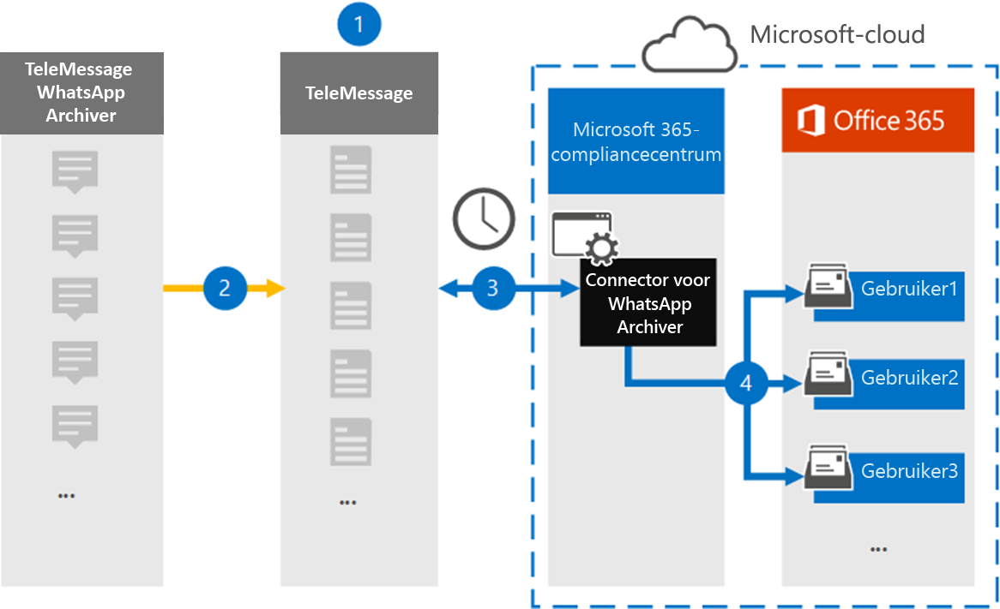

# Een connector instellen voor het archiveren van WhatsApp-gegevens

Gebruik de TeleMessage-connector in het Microsoft 365 compliancecentrum om WhatsApp-gesprekken, chats, bijlagen, bestanden en verwijderde berichten te importeren en te archiveren. Nadat u een verbindingslijn hebt ingesteld en geconfigureerd, maakt deze eenmaal per dag verbinding met het TeleMessage-account van uw organisatie en importeert u de mobiele communicatie van werknemers met de TeleMessage WhatsApp Telefoon Archiver of TeleMessage WhatsApp Cloud Archiver naar postvakken in Microsoft 365.

Nadat WhatsApp-gegevens zijn opgeslagen in gebruikerspostvakken, kunt u Microsoft 365 compliancefuncties zoals Proces bewaring, Inhoud zoeken en Microsoft 365 bewaarbeleid toepassen op WhatsApp-gegevens. U kunt bijvoorbeeld zoeken in WhatsApp-berichten met Inhoud zoeken of het postvak met WhatsApp-berichten koppelen aan een bewaarder in een Advanced eDiscovery geval. Als u een WhatsApp-verbindingslijn gebruikt om gegevens te importeren en te archiveren in Microsoft 365 kan uw organisatie voldoen aan overheids- en regelgevingsbeleid.

## Overzicht van het archiveren van WhatsApp-gegevens

In het volgende overzicht wordt uitgelegd hoe het gebruik van een connector voor het archiveren van WhatsApp-gegevens in Microsoft 365.

1. Uw organisatie werkt met TeleMessage om een Connector voor WhatsApp Archiver in te stellen. Zie [WhatsApp Archiver](https://www.telemessage.com/office365-activation-for-whatsapp-archiver)voor meer informatie.

2. In realtime worden de WhatsApp-gegevens van uw organisatie gekopieerd naar de TeleMessage-site.

3. De WhatsApp-connector die u in het Microsoft 365-compliancecentrum maakt, maakt elke dag verbinding met de TeleMessage-site en brengt WhatsApp-gegevens van de afgelopen 24 uur over naar een veilige Azure Storage-locatie in de Microsoft-cloud. De connector converteert ook de inhoudsgegevens van WhatsApp naar een e-mailberichtindeling.

4. De connector importeert WhatsApp-gegevens naar het postvak van een specifieke gebruiker. Er wordt een nieuwe map met de naam **WhatsApp Archiver** gemaakt in het postvak van de specifieke gebruiker en de items worden er in geïmporteerd. De connector doet deze toewijzing met behulp van de waarde van de *eigenschap E-mailadres van de* gebruiker. Elk WhatsApp-bericht bevat deze eigenschap, die wordt gevuld met het e-mailadres van elke deelnemer aan het bericht.

   Naast automatische gebruikerstoewijzing met  de waarde van de eigenschap E-mailadres van de gebruiker, kunt u ook aangepaste toewijzing implementeren door een CSV-toewijzingsbestand te uploaden. Dit toewijzingsbestand bevat het mobiele telefoonnummer en het bijbehorende Microsoft 365 e-mailadres voor gebruikers in uw organisatie. Als u zowel automatische gebruikerstoewijzing als aangepaste toewijzing inschakelen, wordt voor elk WhatsApp-item eerst naar aangepast toewijzingsbestand gesnapt. Als er geen geldige Microsoft 365-gebruiker wordt gevonden die overeenkomt met het mobiele telefoonnummer van een gebruiker, gebruikt de verbindingslijn de waarden in de eigenschap e-mailadres van het item dat het probeert te importeren. Als de verbindingslijn geen geldige Microsoft 365-gebruiker vindt in het aangepaste toewijzingsbestand of in de eigenschap e-mailadres van het WhatsApp-item, wordt het item niet geïmporteerd.

## Voordat u een verbindingslijn in stelt

Sommige implementatiestappen die nodig zijn om Communicatiegegevens van WhatsApp te archiveren, zijn extern van Microsoft 365 en moeten zijn voltooid voordat u de verbindingslijn in het compliancecentrum kunt maken.

- Bestel de [WhatsApp Archiver-service bij TeleMessage](https://www.telemessage.com/mobile-archiver/order-mobile-archiver-for-o365) en ontvang een geldig beheeraccount voor uw organisatie. U moet zich aanmelden bij dit account wanneer u de verbindingslijn maakt in het compliancecentrum.

- Registreer alle gebruikers die een WhatsApp-archivering vereisen in het TeleMessage-account. Wanneer u gebruikers registreert, moet u hetzelfde e-mailadres gebruiken dat wordt gebruikt voor hun Microsoft 365 account.

- Installeer de TeleMessage [WhatsApp Telefoon Archiver-app](https://www.telemessage.com/mobile-archiver/whatsapp-phone-archiver-2/) op de mobiele telefoons van uw werknemers en activeer deze. U kunt ook de normale WhatsApp- of WhatsApp Business-apps installeren op de mobiele telefoons van uw werknemers en de WhatsApp Cloud Archiver-service activeren door een QR-code te scannen op de telemessage-website. Zie [WhatsApp Cloud Archiver](https://www.telemessage.com/mobile-archiver/whatsapp-archiver/whatsapp-cloud-archiver/)voor meer informatie.

- De gebruiker die een Verizon Network-verbindingslijn maakt, moet de rol Postvak importeren exporteren in Exchange Online. Dit is vereist om verbindingslijnen toe te voegen op de pagina **Gegevensconnectors** in het Microsoft 365 compliancecentrum. Deze rol is standaard niet toegewezen aan een rollengroep in Exchange Online. U kunt de rol Postvak importeren exporteren toevoegen aan de rollengroep Organisatiebeheer in Exchange Online. U kunt ook een rollengroep maken, de rol Postvak importeren exporteren toewijzen en vervolgens de juiste gebruikers toevoegen als leden. Zie de secties  Rollengroepen  maken of Rollengroepen wijzigen in het artikel 'Rollengroepen beheren in Exchange Online'.

- Deze gegevensconnector is beschikbaar in GCC omgevingen in de Microsoft 365 amerikaanse overheidscloud. Toepassingen en services van derden kunnen betrekking hebben op het opslaan, verzenden en verwerken van klantgegevens van uw organisatie op systemen van derden die buiten de Microsoft 365-infrastructuur vallen en daarom niet worden gedekt door de toezeggingen van Microsoft 365 compliance en gegevensbescherming. Microsoft geeft niet aan dat het gebruik van dit product om verbinding te maken met toepassingen van derden betekent dat deze toepassingen van derden compatibel zijn met FEDRAMP.

## Een Connector voor WhatsApp Archiver maken

Nadat u de vereisten hebt voltooid die in de vorige sectie zijn beschreven, kunt u de WhatsApp-connector maken in het Microsoft 365 compliancecentrum. De connector gebruikt de informatie die u verstrekt om verbinding te maken met de TeleMessage-site en de WhatsApp-gegevens over te brengen naar de bijbehorende postvakken van gebruikers in Microsoft 365.

1. Ga naar [https://compliance.microsoft.com](https://compliance.microsoft.com/) en klik vervolgens op **Gegevensconnectoren**  >  **WhatsApp Archiver**.

2. Klik op **de pagina Productbeschrijving van WhatsApp Archiver** op **Verbindingslijn toevoegen**

3. Klik op **de pagina Servicevoorwaarden** op **Accepteren.**

4. Voer op de pagina Aanmelden bij **TeleMessage** onder Stap 3 de vereiste informatie in de volgende vakken in en klik vervolgens op **Volgende**.

   - **Gebruikersnaam:** Uw TeleMessage-gebruikersnaam.

   - **Wachtwoord:** Uw TeleMessage-wachtwoord.

5. Nadat de verbindingslijn is gemaakt, kunt u het pop-upvenster sluiten en naar de volgende pagina gaan.

6. Schakel op **de pagina Gebruikerstoewijzing** automatische gebruikerstoewijzing in en klik op **Volgende.** Als u aangepaste toewijzing nodig hebt, uploadt u een CSV-bestand en klikt u op **Volgende.**

7. Controleer de instellingen en klik vervolgens op **Voltooien om** de verbindingslijn te maken.

8. Ga naar het tabblad Connectors op de pagina **Gegevensconnectors** om de voortgang van het importproces voor de nieuwe verbindingslijn te bekijken.

## Bekende problemen

- Op dit moment bieden we geen ondersteuning voor het importeren van bijlagen of items die groter zijn dan 10 MB. Ondersteuning voor grotere items is op een later tijdstip beschikbaar.
