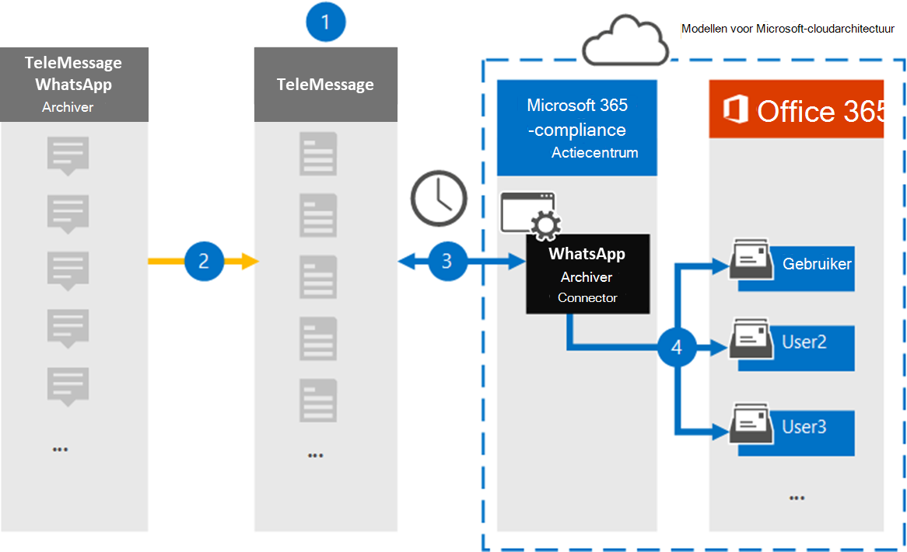

# Een connector instellen voor het archiveren van WhatsApp-gegevensSet up a connector to archive WhatsApp data

Gebruik de TeleMessage-connector in het Microsoft 365 compliancecentrum om WhatsApp-gesprekken, chats, bijlagen, bestanden en verwijderde berichten te importeren en te archiveren.Use the TeleMessage connector in the Microsoft 365 compliance center to import and archive WhatsApp calls, chats, attachments, files, and deleted messages. Nadat u een verbindingslijn hebt ingesteld en geconfigureerd, maakt deze eenmaal per dag verbinding met het TeleMessage-account van uw organisatie en importeert u de mobiele communicatie van werknemers met de TeleMessage WhatsApp Telefoon Archiver of TeleMessage WhatsApp Cloud Archiver naar postvakken in Microsoft 365.After you set up and configure a connector, it connects to your organization's TeleMessage account once every day, and imports the mobile communication of employees using the TeleMessage WhatsApp Phone Archiver or TeleMessage WhatsApp Cloud Archiver to mailboxes in Microsoft 365.

Nadat WhatsApp-gegevens zijn opgeslagen in gebruikerspostvakken, kunt u Microsoft 365 compliancefuncties zoals Proces bewaring, Inhoud zoeken en Microsoft 365 bewaarbeleid toepassen op WhatsApp-gegevens.After WhatsApp data is stored in user mailboxes, you can apply Microsoft 365 compliance features such as Litigation Hold, Content Search, and Microsoft 365 retention policies to WhatsApp data. U kunt bijvoorbeeld zoeken in WhatsApp-berichten met Inhoud zoeken of het postvak met WhatsApp-berichten koppelen aan een bewaarder in een Advanced eDiscovery geval.For example, you can search WhatsApp messages using Content Search or associate the mailbox that contains WhatsApp messages with a custodian in an Advanced eDiscovery case. Als u een WhatsApp-verbindingslijn gebruikt om gegevens te importeren en te archiveren in Microsoft 365 kan uw organisatie voldoen aan overheids- en regelgevingsbeleid.Using a WhatsApp connector to import and archive data in Microsoft 365 can help your organization stay compliant with government and regulatory policies.

## Overzicht van het archiveren van WhatsApp-gegevensOverview of archiving WhatsApp data

In het volgende overzicht wordt uitgelegd hoe het gebruik van een connector voor het archiveren van WhatsApp-gegevens in Microsoft 365.The following overview explains the process of using a connector to archive WhatsApp data in Microsoft 365.

1. Uw organisatie werkt met TeleMessage om een Connector voor WhatsApp Archiver in te stellen.Your organization works with TeleMessage to set up a WhatsApp Archiver connector. Zie [WhatsApp Archiver](https://www.telemessage.com/office365-activation-for-whatsapp-archiver)voor meer informatie.For more information, see [WhatsApp Archiver](https://www.telemessage.com/office365-activation-for-whatsapp-archiver).

2. In realtime worden de WhatsApp-gegevens van uw organisatie gekopieerd naar de TeleMessage-site.In real time, your organization's WhatsApp data is copied to the TeleMessage site.

3. De WhatsApp-connector die u in het Microsoft 365-compliancecentrum maakt, maakt elke dag verbinding met de TeleMessage-site en brengt WhatsApp-gegevens van de afgelopen 24 uur over naar een veilige Azure Storage-locatie in de Microsoft-cloud.The WhatsApp connector that you create in the Microsoft 365 compliance center connects to the TeleMessage site every day and transfers WhatsApp data from the previous 24 hours to a secure Azure Storage location in the Microsoft cloud. De connector converteert ook de inhoudsgegevens van WhatsApp naar een e-mailberichtindeling.The connector also converts the content WhatsApp data to an email message format.

4. De connector importeert WhatsApp-gegevens naar het postvak van een specifieke gebruiker.The connector imports WhatsApp data to the mailbox of a specific user. Er wordt een nieuwe map met de naam **WhatsApp Archiver** gemaakt in het postvak van de specifieke gebruiker en de items worden er in geïmporteerd.A new folder named **WhatsApp Archiver** is created in the specific user's mailbox and the items are imported to it. De connector doet deze toewijzing met behulp van de waarde van de *eigenschap E-mailadres van de* gebruiker.The connector does this mapping by using the value of the *User’s Email address* property. Elk WhatsApp-bericht bevat deze eigenschap, die wordt gevuld met het e-mailadres van elke deelnemer aan het bericht.Every WhatsApp message contains this property, which is populated with the email address of every participant of the message.

   Naast automatische gebruikerstoewijzing met  de waarde van de eigenschap E-mailadres van de gebruiker, kunt u ook aangepaste toewijzing implementeren door een CSV-toewijzingsbestand te uploaden.In addition to automatic user mapping using the value of the *User’s Email address* property, you can also implement custom mapping by uploading a CSV mapping file. Dit toewijzingsbestand bevat het mobiele telefoonnummer en het bijbehorende Microsoft 365 e-mailadres voor gebruikers in uw organisatie.This mapping file contains the mobile phone number and corresponding Microsoft 365 email address for users in your organization. Als u zowel automatische gebruikerstoewijzing als aangepaste toewijzing inschakelen, wordt voor elk WhatsApp-item eerst naar aangepast toewijzingsbestand gesnapt.If you enable both automatic user mapping and custom mapping, for every WhatsApp item the connector first looks at custom mapping file. Als er geen geldige Microsoft 365-gebruiker wordt gevonden die overeenkomt met het mobiele telefoonnummer van een gebruiker, gebruikt de verbindingslijn de waarden in de eigenschap e-mailadres van het item dat het probeert te importeren.If it doesn't find a valid Microsoft 365 user that corresponds to a user's mobile phone number, the connector will use the values in the email address property of the item it's trying to import. Als de verbindingslijn geen geldige Microsoft 365-gebruiker vindt in het aangepaste toewijzingsbestand of in de eigenschap e-mailadres van het WhatsApp-item, wordt het item niet geïmporteerd.If the connector doesn't find a valid Microsoft 365 user in either the custom mapping file or in the email address property of the WhatsApp item, the item won't be imported.

## Voordat u begintBefore you begin

Sommige implementatiestappen die nodig zijn om Communicatiegegevens van WhatsApp te archiveren, zijn extern van Microsoft 365 en moeten zijn voltooid voordat u de verbindingslijn in het compliancecentrum kunt maken.Some of the implementation steps required to archive WhatsApp communication data are external to Microsoft 365 and must be completed before you can create the connector in the compliance center.

- Bestel de [WhatsApp Archiver-service bij TeleMessage](https://www.telemessage.com/mobile-archiver/order-mobile-archiver-for-o365) en ontvang een geldig beheeraccount voor uw organisatie.Order the [WhatsApp Archiver service from TeleMessage](https://www.telemessage.com/mobile-archiver/order-mobile-archiver-for-o365) and get a valid administration account for your organization. U moet zich aanmelden bij dit account wanneer u de verbindingslijn maakt in het compliancecentrum.You'll need to sign into this account when you create the connector in the compliance center.

- Registreer alle gebruikers die een WhatsApp-archivering vereisen in het TeleMessage-account.Register all users that require WhatsApp archiving in the TeleMessage account. Wanneer u gebruikers registreert, moet u hetzelfde e-mailadres gebruiken dat wordt gebruikt voor hun Microsoft 365 account.When registering users, be sure to use the same email address that's used for their Microsoft 365 account.

- Installeer de TeleMessage [WhatsApp Telefoon Archiver-app](https://www.telemessage.com/mobile-archiver/whatsapp-phone-archiver-2/) op de mobiele telefoons van uw werknemers en activeer deze.Install the TeleMessage [WhatsApp Phone Archiver app](https://www.telemessage.com/mobile-archiver/whatsapp-phone-archiver-2/) on the mobile phones of your employees and activate it. U kunt ook de normale WhatsApp- of WhatsApp Business-apps installeren op de mobiele telefoons van uw werknemers en de WhatsApp Cloud Archiver-service activeren door een QR-code te scannen op de telemessage-website.Alternatively, you can install the regular WhatsApp or WhatsApp Business apps on the mobile phones of your employees and activate the WhatsApp Cloud Archiver service by scanning a QR code on the TeleMessage website. Zie [WhatsApp Cloud Archiver](https://www.telemessage.com/mobile-archiver/whatsapp-archiver/whatsapp-cloud-archiver/)voor meer informatie.For more information, see [WhatsApp Cloud Archiver](https://www.telemessage.com/mobile-archiver/whatsapp-archiver/whatsapp-cloud-archiver/).

- De gebruiker die een Verizon Network-verbindingslijn maakt, moet de rol Postvak importeren exporteren in Exchange Online.The user who creates a Verizon Network connector must be assigned the Mailbox Import Export role in Exchange Online. Dit is vereist om verbindingslijnen toe te voegen op de pagina **Gegevensconnectors** in het Microsoft 365 compliancecentrum.This is required to add connectors in the **Data connectors** page in the Microsoft 365 compliance center. Deze rol is standaard niet toegewezen aan een rollengroep in Exchange Online.By default, this role isn't assigned to any role group in Exchange Online. U kunt de rol Postvak importeren exporteren toevoegen aan de rollengroep Organisatiebeheer in Exchange Online.You can add the Mailbox Import Export role to the Organization Management role group in Exchange Online. U kunt ook een rollengroep maken, de rol Postvak importeren exporteren toewijzen en vervolgens de juiste gebruikers toevoegen als leden.Or you can create a role group, assign the Mailbox Import Export role, and then add the appropriate users as members. Zie de secties  Rollengroepen  maken of Rollengroepen wijzigen in het artikel 'Rollengroepen beheren in Exchange Online'.For more information, see the [Create role groups](/Exchange/permissions-exo/role-groups#create-role-groups) or [Modify role groups](/Exchange/permissions-exo/role-groups#modify-role-groups) sections in the article "Manage role groups in Exchange Online".

## Een Connector voor WhatsApp Archiver makenCreate a WhatsApp Archiver connector

Nadat u de vereisten hebt voltooid die in de vorige sectie zijn beschreven, kunt u de WhatsApp-connector maken in het Microsoft 365 compliancecentrum.After you've completed the prerequisites described in the previous section, you can create the WhatsApp connector in the Microsoft 365 compliance center. De connector gebruikt de informatie die u verstrekt om verbinding te maken met de TeleMessage-site en de WhatsApp-gegevens over te brengen naar de bijbehorende postvakken van gebruikers in Microsoft 365.The connector uses the information you provide to connect to the TeleMessage site and transfer the WhatsApp data to the corresponding user mailbox boxes in Microsoft 365.

1. Ga naar [https://compliance.microsoft.com](https://compliance.microsoft.com/) en klik vervolgens op **Gegevensconnectoren**  >  **WhatsApp Archiver**.Go to [https://compliance.microsoft.com](https://compliance.microsoft.com/) and then click **Data connectors** > **WhatsApp Archiver**.

2. Klik op **de pagina Productbeschrijving van WhatsApp Archiver** op **Verbindingslijn toevoegen**On the **WhatsApp Archiver** product description page, click **Add connector**

3. Klik op **de pagina Servicevoorwaarden** op **Accepteren.**On the **Terms of service** page, click **Accept**.

4. Voer op de pagina Aanmelden bij **TeleMessage** onder Stap 3 de vereiste informatie in de volgende vakken in en klik vervolgens op **Volgende**.On the **Login to TeleMessage** page, under Step 3, enter the required information in the following boxes and then click **Next**.

   - **Gebruikersnaam:** Uw TeleMessage-gebruikersnaam.**Username:** Your TeleMessage username.

   - **Wachtwoord:** Uw TeleMessage-wachtwoord.**Password:** Your TeleMessage password.

5. Nadat de verbindingslijn is gemaakt, kunt u het pop-upvenster sluiten en naar de volgende pagina gaan.After the connector is created, you can close the pop-up window and go to the next page.

6. Schakel op **de pagina Gebruikerstoewijzing** automatische gebruikerstoewijzing in en klik op **Volgende.**On the **User mapping** page, enable automatic user mapping and click **Next**. Als u aangepaste toewijzing nodig hebt, uploadt u een CSV-bestand en klikt u op **Volgende.**In case you need custom mapping upload a CSV file, and click **Next**.

7. Controleer de instellingen en klik vervolgens op **Voltooien om** de verbindingslijn te maken.Review your settings, and then click **Finish** to create the connector.

8. Ga naar het tabblad Connectors op de pagina **Gegevensconnectors** om de voortgang van het importproces voor de nieuwe verbindingslijn te bekijken.Go to the Connectors tab in **Data connectors** page to see the progress of the import process for the new connector.

## Bekende problemenKnown issues

- Op dit moment bieden we geen ondersteuning voor het importeren van bijlagen of items die groter zijn dan 10 MB.At this time, we don't support importing attachments or items that are larger than 10 MB. Ondersteuning voor grotere items is op een later tijdstip beschikbaar.Support for larger items will be available at a later date.
