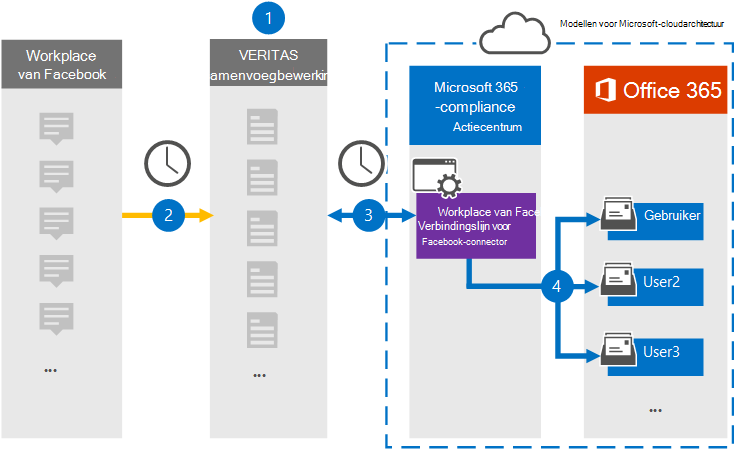

# Een connector instellen voor het archiveren van Workplace op Facebook-gegevensSet up a connector to archive Workplace from Facebook data

Gebruik een Veritas-connector in het Microsoft 365 compliancecentrum om gegevens van Workplace van Facebook te importeren en te archiveren naar postvakken van gebruikers in uw Microsoft 365 organisatie.Use a Veritas connector in the Microsoft 365 compliance center to import and archive data from Workplace from Facebook to user mailboxes in your Microsoft 365 organization. Veritas biedt een [Workplace from Facebook-connector](https://globanet.com/workplace/) die is geconfigureerd om items uit de gegevensbron van derden vast te leggen (op regelmatige basis) en deze items te importeren in Microsoft 365.Veritas provides a [Workplace from Facebook](https://globanet.com/workplace/) connector that is configured to capture items from the third-party data source (on a regular basis) and import those items to Microsoft 365. De connector converteert de inhoud, zoals chats, bijlagen, berichten en video's van Workplace naar een e-mailberichtindeling en importeert deze items vervolgens in postvakken van gebruikers in Microsoft 365.The connector converts the content such as chats, attachments, posts, and videos from Workplace to an email message format and then imports those items to user mailboxes in Microsoft 365.

Nadat werkplekgegevens zijn opgeslagen in gebruikerspostvakken, kunt u Microsoft 365 compliancefuncties toepassen, zoals Litigation Hold, eDiscovery, bewaarbeleid en bewaarlabels en communicatie compliance.After Workplace data is stored in user mailboxes, you can apply Microsoft 365 compliance features such as Litigation Hold, eDiscovery, retention policies and retention labels, and communication compliance. Als u Workplace from Facebook Connector gebruikt om gegevens te importeren en te archiveren in Microsoft 365 kan uw organisatie voldoen aan overheids- en regelgevingsbeleid.Using Workplace from Facebook connector to import and archive data in Microsoft 365 can help your organization stay compliant with government and regulatory policies.

## Overzicht van het archiveren van Werkplek op Facebook-gegevensOverview of archiving Workplace from Facebook data

In het volgende overzicht wordt uitgelegd hoe het gebruik van een verbindingslijn voor het archiveren van werkplekgegevens in Microsoft 365.The following overview explains the process of using a connector to archive Workplace data in Microsoft 365.

1. Uw organisatie werkt met Workplace van Facebook om een werkpleksite in te stellen en te configureren.Your organization works with Workplace from Facebook to set up and configure a Workplace site.

2. Eenmaal per 24 uur worden items van Workplace gekopieerd naar de Veritas Merge1-site.Once every 24 hours, items from Workplace are copied to the Veritas Merge1 site. De connector converteert ook de inhoud van deze items naar een e-mailberichtindeling.The connector also converts the content of these items to an email message format.

3. De Workplace from Facebook-connector die u maakt in het Microsoft 365 compliancecentrum, maakt elke dag verbinding met de Veritas Merge1 en draagt de Workplace-items over naar een veilige Azure Storage-locatie in de Microsoft-cloud.The Workplace from Facebook connector that you create in the Microsoft 365 compliance center, connects to the Veritas Merge1 every day, and transfers the Workplace items to a secure Azure Storage location in the Microsoft cloud.

4. De connector importeert de geconverteerde items in de postvakken van specifieke gebruikers met behulp van de waarde van de eigenschap *E-mail* van de automatische gebruikerstoewijzing, zoals beschreven in stap 3.The connector imports the converted items to the mailboxes of specific users using the value of the *Email* property of the automatic user mapping as described in Step 3. Er wordt een submap gemaakt in de map Postvak IN met de naam **Workplace van Facebook** en de items van Workplace worden geïmporteerd in die map.A subfolder in the Inbox folder named **Workplace from Facebook** is created, and the Workplace items are imported to that folder. De verbindingslijn doet dit met behulp van de waarde van de eigenschap *E-mail.*The connector does this by using the value of the *Email* property. Elk Workplace-item bevat deze eigenschap, die wordt gevuld met het e-mailadres van elke chat- of postdeelnemer.Every Workplace item contains this property, which is populated with the email address of every chat or post participant.

## Voordat u begintBefore you begin

- Maak een Veritas Merge1-account voor Microsoft-connectors.Create a Veritas Merge1 account for Microsoft connectors. Neem contact op met [Veritas Customer Support](https://globanet.com/ms-connectors-contact)om dit account te maken.To create this account, contact [Veritas Customer Support](https://globanet.com/ms-connectors-contact). U meld u aan bij dit account wanneer u de verbindingslijn maakt in stap 1.You will sign into this account when you create the connector in Step 1.

- Maak een aangepaste integratie voor https://my.workplace.com/work/admin/apps/ het ophalen van gegevens van Workplace via API's voor compliance- en eDiscovery-doeleinden.Create a custom integration at https://my.workplace.com/work/admin/apps/ to retrieve data from Workplace via APIs for compliance and eDiscovery purposes.

   Bij het maken van de integratie genereert het Workplace-platform een set unieke referenties die worden gebruikt om tokens te genereren die worden gebruikt voor verificatie.When creating the integration, the Workplace platform generates a set of unique credentials used to generate tokens that are used for authentication. Deze tokens worden gebruikt in de configuratiewizard Workplace from Facebook connector in stap 2.These tokens are used in the Workplace from Facebook connector configuration wizard in Step 2. Zie Gebruikershandleiding voor connectors van derden samenvoegen [voor stapsgewijse](https://docs.ms.merge1.globanetportal.com/Merge1%20Third-Party%20Connectors%20Workplace%20from%20Facebook%20User%20Guide%20.pdf)instructies over het maken van de toepassingen.For step-by step instructions about how to create the applications, see [Merge1 Third-Party Connectors User Guide](https://docs.ms.merge1.globanetportal.com/Merge1%20Third-Party%20Connectors%20Workplace%20from%20Facebook%20User%20Guide%20.pdf).

- De gebruiker die de Workplace from Facebook-connector maakt in stap 1 (en deze voltooit in stap 3), moet worden toegewezen aan de rol Postvak importeren exporteren in Exchange Online.The user who creates the Workplace from Facebook connector in Step 1 (and completes it in Step 3) must be assigned to the Mailbox Import Export role in Exchange Online. Deze rol is vereist om verbindingslijnen toe te voegen op de pagina **Gegevensconnectors** in het Microsoft 365 compliancecentrum.This role is required to add connectors on the **Data connectors** page in the Microsoft 365 compliance center. Deze rol is standaard niet toegewezen aan een rollengroep in Exchange Online.By default, this role is not assigned to a role group in Exchange Online. U kunt de rol Postvak importeren exporteren toevoegen aan de rollengroep Organisatiebeheer in Exchange Online.You can add the Mailbox Import Export role to the Organization Management role group in Exchange Online. U kunt ook een rollengroep maken, de rol Postvak importeren exporteren toewijzen en vervolgens de juiste gebruikers toevoegen als leden.Or you can create a role group, assign the Mailbox Import Export role, and then add the appropriate users as members. Zie de secties  Rollengroepen  maken of Rollengroepen wijzigen in het artikel 'Rollengroepen beheren in Exchange Online'.For more information, see the [Create role groups](/Exchange/permissions-exo/role-groups#create-role-groups) or [Modify role groups](/Exchange/permissions-exo/role-groups#modify-role-groups) sections in the article "Manage role groups in Exchange Online".

## Stap 1: De Workplace instellen vanuit facebook-connectorStep 1: Set up the Workplace from Facebook connector

De eerste stap is om toegang te krijgen tot de pagina Gegevensconnectoren in het Microsoft 365 compliancecentrum en een **verbindingslijn** te maken voor werkplekgegevens.The first step is to access to the **Data Connectors** page in the Microsoft 365 compliance center and create a connector for Workplace data.

1. Ga naar [https://compliance.microsoft.com](https://compliance.microsoft.com/) en klik vervolgens op Data **connectors**  >  **Workplace from Facebook**.Go to [https://compliance.microsoft.com](https://compliance.microsoft.com/) and then click **Data connectors** > **Workplace from Facebook**.

2. Klik op **de pagina Werkplek van Facebook-productbeschrijving** op **Verbindingslijn toevoegen.**On the **Workplace from Facebook** product description page, click **Add connector**.

3. Klik op **de pagina Servicevoorwaarden** op **Accepteren.**On the **Terms of service** page, click **Accept**.

4. Voer een unieke naam in die de verbindingslijn identificeert en klik vervolgens op **Volgende.**Enter a unique name that identifies the connector, and then click **Next**.

5. Meld u aan bij uw Merge1-account om de verbindingslijn te configureren.Sign in to your Merge1 account to configure the connector.

## Stap 2: De Workplace configureren vanuit Facebook-connector op de Veritas Merge1-siteStep 2: Configure the Workplace from Facebook connector on the Veritas Merge1 site

De tweede stap is het configureren van de Workplace from Facebook connector op de Merge1-site.The second step is to configure the Workplace from Facebook connector on the Merge1 site. Zie Gebruikershandleiding voor connectors van derden samenvoegen voor informatie over het configureren van de Workplace [from Facebook-connector.](https://docs.ms.merge1.globanetportal.com/Merge1%20Third-Party%20Connectors%20Workplace%20from%20Facebook%20User%20Guide%20.pdf)For information about how to configure the Workplace from Facebook connector, see [Merge1 Third-Party Connectors User Guide](https://docs.ms.merge1.globanetportal.com/Merge1%20Third-Party%20Connectors%20Workplace%20from%20Facebook%20User%20Guide%20.pdf).

Nadat u op **Opslaan &** Voltooien  hebt geklikt, wordt de pagina Gebruikerstoewijzing in de wizard verbindingslijn in het Microsoft 365 compliancecentrum weergegeven.After you click **Save & Finish**, the **User mapping** page in the connector wizard in the Microsoft 365 compliance center is displayed.

## Stap 3: Gebruikers in kaart brengen en de configuratie van de connector voltooienStep 3: Map users and complete the connector setup

Als u gebruikers wilt in kaart brengen en de configuratie van de verbindingslijn wilt voltooien in het Microsoft 365 compliancecentrum, volgt u de volgende stappen:To map users and complete the connector setup in the Microsoft 365 compliance center, follow these steps:

1. Schakel op **de pagina Externe gebruikers toewijzen Microsoft 365 gebruikers in,** automatische gebruikerstoewijzing in.On the **Map external users to Microsoft 365 users** page, enable automatic user mapping. De items op de werkplek bevatten een eigenschap met de naam *E-mail* die e-mailadressen bevat voor gebruikers in uw organisatie.The Workplace items include a property called *Email* that contains email addresses for users in your organization. Als de verbindingslijn dit adres kan koppelen aan Microsoft 365 gebruiker, worden de items geïmporteerd in het postvak van die gebruiker.If the connector can associate this address with a Microsoft 365 user, the items are imported to that user’s mailbox.

2. Klik **op Volgende,** controleer uw instellingen en ga naar de pagina Gegevensconnectors om de voortgang van het importproces voor de nieuwe **verbindingslijn** te bekijken.Click **Next**, review your settings, and then go to the **Data connectors** page to see the progress of the import process for the new connector.

## Stap 4: De werkplek bewaken via de Facebook-connectorStep 4: Monitor the Workplace from Facebook connector

Nadat u de Workplace from Facebook-connector hebt gebruikt, kunt u de status van de verbindingslijn bekijken in het Microsoft 365 compliancecentrum.After you create the Workplace from Facebook connector, you can view the connector status in the Microsoft 365 compliance center.

1. Ga naar [https://compliance.microsoft.com](https://compliance.microsoft.com) en klik op **Gegevensconnectoren** in het linkernavigatievenster.Go to [https://compliance.microsoft.com](https://compliance.microsoft.com) and click **Data connectors** in the left nav.

2. Klik op **het tabblad Verbindingslijnen** en selecteer vervolgens de **Workplace from Facebook-connector** om de flyoutpagina weer te geven.Click the **Connectors** tab and then select the **Workplace from Facebook** connector to display the flyout page. Deze pagina bevat de eigenschappen en informatie over de verbindingslijn.This page contains the properties and information about the connector.

3. Klik **onder Verbindingsstatus met bron** op de koppeling Logboek **downloaden** om het statuslogboek voor de verbindingslijn te openen (of op te slaan).Under **Connector status with source**, click the **Download log** link to open (or save) the status log for the connector. Dit logboek bevat informatie over de gegevens die zijn geïmporteerd in de Microsoft-cloud.This log contains information about the data that has been imported to the Microsoft cloud.

## Bekende problemenKnown issues

- Op dit moment bieden we geen ondersteuning voor het importeren van bijlagen of items die groter zijn dan 10 MB.At this time, we don't support importing attachments or items that are larger than 10 MB. Ondersteuning voor grotere items is op een later tijdstip beschikbaar.Support for larger items will be available at a later date.