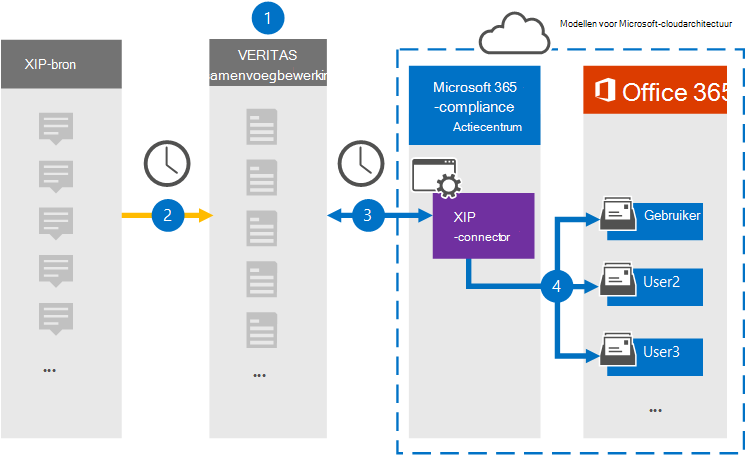

# Een verbindingslijn instellen voor het archiveren van XIP-brongegevens

Gebruik een Veritas-connector in het Microsoft 365 compliancecentrum om gegevens van het XIP-bronplatform te importeren en te archiveren naar postvakken van gebruikers in uw Microsoft 365 organisatie. Veritas biedt een [XIP-connector](https://globanet.com/xip/) waarmee u een XIP-bestand kunt gebruiken om items te importeren in Microsoft 365. Een XIP-bestand lijkt op een ZIP-bestand, maar maakt het mogelijk om een digitale handtekening te gebruiken. De digitale handtekening wordt gecontroleerd door veritas samenvoegen 1 voordat het XIP-bronbestand wordt geëxtraheerd. De verbindingslijn converteert de inhoud van het XIP-bronbestand naar een e-mailberichtindeling en importeert deze items vervolgens in het postvak van de gebruiker in Microsoft 365.

Nadat XIP-brongegevens zijn opgeslagen in gebruikerspostvakken, kunt u Microsoft 365 compliancefuncties toepassen, zoals Litigation Hold, eDiscovery, bewaarbeleid en bewaarlabels en communicatie compliance. Met een XIP-connector voor het importeren en archiveren van gegevens in Microsoft 365 kan uw organisatie voldoen aan overheids- en regelgevingsbeleid.

## Overzicht van het archiveren van de XIP-brongegevens

In het volgende overzicht wordt uitgelegd hoe u een verbindingslijn gebruikt om de XIP-brongegevens te archiveren in Microsoft 365.

1. Uw organisatie werkt met de XIP-bron om een XIP-site in te stellen en te configureren.

2. Elke 24 uur worden XIP-bronitems gekopieerd naar de Veritas Merge1-site. De verbindingslijn converteert ook de inhoud naar een e-mailberichtindeling.

3. De XIP-connector die u maakt in het Microsoft 365 compliancecentrum, maakt elke dag verbinding met de Veritas Merge1-site en draagt de berichten over naar een veilige Azure Storage locatie in de Microsoft-cloud.

4. De connector importeert de geconverteerde berichtitems naar de postvakken van specifieke gebruikers met behulp van de waarde van de eigenschap *E-mail* van de automatische gebruikerstoewijzing, zoals beschreven in [stap 3.](#step-3-map-users-and-complete-the-connector-setup) Er wordt een submap in de map Postvak IN met de naam **XIP** gemaakt in de postvakken van de gebruiker en de items worden geïmporteerd in die map. De verbindingslijn bepaalt in welk postvak items moeten worden geïmporteerd met behulp van de waarde van de eigenschap *E-mail.* Elk bronitem bevat deze eigenschap, die wordt gevuld met het e-mailadres van elke deelnemer.

## Voordat u begint

- Maak een Veritas Merge1-account voor Microsoft-connectors. Neem contact op met [Veritas Customer Support](https://www.veritas.com/content/support/)om een account te maken. U moet zich aanmelden bij dit account wanneer u de verbindingslijn maakt in stap 1.

- De gebruiker die de XIP-connector maakt in stap 1 (en deze voltooit in stap 3), moet worden toegewezen aan de rol Postvak importeren exporteren in Exchange Online. Deze rol is vereist om verbindingslijnen toe te voegen op de pagina Gegevensconnectors in het Microsoft 365 compliancecentrum. Deze rol is standaard niet toegewezen aan een rollengroep in Exchange Online. U kunt de rol Postvak importeren exporteren toevoegen aan de rollengroep Organisatiebeheer in Exchange Online. U kunt ook een rollengroep maken, de rol Postvak importeren exporteren toewijzen en vervolgens de juiste gebruikers toevoegen als leden. Zie de secties  Rollengroepen  maken of Rollengroepen wijzigen in het artikel 'Rollengroepen beheren in Exchange Online'.

## Stap 1: De XIP-connector instellen

De eerste stap is toegang tot de pagina Gegevensconnectoren in het Microsoft365-compliancecentrum en het maken van een **verbindingslijn** voor de XIP-brongegevens.

1. Ga naar [https://compliance.microsoft.com](https://compliance.microsoft.com/) en klik vervolgens op **Gegevensconnectoren** \> **XIP.**

2. Klik op **de pagina XIP-productbeschrijving** op **Nieuwe verbindingslijn toevoegen.**

3. Klik op **de pagina Servicevoorwaarden** op **Accepteren.**

4. Voer een unieke naam in die de verbindingslijn identificeert en klik vervolgens op **Volgende.**

5. Meld u aan bij uw Merge1-account om de verbindingslijn te configureren.

## Stap 2: De XIP-connector configureren op de Veritas Merge1-site

De tweede stap is het configureren van de XIP-connector op de site Samenvoegen1. Zie Gebruikershandleiding voor [connectors](https://docs.ms.merge1.globanetportal.com/Merge1%20Third-Party%20Connectors%20XIP%20User%20Guide%20.pdf)van derden samenvoegen voor informatie over het configureren van de XIP-connector.

Nadat u op **Opslaan &** Voltooien  hebt geklikt, wordt de pagina Gebruikerstoewijzing in de wizard verbindingslijn in het Microsoft 365 compliancecentrum weergegeven.

## Stap 3: Gebruikers in kaart brengen en de configuratie van de connector voltooien

Als u gebruikers wilt in kaart brengen en de configuratie van de verbindingslijn wilt voltooien, volgt u de volgende stappen:

1. Schakel op **de pagina XIP-gebruikers** toewijzen Microsoft 365 gebruikers automatisch toewijzen in. De XIP-bronitems bevatten een eigenschap *met* de naam E-mail, die e-mailadressen bevat voor gebruikers in uw organisatie. Als de verbindingslijn dit adres kan koppelen aan Microsoft 365 gebruiker, worden de items geïmporteerd in het postvak van die gebruiker.

2. Klik **op Volgende,** bekijk uw instellingen en ga naar de pagina Gegevensconnectors om de voortgang van het importproces voor de nieuwe **verbindingslijn** te bekijken.

## Stap 4: De XIP-connector controleren

Nadat u de XIP-verbindingslijn hebt maken, kunt u de verbindingslijnstatus weergeven in het Microsoft 365 compliancecentrum.

1. Ga naar [https://compliance.microsoft.com](https://compliance.microsoft.com/) en klik op **Gegevensconnectoren** in het linkernavigatievenster.

2. Klik op **het tabblad Verbindingslijnen** en selecteer vervolgens de **XIP-verbindingslijn** om de flyoutpagina weer te geven, die de eigenschappen en informatie over de verbindingslijn bevat.

3. Klik **onder Verbindingsstatus met bron** op de koppeling Logboek **downloaden** om het statuslogboek voor de verbindingslijn te openen (of op te slaan). Dit logboek bevat gegevens die zijn geïmporteerd in de Microsoft-cloud.

## Bekende problemen

- Op dit moment bieden we geen ondersteuning voor het importeren van bijlagen of items die groter zijn dan 10 MB. Ondersteuning voor grotere items is op een later tijdstip beschikbaar.