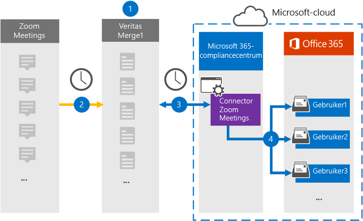

# Een verbindingslijn instellen voor het archiveren van gegevens van zoomvergaderingenSet up a connector to archive Zoom Meetings data

Gebruik een Veritas-connector in het Microsoft 365 compliancecentrum om gegevens uit zoomvergaderingen te importeren en te archiveren in postvakken van gebruikers in uw Microsoft 365 organisatie.Use a Veritas connector in the Microsoft 365 compliance center to import and archive data from Zoom Meetings to user mailboxes in your Microsoft 365 organization. Veritas biedt  een zoomvergaderingenconnector die is geconfigureerd om items uit de gegevensbron van derden vast te leggen (op regelmatige basis) en deze items te importeren in Microsoft 365.Veritas provides a [Zoom Meetings](https://globanet.com/zoom/) connector that is configured to capture items from the third-party data source (on a regular basis) and import those items to Microsoft 365. De verbindingslijn converteert de inhoud van de vergaderingen (inclusief chats, opgenomen bestanden en metagegevens) van het account Vergaderingen inzoomen naar een e-mailberichtindeling en importeert deze items vervolgens in gebruikerspostvakken in Microsoft 365.The connector converts the content of the meetings (including chats, recorded files, and metadata) from the Zoom Meetings account to an email message format and then imports those items to user mailboxes in Microsoft 365.

Nadat gegevens van zoomvergaderingen zijn opgeslagen in gebruikerspostvakken, kunt u Microsoft 365 compliancefuncties toepassen, zoals Litigation Hold, eDiscovery, bewaarbeleid en bewaarlabels en communicatie compliance.After Zoom Meetings data is stored in user mailboxes, you can apply Microsoft 365 compliance features such as Litigation Hold, eDiscovery, retention policies and retention labels, and communication compliance. Als u een zoomvergaderingenconnector gebruikt om gegevens te importeren en te archiveren in Microsoft 365 kunt u uw organisatie helpen aan het overheids- en regelgevingsbeleid te voldoen.Using a Zoom Meetings connector to import and archive data in Microsoft 365 can help your organization stay compliant with government and regulatory policies.

## Overzicht van het archiveren van zoomvergaderingenOverview of archiving Zoom Meetings data

In het volgende overzicht wordt uitgelegd hoe u een verbindingslijn gebruikt om gegevens van zoomvergaderingen te archiveren in Microsoft 365.The following overview explains the process of using a connector to archive Zoom Meetings data in Microsoft 365.

1. Uw organisatie werkt samen met Zoomvergaderingen om een site voor zoomvergaderingen in te stellen en te configureren.Your organization works with Zoom Meetings to set up and configure a Zoom Meetings site.

2. Elke 24 uur worden vergaderitems van zoomvergaderingen gekopieerd naar de Veritas Merge1-site.Once every 24 hours, meeting items from Zoom Meetings are copied to the Veritas Merge1 site. De verbindingslijn converteert ook de inhoud van de vergaderingen naar een e-mailberichtindeling.The connector also converts the content of the meetings to an email message format.

3. De connector Zoomvergaderingen die u maakt in het Microsoft 365 compliancecentrum, maakt elke dag verbinding met de Veritas Merge1 en draagt de vergaderberichten over naar een veilige Azure Storage-locatie in de Microsoft-cloud.The Zoom Meetings connector that you create in the Microsoft 365 compliance center, connects to the Veritas Merge1 every day, and transfers the meeting messages to a secure Azure Storage location in the Microsoft cloud.

4. De connector importeert de geconverteerde vergaderingsitems in de postvakken van specifieke gebruikers met behulp van de waarde van de eigenschap *E-mail* en automatische gebruikerstoewijzing, zoals beschreven in stap 3.The connector imports the converted meeting items to the mailboxes of specific users using the value of the *Email* property and automatic user mapping, as described in Step 3. Een nieuwe submap in de map Postvak IN met de naam **Zoomvergaderingen** wordt gemaakt in postvakken van gebruikers en de vergaderingsitems worden geïmporteerd in die map.A new subfolder in the Inbox folder named **Zoom Meetings** is created in user mailboxes, and the meeting items are imported to that folder. De verbindingslijn doet dit met behulp van de waarde van de eigenschap *E-mail.*The connector does this by using the value of the *Email* property. Elk vergaderingsitem bevat deze eigenschap, die wordt gevuld met het e-mailadres van elke deelnemer aan de vergadering.Every meeting item contains this property, which is populated with the email address of every participant of the meeting.

## Voordat u begintBefore you begin

- Maak een Veritas Merge1-account voor Microsoft-connectors.Create a Veritas Merge1 account for Microsoft connectors. Neem contact op met [Veritas Customer Support](https://globanet.com/ms-connectors-contact)om dit account te maken.To create this account, contact [Veritas Customer Support](https://globanet.com/ms-connectors-contact). U meld u aan bij dit account wanneer u de verbindingslijn maakt in stap 1.You will sign into this account when you create the connector in Step 1.

- Verkrijg de gebruikersnaam en het wachtwoord voor het Zoom Business- of Zoom Enterprise-account van uw organisatie.Obtain the username and password for your organization's Zoom Business or Zoom Enterprise account. U moet zich aanmelden bij dit account in stap 2 wanneer u de connector Voor zoomvergaderingen configureert.You'll need to sign into this account in Step 2 when you configure the Zoom Meetings connector.

- Maak de volgende toepassingen in de [Zoom Marketplace:](https://marketplace.zoom.us)Create the following applications in the [Zoom Marketplace](https://marketplace.zoom.us):

  - OAuth-toepassingOAuth application

  - JWT-toepassingJWT application

  Nadat u deze toepassingen hebt gemaakt, genereert het zoomplatform een set unieke referenties die worden gebruikt om de tokens te genereren.After you create these applications, the Zoom platform generates a set of unique credentials used to generate the tokens. Deze tokens worden gebruikt om de verbindingslijn te verifiëren wanneer deze verbinding maakt met uw zoomaccount en items kopieert naar de merge1-site.These tokens are used to authenticate the connector when it connects to your Zoom account and copies items to the Merge1 site. U gebruikt deze tokens wanneer u de zoomconnector configureert in stap 2.You will use these tokens when you configure the Zoom connector in Step 2.

  Zie Handleiding Connectors van derden samenvoegen [voor stapsgewijse](https://docs.ms.merge1.globanetportal.com/Merge1%20Third-Party%20Connectors%20Zoom%20Meetings%20User%20Guide%20.pdf)instructies over het maken van de OAuth- en JWT-toepassingen.For step-by step instructions on how to create the OAuth and JWT applications, see [Merge1 Third-Party Connectors User Guide](https://docs.ms.merge1.globanetportal.com/Merge1%20Third-Party%20Connectors%20Zoom%20Meetings%20User%20Guide%20.pdf).

- De gebruiker die de connector Voor zoomvergaderingen maakt in stap 1 (en deze voltooit in stap 3), moet worden toegewezen aan de rol Postvak importeren exporteren in Exchange Online.The user who creates the Zoom Meetings connector in Step 1 (and completes it in Step 3) must be assigned to the Mailbox Import Export role in Exchange Online. Deze rol is vereist om verbindingslijnen toe te voegen op de pagina **Gegevensconnectors** in het Microsoft 365 compliancecentrum.This role is required to add connectors on the **Data connectors** page in the Microsoft 365 compliance center. Deze rol is standaard niet toegewezen aan een rollengroep in Exchange Online.By default, this role is not assigned to a role group in Exchange Online. U kunt de rol Postvak importeren exporteren toevoegen aan de rollengroep Organisatiebeheer in Exchange Online.You can add the Mailbox Import Export role to the Organization Management role group in Exchange Online. U kunt ook een rollengroep maken, de rol Postvak importeren exporteren toewijzen en vervolgens de juiste gebruikers toevoegen als leden.Or you can create a role group, assign the Mailbox Import Export role, and then add the appropriate users as members. Zie de secties  Rollengroepen  maken of Rollengroepen wijzigen in het artikel 'Rollengroepen beheren in Exchange Online'.For more information, see the [Create role groups](/Exchange/permissions-exo/role-groups#create-role-groups) or [Modify role groups](/Exchange/permissions-exo/role-groups#modify-role-groups) sections in the article "Manage role groups in Exchange Online".

## Stap 1: De verbindingslijn Zoomvergaderingen instellenStep 1: Set up the Zoom Meetings connector

De eerste stap is om toegang te krijgen tot de gegevensconnectoren in het Microsoft 365 compliancecentrum en een **verbindingslijn** voor zoomvergaderingen te maken.The first step is to access the **Data Connectors** in the Microsoft 365 compliance center and create a Zoom Meetings connector.

1. Ga naar [https://compliance.microsoft.com](https://compliance.microsoft.com/) en klik vervolgens op **Gegevensconnectoren**  >  **Zoomvergaderingen**.Go to [https://compliance.microsoft.com](https://compliance.microsoft.com/) and then click **Data connectors** > **Zoom Meetings**.

2. Klik op **de pagina** Productbeschrijving zoomvergaderingen op **Verbindingslijn toevoegen.**On the **Zoom Meetings** product description page, click **Add connector**.

3. Klik op **de pagina Servicevoorwaarden** op **Accepteren.**On the **Terms of service** page, click **Accept**.

4. Voer een unieke naam in die de verbindingslijn identificeert en klik vervolgens op **Volgende.**Enter a unique name that identifies the connector, and then click **Next**.

5. Meld u aan bij uw Merge1-account om de verbindingslijn te configureren.Sign in to your Merge1 account to configure the connector.

## Stap 2: De verbindingslijn Zoomvergaderingen configurerenStep 2: Configure the Zoom Meetings connector

De tweede stap is het configureren van de verbindingslijn Zoomvergaderingen op de site Samenvoegen1.The second step is to configure the Zoom Meetings connector on the Merge1 site. Zie Gebruikershandleiding voor [connectors](https://docs.ms.merge1.globanetportal.com/Merge1%20Third-Party%20Connectors%20Zoom%20Meetings%20User%20Guide%20.pdf)van derden samenvoegen voor meer informatie over het configureren van de connector Zoomvergaderingen op de site Veritas Merge1.For more information about how to configure the Zoom Meetings connector on the Veritas Merge1 site, see [Merge1 Third-Party Connectors User Guide](https://docs.ms.merge1.globanetportal.com/Merge1%20Third-Party%20Connectors%20Zoom%20Meetings%20User%20Guide%20.pdf).

Nadat u op **Opslaan &** Voltooien  hebt geklikt, wordt de pagina Gebruikerstoewijzing in de wizard verbindingslijn in het Microsoft 365 compliancecentrum weergegeven.After you click **Save & Finish**, the **User mapping** page in the connector wizard in the Microsoft 365 compliance center is displayed.

## Stap 3: Gebruikers in kaart brengen en de configuratie van de connector voltooienStep 3: Map users and complete the connector setup

1. Schakel op **de pagina Externe gebruikers toewijzen Microsoft 365 gebruikers in,** automatische gebruikerstoewijzing in.On the **Map external users to Microsoft 365 users** page, enable automatic user mapping.

   Items voor zoomvergaderingen bevatten een eigenschap met de naam *E-mail* die e-mailadressen bevat voor gebruikers in uw organisatie.Zoom Meetings items include a property called *Email* that contains email addresses for users in your organization. Als de verbindingslijn dit adres kan koppelen aan Microsoft 365 gebruiker, worden de items geïmporteerd in het postvak van die gebruikerIf the connector can associate this address with a Microsoft 365 user, the items are imported to that user's mailbox

2. Klik **op Volgende,** bekijk uw instellingen en ga naar de pagina Gegevensconnectors om de voortgang van het importproces voor de nieuwe **verbindingslijn** te bekijken.Click **Next**, review your settings, and go to the **Data connectors** page to see the progress of the import process for the new connector.

## Stap 4: De verbindingslijn Zoomvergaderingen controlerenStep 4: Monitor the Zoom Meetings connector

Nadat u de verbindingslijn Zoomvergaderingen hebt gebruikt, kunt u de status van de verbindingslijn weergeven in het Microsoft 365 compliancecentrum.After you create the Zoom Meetings connector, you can view the connector status in the Microsoft 365 compliance center.

1. Ga naar [https://compliance.microsoft.com](https://compliance.microsoft.com) en klik op **Gegevensconnectoren** in het linkernavigatievenster.Go to [https://compliance.microsoft.com](https://compliance.microsoft.com) and click **Data connectors** in the left nav.

2. Klik op **het tabblad Verbindingslijnen** en selecteer vervolgens de **verbindingslijn Zoomvergaderingen** om de flyoutpagina weer te geven.Click the **Connectors** tab and then select the **Zoom Meetings** connector to display the flyout page. Deze pagina bevat de eigenschappen en informatie over de verbindingslijn.This page contains the properties and information about the connector.

3. Klik **onder Verbindingsstatus met bron** op de koppeling Logboek **downloaden** om het statuslogboek voor de verbindingslijn te openen (of op te slaan).Under **Connector status with source**, click the **Download log** link to open (or save) the status log for the connector. Dit logboek bevat informatie over de gegevens die zijn geïmporteerd in de Microsoft-cloud.This log contains information about the data that has been imported to the Microsoft cloud.

## Bekende problemenKnown issues

- Op dit moment bieden we geen ondersteuning voor het importeren van bijlagen of items die groter zijn dan 10 MB.At this time, we don't support importing attachments or items that are larger than 10 MB. Ondersteuning voor grotere items is op een later tijdstip beschikbaar.Support for larger items will be available at a later date.

- Als de verbindingslijn Voor zoomvergaderingen werkt, moet u opnamen inschakelen bij het instellen van zoomvergaderingen.For the Zoom Meetings connector to work, you must enable recordings when setting up Zoom Meetings.