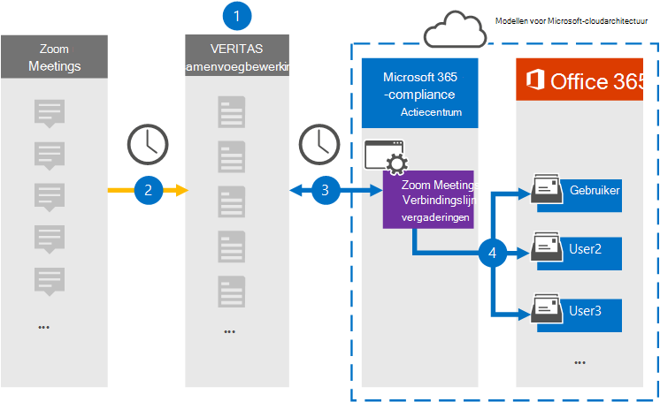

# Een verbindingslijn instellen voor het archiveren van gegevens van zoomvergaderingen

Gebruik een Veritas-connector in het Microsoft 365 compliancecentrum om gegevens uit zoomvergaderingen te importeren en te archiveren in postvakken van gebruikers in uw Microsoft 365 organisatie. Veritas biedt  een zoomvergaderingenconnector die is geconfigureerd om items uit de gegevensbron van derden vast te leggen (op regelmatige basis) en deze items te importeren in Microsoft 365. De verbindingslijn converteert de inhoud van de vergaderingen (inclusief chats, opgenomen bestanden en metagegevens) van het account Vergaderingen inzoomen naar een e-mailberichtindeling en importeert deze items vervolgens in gebruikerspostvakken in Microsoft 365.

Nadat gegevens van zoomvergaderingen zijn opgeslagen in gebruikerspostvakken, kunt u Microsoft 365 compliancefuncties toepassen, zoals Litigation Hold, eDiscovery, bewaarbeleid en bewaarlabels en communicatie compliance. Als u een zoomvergaderingenconnector gebruikt om gegevens te importeren en te archiveren in Microsoft 365 kunt u uw organisatie helpen aan het overheids- en regelgevingsbeleid te voldoen.

## Overzicht van het archiveren van zoomvergaderingen

In het volgende overzicht wordt uitgelegd hoe u een verbindingslijn gebruikt om gegevens van zoomvergaderingen te archiveren in Microsoft 365.

1. Uw organisatie werkt samen met Zoomvergaderingen om een site voor zoomvergaderingen in te stellen en te configureren.

2. Elke 24 uur worden vergaderitems van zoomvergaderingen gekopieerd naar de Veritas Merge1-site. De verbindingslijn converteert ook de inhoud van de vergaderingen naar een e-mailberichtindeling.

3. De connector Zoomvergaderingen die u maakt in het Microsoft 365 compliancecentrum, maakt elke dag verbinding met de Veritas Merge1 en draagt de vergaderberichten over naar een veilige Azure Storage-locatie in de Microsoft-cloud.

4. De connector importeert de geconverteerde vergaderingsitems in de postvakken van specifieke gebruikers met behulp van de waarde van de eigenschap *E-mail* en automatische gebruikerstoewijzing, zoals beschreven in stap 3. Een nieuwe submap in de map Postvak IN met de naam **Zoomvergaderingen** wordt gemaakt in postvakken van gebruikers en de vergaderingsitems worden geïmporteerd in die map. De verbindingslijn doet dit met behulp van de waarde van de eigenschap *E-mail.* Elk vergaderingsitem bevat deze eigenschap, die wordt gevuld met het e-mailadres van elke deelnemer aan de vergadering.

## Voordat u begint

- Maak een Veritas Merge1-account voor Microsoft-connectors. Neem contact op met [Veritas Customer Support](https://globanet.com/ms-connectors-contact)om dit account te maken. U meld u aan bij dit account wanneer u de verbindingslijn maakt in stap 1.

- Verkrijg de gebruikersnaam en het wachtwoord voor het Zoom Business- of Zoom Enterprise-account van uw organisatie. U moet zich aanmelden bij dit account in stap 2 wanneer u de connector Voor zoomvergaderingen configureert.

- Maak de volgende toepassingen in de [Zoom Marketplace:](https://marketplace.zoom.us)

  - OAuth-toepassing

  - JWT-toepassing

  Nadat u deze toepassingen hebt gemaakt, genereert het zoomplatform een set unieke referenties die worden gebruikt om de tokens te genereren. Deze tokens worden gebruikt om de verbindingslijn te verifiëren wanneer deze verbinding maakt met uw zoomaccount en items kopieert naar de merge1-site. U gebruikt deze tokens wanneer u de zoomconnector configureert in stap 2.

  Zie Handleiding Connectors van derden samenvoegen [voor stapsgewijse](https://docs.ms.merge1.globanetportal.com/Merge1%20Third-Party%20Connectors%20Zoom%20Meetings%20User%20Guide%20.pdf)instructies over het maken van de OAuth- en JWT-toepassingen.

- De gebruiker die de connector Voor zoomvergaderingen maakt in stap 1 (en deze voltooit in stap 3), moet worden toegewezen aan de rol Postvak importeren exporteren in Exchange Online. Deze rol is vereist om verbindingslijnen toe te voegen op de pagina **Gegevensconnectors** in het Microsoft 365 compliancecentrum. Deze rol is standaard niet toegewezen aan een rollengroep in Exchange Online. U kunt de rol Postvak importeren exporteren toevoegen aan de rollengroep Organisatiebeheer in Exchange Online. U kunt ook een rollengroep maken, de rol Postvak importeren exporteren toewijzen en vervolgens de juiste gebruikers toevoegen als leden. Zie de secties  Rollengroepen  maken of Rollengroepen wijzigen in het artikel 'Rollengroepen beheren in Exchange Online'.

## Stap 1: De verbindingslijn Zoomvergaderingen instellen

De eerste stap is om toegang te krijgen tot de gegevensconnectoren in het Microsoft 365 compliancecentrum en een **verbindingslijn** voor zoomvergaderingen te maken.

1. Ga naar [https://compliance.microsoft.com](https://compliance.microsoft.com/) en klik vervolgens op **Gegevensconnectoren**  >  **Zoomvergaderingen**.

2. Klik op **de pagina** Productbeschrijving zoomvergaderingen op **Verbindingslijn toevoegen.**

3. Klik op **de pagina Servicevoorwaarden** op **Accepteren.**

4. Voer een unieke naam in die de verbindingslijn identificeert en klik vervolgens op **Volgende.**

5. Meld u aan bij uw Merge1-account om de verbindingslijn te configureren.

## Stap 2: De verbindingslijn Zoomvergaderingen configureren

De tweede stap is het configureren van de verbindingslijn Zoomvergaderingen op de site Samenvoegen1. Zie Gebruikershandleiding voor [connectors](https://docs.ms.merge1.globanetportal.com/Merge1%20Third-Party%20Connectors%20Zoom%20Meetings%20User%20Guide%20.pdf)van derden samenvoegen voor meer informatie over het configureren van de connector Zoomvergaderingen op de site Veritas Merge1.

Nadat u op **Opslaan &** Voltooien  hebt geklikt, wordt de pagina Gebruikerstoewijzing in de wizard verbindingslijn in het Microsoft 365 compliancecentrum weergegeven.

## Stap 3: Gebruikers in kaart brengen en de configuratie van de connector voltooien

1. Schakel op **de pagina Externe gebruikers toewijzen Microsoft 365 gebruikers in,** automatische gebruikerstoewijzing in.

   Items voor zoomvergaderingen bevatten een eigenschap met de naam *E-mail* die e-mailadressen bevat voor gebruikers in uw organisatie. Als de verbindingslijn dit adres kan koppelen aan Microsoft 365 gebruiker, worden de items geïmporteerd in het postvak van die gebruiker

2. Klik **op Volgende,** bekijk uw instellingen en ga naar de pagina Gegevensconnectors om de voortgang van het importproces voor de nieuwe **verbindingslijn** te bekijken.

## Stap 4: De verbindingslijn Zoomvergaderingen controleren

Nadat u de verbindingslijn Zoomvergaderingen hebt gebruikt, kunt u de status van de verbindingslijn weergeven in het Microsoft 365 compliancecentrum.

1. Ga naar [https://compliance.microsoft.com](https://compliance.microsoft.com) en klik op **Gegevensconnectoren** in het linkernavigatievenster.

2. Klik op **het tabblad Verbindingslijnen** en selecteer vervolgens de **verbindingslijn Zoomvergaderingen** om de flyoutpagina weer te geven. Deze pagina bevat de eigenschappen en informatie over de verbindingslijn.

3. Klik **onder Verbindingsstatus met bron** op de koppeling Logboek **downloaden** om het statuslogboek voor de verbindingslijn te openen (of op te slaan). Dit logboek bevat informatie over de gegevens die zijn geïmporteerd in de Microsoft-cloud.

## Bekende problemen

- Op dit moment bieden we geen ondersteuning voor het importeren van bijlagen of items die groter zijn dan 10 MB. Ondersteuning voor grotere items is op een later tijdstip beschikbaar.

- Als de verbindingslijn Voor zoomvergaderingen werkt, moet u opnamen inschakelen bij het instellen van zoomvergaderingen.