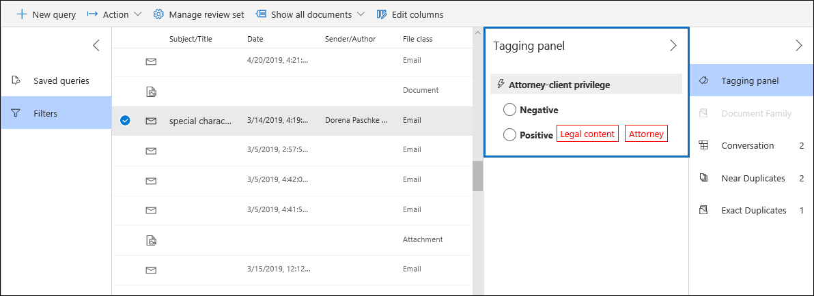

# Detectie van advocaten-clientrechten instellen in Advanced eDiscoverySet up attorney-client privilege detection in Advanced eDiscovery

Een belangrijk en duur aspect van de revisiefase van een eDiscovery-proces is het controleren van documenten op bevoorrechte inhoud.A major and costly aspect of the review phase of any eDiscovery process is reviewing documents for privileged content. Advanced eDiscovery biedt machine learning-gebaseerde detectie van bevoorrechte inhoud om dit proces efficiënter te maken.Advanced eDiscovery provides machine learning-based detection of privileged content to make this process more efficient. Deze functie wordt de *detectie van advocaten-clientvoorrechten genoemd.*This feature is called *attorney-client privilege detection*.

## Hoe werkt dit?How does it work?

Wanneer de detectie van advocaten-clientrechten is ingeschakeld, worden alle documenten in een revisieset verwerkt door het detectiemodel voor advocaten-clientrechten wanneer u de gegevens [in](analyzing-data-in-review-set.md) de revisieset analyseert.When attorney-client privilege detection is enabled, all documents in a review set will be processed by the attorney-client privilege detection model when you [analyze the data](analyzing-data-in-review-set.md) in the review set. Het model zoekt naar twee dingen:The model looks for two things:

- Bevoorrechte inhoud: het model maakt gebruik van machine learning om de kans te bepalen dat het document inhoud bevat die juridisch van aard is.Privileged content – The model uses machine learning to determine the likelihood that the document contains content that is legal in nature.

- Deelnemers: als onderdeel van het instellen van de detectie van advocaten-clientrechten, moet u een lijst met advocaten voor uw organisatie indienen.Participants – As part of setting up attorney-client privilege detection, you have to submit a list of attorneys for your organization. Het model vergelijkt vervolgens de deelnemers aan het document met de lijst met advocaten om te bepalen of een document ten minste één deelnemer aan de advocatenlijst heeft.The model then compares the participants of the document with the attorney list to determine if a document has at least one attorney participant.

Het model produceert de volgende drie eigenschappen voor elk document:The model produces the following three properties for every document:

- **AttorneyClientPrivilegeScore:** De kans dat het document juridisch van aard is; de waarden voor de score liggen tussen **0** en **1**.**AttorneyClientPrivilegeScore:** The likelihood the document is legal in nature; the values for the score are between **0** and **1**.

- **HasAttorney:** Deze eigenschap is ingesteld op **waar** als een van de deelnemers aan het document wordt vermeld in de lijst met advocaten. anders is de waarde **onwaar.****HasAttorney:** This property is set to **true** if one of the document participants is listed in the attorney list; otherwise the value is **false**. De waarde is ook ingesteld op **onwaar** als uw organisatie geen advocatenlijst heeft geüpload.The value is also set to **false** if your organization didn't upload an attorney list.

- **IsPrivilege:** Deze eigenschap is ingesteld op **waar** als de waarde voor **AttorneyClientPrivilegeScore** boven de drempel ligt of als het document een deelnemer aan de advocatenlijst heeft.  anders is de waarde ingesteld op **onwaar**.**IsPrivilege:** This property is set to **true** if the value for **AttorneyClientPrivilegeScore** is above the threshold *or* if the document has an attorney participant; otherwise the value is set to **false**.

Deze eigenschappen (en de bijbehorende waarden) worden toegevoegd aan de bestandsmetagegevens van de documenten in een revisieset, zoals wordt weergegeven in de volgende schermafbeelding:These properties (and their corresponding values) are added to the file metadata of the documents in a review set, as shown in the following screenshot:

Deze drie eigenschappen kunnen ook worden doorzocht in een revisieset.These three properties are also searchable within a review set. Zie Query's [uitvoeren op de gegevens in een revisieset voor meer informatie.](review-set-search.md)For more information, see [Query the data in a review set](review-set-search.md).

## Het detectiemodel voor advocaten-clientrechten instellenSet up the attorney-client privilege detection model

Als u het detectiemodel voor advocaten-clientrechten wilt inschakelen, moet uw organisatie het inschakelen en vervolgens een lijst met advocaten uploaden.To enable the attorney-client privilege detection model, your organization has to turn it on and then upload an attorney list.

### Stap 1: Detectie van advocaten-clientrechten in- en uit-Step 1: Turn on attorney-client privilege detection

Een persoon die een eDiscovery-beheerder in uw organisatie is (lid van de subgroep eDiscovery-beheerder in de rollengroep eDiscovery Manager) moet het model beschikbaar stellen in uw Advanced eDiscovery gevallen.A person who is an eDiscovery Administrator in your organization (a member of the eDiscovery Administrator subgroup in the eDiscovery Manager role group) must make the model available in your Advanced eDiscovery cases.

1. Ga in het & Compliancecentrum naar **eDiscovery > Advanced eDiscovery.**In the Security & Compliance Center, go to **eDiscovery > Advanced eDiscovery**.

2. Klik op **Advanced eDiscovery** startpagina in  de Instellingen op Globale analyse-instellingen **configureren.**On the **Advanced eDiscovery** home page, in the **Settings** tile, click **Configure global analytics settings**.

   

3. Selecteer op **het tabblad Analyse-instellingen** **de instelling Advocaten-clientvoorrecht beheren.**On the **Analytics settings** tab, select **Manage attorney-client privilege setting**.

4. Gebruik op **de flyout pagina Attorney-client privilege** de schakelknop om de functie in te schakelen en selecteer **opslaan.**On the **Attorney-client privilege** flyout page, use the toggle to turn on the feature and then select **Save**.

### Stap 2: Upload een lijst met advocaten (optioneel)Step 2: Upload a list of attorneys (optional)

Als u optimaal wilt profiteren van het detectiemodel voor advocaten-clientprivilege en gebruik wilt maken van de resultaten van de eerder beschreven detectie has **attorney** of **Potentially Privileged,** raden we u aan een lijst met e-mailadressen te uploaden voor de advocaten en juridisch personeel die voor uw organisatie werken.To take full advantage of the attorney-client privilege detection model and use the results of the **Has Attorney** or **Potentially Privileged** detection that was previously described, we recommend that you upload a list of email addresses for the lawyers and legal personnel who work for your organization. 

Een lijst met advocaten uploaden voor gebruik door het detectiemodel voor advocaten-clientrechten:To upload an attorney list for use by the attorney-client privilege detection model:

1. Maak een .csv bestand (zonder veldnamenrij) en voeg het e-mailadres voor elke juiste persoon toe aan een aparte regel.Create a .csv file (without a header row) and add the email address for each appropriate person on a separate line. Sla dit bestand op uw lokale computer op.Save this file to your local computer.

2. Selecteer op **Advanced eDiscovery** startpagina in  de tegel Instellingen experimentele functies configureren **en** selecteer vervolgens De instelling **Advocaten-client privilege beheren.**On the **Advanced eDiscovery** home page, in the **Settings** tile, select **Configure experimental features**, and then select **Manage attorney-client privilege setting**.

   De **pagina Advocaten-clientvoorrecht** wordt weergegeven en de schakelaar Detectie van **advocaten-clientrechten** is ingeschakeld.The **Attorney-client privilege** page is displayed, and the **Attorney-client privilege detection** toggle is turned on.

   

3. Selecteer **Bladeren** en selecteer vervolgens het .csv bestand dat u in stap 1 hebt gemaakt.Select **Browse** and then find and select the .csv file that you created in step 1.

4. Selecteer **Opslaan om** de lijst met advocaten te uploaden.Select **Save** to upload the attorney list.

## Het detectiemodel voor advocaten-clientrechten gebruikenUse the attorney-client privilege detection model

Volg de stappen in deze sectie om de detectie van advocaten-clientrechten te gebruiken voor documenten in een revisieset.Follow the steps in this section to use attorney-client privilege detection for documents in a review set.

### Stap 1: Een smart tag-groep maken met het detectiemodel voor advocaten-clientrechtenStep 1: Create a smart tag group with attorney-client privilege detection model

Een van de belangrijkste manieren om de resultaten van de detectie van advocaten-clientrechten in uw beoordelingsproces te zien, is door een smart tag-groep te gebruiken.One of the primary ways to see the results of attorney-client privilege detection in your review process is by using a smart tag group. Een groep met slimme tags geeft de resultaten aan van de detectie van het privilege van de advocatenclient en toont de resultaten in de regel naast de tags in een groep met slimme labels.A smart tag group indicates the results of the attorney-client privilege detection and shows the results in-line next to the tags in a smart tag group. Op deze manier kunt u snel potentieel bevoorrechte documenten identificeren tijdens de documentbeoordeling.This lets you quickly identify potentially privileged documents during document review. Daarnaast kunt u de tags in de groep slimme labels ook gebruiken om documenten te taggen als bevoorrecht of niet-bevoorrecht.Additionally, you can also use the tags in the smart tag group to tag documents as privileged or non-privileged. Zie Slimme tags instellen in Advanced eDiscovery voor meer informatie over slimme [tags.](smart-tags.md)For more information about smart tags, see [Set up smart tags in Advanced eDiscovery](smart-tags.md).

1. Selecteer in de revisieset met de documenten die u  hebt geanalyseerd in stap 1 de optie Controleset beheren en selecteer **vervolgens Tags beheren.**In the review set that contains the documents that you analyzed in Step 1, select **Manage review set** and then select **Manage tags**.
 
2. Selecteer **onder Tags** de pull-down naast De groep **Toevoegen** en selecteer vervolgens Groep Slimme **tags toevoegen.**Under **Tags**, select the pull-down next to **Add group** and then select **Add smart tag group**.

   

3. Kies op **de pagina Kies een model voor uw slimme tag** de optie **Selecteren** naast **Attorney-client privilege.**On the **Choose a model for your smart tag** page, choose **Select** next to **Attorney-client privilege**.

   Er wordt een taggroep met de naam **Attorney-client privilege** weergegeven.A tag group named **Attorney-client privilege** is displayed. Het bevat twee onderliggende tags **met** de naam Positief **en** Negatief, die overeenkomen met de mogelijke resultaten die door het model worden geproduceerd.It contains two child tags named **Positive** and **Negative**, which correspond to the possible results produced by the model.

   

3. Wijzig de naam van de taggroep en de tags die geschikt zijn voor uw beoordeling.Rename the tag group and tags as appropriate for your review. U kunt bijvoorbeeld de naam Positief **wijzigen in** **Bevoorrecht** en **Negatief in** **Niet geprivilegieerd.**For example, you can rename **Positive** to **Privileged** and **Negative** to **Not privileged**.

### Stap 2: Een revisieset analyserenStep 2: Analyze a review set

Wanneer u de documenten in een revisieset analyseert, wordt het detectiemodel voor advocaten-clientrechten ook uitgevoerd en worden de bijbehorende eigenschappen (beschreven in Hoe werkt [het?](#how-does-it-work) toegevoegd aan elk document in de revisieset).When you analyze the documents in a review set, the attorney-client privilege detection model will also run and the corresponding properties (described in [How does it work?](#how-does-it-work) will be added to every document in the review set. Zie Gegevens analyseren in een revisieset in Advanced eDiscovery voor meer informatie over het analyseren van gegevens [in de revisieset.](analyzing-data-in-review-set.md)For more information about analyzing data in review set, see [Analyze data in a review set in Advanced eDiscovery](analyzing-data-in-review-set.md).

### Stap 3: De groep slimme tags gebruiken voor het bekijken van bevoorrechte inhoudStep 3: Use the smart tag group for review of privileged content

Na het analyseren van de revisieset en het instellen van slimme tags, is de volgende stap het controleren van de documenten.After analyzing the review set and setting up smart tags, the next step is to review the documents. Als het model heeft vastgesteld dat het document potentieel  geprivilegieerd is, geeft de bijbehorende slimme tag in het deelvenster Labelen de volgende resultaten aan die zijn geproduceerd door de detectie van het advocaten-clientprivilege:If the model has determined the document is potentially privileged, the corresponding smart tag in the **Tagging panel** will indicate the following results produced by the attorney-client privilege detection:

- Als het document inhoud bevat die juridisch van aard kan zijn, wordt het label **Juridische** inhoud weergegeven naast de bijbehorende slimme tag (in dit geval de **standaard-positieve** tag).If the document has content that may be legal in nature, the label **Legal content** is displayed next to the corresponding smart tag (which in this case is the default **Positive** tag).

- Als het document een deelnemer bevat die is gevonden in de advocatenlijst van uw organisatie, wordt het label **Attorney** weergegeven naast de bijbehorende slimme tag (in dit geval ook de **standaard-positieve** tag).If the document has a participant who is found in your organization's attorney list, the label **Attorney** is displayed next to the corresponding smart tag (which in this case is also the default **Positive** tag).

- Als het document inhoud bevat die juridisch van aard kan zijn en  een  deelnemer heeft gevonden in de advocatenlijst, worden zowel de labels Juridische inhoud als Advocaten weergegeven. If the document has content that may be legal in nature *and* has a participant found in the attorney list, both the **Legal content**  and **Attorney** labels are displayed. 

Als in het model wordt bepaald dat een document geen inhoud bevat die juridisch van aard is of die geen deelnemer uit de lijst met advocaten bevat, wordt geen van beide etiketten weergegeven in het labelvenster.If the model determines that a document doesn't contain content that is legal in nature or doesn't contain a participant from the attorney list, then neither label is displayed in the tagging panel.

De volgende schermafbeeldingen bevatten bijvoorbeeld twee documenten.For example, the following screenshots show two documents. De eerste bevat inhoud die juridisch van aard is en die een deelnemer heeft gevonden in de lijst met advocaten.The first one contains content that is legal in nature and has a participant found in the list of attorneys. De tweede bevat geen van beide en geeft daarom geen etiketten weer.The second contains neither and therefore doesn't display any labels.

Nadat u een document hebt beoordeeld om te zien of het bevoorrechte inhoud bevat, kunt u het document taggen met de juiste tag.After you review a document to see if it contains privileged content, you can tag the document with the appropriate tag.
