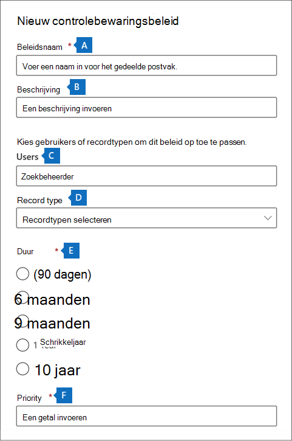

# <a name="manage-audit-log-retention-policies"></a>Retentiebeleid voor auditlogboek beheren

U kunt een bewaarbeleid voor auditlogboek maken en beheren in het beveiligings- en compliancecentrum. Retentiebeleid voor auditlogboeken maakt deel uit van de nieuwe geavanceerde controlemogelijkheden in Microsoft 365. Met een bewaarbeleid voor controlelogboeken kunt u opgeven hoelang controlelogboeken in uw organisatie moeten worden bewaard. U kunt auditlogboeken maximaal tien jaar bewaren. U kunt beleid maken op basis van de volgende criteria:

- Alle activiteiten in een of meer Microsoft 365-services

- Specifieke activiteiten (in een Microsoft 365-service) uitgevoerd door alle gebruikers of specifieke gebruikers

- Een prioriteitsniveau dat aangeeft welk beleid prioriteit heeft bij meerdere beleidsregels in uw organisatie

## <a name="default-audit-log-retention-policy"></a>Standaard retentiebeleid voor auditlogboek

Geavanceerde audit in Microsoft 365 biedt een standaard retentiebeleid voor auditlogboek voor alle organisaties. Met dit beleid blijven alle auditrecords van Exchange Online, SharePoint Online, OneDrive voor Bedrijven en Azure Active Directory één jaar bewaard. Met dit standaardbeleid blijven auditrecords behouden die de waarde **Exchange**, **SharePoint**, **OneDrive**, **AzureActiveDirectory** hebben voor de eigenschap **Workload** (de service waarin de activiteit heeft plaatsgevonden). Het standaardbeleid kan niet worden aangepast/ Zie de sectie [meer informatie](#more-information) in dit artikel voor een lijst met recordtypen voor elke workload die is opgenomen in het standaardbeleid.

> [!NOTE]
> Het standaardbeleid voor het bewaren van auditlogboek is alleen van toepassing op controlerecords voor activiteiten die zijn uitgevoerd door gebruikers aan wie een Office 365- of Microsoft 365 E5-licentie is toegewezen of die een licentie voor Microsoft 365 E5-naleving of E5 eDiscovery- en audit-invoeglicentie hebben. Als uw organisatie niet-E5-gebruikers of gastgebruikers heeft, worden de bijbehorende controlerecords 90 dagen bewaard.

## <a name="before-you-create-an-audit-log-retention-policy"></a>Voordat u een retentiebeleid voor het auditlogboek maakt

- U moet de rol Organisatieconfiguratie toegewezen krijgen in het Beveiligings- en compliancecentrum om een auditberetentiebeleid te maken of te wijzigen.

- Uw organisatie mag maximaal 50 beleidsregels voor auditlogboeken in uw organisatie hebben.

- Als u een auditlogboek langer dan 90 dagen (en maximaal 1 jaar) wilt bewaren, moet aan de gebruiker die het auditlogboek genereert (door een auditactiviteit uit te voeren) een licentie voor Office 365 E5 of Microsoft 365 E5 worden toegewezen of moet deze een licentie hebben voor Microsoft 365 E5 Compliance of E5 eDiscovery en een invoegtoepassingslicentie voor Audit. Als u auditlogboeken tien jaar wilt bewaren, moet de gebruiker die het auditlogboek genereert ook een invoegtoepassingslicentie voor de retentie van auditlogboeken van tien jaar krijgen, naast een E5-licentie.

- Alle aangepaste retentiebeleidsregels voor auditlogboeken (gemaakt door uw organisatie) hebben prioriteit boven het standaard retentiebeleid. Als u bijvoorbeeld een retentiebeleid voor auditlogboek maakt voor activiteiten in Exchange-postvakken met een bewaarperiode van minder dan één jaar, worden auditrecords voor activiteiten in Exchange-postvakken bewaard gedurende de kortere duur die is opgegeven in het aangepaste beleid.

## <a name="create-an-audit-log-retention-policy"></a>Een retentiebeleid voor het auditlogboek maken

1. Ga naar [https://compliance.microsoft.com](https://compliance.microsoft.com) en meld u aan met een gebruikersaccount aan welke de rol Organisatieconfiguratie is toegewezen op de pagina Machtigingen in het Beveiligings- en compliancecentrum.

2. Klik in het linkerdeelvenster van het Microsoft 365-compliancecentrum op **Alles weergeven** en klik vervolgens op **Audit**.

3. Klik op het tabblad **Bewaarbeleid voor audit**.

4. Klik **Retentiebeleidvoor audits maken** en vul de volgende velden in op de flyoutpagina:

    

   1. **Beleidsnaam:** de naam van het bewaarbeleid voor het auditlogboek. Deze naam moet uniek zijn in uw organisatie en kan niet meer worden gewijzigd nadat het beleid is gemaakt.

   2. **Beschrijving:** optioneel, maar handig om informatie te geven over het beleid, zoals het recordtype of de workload, gebruikers die zijn opgegeven in het beleid en de duur.

   3. **Gebruikers:** selecteer een of meer gebruikers op welke u het beleid wilt toepassen. Als u dit vak leeg laat, wordt het beleid toegepast op alle gebruikers. Als u het **Recordtype** leeg laat moet u een gebruiker selecteren.

   4. **Recordtype:** Het auditrecordtype waarop het beleid van toepassing is. Als u deze eigenschap leeg laat, moet u een gebruiker selecteren in het vak **Gebruikers**. U kunt één recordtype of meerdere recordtypen selecteren:

   - Als u één recordtype selecteert, wordt het veld **Activiteiten** dynamisch weergegeven. U kunt de vervolgkeuzelijst gebruiken om activiteiten te selecteren in het geselecteerde recordtype om het beleid toe te passen. Als u geen specifieke activiteiten kiest, wordt het beleid toegepast op alle activiteiten van het geselecteerde recordtype.

   - Als u meerdere recordtypen selecteert, kunt u geen activiteiten selecteren. Het beleid wordt toegepast op alle activiteiten van de geselecteerde recordtypes.

   5. **Duur:** de hoeveelheid tijd die nodig is voor het bewaren van de auditlogboeken die voldoen aan de criteria van het beleid.

   6. **Prioriteit:** Deze waarde bepaalt de volgorde waarin bewaarbeleid voor auditlogboek in uw organisatie wordt verwerkt. Een hogere waarde geeft een hogere prioriteit aan. Zo krijgt een beleid met een prioriteitswaarde van **5** prioriteit boven een beleid met een prioriteitswaarde van **0**. Zoals eerder uitgelegd heeft elk aangepast bewaarbeleid voor auditlogboek voorrang op het standaardbeleid voor uw organisatie.

5. Klik op **Opslaan** om het nieuwe retentiebeleid voor het auditlogboek te maken.

   Het nieuwe beleid wordt weergegeven in de lijst op het tabblad **Bewaarbeleid audit** tabblad.

## <a name="manage-audit-log-retention-policies"></a>Retentiebeleid voor auditlogboek beheren

Bewaarbeleid voor auditlogboekgegevens wordt weergegeven op het tabblad **Controle bewaarbeleid** (ook wel het *dashboard* genoemd). U kunt het dashboard gebruiken om auditbewaarbeleid weer te geven, te bewerken en te verwijderen.

### <a name="view-policies-in-the-dashboard"></a>Beleid op het dashboard weergeven

Bewaarbeleidsregels voor auditlogboek wordt op het dashboard vermeld. Een voordeel van het weergeven van beleid in het dashboard is dat u op de kolom **Prioriteit** kunt klikken om de beleidsregels weer te geven met de prioriteit waarin ze worden toegepast. Zoals eerder gezegd, geeft een hogere waarde een hogere prioriteit aan.


U kunt ook een beleid selecteren om de instellingen ervan weer te geven op de flyoutpagina.

> [!NOTE]
> Het standaardbeleid voor het bewaren van auditlogboek voor uw organisatie wordt niet weergegeven op het dashboard.

### <a name="edit-policies-in-the-dashboard"></a>Beleid op het dashboard weergeven

Als u een beleid wilt bewerken, selecteert u het om de flyoutpagina weer te geven. U kunt een of meer instellingen wijzigen en uw wijzigingen vervolgens opslaan.


> [!IMPORTANT]
> Als u de cmdlet **New-UnifiedAuditLogRetentionPolicy** van  gebruikt, is het mogelijk om een bewaarbeleid voor auditlogboek te maken voor recordtypen of activiteiten die niet beschikbaar zijn in het hulpprogramma **Bewaarbeleid audit maken** in het dashboard. In dit geval kunt u het beleid niet bewerken (bijvoorbeeld de duur van het bewaren wijzigen of activiteiten toevoegen en verwijderen) uit het dashboard **Bewaarbeleid audit**. U kunt het beleid alleen weergeven en verwijderen in het compliancecentrum. Als u het beleid wilt bewerken, moet u de cmdlet [Set-UnifiedAuditLogRetentionPolicy](/powershell/module/exchange/set-unifiedauditlogretentionpolicy) in het Beveiligings- en compliancecentrum PowerShell gebruiken.<br/><br/>**Tip:** boven aan de flyoutpagina wordt een bericht weergegeven voor beleidsregels die moeten worden bewerkt met PowerShell.

### <a name="delete-policies-in-the-dashboard"></a>Beleid op het dashboard verwijderen

Als u beleidsregels wilt verwijderen, klikt u op **Verwijderen**  en bevestigt u dat u het beleid wilt verwijderen. Het beleid wordt verwijderd uit het dashboard, maar het kan 30 minuten duren voordat het beleid uit uw organisatie is verwijderd.

## <a name="create-and-manage-audit-log-retention-policies-in-powershell"></a>Bewaarbeleid voor auditlogboek maken en beheren in PowerShell

U kunt een bewaarbeleid voor auditlogboek maken en beheren in het Beveiligings- en compliancecentrum. Een van de redenen om PowerShell te gebruiken is om een beleid te maken voor een recordtype of activiteit die niet beschikbaar is in de gebruikersinterface.

### <a name="create-an-audit-log-retention-policy-in-powershell"></a>Een retentiebeleid voor het auditlogboek maken in PowerShell

Volg deze stappen om een retentiebeleid voor het auditlogboek te maken in PowerShell:

1. [Verbinding maken met Beveiligings- en compliancecentrum van Powershell](/powershell/exchange/connect-to-scc-powershell).

2. Voer de volgende opdracht uit om een bewaarbeleid voor het auditlogboek te maken.

   ```powershell
   New-UnifiedAuditLogRetentionPolicy -Name "Microsoft Teams Audit Policy" -Description "One year retention policy for all Microsoft Teams activities" -RecordTypes MicrosoftTeams -RetentionDuration TenYears -Priority 100
   ```

    In dit voorbeeld wordt een bewaarbeleid voor het auditlogboek met de naam 'Auditbeleid van Microsoft Teams' gemaakt met de volgende instellingen:

   - Een korte beschrijving van het onderwerp.

   - Behoudt alle activiteiten van Microsoft Teams (zoals gedefinieerd door de *RecordType* parameter).

   - In dit programma worden auditlogboeken van Microsoft Teams 10 jaar bewaard.

   - Een prioriteit van 100.

Hier is nog een voorbeeld van het maken van een bewaarbeleid voor auditlogboeken. Met dit beleid blijven auditlogboeken voor de activiteit 'Gebruiker aangemeld' zes maanden bewaard voor de admin@contoso.onmicrosoft.com.

```powershell
New-UnifiedAuditLogRetentionPolicy -Name "SixMonth retention for admin logons" -RecordTypes AzureActiveDirectoryStsLogon -Operations UserLoggedIn -UserIds admin@contoso.onmicrosoft.com -RetentionDuration SixMonths -Priority 25
```

Zie [New-UnifiedAuditLogRetentionPolicy](/powershell/module/exchange/new-unifiedauditlogretentionpolicy) voor meer informatie.

### <a name="view-policies-in-powershell"></a>Beleid weergeven in PowerShell

Om bewaarbeleid voor auditlogboeken te bekijken, moet u de cmdlet [Set-UnifiedAuditLogRetentionPolicy](/powershell/module/exchange/get-unifiedauditlogretentionpolicy) in het Beveiligings- en compliancecentrum PowerShell gebruiken.

Hier is een voorbeeldopdracht om de instellingen weer te geven voor alle bewaarbeleidsregels voor auditlogboek in uw organisatie. Met deze opdracht worden de beleidsregels gesorteerd van hoogste naar laagste prioriteit.

```powershell
Get-UnifiedAuditLogRetentionPolicy | Sort-Object -Property Priority -Descending | FL Priority,Name,Description,RecordTypes,Operations,UserIds,RetentionDuration
```

> [!NOTE]
> De cmdlet **Get-UnifiedAuditLogRetentionPolicy** retourneert niet het standaard bewaarbeleid voor auditlogboek voor uw organisatie.

### <a name="edit-policies-in-powershell"></a>Beleid bewerken in PowerShell

Om een bestaand bewaarbeleid voor auditlogboeken te bewerken, moet u de cmdlet [Set-UnifiedAuditLogRetentionPolicy](/powershell/module/exchange/set-unifiedauditlogretentionpolicy) in het Beveiligings- en compliancecentrum PowerShell gebruiken.

### <a name="delete-policies-in-powershell"></a>Beleid verwijderen in PowerShell

Om bewaarbeleid voor auditlogboeken te verwijderen, moet u de cmdlet [Remove-UnifiedAuditLogRetentionPolicy](/powershell/module/exchange/remove-unifiedauditlogretentionpolicy) in het Beveiligings- en compliancecentrum PowerShell gebruiken. Het kan 30 minuten duren voordat het beleid uit uw organisatie is verwijderd.

## <a name="more-information"></a>Meer informatie

Zoals eerder vermeld, worden auditrecords voor bewerkingen in Azure Active Directory, Exchange Online, SharePoint Online en OneDrive voor Bedrijven standaard één jaar bewaard. De volgende tabel bevat alle recordtypen (voor elk van deze services) die zijn opgenomen in het standaard bewaarbeleid voor het auditlogboek. Dit betekent dat controlelogboeken voor elke bewerking met dit recordtype één jaar worden bewaard, tenzij een aangepast bewaarbeleid voor het auditlogboek prioriteit heeft voor een bepaald recordtype, een bepaalde bewerking of een specifieke gebruiker. De ENUM-waarde (die wordt weergegeven als de waarde voor de eigenschap RecordType in een controlerecord) voor elk recordtype wordt tussen haakjes weergegeven.

|AzureActiveDirectory |Exchange  |SharePoint of OneDrive|
|:---------|:---------|:---------|
|AzureActiveDirectory (8)|ExchangeAdmin (1)|ComplianceDLPSharePoint (11)|
|AzureActiveDirectoryAccountLogon (9)|ExchangeItem (2)|ComplianceDLPSharePointClassification (33)|
|AzureActiveDirectoryStsLogon (15)|Campagne (62)|Project (35)|
||ComplianceDLPExchange (13)|SharePoint (4)|
||ComplianceSupervisionExchange (68)|SharePointCommentOperation (37)|
||CustomerKeyServiceEncryption (69)|SharePointContentTypeOperation (55)|
||ExchangeAggregatedOperation (19)|SharePointFieldOperation (56)|
||ExchangeItemAggregated (50)|SharePointFileOperation (6)|
||ExchangeItemGroup (3)|SharePointListOperation (36)|
||InformationBarrierPolicyApplication (53)|SharePointSharingOperation (14)|
||||
