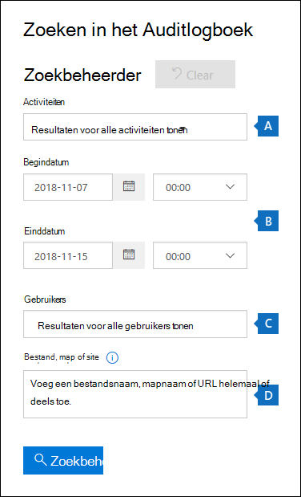
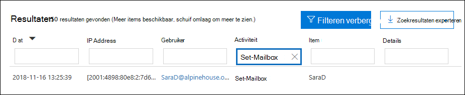
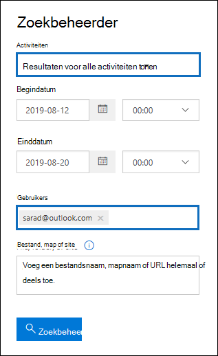

# <a name="search-the-audit-log-to-investigate-common-support-issues"></a>Het auditlogboek doorzoeken om veelvoorkomende ondersteuningsproblemen te onderzoeken

In dit artikel wordt beschreven hoe u het zoekprogramma voor auditlogboek kunt gebruiken om veelvoorkomende ondersteuningsproblemen te onderzoeken. Dit geldt ook voor het gebruik van het auditlogboek om:

- Het IP-adres zoeken van de computer die wordt gebruikt voor toegang tot een gekromd account
- Bepalen wie het doorsturen van e-mail voor een postvak heeft ingesteld
- Bepalen of een gebruiker e-mailitems in zijn postvak heeft verwijderd
- Bepalen of een gebruiker een regel voor Postvak IN heeft gemaakt
- Onderzoeken waarom een gebruiker buiten uw organisatie zich succesvol heeft aanmelden
- Zoeken naar postvakactiviteiten die worden uitgevoerd door gebruikers met niet-E5-licenties
- Zoeken naar postvakactiviteiten die zijn uitgevoerd door gemachtigde gebruikers

## <a name="using-the-audit-log-search-tool"></a>Het zoekprogramma voor auditlogboek gebruiken

Elk van de scenario's voor het oplossen van problemen die in dit artikel worden beschreven, is gebaseerd op het zoekprogramma voor auditlogboek in het beveiligings- & compliancecentrum. In deze sectie worden de machtigingen vermeld die nodig zijn voor het doorzoeken van het auditlogboek en worden de stappen beschreven voor het openen en uitvoeren van zoekopdrachten in het auditlogboek. In elke scenariosectie wordt uitgelegd hoe u een zoekquery voor een auditlogboek configureert en wat u moet zoeken in de gedetailleerde informatie in de auditrecords die voldoen aan de zoekcriteria.

### <a name="permissions-required-to-use-the-audit-log-search-tool"></a>Machtigingen die nodig zijn voor het gebruik van het zoekprogramma voor het auditlogboek

U moet de rol auditlogboeken View-Only auditlogboeken in Exchange Online toegewezen om het auditlogboek te doorzoeken. Deze rollen worden standaard toegewezen aan de rollengroepen Compliancebeheer en Organisatiebeheer op de pagina **Machtigingen** in het Exchange-beheercentrum. Globale beheerders in Office 365 en Microsoft 365 worden automatisch toegevoegd als leden van de rollengroep Organisatiebeheer in Exchange Online. Zie voor meer informatie [Rollengroepen beheren in Exchange Online](/Exchange/permissions-exo/role-groups).

### <a name="running-audit-log-searches"></a>Zoekopdrachten in auditlogboek uitvoeren

In deze sectie worden de basisbeginselen beschreven voor het maken en uitvoeren van zoekopdrachten in auditlogboek. Gebruik deze instructies als uitgangspunt voor elk probleemoplossingsscenario in dit artikel. Zie Het auditlogboek doorzoeken voor meer gedetailleerde [stapsgewijse instructies.](search-the-audit-log-in-security-and-compliance.md#step-1-run-an-audit-log-search)

1. Ga naar [https://protection.office.com/unifiedauditlog](https://protection.office.com/unifiedauditlog) en meld u aan met uw werk- of schoolaccount.
    
    De pagina **Zoeken in het auditlogboek** wordt weergegeven. 
    
    
  
4. U kunt de volgende zoekcriteria configureren. In elk probleemoplossingsscenario in dit artikel worden specifieke richtlijnen aanbevolen voor het configureren van deze velden.
    
    a. **Activiteiten:** Selecteer de vervolgkeuzelijst om de activiteiten weer te geven die u kunt zoeken. Nadat u de zoekopdracht hebt uitgevoerd, worden alleen de auditrecords voor de geselecteerde activiteiten weergegeven. Als **u Resultaten voor alle activiteiten tonen selecteert,** worden resultaten weergegeven voor alle activiteiten die voldoen aan de andere zoekcriteria. U moet dit veld ook leeg laten in sommige scenario's voor het oplossen van problemen.
    
    b. **Begindatum** en **einddatum:** Selecteer een datum en tijdbereik om de gebeurtenissen weer te geven die binnen die periode hebben plaatsgevonden. De laatste zeven dagen zijn standaard geselecteerd. De datum en tijd worden weergegeven in de UTC-indeling (Coordinated Universal Time). Het grootste datumbereik dat u kunt opgeven is 90 dagen.

    c. **Gebruikers:** Klik in dit vak en selecteer een of meer gebruikers om zoekresultaten weer te geven. Auditrecords voor de geselecteerde activiteit die wordt uitgevoerd door de gebruikers die u in dit vak selecteert, worden weergegeven in de lijst met resultaten. Laat dit vak leeg als u vermeldingen wilt zien voor alle gebruikers (en serviceaccounts) in uw organisatie.
    
    d. **Bestand, map of site:** Typ een of meer bestanden of mappen om te zoeken naar activiteiten die betrekking hebben op het mapbestand dat het opgegeven trefwoord bevat. U kunt ook een URL van een bestand of map opgeven. Als u een URL gebruikt, moet u het volledige URL-pad typen of als u slechts een deel van de URL typt, geen speciale tekens of spaties bevatten. Laat dit vak leeg als u vermeldingen wilt zien voor alle bestanden en mappen in uw organisatie. Dit veld is leeg in alle scenario's voor probleemoplossing in dit artikel.
    
5. Selecteer **Zoeken** om de zoekopdracht uit te voeren met behulp van uw zoekcriteria. 
    
    De zoekresultaten worden geladen en worden na enkele ogenblikken weergegeven onder Resultaten **op** de **zoekpagina auditlogboek.** Elk van de secties in dit artikel bevat richtlijnen voor dingen die u moet zoeken in de context van het specifieke probleemoplossingsscenario.

    Zie voor meer informatie over het weergeven, filteren of exporteren van zoekresultaten in het auditlogboek:

    - [Zoekresultaten weergeven](search-the-audit-log-in-security-and-compliance.md#step-2-view-the-search-results)
    - [Zoekresultaten filteren](search-the-audit-log-in-security-and-compliance.md#step-3-filter-the-search-results)
    - [Zoekresultaten exporteren](search-the-audit-log-in-security-and-compliance.md#step-4-export-the-search-results-to-a-file)

## <a name="find-the-ip-address-of-the-computer-used-to-access-a-compromised-account"></a>Het IP-adres zoeken van de computer die wordt gebruikt voor toegang tot een gekromd account

Het IP-adres dat overeenkomt met een activiteit die door een gebruiker wordt uitgevoerd, is opgenomen in de meeste auditrecords. Informatie over de gebruikte client wordt ook opgenomen in de auditrecord.

U kunt als volgende een zoekquery voor een auditlogboek configureren voor dit scenario:

**Activiteiten:** Als dit relevant is voor uw zaak, selecteert u een specifieke activiteit om naar te zoeken. Als u problemen met gecompromitteerde accounts wilt oplossen, kunt u de **gebruiker** die is aangemeld bij postvakactiviteit selecteren **onder Exchange postvakactiviteiten.** Hiermee retourneert u controlerecords met het IP-adres dat is gebruikt bij het aanmelden bij het postvak. Anders laat u dit veld leeg om controlerecords voor alle activiteiten te retourneren. 

> [!TIP]
> Als u dit veld leeg laat, worden **UserLoggedIn-activiteiten** als Azure Active Directory activiteit die aangeeft dat iemand zich heeft aangemeld bij een gebruikersaccount. Gebruik filteren in de zoekresultaten om de **auditrecords van UserLoggedIn** weer te geven.

**Begindatum** en **einddatum:** Selecteer een datumbereik dat van toepassing is op uw onderzoek.

**Gebruikers:** Als u een gekromd account onderzoekt, selecteert u de gebruiker van wie het account is gehackt. Hiermee worden auditrecords voor activiteiten die door dat gebruikersaccount worden uitgevoerd, als retourneert.

**Bestand, map of site:** Laat dit veld leeg.

Nadat u de zoekopdracht hebt uitgevoerd, wordt het IP-adres voor elke activiteit weergegeven in de **kolom IP-adres** in de zoekresultaten. Selecteer de record in de zoekresultaten om meer gedetailleerde informatie weer te geven op de flyoutpagina.

## <a name="determine-who-set-up-email-forwarding-for-a-mailbox"></a>Bepalen wie het doorsturen van e-mail voor een postvak heeft ingesteld

Wanneer e-mail doorsturen is geconfigureerd voor een postvak, worden e-mailberichten die naar het postvak worden verzonden, doorgestuurd naar een ander postvak. Berichten kunnen worden doorgestuurd naar gebruikers binnen of buiten uw organisatie. Wanneer e-mail doorsturen is ingesteld op een postvak, is de onderliggende Exchange Online cmdlet die wordt **gebruikt, Set-Mailbox.**

U kunt als volgende een zoekquery voor een auditlogboek configureren voor dit scenario:

**Activiteiten:** Laat dit veld leeg, zodat de zoekopdracht auditrecords retourneert voor alle activiteiten. Dit is nodig om controlerecords te retourneren die betrekking hebben op de cmdlet **Postvak** instellen.

**Begindatum** en **einddatum:** Selecteer een datumbereik dat van toepassing is op uw onderzoek.

**Gebruikers:** Tenzij u een probleem met het doorsturen van e-mail voor een specifieke gebruiker onderzoekt, laat u dit veld leeg. Op deze manier kunt u bepalen of het doorsturen van e-mail is ingesteld voor elke gebruiker.

**Bestand, map of site:** Laat dit veld leeg.

Nadat u de zoekopdracht hebt uitgevoerd, **selecteert** u Resultaten filteren op de pagina met zoekresultaten. Typ in het vak onder **Kolomkop** activiteit de tekst **Postvak** instellen zodat alleen auditrecords met betrekking tot de **cmdlet** Postvak instellen worden weergegeven.



Op dit moment moet u de details van elke auditrecord bekijken om te bepalen of de activiteit gerelateerd is aan het doorsturen van e-mail. Selecteer de auditrecord om de **flyoutpagina Details** weer te geven en selecteer vervolgens **Meer informatie.** De volgende schermafbeelding en beschrijvingen markeren de informatie die aangeeft dat het doorsturen van e-mail is ingesteld in het postvak.


a. In het **veld ObjectId** wordt de alias van het postvak waarin het doorsturen van e-mail is ingesteld, weergegeven. Dit postvak wordt ook weergegeven in de **kolom Item** op de pagina met zoekresultaten.

b. In het **veld Parameters** geeft De waarde *ForwardingSmtpAddress* aan dat het doorsturen van e-mail is ingesteld in het postvak. In dit voorbeeld wordt e-mail doorgestuurd naar het e-mailadres mike@contoso.com, dat zich buiten de alpinehouse.onmicrosoft.com organisatie.

c. De *waarde* Waar voor de parameter *DeliverToMailboxAndForward* geeft aan dat een  kopie van het bericht wordt bezorgd bij sarad@alpinehouse.onmicrosoft.com en wordt doorgestuurd naar het e-mailadres dat is opgegeven door de parameter *ForwardingSmtpAddress,* die in dit voorbeeld mike@contoso.com. Als de waarde voor de *parameter DeliverToMailboxAndForward* is ingesteld op *Onwaar,* wordt e-mail alleen doorgestuurd naar het adres dat is opgegeven door de parameter *ForwardingSmtpAddress.* Het wordt niet geleverd aan het postvak dat is opgegeven in het **veld ObjectId.**

d. Het **veld UserId** geeft de gebruiker aan die het doorsturen van e-mail heeft ingesteld op het postvak dat is opgegeven in het **veld ObjectId.** Deze gebruiker wordt ook weergegeven in de kolom **Gebruiker** op de pagina met zoekresultaten. In dit geval lijkt het erop dat de eigenaar van het postvak het doorsturen van e-mail in haar postvak heeft ingesteld.

Als u bepaalt dat het doorsturen van e-mail niet in het postvak moet worden ingesteld, kunt u dit verwijderen door de volgende opdracht uit te voeren in Exchange Online PowerShell:

```powershell
Set-Mailbox <mailbox alias> -ForwardingSmtpAddress $null 
```

Zie het artikel Postvak instellen voor meer informatie over de parameters voor het doorsturen van [e-mail.](/powershell/module/exchange/set-mailbox)

## <a name="determine-if-a-user-deleted-email-items"></a>Bepalen of een gebruiker e-mailitems heeft verwijderd

Vanaf januari 2019 wordt de logboekregistratie voor postvakken standaard ingeschakeld voor alle Office 365 en Microsoft-organisaties. Dit betekent dat bepaalde acties die door postvakeigenaren worden uitgevoerd, automatisch worden geregistreerd en dat de bijbehorende auditrecords voor postvakken beschikbaar zijn wanneer u ze zoekt in het postvakauditlogboek. Voordat postvakcontrole standaard is ingeschakeld, moest u dit handmatig inschakelen voor elk gebruikerspostvak in uw organisatie. 

De postvakacties die standaard zijn vastgelegd, omvatten de acties SoftDelete en HardDelete-postvak die zijn uitgevoerd door postvakeigenaren. Dit betekent dat u de volgende stappen kunt gebruiken om in het auditlogboek te zoeken naar gebeurtenissen met betrekking tot verwijderde e-mailitems. Zie Postvakcontrole beheren voor meer informatie over het standaard controleren van [postvakken.](enable-mailbox-auditing.md)

U kunt als volgende een zoekquery voor een auditlogboek configureren voor dit scenario:

**Activiteiten:** Selecteer **onder Exchange postvakactiviteiten** een of beide van de volgende activiteiten:

- **Verwijderde berichten uit de map Verwijderde items:** Deze activiteit komt overeen met de auditactie Voor postvak **SoftDelete.** Deze activiteit wordt ook vastgelegd wanneer een gebruiker een item definitief verwijdert door het item te selecteren en op **Shift+Delete te drukken.** Nadat een item definitief is verwijderd, kan de gebruiker het herstellen totdat de bewaarperiode van het verwijderde item is verlopen.

- **Verwijderde berichten uit postvak:** Deze activiteit komt overeen met de auditactie Voor postvak **HardDelete.** Dit wordt vastgelegd wanneer een gebruiker een item uit de map Herstelbare items haalt. Beheerders kunnen het hulpprogramma Inhoud zoeken in het beveiligings- en compliancecentrum gebruiken om verwijderde items te zoeken en te herstellen totdat de bewaarperiode van het verwijderde item verloopt of langer als het postvak van de gebruiker in de wacht staat.

**Begindatum** en **einddatum:** Selecteer een datumbereik dat van toepassing is op uw onderzoek.

**Gebruikers:** Als u een gebruiker in dit veld selecteert, retourneert het zoekprogramma voor auditlogboek auditrecords voor e-mailitems die zijn verwijderd (SoftDeleted of HardDeleted) door de gebruiker die u opgeeft. Soms is de gebruiker die een e-mailbericht verwijdert mogelijk niet de eigenaar van het postvak.

**Bestand, map of site:** Laat dit veld leeg.

Nadat u de zoekopdracht hebt uitgevoerd, kunt u de zoekresultaten filteren om de auditrecords weer te geven voor zacht verwijderde items of voor hard-verwijderde items. Selecteer de auditrecord om de **flyoutpagina Details** weer te geven en selecteer vervolgens **Meer informatie.** Aanvullende informatie over het verwijderde item, zoals de onderwerpregel en de locatie van het item toen het werd verwijderd, wordt weergegeven in het veld **AffectedItems.** In de volgende schermafbeeldingen wordt een voorbeeld van het **veld AffectedItems** van een zacht verwijderd item en een hard-verwijderd item.

**Voorbeeld van het veld AffectedItems voor zacht verwijderd item**


**Voorbeeld van het veld AffectedItems voor hard-deleted item**


### <a name="recover-deleted-email-items"></a>Verwijderde e-mailitems herstellen

Gebruikers kunnen snel verwijderde items herstellen als de bewaarperiode voor verwijderde items niet is verlopen. In Exchange Online is de standaard bewaarperiode voor verwijderde items 14 dagen, maar beheerders kunnen deze instelling verhogen tot maximaal 30 dagen. Wijs gebruikers naar [het artikel Verwijderde items](https://support.office.com/article/Recover-deleted-items-or-email-in-Outlook-Web-App-C3D8FC15-EEEF-4F1C-81DF-E27964B7EDD4) of e-mail herstellen in Outlook webartikel voor instructies over het herstellen van verwijderde items.

Zoals eerder is uitgelegd, kunnen beheerders mogelijk verwijderde items herstellen als de bewaarperiode van het verwijderde item niet is verlopen of als het postvak in bewaring staat, in welk geval items worden bewaard totdat de bewaringsduur verloopt. Wanneer u een inhoudszoekactie uitvoert, worden zacht verwijderde en hard verwijderde items in de map Herstelbare items geretourneerd in de zoekresultaten als ze overeenkomen met de zoekquery. Zie Inhoud zoeken in Office 365 voor meer informatie over het uitvoeren van [inhoudszoekingen.](content-search.md)

> [!TIP]
> Als u wilt zoeken naar verwijderde e-mailitems, zoekt u naar de onderwerpregel die wordt weergegeven in het veld **AffectedItems** in de auditrecord.

## <a name="determine-if-a-user-created-an-inbox-rule"></a>Bepalen of een gebruiker een regel voor Postvak IN heeft gemaakt

Wanneer gebruikers een regel voor postvak IN maken voor Exchange Online postvak, wordt een bijbehorende auditrecord opgeslagen in het auditlogboek. Zie voor meer informatie over regels voor Postvak IN:

- [Regels voor Postvak IN gebruiken in Outlook web](https://support.office.com/article/use-inbox-rules-in-outlook-on-the-web-8400435c-f14e-4272-9004-1548bb1848f2)
- [E-mailberichten in Outlook beheren met behulp van regels](https://support.office.com/article/Manage-email-messages-by-using-rules-C24F5DEA-9465-4DF4-AD17-A50704D66C59)

U kunt als volgende een zoekquery voor een auditlogboek configureren voor dit scenario:

**Activiteiten:** Selecteer **onder Exchange postvakactiviteiten** de optie **Nieuw-Postvak INRegel Maken/wijzigen/inschakelen/uitschakelen van de regel Postvak IN.**

**Begindatum** en **einddatum:** Selecteer een datumbereik dat van toepassing is op uw onderzoek.

**Gebruikers:** Tenzij u een specifieke gebruiker onderzoekt, laat u dit veld leeg. Op deze manier kunt u nieuwe regels voor postvak IN identificeren die door elke gebruiker zijn ingesteld.

**Bestand, map of site:** Laat dit veld leeg.

Nadat u de zoekopdracht hebt uitgevoerd, worden auditrecords voor deze activiteit weergegeven in de zoekresultaten. Selecteer een auditrecord om de **flyoutpagina Details** weer te geven en selecteer vervolgens **Meer informatie.** In het veld Parameters wordt informatie over de instellingen voor de regels voor **postvak** IN weergegeven. De volgende schermafbeelding en beschrijvingen markeren de informatie over regels voor postvak IN.


a. In het **veld ObjectId** wordt de volledige naam van de regel voor postvak IN weergegeven. Deze naam bevat de alias van het postvak van de gebruiker (bijvoorbeeld SaraD) en de naam van de regel voor postvak IN (bijvoorbeeld 'Berichten van beheerder verplaatsen').

b. In het **veld Parameters** wordt de voorwaarde van de regel postvak IN weergegeven. In dit voorbeeld wordt de voorwaarde opgegeven door de parameter *Van.* De waarde die is gedefinieerd voor de parameter *Van* geeft aan dat de regel voor postvak IN werkt op e-mail die wordt verzonden door admin@alpinehouse.onmicrosoft.com. Zie het artikel [New-InBoxRule](/powershell/module/exchange/new-inboxrule) voor een volledige lijst met parameters die kunnen worden gebruikt om voorwaarden voor regels voor Postvak IN te definiëren.

c. De *parameter MoveToFolder* geeft de actie voor de regel postvak IN op. In dit voorbeeld worden berichten van admin@alpinehouse.onmicrosoft.com verplaatst naar de map Met de naam *AdminSearch.* Zie ook het [artikel Nieuw-Postvak INRule](/powershell/module/exchange/new-inboxrule) voor een volledige lijst met parameters die kunnen worden gebruikt om de actie van een regel voor Postvak IN te definiëren.

d. Het **veld UserId** geeft de gebruiker aan die de regel voor het Postvak IN heeft gemaakt die is opgegeven in het **veld ObjectId.** Deze gebruiker wordt ook weergegeven in de kolom **Gebruiker** op de pagina met zoekresultaten.

## <a name="investigate-why-there-was-a-successful-login-by-a-user-outside-your-organization"></a>Onderzoeken waarom een gebruiker buiten uw organisatie zich succesvol heeft aanmelden

Bij het controleren van auditrecords in het auditlogboek ziet u mogelijk records die aangeven dat een externe gebruiker is geverifieerd door Azure Active Directory en is aangemeld bij uw organisatie. Een beheerder in contoso.onmicrosoft.com kan bijvoorbeeld een auditrecord zien waaruit blijkt dat een gebruiker uit een andere organisatie (bijvoorbeeld fabrikam.onmicrosoft.com) zich heeft aangemeld bij contoso.onmicrosoft.com. Op dezelfde manier kunt u auditrecords zien die aangeven dat gebruikers met een Microsoft-account (MSA), zoals een Outlook.com of Live.com, zijn aangemeld bij uw organisatie. In deze situaties is de gecontroleerde activiteit **Gebruiker aangemeld.** 

Dit gedrag is inherent aan het ontwerp van het product. Azure Active Directory (Azure AD), de adreslijstservice, staat iets toe dat *pass-throughverificatie* wordt genoemd wanneer een externe gebruiker toegang probeert te krijgen tot een SharePoint-site of een OneDrive locatie in uw organisatie. Wanneer de externe gebruiker dit probeert te doen, wordt hem of haar gevraagd zijn of haar referenties in te voeren. Azure AD gebruikt de referenties om de gebruiker te verifiëren, wat betekent dat alleen Azure AD controleert of de gebruiker is wie hij of zij zegt te zijn. De indicatie van de geslaagde aanmelding in de auditrecord is het resultaat van azure AD die de gebruiker authenticeert. De geslaagde aanmelding betekent niet dat de gebruiker toegang heeft tot resources of andere acties in uw organisatie heeft kunnen uitvoeren. Het geeft alleen aan dat de gebruiker is geverifieerd door Azure AD. Als een pass-through gebruiker toegang heeft tot SharePoint- of OneDrive-bronnen, moet een gebruiker in uw organisatie een resource expliciet delen met de externe gebruiker door hen een uitnodiging voor delen of een koppeling voor anoniem delen te sturen. 

> [!NOTE]
> Azure AD staat alleen pass *through-verificatie* toe voor toepassingen van een eerste partij, zoals SharePoint Online en OneDrive voor Bedrijven. Het is niet toegestaan voor andere toepassingen van derden.

Hier volgen een voorbeeld en beschrijvingen van relevante eigenschappen in een auditrecord voor een gebruiker die is aangemeld **als** dit het resultaat is van pass-throughverificatie. Selecteer de auditrecord om de **flyoutpagina Details** weer te geven en selecteer vervolgens **Meer informatie.**


   a. Dit veld geeft aan dat de gebruiker die heeft geprobeerd toegang te krijgen tot een resource in uw organisatie, niet is gevonden in de Azure AD van uw organisatie.

   b. In dit veld wordt de UPN weergegeven van de externe gebruiker die heeft geprobeerd toegang te krijgen tot een resource in uw organisatie. Deze gebruikers-id wordt ook geïdentificeerd in de eigenschappen **Gebruiker** en **UserId** in de auditrecord.

   c. De **eigenschap ApplicationId** identificeert de toepassing die de aanmeldingsaanvraag heeft geactiveerd. De waarde van 00000003-0000-0ff1-ce00-000000000000 die wordt weergegeven in de eigenschap ApplicationId in deze auditrecord, geeft SharePoint Online aan. OneDrive voor Bedrijven heeft ook dezelfde ApplicationId.

   d. Dit geeft aan dat de pass-throughverificatie is geslaagd. Met andere woorden, de gebruiker is geverifieerd door Azure AD. 

   e. De **recordtypewaarde** **van 15** geeft aan dat de gecontroleerde activiteit (UserLoggedIn) een sts-aanmeldingsgebeurtenis (Secure Token Service) is in Azure AD.

Voor meer informatie over de andere eigenschappen die worden weergegeven in een UserLoggedIn-auditrecord, bekijkt u de schemagegevens van Azure AD in [Office 365 Api-schema voor beheeractiviteit.](/office/office-365-management-api/office-365-management-activity-api-schema#azure-active-directory-base-schema)

Hier volgen twee voorbeelden van scenario's die resulteren in een geslaagde gebruiker die is aangemeld **bij** auditactiviteiten vanwege pass-throughverificatie: 

  - Een gebruiker met een Microsoft-account (zoals SaraD@outlook.com) heeft geprobeerd toegang te krijgen tot een document in een OneDrive voor Bedrijven-account in fourthcoffee.onmicrosoft.com en er is geen bijbehorend gastgebruikersaccount voor SaraD@outlook.com in fourthcoffee.onmicrosoft.com.

  - Een gebruiker met een werk- of schoolaccount in een organisatie (zoals pilarp@fabrikam.onmicrosoft.com) heeft geprobeerd toegang te krijgen tot een SharePoint-site in contoso.onmicrosoft.com en er is geen bijbehorend gastgebruikersaccount voor pilarp@fabrikam.com in contoso.onmicrosoft.com.

### <a name="tips-for-investigating-successful-logins-resulting-from-pass-through-authentication"></a>Tips voor het onderzoeken van succesvolle aanmeldingen als gevolg van pass-throughverificatie

- Zoek in het auditlogboek naar activiteiten die zijn uitgevoerd door de externe gebruiker die is geïdentificeerd in de in **de auditrecord aangemelde** gebruiker. Typ de UPN voor de externe gebruiker in het vak **Gebruikers** en gebruik een datumbereik indien relevant voor uw scenario. U kunt bijvoorbeeld een zoekopdracht maken met behulp van de volgende zoekcriteria:

   

    Naast de  aangemelde activiteiten van de gebruiker kunnen andere auditrecords worden geretourneerd, zoals records die aangeven dat een gebruiker in uw organisatie resources heeft gedeeld met de externe gebruiker en of de externe gebruiker een document heeft bekeken, gewijzigd of gedownload dat met hen is gedeeld.

- Zoek naar SharePoint delen van activiteiten die aangeven dat een bestand is gedeeld met de externe gebruiker die is geïdentificeerd door een gebruiker **die is** aangemeld bij de auditrecord. Zie [Auditing voor delen gebruiken in het auditlogboek](use-sharing-auditing.md) voor meer informatie.

- Exporteert de zoekresultaten van het auditlogboek die records bevatten die relevant zijn voor uw onderzoek, zodat u Excel kunt zoeken naar andere activiteiten met betrekking tot de externe gebruiker. Zie Auditlogboekrecords  [exporteren, configureren](export-view-audit-log-records.md)en weergeven voor meer informatie.

## <a name="search-for-mailbox-activities-performed-by-users-with-non-e5-licenses"></a>Zoeken naar postvakactiviteiten die worden uitgevoerd door gebruikers met niet-E5-licenties

Zelfs wanneer postvakcontrole standaard [is](enable-mailbox-auditing.md) ingeschakeld voor uw organisatie, ziet u mogelijk dat postvakauditgebeurtenissen voor sommige gebruikers niet worden gevonden in zoekopdrachten in auditlogboek met behulp van het compliancecentrum, de cmdlet **Search-UnifiedAuditLog** of de Office 365 Management Activity API. De reden hiervoor is dat postvakauditgebeurtenissen alleen worden geretourneerd voor gebruikers met E5-licenties wanneer u een van de vorige methoden hebt gebruikt om het geïntegreerde auditlogboek te doorzoeken.

Als u auditlogboekrecords voor postvakken wilt ophalen voor niet-E5-gebruikers, kunt u een van de volgende tijdelijke oplossingen uitvoeren:

- Postvakcontrole handmatig inschakelen voor afzonderlijke postvakken (voer de `Set-Mailbox -Identity <MailboxIdentity> -AuditEnabled $true` opdracht uit in Exchange Online PowerShell). Nadat u dit hebt gedaan, zoekt u naar postvakauditactiviteiten met behulp van het compliancecentrum, de **cmdlet Search-UnifiedAuditLog** of de Office 365 Management Activity API.
  
  > [!NOTE]
  > Als het controleren van postvakken al lijkt te zijn ingeschakeld in het postvak, maar uw zoekopdrachten geen resultaten retourneren, wijzigt u de waarde van de parameter _AuditEnabled_ in en vervolgens terug `$false` naar `$true` .
  
- Gebruik de volgende cmdlets in Exchange Online PowerShell:

  - [Search-MailboxAuditLog](/powershell/module/exchange/search-mailboxauditlog) om het auditlogboek van het postvak te doorzoeken op specifieke gebruikers.

  - [New-MailboxAuditLogSearch](/powershell/module/exchange/new-mailboxauditlogsearch) om het auditlogboek voor postvakken te doorzoeken op specifieke gebruikers en om de resultaten via e-mail naar opgegeven geadresseerden te laten verzenden.

## <a name="search-for-mailbox-activities-performed-in-a-specific-mailbox-including-shared-mailboxes"></a>Zoeken naar postvakactiviteiten die worden uitgevoerd in een specifiek postvak (inclusief gedeelde postvakken)

Wanneer u  de vervolgkeuzelijst Gebruikers gebruikt in het zoekprogramma voor auditlogboek in het compliancecentrum of de opdracht **Search-UnifiedAuditLog -UserIds** in Exchange Online PowerShell, kunt u zoeken naar activiteiten die door een specifieke gebruiker worden uitgevoerd. Voor postvakauditactiviteiten wordt met dit type zoekopdracht gezocht naar activiteiten die worden uitgevoerd door de opgegeven gebruiker. Het garandeert niet dat alle activiteiten die in hetzelfde postvak worden uitgevoerd, worden geretourneerd in de zoekresultaten. Een zoekopdracht in een auditlogboek retourneert bijvoorbeeld geen auditrecords voor activiteiten die door een gemachtigde gebruiker worden uitgevoerd, omdat het zoeken naar postvakactiviteiten die worden uitgevoerd door een specifieke gebruiker, geen activiteiten retourneert die zijn uitgevoerd door een gemachtigde gebruiker die machtigingen heeft gekregen voor toegang tot het postvak van een andere gebruiker. (Een gemachtigde gebruiker is iemand aan wie de machtiging SendAs, SendOnBehalf of FullAccess is toegewezen aan het postvak van een andere gebruiker.)

Als u  de vervolgkeuzelijst Gebruiker gebruikt in het zoekprogramma voor het auditlogboek of het **zoekvak UnifiedAuditLog-UserIds,** worden geen resultaten weergegeven voor activiteiten die in een gedeeld postvak worden uitgevoerd.

Als u wilt zoeken naar de activiteiten die in een specifiek postvak worden uitgevoerd of om te zoeken naar activiteiten die in een gedeeld postvak worden uitgevoerd, gebruikt u de volgende syntaxis bij het uitvoeren van de cmdlet **Search-UnifiedAuditLog:**

```powershell
Search-UnifiedAuditLog  -StartDate <date> -EndDate <date> -FreeText (Get-Mailbox <mailbox identity).ExchangeGuid
```

De volgende opdracht retourneert bijvoorbeeld auditrecords voor activiteiten die tussen augustus 2020 en oktober 2020 zijn uitgevoerd in het gedeelde postvak van het Contoso-complianceteam:

```powershell
Search-UnifiedAuditLog  -StartDate 08/01/2020 -EndDate 10/31/2020 -FreeText (Get-Mailbox complianceteam@contoso.onmicrosoft.com).ExchangeGuid
```

U kunt ook de cmdlet **Search-MailboxAuditLog** gebruiken om te zoeken naar auditrecords voor activiteiten die in een specifiek postvak worden uitgevoerd. Dit omvat het zoeken naar activiteiten die worden uitgevoerd in een gedeeld postvak.

In het volgende voorbeeld worden auditlogboekrecords voor postvakken voor activiteiten die zijn uitgevoerd in het gedeelde postvak van het Contoso Compliance Team als volgt als volgt:

```powershell
Search-MailboxAuditLog -Identity complianceteam@contoso.onmicrosoft.com -StartDate 08/01/2020 -EndDate 10/31/2020 -ShowDetails
```

In het volgende voorbeeld worden auditlogboekrecords voor postvakken voor activiteiten die in het opgegeven postvak door gemachtigde gebruikers zijn uitgevoerd, als volgt als volgt beschreven:

```powershell
Search-MailboxAuditLog -Identity <mailbox identity> -StartDate <date> -EndDate <date> -LogonTypes Delegate -ShowDetails
```

U kunt ook de cmdlet **New-MailboxAuditLogSearch** gebruiken om in het auditlogboek te zoeken naar een specifiek postvak en om de resultaten via e-mail naar opgegeven geadresseerden te laten verzenden.