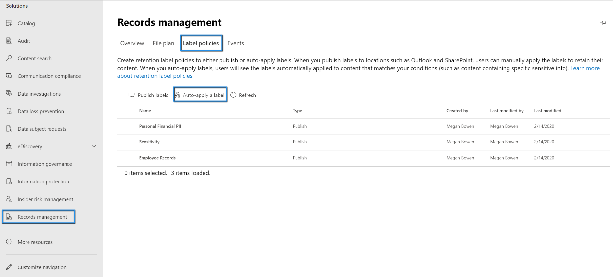
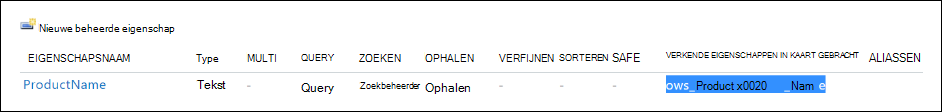

# <a name="use-retention-labels-to-manage-the-lifecycle-of-documents-stored-in-sharepoint"></a>Retentielabels gebruiken om de levenscyclus van in SharePoint opgeslagen documenten te beheren

>*[Richtlijnen voor Microsoft 365-licenties voor beveiliging en compliance](/office365/servicedescriptions/microsoft-365-service-descriptions/microsoft-365-tenantlevel-services-licensing-guidance/microsoft-365-security-compliance-licensing-guidance).*

In dit artikel wordt beschreven hoe u de levenscyclus kunt beheren van documenten die zijn opgeslagen in SharePoint door gebruik te maken van automatisch toegepaste retentielabels en op gebeurtenissen gebaseerde retentie.

De functie voor automatisch toepassen maakt gebruik van SharePoint-metagegevens voor documentclassificatie. Het voorbeeld in dit artikel is voor productgerelateerde documenten, maar dezelfde concepten kunnen voor andere scenario's worden gebruikt. In de olie- en gasindustrie kunt u deze bijvoorbeeld gebruiken voor het beheren van de levensduur van documenten over fysieke activa, zoals olieboorplatforms, bronregistraties of productielicenties. In de financiële dienstverlening kunt u documenten met bankrekeningen, hypotheken of verzekeringscontracten beheren. In de publieke sector kunt u bouwvergunningen of belastingformulieren beheren.

In dit artikel wordt de informatiearchitectuur en de definitie van de retentielabels beschreven. Vervolgens classificeren we documenten door de labels automatisch toe te passen. Ten slotte genereren we de gebeurtenissen waarmee de retentieperiode wordt gestart.

## <a name="information-architecture"></a>Informatiearchitectuur

Ons scenario is een productiebedrijf dat SharePoint gebruikt voor het opslaan van alle documenten over de producten die het bedrijf ontwikkelt. Deze documenten omvatten productspecificaties, overeenkomsten met leveranciers en gebruikershandleidingen. Wanneer deze documenten in SharePoint worden opgeslagen via een inhoudsbeheerbeleid voor ondernemingen, worden metagegevens van documenten gedefinieerd, waarmee de documenten worden geclassificeerd. Elk document bevat de volgende eigenschappen van metagegevens:

- **Documenttype** (zoals productspecificatie, overeenkomst of gebruikershandleiding)

- **Productnaam**

- **Status** (concept of definitief)

Deze metagegevens vormen een basisinhoudstype met de naam *Productiedocument* voor alle documenten.


> [!NOTE]
> De eigenschappen **Documenttype** en **Status** worden later in dit scenario door het retentiebeleid gebruikt om retentielabels te classificeren en automatisch toe te passen.

Er kunnen verschillende inhoudstypen zijn voor verschillende typen documenten, maar laten we ons richten op de productdocumentatie.

In dit scenario gebruiken we de service Beheerde metagegevens en het termenarchief om een termenset te maken voor *Documenttype* en een andere voor *Productnaam*. Voor elke termenset maken we voor elke waarde een term. Het ziet er in het termenarchief ongeveer zo uit voor uw SharePoint-organisatie:


*Inhoudstype* kan worden gemaakt en gepubliceerd met behulp van de [Hub voor inhoudstypen](https://support.office.com/article/manage-content-type-publishing-06f39ac0-5576-4b68-abbc-82b68334889b). U kunt ook een inhoudstype maken en publiceren met behulp van site-inrichtingshulpmiddelen, zoals het [PnP-inrichtingsframework](/sharepoint/dev/solution-guidance/pnp-provisioning-framework) of het [JSON-schema voor siteontwerp](/sharepoint/dev/declarative-customization/site-design-json-schema#define-a-new-content-type).

Elk product heeft een toegewezen SharePoint-site die één documentbibliotheek bevat waarvoor de juiste inhoudstypen zijn ingeschakeld. Alle documenten worden opgeslagen in deze documentbibliotheek.

[  ](../media/SPRetention3.png#lightbox)

> [!NOTE]
> In plaats van een SharePoint-site per product, kan het productiebedrijf in dit scenario een Microsoft-team per product gebruiken om de samenwerking tussen leden van het team te ondersteunen, bijvoorbeeld via een permanente chatfunctie. Het tabblad **Bestanden** in Teams kan voor documentbeheer worden gebruikt. In dit artikel richten we ons alleen op documenten, dus gebruiken we alleen een site.

Hier ziet u een weergave van de documentbibliotheek voor het product Spinning Widget:

[  ](../media/SPRetention4.png#lightbox)

Nu we de basisinformatiearchitectuur voor documentbeheer voor elkaar hebben, bekijken we de retentie- en verwijderingsstrategie voor de documenten die gebruikmaken van de metagegevens en hoe we deze documenten classificeren.

## <a name="retention-and-disposition"></a>Retentie en verwijdering

Het compliance- en gegevensbeheerbeleid van het productiebedrijf bepaalt hoe gegevens worden bewaard en verwijderd. Productgerelateerde documenten moeten worden bewaard zolang het product wordt geproduceerd en daarna gedurende een bepaalde aanvullende periode. De aanvullende periode is voor productspecificaties, overeenkomsten en gebruikershandleidingen verschillend. In de volgende tabel worden de vereisten voor retentie en verwijdering aangegeven:

|   Documenttype            |   Retentie                            |   Verwijdering                                |
| -------------------------- | -------------------------------------- | -------------------------------------------- |
| Productspecificaties      | Tot vijf jaar nadat de productie stopt  | Verwijderen                                       |
| Productovereenkomsten          | Tot tien jaar nadat de productie stopt | Beoordelen                                       |
| Gebruikershandleidingen                | Tot vijf jaar nadat de productie stopt  | Verwijderen                                       |
| Alle overige typen documenten | Niet actief bewaren  | Verwijderen als document ouder is dan drie jaar <br /><br /> Een document wordt als ouder dan drie jaar beschouwd als het in de afgelopen drie jaar niet is gewijzigd. |
|||

We gebruiken het Microsoft 365-compliancecentrum om de volgende [retentielabels](retention.md#retention-labels) te maken:

  - Productspecificatie

  - Productovereenkomst

  - Gebruikershandleiding

In dit artikel wordt alleen beschreven hoe u het retentielabel Productspecificatie kunt maken en automatisch kunt toepassen. Als u het volledige scenario wilt implementeren, moet u ook retentielabels maken en automatisch toepassen voor de andere twee documenttypen.

### <a name="settings-for-the-product-specification-retention-label"></a>Instellingen voor het retentielabel Productspecificatie

Hier ziet u het [bestandsplan](file-plan-manager.md) voor het retentielabel Productspecificatie:

- **Naam:** productspecificatie

- **Beschrijving voor gebruikers:** bewaren tot vijf jaar nadat de productie is gestopt.

- **Beschrijving voor beheerders:** bewaren tot 5 jaar nadat de productie is gestopt, automatisch verwijderen, bewaren op basis van gebeurtenissen, gebeurtenistype is *Stopzetten productie*.

- **Bewaaractie:** behouden en verwijderen.

- **Bewaarduur:** vijf jaar (1825 dagen).

- **Recordlabel**: configureer het retentielabel om items te markeren als een [-record](records-management.md#records). Dit betekent dat de gelabelde documenten niet door gebruikers kunnen worden gewijzigd of verwijderd.

- **Descriptors van bestandsplannen:** om het scenario te vereenvoudigen, worden geen optionele bestandsdescriptors verstrekt.

In de volgende schermafbeelding ziet u de instellingen wanneer u het retentielabel Productspecificatie maakt in het Microsoft 365-compliancecentrum. U kunt het gebeurtenistype *Stopzetten productie* maken wanneer u het retentielabel maakt. Zie de procedure in de volgende sectie.


> [!NOTE]
> Als u niet langer dan vijf jaar wilt wachten voordat de documenten worden verwijderd, stelt u de bewaarduur in op ***één dag*** als u dit scenario in een testomgeving opnieuw maakt.

### <a name="create-an-event-type-when-you-create-a-retention-label"></a>Een gebeurtenistype maken wanneer u een retentielabel maakt

1. Op de pagina **Instellingen voor retentie definiëren** van de wizard Retentielabel maken, selecteert u na **De retentieperiode starten op basis van** de optie **Nieuw gebeurtenistype maken**:

    

3. Voer op de pagina **Uw gebeurtenistype een naam geven** de optie **Stopzetten productie** en een optionele beschrijving in. Selecteer vervolgens **Volgende**, **Verzenden** en **Gereed**.

4. Terug op de pagina **Instellingen voor retentie definiëren** kunt u voor **De retentieperiode starten op basis van** in het vervolgkeuzemenu het gebeurtenistype **Stopzetten productie** selecteren dat u hebt gemaakt.

    Zo zien de instellingen eruit voor het retentielabel Productspecificatie:

   

6. Selecteer **Label maken**. Op de volgende pagina, wanneer u de opties voor het publiceren van het label ziet, past het label automatisch toe of slaat u het label op: selecteer **Label alleen opslaan** en selecteer vervolgens **Gereed**.

    > [!TIP]
    > Zie [Een label maken waarvan de retentieperiode is gebaseerd op een gebeurtenis](event-driven-retention.md#step-1-create-a-label-whose-retention-period-is-based-on-an-event) voor uitgebreide stappen.

Laten we nu eens kijken hoe we het retentielabel automatisch kunnen toepassen op inhoud met productspecificaties.

## <a name="auto-apply-retention-labels-to-documents"></a>Retentielabels automatisch toepassen op documenten

We gebruiken KQL (Keyword Query Language) om de gemaakte retentielabels [automatisch toe te passen](apply-retention-labels-automatically.md). KQL is de taal die wordt gebruikt om zoekquery's te maken. In KQL kunt u zoeken met behulp van trefwoorden of beheerde eigenschappen. Zie [Naslaginformatie over de syntaxis van KQL (Keyword Query Language)](/sharepoint/dev/general-development/keyword-query-language-kql-syntax-reference) voor meer informatie.

In principe willen we in Microsoft 365 dat het retentielabel **Productspecificatie** wordt toegepast op alle documenten met **status** **Definitief** en **documenttype** **Productspecificatie**. Vergeet niet dat **Status** en **Documenttype** de sitekolommen zijn die we hebben gedefinieerd voor het inhoudstype Productdocumentatie in de sectie [Informatiearchitectuur](#information-architecture). Hiervoor moeten we het zoekschema configureren.

Wanneer inhoud in SharePoint wordt geïndexeerd, worden voor elke sitekolom automatisch verkende eigenschappen gegenereerd. Voor dit scenario zijn we geïnteresseerd in de eigenschappen **Documenttype** en **Status**. Voor de bibliotheek hebben we documenten nodig die het juiste inhoudstype hebben en moeten de sitekolommen zijn ingevuld voor de zoekopdracht om de verkende eigenschappen te maken.

Open de zoekconfiguratie in het SharePoint-beheercentrum en selecteer **Zoekschema beheren** om verkende eigenschappen weer te geven en te configureren.


Als we ***status** _ typen in het vak _ *Verkende eigenschappen** en de groene pijl selecteren, zien we een soortgelijk resultaat:


De eigenschap **ows\_\_Status** (let op het dubbele onderstrepingsteken) is de eigenschap die ons interesseert. Het wordt toegekend aan de eigenschap **Status** van het inhoudstype Productiedocument.

Als we nu ***ows\_doc*** typen en de groene pijl selecteren, zien we zoiets als het volgende:


De eigenschap **ows\_Doc\_x0020\_Type** is de tweede eigenschap waarin we zijn geïnteresseerd. Deze eigenschap wordt toegekend aan de eigenschap **Documenttype** van het inhoudstype Productiedocument.

> [!TIP]
> Als u de naam wilt weten van een verkende eigenschap voor dit scenario, gaat u naar de documentbibliotheek met de productiedocumenten. Ga vervolgens naar de bibliotheekinstellingen. Voor **Kolommen** selecteert u de naam van de kolom (bijvoorbeeld **Status** of **Documenttype**) om de pagina met de sitekolom te openen. De parameter *Field* in de URL voor die pagina bevat de naam van het veld. Deze veldnaam, met voorvoegsel met 'ows_', is de naam van de verkende eigenschap. De URL `https://tenantname.sharepoint.com/sites/SpinningWidget/_layouts/15/FldEdit.aspx?List=%7BC38C2F45-3BD6-4C3B-AA3B-EF5DF6B3D172%7D&Field=_Status` bijvoorbeeld, komt overeen met de verkende eigenschap *ows\_\_Status*.

Ga als volgt te werk als de verkende eigenschappen die u zoekt, niet worden weergegeven in de sectie Zoekschema beheren in het SharePoint-beheercentrum:

- Misschien zijn de documenten niet geïndexeerd. U kunt een nieuwe indexering van de bibliotheek afdwingen via **Instellingen voor Documentbibliotheek** > **Geavanceerde instellingen**.

- Als de documentbibliotheek zich op een moderne site bevindt, moet u ervoor zorgen dat de SharePoint-beheerder ook een beheerder van de siteverzameling is.

Zie [Automatisch gemaakte beheerde eigenschappen in SharePoint Server](/sharepoint/technical-reference/automatically-created-managed-properties-in-sharepoint) voor meer informatie over verkende en beheerde eigenschappen.

### <a name="map-crawled-properties-to-pre-defined-managed-properties"></a>Verkende eigenschappen aan vooraf gedefinieerde beheerde eigenschappen toewijzen

KQL kan geen verkende eigenschappen gebruiken in zoekquery's. Het moet een beheerde eigenschap gebruiken. In een normaal zoekscenario maken we een beheerde eigenschap en wijzen deze toe aan de verkende eigenschap die we nodig hebben. Voor het automatisch toepassen van retentielabels kunt u echter alleen vooraf gedefinieerde beheerde eigenschappen opgeven in KQL, geen aangepaste beheerde eigenschappen. Er is een reeks vooraf gedefinieerde beheerde eigenschappen in het systeem voor tekenreeks *RefinableString00* tot en met *RefinableString199* die u kunt gebruiken. Zie [Ongebruikte beheerde standaardeigenschappen](/sharepoint/manage-search-schema#default-unused-managed-properties) voor een volledige lijst. Deze beheerde standaardeigenschappen worden meestal gebruikt voor het definiëren van zoekverfijningen.

De KQL-query past automatisch het juiste retentielabel toe op de inhoud van productdocumenten als de verkende eigenschappen **ows\_Doc\_x0020\_Type* en *ows\_\_Status** worden toegewezen aan twee beheerde eigenschappen die kunnen worden verfijnd. In onze testomgeving voor dit scenario worden **RefinableString00** en **RefinableString01** niet gebruikt. We hebben dit bepaald door te kijken naar **Beheerde eigenschappen** in **Zoekschema beheren** in het SharePoint-beheercentrum.

[  ](../media/SPRetention12.png#lightbox)

U ziet dat de kolom **Toegewezen verkende eigenschappen** in de vorige schermafbeelding leeg is.

Als u de verkende eigenschap **ows\_Doc\_x0020\_Type** wilt toewijzen, volgt u deze stappen:

1. In het filtervak **Beheerde eigenschap** typt u **_RefinableString00_** en selecteert u de groene pijl.

2. In de lijst met resultaten selecteert u de koppeling **RefinableString00** en schuift u omlaag naar de sectie **Toewijzingen aan verkende eigenschappen**.

3. Selecteer **Een toewijzing toevoegen** en typ in het venster **Selectie van verkende eigenschap** **_ows\_Doc\_x0020\_Type_*_ in het vak _* Een naam van een verkende eigenschap zoeken**. Selecteer **Zoeken**.

4. In de lijst met resultaten selecteert u **\_Doc\_x0020\_Type** en vervolgens **OK**.

   In de sectie **Verkende eigenschappen** ziet u ongeveer hetzelfde als in deze schermafbeelding:

   [  ](../media/SPRetention13.png#lightbox)


5. Schuif naar de onderkant van de pagina en selecteer **OK** om de toewijzing op te slaan.

Herhaal deze stappen om **RefinableString01** en **ows\_\_Status** toe te wijzen.

Als het goed is, hebt u nu twee beheerde eigenschappen die zijn toegewezen aan de twee verkende eigenschappen:

[  ](../media/SPRetention14.png#lightbox)

We controleren of de instellingen juist zijn door een Enterprise Search uit te voeren. Ga in een browser naar *https://\<your_tenant>.sharepoint.com/search*. Typ ***RefinableString00:"Product Specification"** _ in het zoekvak en druk op Enter. Met deze zoekopdracht moeten alle documenten met _ *Productspecificatie** **_Documenttype_** worden geretourneerd.

Typ nu **RefinableString00:"Product Specification" AND RefinableString01:Final** in het zoekvak en druk op Enter. Met deze zoekopdracht moeten alle documenten met **Productspecificatie** **_Documenttype_*_ en _* Status** **_Definitief_** worden geretourneerd.

### <a name="create-auto-apply-label-policies"></a>Beleid voor het automatisch toepassen van labels maken

Nu we hebben gecontroleerd of de KQL-query werkt, maken we een beleid voor het automatisch toepassen van labels, dat een KQL-query gebruikt om automatisch het retentielabel Productspecificatie op de juiste documenten toe te passen.

1. Ga in het [compliancecentrum](https://compliance.microsoft.com/homepage) naar **Recordbeheer** > **Labelbeleid** > **Een label automatisch toepassen**.

   [  ](../media/SPRetention16.png#lightbox)

2. Voer in de wizard Beleid voor automatisch labelen maken, op de pagina **Het beleid voor automatisch labelen een naam geven**, een naam in, bijvoorbeeld **Label Productspecificatie automatisch toepassen** en een optionele beschrijving. Selecteer vervolgens **Volgende**.

3. Op de pagina **Het type inhoud kiezen waarop u dit label wilt toepassen** selecteert u **Label toepassen op inhoud met specifieke woorden, woordgroepen of eigenschappen**. Selecteer vervolgens **Volgende**.

   [  ](../media/SPRetention17.png#lightbox)

   Met deze optie kunnen we dezelfde KQL-zoekquery opgeven die we in de vorige sectie hebben getest. De query retourneert alle documenten over productspecificatie met de status *Definitief*. Wanneer we dezelfde query gebruiken in het beleid voor het automatisch toepassen van labels, wordt het retentielabel Productspecificatie automatisch toegepast op alle documenten die ermee overeenkomen.

4. Op de pagina **Label toepassen op inhoud die overeenkomt met deze query** typt u **RefinableString00:"Productspecificatie" AND RefinableString01:Definitief**. Selecteer vervolgens **Volgende**.

   

5. Selecteer op de pagina **Locaties kiezen om het beleid toe te passen** de inhoudslocaties waarop u het beleid wilt toepassen. In dit scenario wordt het beleid alleen toegepast op SharePoint-locaties, omdat alle productiedocumenten worden opgeslagen in SharePoint-documentbibliotheken. Zet de status van **Exchange-e-mail**, **OneDrive-accounts** en **Microsoft 365 Groepen** op **Uit**. Zorg ervoor dat de status van SharePoint-sites is ingesteld op **Aan** voordat u **Volgende** selecteert:

    

   > [!TIP]
   > In plaats van het beleid toe te passen op alle SharePoint-sites, kunt u **Site kiezen** selecteren en de URL's voor specifieke SharePoint-sites toevoegen.

6. Selecteer op de pagina **Label kiezen om automatisch toe te passen** de optie **Label toevoegen**.

7. Selecteer in de lijst met retentielabels de optie **Productspecificatie**. Selecteer vervolgens **Toevoegen** en **Volgende**.

8. Controleer de instellingen:

    

9. Selecteer **Verzenden** om het beleid voor automatisch toepassen van labels te maken.

   > [!NOTE]
   > Het duurt maximaal zeven dagen om het label Productspecificatie automatisch toe te passen op alle documenten die overeenkomen met de KQL-zoekquery.

### <a name="verify-that-the-retention-label-was-automatically-applied"></a>Controleren of het retentielabel automatisch is toegepast

Na zeven dagen gebruikt u [Activiteitenverkenner](data-classification-activity-explorer.md) in het compliancecentrum om te controleren of met het beleid voor het automatisch toepassen van labels dat we hebben gemaakt, de retentielabels automatisch op de productdocumenten zijn toegepast.

Bekijk ook de eigenschappen van de documenten in de documentbibliotheek. In het informatiescherm ziet u dat het retentielabel is toegepast op een geselecteerd document.

[  ](../media/SPRetention21.png#lightbox)

Omdat de retentielabels automatisch op documenten zijn toegepast, zijn deze documenten beveiligd tegen verwijdering omdat het retentielabel zodanig is geconfigureerd dat de documenten als *records* worden gedeclareerd. Als voorbeeld van deze beveiliging wordt het volgende foutbericht weergegeven wanneer we een van deze documenten willen verwijderen:

[  ](../media/SPRetention22.png#lightbox)

## <a name="generate-the-event-that-triggers-the-retention-period"></a>De gebeurtenis genereren die de retentieperiode activeert

Nu de retentielabels zijn toegepast, richten we ons op de gebeurtenis die het einde van de productie voor een bepaald product aangeeft. Deze gebeurtenis activeert het begin van de retentieperiode die in de retentielabels is gedefinieerd. Bijvoorbeeld: voor documenten over productspecificatie begint de retentieperiode van vijf jaar wanneer de gebeurtenis Einde productie wordt geactiveerd.

U kunt de gebeurtenis handmatig maken in het Microsoft 365-compliancecentrum via **Recordbeheer** > **Gebeurtenissen**. U kiest in dat geval het gebeurtenistype, stelt de juiste asset-id's in en voert een datum voor de gebeurtenis in. Zie [Retentiebeleid starten wanneer een gebeurtenis plaatsvindt](event-driven-retention.md) voor meer informatie.

Maar in dit scenario wordt de gebeurtenis automatisch gegenereerd vanuit een extern productiesysteem. Het systeem is een eenvoudige SharePoint-lijst die aangeeft of een product in productie is. Een [Power Automate](/flow/getting-started)-stroom die aan de lijst is gekoppeld, activeert de gebeurtenis. In een echt scenario kunt u verschillende systemen gebruiken om de gebeurtenis te genereren, zoals een HR- of CRM-systeem. Power Automate bevat veel kant-en-klare interacties en bouwstenen voor Microsoft 365-werkbelastingen, zoals Microsoft Exchange, SharePoint, Teams en Dynamics 365, plus apps van derden, zoals Twitter, Box, Salesforce en Workdays. Met deze functie kunt u Power Automate eenvoudig met verschillende systemen integreren. Zie [Retentie op basis van gebeurtenissen automatiseren](./event-driven-retention.md#automate-events-by-using-a-rest-api) voor meer informatie.

In de volgende schermafbeelding ziet u de SharePoint-lijst die wordt gebruikt om de gebeurtenis te activeren:

[  ](../media/SPRetention23.png#lightbox)

Er zijn momenteel twee producten in productie, zoals aangegeven met ***Ja** _ in de kolom _ *In productie**. Wanneer de waarde in deze kolom voor een product op **_Nee_** wordt ingesteld, wordt de gebeurtenis automatisch gegenereerd door de stroom die aan de lijst is gekoppeld. De gebeurtenis activeert het begin van de retentieperiode voor het retentielabel dat automatisch is toegepast op de bijbehorende productdocumenten.

Voor dit scenario gebruiken we de volgende stroom om de gebeurtenis te activeren:

[  ](../media/SPRetention24.png#lightbox)

Als u deze stroom wilt maken, begint u met een SharePoint-connector en selecteert u de trigger **Wanneer een item wordt gemaakt of gewijzigd**. Geef het siteadres en de naam van de lijst op. Voeg vervolgens een voorwaarde toe op basis van wanneer de kolomwaarde van de lijst **In productie** is ingesteld op **_Nee_* _ (of gelijk aan _onwaar* op de voorwaardekaart). Voeg vervolgens een actie toe op basis van de ingebouwde HTTP-sjabloon. Gebruik de waarden in de volgende sectie om de HTTP-actie te configureren. U kunt de waarden voor de eigenschappen **URI** en **Hoofdtekst** uit de volgende sectie kopiëren en in de sjabloon plakken.

- **Method**: POST
- **URI**: `https://ps.compliance.protection.outlook.com/psws/service.svc/ComplianceRetentionEvent`
- **Headers**: Key = Content-Type, Value = application/atom+xml
- **Body**:

    ```xml
    <?xml version='1.0' encoding='utf-8' standalone='yes'>
    <entry xmlns:d='http://schemas.microsoft.com/ado/2007/08/dataservices' xmlns:m='http://schemas.microsoft.com/ado/2007/08/dataservices/metadata' xmlns='https://www.w3.org/2005/Atom'>
    <category scheme='http://schemas.microsoft.com/ado/2007/08/dataservices/scheme' term='Exchange.ComplianceRetentionEvent'>
    <updated>9/9/2017 10:50:00 PM</updated>
    <content type='application/xml'>
    <m:properties>
    <d:Name>Cessation Production @{triggerBody()?['Product_x0020_Name']?['Value']}</d:Name>
    <d:EventType>Product Cessation&lt;</d:EventType>
    <d:SharePointAssetIdQuery>ProductName:&quot;@{triggerBody()?['Product_x0020_Name']?['Value']}<d:SharePointAssetIdQuery>
    <d:EventDateTime>@{formatDateTime(utcNow(),'yyyy-MM-dd')}</d:EventDateTime>
    </m:properties>
    </content&gt>
    </entry>
    ```

In deze lijst worden de parameters beschreven in de eigenschap **Body** van de actie die voor dit scenario moet worden geconfigureerd:

- **Name**: deze parameter geeft de naam op van de gebeurtenis die in het Microsoft 365-compliancecentrum wordt gemaakt. In dit scenario is de naam 'Stopzetten van productie *xxx*', waarbij *xxx* de waarde is van de beheerde eigenschap **ProductName**, die we eerder hebben gemaakt.
- **EventType**: de waarde voor deze parameter komt overeen met het gebeurtenistype waarop de gemaakte gebeurtenis van toepassing is. Dit gebeurtenistype is gedefinieerd toen u het retentielabel maakte. In dit scenario is Stopzetten van productie het gebeurtenistype.
- **SharePointAssetIdQuery**: deze parameter definieert de asset-id voor de gebeurtenis. Voor retentie op basis van gebeurtenissen is een unieke id voor het document vereist. We kunnen asset-id's gebruiken om de documenten te identificeren waarop een bepaalde gebeurtenis van toepassing is of, zoals in dit scenario, de kolom met metagegevens **Productnaam**. Hiervoor moet een nieuwe beheerde eigenschap **ProductName** worden gemaakt die in de KQL-query kan worden gebruikt. (U kunt ook **RefinableString00** gebruiken in plaats dat u een nieuwe beheerde eigenschap maakt.) Deze nieuwe beheerde eigenschap moet ook worden toegewezen aan de verkende eigenschap **ows_Product_x0020_Name**. Hier ziet u een schermafbeelding van deze beheerde eigenschap.

    [  ](../media/SPRetention25.png#lightbox)

- **EventDateTime**: deze parameter definieert de datum waarop de gebeurtenis plaatsvindt. Gebruik de huidige datumnotatie:<br/><br/>*formatDateTime(utcNow(),'yyyy-MM-dd'*)

### <a name="putting-it-all-together"></a>Alles in elkaar zetten

Nu wordt het retentielabel gemaakt en automatisch toegepast, en wordt de stroom geconfigureerd en gemaakt. Wanneer de waarde in de kolom **In productie**, voor het product Spinning Widget in de lijst Producten, wordt gewijzigd van **_Ja_*_ in _*_Nee_*_, wordt de stroom geactiveerd om de gebeurtenis te maken. Als u deze gebeurtenis in het compliancecentrum wilt bekijken, gaat u naar _* Recordbeheer** > **Gebeurtenissen**.

[  ](../media/SPRetention28.png#lightbox)

Selecteer de gebeurtenis om de details op de flyout-pagina te bekijken. Hoewel de gebeurtenis is gemaakt, laat de gebeurtenisstatus zien dat er geen SharePoint-sites of -documenten zijn verwerkt.


Maar na enige vertraging toont de gebeurtenisstatus dat een SharePoint-site en een SharePoint-document zijn verwerkt.


Dit toont aan dat de retentieperiode voor het label dat op het productdocument Spinning Widget wordt toegepast, op basis van de gebeurtenisdatum van de gebeurtenis *Stopzetten van productie Spinning Widget* is gestart. Als u ervan uit gaat dat u het scenario in uw testomgeving hebt geïmplementeerd door een retentieperiode van één dag te configureren, gaat u enkele dagen nadat de gebeurtenis is gemaakt naar de documentbibliotheek voor uw productdocumenten en controleert u of het document is verwijderd (nadat de verwijderingstaak in SharePoint is uitgevoerd).

### <a name="more-about-asset-ids"></a>Meer informatie over asset-id's

Zoals wordt uitgelegd in het artikel [Retentie starten wanneer een gebeurtenis plaatsvindt](event-driven-retention.md), is het belangrijk dat u de relatie tussen gebeurtenistypen, retentielabels, gebeurtenissen en asset-id's begrijpt. De asset-id is gewoon een documenteigenschap in SharePoint en OneDrive. Hiermee kunt u de documenten identificeren waarvan de retentieperiode door de gebeurtenis wordt geactiveerd. Standaard beschikt SharePoint over een eigenschap **Asset-id** die u kunt gebruiken voor retentie op basis van gebeurtenissen:


Zoals u in de volgende schermafbeelding kunt zien, wordt de beheerde eigenschap Asset-id **ComplianceAssetId-** genoemd.

[  ](../media/SPRetention27.png#lightbox)

In plaats van de standaardeigenschap **Asset-id** te gebruiken, zoals in dit scenario, kunt u een willekeurige eigenschap gebruiken. Maar het is belangrijk om te weten dat de retentieperiode voor alle inhoud met een label van dat gebeurtenistype door de gebeurtenis wordt geactiveerd als u geen asset-id of trefwoorden opgeeft voor een gebeurtenis.

### <a name="using-advanced-search-in-sharepoint"></a>Geavanceerd zoeken gebruiken in SharePoint

In de vorige schermafbeelding ziet u dat er een andere beheerde eigenschap is gerelateerd aan retentielabels met de naam **Compliancetag**, die is toegewezen aan een verkende eigenschap. De beheerde eigenschap **ComplianceAssetId** is ook toegewezen aan een verkende eigenschap. Dit betekent dat u deze beheerde eigenschappen in geavanceerd zoeken kunt gebruiken om alle documenten op te halen die met een retentielabel zijn gelabeld.