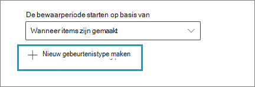
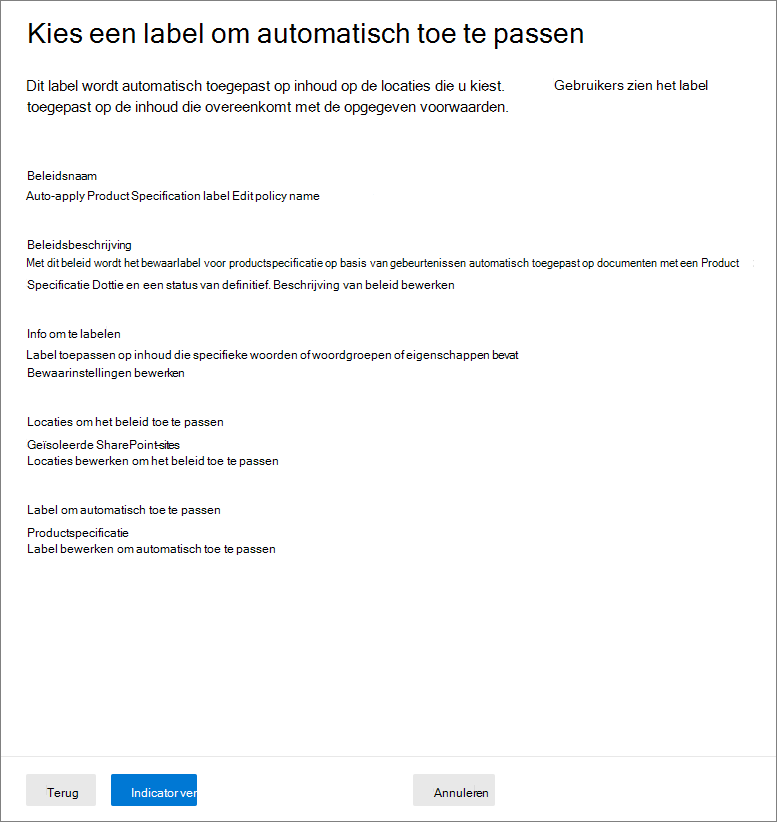

# <a name="use-retention-labels-to-manage-the-lifecycle-of-documents-stored-in-sharepoint"></a><span data-ttu-id="b0504-103">Retentielabels gebruiken om de levenscyclus van in SharePoint opgeslagen documenten te beheren</span><span class="sxs-lookup"><span data-stu-id="b0504-103">Use retention labels to manage the lifecycle of documents stored in SharePoint</span></span>

><span data-ttu-id="b0504-104">*[Richtlijnen voor Microsoft 365-licenties voor beveiliging en compliance](/office365/servicedescriptions/microsoft-365-service-descriptions/microsoft-365-tenantlevel-services-licensing-guidance/microsoft-365-security-compliance-licensing-guidance).*</span><span class="sxs-lookup"><span data-stu-id="b0504-104">*[Microsoft 365 licensing guidance for security & compliance](/office365/servicedescriptions/microsoft-365-service-descriptions/microsoft-365-tenantlevel-services-licensing-guidance/microsoft-365-security-compliance-licensing-guidance).*</span></span>

<span data-ttu-id="b0504-105">In dit artikel wordt beschreven hoe u de levenscyclus kunt beheren van documenten die zijn opgeslagen in SharePoint door gebruik te maken van automatisch toegepaste retentielabels en op gebeurtenissen gebaseerde retentie.</span><span class="sxs-lookup"><span data-stu-id="b0504-105">This article describes how you can manage the lifecycle of documents that are stored in SharePoint by using automatically applied retention labels and event-based retention.</span></span>

<span data-ttu-id="b0504-106">De functie voor automatisch toepassen maakt gebruik van SharePoint-metagegevens voor documentclassificatie.</span><span class="sxs-lookup"><span data-stu-id="b0504-106">The auto-apply functionality uses SharePoint metadata for document classification.</span></span> <span data-ttu-id="b0504-107">Het voorbeeld in dit artikel is voor productgerelateerde documenten, maar dezelfde concepten kunnen voor andere scenario's worden gebruikt.</span><span class="sxs-lookup"><span data-stu-id="b0504-107">The example in this article is for product-related documents, but the same concepts can be used for other scenarios.</span></span> <span data-ttu-id="b0504-108">In de olie- en gasindustrie kunt u deze bijvoorbeeld gebruiken voor het beheren van de levensduur van documenten over fysieke activa, zoals olieboorplatforms, bronregistraties of productielicenties.</span><span class="sxs-lookup"><span data-stu-id="b0504-108">For example, in the oil and gas industry, you could use it to manage the lifecycle of documents about physical assets such as oil platforms, well logs, or production licenses.</span></span> <span data-ttu-id="b0504-109">In de financiële dienstverlening kunt u documenten met bankrekeningen, hypotheken of verzekeringscontracten beheren.</span><span class="sxs-lookup"><span data-stu-id="b0504-109">In the financial services industry, you could manage bank account, mortgage, or insurance contract documents.</span></span> <span data-ttu-id="b0504-110">In de publieke sector kunt u bouwvergunningen of belastingformulieren beheren.</span><span class="sxs-lookup"><span data-stu-id="b0504-110">In the public sector, you could manage construction permits or tax forms.</span></span>

<span data-ttu-id="b0504-111">In dit artikel wordt de informatiearchitectuur en de definitie van de retentielabels beschreven.</span><span class="sxs-lookup"><span data-stu-id="b0504-111">In this article, we'll look at the information architecture and definition of the retention labels.</span></span> <span data-ttu-id="b0504-112">Vervolgens classificeren we documenten door de labels automatisch toe te passen.</span><span class="sxs-lookup"><span data-stu-id="b0504-112">Then we'll classify documents by auto-applying the labels.</span></span> <span data-ttu-id="b0504-113">Ten slotte genereren we de gebeurtenissen waarmee de retentieperiode wordt gestart.</span><span class="sxs-lookup"><span data-stu-id="b0504-113">And finally we'll generate the events that initiate the retention period.</span></span>

## <a name="information-architecture"></a><span data-ttu-id="b0504-114">Informatiearchitectuur</span><span class="sxs-lookup"><span data-stu-id="b0504-114">Information architecture</span></span>

<span data-ttu-id="b0504-115">Ons scenario is een productiebedrijf dat SharePoint gebruikt voor het opslaan van alle documenten over de producten die het bedrijf ontwikkelt.</span><span class="sxs-lookup"><span data-stu-id="b0504-115">Our scenario is a manufacturing company that uses SharePoint to store all the documents about the products that the company develops.</span></span> <span data-ttu-id="b0504-116">Deze documenten omvatten productspecificaties, overeenkomsten met leveranciers en gebruikershandleidingen.</span><span class="sxs-lookup"><span data-stu-id="b0504-116">These documents include product specifications, agreements with suppliers, and user manuals.</span></span> <span data-ttu-id="b0504-117">Wanneer deze documenten in SharePoint worden opgeslagen via een inhoudsbeheerbeleid voor ondernemingen, worden metagegevens van documenten gedefinieerd, waarmee de documenten worden geclassificeerd.</span><span class="sxs-lookup"><span data-stu-id="b0504-117">When these documents are stored in SharePoint through Enterprise Content Management policies, document metadata is defined, which is used to classify them.</span></span> <span data-ttu-id="b0504-118">Elk document bevat de volgende eigenschappen van metagegevens:</span><span class="sxs-lookup"><span data-stu-id="b0504-118">Each document has the following metadata properties:</span></span>

- <span data-ttu-id="b0504-119">**Documenttype** (zoals productspecificatie, overeenkomst of gebruikershandleiding)</span><span class="sxs-lookup"><span data-stu-id="b0504-119">**Doc Type** (such as product specification, agreement, or user manual)</span></span>

- <span data-ttu-id="b0504-120">**Productnaam**</span><span class="sxs-lookup"><span data-stu-id="b0504-120">**Product Name**</span></span>

- <span data-ttu-id="b0504-121">**Status** (concept of definitief)</span><span class="sxs-lookup"><span data-stu-id="b0504-121">**Status** (draft or final)</span></span>

<span data-ttu-id="b0504-122">Deze metagegevens vormen een basisinhoudstype met de naam *Productiedocument* voor alle documenten.</span><span class="sxs-lookup"><span data-stu-id="b0504-122">This metadata forms a base content type called *Production Document* for all the documents.</span></span>


> [!NOTE]
> <span data-ttu-id="b0504-124">De eigenschappen **Documenttype** en **Status** worden later in dit scenario door het retentiebeleid gebruikt om retentielabels te classificeren en automatisch toe te passen.</span><span class="sxs-lookup"><span data-stu-id="b0504-124">The **Doc Type** and **Status** properties are used by retention policies later in this scenario to classify and auto-apply retention labels.</span></span>

<span data-ttu-id="b0504-125">Er kunnen verschillende inhoudstypen zijn voor verschillende typen documenten, maar laten we ons richten op de productdocumentatie.</span><span class="sxs-lookup"><span data-stu-id="b0504-125">We might have several content types that represent different types of documents, but let's focus on the product documentation.</span></span>

<span data-ttu-id="b0504-126">In dit scenario gebruiken we de service Beheerde metagegevens en het termenarchief om een termenset te maken voor *Documenttype* en een andere voor *Productnaam*.</span><span class="sxs-lookup"><span data-stu-id="b0504-126">In this scenario, we use the Managed Metadata service and the Term Store to create a term set for *Doc Type* and another one for *Product Name*.</span></span> <span data-ttu-id="b0504-127">Voor elke termenset maken we voor elke waarde een term.</span><span class="sxs-lookup"><span data-stu-id="b0504-127">For each term set, we create a term for each value.</span></span> <span data-ttu-id="b0504-128">Het ziet er in het termenarchief ongeveer zo uit voor uw SharePoint-organisatie:</span><span class="sxs-lookup"><span data-stu-id="b0504-128">It would look like something like this in Term Store for your SharePoint organization:</span></span>


<span data-ttu-id="b0504-130">*Inhoudstype* kan worden gemaakt en gepubliceerd met behulp van de [Hub voor inhoudstypen](https://support.office.com/article/manage-content-type-publishing-06f39ac0-5576-4b68-abbc-82b68334889b).</span><span class="sxs-lookup"><span data-stu-id="b0504-130">*Content Type* can be created and published by using the [Content Type Hub](https://support.office.com/article/manage-content-type-publishing-06f39ac0-5576-4b68-abbc-82b68334889b).</span></span> <span data-ttu-id="b0504-131">U kunt ook een inhoudstype maken en publiceren met behulp van site-inrichtingshulpmiddelen, zoals het [PnP-inrichtingsframework](/sharepoint/dev/solution-guidance/pnp-provisioning-framework) of het [JSON-schema voor siteontwerp](/sharepoint/dev/declarative-customization/site-design-json-schema#define-a-new-content-type).</span><span class="sxs-lookup"><span data-stu-id="b0504-131">You can also create and publish a content type by using site provisioning tools, such as the [PnP provisioning framework](/sharepoint/dev/solution-guidance/pnp-provisioning-framework) or [site design JSON schema](/sharepoint/dev/declarative-customization/site-design-json-schema#define-a-new-content-type).</span></span>

<span data-ttu-id="b0504-132">Elk product heeft een speciale SharePoint-site met één documentbibliotheek waarin de juiste inhoudstypen zijn ingeschakeld.</span><span class="sxs-lookup"><span data-stu-id="b0504-132">Each product has a dedicated SharePoint site that contains one document library that has the right content types enabled.</span></span> <span data-ttu-id="b0504-133">Alle documenten worden opgeslagen in deze documentbibliotheek.</span><span class="sxs-lookup"><span data-stu-id="b0504-133">All documents are stored in this document library.</span></span>

<span data-ttu-id="b0504-134">[  ](../media/SPRetention3.png#lightbox)</span><span class="sxs-lookup"><span data-stu-id="b0504-134">[  ](../media/SPRetention3.png#lightbox)</span></span>

> [!NOTE]
> <span data-ttu-id="b0504-135">In plaats van een SharePoint-site per product, kan het productiebedrijf in dit scenario een Microsoft-team per product gebruiken om de samenwerking tussen leden van het team te ondersteunen, bijvoorbeeld via een permanente chatfunctie. Het tabblad **Bestanden** in Teams kan voor documentbeheer worden gebruikt.</span><span class="sxs-lookup"><span data-stu-id="b0504-135">Instead of having a SharePoint site per product, the manufacturing company in this scenario could use a Microsoft Team per product to support collaboration among members of the team, such as through persistent chat, and use the **Files** tab in Teams for document management.</span></span> <span data-ttu-id="b0504-136">In dit artikel richten we ons alleen op documenten, dus gebruiken we alleen een site.</span><span class="sxs-lookup"><span data-stu-id="b0504-136">In this article we only focus on documents, so, we'll only use a site.</span></span>

<span data-ttu-id="b0504-137">Hier ziet u een weergave van de documentbibliotheek voor het product Spinning Widget:</span><span class="sxs-lookup"><span data-stu-id="b0504-137">Here's a view of the document library for the Spinning Widget product:</span></span>

<span data-ttu-id="b0504-138">[  ](../media/SPRetention4.png#lightbox)</span><span class="sxs-lookup"><span data-stu-id="b0504-138">[  ](../media/SPRetention4.png#lightbox)</span></span>

<span data-ttu-id="b0504-139">Nu we de basisinformatiearchitectuur voor documentbeheer voor elkaar hebben, bekijken we de retentie- en verwijderingsstrategie voor de documenten die gebruikmaken van de metagegevens en hoe we deze documenten classificeren.</span><span class="sxs-lookup"><span data-stu-id="b0504-139">Now that we have the basic information architecture in place for document management, let's look at the retention and disposal strategy for the documents that use the metadata and how we classify those documents.</span></span>

## <a name="retention-and-disposition"></a><span data-ttu-id="b0504-140">Retentie en verwijdering</span><span class="sxs-lookup"><span data-stu-id="b0504-140">Retention and disposition</span></span>

<span data-ttu-id="b0504-141">Het compliance- en gegevensbeheerbeleid van het productiebedrijf bepaalt hoe gegevens worden bewaard en verwijderd.</span><span class="sxs-lookup"><span data-stu-id="b0504-141">The manufacturing company's compliance and data governance policies dictate how data is preserved and disposed of.</span></span> <span data-ttu-id="b0504-142">Productgerelateerde documenten moeten worden bewaard zolang het product wordt geproduceerd en daarna gedurende een bepaalde aanvullende periode.</span><span class="sxs-lookup"><span data-stu-id="b0504-142">Product-related documents must be kept for as long as the product is manufactured and for a certain additional period.</span></span> <span data-ttu-id="b0504-143">De aanvullende periode is voor productspecificaties, overeenkomsten en gebruikershandleidingen verschillend.</span><span class="sxs-lookup"><span data-stu-id="b0504-143">The additional period differs for product specifications, agreements, and user manuals.</span></span> <span data-ttu-id="b0504-144">In de volgende tabel worden de vereisten voor retentie en verwijdering aangegeven:</span><span class="sxs-lookup"><span data-stu-id="b0504-144">The following table indicates the retention and disposition requirements:</span></span>

|   <span data-ttu-id="b0504-145">Documenttype</span><span class="sxs-lookup"><span data-stu-id="b0504-145">Document type</span></span>            |   <span data-ttu-id="b0504-146">Retentie</span><span class="sxs-lookup"><span data-stu-id="b0504-146">Retention</span></span>                            |   <span data-ttu-id="b0504-147">Verwijdering</span><span class="sxs-lookup"><span data-stu-id="b0504-147">Disposition</span></span>                                |
| -------------------------- | -------------------------------------- | -------------------------------------------- |
| <span data-ttu-id="b0504-148">Productspecificaties</span><span class="sxs-lookup"><span data-stu-id="b0504-148">Product specifications</span></span>      | <span data-ttu-id="b0504-149">Tot vijf jaar nadat de productie stopt</span><span class="sxs-lookup"><span data-stu-id="b0504-149">5 years after production stops</span></span>  | <span data-ttu-id="b0504-150">Verwijderen</span><span class="sxs-lookup"><span data-stu-id="b0504-150">Delete</span></span>                                       |
| <span data-ttu-id="b0504-151">Productovereenkomsten</span><span class="sxs-lookup"><span data-stu-id="b0504-151">Product agreements</span></span>          | <span data-ttu-id="b0504-152">Tot tien jaar nadat de productie stopt</span><span class="sxs-lookup"><span data-stu-id="b0504-152">10 years after production stops</span></span> | <span data-ttu-id="b0504-153">Beoordelen</span><span class="sxs-lookup"><span data-stu-id="b0504-153">Review</span></span>                                       |
| <span data-ttu-id="b0504-154">Gebruikershandleidingen</span><span class="sxs-lookup"><span data-stu-id="b0504-154">User manuals</span></span>                | <span data-ttu-id="b0504-155">Tot vijf jaar nadat de productie stopt</span><span class="sxs-lookup"><span data-stu-id="b0504-155">5 years after production stops</span></span>  | <span data-ttu-id="b0504-156">Verwijderen</span><span class="sxs-lookup"><span data-stu-id="b0504-156">Delete</span></span>                                       |
| <span data-ttu-id="b0504-157">Alle overige typen documenten</span><span class="sxs-lookup"><span data-stu-id="b0504-157">All other types of documents</span></span> | <span data-ttu-id="b0504-158">Niet actief bewaren</span><span class="sxs-lookup"><span data-stu-id="b0504-158">Don't actively retain</span></span>  | <span data-ttu-id="b0504-159">Verwijderen als document ouder is dan drie jaar</span><span class="sxs-lookup"><span data-stu-id="b0504-159">Delete when document is older than 3 years</span></span> <br /><br /> <span data-ttu-id="b0504-160">Een document wordt als ouder dan drie jaar beschouwd als het in de afgelopen drie jaar niet is gewijzigd.</span><span class="sxs-lookup"><span data-stu-id="b0504-160">A document is considered older than 3 years if it hasn't been modified within the last 3 years.</span></span> |
|||

<span data-ttu-id="b0504-161">We gebruiken het Microsoft 365-compliancecentrum om de volgende [retentielabels](retention.md#retention-labels) te maken:</span><span class="sxs-lookup"><span data-stu-id="b0504-161">We use the Microsoft 365 compliance center to create the following [retention labels](retention.md#retention-labels):</span></span>

  - <span data-ttu-id="b0504-162">Productspecificatie</span><span class="sxs-lookup"><span data-stu-id="b0504-162">Product Specification</span></span>

  - <span data-ttu-id="b0504-163">Productovereenkomst</span><span class="sxs-lookup"><span data-stu-id="b0504-163">Product Agreement</span></span>

  - <span data-ttu-id="b0504-164">Gebruikershandleiding</span><span class="sxs-lookup"><span data-stu-id="b0504-164">User Manual</span></span>

<span data-ttu-id="b0504-165">In dit artikel wordt alleen beschreven hoe u het retentielabel Productspecificatie kunt maken en automatisch kunt toepassen.</span><span class="sxs-lookup"><span data-stu-id="b0504-165">In this article, we only show how to create and auto-apply the Product Specification retention label.</span></span> <span data-ttu-id="b0504-166">Als u het volledige scenario wilt implementeren, moet u ook retentielabels maken en automatisch toepassen voor de andere twee documenttypen.</span><span class="sxs-lookup"><span data-stu-id="b0504-166">To implement the complete scenario, you would also create and auto-apply retention labels for the other two document types.</span></span>

### <a name="settings-for-the-product-specification-retention-label"></a><span data-ttu-id="b0504-167">Instellingen voor het retentielabel Productspecificatie</span><span class="sxs-lookup"><span data-stu-id="b0504-167">Settings for the Product Specification retention label</span></span>

<span data-ttu-id="b0504-168">Hier ziet u het [bestandsplan](file-plan-manager.md) voor het retentielabel Productspecificatie:</span><span class="sxs-lookup"><span data-stu-id="b0504-168">Here's the [file plan](file-plan-manager.md) for the Product Specification retention label:</span></span>

- <span data-ttu-id="b0504-169">**Naam:** productspecificatie</span><span class="sxs-lookup"><span data-stu-id="b0504-169">**Name:** Product Specification</span></span>

- <span data-ttu-id="b0504-170">**Beschrijving voor gebruikers:** bewaren tot vijf jaar nadat de productie is gestopt.</span><span class="sxs-lookup"><span data-stu-id="b0504-170">**Description for users:** Retain for 5 years after production stops.</span></span>

- <span data-ttu-id="b0504-171">**Beschrijving voor beheerders:** bewaren tot 5 jaar nadat de productie is gestopt, automatisch verwijderen, bewaren op basis van gebeurtenissen, gebeurtenistype is *Stopzetten productie*.</span><span class="sxs-lookup"><span data-stu-id="b0504-171">**Description for admins:** Retain for 5 years after production stops, auto delete, event-based retention, event type is *Product Cessation*.</span></span>

- <span data-ttu-id="b0504-172">**Bewaaractie:** behouden en verwijderen.</span><span class="sxs-lookup"><span data-stu-id="b0504-172">**Retention action:** Retain and delete.</span></span>

- <span data-ttu-id="b0504-173">**Bewaarduur:** vijf jaar (1825 dagen).</span><span class="sxs-lookup"><span data-stu-id="b0504-173">**Retention duration:** 5 years (1,825 days).</span></span>

- <span data-ttu-id="b0504-174">**Recordlabel**: configureer het retentielabel om items te markeren als een [-record](records-management.md#records). Dit betekent dat de gelabelde documenten niet door gebruikers kunnen worden gewijzigd of verwijderd.</span><span class="sxs-lookup"><span data-stu-id="b0504-174">**Record label**: Configure the retention label to mark items as a [record](records-management.md#records), which means the labeled documents can't then be modified or deleted by users.</span></span>

- <span data-ttu-id="b0504-175">**Descriptors van bestandsplannen:** om het scenario te vereenvoudigen, worden geen optionele bestandsdescriptors verstrekt.</span><span class="sxs-lookup"><span data-stu-id="b0504-175">**File plan descriptors:** For simplifying the scenario, no optional file descriptors are provided.</span></span>

<span data-ttu-id="b0504-176">In de volgende schermafbeelding ziet u de instellingen wanneer u het retentielabel Productspecificatie maakt in het Microsoft 365-compliancecentrum.</span><span class="sxs-lookup"><span data-stu-id="b0504-176">The following screenshot shows the settings when you create the Product Specification retention label in the Microsoft 365 compliance center.</span></span> <span data-ttu-id="b0504-177">U kunt het gebeurtenistype *Stopzetten productie* maken wanneer u het retentielabel maakt.</span><span class="sxs-lookup"><span data-stu-id="b0504-177">You can create the *Product Cessation* event type when you create the retention label.</span></span> <span data-ttu-id="b0504-178">Zie de procedure in de volgende sectie.</span><span class="sxs-lookup"><span data-stu-id="b0504-178">See the procedure in the following section.</span></span>


> [!NOTE]
> <span data-ttu-id="b0504-180">Als u niet langer dan vijf jaar wilt wachten voordat de documenten worden verwijderd, stelt u de bewaarduur in op ***één dag*** als u dit scenario in een testomgeving opnieuw maakt.</span><span class="sxs-lookup"><span data-stu-id="b0504-180">To avoid a 5-year wait for document deletion, set the retention duration to ***1 day*** if you're recreating this scenario in a test environment.</span></span>

### <a name="create-an-event-type-when-you-create-a-retention-label"></a><span data-ttu-id="b0504-181">Een gebeurtenistype maken wanneer u een retentielabel maakt</span><span class="sxs-lookup"><span data-stu-id="b0504-181">Create an event type when you create a retention label</span></span>

1. <span data-ttu-id="b0504-182">Op de pagina **Instellingen voor retentie definiëren** van de wizard Retentielabel maken, selecteert u na **De retentieperiode starten op basis van** de optie **Nieuw gebeurtenistype maken**:</span><span class="sxs-lookup"><span data-stu-id="b0504-182">On the **Define retention settings** page of the Create retention label wizard, after **Start the retention period based on**, select **Create new event type**:</span></span>
    
    

3. <span data-ttu-id="b0504-184">Voer op de pagina **Uw gebeurtenistype een naam geven** de optie **Stopzetten productie** en een optionele beschrijving in.</span><span class="sxs-lookup"><span data-stu-id="b0504-184">On the **Name your event type** page, enter **Product Cessation** and an optional description.</span></span> <span data-ttu-id="b0504-185">Selecteer vervolgens **Volgende**, **Verzenden** en **Gereed**.</span><span class="sxs-lookup"><span data-stu-id="b0504-185">Then select **Next**, **Submit**, and **Done**.</span></span>

4. <span data-ttu-id="b0504-186">Terug op de pagina **Instellingen voor retentie definiëren** kunt u voor **De retentieperiode starten op basis van** in het vervolgkeuzemenu het gebeurtenistype **Stopzetten productie** selecteren dat u hebt gemaakt.</span><span class="sxs-lookup"><span data-stu-id="b0504-186">Back on the **Define retention settings** page, for **Start the retention period based on**, use the dropdown box to select the **Product Cessation** event type that you created.</span></span>
    
    <span data-ttu-id="b0504-187">Zo zien de instellingen eruit voor het retentielabel Productspecificatie:</span><span class="sxs-lookup"><span data-stu-id="b0504-187">Here's what the settings look like for the Product Specification retention label:</span></span> 
    
   

6. <span data-ttu-id="b0504-189">Selecteer **Label maken**. Op de volgende pagina, wanneer u de opties voor het publiceren van het label ziet, past het label automatisch toe of slaat u het label op: selecteer **Label alleen opslaan** en selecteer vervolgens **Gereed**.</span><span class="sxs-lookup"><span data-stu-id="b0504-189">Select **Create label**, and on the next page when you see the options to publish the label, auto-apply the label, or just save the label: Select **Just save the label for now**, and then select **Done**.</span></span> 
    
    > [!TIP]
    > <span data-ttu-id="b0504-190">Zie [Een label maken waarvan de retentieperiode is gebaseerd op een gebeurtenis](event-driven-retention.md#step-1-create-a-label-whose-retention-period-is-based-on-an-event) voor uitgebreide stappen.</span><span class="sxs-lookup"><span data-stu-id="b0504-190">For more detailed steps, see [Create a label whose retention period is based on an event](event-driven-retention.md#step-1-create-a-label-whose-retention-period-is-based-on-an-event).</span></span>

<span data-ttu-id="b0504-191">Laten we nu eens kijken hoe we het retentielabel automatisch kunnen toepassen op inhoud met productspecificaties.</span><span class="sxs-lookup"><span data-stu-id="b0504-191">Now let's look at how we'll auto-apply the retention label to product-specification content.</span></span>

## <a name="auto-apply-retention-labels-to-documents"></a><span data-ttu-id="b0504-192">Retentielabels automatisch toepassen op documenten</span><span class="sxs-lookup"><span data-stu-id="b0504-192">Auto-apply retention labels to documents</span></span>

<span data-ttu-id="b0504-193">We gebruiken KQL (Keyword Query Language) om de gemaakte retentielabels [automatisch toe te passen](apply-retention-labels-automatically.md).</span><span class="sxs-lookup"><span data-stu-id="b0504-193">We're going to use Keyword Query Language (KQL) to [auto-apply](apply-retention-labels-automatically.md) the retention labels that we created.</span></span> <span data-ttu-id="b0504-194">KQL is de taal die wordt gebruikt om zoekquery's te maken.</span><span class="sxs-lookup"><span data-stu-id="b0504-194">KQL is the language that's used to build search queries.</span></span> <span data-ttu-id="b0504-195">In KQL kunt u zoeken met behulp van trefwoorden of beheerde eigenschappen.</span><span class="sxs-lookup"><span data-stu-id="b0504-195">In KQL, you can search by using keywords or managed properties.</span></span> <span data-ttu-id="b0504-196">Zie [Naslaginformatie over de syntaxis van KQL (Keyword Query Language)](/sharepoint/dev/general-development/keyword-query-language-kql-syntax-reference) voor meer informatie.</span><span class="sxs-lookup"><span data-stu-id="b0504-196">For more information, see [Keyword Query Language (KQL) syntax reference](/sharepoint/dev/general-development/keyword-query-language-kql-syntax-reference).</span></span>

<span data-ttu-id="b0504-197">In principe willen we in Microsoft 365 dat het retentielabel **Productspecificatie** wordt toegepast op alle documenten met **status** **Definitief** en **documenttype** **Productspecificatie**.</span><span class="sxs-lookup"><span data-stu-id="b0504-197">Basically, we want to tell Microsoft 365 to "apply the **Product Specification** retention label to all documents that have a **Status** of **Final** and a **Doc Type** of **Product Specification**."</span></span> <span data-ttu-id="b0504-198">Vergeet niet dat **Status** en **Documenttype** de sitekolommen zijn die we hebben gedefinieerd voor het inhoudstype Productdocumentatie in de sectie [Informatiearchitectuur](#information-architecture).</span><span class="sxs-lookup"><span data-stu-id="b0504-198">Recall that **Status** and **Doc Type** are the site columns that we defined for the Product Documentation content type in the [Information architecture](#information-architecture) section.</span></span> <span data-ttu-id="b0504-199">Hiervoor moeten we het zoekschema configureren.</span><span class="sxs-lookup"><span data-stu-id="b0504-199">To do this, we need to configure the search schema.</span></span>

<span data-ttu-id="b0504-200">Wanneer inhoud in SharePoint wordt geïndexeerd, worden voor elke sitekolom automatisch verkende eigenschappen gegenereerd.</span><span class="sxs-lookup"><span data-stu-id="b0504-200">When SharePoint indexes content, it automatically generates crawled properties for each site column.</span></span> <span data-ttu-id="b0504-201">Voor dit scenario zijn we geïnteresseerd in de eigenschappen **Documenttype** en **Status**.</span><span class="sxs-lookup"><span data-stu-id="b0504-201">For this scenario, we're interested in the **Doc Type** and **Status** properties.</span></span> <span data-ttu-id="b0504-202">Voor de bibliotheek hebben we documenten nodig die het juiste inhoudstype hebben en moeten de sitekolommen zijn ingevuld voor de zoekopdracht om de verkende eigenschappen te maken.</span><span class="sxs-lookup"><span data-stu-id="b0504-202">We need documents in the library that are the right content type and have the site columns filled in for search to create the crawled properties.</span></span>

<span data-ttu-id="b0504-203">Open de zoekconfiguratie in het SharePoint-beheercentrum en selecteer **Zoekschema beheren** om verkende eigenschappen weer te geven en te configureren.</span><span class="sxs-lookup"><span data-stu-id="b0504-203">In the SharePoint admin center, open the Search configuration, and select **Manage Search Schema** to view and configure the crawled properties.</span></span>


<span data-ttu-id="b0504-205">Als we ***status** _ typen in het vak _ *Verkende eigenschappen** en de groene pijl selecteren, zien we een soortgelijk resultaat:</span><span class="sxs-lookup"><span data-stu-id="b0504-205">If we type ***status** _ in the _ *Crawled properties** box and select the green arrow, we should see a result like this:</span></span>


<span data-ttu-id="b0504-207">De eigenschap **ows\_\_Status** (let op het dubbele onderstrepingsteken) is de eigenschap die ons interesseert.</span><span class="sxs-lookup"><span data-stu-id="b0504-207">The **ows\_\_Status** property (notice the double underscore) is the one that interests us.</span></span> <span data-ttu-id="b0504-208">Het wordt toegekend aan de eigenschap **Status** van het inhoudstype Productiedocument.</span><span class="sxs-lookup"><span data-stu-id="b0504-208">It maps to the **Status** property of the Production Document content type.</span></span>

<span data-ttu-id="b0504-209">Als we nu ***ows\_doc*** typen en de groene pijl selecteren, zien we zoiets als het volgende:</span><span class="sxs-lookup"><span data-stu-id="b0504-209">Now, if we type ***ows\_doc*** and select the green arrow, we should see something like this:</span></span>


<span data-ttu-id="b0504-211">De eigenschap **ows\_Doc\_x0020\_Type** is de tweede eigenschap waarin we zijn geïnteresseerd.</span><span class="sxs-lookup"><span data-stu-id="b0504-211">The **ows\_Doc\_x0020\_Type** property is the second property that interests us.</span></span> <span data-ttu-id="b0504-212">Deze eigenschap wordt toegekend aan de eigenschap **Documenttype** van het inhoudstype Productiedocument.</span><span class="sxs-lookup"><span data-stu-id="b0504-212">It maps to the **Doc Type** property of the Production Document content type.</span></span>

> [!TIP]
> <span data-ttu-id="b0504-213">Als u de naam wilt weten van een verkende eigenschap voor dit scenario, gaat u naar de documentbibliotheek met de productiedocumenten.</span><span class="sxs-lookup"><span data-stu-id="b0504-213">To identify the name of a crawled property for this scenario, go to the document library that contains the production documents.</span></span> <span data-ttu-id="b0504-214">Ga vervolgens naar de bibliotheekinstellingen.</span><span class="sxs-lookup"><span data-stu-id="b0504-214">Then go to the library settings.</span></span> <span data-ttu-id="b0504-215">Voor **Kolommen** selecteert u de naam van de kolom (bijvoorbeeld **Status** of **Documenttype**) om de pagina met de sitekolom te openen.</span><span class="sxs-lookup"><span data-stu-id="b0504-215">For **Columns**, select the name of the column (for example, **Status** or **Doc Type**) to open the site column page.</span></span> <span data-ttu-id="b0504-216">De parameter *Field* in de URL voor die pagina bevat de naam van het veld.</span><span class="sxs-lookup"><span data-stu-id="b0504-216">The *Field* parameter in the URL for that page contains the name of the field.</span></span> <span data-ttu-id="b0504-217">Deze veldnaam, met voorvoegsel met 'ows_', is de naam van de verkende eigenschap.</span><span class="sxs-lookup"><span data-stu-id="b0504-217">This field name, prefixed with "ows_", is the name of the crawled property.</span></span> <span data-ttu-id="b0504-218">De URL `https://tenantname.sharepoint.com/sites/SpinningWidget/_layouts/15/FldEdit.aspx?List=%7BC38C2F45-3BD6-4C3B-AA3B-EF5DF6B3D172%7D&Field=_Status` bijvoorbeeld, komt overeen met de verkende eigenschap *ows\_\_Status*.</span><span class="sxs-lookup"><span data-stu-id="b0504-218">For example, the URL `https://tenantname.sharepoint.com/sites/SpinningWidget/_layouts/15/FldEdit.aspx?List=%7BC38C2F45-3BD6-4C3B-AA3B-EF5DF6B3D172%7D&Field=_Status` corresponds to the *ows\_\_Status* crawled property.</span></span>

<span data-ttu-id="b0504-219">Ga als volgt te werk als de verkende eigenschappen die u zoekt, niet worden weergegeven in de sectie Zoekschema beheren in het SharePoint-beheercentrum:</span><span class="sxs-lookup"><span data-stu-id="b0504-219">If the crawled properties you're looking for don't appear in the Manage Search Schema section in SharePoint admin center:</span></span>

- <span data-ttu-id="b0504-220">Misschien zijn de documenten niet geïndexeerd.</span><span class="sxs-lookup"><span data-stu-id="b0504-220">Maybe the documents haven't been indexed.</span></span> <span data-ttu-id="b0504-221">U kunt een nieuwe indexering van de bibliotheek afdwingen via **Instellingen voor Documentbibliotheek** > **Geavanceerde instellingen**.</span><span class="sxs-lookup"><span data-stu-id="b0504-221">You can force a reindex of the library by going to **Document library settings** > **Advanced Settings**.</span></span>

- <span data-ttu-id="b0504-222">Als de documentbibliotheek zich op een moderne site bevindt, moet u ervoor zorgen dat de SharePoint-beheerder ook een beheerder van de siteverzameling is.</span><span class="sxs-lookup"><span data-stu-id="b0504-222">If the document library is in a modern site, make sure that the SharePoint admin is also a site collection admin.</span></span>

<span data-ttu-id="b0504-223">Zie [Automatisch gemaakte beheerde eigenschappen in SharePoint Server](/sharepoint/technical-reference/automatically-created-managed-properties-in-sharepoint) voor meer informatie over verkende en beheerde eigenschappen.</span><span class="sxs-lookup"><span data-stu-id="b0504-223">For more information about crawled and managed properties, see [Automatically created managed properties in SharePoint Server](/sharepoint/technical-reference/automatically-created-managed-properties-in-sharepoint).</span></span>

### <a name="map-crawled-properties-to-pre-defined-managed-properties"></a><span data-ttu-id="b0504-224">Verkende eigenschappen aan vooraf gedefinieerde beheerde eigenschappen toewijzen</span><span class="sxs-lookup"><span data-stu-id="b0504-224">Map crawled properties to pre-defined managed properties</span></span>

<span data-ttu-id="b0504-225">KQL kan geen verkende eigenschappen gebruiken in zoekquery's.</span><span class="sxs-lookup"><span data-stu-id="b0504-225">KQL can't use crawled properties in search queries.</span></span> <span data-ttu-id="b0504-226">Het moet een beheerde eigenschap gebruiken.</span><span class="sxs-lookup"><span data-stu-id="b0504-226">It has to use a managed property.</span></span> <span data-ttu-id="b0504-227">In een normaal zoekscenario maken we een beheerde eigenschap en wijzen deze toe aan de verkende eigenschap die we nodig hebben.</span><span class="sxs-lookup"><span data-stu-id="b0504-227">In a typical search scenario, we create a managed property and map it to the crawled property that we need.</span></span> <span data-ttu-id="b0504-228">Voor het automatisch toepassen van retentielabels kunt u echter alleen vooraf gedefinieerde beheerde eigenschappen opgeven in KQL, geen aangepaste beheerde eigenschappen.</span><span class="sxs-lookup"><span data-stu-id="b0504-228">However, for auto-applying retention labels, you can only specify pre-defined managed properties in KQL, not custom managed properties.</span></span> <span data-ttu-id="b0504-229">Er is een reeks vooraf gedefinieerde beheerde eigenschappen in het systeem voor tekenreeks *RefinableString00* tot en met *RefinableString199* die u kunt gebruiken.</span><span class="sxs-lookup"><span data-stu-id="b0504-229">There's a set of predefined managed properties in the system for string *RefinableString00* to *RefinableString199* that you can use.</span></span> <span data-ttu-id="b0504-230">Zie [Ongebruikte beheerde standaardeigenschappen](/sharepoint/manage-search-schema#default-unused-managed-properties) voor een volledige lijst.</span><span class="sxs-lookup"><span data-stu-id="b0504-230">For a complete list, see [Default unused managed properties](/sharepoint/manage-search-schema#default-unused-managed-properties).</span></span> <span data-ttu-id="b0504-231">Deze beheerde standaardeigenschappen worden meestal gebruikt voor het definiëren van zoekverfijningen.</span><span class="sxs-lookup"><span data-stu-id="b0504-231">These default managed properties are typically used for defining search refiners.</span></span>

<span data-ttu-id="b0504-232">De KQL-query past automatisch het juiste retentielabel toe op de inhoud van productdocumenten als de verkende eigenschappen **ows\_Doc\_x0020\_Type* en *ows\_\_Status** worden toegewezen aan twee beheerde eigenschappen die kunnen worden verfijnd.</span><span class="sxs-lookup"><span data-stu-id="b0504-232">For the KQL query to automatically apply the correct retention label to product document content, we map the crawled properties **ows\_Doc\_x0020\_Type* and *ows\_\_Status** to two refinable managed properties.</span></span> <span data-ttu-id="b0504-233">In onze testomgeving voor dit scenario worden **RefinableString00** en **RefinableString01** niet gebruikt.</span><span class="sxs-lookup"><span data-stu-id="b0504-233">In our test environment for this scenario, **RefinableString00** and **RefinableString01** aren't being used.</span></span> <span data-ttu-id="b0504-234">We hebben dit bepaald door te kijken naar **Beheerde eigenschappen** in **Zoekschema beheren** in het SharePoint-beheercentrum.</span><span class="sxs-lookup"><span data-stu-id="b0504-234">We determined this by looking at **Managed Properties** in **Manage Search Schema** in the SharePoint admin center.</span></span>

<span data-ttu-id="b0504-235">[  ](../media/SPRetention12.png#lightbox)</span><span class="sxs-lookup"><span data-stu-id="b0504-235">[  ](../media/SPRetention12.png#lightbox)</span></span>

<span data-ttu-id="b0504-236">U ziet dat de kolom **Toegewezen verkende eigenschappen** in de vorige schermafbeelding leeg is.</span><span class="sxs-lookup"><span data-stu-id="b0504-236">Notice that the **Mapped Crawled Properties** column in the previous screenshot is empty.</span></span>

<span data-ttu-id="b0504-237">Als u de verkende eigenschap **ows\_Doc\_x0020\_Type** wilt toewijzen, volgt u deze stappen:</span><span class="sxs-lookup"><span data-stu-id="b0504-237">To map the **ows\_Doc\_x0020\_Type** crawled property, follow these steps:</span></span>

1. <span data-ttu-id="b0504-238">In het filtervak **Beheerde eigenschap** typt u **_RefinableString00_** en selecteert u de groene pijl.</span><span class="sxs-lookup"><span data-stu-id="b0504-238">In the **Managed property** filter box, type **_RefinableString00_** and select the green arrow.</span></span>

2. <span data-ttu-id="b0504-239">In de lijst met resultaten selecteert u de koppeling **RefinableString00** en schuift u omlaag naar de sectie **Toewijzingen aan verkende eigenschappen**.</span><span class="sxs-lookup"><span data-stu-id="b0504-239">In the results list, select the **RefinableString00** link, and then scroll down to the **Mappings to crawled properties** section.</span></span>  

3. <span data-ttu-id="b0504-240">Selecteer **Een toewijzing toevoegen** en typ in het venster **Selectie van verkende eigenschap** \**_ows\_Doc\_x0020\_Type_*_ in het vak _\* Een naam van een verkende eigenschap zoeken\*\*.</span><span class="sxs-lookup"><span data-stu-id="b0504-240">Select **Add a Mapping**, and then type **_ows\_Doc\_x0020\_Type_*_ in the _\* Search for a crawled property name*\* box in the **Crawled property selection** window.</span></span> <span data-ttu-id="b0504-241">Selecteer **Zoeken**.</span><span class="sxs-lookup"><span data-stu-id="b0504-241">Select **Find**.</span></span>  

4. <span data-ttu-id="b0504-242">In de lijst met resultaten selecteert u **\_Doc\_x0020\_Type** en vervolgens **OK**.</span><span class="sxs-lookup"><span data-stu-id="b0504-242">In the results list, select **ows\_Doc\_x0020\_Type** and then select **OK**.</span></span>

   <span data-ttu-id="b0504-243">In de sectie **Verkende eigenschappen** ziet u ongeveer hetzelfde als in deze schermafbeelding:</span><span class="sxs-lookup"><span data-stu-id="b0504-243">In the **Mapped Crawled Properties** section, you should see something similar to this screenshot:</span></span>

   <span data-ttu-id="b0504-244">[  ](../media/SPRetention13.png#lightbox)</span><span class="sxs-lookup"><span data-stu-id="b0504-244">[  ](../media/SPRetention13.png#lightbox)</span></span>


5. <span data-ttu-id="b0504-245">Schuif naar de onderkant van de pagina en selecteer **OK** om de toewijzing op te slaan.</span><span class="sxs-lookup"><span data-stu-id="b0504-245">Scroll to the bottom of the page and select **OK** to save the mapping.</span></span>

<span data-ttu-id="b0504-246">Herhaal deze stappen om **RefinableString01** en **ows\_\_Status** toe te wijzen.</span><span class="sxs-lookup"><span data-stu-id="b0504-246">Repeat these steps to map **RefinableString01** and **ows\_\_Status**.</span></span>

<span data-ttu-id="b0504-247">Als het goed is, hebt u nu twee beheerde eigenschappen die zijn toegewezen aan de twee verkende eigenschappen:</span><span class="sxs-lookup"><span data-stu-id="b0504-247">Now you should have two managed properties mapped to the two crawled properties:</span></span>

<span data-ttu-id="b0504-248">[  ](../media/SPRetention14.png#lightbox)</span><span class="sxs-lookup"><span data-stu-id="b0504-248">[  ](../media/SPRetention14.png#lightbox)</span></span>

<span data-ttu-id="b0504-249">We controleren of de instellingen juist zijn door een Enterprise Search uit te voeren.</span><span class="sxs-lookup"><span data-stu-id="b0504-249">Let's verify that our setup is correct by running an enterprise search.</span></span> <span data-ttu-id="b0504-250">Ga in een browser naar *https://\<your_tenant>.sharepoint.com/search*.</span><span class="sxs-lookup"><span data-stu-id="b0504-250">In a browser, go to *https://\<your_tenant>.sharepoint.com/search*.</span></span> <span data-ttu-id="b0504-251">Typ \***RefinableString00:"Product Specification"** _ in het zoekvak en druk op Enter.</span><span class="sxs-lookup"><span data-stu-id="b0504-251">In the search box, type \***RefinableString00:"Product Specification"** _ and press enter.</span></span> <span data-ttu-id="b0504-252">Met deze zoekopdracht moeten alle documenten met _ *Productspecificatie*\* **_Documenttype_** worden geretourneerd.</span><span class="sxs-lookup"><span data-stu-id="b0504-252">This search should return all documents that have a _ *Product Specification*\* of **_Doc Type_**.</span></span>

<span data-ttu-id="b0504-253">Typ nu **RefinableString00:"Product Specification" AND RefinableString01:Final** in het zoekvak en druk op Enter.</span><span class="sxs-lookup"><span data-stu-id="b0504-253">Now in the search box, type **RefinableString00:"Product Specification" AND RefinableString01:Final** and press enter.</span></span> <span data-ttu-id="b0504-254">Met deze zoekopdracht moeten alle documenten met **Productspecificatie** **_Documenttype_*_ en _\* Status*\* **_Definitief_** worden geretourneerd.</span><span class="sxs-lookup"><span data-stu-id="b0504-254">This should return all documents that have **Product Specification** of **_Doc Type_*_ and a _\* Status*\* of **_Final_**.</span></span>

### <a name="create-auto-apply-label-policies"></a><span data-ttu-id="b0504-255">Beleid voor het automatisch toepassen van labels maken</span><span class="sxs-lookup"><span data-stu-id="b0504-255">Create auto-apply label policies</span></span>

<span data-ttu-id="b0504-256">Nu we hebben gecontroleerd of de KQL-query werkt, maken we een beleid voor het automatisch toepassen van labels, dat een KQL-query gebruikt om automatisch het retentielabel Productspecificatie op de juiste documenten toe te passen.</span><span class="sxs-lookup"><span data-stu-id="b0504-256">Now that we've verified that the KQL query is working, let's create an auto-apply label policy that uses a KQL query to automatically apply the Product Specification retention label to the appropriate documents.</span></span>

1. <span data-ttu-id="b0504-257">Ga in het [compliancecentrum](https://compliance.microsoft.com/homepage) naar **Recordbeheer** > **Labelbeleid** > **Een label automatisch toepassen**.</span><span class="sxs-lookup"><span data-stu-id="b0504-257">In the [compliance center](https://compliance.microsoft.com/homepage), go to **Records management** > **Label policies** > **Auto-apply a label**.</span></span>

   <span data-ttu-id="b0504-258">[  ](../media/SPRetention16.png#lightbox)</span><span class="sxs-lookup"><span data-stu-id="b0504-258">[  ](../media/SPRetention16.png#lightbox)</span></span>

2. <span data-ttu-id="b0504-259">Voer in de wizard Beleid voor automatisch labelen maken, op de pagina **Het beleid voor automatisch labelen een naam geven**, een naam in, bijvoorbeeld **Label Productspecificatie automatisch toepassen** en een optionele beschrijving.</span><span class="sxs-lookup"><span data-stu-id="b0504-259">In the Create auto-labeling policy wizard, on the **Name your auto-labeling policy** page, enter a name such as **Auto-apply Product Specification label**, and an optional description.</span></span> <span data-ttu-id="b0504-260">Selecteer vervolgens **Volgende**.</span><span class="sxs-lookup"><span data-stu-id="b0504-260">Then select **Next**.</span></span>

3. <span data-ttu-id="b0504-261">Op de pagina **Het type inhoud kiezen waarop u dit label wilt toepassen** selecteert u **Label toepassen op inhoud met specifieke woorden, woordgroepen of eigenschappen**. Selecteer vervolgens **Volgende**.</span><span class="sxs-lookup"><span data-stu-id="b0504-261">On the **Choose the type of content you want to apply this label to** page, select **Apply label to content that contains specific words or phrases, or properties**, and then select **Next**.</span></span>
    
   <span data-ttu-id="b0504-262">[  ](../media/SPRetention17.png#lightbox)</span><span class="sxs-lookup"><span data-stu-id="b0504-262">[  ](../media/SPRetention17.png#lightbox)</span></span>
    
   <span data-ttu-id="b0504-263">Met deze optie kunnen we dezelfde KQL-zoekquery opgeven die we in de vorige sectie hebben getest.</span><span class="sxs-lookup"><span data-stu-id="b0504-263">This option lets us provide the same KQL search query that we tested in the previous section.</span></span> <span data-ttu-id="b0504-264">De query retourneert alle documenten over productspecificatie met de status *Definitief*.</span><span class="sxs-lookup"><span data-stu-id="b0504-264">The query returns all Product Specification documents that have a status of *Final*.</span></span> <span data-ttu-id="b0504-265">Wanneer we dezelfde query gebruiken in het beleid voor het automatisch toepassen van labels, wordt het retentielabel Productspecificatie automatisch toegepast op alle documenten die ermee overeenkomen.</span><span class="sxs-lookup"><span data-stu-id="b0504-265">When we use this same query in the auto-apply label policy, the Product Specification retention label will be automatically applied to all documents that match it.</span></span>

4. <span data-ttu-id="b0504-266">Op de pagina **Label toepassen op inhoud die overeenkomt met deze query** typt u **RefinableString00:"Productspecificatie" AND RefinableString01:Definitief**. Selecteer vervolgens **Volgende**.</span><span class="sxs-lookup"><span data-stu-id="b0504-266">On the **Apply label to content matching this query** page, type **RefinableString00:"Product Specification" AND RefinableString01:Final**, and then select **Next**.</span></span>

   

5. <span data-ttu-id="b0504-268">Selecteer op de pagina **Locaties kiezen om het beleid toe te passen** de inhoudslocaties waarop u het beleid wilt toepassen.</span><span class="sxs-lookup"><span data-stu-id="b0504-268">On the **Choose locations to apply the policy** page, you select the content locations that you want to apply the policy to.</span></span> <span data-ttu-id="b0504-269">In dit scenario wordt het beleid alleen toegepast op SharePoint-locaties, omdat alle productiedocumenten worden opgeslagen in SharePoint-documentbibliotheken.</span><span class="sxs-lookup"><span data-stu-id="b0504-269">For this scenario, we apply the policy only to SharePoint locations, because all the production documents are stored in SharePoint document libraries.</span></span> <span data-ttu-id="b0504-270">Zet de status van **Exchange-e-mail**, **OneDrive-accounts** en **Microsoft 365 Groepen** op **Uit**.</span><span class="sxs-lookup"><span data-stu-id="b0504-270">Toggle the status for **Exchange email**, **OneDrive accounts**, and **Microsoft 365 Groups** to **Off**.</span></span> <span data-ttu-id="b0504-271">Zorg ervoor dat de status van SharePoint-sites is ingesteld op **Aan** voordat u **Volgende** selecteert:</span><span class="sxs-lookup"><span data-stu-id="b0504-271">Make sure that the status for SharePoint sites is set to **On** before you select **Next**:</span></span> 
    
    
    
   > [!TIP]
   > <span data-ttu-id="b0504-273">In plaats van het beleid toe te passen op alle SharePoint-sites, kunt u **Site kiezen** selecteren en de URL's voor specifieke SharePoint-sites toevoegen.</span><span class="sxs-lookup"><span data-stu-id="b0504-273">Instead of applying the policy to all SharePoint sites, you can select **Choose site** and add the URLs for specific SharePoint sites.</span></span>

6. <span data-ttu-id="b0504-274">Selecteer op de pagina **Label kiezen om automatisch toe te passen** de optie **Label toevoegen**.</span><span class="sxs-lookup"><span data-stu-id="b0504-274">On the **Choose a label to auto-apply** page, select **Add label**.</span></span>

7. <span data-ttu-id="b0504-275">Selecteer in de lijst met retentielabels de optie **Productspecificatie**.</span><span class="sxs-lookup"><span data-stu-id="b0504-275">From the list of retention labels, select **Product Specification**.</span></span> <span data-ttu-id="b0504-276">Selecteer vervolgens **Toevoegen** en **Volgende**.</span><span class="sxs-lookup"><span data-stu-id="b0504-276">Then select **Add** and **Next**.</span></span>

8. <span data-ttu-id="b0504-277">Controleer de instellingen:</span><span class="sxs-lookup"><span data-stu-id="b0504-277">Review your settings:</span></span>

    

9. <span data-ttu-id="b0504-279">Selecteer **Verzenden** om het beleid voor automatisch toepassen van labels te maken.</span><span class="sxs-lookup"><span data-stu-id="b0504-279">Select **Submit** to create the auto-apply label policy.</span></span>
    
   >[!NOTE]
   ><span data-ttu-id="b0504-280">Het duurt maximaal zeven dagen om het label Productspecificatie automatisch toe te passen op alle documenten die overeenkomen met de KQL-zoekquery.</span><span class="sxs-lookup"><span data-stu-id="b0504-280">It takes up to 7 days to automatically apply the Product Specification label to all documents that match the KQL search query.</span></span>

### <a name="verify-that-the-retention-label-was-automatically-applied"></a><span data-ttu-id="b0504-281">Controleren of het retentielabel automatisch is toegepast</span><span class="sxs-lookup"><span data-stu-id="b0504-281">Verify that the retention label was automatically applied</span></span>

<span data-ttu-id="b0504-282">Na zeven dagen gebruikt u [Activiteitenverkenner](data-classification-activity-explorer.md) in het compliancecentrum om te controleren of met het beleid voor het automatisch toepassen van labels dat we hebben gemaakt, de retentielabels automatisch op de productdocumenten zijn toegepast.</span><span class="sxs-lookup"><span data-stu-id="b0504-282">After 7 days, use [activity explorer](data-classification-activity-explorer.md) in the compliance center to verify that the auto-apply label policy that we created did automatically apply the retention labels to the product documents.</span></span>

<span data-ttu-id="b0504-283">Bekijk ook de eigenschappen van de documenten in de documentbibliotheek.</span><span class="sxs-lookup"><span data-stu-id="b0504-283">Also look at the properties of the documents in the Document Library.</span></span> <span data-ttu-id="b0504-284">In het informatiescherm ziet u dat het retentielabel is toegepast op een geselecteerd document.</span><span class="sxs-lookup"><span data-stu-id="b0504-284">In the information panel, you can see that the retention label is applied to a selected document.</span></span>

<span data-ttu-id="b0504-285">[  ](../media/SPRetention21.png#lightbox)</span><span class="sxs-lookup"><span data-stu-id="b0504-285">[  ](../media/SPRetention21.png#lightbox)</span></span>

<span data-ttu-id="b0504-286">Omdat de retentielabels automatisch op documenten zijn toegepast, zijn deze documenten beveiligd tegen verwijdering omdat het retentielabel zodanig is geconfigureerd dat de documenten als *records* worden gedeclareerd.</span><span class="sxs-lookup"><span data-stu-id="b0504-286">Because the retention labels were auto-applied to documents, those documents are protected from deletion because the retention label was configured to declare the documents as *records*.</span></span> <span data-ttu-id="b0504-287">Als voorbeeld van deze beveiliging wordt het volgende foutbericht weergegeven wanneer we een van deze documenten willen verwijderen:</span><span class="sxs-lookup"><span data-stu-id="b0504-287">As an example of this protection, we get the following error message when we try to delete one of these documents:</span></span>

<span data-ttu-id="b0504-288">[  ](../media/SPRetention22.png#lightbox)</span><span class="sxs-lookup"><span data-stu-id="b0504-288">[  ](../media/SPRetention22.png#lightbox)</span></span>

## <a name="generate-the-event-that-triggers-the-retention-period"></a><span data-ttu-id="b0504-289">De gebeurtenis genereren die de retentieperiode activeert</span><span class="sxs-lookup"><span data-stu-id="b0504-289">Generate the event that triggers the retention period</span></span>

<span data-ttu-id="b0504-290">Nu de retentielabels zijn toegepast, richten we ons op de gebeurtenis die het einde van de productie voor een bepaald product aangeeft.</span><span class="sxs-lookup"><span data-stu-id="b0504-290">Now that the retention labels are applied, let's focus on the event that will indicate the end of production for a particular product.</span></span> <span data-ttu-id="b0504-291">Deze gebeurtenis activeert het begin van de retentieperiode die in de retentielabels is gedefinieerd.</span><span class="sxs-lookup"><span data-stu-id="b0504-291">This event triggers the beginning of the retention period that's defined in the retention labels.</span></span> <span data-ttu-id="b0504-292">Bijvoorbeeld: voor documenten over productspecificatie begint de retentieperiode van vijf jaar wanneer de gebeurtenis Einde productie wordt geactiveerd.</span><span class="sxs-lookup"><span data-stu-id="b0504-292">For example, for product specification documents, the 5-year retention period begins when the "end of production" event is triggered.</span></span>

<span data-ttu-id="b0504-293">U kunt de gebeurtenis handmatig maken in het Microsoft 365-compliancecentrum via **Recordbeheer** > **Gebeurtenissen**.</span><span class="sxs-lookup"><span data-stu-id="b0504-293">You can manually create the event in the Microsoft 365 compliance center by going to **Records Managements** > **Events**.</span></span> <span data-ttu-id="b0504-294">U kiest in dat geval het gebeurtenistype, stelt de juiste asset-id's in en voert een datum voor de gebeurtenis in.</span><span class="sxs-lookup"><span data-stu-id="b0504-294">You would choose the event type, set the correct asset IDs, and enter a date for the event.</span></span> <span data-ttu-id="b0504-295">Zie [Retentiebeleid starten wanneer een gebeurtenis plaatsvindt](event-driven-retention.md) voor meer informatie.</span><span class="sxs-lookup"><span data-stu-id="b0504-295">For more information, see [Start retention when an event occurs](event-driven-retention.md).</span></span>

<span data-ttu-id="b0504-296">Maar in dit scenario wordt de gebeurtenis automatisch gegenereerd vanuit een extern productiesysteem.</span><span class="sxs-lookup"><span data-stu-id="b0504-296">But for this scenario, we'll automatically generate the event from an external production system.</span></span> <span data-ttu-id="b0504-297">Het systeem is een eenvoudige SharePoint-lijst die aangeeft of een product in productie is.</span><span class="sxs-lookup"><span data-stu-id="b0504-297">The system is a simple SharePoint list that indicates whether a product is in production.</span></span> <span data-ttu-id="b0504-298">Een [Power Automate](/flow/getting-started)-stroom die aan de lijst is gekoppeld, activeert de gebeurtenis.</span><span class="sxs-lookup"><span data-stu-id="b0504-298">A [Power Automate](/flow/getting-started) flow that's associated with the list will trigger the event.</span></span> <span data-ttu-id="b0504-299">In een echt scenario kunt u verschillende systemen gebruiken om de gebeurtenis te genereren, zoals een HR- of CRM-systeem.</span><span class="sxs-lookup"><span data-stu-id="b0504-299">In a real-world scenario, you could use various systems to generate the event, such as an HR or CRM system.</span></span> <span data-ttu-id="b0504-300">Power Automate bevat veel kant-en-klare interacties en bouwstenen voor Microsoft 365-werkbelastingen, zoals Microsoft Exchange, SharePoint, Teams en Dynamics 365, plus apps van derden, zoals Twitter, Box, Salesforce en Workdays.</span><span class="sxs-lookup"><span data-stu-id="b0504-300">Power Automate contains many ready-to-use interactions and building block for Microsoft 365 workloads, such as Microsoft Exchange, SharePoint, Teams, and Dynamics 365, plus third-party apps such as Twitter, Box, Salesforce, and Workdays.</span></span> <span data-ttu-id="b0504-301">Met deze functie kunt u Power Automate eenvoudig met verschillende systemen integreren.</span><span class="sxs-lookup"><span data-stu-id="b0504-301">This feature makes it easy to integrate Power Automate with various systems.</span></span> <span data-ttu-id="b0504-302">Zie [Retentie op basis van gebeurtenissen automatiseren](./event-driven-retention.md#automate-events-by-using-a-rest-api) voor meer informatie.</span><span class="sxs-lookup"><span data-stu-id="b0504-302">For more information, see [Automate event-driven retention](./event-driven-retention.md#automate-events-by-using-a-rest-api).</span></span>

<span data-ttu-id="b0504-303">In de volgende schermafbeelding ziet u de SharePoint-lijst die wordt gebruikt om de gebeurtenis te activeren:</span><span class="sxs-lookup"><span data-stu-id="b0504-303">The following screenshot shows the SharePoint list that will be used the trigger the event:</span></span>

<span data-ttu-id="b0504-304">[  ](../media/SPRetention23.png#lightbox)</span><span class="sxs-lookup"><span data-stu-id="b0504-304">[  ](../media/SPRetention23.png#lightbox)</span></span>

<span data-ttu-id="b0504-305">Er zijn momenteel twee producten in productie, zoals aangegeven met \***Ja** _ in de kolom _ \*In productie\*\*.</span><span class="sxs-lookup"><span data-stu-id="b0504-305">There are two products currently in production, as indicated by the ***Yes** _ in the _ *In Production** column.</span></span> <span data-ttu-id="b0504-306">Wanneer de waarde in deze kolom voor een product op **_Nee_** wordt ingesteld, wordt de gebeurtenis automatisch gegenereerd door de stroom die aan de lijst is gekoppeld.</span><span class="sxs-lookup"><span data-stu-id="b0504-306">When the value in this column is set to **_No_** for a product, the flow associated with the list will automatically generate the event.</span></span> <span data-ttu-id="b0504-307">De gebeurtenis activeert het begin van de retentieperiode voor het retentielabel dat automatisch is toegepast op de bijbehorende productdocumenten.</span><span class="sxs-lookup"><span data-stu-id="b0504-307">The event triggers the start of the retention period for the retention label that was auto-applied to the corresponding product documents.</span></span>

<span data-ttu-id="b0504-308">Voor dit scenario gebruiken we de volgende stroom om de gebeurtenis te activeren:</span><span class="sxs-lookup"><span data-stu-id="b0504-308">For this scenario, we use the following flow to trigger the event:</span></span>

<span data-ttu-id="b0504-309">[  ](../media/SPRetention24.png#lightbox)</span><span class="sxs-lookup"><span data-stu-id="b0504-309">[  ](../media/SPRetention24.png#lightbox)</span></span>

<span data-ttu-id="b0504-310">Als u deze stroom wilt maken, begint u met een SharePoint-connector en selecteert u de trigger **Wanneer een item wordt gemaakt of gewijzigd**.</span><span class="sxs-lookup"><span data-stu-id="b0504-310">To create this flow, start from a SharePoint connector and select the **When an item is created or modified** trigger.</span></span> <span data-ttu-id="b0504-311">Geef het siteadres en de naam van de lijst op.</span><span class="sxs-lookup"><span data-stu-id="b0504-311">Specify the site address and list name.</span></span> <span data-ttu-id="b0504-312">Voeg vervolgens een voorwaarde toe op basis van wanneer de kolomwaarde van de lijst **In productie** is ingesteld op **_Nee_* _ (of gelijk aan _onwaar* op de voorwaardekaart).</span><span class="sxs-lookup"><span data-stu-id="b0504-312">Then add a condition based on when the **In Production** list column value is set to **_No_* _ (or equal to _false* on the condition card).</span></span> <span data-ttu-id="b0504-313">Voeg vervolgens een actie toe op basis van de ingebouwde HTTP-sjabloon.</span><span class="sxs-lookup"><span data-stu-id="b0504-313">Then add an action based on the built-in HTTP template.</span></span> <span data-ttu-id="b0504-314">Gebruik de waarden in de volgende sectie om de HTTP-actie te configureren.</span><span class="sxs-lookup"><span data-stu-id="b0504-314">Use the values in the following section to configure the HTTP action.</span></span> <span data-ttu-id="b0504-315">U kunt de waarden voor de eigenschappen **URI** en **Hoofdtekst** uit de volgende sectie kopiëren en in de sjabloon plakken.</span><span class="sxs-lookup"><span data-stu-id="b0504-315">You can copy the values for the **URI** and **Body** properties from the following section and paste them into the template.</span></span>

- <span data-ttu-id="b0504-316">**Method**: POST</span><span class="sxs-lookup"><span data-stu-id="b0504-316">**Method**: POST</span></span>
- <span data-ttu-id="b0504-317">**URI**: `https://ps.compliance.protection.outlook.com/psws/service.svc/ComplianceRetentionEvent`</span><span class="sxs-lookup"><span data-stu-id="b0504-317">**URI**: `https://ps.compliance.protection.outlook.com/psws/service.svc/ComplianceRetentionEvent`</span></span>
- <span data-ttu-id="b0504-318">**Headers**: Key = Content-Type, Value = application/atom+xml</span><span class="sxs-lookup"><span data-stu-id="b0504-318">**Headers**: Key = Content-Type, Value = application/atom+xml</span></span>
- <span data-ttu-id="b0504-319">**Body**:</span><span class="sxs-lookup"><span data-stu-id="b0504-319">**Body**:</span></span>
    
    ```xml
    <?xml version='1.0' encoding='utf-8' standalone='yes'>
    <entry xmlns:d='http://schemas.microsoft.com/ado/2007/08/dataservices' xmlns:m='http://schemas.microsoft.com/ado/2007/08/dataservices/metadata' xmlns='https://www.w3.org/2005/Atom'>
    <category scheme='http://schemas.microsoft.com/ado/2007/08/dataservices/scheme' term='Exchange.ComplianceRetentionEvent'>
    <updated>9/9/2017 10:50:00 PM</updated>
    <content type='application/xml'>
    <m:properties>
    <d:Name>Cessation Production @{triggerBody()?['Product_x0020_Name']?['Value']}</d:Name>
    <d:EventType>Product Cessation&lt;</d:EventType>
    <d:SharePointAssetIdQuery>ProductName:&quot;@{triggerBody()?['Product_x0020_Name']?['Value']}<d:SharePointAssetIdQuery>
    <d:EventDateTime>@{formatDateTime(utcNow(),'yyyy-MM-dd')}</d:EventDateTime>
    </m:properties>
    </content&gt>
    </entry>
    ```

<span data-ttu-id="b0504-320">In deze lijst worden de parameters beschreven in de eigenschap **Body** van de actie die voor dit scenario moet worden geconfigureerd:</span><span class="sxs-lookup"><span data-stu-id="b0504-320">This list describes the parameters in the **Body** property of the action that must be configured for this scenario:</span></span>

- <span data-ttu-id="b0504-321">**Name**: deze parameter geeft de naam op van de gebeurtenis die in het Microsoft 365-compliancecentrum wordt gemaakt.</span><span class="sxs-lookup"><span data-stu-id="b0504-321">**Name**: This parameter specifies the name of the event that will be created in the Microsoft 365 compliance center.</span></span> <span data-ttu-id="b0504-322">In dit scenario is de naam 'Stopzetten van productie *xxx*', waarbij *xxx* de waarde is van de beheerde eigenschap **ProductName**, die we eerder hebben gemaakt.</span><span class="sxs-lookup"><span data-stu-id="b0504-322">For this scenario, the name is "Cessation Production *xxx*", where *xxx* is the value of the **ProductName** managed property that we created earlier.</span></span>
- <span data-ttu-id="b0504-323">**EventType**: de waarde voor deze parameter komt overeen met het gebeurtenistype waarop de gemaakte gebeurtenis van toepassing is.</span><span class="sxs-lookup"><span data-stu-id="b0504-323">**EventType**: The value for this parameter corresponds to the event type that the created event will apply to.</span></span> <span data-ttu-id="b0504-324">Dit gebeurtenistype is gedefinieerd toen u het retentielabel maakte.</span><span class="sxs-lookup"><span data-stu-id="b0504-324">This event type was defined when you created the retention label.</span></span> <span data-ttu-id="b0504-325">In dit scenario is Stopzetten van productie het gebeurtenistype.</span><span class="sxs-lookup"><span data-stu-id="b0504-325">For this scenario, the event type is "Product Cessation."</span></span>
- <span data-ttu-id="b0504-326">**SharePointAssetIdQuery**: deze parameter definieert de asset-id voor de gebeurtenis.</span><span class="sxs-lookup"><span data-stu-id="b0504-326">**SharePointAssetIdQuery**: This parameter defines the asset ID for the event.</span></span> <span data-ttu-id="b0504-327">Voor retentie op basis van gebeurtenissen is een unieke id voor het document vereist.</span><span class="sxs-lookup"><span data-stu-id="b0504-327">Event-based retention needs a unique identifier for the document.</span></span> <span data-ttu-id="b0504-328">We kunnen asset-id's gebruiken om de documenten te identificeren waarop een bepaalde gebeurtenis van toepassing is of, zoals in dit scenario, de kolom met metagegevens **Productnaam**.</span><span class="sxs-lookup"><span data-stu-id="b0504-328">We can use asset IDs to identify the documents that a particular event applies to or, as in this scenario, the metadata column **Product Name**.</span></span> <span data-ttu-id="b0504-329">Hiervoor moet een nieuwe beheerde eigenschap **ProductName** worden gemaakt die in de KQL-query kan worden gebruikt.</span><span class="sxs-lookup"><span data-stu-id="b0504-329">To do  this, we need to create a new **ProductName** managed property that can be used in the KQL query.</span></span> <span data-ttu-id="b0504-330">(U kunt ook **RefinableString00** gebruiken in plaats dat u een nieuwe beheerde eigenschap maakt.)</span><span class="sxs-lookup"><span data-stu-id="b0504-330">(Alternatively, we could use **RefinableString00** instead of creating a new managed property).</span></span> <span data-ttu-id="b0504-331">Deze nieuwe beheerde eigenschap moet ook worden toegewezen aan de verkende eigenschap **ows_Product_x0020_Name**.</span><span class="sxs-lookup"><span data-stu-id="b0504-331">We also need to map this new managed property to the **ows_Product_x0020_Name** crawled property.</span></span> <span data-ttu-id="b0504-332">Hier ziet u een schermafbeelding van deze beheerde eigenschap.</span><span class="sxs-lookup"><span data-stu-id="b0504-332">Here's a screenshot of this managed property.</span></span>

    <span data-ttu-id="b0504-333">[  ](../media/SPRetention25.png#lightbox)</span><span class="sxs-lookup"><span data-stu-id="b0504-333">[  ](../media/SPRetention25.png#lightbox)</span></span>

- <span data-ttu-id="b0504-334">**EventDateTime**: deze parameter definieert de datum waarop de gebeurtenis plaatsvindt.</span><span class="sxs-lookup"><span data-stu-id="b0504-334">**EventDateTime**: This parameter defines the date that the event occurs.</span></span> <span data-ttu-id="b0504-335">Gebruik de huidige datumnotatie:</span><span class="sxs-lookup"><span data-stu-id="b0504-335">Use the current date format:</span></span><br/><br/><span data-ttu-id="b0504-336">*formatDateTime(utcNow(),'yyyy-MM-dd'*)</span><span class="sxs-lookup"><span data-stu-id="b0504-336">*formatDateTime(utcNow(),'yyyy-MM-dd'*)</span></span>

### <a name="putting-it-all-together"></a><span data-ttu-id="b0504-337">Alles in elkaar zetten</span><span class="sxs-lookup"><span data-stu-id="b0504-337">Putting it all together</span></span>

<span data-ttu-id="b0504-338">Nu wordt het retentielabel gemaakt en automatisch toegepast, en wordt de stroom geconfigureerd en gemaakt.</span><span class="sxs-lookup"><span data-stu-id="b0504-338">Now the retention label is created and auto-applied, and the flow is configured and created.</span></span> <span data-ttu-id="b0504-339">Wanneer de waarde in de kolom **In productie**, voor het product Spinning Widget in de lijst Producten, wordt gewijzigd van **_Ja_*_ in _*_Nee_*_, wordt de stroom geactiveerd om de gebeurtenis te maken. Als u deze gebeurtenis in het compliancecentrum wilt bekijken, gaat u naar _\* Recordbeheer*\* > **Gebeurtenissen**.</span><span class="sxs-lookup"><span data-stu-id="b0504-339">When the value in the **In Production** column for the Spinning Widget product in the Products list is changed from **_Yes_*_ to _*_No_*_, the flow is triggered to create the event. To see this event in the compliance center, go to _\* Records management*\* > **Events**.</span></span>

<span data-ttu-id="b0504-340">[  ](../media/SPRetention28.png#lightbox)</span><span class="sxs-lookup"><span data-stu-id="b0504-340">[  ](../media/SPRetention28.png#lightbox)</span></span>

<span data-ttu-id="b0504-341">Selecteer de gebeurtenis om de details op de flyout-pagina te bekijken.</span><span class="sxs-lookup"><span data-stu-id="b0504-341">Select the event to view the details on the flyout page.</span></span> <span data-ttu-id="b0504-342">Hoewel de gebeurtenis is gemaakt, laat de gebeurtenisstatus zien dat er geen SharePoint-sites of -documenten zijn verwerkt.</span><span class="sxs-lookup"><span data-stu-id="b0504-342">Notice that even though the event is created, the event status shows that no SharePoint sites or documents have been processed.</span></span>


<span data-ttu-id="b0504-344">Maar na enige vertraging toont de gebeurtenisstatus dat een SharePoint-site en een SharePoint-document zijn verwerkt.</span><span class="sxs-lookup"><span data-stu-id="b0504-344">But after a delay, the event status shows that a SharePoint site and a SharePoint document have been processed.</span></span>  


 
<span data-ttu-id="b0504-346">Dit toont aan dat de retentieperiode voor het label dat op het productdocument Spinning Widget wordt toegepast, op basis van de gebeurtenisdatum van de gebeurtenis *Stopzetten van productie Spinning Widget* is gestart.</span><span class="sxs-lookup"><span data-stu-id="b0504-346">This shows that the retention period for the label applied to the Spinning Widget product document has been initiated, based on the event date of the *Cessation Production Spinning Widget* event.</span></span> <span data-ttu-id="b0504-347">Als u ervan uit gaat dat u het scenario in uw testomgeving hebt geïmplementeerd door een retentieperiode van één dag te configureren, gaat u enkele dagen nadat de gebeurtenis is gemaakt naar de documentbibliotheek voor uw productdocumenten en controleert u of het document is verwijderd (nadat de verwijderingstaak in SharePoint is uitgevoerd).</span><span class="sxs-lookup"><span data-stu-id="b0504-347">Assuming that you implemented the scenario in your test environment by configuring a one-day retention period, you can go to the document library for your product documents a few days after the event was created and verify that the document was deleted (after the deletion job in SharePoint has run).</span></span>

### <a name="more-about-asset-ids"></a><span data-ttu-id="b0504-348">Meer informatie over asset-id's</span><span class="sxs-lookup"><span data-stu-id="b0504-348">More about asset IDs</span></span>

<span data-ttu-id="b0504-349">Zoals wordt uitgelegd in het artikel [Retentie starten wanneer een gebeurtenis plaatsvindt](event-driven-retention.md), is het belangrijk dat u de relatie tussen gebeurtenistypen, retentielabels, gebeurtenissen en asset-id's begrijpt.</span><span class="sxs-lookup"><span data-stu-id="b0504-349">As the [Start retention when an event occurs](event-driven-retention.md) article explains, it's important to understand the relationship between event types, retention labels, events, and asset IDs.</span></span> <span data-ttu-id="b0504-350">De asset-id is gewoon een documenteigenschap in SharePoint en OneDrive.</span><span class="sxs-lookup"><span data-stu-id="b0504-350">The asset ID is simply a document property in SharePoint and OneDrive.</span></span> <span data-ttu-id="b0504-351">Hiermee kunt u de documenten identificeren waarvan de retentieperiode door de gebeurtenis wordt geactiveerd.</span><span class="sxs-lookup"><span data-stu-id="b0504-351">It helps you identify the documents whose retention period will be triggered by the event.</span></span> <span data-ttu-id="b0504-352">Standaard beschikt SharePoint over een eigenschap **Asset-id** die u kunt gebruiken voor retentie op basis van gebeurtenissen:</span><span class="sxs-lookup"><span data-stu-id="b0504-352">By default, SharePoint has an **Asset Id** property that you can use for event-driven retention:</span></span>


<span data-ttu-id="b0504-354">Zoals u in de volgende schermafbeelding kunt zien, wordt de beheerde eigenschap Asset-id **ComplianceAssetId-** genoemd.</span><span class="sxs-lookup"><span data-stu-id="b0504-354">As the following screenshot shows, the asset ID managed property is called **ComplianceAssetId**.</span></span>

<span data-ttu-id="b0504-355">[  ](../media/SPRetention27.png#lightbox)</span><span class="sxs-lookup"><span data-stu-id="b0504-355">[  ](../media/SPRetention27.png#lightbox)</span></span>

<span data-ttu-id="b0504-356">In plaats van de standaardeigenschap **Asset-id** te gebruiken, zoals in dit scenario, kunt u een willekeurige eigenschap gebruiken.</span><span class="sxs-lookup"><span data-stu-id="b0504-356">Instead of using the default **Asset Id** property as we do in this scenario, you can use any other property.</span></span> <span data-ttu-id="b0504-357">Maar het is belangrijk om te weten dat de retentieperiode voor alle inhoud met een label van dat gebeurtenistype door de gebeurtenis wordt geactiveerd als u geen asset-id of trefwoorden opgeeft voor een gebeurtenis.</span><span class="sxs-lookup"><span data-stu-id="b0504-357">But it's important to understand that if you don't specify an asset ID or keywords for an event, all the content that has a label of that event type will get its retention period triggered by the event.</span></span>

### <a name="using-advanced-search-in-sharepoint"></a><span data-ttu-id="b0504-358">Geavanceerd zoeken gebruiken in SharePoint</span><span class="sxs-lookup"><span data-stu-id="b0504-358">Using advanced search in SharePoint</span></span>

<span data-ttu-id="b0504-359">In de vorige schermafbeelding ziet u dat er een andere beheerde eigenschap is gerelateerd aan retentielabels met de naam **Compliancetag**, die is toegewezen aan een verkende eigenschap.</span><span class="sxs-lookup"><span data-stu-id="b0504-359">In the previous screenshot, you can see that there's another managed property related to retention labels called **ComplianceTag** that's mapped to a crawled property.</span></span> <span data-ttu-id="b0504-360">De beheerde eigenschap **ComplianceAssetId** is ook toegewezen aan een verkende eigenschap.</span><span class="sxs-lookup"><span data-stu-id="b0504-360">The **ComplianceAssetId** managed property is also mapped to a crawled property.</span></span> <span data-ttu-id="b0504-361">Dit betekent dat u deze beheerde eigenschappen in geavanceerd zoeken kunt gebruiken om alle documenten op te halen die met een retentielabel zijn gelabeld.</span><span class="sxs-lookup"><span data-stu-id="b0504-361">This means that you can use these managed properties in advanced search to retrieve all documents that have been tagged with a retention label.</span></span>