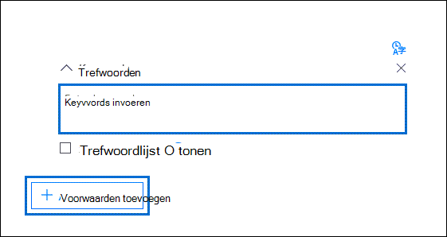
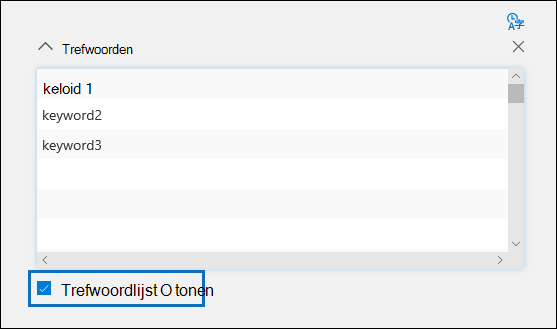

# Zoekquery's maken voor verzamelingen in Advanced eDiscovery

Wanneer u de zoekquery configureert bij het maken van een verzameling [in](collections-overview.md) een Advanced eDiscovery-zaak, kunt u trefwoorden gebruiken om specifieke inhoud en voorwaarden te vinden om het bereik van de zoekopdracht te beperken om items te retourneren die het meest relevant zijn voor uw juridische onderzoek.

## Zoekopdrachten met trefwoorden

Typ een trefwoordquery in het vak **Trefwoorden** in de zoekquery. U kunt trefwoorden, e-mailberichteigenschappen, zoals verzonden en ontvangen datums of documenteigenschappen opgeven, zoals bestandsnamen of de datum waarop een document voor het laatst is gewijzigd. U kunt complexere query's gebruiken die gebruikmaken van een booleaanse operator, zoals **AND**, **OR**, **NOT** en **NEAR**. U kunt ook zoeken naar gevoelige informatie (zoals socialezekerheidsnummers) in documenten in SharePoint en OneDrive (niet in e-mailberichten) of zoeken naar documenten die extern zijn gedeeld. Als u het vak Trefwoorden leeg laat, bevindt alle inhoud zich op de opgegeven **inhoudslocaties** in de zoekresultaten.

## Lijst met trefwoorden

U kunt ook het selectievakje Trefwoordlijst **weergeven** in- en uit elke rij een trefwoord of trefwoordzin typen. De trefwoorden in elke rij worden verbonden door een logische operator (die wordt weergegeven als *c:s* in de syntaxis van de zoekquery) die vergelijkbaar is met de functionaliteit van de **operator OF** in de zoekquery die wordt gemaakt. Dit betekent dat items die een trefwoord in een rij bevatten, in de zoekresultaten staan. U kunt maximaal 180 rijen toevoegen in de lijst met trefwoorden in Advanced eDiscovery zoekquery's.

Waarom wordt de lijst met trefwoorden gebruikt? U kunt statistieken krijgen waarin wordt weergegeven hoeveel items overeenkomen met elk trefwoord in de lijst met trefwoorden. Op deze manier kunt u snel de trefwoorden identificeren die het meest (en het minst) effectief zijn. U kunt ook een trefwoordzin gebruiken (tussen haakjes) in een rij in de lijst met trefwoorden. Zie Zoekstatistieken voor meer informatie over [zoekstatistieken.](search-statistics-in-advanced-ediscovery.md)

## Voorwaarden

U kunt zoekvoorwaarden toevoegen om het bereik van een zoekopdracht te beperken en een meer verfijnde set resultaten te retourneren. Elke voorwaarde verbindt een clausule aan de zoekquery die wordt gemaakt. Deze wordt uitgevoerd wanneer u de zoekopdracht start. Een voorwaarde is logisch verbonden met de trefwoordquery die in het trefwoordvak is opgegeven door een logische operator (die wordt weergegeven als *c:c* in de syntaxis van de zoekquery) die in functionaliteit vergelijkbaar is met de **operator AND.** Dit betekent dat items moeten voldoen aan zowel de trefwoordquery als een of meer voorwaarden die moeten worden opgenomen in de zoekresultaten. Op die manier kunt u door middel van voorwaarden de resultaten beperken. Zie de sectie 'Zoekvoorwaarden' in Trefwoordenquery's en zoekvoorwaarden voor een lijst en beschrijving van voorwaarden die u in een zoekquery [kunt gebruiken.](keyword-queries-and-search-conditions.md#search-conditions)
