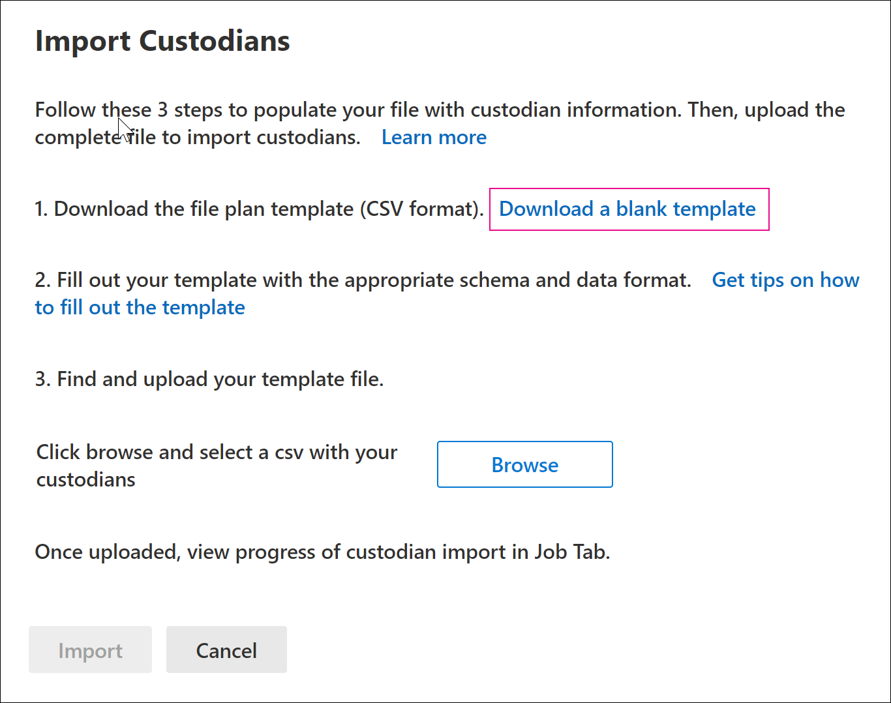

# Bewaarders importeren in een Advanced eDiscovery zaakImport custodians to an Advanced eDiscovery case

Voor Advanced eDiscovery gevallen waarbij veel bewaarders betrokken zijn, kunt u meerdere bewaarders tegelijk importeren met behulp van een CSV-bestand dat de informatie bevat die nodig is om ze toe te voegen aan een zaak.For Advanced eDiscovery cases that involve many custodians, you can import multiple custodians at once by using a CSV file that contains the information necessary to add them to a case.

## Beheerders importerenImport custodians

1. Open het Advanced eDiscovery en selecteer het tabblad **Gegevensbronnen.**Open the Advanced eDiscovery case and select the **Data sources** tab.

2. Klik **op Gegevensbron importeren**  >  **beheerders** toevoegen.Click **Add data source** > **Import custodians**.

3. Klik op **de flyoutpagina Beheerders** importeren op Een lege sjabloon **downloaden** om een csv-bestand met bewaarsjabloon te downloaden.On the **Import custodians** flyout page, click **Download a blank template** to download a custodian template CSV file.

   

4. Voeg de bewaargegevens toe aan het CSV-bestand en sla deze op uw lokale computer op.Add the custodial information to the CSV file and save it to your local computer. Zie de [sectie Bewaarder CSV-bestand](#custodian-csv-file) voor informatie over de vereiste eigenschappen in het CSV-bestand.See the [Custodian CSV file](#custodian-csv-file) section for information about the required properties in the CSV file.

5. Nadat u het CSV-bestand met de bewaargegevens hebt  voorbereid, gaat u terug naar het tabblad Gegevensbronnen en klikt u nogmaals op **Gegevensbron**  >   importeren.After you've prepared the CSV file with the custodian information, go back to the **Data sources** tab, and click **Add data source** > **Import custodians** again.

6. Klik op **de flyoutpagina** Beheerders importeren op **Bladeren** en upload het CSV-bestand dat de bewaargegevens bevat.On the **Import custodians** flyout page, click **Browse** and then upload the CSV file that contains the custodian information.

   Nadat het CSV-bestand is geüpload, wordt een taak **genaamd BulkAddCustodian** gemaakt en weergegeven op het **tabblad** Taken. De taak valideert de bewaarders en de bijbehorende gegevensbronnen en voegt deze toe aan de pagina **Gegevensbronnen** van de zaak.After the CSV file is uploaded, a job named **BulkAddCustodian** is created and displayed on the **Jobs** tab. The job validates the custodians and their associated data sources and then adds them to the **Data sources** page of the case.

## Bewaarder CSV-bestandCustodian CSV file

Nadat u de csv-bewaarsjabloon hebt gedownload, kunt u beheerders en de gegevensbron in elke rij toevoegen.After you download the CSV custodian template, you can add custodians and their data source in each row. Zorg ervoor dat u de kolomnamen in de veldnamenrij niet wijzigt.Be sure not to change the column names in the header row. Gebruik de kolommen werkbelastingtype en werkbelastinglocatie om andere gegevensbronnen aan een beheerder te koppelen.Use the workload type and workload location columns to associate other data sources to a custodian.

| KolomnaamColumn name|BeschrijvingDescription|
|:------- |:------------------------------------------------------------|
|**Bewaarder contactEmail****Custodian contactEmail**     |Het UPN-e-mailadres van de bewaarder.The custodian's UPN email address. U kunt bijvoorbeeld sarad@contoso.onmicrosoft.com.For example, sarad@contoso.onmicrosoft.com.           |
|**Exchange Ingeschakeld****Exchange Enabled** | WAAR/ONWAAR-waarde die al dan niet het postvak van de bewaarder moet bevatten.TRUE/FALSE value to include or not include the custodian's mailbox.      |
|**OneDrive Ingeschakeld****OneDrive Enabled** | WAAR/ONWAAR-waarde die al dan niet het account van de bewaarder OneDrive voor Bedrijven opgenomen.TRUE/FALSE value to include or not included the custodian's OneDrive for Business account. |
|**Is OnHold****Is OnHold**        | WAAR/ONWAAR om aan te geven of de bewaargegevensbronnen in de wacht moeten worden gezet.TRUE/FALSE value to indicate whether to place the custodian data sources on hold. 11     |
|**Werkbelasting1 Type****Workload1 Type**         |Tekenreekswaarde die het type gegevensbron aangeeft dat moet worden geassocieerd met de bewaarder.String value indicating the type of data source to associate with the custodian. Mogelijke waarden zijn:Possible values include:  - ExchangeMailbox- ExchangeMailbox  - SharePointSite- SharePointSite - TeamsMailbox- TeamsMailbox - TeamsSite- TeamsSite  - YammerMailbox- YammerMailbox - YammerSite- YammerSite |
|**Werkbelasting1 Locatie****Workload1 Location**     | Afhankelijk van het type werkbelasting is dit de locatie van de gegevensbron.Depending on your workload type, this would be the location of the data source. Bijvoorbeeld het e-mailadres voor een postvak Exchange of de URL voor een SharePoint site.For example, the email address for an Exchange mailbox or the URL for a SharePoint site. |
|||

> [!NOTE]
> 1 U kunt maximaal 1.000 postvakken en 100 sites in de wacht zetten met behulp van het bewaarproces en het CSV-bestand.1 You can place a maximum of 1,000 mailboxes and 100 sites on hold by using the custodian import process and CSV file. U kunt dit proces gebruiken om meer dan 1.000 bewaarders toe te voegen aan een zaak, maar de bewaarlimieten zijn nog steeds van toepassing.You can use this process to add more than 1,000 custodians to a case, but the hold limits still apply. Zie Limieten [in](limits-ediscovery20.md#hold-limits)Advanced eDiscovery.For more information about hold limits, see [Limits in Advanced eDiscovery](limits-ediscovery20.md#hold-limits).

Hier is een voorbeeld van een CSV-bestand met bewaargegevens:Here's an example of a CSV file with custodian information:  

|Bewaarder contactEmailCustodian contactEmail      | Exchange IngeschakeldExchange Enabled | OneDrive IngeschakeldOneDrive Enabled | Is OnHoldIs OnHold | Werkbelasting1 TypeWorkload1 Type | Werkbelasting1 LocatieWorkload1 Location             |
| ----------------- | ---------------- | ---------------- | --------- | -------------- | ------------------------------ |
|robinc@onmicrosoft.contoso.comrobinc@onmicrosoft.contoso.com | WAARTRUE             | WAARTRUE             | WAARTRUE      | SharePointSiteSharePointSite | https://contoso.sharepoint.com |
|pillarp@onmicrosoft.contoso.compillarp@onmicrosoft.contoso.com | WAARTRUE             | WAARTRUE             | WAARTRUE      | |  |
||||||

## Bewaar- en gegevensbronvalidatieCustodian and data source validation

Nadat u het bewaarder CSV-bestand hebt geüpload, Advanced eDiscovery u de volgende dingen:After you upload the custodian CSV file, Advanced eDiscovery does the following things:

1. Valideert de bewaarders en hun gegevensbronnen.Validates the custodians and their data sources.

2. Indexeert alle gegevensbronnen voor elke bewaarder en plaatst deze in de wacht (als de eigenschap **Is OnHold** in het CSV-bestand is ingesteld op WAAR).Indexes all data sources for each custodian and places them on hold (if the **Is OnHold** property in the CSV file is set to TRUE).

### BewaardervalidatieCustodian validation

Momenteel ondersteunen we alleen importbezorgers die zijn opgenomen in de Azure Active Directory van uw organisatie (Azure AD).Currently, we only support importing custodians that are included in your organization's Azure Active Directory (Azure AD).

Met het hulpprogramma voor het importeren van bewaarders worden bewaarders gevonden en gevalideerd met behulp van de UPN-waarde in de kolom **Bewaarder contactEmail** in het CSV-bestand.The custodian import tool finds and validates custodians using the UPN value in the **Custodian contactEmail** column in the CSV file. Bewaarders die worden gevalideerd, worden automatisch toegevoegd aan de zaak en worden weergegeven op het tabblad **Gegevensbronnen** van de zaak.Custodians that are validated are automatically added to the case and listed on the **Data sources** tab of the case. Als een voogd niet kan worden gevalideerd, worden deze weergegeven in het foutenlogboek voor de BulkAddCustodian-taak die wordt weergegeven op het tabblad Taken in de zaak. If a custodian can't be validated, they are listed in the error log for the BulkAddCustodian job that is listed on the **Jobs** tab in the case. Niet-gevalideerde bewaarders worden niet toegevoegd aan de zaak of worden vermeld op het **tabblad Gegevensbronnen.**Unvalidated custodians are not added to the case or listed on the **Data sources** tab.

### GegevensbronvalidatieData source validation

Nadat bewaarders zijn gevalideerd en aan de zaak zijn toegevoegd, worden elk primair postvak en OneDrive account toegevoegd dat is gekoppeld aan een bewaarder.After custodians are validated and added to the case, each primary mailbox and OneDrive account that's associated with a custodian is added.

Als een van de andere gegevensbronnen (zoals SharePoint-sites, Microsoft Teams, Microsoft 365 Groepen of Yammer-groepen) die zijn gekoppeld aan een bewaarder niet kan worden gevonden, worden geen  van deze gegevens toegewezen aan de bewaarder en  wordt de waarde Niet gevalideerd weergegeven in de kolom **Status** naast de bewaarder op het tabblad Gegevensbronnen.However, if any of the other data sources (such as SharePoint sites, Microsoft Teams, Microsoft 365 Groups, or Yammer groups) associated with a custodian can't be found, none of them are assigned to the custodian and the value **Not validated** is displayed in the **Status** column next to the custodian on the **Data sources** tab.

Gevalideerde gegevensbronnen voor een bewaarder toevoegen:To add validated data sources for a custodian:

1. Selecteer op **het tabblad** Gegevensbronnen een bewaarder die gegevensbronnen bevat die niet zijn gevalideerd.On the **Data sources** tab, select a custodian that contains data sources that aren't validated.

2. Schuif op de pagina bewaarder flyout naar de sectie **Bewaarlocaties** om zowel gevalideerde als niet-gevalideerde gegevensbronnen weer te geven die zijn gekoppeld aan bewaarder.On the custodian flyout page, scroll to the **Custodial locations** section to view both validated and unvalidated data sources that are associated with custodian.

3. Klik **boven** aan de flyoutpagina op Bewerken om ongeldige gegevensbronnen te verwijderen of nieuwe gegevens toe te voegen.Click **Edit** at the top of the flyout page to remove invalid data sources or add new ones.

4. Nadat u niet-gevalideerde gegevensbronnen hebt verwijderd of een nieuwe hebt toevoegen, wordt de waarde **Actief** weergegeven in **de kolom Status** voor de bewaarder op het tabblad **Gegevensbronnen.** Als u bronnen wilt toevoegen die eerder ongeldig leken, volgt u de onderstaande herstelstappen om ze handmatig toe te voegen aan een bewaarder.After you remove unvalidated data sources or add a new one, the value **Active** is displayed in **Status** column for the custodian on the **Data sources** tab. To add sources that previously appeared to be invalid, follow the remediation steps below to manually add them to a custodian.

### Ongeldige gegevensbronnen herstellenRemediating invalid data sources

Handmatig een gegevensbron toevoegen en koppelen die eerder ongeldig was:To manually add and associate a data source that was previously invalid:

1. Selecteer op **het tabblad Gegevensbronnen** een beheerder om handmatig een gegevensbron toe te voegen en te koppelen die eerder ongeldig was.On the **Data sources** tab, select a custodian to manually add and associate a data source that was previously invalid.

2. Klik **boven** aan de flyoutpagina op Bewerken om postvakken, sites, Teams of Yammer aan de beheerder te koppelen.Click **Edit** at the top of the flyout page to associate mailboxes, sites, Teams, or Yammer groups to the custodian. Doe dit door te klikken op **Bewerken** naast het juiste gegevenslocatietype.Do this by clicking **Edit** next to the appropriate data location type.

3. Klik **op Volgende** om de pagina Instellingen voor **wachtstand weer** te geven en de instelling voor de ingedrukt houden te configureren voor de gegevensbronnen die u hebt toegevoegd.Click **Next** to display the **Hold settings** page and configure the hold setting for the data sources you added.

4. Klik **op Volgende** om de pagina **Revisiebeheerders weer te** geven en klik vervolgens op Verzenden **om** uw wijzigingen op te slaan.Click **Next** to display the **Review custodians** page, and then click **Submit** to save your changes.
