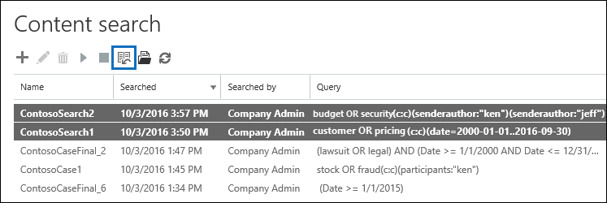
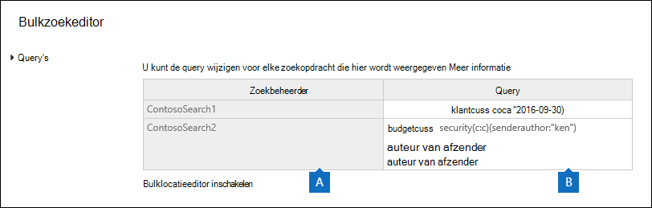
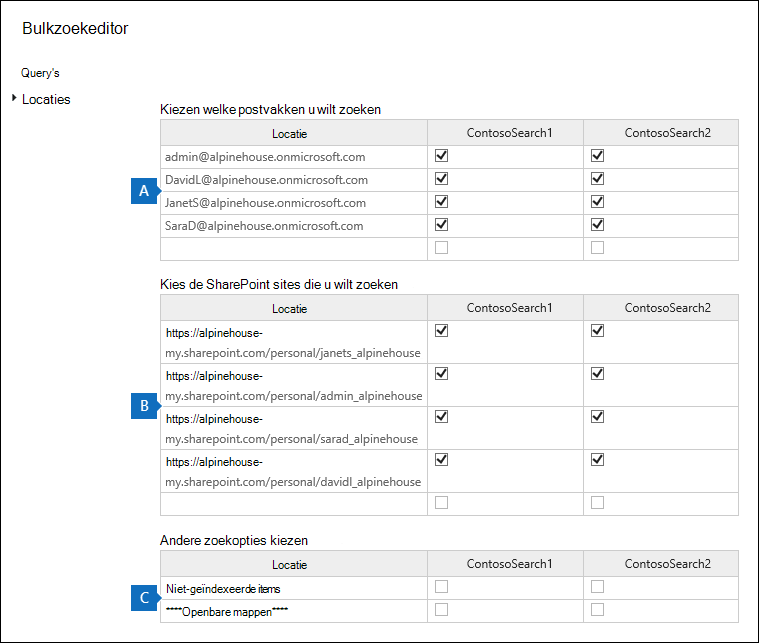

# Inhoudszoekbewerkingen bulksgewijs bewerkenBulk edit Content Searches

U kunt de bulkzoekeditor in het hulpprogramma Inhoud zoeken gebruiken om meerdere zoekopdrachten tegelijk te bewerken.You can use the Bulk Search Editor in the Content Search tool to edit multiple searches at the same time. Met dit hulpprogramma kunt u snel de query- en inhoudslocaties wijzigen voor een of meer zoekopdrachten.Using this tool lets you quickly change the query and content locations for one or more searches. Vervolgens kunt u de zoekopdrachten opnieuw doen en nieuwe geschatte zoekresultaten voor de gewijzigde zoekopdrachten krijgen.Then you can rerun the searches and get new estimated search results for the revised searches. Met de editor kunt u ook query's en inhoudslocaties uit een Microsoft Excel of tekstbestand kopiëren en plakken.The editor also lets you copy and paste queries and content locations from a Microsoft Excel file or text file. Dit betekent dat u het hulpprogramma Zoekstatistieken kunt gebruiken om de statistieken van een of meer zoekopdrachten weer te geven, de statistieken te exporteren naar een CSV-bestand, waar u de query's en inhoudslocaties in Excel.This means you can use the Search Statistics tool to view the statistics of one or more searches, export the statistics to a CSV file, where you can edit the queries and content locations in Excel. Vervolgens gebruikt u bulkzoekeditor om de gewijzigde query's en inhoudslocaties toe te voegen aan de zoekopdrachten.Then you use the Bulk Search Editor to add the revised queries and content locations to the searches. Nadat u een of meer zoekopdrachten hebt gewijzigd, kunt u deze opnieuw starten en nieuwe geschatte zoekresultaten krijgen.After you've revised one or more searches, you can restart them and get new estimated search results.

Zie Trefwoordstatistieken weergeven voor [inhoudszoekresultaten](view-keyword-statistics-for-content-search.md)voor meer informatie over het gebruik van het hulpprogramma Zoekstatistieken.For more information about using the Search Statistics tool, see [View keyword statistics for Content Search results](view-keyword-statistics-for-content-search.md).

## De bulkzoekeditor gebruiken om query's te wijzigenUse the Bulk Search Editor to change queries

1. Ga naar <https://protection.office.com> en selecteer zoeken in **inhoud** \> **zoeken.**Go to <https://protection.office.com>, and then select **Search** \> **Content search**.

2. Selecteer in de lijst met zoekopdrachten een of meer zoekopdrachten en selecteer vervolgens **Bulk Search Editor** Bulk Search Editor button  .In the list of searches, select one or more searches, and then select **Bulk Search Editor** .

    

    De volgende informatie wordt weergegeven op de pagina **Query's** van de bulkzoekeditor.The following information is displayed on the **Queries** page of the Bulk Search Editor.

    

    a.a. In **de** kolom Zoeken wordt de naam van het zoeken naar inhoud weergegeven.The **Search** column displays the name of the Content Search. Zoals eerder vermeld, kunt u de query bewerken voor meerdere zoekopdrachten.As previously stated, you can edit the query for multiple searches.

    b.b. In **de kolom** Query wordt de query voor het zoeken naar inhoud weergegeven in de **kolom** Zoeken.The **Query** column displays the query for the Content Search listed in the **Search** column. Als de query is gemaakt met de functie trefwoordlijst, worden de trefwoorden gescheiden door de **`(c:s)`** tekst.If the query was created using the keyword list feature, the keywords are separated by the text **`(c:s)`**. Dit geeft aan dat de trefwoorden zijn verbonden door de **operator OF.**This indicates that the keywords are connected by the **OR** operator. Als de query voorwaarden bevat, worden de trefwoorden en de voorwaarden gescheiden door de **`(c:c)`** tekst.Additionally, if the query includes conditions, the keywords and the conditions are separated by the text **`(c:c)`**. Dit geeft aan dat de trefwoorden (of trefwoordfasen) zijn verbonden met de voorwaarden van de **operator AND.**This indicates that the keywords (or keyword phases) are connected to the conditions by the **AND** operator. In de vorige schermafbeelding van de zoekopdracht ContosoSearch1 is de KQL-query bijvoorbeeld gelijk aan `customer (c:s) pricing(c:c)(date=2000-01-01..2016-09-30)`  `(customer OR pricing) AND (date=2002-01-01..2016-09-30)` .For example, in the previous screenshot the for search ContosoSearch1, the KQL query that is equivalent to `customer (c:s) pricing(c:c)(date=2000-01-01..2016-09-30)` would be  `(customer OR pricing) AND (date=2002-01-01..2016-09-30)`.

3. Als u een query wilt bewerken, selecteert u in de cel van de query die u wilt wijzigen en doet u een van de volgende dingen.To edit a query, select in the cell of the query that you want to change and doing one of the following things. De cel wordt begrensd door een blauw vak wanneer u deze selecteert.The cell is bordered by a blue box when you select it.

   - Typ de nieuwe query in de cel.Type the new query in the cell. U kunt een deel van de query niet bewerken.You can't edit a portion of the query. U moet de hele query typen.You have to type the entire query.

      OfOr

   - Plak een nieuwe query in de cel.Paste a new query in the cell. Er wordt ervan uitgenomen dat u de querytekst uit een bestand hebt gekopieerd, zoals een tekstbestand of een Excel bestand.This assumes that you've copied the query text from a file, such as a text file or an Excel file.

4. Nadat u een of meer query's  op de pagina Query's hebt bewerkt, selecteert u **Opslaan.**After you've edited one or more queries on the **Queries** page, select **Save**.

    De gewijzigde query wordt weergegeven in de **kolom Query** voor de geselecteerde zoekopdracht.The revised query is displayed in the **Query** column for the selected search.

5. Selecteer **Sluiten om** de bulkzoekeditor te sluiten.Select **Close** to close the Bulk Search Editor.

6. Selecteer op **de pagina Inhoud** zoeken de zoekopdracht die u hebt bewerkt en selecteer **Zoeken** starten om de zoekopdracht opnieuw te starten met de gewijzigde query.On the **Content search** page, select the search that you edited, and select **Start** search to restart the search using the revised query.

Hier zijn enkele tips voor het bewerken van query's met de bulkzoekeditor:Here are some tips for editing queries using the Bulk Search Editor:

- Kopieer de bestaande query (met **Ctrl C)** naar een tekstbestand.Copy the existing query (by using **Ctrl C**) to a text file. Bewerk de query in het tekstbestand en kopieer de gewijzigde query en plak deze (met **Ctrl V)** terug in de cel op de **pagina Query's.**Edit the query in the text file, and then copy the revised query and paste it (using **Ctrl V**) back into the cell on the **Queries** page.

- U kunt ook query's uit andere toepassingen kopiëren (zoals Microsoft Word of Microsoft Excel).You can also copy queries from other applications (such as Microsoft Word or Microsoft Excel). U kunt echter per ongeluk niet-ondersteunde tekens toevoegen aan een query met de bulkzoekeditor.However, you might inadvertently add unsupported characters to a query using the Bulk Search Editor. De beste manier om niet-ondersteunde tekens te voorkomen, is door de query in een cel op de pagina **Query's te** typen.The best way to prevent unsupported characters is to just type the query in a cell on the **Queries** page. U kunt ook een query kopiëren uit Word of Excel en deze vervolgens plakken in een tekst zonder opmaak, zoals Microsoft Kladblok.Or you can copy a query from Word or Excel and then paste it to file in a plain text editor, such as Microsoft Notepad. Sla het tekstbestand op en selecteer **ANSI** in de **vervolgkeuzelijst** Codering.Then save the text file and select **ANSI** in the **Encoding** drop-down list. Hiermee worden alle opmaak en niet-ondersteunde tekens verwijderd.This removes any formatting and unsupported characters. Vervolgens kunt u de query kopiëren en plakken van het tekstbestand naar de **pagina Query's.**Then you can copy and paste the query from the text file to the **Queries** page.

## De bulkzoekeditor gebruiken om inhoudslocaties te wijzigenUse the Bulk Search Editor to change content locations

1. Selecteer in de bulkzoekeditor voor een of meer geselecteerde zoekopdrachten  de optie Bulklocatieeditor inschakelen en selecteer vervolgens de koppeling Locaties die op de pagina wordt weergegeven.In the Bulk Search Editor for one or more selected searches, select **Enable bulk location editor**, and then select the **Locations** link that is displayed on the page.

    De volgende informatie wordt weergegeven op de pagina **Locaties** van de bulkzoekeditor.The following information is displayed on the **Locations** page of the Bulk Search Editor.

    

    a.a. **Postvakken om te zoeken** In deze sectie ziet u een kolom voor elke geselecteerde inhoudszoekfunctie en een rij voor elk postvak dat is opgenomen in de zoekopdracht.**Mailboxes to search** This section displays a column for each selected Content Search and a row for each mailbox that's included in the search. Een vinkje geeft aan dat het postvak is opgenomen in de zoekopdracht.A check mark indicates that the mailbox is included in the search. U kunt postvakken toevoegen aan een zoekopdracht door het e-mailadres van het postvak in een lege rij te typen en vervolgens het selectievakje in te selecteren voor het zoeken naar inhoud aan wie u het wilt toevoegen.You can add mailboxes to a search by typing the email address of the mailbox in a blank row and then selecting the check box for the Content Search that you want to add it to. U kunt ook een postvak uit een zoekopdracht verwijderen door het selectievakje uit te wissen.Or you can remove a mailbox from a search by clearing the check box.

    b.b. **SharePoint sites om te zoeken** In deze sectie wordt een rij weergegeven voor SharePoint en OneDrive site die is opgenomen in elke geselecteerde inhoudszoekfunctie.**SharePoint sites to search** This section displays a row for each SharePoint and OneDrive site that's included in each selected Content Search. Een vinkje geeft aan dat de site is opgenomen in de zoekopdracht.A check mark indicates that the site is included in the search. U kunt sites toevoegen aan een zoekopdracht door de URL voor de site in een lege rij te typen en vervolgens het selectievakje in te stellen voor de inhoudszoekfunctie aan wie u deze wilt toevoegen.You can add sites to a search by typing the URL for the site in a blank row and then selecting the check box for the Content Search that you want to add it to. U kunt ook een site verwijderen uit een zoekopdracht door het selectievakje uit te wissen.Or you can remove a site from a search by clearing the check box.

    c.c. **Andere zoekopties** In deze sectie wordt aangegeven of niet-geïndexeerde items en openbare mappen zijn opgenomen in de zoekopdracht.**Other search options** This section indicates whether unindexed items and public folders are included in the search. Als u deze wilt opnemen, moet u ervoor zorgen dat het selectievakje is ingeschakeld.To include them, make sure the check box is selected. Als u ze wilt verwijderen, verwijdert u het selectievakje.To remove them, clear the check box.

2. Nadat u een of meer secties op  de pagina Locaties hebt bewerkt, selecteert u **Opslaan.**After you've edited one or more of the sections on the **Locations** page, select **Save**.

    De gewijzigde inhoudslocaties worden weergegeven in de juiste sectie voor de geselecteerde zoekopdrachten.The revised content locations are displayed in the appropriate section for the selected searches.

3. Selecteer **Sluiten om** de bulkzoekeditor te sluiten.Select **Close** to close the Bulk Search Editor.

4. Selecteer op **de pagina Inhoud** zoeken de zoekopdracht die u hebt bewerkt en selecteer **Zoeken** starten om de zoekopdracht opnieuw op te starten met de gewijzigde inhoudslocaties.On the **Content search** page, select the search that you edited, and select **Start** search to restart the search using the revised content locations.

Hier zijn enkele tips voor het bewerken van inhoudslocaties met de bulkzoekeditor:Here are some tips for editing content locations using the Bulk Search Editor:

- U kunt Inhoud zoeken bewerken om in alle postvakken of sites in  de organisatie te zoeken door Alles **in** een lege rij in de **postvakken** te typen om te zoeken SharePoint sites te zoeken en het selectievakje in te selecteren.You can edit Content Searches to search all mailboxes or sites in the organization by typing **All** in a blank row in the **Mailboxes to search** or **SharePoint sites to search** section and then selecting the check box.

- U kunt meerdere inhoudslocaties toevoegen aan een of meer zoekopdrachten door meerdere rijen uit een tekstbestand of een Excel-bestand te kopiëren en deze vervolgens te kopiëren in een sectie op de pagina **Locaties.**You can add multiple content locations to one or more searches by copying multiple rows from a text file or an Excel file and then pasting them in a section on the **Locations** page. Nadat u nieuwe locaties hebt toevoegt, moet u het selectievakje in- of selecteren voor elke zoekopdracht aan wie u de locatie wilt toevoegen.After you add new locations, be sure to select the check box for each search that you want add the location to.

    > [!TIP]
    > Als u een lijst met e-mailadressen wilt genereren voor alle gebruikers in uw organisatie, moet u de opdracht PowerShell uitvoeren in stap 2 in stap [2: Een](search-the-mailbox-and-onedrive-for-business-for-a-list-of-users.md#step-2-generate-a-list-of-users)lijst met gebruikers genereren.To generate a list of email addresses for all the users in your organization, run the PowerShell command in Step 2 in [Step 2: Generate a list of users](search-the-mailbox-and-onedrive-for-business-for-a-list-of-users.md#step-2-generate-a-list-of-users). Of volg de stappen in [Een lijst met](/onedrive/list-onedrive-urls) alle gebruikersgegevens OneDrive in uw organisatie om een lijst te genereren met alle OneDrive voor Bedrijven sites in uw organisatie.Or follow the steps in [Get a list of all user OneDrive URLs in your organization](/onedrive/list-onedrive-urls) to generate a list of all OneDrive for Business sites in your organization. Houd er rekening mee dat u de URL voor het MySite-domein van uw organisatie moet toevoegen (bijvoorbeeld aan de OneDrive voor Bedrijven sites die door het https://contoso-my.sharepoint.com) script zijn gemaakt.Note that you'll have to append the URL for your organization's MySite domain (for example, https://contoso-my.sharepoint.com) to the OneDrive for Business sites that's created by the script. Nadat u een lijst met e-mailadressen of OneDrive voor Bedrijven sites hebt,  kunt u deze kopiëren en plakken naar de pagina Locaties in de bulkzoekeditor.After you have list of email addresses or OneDrive for Business sites, you can copy and paste them to the **Locations** page in the Bulk Search Editor.

- Nadat u Opslaan **hebt geselecteerd om** wijzigingen op te slaan in bulkzoekeditor, wordt het e-mailadres voor postvakken dat u aan een zoekopdracht hebt toegevoegd, gevalideerd.After you select **Save** to save changes in Bulk Search Editor, the email address for mailboxes that you added to a search will be validated. Als het e-mailadres niet bestaat, wordt een foutbericht weergegeven met de melding dat het postvak niet kan worden gevonden.If the email address doesn't exist, an error message is displayed saying the mailbox can't be located. URL's voor sites worden niet gevalideerd.URLs for sites aren't validated.
