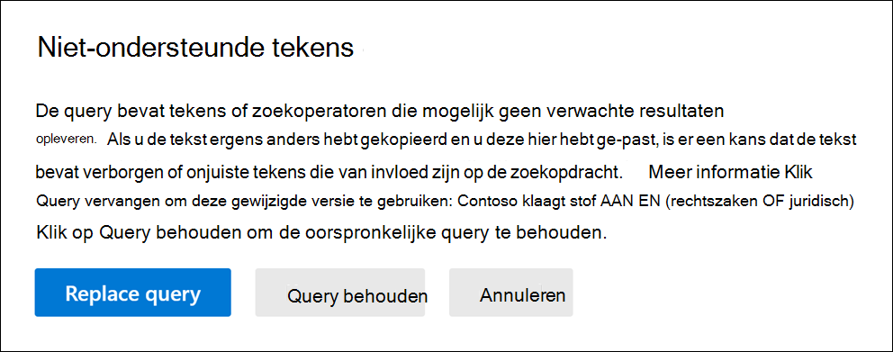

# Uw inhoudszoekquery controleren op foutenCheck your Content Search query for errors
  
Hier is een lijst met de niet-ondersteunde tekens die we controleren.Here's a list of the unsupported characters that we check for. Niet-ondersteunde tekens worden vaak verborgen en veroorzaken meestal een zoekfout of geven onbedoelde resultaten als resultaat.Unsupported characters are often hidden, and they typically cause a search error or return unintended results.
  
- **Slimme aanhalingstekens-** Slimme enkele en dubbele aanhalingstekens (ook wel gekrulde aanhalingstekens genoemd) worden niet ondersteund.**Smart quotation marks** - Smart single and double quotation marks (also called curly quotes) aren't supported. Alleen rechte aanhalingstekens kunnen worden gebruikt in een zoekquery.Only straight quotation marks can be used in a search query. 

- **Niet-afdrukbare en besturingselementtekens:** niet-afdrukbare en besturingselementtekens vertegenwoordigen geen geschreven symbool, zoals een alfa-numeriek teken.**Non-printable and control characters** - Non-printable and control characters don't represent a written symbol, such as an alpha-numeric character. Voorbeelden van niet-afdrukbare en besturingselementtekens zijn tekens die tekst of afzonderlijke regels tekst opmaken.Examples of non-printable and control characters include characters that format text or separate lines of text. 

- **Markeringen** van links naar rechts en van rechts naar links : dit zijn besturingselementtekens die worden gebruikt om tekstrichting aan te geven voor talen van links naar rechts (zoals Engels en Spaans) en talen van rechts naar links (zoals Arabisch en Hebreeuws).**Left-to-right and right-to-left marks** - These marks are control characters used to indicate text direction for left-to-right languages (such as English and Spanish) and right-to-left languages (such as Arabic and Hebrew).

- **Kleine letters Booleaanse operatoren:** als u een Booleaanse operator gebruikt, zoals **AND**, **OF** en **NIET** in een zoekquery, moet deze hoofdletters zijn.**Lowercase Boolean operators** - If you use a Boolean operator, such as **AND**, **OR**, and **NOT** in a search query, it must be uppercase. Wanneer we een query controleren op typfouten, geeft de syntaxis van de query vaak aan dat er een Booleaanse operator wordt gebruikt, ook al worden kleine letters gebruikt.  `(WordA or WordB) and (WordC or WordD)`bijvoorbeeld.When we check a query for typos, the query syntax will often indicate that a Boolean operator is being used even though lowercase operators might be used; for example,  `(WordA or WordB) and (WordC or WordD)`.

## Wat gebeurt er als een query een niet-ondersteund teken heeft?What happens if a query has an unsupported character?

Als er niet-ondersteunde tekens worden gevonden in uw query, wordt een waarschuwingsbericht weergegeven met de melding dat er niet-ondersteunde tekens zijn gevonden en wordt een alternatief gesuggereerd.If unsupported characters are found in your query, a warning message is displayed that says unsupported characters were found and suggests an alternative. U hebt dan de optie om de oorspronkelijke query te behouden of te vervangen door de voorgestelde herziene query.You then have the option keep the original query or replace it with the suggested revised query.

Hier ziet u een voorbeeld van het waarschuwingsbericht dat wordt weergegeven nadat u in de vorige schermafbeelding op Query controleren op **typfouten** voor de zoekquery hebt geklikt.Here's an example of the warning message that's displayed after you click **Check query for typos** for the search query in the previous screenshot. Let op de oorspronkelijke query met slimme aanhalingstekens en kleine letters booleaanse operatoren.Note the original query used smart quotes and lowercase Boolean operators.
  

  
## Niet-ondersteunde tekens in uw zoekquery's voorkomenHow to prevent unsupported characters in your search queries

Niet-ondersteunde tekens worden meestal toegevoegd aan een query wanneer u de query of delen van de query kopieert uit andere toepassingen (zoals Microsoft Word of Microsoft Excel) en deze in het trefwoordvak op de querypagina van een inhoudszoekactie plakt.Unsupported characters are typically added to a query when you copy the query or parts of the query from other applications (such as Microsoft Word or Microsoft Excel) and paste them in the keyword box on the query page of a Content Search. De beste manier om niet-ondersteunde tekens te voorkomen, is door de query in het vak trefwoord te typen.The best way to prevent unsupported characters is to just type the query in the keyword box. U kunt ook een query kopiëren vanuit Word of Excel en deze vervolgens plakken in een tekst zonder opmaak, zoals Microsoft Kladblok.Or you can copy a query from Word or Excel, and then paste it in a plain text editor, such as Microsoft Notepad. Sla het tekstbestand op en selecteer **ANSI** in de **vervolgkeuzelijst** Codering.Save the text file and select **ANSI** in the **Encoding** drop-down list. Hiermee worden alle opmaak en niet-ondersteunde tekens verwijderd.This will remove any formatting and unsupported characters. Vervolgens kunt u de query uit het tekstbestand kopiëren en plakken naar het vak trefwoordquery.Then you can copy and paste the query from the text file to the keyword query box. 
