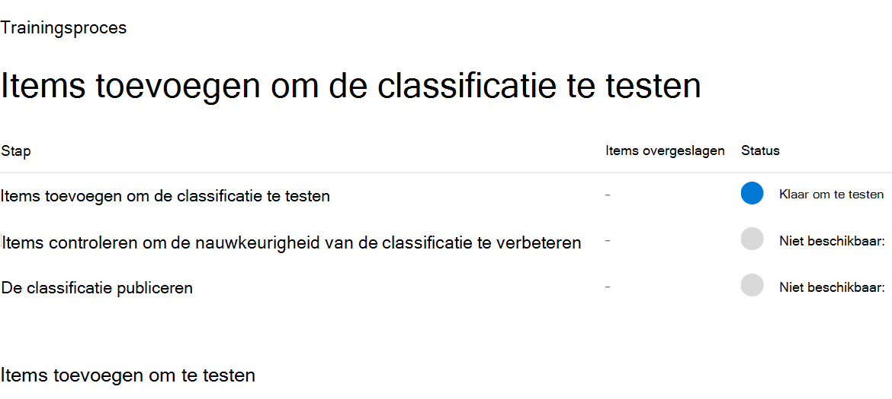
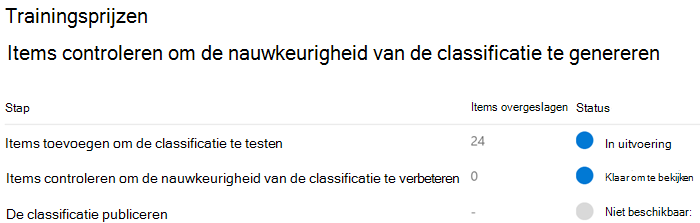
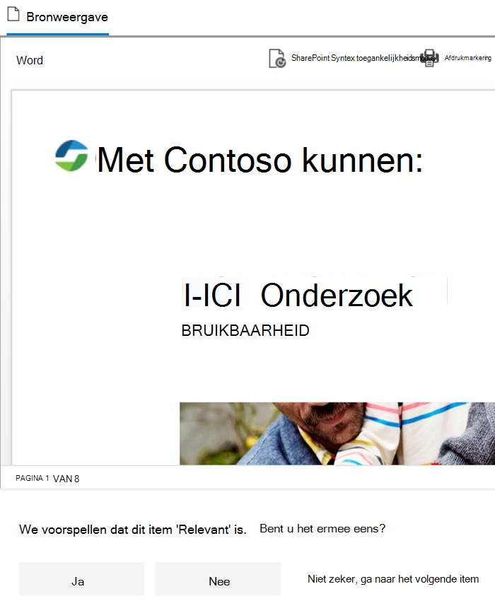
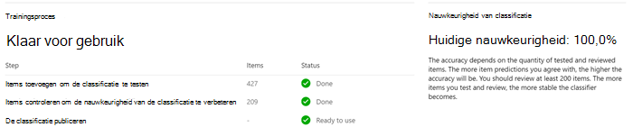

# Aan de slag met trainbare classificaties

Een Microsoft 365 trainable classifier is een hulpmiddel dat u kunt trainen om verschillende soorten inhoud te herkennen door deze voorbeelden te geven om naar te kijken. Nadat u bent opgeleid, kunt u het gebruiken om het item te identificeren voor de toepassing van Office gevoeligheidslabels, compliancebeleid voor communicatie en bewaarlabelbeleid.

Bij het maken van een aangepaste, trainbare classificatie moet u eerst steekproeven geven die door de mens zijn genomen en die positief overeenkomen met de categorie. Nadat deze zijn verwerkt, test u de mogelijkheid voor classificaties om te voorspellen door een combinatie van positieve en negatieve steekproeven te geven. In dit artikel wordt beschreven hoe u een aangepaste classificatie kunt maken en trainen en hoe u de prestaties van aangepaste, trainbare classificaties en vooraf getrainde classificaties gedurende hun hele leven kunt verbeteren door omscholing.

Zie Meer informatie over leerbare classificaties voor meer informatie over de verschillende typen [classificaties.](classifier-learn-about.md)

Bekijk deze video voor een beknopt overzicht van het maken van een trainbare classificatie. U moet dit volledige artikel nog steeds lezen voor meer informatie.

 

> [!VIDEO https://www.microsoft.com/videoplayer/embed/RWyGL7]

## Vereisten

### Licentievereisten

Classificaties zijn een Microsoft 365 E5 of E5 Compliance-functie. U moet een van deze abonnementen hebben om er gebruik van te kunnen maken.

### Machtigingen

Toegang tot classificaties in de gebruikersinterface: 

- de globale beheerder moet ervoor kiezen om aangepaste classificaties te maken voor de tenant.
- De rol compliancebeheerder is vereist voor het trainen van een classificatie.

U hebt accounts met deze machtigingen nodig om classificaties in deze scenario's te kunnen gebruiken:

- Scenario bewaarlabelbeleid: rollen recordbeheer en bewaarbeheer 
- Scenario gevoeligheidslabelbeleid: beveiligingsbeheerder, compliancebeheerder, compliancegegevensbeheerder
- Scenario communicatie compliancebeleid: Insider Risk Management Admin, Supervisory Review Administrator 

> [!IMPORTANT]
> Standaard kan alleen de gebruiker die een aangepaste classificatie maakt voorspellingen trainen en bekijken die door die classificatie zijn gemaakt.

## Voorbereiden op een aangepaste, trainbare classificatie 

Het is handig om te begrijpen wat er nodig is bij het maken van een aangepaste, trainbare classificatie voordat u binnen duikt. 

### Tijdlijn

Deze tijdlijn weerspiegelt een voorbeeldimplementatie van trainable classifiers.

> [!TIP]
> Opt-in is de eerste keer vereist voor trainbare classificaties. Het duurt twaalf dagen voordat Microsoft 365 een basislijnevaluatie van de inhoud van uw organisatie voltooit. Neem contact op met de globale beheerder om het opt-inproces te starten.

### Algemene werkstroom

Zie Process flow for creating customer trainable classifiers (Processtroom voor het maken van [klants trainable classifiers)](classifier-learn-about.md#process-flow-for-creating-custom-classifiers)voor meer informatie over de algehele werkstroom van het maken van aangepaste, trainbare classificaties.

### Inhoud van het zaad

Als u wilt dat een trainbare classificatie een item onafhankelijk en nauwkeurig identificeert als een bepaalde inhoudscategorie, moet u eerst veel voorbeelden van het type inhoud in de categorie presenteren. Deze voeding van steekproeven aan de trainbare classificatie wordt *seeding genoemd.* De inhoud van het zaad wordt geselecteerd door een mens en wordt beoordeeld als de categorie met inhoud.

> [!TIP]
> U moet ten minste 50 positieve steekproeven hebben en maar liefst 500. De trainable classifier verwerkt maximaal de 500 meest recente gemaakte steekproeven (per bestand dat datum-/tijdstempel is gemaakt). Hoe meer steekproeven u op geeft, hoe nauwkeuriger de voorspellingen die de classificatie zal maken.

### Inhoud testen

Nadat de trainbare classificatie voldoende positieve steekproeven heeft verwerkt om een voorspellingsmodel te maken, moet u de voorspellingen testen om te zien of de classificatie correct onderscheid kan maken tussen items die overeenkomen met de categorie en items die niet overeenkomen. U doet dit door een andere, hopelijk grotere, reeks door de mens genomen inhoud te selecteren die bestaat uit steekproeven die in de categorie moeten vallen en steekproeven die dat niet doen. U moet testen met andere gegevens dan de eerste begingegevens die u voor het eerst hebt opgegeven. Wanneer deze zijn verwerkt, gaat u handmatig door de resultaten en controleert u of elke voorspelling juist, onjuist of niet zeker is. De trainable classifier gebruikt deze feedback om het voorspellingsmodel te verbeteren.

> [!TIP]
> Voor de beste resultaten moet u ten minste 200 items in uw testvoorbeeldset hebben met een gelijkmatige verdeling van positieve en negatieve overeenkomsten.

## Een trainbare classificatie maken

1. Verzamel tussen de 50-500 inhoudsitems voor zaad. Dit moeten alleen steekproeven zijn die sterk het type inhoud vertegenwoordigen dat door de trainbare classificatie wordt bepaald als zijnde in de classificatiecategorie. Zie Standaard [verkende bestandsnaamextensies en geparseerde bestandstypen in SharePoint Server](/sharepoint/technical-reference/default-crawled-file-name-extensions-and-parsed-file-types) voor de ondersteunde bestandstypen.

   > [!IMPORTANT]
   > De zaad- en testvoorbeelditems mogen niet worden versleuteld en moeten in het Engels zijn.

   > [!IMPORTANT]
   > Zorg ervoor dat de items in de zaadset sterke **voorbeelden van** de categorie zijn. De trainable classifier bouwt in eerste instantie zijn model op basis van wat u het start. De classificatie gaat ervan uit dat alle zaadmonsters sterke positieve punten zijn en dat u niet weet of een steekproef een zwakke of negatieve overeenkomst met de categorie is.

2. Plaats de inhoud van het zaad in een SharePoint onlinemap die alleen bestemd is voor het vasthouden van *de inhoud van het zaad.* Noteer de URL van de site, bibliotheek en map.

   > [!TIP]
   > Als u een nieuwe site en map maakt voor uw seedgegevens, moet u ten minste een uur toestaan dat die locatie wordt geïndexeerd voordat u de trainbare classificatie maakt waarmee die seedgegevens worden gebruikt.

3. Meld u aan bij Microsoft 365 compliancecentrum met roltoegang voor compliancebeheerders of beveiligingsbeheerders en open Microsoft 365 **compliancecentrum** of Microsoft 365 **beveiligingscentrum**  >  **Gegevensclassificatie.**

4. Kies het **tabblad Trainable classifiers.**

5. Kies **Trainable classifier maken.**

6. Vul de juiste waarden in voor de en velden van de categorie items die u wilt identificeren met `Name` `Description` deze trainbare classificatie.

7. Kies de SharePoint onlinesite, bibliotheek en map-URL voor de site met inhoud van het zaad in stap 2. Kies `Add` .

8. Controleer de instellingen en kies `Create trainable classifier` .

9. Binnen 24 uur verwerkt de trainbare classificatie de seedgegevens en maakt u een voorspellingsmodel. De classificatiestatus is terwijl `In progress` de seedgegevens worden verwerkt. Wanneer de classificatie klaar is met de verwerking van de seedgegevens, wordt de status gewijzigd in `Need test items` .

10. U kunt nu de detailspagina bekijken door de classificatie te kiezen.

    > [!div class="mx-imgBorder"]
    > 

11. Verzamel ten minste 200 testinhouditems (maximaal 10.000) voor de beste resultaten. Dit moet een combinatie zijn van items die sterke positieven, sterke negatieven en sommige items zijn die iets minder duidelijk zijn in hun aard. Zie Standaard [verkende bestandsnaamextensies en geparseerde bestandstypen in SharePoint Server](/sharepoint/technical-reference/default-crawled-file-name-extensions-and-parsed-file-types) voor de ondersteunde bestandstypen.

    > [!IMPORTANT]
    > De voorbeelditems mogen niet worden versleuteld en moeten in het Engels zijn.

12. Plaats de testinhoud in een SharePoint onlinemap die alleen is bedoeld om de *testinhoud vast te houden.* Noteer de SharePoint onlinesite, bibliotheek en map-URL.

    > [!TIP]
    > Als u een nieuwe site en map voor uw testgegevens maakt, moet u ten minste een uur toestaan dat die locatie wordt geïndexeerd voordat u de trainbare classificatie maakt waarmee die seedgegevens worden gebruikt.

13. Kies `Add items to test` .

14. Kies de SharePoint url van de onlinesite, bibliotheek en map voor de testinhoudssite uit stap 12. Kies `Add` .

15. Maak de wizard af door te kiezen `Done` . Het duurt maximaal een uur voordat de testbestanden worden verwerkt door uw trainbare classificatie.

16. Wanneer de trainable classifier klaar is met het verwerken van uw testbestanden, wordt de status op de detailspagina gewijzigd in `Ready to review` . Als u de grootte van het testvoorbeeld wilt vergroten, kiest en laat u de `Add items to test` trainbare classifier de extra items verwerken.

    > [!div class="mx-imgBorder"]
    > 

17. Kies `Tested items to review` het tabblad om items te bekijken.

18. Microsoft 365 presenteert 30 items tegelijk. Bekijk ze en kies in `We predict this item is "Relevant". Do you agree?` het vak een of of `Yes` `No` `Not sure, skip to next item` . De nauwkeurigheid van het model wordt automatisch bijgewerkt na elke 30 items.

    > [!div class="mx-imgBorder"]
    > 

19. Bekijk *ten minste* 200 items. Zodra de nauwkeurigheidsscore is  gestabiliseerd, wordt de publicatieoptie beschikbaar en wordt de classificatiestatus ervan in het gelijk `Ready to use` gesteld.

    > [!div class="mx-imgBorder"]
    > 

20. Publiceer de classificatie.

21. Nadat uw classificatie is [gepubliceerd,](apply-retention-labels-automatically.md#configuring-conditions-for-auto-apply-retention-labels) is uw classificatie beschikbaar als voorwaarde in [Office autolabels](apply-sensitivity-label-automatically.md)met gevoeligheidslabels , automatisch bewaarlabelbeleid toepassen op basis van een voorwaarde en in [Communicatie compliance](communication-compliance.md).