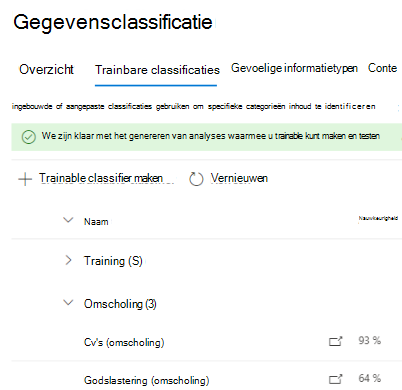
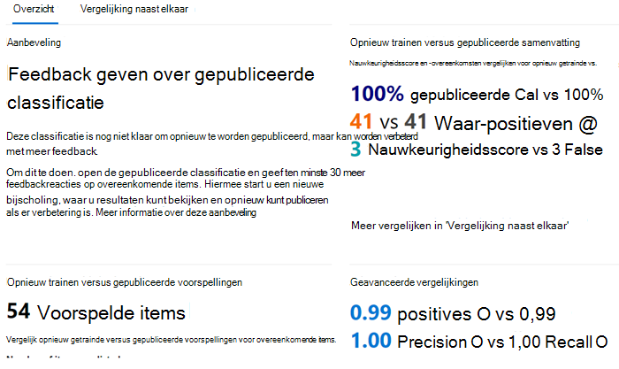

# Een classificatie opnieuw trainen voor de inhoudsverkennerHow to retrain a classifier in content explorer

Een Microsoft 365 trainable classifier is een hulpmiddel dat u kunt trainen om verschillende soorten inhoud te herkennen door deze voorbeelden te geven om naar te kijken.A Microsoft 365 trainable classifier is a tool you can train to recognize various types of content by giving it samples to look at. Nadat u bent opgeleid, kunt u het gebruiken om het item te identificeren voor de toepassing van Office gevoeligheidslabels, compliancebeleid voor communicatie en bewaarlabelbeleid.Once trained, you can use it to identify item for application of Office sensitivity labels, communications compliance policies, and retention label policies.

In dit artikel wordt beschreven hoe u de prestaties van aangepaste, trainbare classificaties en sommige vooraf getrainde classificaties kunt verbeteren door hen extra feedback te geven.This article shows you how to improve the performance of custom trainable classifiers and some pre-trained classifiers by providing them additional feedback.

Zie Meer informatie over leerbare classificaties voor meer informatie over de verschillende typen [classificaties.](classifier-learn-about.md)To learn more about the different types of classifiers, see [Learn about trainable classifiers](classifier-learn-about.md).

Bekijk deze video voor een beknopt overzicht van het afstemmen en omscholingsproces.Watch this video for a quick summary of the tuning and retraining process. U moet dit volledige artikel nog steeds lezen voor meer informatie.You'll still need to read this full article to get the details.

 

> [!VIDEO https://www.microsoft.com/videoplayer/embed/RWyGMs]

## MachtigingenPermissions

Toegang tot classificaties in het Microsoft 365 compliancecentrum:To access classifiers in the Microsoft 365 Compliance center:

- de rol van compliancebeheerder of compliancegegevensbeheerder is vereist om een classificatie te trainenthe Compliance admin role or Compliance Data Administrator is required to train a classifier

U hebt accounts met deze machtigingen nodig om classificaties in deze scenario's te kunnen gebruiken:You'll need accounts with these permissions to use classifiers in these scenarios:

- Scenario bewaarlabelbeleid: rollen recordbeheer en bewaarbeheerRetention label policy scenario: Record Management and Retention Management roles 

## Algemene werkstroomOverall workflow

> [!IMPORTANT]
> U geeft feedback in inhoudsverkenner voor het automatisch toepassen van bewaarlabelbeleid op Exchange items en gebruikt de classificatie als voorwaarde.You provide feedback in content explorer for auto-apply retention label policies to Exchange items and uses the classifier as a condition. **Als u geen bewaarbeleid hebt dat automatisch een bewaarlabel op items Exchange en een classificatie als voorwaarde gebruikt, stopt u hier.****If you don't have a retention policy that auto-applies a retention label to Exchange items and      uses a classifier as a condition, stop here.**

Als u uw classificaties gebruikt, kunt u de nauwkeurigheid van de classificaties die ze maken, vergroten.As you use your classifiers, you may want to increase the precision of the classifications that they're making. U doet dit door de kwaliteit te evalueren van de classificaties die zijn gemaakt voor items die zijn geïdentificeerd als een overeenkomst of geen overeenkomst.You do this by evaluating the quality of the classifications made  for items it has identified as being a match or not a match. Nadat u 30 evaluaties voor een classificatie hebt gemaakt, is die feedback nodig en wordt deze automatisch opnieuw opgeleid.After you make 30 evaluations for a classifier it takes that feedback and automatically retrains itself.

Zie Processtroom voor het opnieuw bijscholen van een classificatie voor meer informatie over de algehele werkstroom voor het opnieuw bijscholen van een [classificatie.](classifier-learn-about.md#retraining-classifiers)To understand more about the overall workflow of retraining a classifier, see [Process flow for retraining a classifier](classifier-learn-about.md#retraining-classifiers).

> [!NOTE]
> Een classificatie moet al zijn gepubliceerd en in gebruik zijn voordat deze opnieuw kan worden opgeleid.A classifier must already be published and in use before it can be retrained.

## Een classificatie opnieuw trainen voor de inhoudsverkennerHow to retrain a classifier in content explorer

1. Meld u aan bij Microsoft 365 compliancecentrum met roltoegang voor compliancebeheerders of beveiligingsbeheerders en open Microsoft 365 **compliancecentrum**  >  **Gegevensclassificatie**  >  **Inhoudverkenner.**Sign in to Microsoft 365 compliance center with compliance admin or security admin role access and open **Microsoft 365 compliance center** > **Data classification** > **Content explorer**. 
2. Vouw **trainbare classificaties** uit onder de lijst Filter op labels, infotypen of **categorieën.**Under the **Filter on labels, info types, or categories** list, expand **Trainable classifiers**.

> [!IMPORTANT]
> Het kan maximaal acht dagen duren voordat samengevoegde items worden weergegeven onder de kop met trainbare classificaties.It can take up to eight days for aggregated items to appear under the trainable classifiers heading.

3. Kies de trainbare classificatie die u hebt gebruikt in het beleid voor het automatisch toepassen van bewaarlabels.Choose the trainable classifier you used in you auto-apply retention label policy. Dit is de trainbare classificatie waar u feedback over geeft.This is the trainable classifier you will give feedback on.

> [!NOTE]
> Als een item een vermelding heeft in de kolom **Bewaarlabel,** betekent dit dat het item is geclassificeerd als `match` een .If an item has an entry in the **Retention label** column, it means that the item was classified as a `match`.  Als een item geen vermelding heeft  in de kolom Bewaarlabel, betekent dit dat het is geclassificeerd als `close match` een .If an item doesn't have an entry in the **Retention label** column, it means it was classified as a `close match`. U kunt de precisie van de classificatie het meest verbeteren door feedback te geven over `close match` items.You can improve the classifier precision the most by providing feedback on `close match` items. 

4. Kies een item en open het.Choose an item and open it.
 
 > [!TIP]
> U kunt feedback geven over meerdere items tegelijk door ze allemaal te kiezen en vervolgens Classificatie **verbeteren** op de opdrachtbalk te kiezen.You can provide feedback on multiple items simultaneously by choosing them all and then choosing **Improve classification** in the command bar.

5. Kies **Feedback geven.**Choose **Provide feedback**.
6. Als het **item een echt positief** item is, kiest u in het deelvenster Gedetailleerde feedback de optie **Overeenkomen.**In the **Detailed feedback** pane, if the item is a true positive, choose, **Match**.  Als het item een onwaar positief item is, dat wil zeggen dat het ten onrechte is opgenomen in de categorie, kiest u **Geen overeenkomst.**If the item is a false positive, that is it was incorrectly included in the category, choose **Not a match**.
7. Als er een andere classificatie is die geschikter is voor het item, kunt u dit kiezen in de lijst Andere **trainbare classificaties** voorstellen.If there is another classifier that would be more appropriate for the item, you can choose it from the **Suggest other trainable classifiers** list. Hiermee wordt de andere classifier triggerd om het item te evalueren.This will trigger the other classifier to evaluate the item.
8. Kies **Feedback verzenden** om uw evaluatie van de classificaties te verzenden en andere `match` `not a match` trainbare classificaties voor te stellen.Choose **Send feedback** to send your evaluation of the `match`, `not a match` classifications and suggest other trainable classifiers. Wanneer u 30 exemplaren van feedback hebt gegeven aan een classificatie, wordt deze automatisch opnieuw opgeleid.When you've provided 30 instances of feedback to a classifier, it will automatically  retrain. Omscholing kan één tot vier uur duren.Retraining can take from one to four hours. Classificaties kunnen slechts twee keer per dag opnieuw worden opgeleid.Classifiers can only be retrained twice per day.

> [!IMPORTANT]
> Deze informatie gaat naar de classificatie in uw tenant, **deze gaat niet terug naar Microsoft.**This information goes to the classifier in your tenant, **it does not go back to Microsoft**.

9. Open **Trainable classifiers**.Open **Trainable classifiers**.
10. De classificatie die is gebruikt in het compliancebeleid voor communicatie wordt weergegeven onder de **kop Opnieuw trainen.**The classifier that was used in your Communications compliance policy will appear under the **Re-training** heading.

11. Nadat de omscholing is voltooid, kiest u de classificatie om het overzicht van de omscholing te openen.Once retraining completes, choose the classifier to open the retraining overview.

12. Bekijk de aanbevolen actie en de voorspellingsvergelijkingen van de opnieuw getrainde en momenteel gepubliceerde versies van de classificatie.Review the recommended action, and the prediction comparisons of the retrained and currently published versions of the classifier.
13. Als u tevreden bent over de resultaten van de omscholing, kiest u **Opnieuw publiceren.**If you satisfied with the results of the retraining, choose **Re-publish**.
14. Als u niet tevreden bent over de resultaten van de omscholing, kunt u ervoor kiezen om extra feedback te geven aan de classificatie in de compliance-interface Communicatie en een andere herscholingscyclus te starten of niets te doen in welk geval de momenteel gepubliceerde versie van de classificatie blijft worden gebruikt.If you are not satisfied with the results of the retraining, you can choose to provide additional feedback to the classifier in the Communications compliance interface and start another retraining cycle or do nothing in which case the currently published version of the classifier will continue to be used. 

## Details over het opnieuw publiceren van aanbevelingenDetails on republishing recommendations

Hier vindt u wat informatie over de manier waarop we de aanbeveling formuleren om een omscholingsclassifier opnieuw te publiceren of om verdere omscholing voor te stellen.Here is a little information on how we formulate the recommendation to re-publish a retrained classifier or suggest further retraining. Dit vereist een beetje meer inzicht in de manier waarop trainbare classificaties werken.This requires a little deeper understanding of how trainable classifiers work.

Na een nieuwe training evalueren we de prestaties van de classificatie op zowel de items met feedback als alle items die oorspronkelijk zijn gebruikt om de classificatie te trainen.After a retrain, we evaluate the classifier's performance on both the items with feedback as well as any items originally used to train the classifier. 

- Voor ingebouwde modellen zijn items die worden gebruikt om de classificatie te trainen de items die door Microsoft worden gebruikt om het model te maken.For built-in models, items used to train the classifier are the items used by Microsoft to build the model.
- Voor aangepaste modellen zijn items die in de oorspronkelijke training worden gebruikt, afkomstig van de sites die u hebt toegevoegd voor testen en controleren.For custom models, items used in the original training the classifier are from the sites you had added for test and review.

We vergelijken de prestatienummers voor beide sets items voor de opnieuw omgeoefde en gepubliceerde classificatie om een aanbeveling te geven over de vraag of er verbetering is in het opnieuw publiceren.We compare the performance numbers on both sets of items for the retrained and published classifier to provide a recommendation on whether there was improvement to republish. 

## Zie ookSee also

- [Meer informatie over trainbare classificatiesLearn about trainable classifiers](classifier-learn-about.md)
- [Standaard verkende bestandsnaamextensies en geparseerde bestandstypen in SharePoint ServerDefault crawled file name extensions and parsed file types in SharePoint Server](/sharepoint/technical-reference/default-crawled-file-name-extensions-and-parsed-file-types)