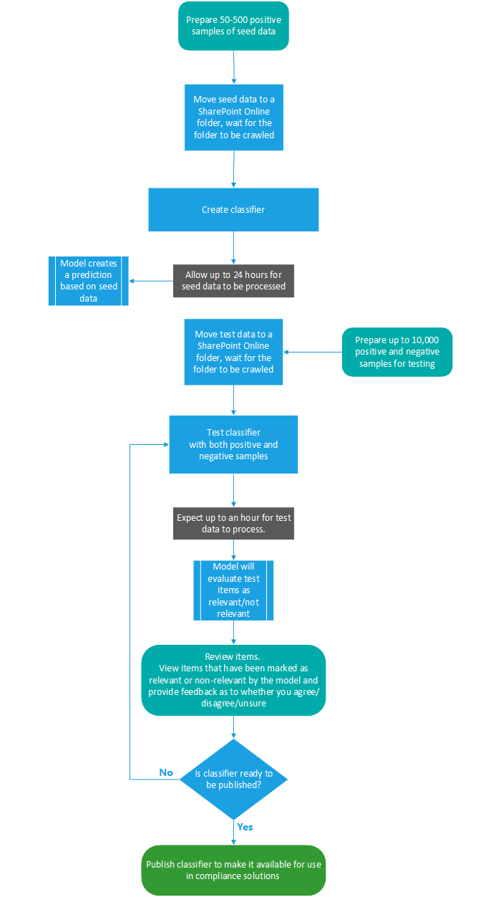

# Meer informatie over trainbare classificatiesLearn about trainable classifiers

Het classificeren en labelen van inhoud, zodat deze op de juiste manier kan worden beveiligd en verwerkt, is de beginplaats voor de informatiebeveiligingsdiscipline.Classifying and labeling content so it can be protected and handled properly is the starting place for the information protection discipline. Microsoft 365 heeft drie manieren om inhoud te classificeren.Microsoft 365 has three ways to classify content.

## HandmatigManually

Voor deze methode zijn menselijke beoordeling en actie vereist.This method requires human judgment and action. Een beheerder kan de bestaande etiketten en gevoelige informatietypen gebruiken of een eigen label maken en vervolgens publiceren.An admin may either use the pre-existing labels and sensitive information types or create their own and then publish them. Gebruikers en beheerders passen deze toe op inhoud wanneer ze deze tegenkomen.Users and admins apply them to content as they encounter it. Vervolgens kunt u de inhoud beveiligen en de positie ervan beheren.You can then protect the content and manage its disposition.

## Automatische patroonmatchingAutomated pattern matching

Deze categorie classificatiemechanismen omvat het vinden van inhoud door:This category of classification mechanisms include finding content by:

- Trefwoorden of metagegevenswaarden (trefwoordquerytaal).Keywords or metadata values (keyword query language).
- Gebruik eerder geïdentificeerde patronen van gevoelige informatie, zoals sociale zekerheid, creditcard- of bankrekeningnummers [(definities van entiteitsdefinities van het type Gevoelige informatie).](sensitive-information-type-entity-definitions.md)Using previously identified patterns of sensitive information like social security, credit card or bank account numbers [(Sensitive information type entity definitions)](sensitive-information-type-entity-definitions.md).
- Een item herkennen omdat het een variatie is op een sjabloon [(afdrukken met documentvinger)](document-fingerprinting.md).Recognizing an item because it's a variation on a template [(document finger printing)](document-fingerprinting.md).
- Gebruik de aanwezigheid van exacte tekenreeksen [(exacte gegevens overeenkomen)](create-custom-sensitive-information-types-with-exact-data-match-based-classification.md).Using the presence of exact strings [(exact data match)](create-custom-sensitive-information-types-with-exact-data-match-based-classification.md).

Gevoeligheids- en bewaarlabels kunnen vervolgens automatisch worden toegepast om de inhoud beschikbaar te maken [voor](dlp-learn-about-dlp.md)gebruik in Meer informatie over preventie van gegevensverlies) en om automatisch de politie voor bewaarlabels toe [te passen.](apply-retention-labels-automatically.md)Sensitivity and retention labels can then be automatically applied to make the content available for use in [Learn about data loss prevention](dlp-learn-about-dlp.md)) and [auto-apply polices for retention labels](apply-retention-labels-automatically.md).

## ClassificatiesClassifiers

Deze classificatiemethode is met name geschikt voor inhoud die niet gemakkelijk kan worden geïdentificeerd met de handmatige of geautomatiseerde methoden voor het koppelen van patronen.This classification method is particularly well suited to content that isn't easily identified by either the manual or automated pattern matching methods. Deze classificatiemethode heeft meer te maken met het trainen van een classificatie om een item te identificeren op basis van wat het item is, niet door elementen in het item (patroonmatching).This method of classification is more about training a classifier to identify an item based on what the item is, not by elements that are in the item (pattern matching). Een classificatie leert hoe u een type inhoud kunt identificeren door honderden voorbeelden te bekijken van de inhoud die u wilt classificeren.A classifier learns how to identify a type of content by looking at hundreds of examples of the content you're interested in classifying. U begint met het geven van voorbeelden die zeker in de categorie staan.You start by feeding it examples that are definitely in the category. Wanneer deze zijn verwerkt, test u deze door een combinatie te maken van zowel overeenkomende als niet-overeenkomende voorbeelden.Once it processes those, you test it by giving it a mix of both matching and non-matching examples. In de classificatie wordt vervolgens voorspeld of een bepaald item in de categorie valt die u maakt.The classifier then makes predictions as to whether any given item falls into the category you're building. Vervolgens bevestigt u de resultaten en sorteert u de waar positieven, waar negatieven, onwaar-positieven en onwaar negatieven om de nauwkeurigheid van de voorspellingen te vergroten.You then confirm its results, sorting out the true positives, true negatives, false positives, and false negatives to help increase the accuracy of its predictions. 

Wanneer u de classificatie publiceert, worden items gesorteerd op locaties zoals SharePoint Online, Exchange en OneDrive en classificeert u de inhoud.When you publish the classifier, it sorts through items in locations like SharePoint Online, Exchange, and OneDrive, and classifies the content. Nadat u de classificatie hebt gepubliceerd, kunt u deze blijven trainen met behulp van een feedbackproces dat lijkt op het eerste trainingsproces.After you publish the classifier, you can continue to train it using a feedback process that is similar to the initial training process.

### Waar u trainbare classificaties kunt gebruikenWhere you can use trainable classifiers
Zowel ingebouwde classificaties als trainbare classificaties zijn beschikbaar als voorwaarde voor [Office autolabeling](apply-sensitivity-label-automatically.md)met gevoeligheidslabels,  automatisch bewaarlabelbeleid toepassen op basis van een voorwaarde en [in](communication-compliance.md)communicatieconditie.Both built-in classifiers and trainable classifiers are available as a condition for [Office autolabeling with sensitivity labels](apply-sensitivity-label-automatically.md), [auto-apply retention label policy based on a condition](apply-retention-labels-automatically.md#configuring-conditions-for-auto-apply-retention-labels) and in [communication compliance](communication-compliance.md). 

Gevoeligheidslabels kunnen classificaties gebruiken als voorwaarden, zie [Een gevoeligheidslabel](apply-sensitivity-label-automatically.md)automatisch toepassen op inhoud.Sensitivity labels can use classifiers as conditions, see [Apply a sensitivity label to content automatically](apply-sensitivity-label-automatically.md).

> [!IMPORTANT]
> Classificaties werken alleen met items die niet zijn versleuteld en in het Engels zijn.Classifiers only work with items that are not encrypted and are in English.

## Typen classificatiesTypes of classifiers

- **vooraf getrainde classificaties:** Microsoft heeft een aantal classificaties gemaakt en vooraf opgeleid die u kunt gebruiken zonder ze te trainen.**pre-trained classifiers** - Microsoft has created and pre-trained a number of classifiers that you can start using without training them. Deze classificaties worden weergegeven met de status `Ready to use` van .These classifiers will appear with the status of `Ready to use`.
- **aangepaste classificaties:** als u classificatiebehoeften hebt die verder gaan dan wat de vooraf getrainde classificaties dekken, kunt u uw eigen classificaties maken en trainen.**custom classifiers** - If you have classification needs that extend beyond what the pre-trained classifiers cover, you can create and train your own classifiers.

### Vooraf getrainde classificatiesPre-trained classifiers

Microsoft 365 wordt geleverd met vijf vooraf getrainde classificaties:Microsoft 365 comes with five pre-trained classifiers:

> [!CAUTION]
> De vooraf getrainde  classificatie voor aanstootgevende taal wordt afgeschaft omdat er een groot aantal fout-positieven is geproduceerd.We are deprecating the **Offensive Language** pre-trained classifier because it has been producing a high number of false positives. Gebruik deze niet en als u het momenteel gebruikt, moet u uw bedrijfsprocessen ervan af zetten.Don't use it and if you are currently using it, you should move your business processes off of it. We raden u **aan** in plaats daarvan de vooraf **getrainde** classificaties Bedreiging, **Godslastering** en Pesterijen te gebruiken.We recommend using the **Threat**, **Profanity**, and **Harassment** pre-trained classifiers instead.

- Cv's: detecteert items die tekstuele accounts zijn van persoonlijke, educatieve, professionele **kwalificaties,** werkervaring en andere persoonlijk identificeerbare gegevens van een sollicitant**Resumes**: detects items that are textual accounts of an applicant's personal, educational, professional qualifications, work experience, and other personally identifying information
- **Broncode:** detecteert items die een reeks instructies en instructies bevatten die zijn geschreven in de 25 meest gebruikte programmeertalen op GitHub**Source Code**: detects items that contain a set of instructions and statements written in the top 25 used computer programming languages on GitHub
    - ActionScriptActionScript
    - CC
    - C #C#
    - C++C++
    - KlaverenClojure
    - CoffeeScriptCoffeeScript
    - GaGo
    - HaskellHaskell
    - JavaJava
    - JavaScriptJavaScript
    - LuaLua
    - MATLABMATLAB
    - Objective-CObjective-C
    - PerlPerl
    - PHPPHP
    - PythonPython
    - RR
    - RubyRuby
    - ScalaScala
    - ShellShell
    - SwiftSwift
    - TexTex
    - Vim-scriptVim Script

> [!NOTE]
> Broncode is opgeleid om te detecteren wanneer het grootste deel van de tekst broncode is.Source Code is trained to detect when the bulk of the text is source code. Er wordt geen broncodetekst gedetecteerd die wordt afgewisseld met tekst zonder tekst.It does not detect source code text that is interspersed with plain text.

- **Pesterijen:** detecteert een specifieke categorie aanstootgevende taaltekstitems met betrekking tot aanstootgevend gedrag dat is gericht op een of meer personen op basis van de volgende kenmerken: ras, etniciteit, religie, nationale origin, geslacht, seksuele oriëntatie, leeftijd, handicap**Harassment**: detects a specific category of offensive language text items related to offensive conduct targeting one or multiple individuals based on the following traits: race, ethnicity, religion, national origin, gender, sexual orientation, age, disability
- **Grof taalgebruik:** detecteert een specifieke categorie aanstootgevende taaltekstitems die expressies bevatten die de meeste mensen voor schut zetten**Profanity**: detects a specific category of offensive language text items that contain expressions that embarrass most people
- **Bedreiging:** detecteert een specifieke categorie aanstootgevende taaltekstitems met betrekking tot bedreigingen voor het plegen van geweld of fysieke schade aan een persoon of eigenschap**Threat**: detects a specific category of offensive language text items related to threats to commit violence or do physical harm or damage to a person or property

Deze worden weergegeven in **het Microsoft 365 weergave**  >  **Gegevensclassificatie**  >  **Trainable classifiers** met de status van `Ready to use` .These appear in the **Microsoft 365 compliance center** > **Data classification** > **Trainable classifiers** view with the status of `Ready to use`.

> [!IMPORTANT]
> Houd er rekening mee dat de aanstootgevende taal, pesterijen, grof taalgebruik en bedreigingsclassifiers alleen werken met doorzoekbare tekst, niet volledig of volledig zijn.Please note that the offensive language, harassment, profanity, and threat classifiers only work with searchable text are not exhaustive or complete.  Bovendien veranderen taal- en culturele standaarden voortdurend en in het licht van deze realiteit behoudt Microsoft zich het recht voor om deze classificaties naar eigen goed inzicht bij te werken.Further, language and cultural standards continually change, and in light of these realities, Microsoft reserves the right to update these classifiers in its discretion. Hoewel de classificaties uw organisatie kunnen helpen bij het controleren van aanstootgevende taal en andere taal die wordt gebruikt, hebben de classificaties geen aandacht voor de gevolgen van een dergelijke taal en zijn ze niet bedoeld om uw organisatie de enige manier te bieden om het gebruik van deze taal te controleren of te beantwoorden.While the classifiers may assist your organization in monitoring offensive and other language used, the classifiers do not address consequences of such language and are not intended to provide your organization's sole means of monitoring or responding to the use of such language. Uw organisatie, en niet Microsoft of haar dochterondernemingen, blijft verantwoordelijk voor alle beslissingen met betrekking tot het bewaken, afdwingen, blokkeren, verwijderen en bewaren van inhoud die is geïdentificeerd door een vooraf getrainde classificatie.Your organization, and not Microsoft or its subsidiaries, remains responsible for all decisions related to monitoring, enforcement, blocking, removal and retention of any content identified by a pre-trained classifier.

### Aangepaste classificatiesCustom classifiers

Wanneer de vooraf getrainde classificaties niet aan uw behoeften voldoen, kunt u uw eigen classificaties maken en trainen.When the pre-trained classifiers don't meet your needs, you can create and train your own classifiers. Er is aanzienlijk meer werk betrokken bij het maken van uw eigen werk, maar ze zijn veel beter afgestemd op de behoeften van uw organisatie.There's significantly more work involved with creating your own, but they'll be much better tailored to your organizations needs. 

U kunt bijvoorbeeld trainbare classificaties maken voor:For example you could create trainable classifiers for:
 
- Juridische documenten , zoals het privilege van een advocatenclient, het sluiten van sets, de werkverklaringLegal documents - such as attorney client privilege, closing sets, statement of work
- Strategische zakelijke documenten: zoals persberichten, fusies en overnames, aanbiedingen, zakelijke of marketingplannen, intellectueel eigendom, octrooien, ontwerpdocumentenStrategic business documents - like press releases, merger and acquisition, deals, business or marketing plans, intellectual property, patents, design docs
- Prijsinformatie: zoals facturen, prijsophalingstekens, werkorders, biedingsdocumentenPricing information - like invoices, price quotes, work orders, bidding documents 
- Financiële informatie, zoals bedrijfsinvesteringen, kwartaal- of jaarresultatenFinancial information - such as organizational investments, quarterly or annual results    

#### Processtroom voor het maken van aangepaste classificatiesProcess flow for creating custom classifiers

Het maken en publiceren van een classificatie voor gebruik in complianceoplossingen, zoals bewaarbeleid en communicatietoezicht, volgt deze stroom.Creating and publishing a classifier for use in compliance solutions, such as retention policies and communication supervision, follows this flow. Zie Een aangepaste classificatie maken voor meer informatie over het maken van een aangepaste, trainbare [classificatie.](classifier-get-started-with.md)For more detail on creating a custom trainable classifier see, [Creating a custom classifier](classifier-get-started-with.md).

### OmscholingsclassifiersRetraining classifiers

U kunt de nauwkeurigheid van alle aangepaste classificaties en sommige vooraf getrainde classificaties verbeteren door hen feedback te geven over de nauwkeurigheid van de classificatie die ze uitvoeren.You can help improve the accuracy of all custom classifiers and some pre-trained classifiers by providing them with feedback on the accuracy of the classification that they perform. Dit wordt omscholing genoemd en volgt deze werkstroom.This is called retraining and follow this workflow.

## Zie ookSee also

- [BewaarlabelsRetention labels](retention.md)
- [Meer informatie over preventie van gegevensverliesLearn about data loss prevention](dlp-learn-about-dlp.md)
- [VertrouwelijkheidslabelsSensitivity labels](sensitivity-labels.md)
- [Definities van entiteiten van het type Gevoelige informatieSensitive information type entity definitions](sensitive-information-type-entity-definitions.md)
- [Afdrukken met documentvingerDocument finger printing](document-fingerprinting.md)
- [Exacte gegevensmatchExact data match](create-custom-sensitive-information-types-with-exact-data-match-based-classification.md)
