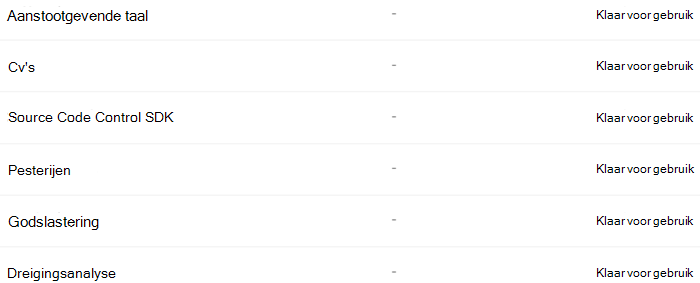

# Meer informatie over trainbare classificaties

Het classificeren en labelen van inhoud, zodat deze op de juiste manier kan worden beveiligd en verwerkt, is de beginplaats voor de informatiebeveiligingsdiscipline. Microsoft 365 heeft drie manieren om inhoud te classificeren.

## Handmatig

Voor deze methode zijn menselijke beoordeling en actie vereist. Een beheerder kan de bestaande etiketten en gevoelige informatietypen gebruiken of een eigen label maken en vervolgens publiceren. Gebruikers en beheerders passen deze toe op inhoud wanneer ze deze tegenkomen. Vervolgens kunt u de inhoud beveiligen en de positie ervan beheren.

## Automatische patroonmatching

Deze categorie classificatiemechanismen omvat het vinden van inhoud door:

- Trefwoorden of metagegevenswaarden (trefwoordquerytaal).
- Gebruik eerder geïdentificeerde patronen van gevoelige informatie, zoals sociale zekerheid, creditcard- of bankrekeningnummers [(definities van entiteitsdefinities van het type Gevoelige informatie).](sensitive-information-type-entity-definitions.md)
- Een item herkennen omdat het een variatie is op een sjabloon [(afdrukken met documentvinger)](document-fingerprinting.md).
- Gebruik de aanwezigheid van exacte tekenreeksen [(exacte gegevens overeenkomen)](create-custom-sensitive-information-types-with-exact-data-match-based-classification.md).

Gevoeligheids- en bewaarlabels kunnen vervolgens automatisch worden toegepast om de inhoud beschikbaar te maken [voor](dlp-learn-about-dlp.md)gebruik in Meer informatie over preventie van gegevensverlies) en om automatisch de politie voor bewaarlabels toe [te passen.](apply-retention-labels-automatically.md)

## Classificaties

Deze classificatiemethode is met name geschikt voor inhoud die niet gemakkelijk kan worden geïdentificeerd met de handmatige of geautomatiseerde methoden voor het koppelen van patronen. Deze classificatiemethode heeft meer te maken met het trainen van een classificatie om een item te identificeren op basis van wat het item is, niet door elementen in het item (patroonmatching). Een classificatie leert hoe u een type inhoud kunt identificeren door honderden voorbeelden te bekijken van de inhoud die u wilt classificeren. U begint met het geven van voorbeelden die zeker in de categorie staan. Wanneer deze zijn verwerkt, test u deze door een combinatie te maken van zowel overeenkomende als niet-overeenkomende voorbeelden. In de classificatie wordt vervolgens voorspeld of een bepaald item in de categorie valt die u maakt. Vervolgens bevestigt u de resultaten en sorteert u de waar positieven, waar negatieven, onwaar-positieven en onwaar negatieven om de nauwkeurigheid van de voorspellingen te vergroten. 

Wanneer u de classificatie publiceert, worden items gesorteerd op locaties zoals SharePoint Online, Exchange en OneDrive en classificeert u de inhoud. Nadat u de classificatie hebt gepubliceerd, kunt u deze blijven trainen met behulp van een feedbackproces dat lijkt op het eerste trainingsproces.

### Waar u trainbare classificaties kunt gebruiken
Zowel ingebouwde classificaties als trainbare classificaties zijn beschikbaar als voorwaarde voor [Office autolabeling](apply-sensitivity-label-automatically.md)met gevoeligheidslabels,  automatisch bewaarlabelbeleid toepassen op basis van een voorwaarde en [in](communication-compliance.md)communicatieconditie. 

Gevoeligheidslabels kunnen classificaties gebruiken als voorwaarden, zie [Een gevoeligheidslabel](apply-sensitivity-label-automatically.md)automatisch toepassen op inhoud.

> [!IMPORTANT]
> Classificaties werken alleen met items die niet zijn versleuteld en in het Engels zijn.

## Typen classificaties

- **vooraf getrainde classificaties:** Microsoft heeft een aantal classificaties gemaakt en vooraf opgeleid die u kunt gebruiken zonder ze te trainen. Deze classificaties worden weergegeven met de status `Ready to use` van .
- **aangepaste classificaties:** als u classificatiebehoeften hebt die verder gaan dan wat de vooraf getrainde classificaties dekken, kunt u uw eigen classificaties maken en trainen.

### Vooraf getrainde classificaties

Microsoft 365 wordt geleverd met vijf vooraf getrainde classificaties:

> [!CAUTION]
> De vooraf getrainde  classificatie voor aanstootgevende taal wordt afgeschaft omdat er een groot aantal fout-positieven is geproduceerd. Gebruik deze niet en als u het momenteel gebruikt, moet u uw bedrijfsprocessen ervan af zetten. We raden u **aan** in plaats daarvan de vooraf **getrainde** classificaties Bedreiging, **Godslastering** en Pesterijen te gebruiken.

- Cv's: detecteert items die tekstuele accounts zijn van persoonlijke, educatieve, professionele **kwalificaties,** werkervaring en andere persoonlijk identificeerbare gegevens van een sollicitant
- **Broncode:** detecteert items die een reeks instructies en instructies bevatten die zijn geschreven in de 25 meest gebruikte programmeertalen op GitHub
    - ActionScript
    - C
    - C #
    - C++
    - Klaveren
    - CoffeeScript
    - Ga
    - Haskell
    - Java
    - JavaScript
    - Lua
    - MATLAB
    - Objective-C
    - Perl
    - PHP
    - Python
    - R
    - Ruby
    - Scala
    - Shell
    - Swift
    - Tex
    - Vim-script

> [!NOTE]
> Broncode is opgeleid om te detecteren wanneer het grootste deel van de tekst broncode is. Er wordt geen broncodetekst gedetecteerd die wordt afgewisseld met tekst zonder tekst.

- **Pesterijen:** detecteert een specifieke categorie aanstootgevende taaltekstitems met betrekking tot aanstootgevend gedrag dat is gericht op een of meer personen op basis van de volgende kenmerken: ras, etniciteit, religie, nationale origin, geslacht, seksuele oriëntatie, leeftijd, handicap
- **Grof taalgebruik:** detecteert een specifieke categorie aanstootgevende taaltekstitems die expressies bevatten die de meeste mensen voor schut zetten
- **Bedreiging:** detecteert een specifieke categorie aanstootgevende taaltekstitems met betrekking tot bedreigingen voor het plegen van geweld of fysieke schade aan een persoon of eigenschap

Deze worden weergegeven in **het Microsoft 365 weergave**  >  **Gegevensclassificatie**  >  **Trainable classifiers** met de status van `Ready to use` .

> [!IMPORTANT]
> Houd er rekening mee dat de aanstootgevende taal, pesterijen, grof taalgebruik en bedreigingsclassifiers alleen werken met doorzoekbare tekst, niet volledig of volledig zijn.  Bovendien veranderen taal- en culturele standaarden voortdurend en in het licht van deze realiteit behoudt Microsoft zich het recht voor om deze classificaties naar eigen goed inzicht bij te werken. Hoewel de classificaties uw organisatie kunnen helpen bij het controleren van aanstootgevende taal en andere taal die wordt gebruikt, hebben de classificaties geen aandacht voor de gevolgen van een dergelijke taal en zijn ze niet bedoeld om uw organisatie de enige manier te bieden om het gebruik van deze taal te controleren of te beantwoorden. Uw organisatie, en niet Microsoft of haar dochterondernemingen, blijft verantwoordelijk voor alle beslissingen met betrekking tot het bewaken, afdwingen, blokkeren, verwijderen en bewaren van inhoud die is geïdentificeerd door een vooraf getrainde classificatie.

### Aangepaste classificaties

Wanneer de vooraf getrainde classificaties niet aan uw behoeften voldoen, kunt u uw eigen classificaties maken en trainen. Er is aanzienlijk meer werk betrokken bij het maken van uw eigen werk, maar ze zijn veel beter afgestemd op de behoeften van uw organisatie. 

U kunt bijvoorbeeld trainbare classificaties maken voor:
 
- Juridische documenten , zoals het privilege van een advocatenclient, het sluiten van sets, de werkverklaring
- Strategische zakelijke documenten: zoals persberichten, fusies en overnames, aanbiedingen, zakelijke of marketingplannen, intellectueel eigendom, octrooien, ontwerpdocumenten
- Prijsinformatie: zoals facturen, prijsophalingstekens, werkorders, biedingsdocumenten 
- Financiële informatie, zoals bedrijfsinvesteringen, kwartaal- of jaarresultaten    

#### Processtroom voor het maken van aangepaste classificaties

Het maken en publiceren van een classificatie voor gebruik in complianceoplossingen, zoals bewaarbeleid en communicatietoezicht, volgt deze stroom. Zie Een aangepaste classificatie maken voor meer informatie over het maken van een aangepaste, trainbare [classificatie.](classifier-get-started-with.md)

### Omscholingsclassifiers

U kunt de nauwkeurigheid van alle aangepaste classificaties en sommige vooraf getrainde classificaties verbeteren door hen feedback te geven over de nauwkeurigheid van de classificatie die ze uitvoeren. Dit wordt omscholing genoemd en volgt deze werkstroom.

## Zie ook

- [Retentielabels](retention.md)
- [Meer informatie over preventie van gegevensverlies](dlp-learn-about-dlp.md)
- [Gevoeligheidslabels](sensitivity-labels.md)
- [Definities van entiteiten van het type vertrouwelijke gegevens](sensitive-information-type-entity-definitions.md)
- [Afdrukken met documentvinger](document-fingerprinting.md)
- [Exacte gegevensmatch](create-custom-sensitive-information-types-with-exact-data-match-based-classification.md)
