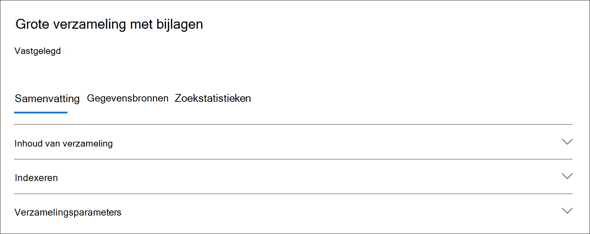

# Statistische gegevens en rapporten verzamelen in Advanced eDiscoveryCollection statistics and reports in Advanced eDiscovery

Nadat u een conceptverzameling hebt gemaakt, kunt u statistieken bekijken over de opgehaalde items, zoals de inhoudslocaties die de meeste items bevatten die overeenkomen met de zoekcriteria en het aantal items dat door de zoekquery wordt geretourneerd.After you create a draft collection, you can view statistics on the retrieved items, such as the content locations that contain the most items that matched the search criteria and the number of items returned by the search query. U kunt ook een voorbeeld van een subset van de resultaten bekijken.You can also preview a subset of the results.

Wanneer u de set documenten hebt geïdentificeerd die u verder wilt onderzoeken, kunt u de zoekresultaten toevoegen aan een revisieset die u wilt verzamelen en verwerken.When you've identified the set of documents you want to further examine, you can add the search results to a review set to collect and process.

## Statistieken en rapporten voor conceptverzamelingenStatistics and reports for draft collections

In deze sectie worden de statistieken beschreven die beschikbaar zijn voor conceptverzamelingen.This section describes the statistics that are available for draft collections. Deze statistieken zijn beschikbaar op het tabblad **Zoekstatistieken** op de flyoutpagina van een conceptverzameling.These statistics are available on the **Search statistics** tab on the flyout page of a draft collection.

### VerzamelingsschattingenCollection estimates

In deze sectie wordt een grafische samenvatting weergegeven van de geschatte items die door de verzameling worden geretourneerd.This section displays a graphical summary of the estimated items returned by the collection. Dit geeft het aantal items aan dat voldoet aan de zoekcriteria van de verzameling.This indicates the number of items that match the search criteria of the collection. Deze informatie geeft een idee van het geschatte aantal items dat door de verzameling wordt geretourneerd.This information gives you an idea about the estimated number of items returned by the collection.

- **Geschatte items per locatie:** het totale aantal geschatte items dat door de verzameling wordt geretourneerd.**Estimated items by locations**: The total number of estimated items returned by the collection. Het specifieke aantal items in postvakken en op sites wordt ook weergegeven.The specific number of items located in mailboxes and located in sites is also displayed.

- **Geschatte locaties met hits:** het totale aantal inhoudslocaties dat items bevat die door de verzameling worden geretourneerd.**Estimated locations with hits**: The total number of content locations that contain items returned by the collection. Het specifieke aantal postvakken en sitelocaties wordt ook weergegeven.The specific number of mailbox and site locations is also displayed.

- **Gegevensvolume per locatie (in MB)**: de totale grootte van alle geschatte items die door de verzameling worden geretourneerd.**Data volume by location (in MB)**: The total size of all estimated items returned by the collection. De specifieke grootte van postvakitems en site-items wordt ook weergegeven.The specific size of mailbox items and site items is also displayed.

### Rapport VoorwaardeCondition report

In deze sectie worden statistieken weergegeven over de zoekquery van de verzameling en het aantal geschatte items dat overeenkomen met verschillende onderdelen van de zoekquery.This section displays statistics about the collection search query and the number of estimated items that matched different parts of the search query. U kunt deze statistieken gebruiken om het aantal items te analyseren dat overeenkomen met elk onderdeel van de zoekquery.You can use these statistics to analyze the number of items that match each component of search query. Hiermee kunt u de zoekcriteria voor de verzameling verfijnen en zo nodig het bereik van de verzameling beperken.This can help you refine the search criteria for the collection and if necessary narrow the scope of the collection.

- **Locatietype:** Het type inhoudslocatie waar de querystatistieken op van toepassing zijn.**Location type**: The type of content location that the query statistics are applicable to. De waarde van **Exchange** geeft een postvaklocatie aan. een waarde van **SharePoint** geeft een sitelocatie aan.The value of **Exchange** indicates a mailbox location; a value of **SharePoint** indicates a site location.

- **Deel**: Het deel van de zoekquery waar de statistieken op van toepassing zijn.**Part**: The part of the search query the statistics are applicable to. **Primair** geeft de hele zoekquery aan.**Primary** indicates the entire search query. **Trefwoord** geeft aan dat de statistieken in de rij voor een specifiek trefwoord zijn.**Keyword** indicates the statistics in the row are for a specific keyword. Als u een trefwoordlijst gebruikt voor de zoekquery in de verzameling, worden statistieken voor elk onderdeel van de query in deze tabel opgenomen.If you use a keyword list when for the search query in the collection, statistics for each component of the query are included in this table.

- **Voorwaarde:** het werkelijke onderdeel (trefwoord of voorwaarde) van de zoekquery die is uitgevoerd voor de conceptverzameling die de statistieken heeft geretourneerd die in de bijbehorende rij worden weergegeven.**Condition**: The actual component (keyword or condition) of the search query that was run for the draft collection that returned the statistics displayed in the corresponding row.

- **Locaties met treffers:** het aantal inhoudslocaties (opgegeven door de kolom Locatietype) die items bevatten die overeenkomen met de primaire query of trefwoordquery in de kolom **Voorwaarde.** **Locations with hits**: The number of the content locations (specified by the **Location type** column) that contain items that match the primary or keyword query listed in the **Condition** column.

- **Items:** Het aantal items (van de opgegeven inhoudslocatie) dat overeenkomen met de query die wordt weergegeven in **de** kolom Voorwaarde.**Items**: The number of items (from the specified content location) that match the query listed in the **Condition** column. Zoals eerder uitgelegd, als een item meerdere exemplaren bevat van een trefwoord dat wordt gezocht, wordt dit slechts eenmaal geteld in deze kolom.As previously explained, if an item contains multiple instances of a keyword that is being searched for, it's only counted once in this column.

- **Grootte (MB)**: De totale grootte van alle items die zijn gevonden (op de opgegeven inhoudslocatie) die overeenkomen met de zoekquery in **de** kolom Voorwaarde.**Size (MB)**: The total size of all items that were found (in the specified content location) that match the search query in the **Condition** column.

### ToplocatiesTop locations

In deze sectie worden statistieken weergegeven over de specifieke inhoudslocaties met de meeste items die door de verzameling worden geretourneerd.This section displays statistics about the specific content locations with the most items returned by the collection.

- De naam van de locatienaam (het e-mailadres van postvakken en de URL voor sites).The name of the location name (the email address of mailboxes and the URL for sites).

- Locatietype (een postvak of site).Location type (a mailbox or site).

- Geschatte hoeveelheid items op de inhoudslocatie die door de verzameling wordt geretourneerd.Estimated number of items in the content location returned by the collection.

- De totale grootte van geschatte items op elke inhoudslocatie.The total size of estimated items in each content location.

## Statistieken en rapporten voor vastgelegde verzamelingenStatistics and reports for committed collections

In deze sectie worden de statistieken beschreven die beschikbaar zijn nadat u een verzameling hebt toegevoegd aan een revisieset, inclusief het werkelijke aantal items dat aan de revisieset is toegevoegd.This section describes the statistics that are available after you commit a collection to a review set, including the actual number of items added to the review set. Deze statistieken (naast gegevens over ladensets) bevatten historische informatie over inhoud die aan een zaak is toegevoegd.These statistics (in addition to load set information) provide historical information about content added to a case.

Nadat u een verzameling hebt toegevoegd aan een revisieset, worden de volgende tabbladen weergegeven op de flyoutpagina van de vastgelegde verbinding.After you commit a collection to a review set, the following tabs are displayed on the flyout page of the committed connection. Elk van deze tabbladen bevat verschillende typen informatie over de verzameling.Each of these tabs contains different types of information about the collection.

### Inhoud van verzamelingCollection contents

Deze sectie van het **tabblad** Samenvatting bevat statistieken en andere informatie over de items die zijn verzameld uit de gegevensbronnen in de verzameling en zijn toegevoegd aan de revisieset.This section of the **Summary** tab contains statistics and other information about the items that were collected from the data sources in the collection and added to the review set.

- **Totaal uitgepakte items**.**Total extracted items**. Het totale aantal items dat is toegevoegd aan de revisieset.The total number of items added to the review set. Dit getal geeft de som aan van bovenliggende items en onderliggende items die aan de revisieset zijn toegevoegd.This number indicates the sum of parent items and child items added to the review set.

  > [!TIP]
  > Plaats de cursor op de bovenliggende of onderliggende itembalken om het totale aantal bovenliggende of onderliggende items weer te geven.Hover the cursor over the parent or child item bars to display the total number of parent or child items.

- **Bovenliggende items**.**Parent items**. Het aantal items dat is geretourneerd door de verzameling die is gebruikt om de items te verzamelen die zijn toegevoegd aan de revisieset.The number of items returned by the collection that was used to collect the items that were added to the review set. Dit getal komt overeen met (en is gelijk aan) het geschatte aantal items dat wordt weergegeven in de sectie **Verzamelingsparameters.**This number corresponds  to (and is equal to) the estimated number of items that is displayed in the **Collection parameters** section. Het aantal bovenliggende items dat hij heeft verzameld om de items te verzamelen die aan de revisieset zijn toegevoegd.The number of parent items he collection information that was used to collect the items that were added to the review set.
 
   Een bovenliggend item kan meerdere onderliggende items bevatten.A parent item might contain multiple child items. Een e-mailbericht is bijvoorbeeld een bovenliggend item als het een bijgevoegd bestand bevat of een cloudbijlage bevat.For example, an email message is a parent item if it contains an attached file or has a cloud attachment. In dit geval worden het bijgevoegde bestand of het doel van de cloudbijlage beschouwd als onderliggende items.In this case, the attached file or the target of the cloud attachment are considered child items. Wanneer u een verzameling begaat, worden bovenliggende items en bijbehorende onderliggende items als afzonderlijke items of bestanden toegevoegd aan de revisieset.When you commit a collection, parent items and any corresponding child items are added to the review set as individual items or files.

- **Onderliggende items**.**Child items**. Het aantal onderliggende items dat is toegevoegd aan de revisieset.The number of child items added to the review set. Onderliggende items zijn bijlagen of andere onderdelen van een bovenliggend item.Child items are attachments or other parts of a parent item. Onderliggende items zijn bijgevoegde bestanden, cloudbijlagen, afbeeldingen en e-mailhandtekeningen.Child items include attached files, cloud attachments, images, and email signatures. Wanneer u een verzameling aan een revisieset verbindt, worden onderliggende items geëxtraheerd, geïndexeerd en toegevoegd aan de revisieset als afzonderlijke bestanden.When you commit a collection to a review set, child items are extracted, indexed, and added to the review set as individual files.

- **Unieke items.****Unique items**. Het aantal unieke items dat is toegevoegd aan de revisieset.The number of unique items added to the review set. Unieke items zijn uniek voor de revisieset.Unique items are unique to the review set. Alle items zijn uniek wanneer de eerste verzameling wordt toegevoegd aan een nieuwe revisieset omdat er geen eerdere items in de revisieset waren.All items are unique when the first collection is added to a new review set because there were no previous items in the review set.

- **Geïdentificeerde dubbele items**.**Identified duplicate items**. Het aantal items uit de verzameling dat niet is toegevoegd aan de revisieset omdat hetzelfde item al bestaat in de revisieset.The number of items from the collection that were not added to the review set because the same item already exists in the review set. Statistieken over dubbele items kunnen helpen bij het verklaren van de verschillen tussen het aantal geschatte items uit een conceptverzameling en het werkelijke aantal items dat aan de revisieset is toegevoegd.Statistics about duplicate items can help explain the differences between the number of estimated items from a draft collection and the actual number of items added to the review set.

### IndexerenIndexing

De **sectie Indexering** op **het** tabblad Overzicht van een vastgelegde revisieset bevat indexeringsgegevens over de items die aan de revisieset zijn toegevoegd.The **Indexing** section on the **Summary** tab of a committed review set contains indexing information about the items added to the review set.

**Nieuwe geïndexeerde items**.**New indexed items**. Het aantal items dat onlangs is geïndexeerd voordat ze aan de revisieset zijn toegevoegd.The number of items that were newly indexed before they were added to the review set. Een voorbeeld van een nieuw geïndexeerd item zijn onderliggende items die worden geëxtraheerd uit een bovenliggend item en vervolgens worden geïndexeerd voordat ze worden toegevoegd aan de revisieset.An example of a newly indexed item are child items that are extracted from a parent item then indexed before they're added to the review set. Items die zich niet bevinden in bewaargegevensbronnen en niet-bewaarder-inhoudslocaties die worden vermeld op het tabblad Gegevensbronnen in de zaak, worden ook geïndexeerd voordat ze aan de revisie worden toegevoegd. Also, items that aren't located in custodial data sources and non-custodial content locations listed on the **Data sources** tab in the case are indexed before they're added to the review. Nieuw geïndexeerde items bevatten bijvoorbeeld items die zijn verzameld op extra locaties.For example, newly indexed items would include items collected from additional locations.

**Bijgewerkte geïndexeerde items**.**Updated indexed items**. Het aantal gedeeltelijk geïndexeerde items dat is geïndexeerd en toegevoegd aan de revisieset.The number of partially indexed items that were successfully indexed and added to the review set. Hierdoor zouden items uit bewaar- en niet-bewaarder-inhoudslocaties gedeeltelijk worden geïndexeerd op het tabblad Gegevensbronnen die met succes zijn geïndexeerd toen de verzameling werd vastgelegd in de revisieset. This would partially indexed items from custodial and non-custodial content locations **Data sources** tab that were successfully indexed when the collection was committed to the review set.

**Indexeringsfouten**.**Indexing errors**. Het aantal gedeeltelijk geïndexeerde items dat niet kon worden geïndexeerd voordat ze aan de revisieset werden toegevoegd.The number of partially indexed items that couldn't be indexed before they were added to the review set. Voor deze items is mogelijk een foutsanering vereist.These items might require error remediation.

### VerzamelingsparametersCollection parameters

In deze sectie worden de verzamelingsgegevens weergegeven die zijn gebruikt om de items te verzamelen die zijn toegevoegd aan de revisieset.This section displays the collection information that was used to collect the items that were added to the review set. Op dit tabblad worden gegevens weergegeven die vergelijkbaar zijn met de informatie op het **tabblad Zoekstatistieken.** In deze sectie vindt u een beknopt overzicht van de zoekquery die door de verzameling wordt gebruikt, de inhoudslocaties die zijn doorzocht en de geschatte verzamelingsresultaten.This tab displays information that is similar to the information on the **Search statistics** tab. This section provides a quick snap shot of the search query used by the collection, the content locations that were searched, and the estimated collection results. Zoals eerder uitgelegd, zou het aantal geschatte items in deze sectie gelijk zijn aan het aantal bovenliggende items dat wordt weergegeven in de sectie **Verzamelingsinhoud.**As previously explained, the number of estimated items in this section would be equal to the number of parent items shown in the **Collection contents** section.

### Tabblad ZoekstatistiekenSearch statistics tab

De statistieken die worden weergegeven op het tabblad **Zoekstatistieken** zijn dezelfde statistieken als de laatste keer dat een conceptverzameling is uitgevoerd.The statistics displayed on the **Search statistics** tab are the same statistics from the last time that a draft collection was run. Dit omvat verzamelingsschattingen, rapport met voorwaarden en toplocaties.This includes collection estimates, condition report, and top locations. Deze gegevens worden bewaard in de conceptverzameling voor historische verwijzingen en kunnen worden vergeleken met de werkelijke verzameling die is vastgelegd in de revisieset.This information is preserved from the draft collection for historical reference, and can be compared to the actual collection that was committed to the review set.

## Verschillen tussen conceptverzamelingsschattingen en de werkelijke vastgelegde verzamelingDifferences between draft collection estimates and the actual committed collection

Wanneer u een conceptverzameling uit te voeren, wordt een schatting weergegeven van het aantal  items (en de totale grootte) dat voldoet aan de verzamelingscriteria op het tabblad Overzicht en in de sectie **Verzamelingsschattingen** van het tabblad Zoekstatistieken.  Nadat u een conceptverzameling hebt toegevoegd aan een revisieset, verschilt het werkelijke aantal items (en de totale grootte) van de revisieset vaak van de schattingen.When you run a draft collection, an estimate of the number of items (and their total size) that meet the collection criteria is displayed on the **Summary** tab and in **Collection estimates** section of the **Search statistics** tab. After you commit a draft collection to a review set, the actual number of items (and their total size) added the review set are often different from the estimates. In de meeste gevallen worden er meer items aan de revisieset toegevoegd dan uit de conceptverzameling is geraamd.In most cases, more items are added to the review set than were estimated from the draft collection. In de volgende lijst worden de meest voorkomende redenen voor deze verschillen en tips voor het identificeren van deze verschillen beschreven:The following list describes the most common reasons for these differences and tips for identifying them:

- **Onderliggende items**.**Child items**. Onderliggende items die worden geëxtraheerd uit de bovenliggende items en als afzonderlijke bestanden worden toegevoegd.Child items that are extracted from their parent items and added as individual files. Het aantal onderliggende items kan het aantal items dat daadwerkelijk aan de revisieset wordt toegevoegd aanzienlijk verhogen.The number of child items may significantly increase the number of items that are actually added to the review set. In het algemeen moet het aantal  bovenliggende items  dat is geïdentificeerd in de sectie Verzamelingsinhoud op het tabblad Overzicht van een vastgelegde verzameling, gelijk zijn aan het aantal geschatte items uit de conceptverzameling.In general, the number of parent items identified in the **Collection contents** section on the **Summary** tab of a committed collection should be equal to the number of estimated items from the draft collection.

- **Dubbele items**.**Duplicate items**. Items uit de conceptverzameling die al zijn toegevoegd aan de revisieset in een vorige verzameling, worden niet toegevoegd.Items from the draft collection that have already been added to the review set in a previous collection won't be added. Zoals eerder uitgelegd, wordt het aantal dubbele items in de verzameling weergegeven in de sectie **Verzamelingsinhoud** op het **tabblad** Overzicht.As previously explained, the number of duplicate items in the collection is displayed in the **Collection contents** section on the **Summary** tab.

- **Opties voor verzamelingsconfiguratie**.**Collection configuration options**. Wanneer u een conceptverzameling verbindt aan een revisieset, moet u de optie gebruiken om gespreksthreads, cloudbijlagen en documentversies op te nemen.When you commit a draft collection to a review set, you have to option to include conversation threads, cloud attachments, and document versions. Alle items die aan de revisieset worden toegevoegd, worden niet opgenomen in de schattingen van de conceptverzameling.Any of these items that are added to the review set aren't included in the estimates of the draft collection. Ze worden alleen geïdentificeerd en verzameld wanneer u de verzameling begaat.They are identified and collected only when you commit the collection. Als u deze opties selecteert, wordt het aantal items dat aan de revisieset is toegevoegd waarschijnlijk groter.Selecting these options will most likely increase the number of items added to the review set. 

    Zo worden meerdere versies van SharePoint documenten niet opgenomen in de schatting voor de conceptverzameling.For example, multiple versions of SharePoint documents aren't included in the estimate for the draft collection. Maar als u de optie selecteert om alle documentversies op te nemen wanneer u de zoekresultaten exporteert, wordt het werkelijke aantal (en de totale grootte) van de items die aan de revisieset zijn toegevoegd, vergroot.But if you select the option to include all document versions when you export the search results, which will increase the actual number (and total size) of items added to the review set. 

    Zie Een conceptverzameling aan een revisieset verbinden voor meer [informatie over deze opties.](commit-draft-collection.md#commit-a-draft-collection-to-a-review-set-in-advanced-ediscovery)For more information about these options, see [Commit a draft collection to a review set](commit-draft-collection.md#commit-a-draft-collection-to-a-review-set-in-advanced-ediscovery). 

Hier zijn andere redenen waarom de geschatte resultaten van een conceptverzameling kunnen verschillen van de werkelijke vastgelegde resultaten.Here are other reasons why the estimated results from a draft collection can be different that the actual committed results.

- **De manier waarop resultaten worden geschat voor conceptverzamelingen.****The way results are estimated for draft collections**. Een schatting van de zoekresultaten die door een conceptverzameling worden geretourneerd, is alleen dat, een schatting (en niet een werkelijke telling) van de items die voldoen aan de criteria voor de verzamelingsquery.An estimate of the search results returned by a draft collection is just that, an estimate (and not an actual count) of the items that meet the collection query criteria. Als u de schatting van e-mailitems wilt compileren, wordt een lijst met de bericht-ed's die voldoen aan de zoekcriteria, aangevraagd in de Exchange database.To compile the estimate of email items, a list of the message IDs that meet the search criteria is requested from the Exchange database. Maar wanneer u de verzameling aan een revisieset verbindt, wordt de verzameling opnieuw gebruikt en worden de werkelijke berichten opgehaald uit de Exchange database.But when you commit the collection to a review set, the collection is rerun and the actual messages are retrieved from the Exchange database. Verschillen kunnen dus het gevolg zijn van de manier waarop het geschatte aantal items en het werkelijke aantal items worden bepaald.So differences might result because of how the estimated number of items and the actual number of items are determined.

- **Wijzigingen die plaatsvinden tussen het tijdstip waarop conceptverzamelingen worden** ge schat en gemaakt.**Changes that happen between the time when estimating and committing draft collections**. Wanneer u een conceptverzameling verbindt aan een revisieset, wordt de zoekopdracht opnieuw gestart om de meest recente items in de zoekindex te verzamelen die voldoen aan de zoekcriteria.When you commit a draft collection to a review set, the search is rerun to collect that most recent items in the search index that meet the search criteria. Het is mogelijk dat er extra items zijn gemaakt, verzonden of verwijderd die voldoen aan de zoekcriteria in de periode tussen de laatste keer dat de conceptverzameling is uitgevoerd en wanneer de conceptverzameling is vastgelegd in een revisieset.It's possible that additional items were created, sent, or deleted that meet the search criteria in the time between when the draft collection was last run and when the draft collection is committed to a review set. Het is ook mogelijk dat items die in de zoekindex stonden toen de resultaten van de conceptverzameling werden geschat, er niet meer zijn omdat ze uit een gegevensbron zijn verwijderd voordat de verzameling werd gemaakt.It's also possible that items that were in the search index when the draft collection results were estimated are no longer there because they were purged from a data source before committing the collection. U kunt dit probleem onder andere beperken door een datumbereik voor een verzameling op te geven.One way to mitigate this issue is to specify a date range for a collection. Een andere manier is om inhoudslocaties in de wacht te zetten, zodat items behouden blijven en niet kunnen worden verwijderd.Another way is to place a hold on content locations so that items are preserved and can't be purged.

- **Niet-geïndexeerde items**.**Unindexed items**. Als de conceptverzameling alle Exchange-postvakken of alle SharePoint-sites bevat, worden alleen niet-geïndexeerde items van inhoudslocaties die items bevatten die voldoen aan de verzamelingscriteria, toegevoegd aan de revisieset.If the draft collection included searching all Exchange mailboxes or all SharePoint sites, then only unindexed items from content locations that contain items that match the collection criteria will be added to the review set. Met andere woorden: als er geen resultaten worden gevonden in een postvak of site, worden niet-geïndexeerde items in dat postvak of de site niet toegevoegd aan de revisieset.In other words, if no results are found in a mailbox or site, then any unindexed items in that mailbox or site won't be added to the review set. Niet-geïndexeerde items van alle inhoudslocaties (zelfs items die niet overeenkomen met de verzamelingsquery) worden echter opgenomen in de geschatte verzamelingsresultaten.However, unindexed items from all content locations (even those that don't contain items that match the collection query) will be included in the estimated collection results.

    Als de conceptverzameling ook specifieke inhoudslocaties bevat (wat betekent dat specifieke  postvakken of sites die zijn opgegeven op de pagina Extra locaties in de wizard conceptverzameling), worden niet-geïndexeerde items (die niet worden uitgesloten door de verzamelingscriteria) van de inhoudslocaties die in de zoekopdracht zijn opgegeven, geëxporteerd.Alternatively, if the draft collection included specific content locations (which means that specific mailboxes or sites where specified on the **Additional locations** page in the draft collection wizard), then unindexed items (that aren't excluded by the collection criteria) from the content locations specified in the search will be exported. In dit geval moeten het geschatte aantal niet-geïndexeerde items en het aantal niet-geïndexeerde items dat aan de revisieset worden toegevoegd, hetzelfde zijn.In this case, the estimated number of unindexed items and the number of unindexed items that are added to the review set should be the same.
