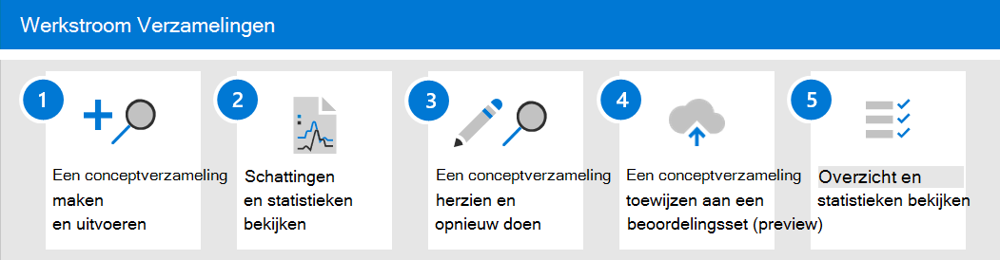

# Meer informatie over verzamelingen in Advanced eDiscoveryLearn about collections in Advanced eDiscovery

> [!NOTE]
> We zijn een nieuwe verzamelingenervaring aan het Advanced eDiscovery, die in dit artikel wordt beschreven.We're rolling out a new collections experience in Advanced eDiscovery, which is described in this article. Deze implementatie duurt een aantal weken voordat deze beschikbaar is voor alle organisaties.This rollout will take a number of weeks before it's available to all organizations. Als de nieuwe verzamelingen niet beschikbaar zijn in uw organisatie, kunt u nog steeds hoofdinhoud verzamelen met het [Advanced eDiscovery zoekprogramma.](create-search-to-collect-data.md)If the new collections experience isn't available in your organization, you can still collect case content with the [Advanced eDiscovery search tool](create-search-to-collect-data.md).

Wanneer organisaties geconfronteerd worden met het verzamelen van de communicatie en inhoud die relevant kan zijn voor een onderzoek of potentiële rechtszaken, staan ze onder de beste omstandigheden voor een aanzienlijke uitdaging.When organizations are faced with gathering the communications and content that may be relevant to an investigation or potential litigation, they face a significant challenge under the best of circumstances. In de moderne werkplek van vandaag zorgt het volume, de verscheidenheid en de snelheid van inhoud voor innovatie en extern werk, terwijl ook de vereisten en het proces voor het beheren van verzamelingen voor eDiscovery-onderzoeken worden uitgebreid.In today’s modern workplace, the volume, variety, and velocity of content is enabling innovation and remote work, while also expanding the requirements and process for managing collections for eDiscovery investigations.

De verzamelingswerkstroom stelt aanzienlijke technische uitdagingen voor het ophalen van inhoud uit eigen locaties en bronnen.The collection workflow poses significant technical challenges around extracting content from native locations and sources. Het is ook een kritiek punt in de beoordeling en strategie voor veelvoorkomende scenario's voor rechtszaken of onderzoeken.It's also a critical point in the assessment and strategy for common litigation or investigations scenarios. Wanneer organisaties een onderzoek beginnen te beoordelen, zijn de eerste vragen die worden gesteld, wie erbij betrokken was?As organizations begin to assess an investigation, the first questions asked are who was involved? Na het identificeren van wie er betrokken was, kunnen deze bewaarders snel in de wacht worden geplaatst om relevante inhoud te behouden.After identifying who was involved, these custodians can quickly be placed on hold to preserve relevant content. De volgende vraag is wat er is gebeurd?The next question is what took place? Om deze tweede fundamentele vraag van een onderzoek te beantwoorden, moeten managers zich tot de gegevens keren.To answer this second fundamental question of any investigation, managers must turn to the data. Als u snel de meest relevante inhoud wilt beoordelen voor de vraag wat er heeft plaatsgevonden, beginnen managers het doel van de vraag te verfijnen om ervoor te zorgen dat de verzamelingsresultaten uitgebreid zijn zonder dat ze te breed zijn.To quickly assess the most relevant content to the question of what took place, managers start to refine the target of the question to ensure that the collection results are comprehensive without being too broad.

Verzamelingen in Advanced eDiscovery eDiscovery-beheerders kunnen snel zoeken naar inhoud via e-mail, documenten en andere inhoud in Microsoft 365.Collections in Advanced eDiscovery help eDiscovery managers quickly scope a search for content across email, documents, and other content in Microsoft 365. Verzamelingen geven managers een schatting van de inhoud die relevant kan zijn voor de zaak.Collections provide managers with an estimate of the content that may be relevant to the case. Hierdoor kunnen managers snelle, weloverwogen beslissingen nemen over de grootte en het bereik van inhoud die relevant is voor een zaak.This allows managers to make quick, informed decisions about the size and scope of content relevant to a case. eDiscovery-beheerders kunnen een verzameling maken voor het zoeken naar bewaargegevensbronnen (zoals postvakken en SharePoint-sites) en door specifieke zoekcriteria (zoals trefwoorden en datumbereiken) te gebruiken om snel het bereik van de verzameling te definiëren.eDiscovery managers can create a collection to search custodial data sources (such as mailboxes and SharePoint sites) and by using specific search criteria (such as keywords and date ranges) to quickly define the scope of their collection.

Nadat de verzameling is gedefinieerd, kunnen eDiscovery-managers de verzameling opslaan als concept en schattingen krijgen, inclusief schattingen voor het gegevensvolume, de inhoudslocaties die resultaten bevatten en het aantal treffers voor de zoekqueryvoorwaarde.After the collection is defined, eDiscovery managers can save the collection as a draft and get estimates, including estimates for data volume, the content locations that contain results, and the number of hits for search query condition. Deze inzichten kunnen helpen om te informeren of de verzameling moet worden gewijzigd om het bereik van de verzameling te beperken of uit te breiden voordat u de revisiefasen in de eDiscovery-werkstroom gaat bekijken en analyseren.These insights can help to inform if the collection should be revised to narrow or expand the scope of the collection before moving on the review and analyze stages in the eDiscovery workflow.

Wanneer de manager tevreden is over het bereik van de verzameling en de geschatte hoeveelheid  inhoud die waarschijnlijk reageert, kan de manager de inhoud toevoegen of aan een revisieset verbinden.When the manager is satisfied with the scope of the collection and the estimated amount of content that's likely to be responsive, the manager can add or *commit* the content to a review set. Wanneer u een verzameling aan een revisieset verbindt, beschikt deze manager ook over de opties voor het opnemen van chatgesprekken, cloudbijlagen en documentversies.When committing a collection to a review set, that manager also has the options to include chat conversations, cloud attachments, and document versions. De inhoud in de verzameling gaat ook door een ander niveau van verwerking tijdens de opname in de revisieset.The content in the collection also goes through another level of processing during ingestion into the review set. en de verzameling wordt bijgewerkt met het uiteindelijke overzicht van de verzameling.and the collection will be updated with the final collection summary. Nadat inhoud is toegevoegd aan de revisieset, kunnen eDiscovery-managers de inhoud blijven opvragen, groeperen en verfijnen om te helpen bij het minimaliseren en controleren.After content is added to the review set, eDiscovery managers can continue to query, group, and refine the content in to help with minimization and review. Daarnaast wordt de verzameling bijgewerkt met informatie en statistieken over de inhoud die is vastgelegd in de revisieset.Additionally, the collection is updated with information and statistics about the content committed to the review set. Dit biedt een historische verwijzing naar de inhoud in de verzameling.This provides a historical reference about the content in the collection.

Met de release van verzamelingen in  een Advanced eDiscovery is de naam van het tabblad Zoekopdrachten gewijzigd **in** Verzamelingen in een Advanced eDiscovery geval in het Microsoft 365 compliancecentrum.With the release of collections in an Advanced eDiscovery, the **Searches** tab has been renamed to **Collections** in an Advanced eDiscovery case in the Microsoft 365 compliance center. De stappen voor het definiëren van het bereik en de grootte van de verzameling volgen hetzelfde proces als zoeken om locaties en voorwaarden te definiëren.The steps to define the scope and size of the collection follow the same process as search to define locations and conditions. Als concept opslaan en een voorbeeldschatting ophalen, kunt u snel het doelbereik van verzamelingen valideren voordat u een volledige zoekopdracht en verzameling in de revisieset maakt.Save as draft and get preview estimates enables quick validation of targeted scope of collections prior to committing a full search and collection into the review set. Hierdoor kunt u het taakbeheer verbeteren en gerichte iteraties gebruiken om inhoud tijdens het zoek- en verzamelingsproces te minimaliseren.This enables improved job management, and targeted iterations for starting to minimize content during the search and collection process.

## Werkstroom VerzamelingenCollections workflow

Als u aan de slag wilt met verzamelingen in Advanced eDiscovery, volgen hier een basiswerkstroom en beschrijvingen van elke stap in het proces.To get started using collections in Advanced eDiscovery, here's a basic workflow and descriptions of each step in the process.

1. **Een conceptverzameling maken en uitvoeren.****Create and run a draft collection**. De eerste stap is het maken van een conceptverzameling en het definiëren van de bewaarder- en niet-bewaardergegevensbronnen om te zoeken.The first step is to create a draft collection and define the custodial and non-custodial data sources to search. U kunt ook zoeken in andere gegevensbronnen die niet aan de zaak zijn toegevoegd.You can also search other data sources that haven't been added to the case. Nadat u de gegevensbronnen hebt toevoegen, configureert u de zoekquery om in de gegevensbronnen te zoeken naar inhoud die relevant is voor de zaak.After you add the data sources, you configure the search query to search the data sources for content relevant to the case. U kunt trefwoorden, eigenschappen en voorwaarden gebruiken om zoekquery's te maken die inhoud retourneren die waarschijnlijk het meest relevant is voor de zaak.You can keywords, properties, and conditions to build search queries that return content that's likely most relevant to the case. Zie Een conceptverzameling [maken voor meer informatie.](create-draft-collection.md)For more information, see [Create a draft collection](create-draft-collection.md).

2. **Bekijk schattingen en statistieken.****Review estimates and statistics**. Nadat u een conceptverzameling hebt opgesteld en deze hebt uitgevoerd, is de volgende stap het weergeven van verzamelingsstatistieken om te controleren of relevante inhoud wordt gevonden en de inhoudslocaties met de meeste treffers.After you create a draft collection and run it, the next step is to view collection statistics to help you verify whether relevant content is being found and the content locations with the most hits. U kunt ook een voorbeeld van de zoekresultaten bekijken om verder te bepalen of de inhoud binnen het bereik van uw onderzoek valt.You can also preview a sample of the search results to further help you determine if the content is within scope of your investigation. Zie Statistieken en rapporten voor [conceptverzamelingen voor meer informatie.](collection-statistics-reports.md#statistics-and-reports-for-draft-collections)For more information, see [Statistics and reports for draft collections](collection-statistics-reports.md#statistics-and-reports-for-draft-collections).

3. **Een conceptverzameling** herzien en opnieuw doen.**Revise and rerun a draft collection**. Op basis van de schattingen en statistieken die door de verzameling worden geretourneerd, kunt u de conceptverzameling bewerken door de gezochte gegevensbronnen en de zoekquery te wijzigen om de verzameling uit te vouwen of te beperken.Based on the estimates and statistics returned by the collection, you can edit the draft collection by changing the data sources that are searched and the search query to expand or narrow the collection. U kunt de conceptverzameling bijwerken en opnieuw gebruiken totdat u zeker weet dat de verzameling de inhoud bevat die het meest relevant is voor uw zaak.You can update and rerun the draft collection until you're confident that collection contains the content that's most relevant to your case.

4. **Een conceptverzameling aan een revisieset verbinden.****Commit a draft collection to a review set**. Wanneer u tevreden bent dat de verzameling de inhoud retourneert die relevant is voor de zaak, kunt u de verzameling aan de revisieset verbinden.When you're satisfied that the collection returns the type content that is relevant to the case, you can commit the collection to the review set. Wanneer u een verzameling begaat, kunt u gespreksthreads, cloudbijlagen en documentversies toevoegen aan de revisieset, die allemaal relevant kunnen zijn voor de zaak.When you commit a collection, you have the option to add conversation threads, cloud attachments, and document versions to the review set, all of which might be relevant to the case. De volgende dingen gebeuren wanneer u een verzameling begaat:The following things happen when you commit a collection:

   - Onderliggende items (zoals e-mailbijlagen, e-mailhandtekeningen en afbeeldingen) worden geëxtraheerd uit een bovenliggend item (zoals een e-mailbericht, chatbericht of document), geïndexeerd (in een proces dat deep *indexing* wordt genoemd) en toegevoegd aan de revisieset als afzonderlijke bestanden.Child items (such as email attachments, email signatures, and images) are extracted from a parent item (such as an email message, chat message, or document), indexed (in a process called *deep indexing*), and added to the review set as separate files.

   - Deep indexing wordt uitgevoerd op items die zijn verzameld uit extra gegevensbronnen.Deep indexing is performed on items collected from additional data sources. Deze typen gegevensbronnen zijn andere inhoudslocaties dan de eerder aan de zaak toegevoegde bewaar- en niet-bewaardergegevensbronnen.These types of data sources are content locations other than the custodial and non-custodial data sources previously added to the case.

   Zie Een conceptverzameling aan een revisieset verbinden voor [meer informatie.](commit-draft-collection.md)For more information, see [Commit a draft collection to a review set](commit-draft-collection.md).

5. **Overzicht van verzamelingen en statistieken bekijken.****Review collection summary and statistics**. Nadat u een verzameling hebt toegevoegd aan een revisieset, blijft informatie over de verzameling behouden, zoals statistieken over opgehaalde items, diepe indexering, de zoekquery die voor de verzameling wordt gebruikt en de inhoudslocaties waaruit items zijn verzameld.After you commit a collection to a review set, information about the collection is retained, such as statistics about extracted items, deep indexing, the search query used for the collection, and the content locations that items were collected from. Vastgelegde verzamelingen kunnen ook niet worden bewerkt of opnieuw worden gebruikt.Also, committed collections can't be edited or rerun. U kunt ze alleen kopiëren of verwijderen.You can only copy or delete them. Het bewaren van verzamelingen biedt een historische record van de verzamelde items die zijn toegevoegd aan een revisieset.Preserving collections provides a historical record of the collected items that were added to a review set. Zie Statistieken en rapporten voor vastgelegde [verzamelingen voor meer informatie.](collection-statistics-reports.md#statistics-and-reports-for-committed-collections)For more information, see [Statistics and reports for committed collections](collection-statistics-reports.md#statistics-and-reports-for-committed-collections).
