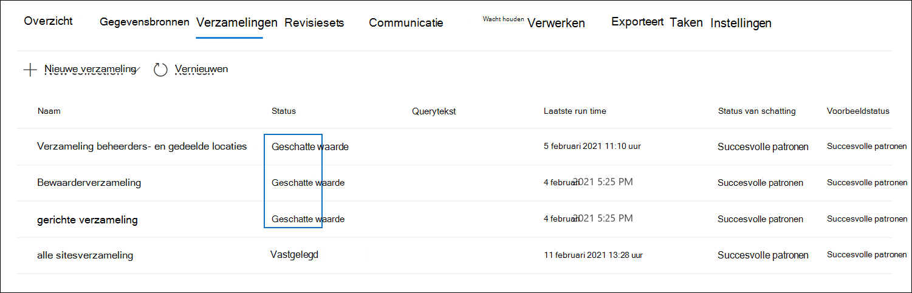

# Een conceptverzameling aan een revisieset in Advanced eDiscoveryCommit a draft collection to a review set in Advanced eDiscovery

Wanneer u tevreden bent over de items die u hebt verzameld in een conceptverzameling en klaar bent om deze te analyseren, te taggen en te controleren, kunt u een verzameling toevoegen aan een revisieset in de zaak.When you're satisfied with the items you've collected in a draft collection and are ready to analyze, tag, and review them, you can add a collection to a review set in the case. Wanneer u een conceptverzameling verbindt aan een revisieset, worden verzamelde items gekopieerd van de oorspronkelijke inhoudslocatie in Microsoft 365 naar een revisieset.When you commit a draft collection to a review set, collected items are copied from their original content location in Microsoft 365 to a review set. Een revisieset is een veilige, door Microsoft verstrekte Azure Storage in de Microsoft-cloud.A review set is a secure, Microsoft-provided Azure Storage location in the Microsoft cloud.

## Een conceptverzameling aan een revisieset verbindenCommit a draft collection to a review set

1. Open in Microsoft 365 compliancecentrum het hoofd- Advanced eDiscovery en selecteer vervolgens  het tabblad Verzamelingen om een lijst met de verzamelingen in de zaak weer te geven.In the Microsoft 365 compliance center, open the Advanced eDiscovery case, and then select the **Collections** tab to display a list of the collections in the case.

   

   > [!TIP]
   > Een waarde `Estimated` van in de kolom **Status** identificeert de conceptverzamelingen die kunnen worden toegevoegd aan een revisieset.A value of `Estimated` in the **Status** column identifies the draft collections that can be added to a review set. Een status van `Committed` geeft aan dat een verzameling al is toegevoegd aan een revisieset.A status of `Committed` indicates that a collection has already been added to a review set.

2. Selecteer op **de** pagina Verzamelingen de conceptverzameling die u wilt verbinden met een revisieset.On the **Collections** page, select the draft collection that you want to commit to a review set.

3. Selecteer onder aan de flyoutpagina de optie **Acties**  >  **bewerken-verzameling.**On the bottom of the flyout page, select **Actions** > **Edit collection**.

4. Klik in de wizard Verzameling bewerken op **Volgende totdat** de pagina Concept **opslaan** of verzamelen wordt weergegeven.In the edit collection wizard, click **Next** until the **Save draft or collect** page is displayed.

5. Configureer de volgende instellingen:Configure the following settings:

   1. Selecteer **Items verzamelen en toevoegen om de revisieset te controleren.**Select **Collect items and add to review set**.

   2. Bepaal of u de verzameling wilt toevoegen aan een nieuwe revisieset (die wordt gemaakt nadat u de verzameling hebt verzenden) of aan een bestaande revisieset.Decide whether to add the collection to a new review set (which is created after you submit the collection) or to an existing review set. Voltooi deze sectie op basis van uw beslissing.Complete this section based on your decision.

   3. De extra verzamelingsinstellingen configureren:Configure the additional collection settings:

       - **Teams en Yammer:** Selecteer deze optie om gespreksthreads toe te voegen aan de verzameling met de chatitems die worden geretourneerd door de zoekquery in de verzameling.**Teams and Yammer messages**: Select this option to add conversation threads to the collection that include the chat items returned by the search query in the collection. Dit betekent dat het chatgesprek met items die voldoen aan de zoekcriteria, wordt gereconstrueerd.This means that the chat conversation that contains items that match the search criteria is reconstructed. Op deze manier kunt u chatitems bekijken in de context van het heen en weer gesprek.This lets you review chat items in the context of the back and forth conversation. Zie [Gespreksthreading in](conversation-review-sets.md)Advanced eDiscovery.For more information, see [Conversation threading in Advanced eDiscovery](conversation-review-sets.md).

       - **Cloudbijlagen:** Selecteer deze optie om moderne bijlagen of gekoppelde bestanden op te nemen wanneer de verzamelingsresultaten aan de revisieset worden toegevoegd.**Cloud attachments**: Select this option to include modern attachments or linked files when the collection results are added to the review set. Dit betekent dat het doelbestand van een moderne bijlage of gekoppeld bestand wordt toegevoegd aan de revisieset.This means that the target file of a modern attachment or linked file is added to the review set.

       - **SharePoint versies:** Selecteer deze optie om de verzameling van alle versies van een SharePoint document in te stellen volgens de versielimieten en zoekparameters van de verzameling.**SharePoint versions**: Select this option to enable the collection of all version of a SharePoint document per the version limits and search parameters of the collection. Als u deze optie selecteert, wordt het aantal items dat aan de revisieset wordt toegevoegd aanzienlijk groter.Selecting this option will significantly increase the size of items that are added to the review set.

   4. Configureer de instellingen om de schaal van de verzameling te definiëren die u wilt toevoegen aan de revisieset:Configure the settings to define the scale of the collection to add to the review set:

      - **Alle verzamelingsresultaten toevoegen:** Selecteer deze optie om alle items die overeenkomen met de zoekcriteria van de verzameling, toe te voegen aan de revisieset.**Add all collection results**: Select this option to add all the items that match the search criteria of the collection to the review set.

      - **Een voorbeeld van de verzamelingsresultaten toevoegen:** Selecteer deze optie om een voorbeeld van de verzamelingsresultaten toe te voegen aan de revisieset in plaats van alle resultaten toe te voegen.**Add a sample of the collection results**: Select this option to add a sample of the collection results to the review set instead of adding all results. Als u deze optie selecteert, klikt u **op Voorbeeldparameters bewerken** en kiest u een van de volgende opties:If you select this option, click **Edit sample parameters** and choose one of the following options:

         - **Voorbeeld op basis van betrouwbaarheid:** Items uit de verzameling worden toegevoegd aan de revisieset en worden bepaald door de statistische parameters die u hebt ingesteld.**Sample based on confidence**: Items from the collection are added to the review set will be determined by the statistical parameters that you set. Als u meestal een betrouwbaarheidsniveau en interval gebruikt bij het steekproefresultaat, geeft u deze op in de vervolgkeuzevakken.If you typically use a confidence level and interval when sampling results, specify them in the drop-down boxes. Gebruik anders de standaardinstellingen.Otherwise, use the default settings.

         - **Willekeurig voorbeeld:** Items uit de verzameling worden toegevoegd aan de revisieset op basis van een willekeurige selectie van het opgegeven percentage van het totale aantal items dat door de zoekopdracht wordt geretourneerd.**Randomly sample**: Items from the collection are added to the review set based on a random selection of the specified percentage of the total number of items returned by the search.

6. Op de **pagina Uw verzameling** controleren kunt u de verzamelingsinstellingen bekijken die u op de vorige pagina hebt geconfigureerd.On the **Review your collection** page, you can review the collection settings that you configured on the previous page. Klik **op Bewerken** als u ze wilt wijzigen.Click **Edit** if you want to change them.

7. Klik **op Verzenden** om de conceptverzameling te maken.Click **Submit** to create the draft collection. Er wordt een pagina weergegeven die bevestigt dat de verzameling is gemaakt.A page is displayed confirming that the collection was created.

## Wat gebeurt er nadat u een conceptverzameling hebt gepleegdWhat happens after you commit a draft collection

Wanneer u een conceptverzameling aan een revisieset verbindt, gebeuren de volgende dingen:When you commit a draft collection to a review set, the following things happen:

- De zoekquery voor verzamelingen wordt opnieuw uitgevoerd.The collection search query is run again. Dit betekent dat de werkelijke zoekresultaten die naar de revisieset zijn gekopieerd, anders kunnen zijn dan de geschatte resultaten die zijn geretourneerd toen de verzamelingszoekactie voor het laatst werd uitgevoerd.This means the actual search results copied to the review set may be different than the estimated results that were returned when the collection search was last run.

- Alle items in de zoekresultaten worden gekopieerd uit de oorspronkelijke gegevensbron in de liveservice en gekopieerd naar een veilige Azure Storage locatie in de Microsoft-cloud.All items in the search results are copied from the original data source in the live service, and copied to a secure Azure Storage location in the Microsoft cloud.

- Alle items (inclusief de inhoud en metagegevens) die zich niet in bewaarder of niet-bewaarder bevinden, worden opnieuw geïndexeerd (in een proces dat deep *indexing* wordt genoemd) zodat alle gegevens in de revisieset volledig kunnen worden doorzocht tijdens de beoordeling van de casegegevens.All items (including the content and metadata) that aren't located in custodian or non-custodian data sources are reindexed (in a process called *deep indexing*) so that all data in the review set is fully searchable during the review of the case data. Het opnieuw indexeren van de inhoud in een verzameling resulteert in grondige en snelle zoekopdrachten wanneer u de inhoud in de revisieset zoekt of filtert tijdens het onderzoek.Reindexing the content in a collection results in thorough and fast searches when you search or filter the content in the review set during the case investigation.

- Versleutelde SharePoint en OneDrive documenten en versleutelde bestanden die zijn gekoppeld aan e-mailberichten die in de zoekresultaten worden geretourneerd, worden ontsleuteld wanneer u de verzameling aan een revisieset verbindt.Encrypted SharePoint and OneDrive documents and encrypted files attached email messages that's returned in the search results are decrypted when you commit the collection to a review set. U kunt de ontsleutelde bestanden in de revisieset controleren en een query uitvoeren.You can review and query the decrypted files in the review set. Zie Ontsleuteling [in Microsoft 365 eDiscovery-hulpprogramma's](ediscovery-decryption.md)voor meer informatie.For more information, see [Decryption in Microsoft 365 eDiscovery tools](ediscovery-decryption.md).

- Ocr-functionaliteit (Optical Character Recognition) haalt tekst op uit afbeeldingen en bevat de afbeeldingstekst met de inhoud die is toegevoegd aan een revisieset.Optical character recognition (OCR) functionality extracts text from images, and includes the image text with the content that's added to a review set. Zie de sectie Optische [tekenherkenning](#optical-character-recognition) in dit artikel voor meer informatie.For more information, see the [Optical character recognition](#optical-character-recognition) section in this article.

- Nadat de commit is voltooid, wordt de waarde van de statuskolom van op **het** tabblad Verzamelingen gewijzigd in `Committed` .After the commit is successfully completed, the value of the status column of on the **Collections** tab is changed to `Committed`.

## Optische tekenherkenningOptical character recognition

Wanneer u een verzameling verbindt aan een revisieset, worden met de ocr-functionaliteit (Optical Character Recognition) in Advanced eDiscovery automatisch tekst uit afbeeldingen geëxtraheert en wordt de afbeeldingstekst met de inhoud toegevoegd aan een revisieset.When you commit a collection to a review set, optical character recognition (OCR) functionality in Advanced eDiscovery automatically extracts text from images, and includes the image text with the content that's added to a review set. U kunt de uitgepakte tekst weergeven in de tekstviewer van het geselecteerde afbeeldingsbestand in de revisieset.You can view the extracted text in the Text viewer of the selected image file in the review set. Op deze manier kunt u tekst in afbeeldingen verder bekijken en analyseren.This lets you conduct further review and analysis on text in images. OCR wordt ondersteund voor losse bestanden, e-mailbijlagen en ingesloten afbeeldingen.OCR is supported for loose files, email attachments, and embedded images. Zie Ondersteunde bestandstypen in Advanced eDiscovery voor een lijst met [afbeeldingsbestandsindelingen](supported-filetypes-ediscovery20.md#image)die worden ondersteund voor OCR.For a list of image file formats that are supported for OCR, see [Supported file types in Advanced eDiscovery](supported-filetypes-ediscovery20.md#image).

U moet OCR-functionaliteit inschakelen voor elk geval dat u maakt in Advanced eDiscovery.You have to enable OCR functionality for each case that you create in Advanced eDiscovery. Zie Zoek- en [analyseinstellingen configureren](configure-search-and-analytics-settings-in-advanced-ediscovery.md#optical-character-recognition-ocr)voor meer informatie.For more information, see [Configure search and analytics settings](configure-search-and-analytics-settings-in-advanced-ediscovery.md#optical-character-recognition-ocr).
