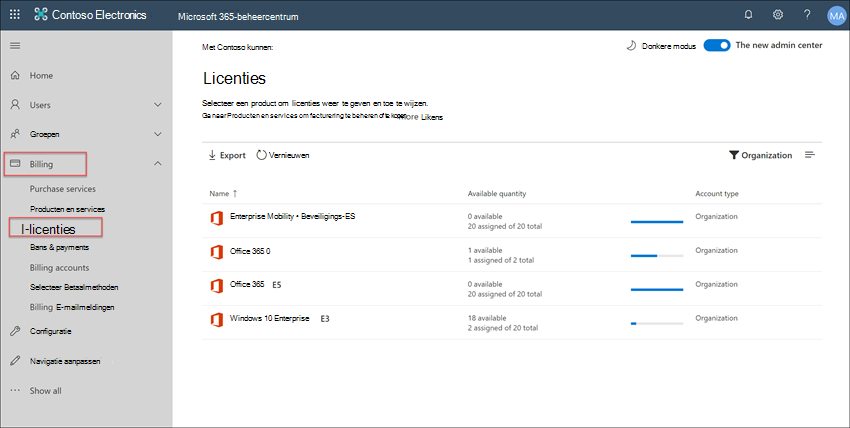
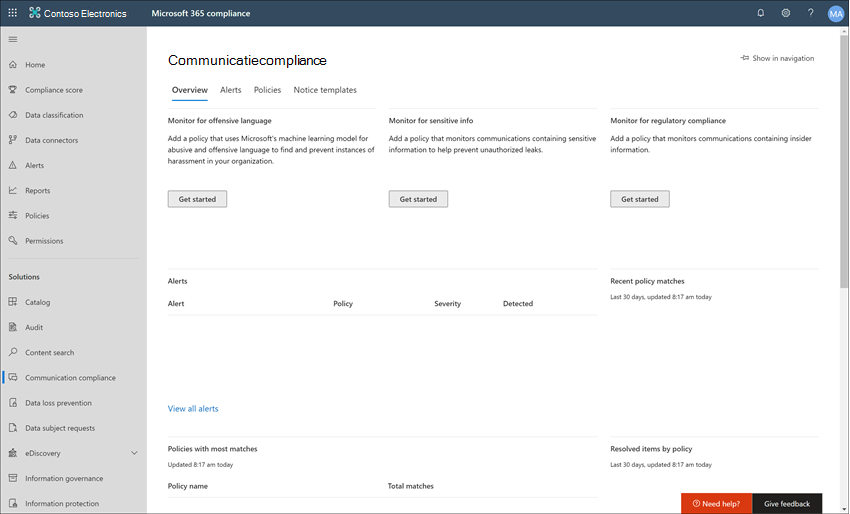
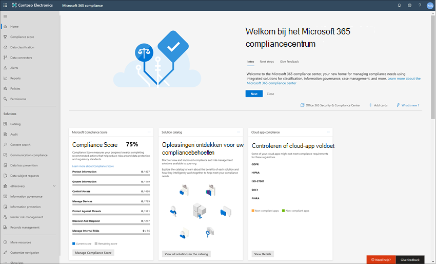
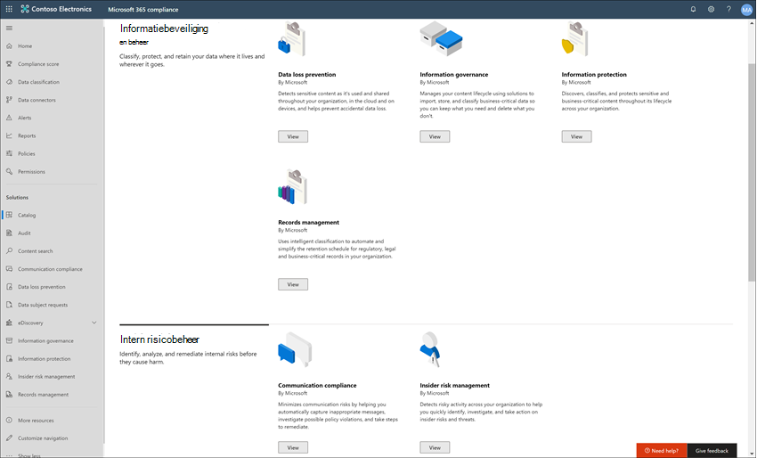
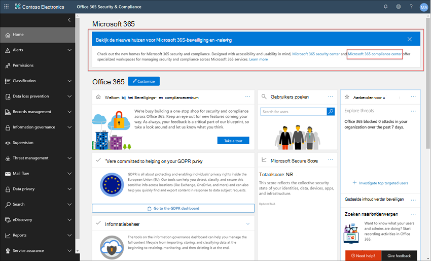
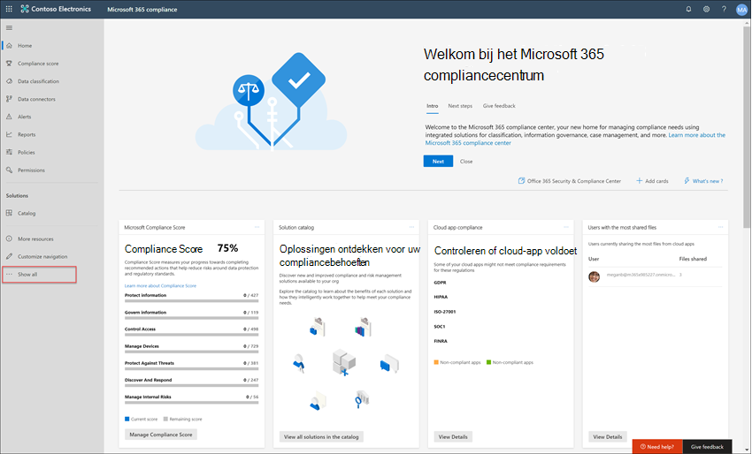

# Case study : Contoso configureert snel een aanstootgevend taalbeleid voor Microsoft Teams, Exchange en Yammer communicatieCase study - Contoso quickly configures an offensive language policy for Microsoft Teams, Exchange, and Yammer communications

Communicatie compliance in Microsoft 365 helpt communicatierisico's te minimaliseren door u te helpen ongepaste berichten in uw organisatie op te sporen, vast te leggen en te handelen.Communication compliance in Microsoft 365 helps minimize communication risks by helping you detect, capture, and act on inappropriate messages in your organization. Met vooraf gedefinieerde en aangepaste beleidsregels kunt u interne en externe communicatie scannen op beleidswedstrijden, zodat deze kunnen worden onderzocht door aangewezen revisoren.Pre-defined and custom policies allow you to scan internal and external communications for policy matches so they can be examined by designated reviewers. Revisoren kunnen gescande e-mail, Microsoft Teams, Yammer of externe communicatie in uw organisatie onderzoeken en passende herstelacties uitvoeren om ervoor te zorgen dat ze voldoen aan de berichtstandaarden van uw organisatie.Reviewers can investigate scanned email, Microsoft Teams, Yammer, or third-party communications in your organization and take appropriate remediation actions to make sure they're compliant with your organization's message standards.

De Contoso Corporation is een fictieve organisatie die snel een beleid moet configureren om te controleren op aanstootgevende taal.The Contoso Corporation is a fictional organization that needs to quickly configure a policy to monitor for offensive language. Ze gebruiken Microsoft 365 voornamelijk voor e-mail, Microsoft Teams en Yammer ondersteuning voor hun gebruikers, maar hebben nieuwe vereisten voor het afdwingen van het bedrijfsbeleid rond pesterijen op het werk.They have been using Microsoft 365 primarily for email, Microsoft Teams, and Yammer support for their users but have new requirements to enforce company policy around workplace harassment. Contoso IT-beheerders en compliancespecialisten hebben een basiskennis van de basisprincipes van het werken met Microsoft 365 en zijn op zoek naar richtlijnen voor end-to-end om snel aan de slag te gaan met communicatie compliance.Contoso IT administrators and compliance specialists have a basic understanding of the fundamentals of working with Microsoft 365 and are looking for end-to-end guidance for how to quickly get started with communication compliance.

In deze casestudie worden de basisbeginselen bestudeert voor het snel configureren van een communicatiebeleid voor het controleren van communicatie op aanstootgevende taal.This case study will cover the basics for quickly configuring a communication compliance policy to monitor communications for offensive language. Deze richtlijnen omvatten:This guidance includes:

- Stap 1 - Planning voor communicatie complianceStep 1 - Planning for communication compliance
- Stap 2 : toegang krijgen tot communicatie compliance in Microsoft 365Step 2 - Accessing communication compliance in Microsoft 365
- Stap 3 : vereisten configureren en een communicatie-compliancebeleid makenStep 3 - Configuring prerequisites and creating a communication compliance policy
- Stap 4 - Waarschuwingen onderzoeken en herstellenStep 4 - Investigation and remediation of alerts

## Stap 1: Planning voor communicatie complianceStep 1: Planning for communication compliance

Contoso IT-beheerders en compliancespecialisten hebben deelgenomen aan online webinars over complianceoplossingen in Microsoft 365 en besloten dat communicatie compliancebeleid hen zal helpen voldoen aan de bijgewerkte bedrijfsbeleidsvereisten voor het verminderen van pesterijen op het werk.Contoso IT administrators and compliance specialists attended online webinars about compliance solutions in Microsoft 365 and decided that communication compliance policies will help them meet the updated corporate policy requirements for reducing workplace harassment. Samen hebben ze een plan ontwikkeld voor het maken en inschakelen van een communicatie-compliancebeleid dat controleert op aanstootgevende taal voor chats die worden verzonden in Microsoft Teams, privéberichten en communitygesprekken in Yammer en in e-mailberichten die worden verzonden in Exchange Online.Working together, they've developed a plan to create and enable a communication compliance policy that will monitor for offensive language for chats sent in Microsoft Teams, private messages and community conversations in Yammer, and in email messages sent in Exchange Online. Hun plan omvat het identificeren van:Their plan includes identifying:

- De IT-beheerders die toegang nodig hebben tot communicatie-compliancefuncties.The IT administrators that need access to communication compliance features.
- De compliancespecialisten die communicatiebeleid moeten maken en beheren.The compliance specialists that need to create and manage communication policies.
- De compliancespecialisten en andere collega's op andere afdelingen (Human Resources, Legal, enz.) die waarschuwingen voor communicatie compliance moeten onderzoeken en corrigeren.The compliance specialists and other colleague in other departments (Human Resources, Legal, etc.) that need to investigate and remediate communication compliance alerts.
- De gebruikers die binnen het bereik van het communicatie compliance-aanstootgevende taalbeleid vallen.The users that will be in-scope for the communication compliance offensive language policy.

### LicentiesLicensing

De eerste stap is om te bevestigen dat de Microsoft 365 contoso ondersteuning biedt voor de oplossing voor communicatie compliance.The first step is to confirm that Contoso's Microsoft 365 licensing includes support for the communication compliance solution. Als u communicatiecond compliance wilt openen en gebruiken, moeten IT-beheerders van Contoso controleren of Contoso een van de volgende opties heeft:To access and use communication compliance, Contoso IT administrators need to verify that Contoso has one of the following:

- Microsoft 365 E5 (betaalde of proefversie)Microsoft 365 E5 subscription (paid or trial version)
- Microsoft 365 E3 +de Microsoft 365 E5 Compliance-invoegvoegvoegingMicrosoft 365 E3 subscription + the Microsoft 365 E5 Compliance add-on
- Microsoft 365 E3 abonnement + de Microsoft 365 E5 Insider Risk Management-invoegvoegvoegingMicrosoft 365 E3 subscription + the Microsoft 365 E5 Insider Risk Management add-on
- Microsoft 365 A5 (betaalde of proefversie)Microsoft 365 A5 subscription (paid or trial version)
- Microsoft 365 A3+de Microsoft 365 A5 compliance-invoegvoegingMicrosoft 365 A3 subscription + the Microsoft 365 A5 Compliance add-on
- Microsoft 365 A3 abonnement + de Microsoft 365 A5 Insider Risk Management-invoegingMicrosoft 365 A3 subscription + the Microsoft 365 A5 Insider Risk Management add-on
- Microsoft 365 G5-abonnement (betaalde versie of proefversie)Microsoft 365 G5 subscription (paid or trial version)
- Microsoft 365 G5-abonnement + de Microsoft 365 G5 Compliance-invoegvoegvoegingMicrosoft 365 G5 subscription + the Microsoft 365 G5 Compliance add-on
- Microsoft 365 G5-abonnement + de Microsoft 365 G5 Insider Risk Management-invoegvoegvoegingMicrosoft 365 G5 subscription + the Microsoft 365 G5 Insider Risk Management add-on
- Office 365 Enterprise E5-abonnement (betaalde of proefversie)Office 365 Enterprise E5 subscription (paid or trial version)
- Office 365 Enterprise E3-abonnement + de Office 365 Advanced Compliance-invoegabonnement (niet meer beschikbaar voor nieuwe abonnementen, zie opmerking)Office 365 Enterprise E3 subscription + the Office 365 Advanced Compliance add-on (no longer available for new subscriptions, see note)

Ze moeten ook bevestigen dat gebruikers die deel uit maken van communicatie-compliancebeleid, een van de bovenstaande licenties moeten krijgen.They must also confirm that users included in communication compliance policies must be assigned one of the licenses above.

> [!IMPORTANT]
> Office 365 Advanced Compliance wordt niet meer als zelfstandig abonnement verkocht.Office 365 Advanced Compliance is no longer sold as a standalone subscription. Wanneer huidige abonnementen verlopen, moeten klanten overstappen op een van de bovenstaande abonnementen, die dezelfde of aanvullende compliancefuncties bevatten.When current subscriptions expire, customers should transition to one of the subscriptions above, which contain the same or additional compliance features.

It-beheerders van Contoso nemen de volgende stappen om de ondersteuning voor licenties voor Contoso te controleren:Contoso IT administrators take the following steps to verify the licensing support for Contoso:

1. IT-beheerders melden zich aan bij **de Microsoft 365-beheercentrum** en navigeren <https://admin.microsoft.com> naar **Microsoft 365-beheercentrum**  >    >  **factureringslicenties.**IT administrators sign in to the **Microsoft 365 admin center** <https://admin.microsoft.com> and navigate to **Microsoft 365 admin center** > **Billing** > **Licenses**.

2. Hier bevestigen ze dat ze een van de licentieopties [hebben](communication-compliance-configure.md#subscriptions-and-licensing) die ondersteuning voor communicatie compliance bevat.Here they confirm that they have one of the [license options](communication-compliance-configure.md#subscriptions-and-licensing) that includes support for communication compliance.

### Machtigingen voor communicatie compliancePermissions for communication compliance

Er zijn vijf rollengroepen die worden gebruikt om machtigingen te configureren voor het beheren van communicatie compliancefuncties.There are five role groups used to configure permissions to manage communication compliance features. Als u **communicatie compliance beschikbaar** wilt maken als menuoptie in Microsoft 365-compliancecentrum en deze configuratiestappen wilt voortzetten, krijgen Contoso-beheerders de rol Communicatie *compliancebeheerder* toegewezen.To make **Communication compliance** available as a menu option in Microsoft 365 compliance center and to continue with these configuration steps, Contoso administrators are assigned the *Communication Compliance Admin* role.

Contoso besluit de  rolgroep Communicatie compliance te gebruiken om alle communicatie compliancebeheerders, analisten, onderzoeker en kijkers toe te wijzen aan de groep.Contoso decides to use the *Communication Compliance* role group assign all the communication compliance administrators, analysts, investigators, and viewers  to the group. Dit maakt het voor Contoso gemakkelijker om snel aan de slag te gaan en het beste aan hun compliancebeheervereisten te voldoen.This makes it easier for Contoso to get started quickly and best fits their compliance management requirements.

|**Rol****Role**|**Rolmachtigingen****Role permissions**|
|:-----|:-----|
| **Naleving van communicatie****Communication Compliance** | Gebruik deze rollengroep om communicatie compliance voor uw organisatie in één groep te beheren.Use this role group to manage communication compliance for your organization in a single group. Door alle gebruikersaccounts toe te voegen voor aangewezen beheerders, analisten, onderzoeker en kijkers, kunt u communicatie compliancemachtigingen configureren in één groep.By adding all user accounts for designated administrators, analysts, investigators, and viewers, you can configure communication compliance permissions in a single group. Deze rollengroep bevat alle machtigingsrollen voor communicatie compliance.This role group contains all the communication compliance permission roles. Deze configuratie is de eenvoudigste manier om snel aan de slag te gaan met communicatie-compliance en is geschikt voor organisaties die geen afzonderlijke machtigingen nodig hebben die zijn gedefinieerd voor afzonderlijke groepen gebruikers.This configuration is the easiest way to quickly get started with communication compliance and is a good fit for organizations that do not need separate permissions defined for separate groups of users. |
| **Communicatie compliancebeheerder****Communication Compliance Admin** | Gebruik deze rollengroep om communicatie compliance in eerste instantie te configureren en later om beheerders van communicatie compliance te scheiden in een gedefinieerde groep.Use this role group to initially configure communication compliance and later to segregate communication compliance administrators into a defined group. Gebruikers die aan deze rollengroep zijn toegewezen, kunnen communicatie compliancebeleid, globale instellingen en toewijzingen voor rollengroepen maken, lezen, bijwerken en verwijderen.Users assigned to this role group can create, read, update, and delete communication compliance policies, global settings, and role group assignments. Gebruikers die aan deze rollengroep zijn toegewezen, kunnen geen berichtwaarschuwingen weergeven.Users assigned to this role group cannot view message alerts. |
| **Communicatie compliance-analist****Communication Compliance Analyst** | Gebruik deze groep om machtigingen toe te wijzen aan gebruikers die fungeren als communicatie-complianceanalisten.Use this group to assign permissions to users that will act as communication compliance analysts. Gebruikers die aan deze rollengroep zijn toegewezen, kunnen beleid weergeven waarin ze zijn toegewezen als revisoren, metagegevens van berichten weergeven (geen berichtinhoud), escaleren naar extra revisoren of meldingen verzenden naar gebruikers.Users assigned to this role group can view policies where they are assigned as Reviewers, view message metadata (not message content), escalate to additional reviewers, or send notifications to users. Analisten kunnen waarschuwingen in behandeling niet oplossen.Analysts cannot resolve pending alerts. |
| **Communicatie compliance-onderzoeker****Communication Compliance Investigator** | Gebruik deze groep om machtigingen toe te wijzen aan gebruikers die fungeren als communicatie compliance-onderzoeker.Use this group to assign permissions to users that will act as communication compliance investigators. Gebruikers die aan deze rollengroep zijn toegewezen, kunnen metagegevens en inhoud van berichten bekijken, escaleren naar extra revisoren, escaleren naar een Advanced eDiscovery-geval, meldingen naar gebruikers verzenden en de waarschuwing oplossen.Users assigned to this role group can view message metadata and content, escalate to additional reviewers, escalate to an Advanced eDiscovery case, send notifications to users, and resolve the alert. |
| **Viewer voor communicatie compliance****Communication Compliance Viewer** | Gebruik deze groep om machtigingen toe te wijzen aan gebruikers die communicatierapporten beheren.Use this group to assign permissions to users that will manage communication reports. Gebruikers die aan deze rollengroep zijn toegewezen, hebben toegang tot alle rapportagewidgets op de startpagina communicatie compliance en kunnen alle communicatie compliancerapporten bekijken.Users assigned to this role group can access all reporting widgets on the communication compliance home page and can view all communication compliance reports. |

1. It-beheerders van Contoso melden zich aan bij de machtigingenpagina **Office 365 beveiligings- & compliancecentrum** [( https://protection.office.com/permissions)](https://protection.office.com/permissions) gebruik referenties voor een globale beheerdersaccount en selecteer de koppeling voor het weergeven en beheren van rollen in Microsoft 365.Contoso IT administrators sign into the **Office 365 Security & Compliance center** permissions page [(https://protection.office.com/permissions)](https://protection.office.com/permissions) using credentials for a global administrator account and select the link to view and manage roles in Microsoft 365.
2. In het **Beveiligings- & Compliancecentrum**  gaan ze naar Machtigingen en selecteren ze de koppeling om rollen in Office 365.In the **Security & Compliance Center**, they go to **Permissions** and select the link to view and manage roles in Office 365.
3. De beheerders selecteren de *rollengroep Communicatie compliance* en selecteren **vervolgens Rollengroep bewerken.**The administrators select the *Communication Compliance* role group, then select **Edit role group**.
4. De beheerders selecteren **Leden kiezen** in het linkernavigatiedeelvenster en selecteer vervolgens **Bewerken.**The administrators select **Choose members** from the left navigation pane, then select **Edit**.
5. Ze selecteren **Toevoegen** en selecteren vervolgens het selectievakje voor alle Contoso-gebruikers die communicatie compliance beheren, onderzoeken en waarschuwingen controleren.They select **Add** and then select the checkbox for all Contoso users that will manage communication compliance, investigate, and review alerts.
6. De beheerders selecteren **Toevoegen** en selecteer vervolgens **Klaar.**The administrators select **Add**, then select **Done**.
7. Ze selecteren **Opslaan om** Contoso-gebruikers toe te voegen aan de rollengroep.They select **Save** to add Contoso users to the role group. Ze selecteren **Sluiten om** de stappen uit te voeren.They select **Close** to complete the steps.

## Stap 2: Toegang krijgen tot communicatie compliance in Microsoft 365Step 2: Accessing communication compliance in Microsoft 365

Na het configureren van de machtigingen voor communicatie compliance, hebben Contoso IT-beheerders en compliancespecialisten die zijn toegewezen aan de rolgroep Communicatie compliance toegang tot de communicatie compliance-oplossing in Microsoft 365.After configuring the permissions for communication compliance, Contoso IT administrators and compliance specialists assigned to the Communication Compliance role group can access the communication compliance solution in Microsoft 365. It-beheerders en compliancespecialisten van Contoso hebben verschillende manieren om toegang te krijgen tot communicatie compliance en aan de slag te gaan met het maken van een nieuw beleid:Contoso IT administrators and compliance specialists have several ways to access communication compliance and get started creating a new policy:

- Rechtstreeks vanuit de oplossing voor communicatie complianceStarting directly from the communication compliance solution
- Vanaf de Microsoft 365-compliancecentrumStarting from the Microsoft 365 compliance center
- Vanaf de catalogus met Microsoft 365-oplossingStarting from the Microsoft 365 solution catalog
- Vanaf de Microsoft 365-beheercentrumStarting from the Microsoft 365 admin center

### Rechtstreeks vanuit de oplossing voor communicatie complianceStarting directly from the communication compliance solution

De snelste manier om toegang te krijgen tot de oplossing is door u rechtstreeks aan te melden bij de **oplossing Communicatie compliance** <https://compliance.microsoft.com/supervisoryreview> ().The quickest way to access the solution is to sign in directly to the **Communication compliance** (<https://compliance.microsoft.com/supervisoryreview>) solution. Via deze koppeling worden IT-beheerders en compliancespecialisten van Contoso doorgestuurd naar het dashboard Overzicht van communicatie compliance, waar u snel de status van waarschuwingen kunt bekijken en nieuwe beleidsregels kunt maken op basis van de vooraf gedefinieerde sjablonen.Using this link, Contoso IT administrators and compliance specialists will be directed to the communication compliance Overview dashboard where you can quickly review the status of alerts and create new policies from the pre-defined templates.

### Vanaf de Microsoft 365-compliancecentrumStarting from the Microsoft 365 compliance center

Een andere eenvoudige manier voor It-beheerders en compliancespecialisten van Contoso om toegang te krijgen tot de oplossing voor communicatie compliance, is door u rechtstreeks aan te melden bij **de Microsoft 365-compliancecentrum** [( https://compliance.microsoft.com)](https://compliance.microsoft.com).Another easy way for Contoso IT administrators and compliance specialists to access the communication compliance solution is to sign in directly to the **Microsoft 365 compliance center** [(https://compliance.microsoft.com)](https://compliance.microsoft.com). Na het aanmelden hoeven gebruikers  alleen het besturingselement Alle weergeven te selecteren om alle complianceoplossingen weer te geven en vervolgens de **communicatie-complianceoplossing** te selecteren om aan de slag te gaan.After signing in, users simply need to select the **Show all** control to display all the compliance solutions and then select the **Communication compliance** solution to get started.

### Vanaf de catalogus met Microsoft 365-oplossingStarting from the Microsoft 365 solution catalog

It-beheerders en compliancespecialisten van Contoso kunnen er ook voor kiezen om toegang te krijgen tot de communicatie-complianceoplossing door de catalogus met Microsoft 365 selecteren.Contoso IT administrators and compliance specialists could also choose to access the communication compliance solution by selecting the Microsoft 365 solution catalog. Door **catalogus** te selecteren in **de** sectie Oplossingen van de linkernavigatie terwijl **Microsoft 365-compliancecentrum,** kunnen ze de oplossingscatalogus openen met alle Microsoft 365 complianceoplossingen.By selecting **Catalog** in **Solutions** section of the left navigation while in the **Microsoft 365 compliance center**, they can open the solution catalog listing all Microsoft 365 compliance solutions. Als u omlaag schuift naar de **sectie Insider-risicobeheer,** kunnen It-beheerders van Contoso Communicatie compliance selecteren om aan de slag te gaan.Scrolling down to the **Insider risk management** section, Contoso IT administrators can select Communication compliance to get started. Contoso IT-beheerders besluiten ook om het navigatiebesturingselement Weergeven in te gebruiken om de oplossing voor communicatie compliance vast te maken aan het linkernavigatiedeelvenster voor snellere toegang wanneer ze zich aanmelden.Contoso IT administrators also decide to use the Show in navigation control to pin the communication compliance solution to the left-navigation pane for quicker access when they sign in going forward.

### Vanaf de Microsoft 365-beheercentrumStarting from the Microsoft 365 admin center

Als u vanaf de Microsoft 365-beheercentrum toegang wilt tot communicatie compliance, melden Contoso IT-beheerders en compliancespecialisten zich aan bij de Microsoft 365-beheercentrum [ https://admin.microsoft.com) (](https://admin.microsoft.com) en navigeren naar **Microsoft 365-beheercentrum**  >  **Compliance.**To access communication compliance when starting from the Microsoft 365 admin center, Contoso IT administrators and compliance specialists sign in to the Microsoft 365 admin center [(https://admin.microsoft.com)](https://admin.microsoft.com) and navigate to **Microsoft 365 admin center** > **Compliance**.

Met deze actie wordt Office 365 beveiligings- en **compliancecentrum** geopend en  moeten ze de koppeling naar de Microsoft 365-compliancecentrum selecteren die wordt weergegeven in de banner boven aan de pagina.This action opens the **Office 365 Security and Compliance center**, and they must select the link to the **Microsoft 365 compliance center** provided in the banner at the top of the page.

Eenmaal in **Microsoft 365-compliancecentrum** selecteert Contoso IT-beheerders **Alles** weergeven om de volledige lijst met complianceoplossingen weer te geven.Once in the **Microsoft 365 compliance center**, Contoso IT administrators select **Show all** to display the full list of compliance solutions.

Nadat u **Alles tonen hebt geselecteerd,** hebben de IT-beheerders van Contoso toegang tot de oplossing voor communicatie compliance.After selecting **Show all**, the Contoso IT administrators can access the communication compliance solution.

## Stap 3: Vereisten configureren en een communicatie-compliancebeleid makenStep 3: Configuring prerequisites and creating a communication compliance policy

Om aan de slag te gaan met een communicatie compliancebeleid, zijn er verschillende vereisten die It-beheerders van Contoso moeten configureren voordat ze het nieuwe beleid instellen om te controleren op aanstootgevende taal.To get started with a communication compliance policy, there are several prerequisites that Contoso IT administrators need to configure before setting up the new policy to monitor for offensive language. Nadat deze vereisten zijn voltooid, kunnen IT-beheerders en compliancespecialisten van Contoso de nieuwe beleids- en compliancespecialisten configureren en eventuele gegenereerde waarschuwingen onderzoeken en herstellen.After these prerequisites have been completed, Contoso IT administrators and compliance specialists can configure the new policy and compliance specialists can start investigation and remediating any generated alerts.

### Controle inschakelen in Microsoft 365Enabling auditing in Microsoft 365

Communicatie compliance vereist auditlogboeken om waarschuwingen weer te geven en herstelacties van revisoren bij te houden.Communication compliance requires audit logs to show alerts and track remediation actions taken by reviewers. De auditlogboeken zijn een overzicht van alle activiteiten die zijn gekoppeld aan een gedefinieerd organisatiebeleid of wanneer er een wijziging is in een communicatie-compliancebeleid.The audit logs are a summary of all activities associated with a defined organizational policy or anytime there is a change to a communication compliance policy.

It-beheerders van Contoso controleren en voltooien de [stapsgewijs](turn-audit-log-search-on-or-off.md) instructies om auditing in te zetten.Contoso IT administrators review and complete the [step-by-step instructions](turn-audit-log-search-on-or-off.md) to turn on auditing. Nadat ze de controle hebben in- of uitgevoerd, wordt een bericht weergegeven met de melding dat het auditlogboek wordt voorbereid en dat ze een zoekopdracht kunnen uitvoeren binnen een paar uur nadat de voorbereiding is voltooid.After they turn on auditing, a message is displayed that says the audit log is being prepared and that they can run a search in a couple of hours after the preparation is complete. De IT-beheerders van Contoso moeten deze actie maar één keer uitvoeren.The Contoso IT administrators only have to do this action once.

### Het configureren Yammer tenant voor de autochtone modusConfiguring Yammer tenant for Native Mode

Communicatie compliance vereist dat de Yammer tenant voor een organisatie zich in de autochtone modus heeft om te controleren op aanstootgevende taal in privéberichten en openbare communitygesprekken.Communication compliance requires that the Yammer tenant for an organization is in Native Mode to monitor for offensive language in private messages and public community conversations.

It-beheerders van Contoso controleren de gegevens in het artikel Overzicht van Yammer Native [Mode in Microsoft 365](/yammer/configure-your-yammer-network/overview-native-mode) en volgen de stappen voor het uitvoeren van het migratiehulpmiddel in het artikel Uw [Yammer-netwerk](/yammer/configure-your-yammer-network/native-mode) configureren voor native mode voor Microsoft 365.Contoso IT administrators make sure they review the information in the [Overview of Yammer Native Mode in Microsoft 365 article](/yammer/configure-your-yammer-network/overview-native-mode) and follow the steps for running the migration tool in the [Configure your Yammer network for Native Mode for Microsoft 365](/yammer/configure-your-yammer-network/native-mode) article.

### Een groep instellen voor gebruikers binnen het bereikSetting up a group for in-scope users

Contoso-compliancespecialisten willen alle gebruikers toevoegen aan het communicatiebeleid dat wordt gecontroleerd op aanstootgevende taal.Contoso compliance specialists want to add all users to the communication policy that will monitor for offensive language. Ze kunnen besluiten om elk gebruikersaccount afzonderlijk aan het beleid toe te voegen, maar  ze hebben besloten dat het veel gemakkelijker is en besparen tijd om een distributiegroep Alle gebruikers voor de gebruikers voor dit beleid te gebruiken.They could decide to add each user account to the policy separately, but they've decided it is much easier and saves time to use an **All Users** distribution group for the users for this policy.

Ze moeten een nieuwe groep maken om alle Contoso-gebruikers op te nemen, zodat ze de volgende stappen ondernemen:They need to create a new group to include all Contoso users, so they take the following steps:

1. It-beheerders van Contoso melden zich aan bij de **Microsoft 365-beheercentrum** [( https://admin.microsoft.com)](https://admin.microsoft.com) en navigeren naar **Microsoft 365-beheercentrum**  >  **Groepen**  >  **groepen**.Contoso IT administrators IT sign in to the **Microsoft 365 admin center** [(https://admin.microsoft.com)](https://admin.microsoft.com) and navigate to **Microsoft 365 admin center** > **Groups** > **Groups**.
2. Ze selecteren **Een groep toevoegen en** voltooien  de wizard om een nieuwe groep Microsoft 365 of *distributiegroep te maken.*They select **Add a group** and complete the wizard to create a new *Microsoft 365 group* or *Distribution group*.

    

3. Nadat de nieuwe groep is gemaakt, moeten ze alle Contoso-gebruikers toevoegen aan de nieuwe groep.After the new group is created, they need to add all Contoso users to the new group. Ze openen het **Exchange beheercentrum** [(en https://outlook.office365.com/ecp)](https://outlook.office365.com/ecp) navigeren naar Exchange **groepen** geadresseerden van  >  **het**  >  **beheercentrum.**They open the **Exchange admin center** [(https://outlook.office365.com/ecp)](https://outlook.office365.com/ecp) and navigate to **Exchange admin center** > **recipients** > **groups**. De IT-beheerders van Contoso selecteren  het gebied Lidmaatschap en  de nieuwe groep Alle werknemers die ze hebben gemaakt en selecteer het besturingselement Bewerken om alle Contoso-gebruikers toe te voegen aan de nieuwe groep in de wizard.The Contoso IT administrators select the Membership area and the new *All Employees* group they created and select the **Edit** control to add all Contoso users to the new group in the wizard.

    

### Het beleid maken om te controleren op aanstootgevende taalCreating the policy to monitor for offensive language

Als alle vereisten zijn voltooid, zijn de IT-beheerders en de compliancespecialisten voor Contoso klaar om het communicatie compliancebeleid te configureren om te controleren op aanstootgevende taal.With all the prerequisites completed, the IT administrators and the compliance specialists for Contoso are ready to configure the communication compliance policy to monitor for offensive language. Met de nieuwe sjabloon voor aanstootgevend taalbeleid kunt u dit beleid eenvoudig en snel configureren.Using the new offensive language policy template, configuring this policy is simple and quick.

1. De IT-beheerders en compliancespecialisten van Contoso melden zich aan **bij de** Microsoft 365-compliancecentrum en selecteren **Communicatie** compliance in het linkernavigatiedeelvenster.The Contoso IT administrators and compliance specialists sign into the **Microsoft 365 compliance center** and select **Communication compliance** from the left navigation pane. Met deze actie wordt het dashboard **Overzicht** geopend met snelle koppelingen voor beleidssjablonen voor communicatie compliance.This action opens the **Overview** dashboard that has quick links for communication compliance policy templates. Ze kiezen de **sjabloon Monitor voor aanstootgevende taal** door Aan de slag te **selecteren** voor de sjabloon.They choose the **Monitor for offensive language** template by selecting **Get started** for the template.

    

2. In de wizard Beleidssjabloon werken de IT-beheerders en compliancespecialisten van Contoso samen om de drie vereiste velden te voltooien: **Beleidsnaam,** **Gebruikers** of groepen om toezicht op te houden en **Revisoren.**On the policy template wizard, the Contoso IT administrators and compliance specialists work together to complete the three required fields: **Policy name**, **Users or groups to supervise**, and **Reviewers**.
3. Aangezien de beleidswizard al een naam voor het beleid heeft voorgesteld, besluiten de IT-beheerders en compliancespecialisten de voorgestelde naam te behouden en zich te concentreren op de resterende velden.Since the policy wizard has already suggested a name for the policy, the IT administrators and compliance specialists decide to keep the suggested name and focus on the remaining fields. Ze selecteren de groep  *Alle gebruikers* voor de gebruikers of groepen om toezicht te houden op het veld en selecteren de compliancespecialisten die beleidswaarschuwingen voor het veld **Revisoren moeten** onderzoeken en corrigeren.They select the *All users* group for the **Users or groups to supervise** field and select the compliance specialists that should investigate and remediate policy alerts for the **Reviewers** field. De laatste stap voor het configureren van het beleid en het verzamelen van waarschuwingsgegevens is het selecteren **van Beleid maken.**The last step to configure the policy and start gathering alert information is to select **Create policy**.

    

## Stap 4: Waarschuwingen onderzoeken en corrigerenStep 4: Investigate and remediate alerts

Nu het communicatie compliancebeleid voor het controleren op aanstootgevende taal is geconfigureerd, is de volgende stap voor de contoso-compliancespecialisten het onderzoeken en corrigeren van waarschuwingen die door het beleid worden gegenereerd.Now that the communication compliance policy to monitor for offensive language is configured, the next step for the Contoso compliance specialists will be to investigate and remediate any alerts generated by the policy. Het duurt maximaal 24 uur voordat het beleid de communicatie in alle communicatiebronkanalen volledig verwerkt en dat waarschuwingen worden weergeven in het **dashboard Waarschuwing.**It will take up to 24 hours for the policy to fully process communications in all the communication source channels and for alerts to show up in the **Alert dashboard**.

Nadat waarschuwingen zijn gegenereerd, volgen contoso-compliancespecialisten de werkstroominstructies om aanstootgevende taalproblemen te onderzoeken en te verhelpen. After alerts are generated, Contoso compliance specialists will follow the [workflow instructions](communication-compliance-investigate-remediate.md) to investigate and remediate offensive language issues.