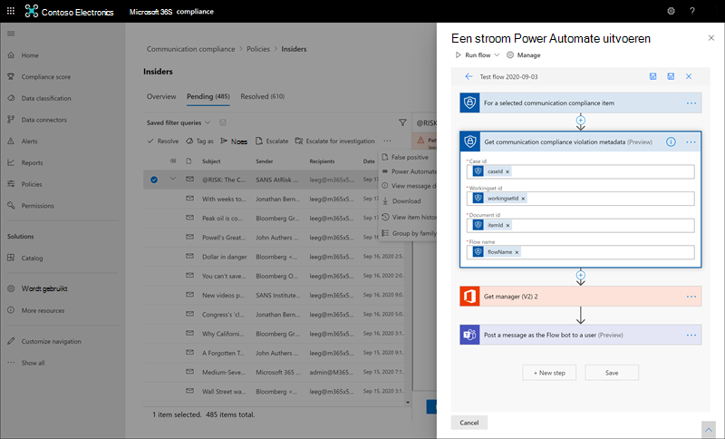
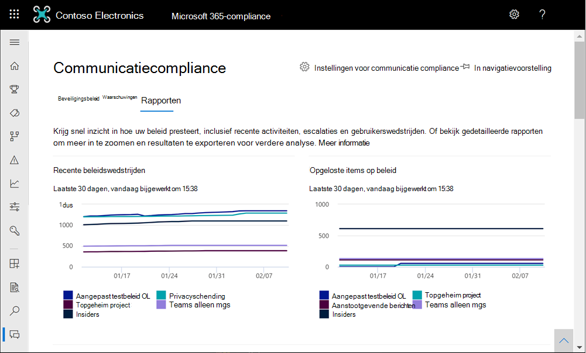

# <a name="communication-compliance-feature-reference"></a>Verwijzing naar communicatie-compliancefunctie

## <a name="policies"></a>Beleid

>[!Important]
>Het gebruik van PowerShell voor het maken en beheren van communicatie compliancebeleid wordt niet ondersteund. Als u dit beleid wilt maken en beheren, moet u de besturingselementen voor beleidsbeheer gebruiken in [Microsoft 365 oplossing voor communicatie compliance.](https://compliance.microsoft.com/supervisoryreview)

U maakt communicatie compliancebeleid voor Microsoft 365 organisaties in het Microsoft 365 compliancecentrum. Communicatie-compliancebeleid bepaalt welke communicatie en gebruikers in uw organisatie moeten worden beoordeeld, bepaal aan welke aangepaste voorwaarden de communicatie moet voldoen en geef aan wie beoordelingen moet doen. Gebruikers die de rol *Communicatie compliancebeheerder* hebben toegewezen, kunnen beleid instellen  en iedereen die deze rol heeft toegewezen, heeft toegang tot de pagina Communicatie compliance en globale instellingen in het Microsoft 365 compliancecentrum. Indien nodig kunt u de geschiedenis van wijzigingen in een beleid exporteren naar een .csv-bestand (door komma's gescheiden waarden) met ook de status van waarschuwingen in behandeling, geëscaleerde items en opgeloste items. Beleid kan niet worden gewijzigd en kan worden verwijderd wanneer dit niet meer nodig is.

>[!NOTE]
>Het toezichtbeleid dat is gemaakt in & Compliancecentrum voor Office 365-abonnementen kan niet migreren naar Microsoft 365. Als u migreert van een Office 365-abonnement naar een Microsoft 365-abonnement, moet u nieuwe communicatiebeleidsregels maken om het bestaande toezichtbeleid te vervangen.

## <a name="policy-templates"></a>Beleidssjablonen

Beleidssjablonen zijn vooraf gedefinieerde beleidsinstellingen die u kunt gebruiken om snel beleid te maken om algemene compliancescenario's aan te pakken. Elk van deze sjablonen heeft verschillen in voorwaarden en bereik en alle sjablonen gebruiken dezelfde typen scansignalen. U kunt kiezen uit de volgende beleidssjablonen:

|**Gebied**|**Beleidssjabloon**|**Details**|
|:-----|:-----|:-----|
| **Aanstootgevende taal en anti-pesterijen** | Communicatie controleren op aanstootgevende taal | - Locaties: Exchange Online, Microsoft Teams, Yammer, Skype voor Bedrijven <br> - Richting: Binnenkomende, Uitgaande, Interne <br> - Percentage controleren: 100% <br> - Voorwaarden: Aanstootgevende taalclassifier |
| **Gevoelige informatie** | Communicatie controleren op gevoelige informatie | - Locaties: Exchange Online, Microsoft Teams, Yammer, Skype voor Bedrijven <br> - Richting: Binnenkomende, Uitgaande, Interne <br> - Percentage controleren: 10% <br> - Voorwaarden: Gevoelige informatie, out-of-the-box inhoudspatronen en -typen, aangepaste woordenlijstoptie, bijlagen groter dan 1 MB |
| **Naleving van regelgeving** | Communicatie controleren op informatie over naleving van financiële regelgeving | - Locaties: Exchange Online, Microsoft Teams, Yammer, Skype voor Bedrijven <br> - Richting: Binnenkomende, Uitgaande <br> - Percentage controleren: 10% <br> - Voorwaarden: optie aangepaste woordenlijst, bijlagen groter dan 1 MB |
| **Belangenverstrengeling** | Communicatie tussen twee groepen of twee gebruikers controleren om conflicten te voorkomen | - Locaties: Exchange Online, Microsoft Teams, Yammer, Skype voor Bedrijven <br> - Richting: Intern <br> - Percentage controleren: 100% <br> - Voorwaarden: Geen |

Communicatie wordt elke 24 uur gescand vanaf het moment dat beleid wordt gemaakt. Als u bijvoorbeeld om 11:00 uur een aanstootgevend taalbeleid maakt, worden in het beleid elke 24 uur om 11:00 uur dagelijks communicatie-compliancesignalen verzameld. Het bewerken van een beleid verandert deze keer niet. Als u de laatste scandatum en -tijd voor een beleid wilt weergeven, gaat u naar de kolom Laatste *beleidsscan* op de **pagina** Beleid. Nadat u een nieuw beleid hebt gemaakt, kan het tot 24 uur duren voordat de eerste scandatum en -tijd van het beleid worden bekeken. De datum en tijd van de laatste scan worden geconverteerd naar de tijdzone van uw lokale systeem.

## <a name="permissions"></a>Machtigingen

>[!Important]
>Globale beheerders hebben standaard geen toegang tot communicatie-compliancefuncties. De rollen die in deze stap zijn toegewezen, zijn vereist voordat alle communicatie-compliancefuncties toegankelijk zijn.

Er zijn vijf rollengroepen die worden gebruikt om machtigingen te configureren voor het beheren van communicatie compliancefuncties. Als u **communicatie compliance** beschikbaar wilt maken als een menuoptie in Microsoft 365 compliancecentrum en als  u deze configuratiestappen wilt voortzetten, moet u zijn toegewezen aan de rollengroepen Communicatie compliance of *Communicatie compliancebeheerder.* Als u na de eerste configuratie communicatie compliancefuncties wilt openen en beheren, moeten gebruikers lid zijn van ten minste één rolgroep communicatie compliance.

Afhankelijk van hoe u communicatiebeleid en waarschuwingen wilt beheren, moet u gebruikers toewijzen aan specifieke rollengroepen. U kunt ervoor kiezen om gebruikers met verschillende complianceverantwoordelijkheden toe te wijzen aan specifieke rollengroepen om verschillende gebieden met communicatie compliancefuncties te beheren. Of u kunt besluiten om alle gebruikersaccounts voor aangewezen beheerders, analisten, onderzoeker en kijkers toe te wijzen aan de *rollengroep Communicatie compliance.* Gebruik één rollengroep of meerdere rollengroepen om het best aan uw vereisten voor compliancebeheer te voldoen.

Kies uit deze opties voor rollengroep bij het configureren van communicatie compliance:

|**Rollengroep**|**Machtigingen voor rollengroep**|
|:-----|:-----|
| **Naleving van communicatie** | Gebruik deze rollengroep om communicatie compliance voor uw organisatie in één groep te beheren. Door alle gebruikersaccounts toe te voegen voor aangewezen beheerders, analisten, onderzoeker en kijkers, kunt u communicatie compliancemachtigingen configureren in één groep. Deze rollengroep bevat alle machtigingsrollen voor communicatie compliance. Deze configuratie is de eenvoudigste manier om snel aan de slag te gaan met communicatie-compliance en is geschikt voor organisaties die geen afzonderlijke machtigingen nodig hebben die zijn gedefinieerd voor afzonderlijke groepen gebruikers. |
| **Communicatie compliancebeheerder** | Gebruik deze rollengroep om communicatie compliance in eerste instantie te configureren en later om beheerders van communicatie compliance te scheiden in een gedefinieerde groep. Gebruikers die aan deze rollengroep zijn toegewezen, kunnen communicatie compliancebeleid, globale instellingen en toewijzingen voor rollengroepen maken, lezen, bijwerken en verwijderen. Gebruikers die aan deze rollengroep zijn toegewezen, kunnen geen berichtwaarschuwingen weergeven. |
| **Communicatie compliance-analist** | Gebruik deze groep om machtigingen toe te wijzen aan gebruikers die fungeren als communicatie-complianceanalisten. Gebruikers die aan deze rollengroep zijn toegewezen, kunnen beleid weergeven waar ze zijn toegewezen als revisoren, metagegevens van berichten weergeven (geen berichtinhoud), escaleren naar andere revisoren of meldingen verzenden naar gebruikers. Analisten kunnen waarschuwingen in behandeling niet oplossen. |
| **Communicatie compliance-onderzoeker** | Gebruik deze groep om machtigingen toe te wijzen aan gebruikers die fungeren als communicatie compliance-onderzoeker. Gebruikers die aan deze rollengroep zijn toegewezen, kunnen metagegevens en inhoud van berichten bekijken, escaleren naar andere revisoren, escaleren naar een Advanced eDiscovery-geval, meldingen naar gebruikers verzenden en de waarschuwing oplossen. |
| **Viewer voor communicatie compliance** | Gebruik deze groep om machtigingen toe te wijzen aan gebruikers die communicatierapporten beheren. Gebruikers die aan deze rollengroep zijn toegewezen, hebben toegang tot alle rapportagewidgets op de startpagina communicatie compliance en kunnen alle communicatie compliancerapporten bekijken. |

### <a name="for-organizations-using-the-original-permissions-and-role-groups"></a>Voor organisaties die de oorspronkelijke machtigingen en rollengroepen gebruiken

De nieuwe structuur van de rollengroep vervangt de eerste structuur van de rollengroep voor communicatie compliance. Voor organisaties die al gebruikmaken van communicatie compliance, moet u de rol Supervisory Review Administrator krijgen toegewezen om aan de slag te gaan met communicatie compliance in het Microsoft 365 compliance center. Daarnaast moest u een nieuwe rollengroep maken voor revisoren met de rollen Supervisory Review Administrator, Case Management, Compliance Administrator en Review om berichten te onderzoeken en te corrigeren met beleidswedstrijden. In feite waren alle beheerders en revisoren in één rollengroep en had iedereen dezelfde toegangs- en beheermachtigingen. Met de meest recente updates voor communicatie compliance, moet u van plan zijn om te migreren van de vorige structuur van de rollengroep naar de nieuwe structuur van de rollengroep. Ondersteuning voor de vorige structuur van de rollengroep wordt uitgefaseerd.

Overweeg het volgende voorbeeld om uw migratieplanning te helpen. U hebt momenteel drie typen gebruikers in uw organisatie, IT-beheerders, triage en revisoren. Deze drie typen gebruikers maken deel uit van de vorige structuur van de rollengroep en zijn allemaal lid van één rollengroep met de volgende rollen:

- Controlebeheerder
- Case Management
- Compliancebeheerder
- Beoordelen

Als u de rollen voor deze gebruikers voor de nieuwe structuur van de rollengroep wilt bijwerken en de toegangs- en beheermachtigingen voor de gebruikers wilt scheiden, kunt u drie nieuwe groepen en de bijbehorende nieuwe toewijzingen voor rollengroepen overwegen:

- **IT-beheerders:** toegewezen aan de nieuwe *rolgroep Communicatie compliancebeheerder.*
- **Triage:** toegewezen aan de *rollengroep Communicatie complianceanalist.*
- **Revisoren:** toegewezen aan de nieuwe *rolgroep Communicatie compliance-onderzoeker.*

## <a name="supervised-users"></a>Gecontroleerde gebruikers

Voordat u communicatie-compliance gaat gebruiken, moet u bepalen wie de communicatie moet controleren. In het beleid identificeren e-mailadressen van gebruikers personen of groepen personen die toezicht moeten houden. Enkele voorbeelden van deze groepen zijn Microsoft 365 Groepen, Exchange op basis van distributielijsten, Yammer community's en Microsoft Teams kanalen. U kunt ook specifieke gebruikers of groepen uitsluiten van scannen met een specifieke uitsluitingsgroep of een lijst met groepen. Zie Aan de slag met communicatie compliance voor meer informatie over groepentypen die worden ondersteund in communicatie [compliancebeleid.](communication-compliance-configure.md#step-3-optional-set-up-groups-for-communication-compliance)

>[!IMPORTANT]
>Gebruikers die onder communicatie-compliancebeleid vallen, moeten een Microsoft 365 E5 Compliance-licentie, een Office 365 Enterprise E3-licentie met de invoeging Advanced Compliance hebben of moeten zijn opgenomen in een Office 365 Enterprise E5-abonnement. Als u geen bestaand Enterprise E5-abonnement hebt en communicatie-compliance wilt proberen, kunt u zich registreren voor een proefversie van [Office 365 Enterprise E5.](https://go.microsoft.com/fwlink/p/?LinkID=698279)

## <a name="reviewers"></a>Revisoren

Wanneer u een communicatie-compliancebeleid maakt, moet u bepalen wie de berichten van de gecontroleerde gebruikers controleert. In het beleid identificeren e-mailadressen van gebruikers personen of groepen personen om gecontroleerde communicatie te bekijken. Alle revisoren moeten postvakken hebben die worden gehost op Exchange Online en moeten zijn toegewezen aan de rollen *Communicatie complianceanalyse* *of Communicatie complianceonderzoek.* Revisoren (analisten of onderzoeker) moeten ook de rol *Communicatie compliance case management* hebben toegewezen. Wanneer revisoren aan een beleid worden toegevoegd, ontvangen ze automatisch een e-mailbericht waarin ze worden op de hoogte gehouden van de toewijzing aan het beleid en koppelingen bevatten naar informatie over het revisieproces.

## <a name="groups-for-supervised-users-and-reviewers"></a>Groepen voor gecontroleerde gebruikers en revisoren

Als u de installatie wilt vereenvoudigen, maakt u groepen voor personen die hun communicatie moeten controleren en groepen voor personen die deze communicatie controleren. Als u groepen gebruikt, hebt u mogelijk meerdere groepen nodig. Als u bijvoorbeeld de communicatie tussen twee verschillende groepen personen wilt scannen of als u een groep wilt opgeven die niet onder toezicht staat.

Wanneer u een distributiegroep toewijst in het beleid, worden met het beleid alle e-mailberichten van elke gebruiker in de distributiegroep bewaakt. Wanneer u een groep Microsoft 365 in het beleid toewijst, worden met het beleid alle e-mailberichten bewaakt die naar die groep zijn verzonden, niet de afzonderlijke e-mailberichten die door elk groepslid zijn ontvangen.

Het toevoegen van groepen en distributielijsten aan communicatie compliancebeleid maakt deel uit van de algemene voorwaarden en regels die zijn ingesteld, dus het maximum aantal groepen en distributielijsten dat door een beleid wordt ondersteund, is afhankelijk van het aantal voorwaarden dat ook aan het beleid is toegevoegd. Elk beleid moet ongeveer 20 groepen of distributielijsten ondersteunen, afhankelijk van het aantal aanvullende voorwaarden in het beleid.

## <a name="supported-communication-types"></a>Ondersteunde communicatietypen

Met communicatie compliancebeleid kunt u ervoor kiezen om berichten in een of meer van de volgende communicatieplatforms te scannen als een groep of als zelfstandige bronnen. Communicatie die is vastgelegd op deze platforms, wordt standaard zeven jaar bewaard voor elk beleid, zelfs als gebruikers uw organisatie verlaten en hun postvakken worden verwijderd.

- **Microsoft Teams:** Chatcommunicatie in zowel openbare als privékanalen Microsoft Teams afzonderlijke chats kunnen worden gescand. Wanneer gebruikers zijn toegewezen aan een communicatiebeleid met Microsoft Teams-dekking geselecteerd, worden chatcommunicatie voor de gebruikers automatisch gecontroleerd in alle Microsoft Teams waar de gebruikers lid zijn. Microsoft Teams wordt automatisch opgenomen voor vooraf gedefinieerde beleidssjablonen en is standaard geselecteerd in de aangepaste beleidssjabloon. Teams kan het tot 48 uur duren voordat chats worden verwerkt die overeenkomen met de voorwaarden van het communicatiebeleid. Gebruik de volgende groepsbeheerconfiguraties om toezicht te houden op afzonderlijke gebruikerschats en kanaalcommunicatie in Teams:

    - **Voor Teams chatcommunicatie:** Wijs afzonderlijke gebruikers toe of wijs een [distributiegroep toe](https://support.office.com/article/Distribution-groups-E8BA58A8-FAB2-4AAF-8AA1-2A304052D2DE) aan het communicatie compliancebeleid. Deze instelling is voor een-op-een- of een-op-veel-gebruikers-/chatrelaties.
    - **Voor Teams Kanaalcommunicatie:** Wijs elk Microsoft Teams kanaal of groep Microsoft 365 die een specifieke gebruiker bevat, toe aan het communicatie compliancebeleid. Als u dezelfde gebruiker toevoegt aan andere Microsoft Teams of Microsoft 365 groepen, moet u deze nieuwe kanalen en groepen toevoegen aan het communicatie compliancebeleid. Als een lid van het kanaal een gecontroleerde  gebruiker is binnen een beleid en de inkomende richting is geconfigureerd in een beleid, worden alle berichten die binnen het kanaal worden verzonden, onderworpen aan revisie en potentiële beleids matches (zelfs voor gebruikers in het kanaal die niet expliciet worden gecontroleerd). Gebruiker A is bijvoorbeeld de eigenaar of lid van een kanaal. Gebruiker B en gebruiker C zijn lid van hetzelfde kanaal en gebruiken taal die is afgestemd op het aanstootgevende taalbeleid dat alleen toezicht houdt op gebruiker A. Gebruiker B en gebruiker C maken beleidsmatchen voor gesprekken in het kanaal, ook al worden ze niet rechtstreeks gecontroleerd in het aanstootgevende taalbeleid. Teams gesprekken tussen gebruiker B en gebruiker C die zich buiten het kanaal met gebruiker A hebben, vallen niet onder het aanstootgevende taalbeleid dat gebruiker A omvat. Als u kanaalleden wilt uitsluiten van toezicht wanneer andere leden van het kanaal expliciet onder toezicht staan, schakelt u de instelling *Inbound* communication direction uit in het toepasselijke communicatie compliancebeleid.
    - Voor **Teams chatcommunicatie** met hybride e-mailomgevingen: Communicatie compliance kan chatberichten controleren voor gebruikers voor organisaties met een on-premises implementatie Exchange een externe e-mailprovider die Microsoft Teams. U moet een distributiegroep maken voor de gebruikers met on-premises of externe postvakken die u wilt controleren. Wanneer u een communicatie-compliancebeleid maakt, wijst  u deze distributiegroep toe als de selectie onder toezicht van gebruikers en groepen in de beleidswizard.

- **Exchange** e-mail: Postvakken die worden gehost op Exchange Online als onderdeel van uw Microsoft 365 of Office 365 komen allemaal in aanmerking voor het scannen van berichten. Exchange e-mailberichten en bijlagen die overeenkomen met de voorwaarden van het communicatiebeleid, kan het tot 24 uur duren voordat ze worden verwerkt. Ondersteunde bijlagetypen voor communicatie compliance zijn hetzelfde als de bestandstypen die worden ondersteund voor Exchange [inhoudsinspecties van](/exchange/security-and-compliance/mail-flow-rules/inspect-message-attachments#supported-file-types-for-mail-flow-rule-content-inspection)de e-mailstroomregel.

- **Yammer:** Privéberichten en openbare gesprekken en bijbehorende bijlagen in Yammer community's kunnen worden gescand. Wanneer een gebruiker wordt toegevoegd aan het communicatie compliancebeleid dat Yammer als een gedefinieerd kanaal bevat, worden communicatie tussen alle Yammer-community's waar de gebruiker lid van is, opgenomen in het scanproces. Yammer kan het tot 24 uur duren voordat chats en bijlagen worden verwerkt die overeenkomen met de voorwaarden van het communicatiebeleid. Yammer moet in de [autochtone modus](/yammer/configure-your-yammer-network/overview-native-mode) staan voor communicatie compliancebeleid om Yammer communicatie en bijlagen te controleren. In de autochtone modus Yammer alle gebruikers in Azure Active Directory (AAD), zijn alle groepen Office 365 Groepen en worden alle bestanden opgeslagen in SharePoint Online.

- **Skype voor Bedrijven Online:** Chatcommunicatie en bijbehorende bijlagen in Skype voor Bedrijven Online kunnen worden gecontroleerd. Skype voor Bedrijven Het kan tot 24 uur duren voordat onlinechats worden verwerkt die voldoen aan de voorwaarden van het communicatiebeleid. Gecontroleerde chatgesprekken zijn afkomstig van eerdere gesprekken die zijn opgeslagen [in Skype voor Bedrijven Online.](https://support.office.com/article/Find-a-previous-Skype-for-Business-conversation-18892eba-5f18-4281-8c87-fd48bd72e6a2)  Gebruik de volgende configuratie voor groepsbeheer om toezicht te houden op chatcommunicatie van gebruikers in Skype voor Bedrijven Online:

    - **Voor Skype voor Bedrijven Online chatcommunicatie:** Afzonderlijke gebruikers toewijzen of een [distributiegroep](https://support.office.com/article/Distribution-groups-E8BA58A8-FAB2-4AAF-8AA1-2A304052D2DE) toewijzen aan het communicatie compliancebeleid. Deze instelling is voor een-op-een- of een-op-veel-gebruikers-/chatrelaties.

- Bronnen van **derden:** U kunt communicatie scannen op gegevens die zijn geïmporteerd in postvakken in uw Microsoft 365-organisatie vanuit bronnen van derden, zoals [Instant Bloomberg,](archive-instant-bloomberg-data.md) [Slack,](archive-slack-data.md) [Zoom,](archive-zoommeetings-data.md)Sms en vele andere. Zie Gegevens van [derden](archiving-third-party-data.md)archiveren voor een volledige lijst met connectors die worden ondersteund in communicatie compliance.

    U moet een connector van derden configureren voor uw Microsoft 365 voordat u de verbindingslijn kunt toewijzen aan een communicatie-compliancebeleid. In **de sectie Bronnen van derden van** de wizard Communicatie compliancebeleid worden momenteel alleen geconfigureerde connectors van derden weergegeven.

## <a name="policy-settings"></a>Beleidsinstellingen

### <a name="users"></a>Gebruikers

U kunt ervoor kiezen om **Alle gebruikers te selecteren** of specifieke gebruikers te definiëren in een communicatie-compliancebeleid. Als **u Alle gebruikers** selecteert, wordt het beleid toegepast op alle gebruikers en alle groepen waarin een gebruiker als lid is opgenomen. Het definiëren van specifieke gebruikers past het beleid toe op de gedefinieerde gebruikers en groepen waarin de gedefinieerde gebruikers als lid zijn opgenomen.

### <a name="direction"></a>Richting

Standaard wordt de voorwaarde **Richting is** weergegeven en kan deze niet worden verwijderd. Instellingen voor communicatierichting in een beleid worden afzonderlijk of samen gekozen:

- **Inkomende** berichten: detecteert communicatie die is verzonden naar gecontroleerde gebruikers van externe en interne afzenders, inclusief andere gecontroleerde gebruikers in het beleid. 
- **Uitgaande e-mail:**  detecteert communicatie die is verzonden van gecontroleerde gebruikers naar externe en interne geadresseerden, inclusief andere gecontroleerde gebruikers in het beleid.
- **Intern:** detecteert communicatie **tussen de** gecontroleerde gebruikers of groepen in het beleid.

### <a name="sensitive-information-types"></a>Typen gevoelige informatie

U hebt de optie om gevoelige informatietypen op te nemen als onderdeel van uw communicatie compliancebeleid. Gevoelige informatietypen zijn vooraf gedefinieerde of aangepaste gegevenstypen die creditcardnummers, bankrekeningnummers, paspoortnummers en meer kunnen identificeren en beveiligen. Als onderdeel van [Meer](dlp-learn-about-dlp.md)informatie over preventie van gegevensverlies kan de configuratie van gevoelige informatie patronen, teken nabijheid, betrouwbaarheidsniveaus en zelfs aangepaste gegevenstypen gebruiken om te helpen bij het identificeren en markeren van inhoud die mogelijk gevoelig is. De standaardgevoelige informatietypen zijn:

- Financieel
- Medische en gezondheidstoestand
- Privacy
- Aangepast informatietype

Zie Entiteitsdefinities van het [type](sensitive-information-type-entity-definitions.md)Gevoelige informatie voor meer informatie over gevoelige informatie en de patronen in de standaardtypen.

### <a name="custom-keyword-dictionaries"></a>Aangepaste woordenlijsten met trefwoorden

Configureer aangepaste woordenlijsten voor trefwoorden (of woordenlijsten) om eenvoudig trefwoorden te beheren die specifiek zijn voor uw organisatie of branche. Woordenlijsten met trefwoorden ondersteunen maximaal 100 KB termen (postcompressie) in de woordenlijst en ondersteunen elke taal. De tenantlimiet is ook 100 KB na compressie. Indien nodig kunt u meerdere aangepaste woordenlijsten voor trefwoorden toepassen op één beleid of één woordenlijst voor trefwoorden per beleid hebben. Deze woordenlijsten worden toegewezen in een communicatie compliancebeleid en kunnen afkomstig zijn van een bestand (zoals een .csv- of .txt-lijst) of uit een lijst die u kunt importeren in het [Compliancecentrum.](create-a-keyword-dictionary.md) Gebruik aangepaste woordenlijsten als u specifieke termen of talen voor uw organisatie en beleid wilt ondersteunen.

### <a name="classifiers"></a>Classificaties

Ingebouwde, trainbare en globale classificaties scannen verzonden of ontvangen berichten in alle communicatiekanalen in uw organisatie op verschillende typen complianceproblemen. Classificaties gebruiken een combinatie van kunstmatige intelligentie en trefwoorden om taal te identificeren in berichten die mogelijk in strijd zijn met anti-pestbeleid. Ingebouwde classificaties ondersteunen momenteel de identificatie van trefwoorden in verschillende talen:

- Chinees (vereenvoudigd)
- Engels
- French
- German
- Italian
- Japans
- Portugees
- Spanish

Communicatie compliance ingebouwde trainable en globale classifiers scannen communicatie op termen, afbeeldingen en sentiment voor de volgende typen taal en inhoud:

- **Bedreiging:** scant op bedreigingen om geweld of fysiek letsel toe te brengen aan een persoon of eigenschap.
- **Gerichte pesterijen:** Scans voor aanstootgevend gedrag gericht op personen met betrekking tot ras, kleur, religie, nationale origin.
- **Grof taalgebruik:** scant naar profane expressies die de meeste mensen in verlegenheid brengen.
- **Afbeeldingen voor volwassenen:** scant naar afbeeldingen die van seksuele aard zijn.
- **Ijzige afbeeldingen:** scant naar afbeeldingen die een seksuele suggestie hebben, maar die minder expliciete inhoud bevatten dan afbeeldingen die als Volwassene worden beschouwd.
- **Gory images**: Scans for images that depict violence and gore.

Met *de* classificaties Volwassenen, *Racy* en *Gory* worden bestanden gescand in .jpeg-, .png-, .gif- en .bmp-indelingen. De grootte van afbeeldingsbestanden moet kleiner zijn dan 4 mb (MB) en de afmetingen van de afbeeldingen moeten groter zijn dan 50x50 pixels en groter dan 50 kilobytes (KB) om de afbeelding in aanmerking te laten komen voor evaluatie. Afbeeldingsidentificatie wordt ondersteund Exchange Online e-mailberichten en Microsoft Teams kanalen en chats.

De ingebouwde, trainbare en globale classificaties bieden geen volledige lijst met termen of afbeeldingen in deze gebieden. Bovendien veranderen taal- en culturele standaarden voortdurend en in het licht van deze realiteit behoudt Microsoft zich het recht voor om classificaties naar eigen goed inzicht bij te werken. Hoewel classificaties uw organisatie kunnen helpen bij het bewaken van deze gebieden, zijn classificaties niet bedoeld om uw organisatie de enige manier te bieden om deze taal of afbeeldingen te controleren of aan te pakken. Uw organisatie, niet Microsoft, blijft verantwoordelijk voor alle beslissingen met betrekking tot het controleren, scannen en blokkeren van taal en afbeeldingen op deze gebieden, inclusief naleving van lokale privacy en andere toepasselijke wetten. Microsoft moedigt het raadplegen van juridische raadslieden aan vóór de implementatie en het gebruik.

>[!NOTE]
>Beleid dat classificaties gebruikt, controleert en evalueert berichten met een aantal woorden van zes of meer. Berichten met minder dan zes woorden worden niet geëvalueerd in beleid met behulp van classificaties. Als u kortere berichten met ongepaste inhoud wilt identificeren en actie wilt ondernemen, raden we u aan een aangepaste woordenlijst voor trefwoord toe te passen aan communicatie compliancebeleid voor dit type inhoud.

Zie Aan de slag met trainbare classificaties voor informatie over Microsoft 365 [klassificatoren.](classifier-get-started-with.md)

### <a name="optical-character-recognition-ocr"></a>OcR (Optical Character Recognition)

Configureer ingebouwd of aangepast compliancebeleid voor communicatie om afgedrukte of handgeschreven tekst te scannen en te identificeren op basis van afbeeldingen die mogelijk ongepast zijn in uw organisatie. Geïntegreerde [Ondersteuning voor Azure Cognitive Services](/azure/cognitive-services/computer-vision/overview-ocr) en optisch scannen voor het identificeren van tekst in afbeeldingen helpen analisten en onderzoeker bij het opsporen en uitvoeren van gevallen waarin ongepast gedrag kan worden gemist in communicatie die hoofdzakelijk niet-tekstueel is.

U kunt OCR (Optical Character Recognition) inschakelen in nieuw beleid vanuit sjablonen, aangepast beleid of bestaande beleidsregels bijwerken om de ondersteuning voor het verwerken van ingesloten afbeeldingen en bijlagen uit te breiden. Wanneer dit is ingeschakeld in een beleid dat is gemaakt op basis van een beleidssjabloon, wordt automatisch scannen ondersteund voor ingesloten of bijgevoegde afbeeldingen in e-mail en Microsoft Teams chatberichten. Voor aangepast beleid moeten een of meer voorwaardelijke instellingen die zijn gekoppeld aan trefwoorden, ingebouwde classificaties of gevoelige informatietypen, worden geconfigureerd in het beleid om de selectie van OCR-scannen in te stellen.

Afbeeldingen van 50 KB tot 4 MB in de volgende afbeeldingsindelingen worden gescand en verwerkt:

- .jpg/.jpeg (joint photographic experts group)
- .png (draagbare netwerkafbeeldingen)
- .bmp (bitmap)
- .tiff (bestandsindeling tagafbeelding)
- .pdf (draagbare documentindeling)

>[!NOTE]
>Scannen en extractie voor ingesloten en .pdf afbeeldingen wordt momenteel alleen ondersteund voor e-mailberichten.

Bij het controleren van waarschuwingen in behandeling voor beleidsregels waarin OCR is ingeschakeld, worden afbeeldingen die zijn geïdentificeerd en gekoppeld aan beleidsvoorwaarden, weergegeven als onderliggende items voor gekoppelde waarschuwingen. U kunt de oorspronkelijke afbeelding bekijken om de geïdentificeerde tekst te evalueren in context met het oorspronkelijke bericht. Het kan tot 48 uur duren voordat gedetecteerde afbeeldingen beschikbaar zijn met waarschuwingen.

### <a name="conditional-settings"></a>Voorwaardelijke instellingen
<a name="ConditionalSettings"> </a>

De voorwaarden die u kiest voor het beleid zijn van toepassing op communicatie vanuit zowel e-mailbronnen als externe bronnen in uw organisatie (bijvoorbeeld van Instant Bloomberg).

In de volgende tabel wordt meer uitgelegd over elke voorwaarde.
  
|**Voorwaarde**|**Deze voorwaarde gebruiken**|
|:-----|:-----|
| **Inhoud komt overeen met een van deze classificaties** | Toepassen op het beleid wanneer classificaties in een bericht worden opgenomen of uitgesloten. Sommige classificaties zijn vooraf gedefinieerd in uw tenant en aangepaste classificaties moeten afzonderlijk worden geconfigureerd voordat ze beschikbaar zijn voor deze voorwaarde. Slechts één classificatie kan worden gedefinieerd als een voorwaarde in een beleid. Zie Meer informatie over [trainable classifiers (preview) voor](classifier-learn-about.md)meer informatie over het configureren van classificaties. |
| **Inhoud bevat een van deze gevoelige informatietypen** | Pas het beleid toe wanneer gevoelige informatietypen in een bericht worden opgenomen of uitgesloten. Sommige classificaties zijn vooraf gedefinieerd in uw tenant en aangepaste classificaties kunnen afzonderlijk of als onderdeel van het toewijzingsproces voor voorwaarden worden geconfigureerd. Elk type gevoelige informatie dat u kiest, wordt afzonderlijk toegepast en er hoeft slechts één van deze typen gevoelige informatie van toepassing te zijn op het beleid dat van toepassing is op het bericht. Zie Meer informatie over gevoelige informatietypen voor meer informatie over aangepaste gevoelige [informatietypen.](sensitive-information-type-learn-about.md) |
| **Bericht wordt ontvangen van een van deze domeinen**  <br><br> **Bericht wordt niet ontvangen van een van deze domeinen** | Pas het beleid toe om specifieke domeinen of e-mailadressen in ontvangen berichten op te nemen of uit te sluiten. Voer elk domein of e-mailadres in en scheid meerdere domeinen of e-mailadressen met een komma. Elk domein of e-mailadres dat wordt ingevoerd, wordt afzonderlijk toegepast, er mag slechts één domein of e-mailadres worden toegepast om het beleid toe te passen op het bericht. <br><br> Als u alle e-mail van een specifiek domein wilt scannen, maar berichten wilt uitsluiten die niet hoeven te  worden beoordeeld (nieuwsbrieven, aankondigingen, en dergelijke), moet u een bericht configureren dat niet wordt ontvangen van een van deze domeinen, waardoor het e-mailadres wordt uitgesloten (bijvoorbeeld 'newsletter@contoso.com'). |
| **Bericht wordt verzonden naar een van deze domeinen**  <br><br> **Bericht wordt niet verzonden naar een van deze domeinen** | Pas het beleid toe om specifieke domeinen of e-mailadressen in verzonden berichten op te nemen of uit te sluiten. Voer elk domein of e-mailadres in en scheid meerdere domeinen of e-mailadressen met een komma. Elk domein of e-mailadres wordt afzonderlijk toegepast, er hoeft slechts één domein of e-mailadres van toepassing te zijn op het beleid dat van toepassing is op het bericht. <br><br> Als u alle e-mail wilt scannen die naar een specifiek domein is verzonden, maar verzonden berichten wilt uitsluiten die niet hoeven te worden beoordeeld, moet u twee voorwaarden configureren: <br> - **Er wordt een bericht verzonden naar een van** deze domeinenvoorwaarde die het domein definieert ("contoso.com"), EN <br> - Een **bericht wordt niet verzonden naar een van** deze domeinen die het e-mailadres ('subscriptions@contoso.com'). |
| **Bericht is geclassificeerd met een van deze labels**  <br><br> **Bericht is niet geclassificeerd met een van deze labels** | Het beleid toepassen wanneer bepaalde bewaarlabels in een bericht worden opgenomen of uitgesloten. Bewaarlabels moeten afzonderlijk worden geconfigureerd en geconfigureerde etiketten worden gekozen als onderdeel van deze voorwaarde. Elk label dat u kiest, wordt afzonderlijk toegepast (slechts één van deze etiketten moet van toepassing zijn op het beleid dat op het bericht van toepassing is). Zie Bewaarbeleid en bewaarlabels voor meer informatie over [bewaarlabels.](retention.md)|
| **Bericht bevat een van deze woorden**  <br><br> **Bericht bevat geen van deze woorden** | Als u het beleid wilt toepassen wanneer bepaalde woorden of woordgroepen in een bericht worden opgenomen of uitgesloten, voert u elk woord gescheiden met een komma in. Voor woordgroepen van twee woorden of meer gebruikt u aanhalingstekens rond de woordgroep. Elk woord of woordgroep dat u typt, wordt afzonderlijk toegepast (er moet slechts één woord worden toegepast om het beleid op het bericht toe te passen). Zie de volgende sectie Woorden en woordgroepen koppelen aan e-mailberichten of bijlagen voor meer informatie over het invoeren van [woorden of woordgroepen.](communication-compliance-feature-reference.md#Matchwords)|
| **Bijlage bevat een van deze woorden**  <br><br> **Bijlage bevat geen van deze woorden** | Als u het beleid wilt toepassen wanneer bepaalde woorden of woordgroepen zijn opgenomen of uitgesloten in een berichtbijlage (zoals een Word-document), voert u elk woord gescheiden met een komma in. Voor woordgroepen van twee woorden of meer gebruikt u aanhalingstekens rond de woordgroep. Elk woord of woordgroep dat u typt, wordt afzonderlijk toegepast (er moet slechts één woord worden toegepast om het beleid voor de bijlage toe te passen). Zie de volgende sectie Woorden en woordgroepen koppelen aan e-mailberichten of bijlagen voor meer informatie over het invoeren van [woorden of woordgroepen.](communication-compliance-feature-reference.md#Matchwords)|
| **Bijlage is een van deze bestandstypen**  <br><br> **Bijlage is geen van deze bestandstypen** | Als u toezicht wilt houden op communicatie die specifieke typen bijlagen bevat of uitsluit, voert u de bestandsextensies in (zoals .exe of .pdf). Als u meerdere bestandsextensies wilt opnemen of uitsluiten, voert u deze op afzonderlijke regels in. Er moet slechts één bijlageextensie overeenkomen om het beleid toe te passen.|
| **Berichtgrootte is groter dan**  <br><br> **Berichtgrootte is niet groter dan** | Als u berichten wilt controleren op basis van een bepaalde grootte, gebruikt u deze voorwaarden om de maximale of minimale grootte op te geven die een bericht kan hebben voordat het wordt beoordeeld. Als u bijvoorbeeld berichtgrootte opgeeft **die groter is** dan \> **1,0 MB,** kunnen alle berichten van 1,01 MB en groter worden beoordeeld. U kunt bytes, kilobytes, megabytes of gigabytes kiezen voor deze voorwaarde.|
| **Bijlage is groter dan**  <br><br> **Bijlage is niet groter dan** | Als u berichten wilt controleren op basis van de grootte van de bijlagen, geeft u de maximale of minimale grootte op van een bijlage voordat het bericht en de bijlagen worden beoordeeld. Als u bijvoorbeeld een bijlage **opgeeft die groter is** dan \> **2,0 MB,** kunnen alle berichten met bijlagen van 2,01 MB en ouder worden beoordeeld. U kunt bytes, kilobytes, megabytes of gigabytes kiezen voor deze voorwaarde.|
   
#### <a name="matching-words-and-phrases-to-emails-or-attachments"></a>Woorden en woordgroepen koppelen aan e-mailberichten of bijlagen
<a name="Matchwords"> </a>

Elk woord dat u typt en scheidt met een komma wordt afzonderlijk toegepast (er moet slechts één woord worden toegepast om de beleidsvoorwaarde toe te passen op de e-mail of bijlage). Laten we bijvoorbeeld de voorwaarde **gebruiken,** Bericht bevat een van deze woorden, met de trefwoorden 'bankier', 'vertrouwelijk' en 'insider trading' gescheiden door een komma (bankier, vertrouwelijk,"insider trading"). Het beleid is van toepassing op berichten met het woord 'bankier', 'vertrouwelijk' of de zin 'handel met voorkennis'. Er mag slechts één van deze woorden of woordgroepen voorkomen om deze beleidsvoorwaarde toe te passen. Woorden in het bericht of de bijlage moeten exact overeenkomen met wat u op typt.

>[!IMPORTANT]
>Wanneer u een aangepast woordenlijstbestand importeert, moet elk woord of elke woordgroep worden gescheiden met een tussenregel en een aparte regel. <br> Bijvoorbeeld: <br><br>
>*bankier* <br>
>*vertrouwelijk* <br>
>*handel met voorkennis*

Als u zowel e-mailberichten als bijlagen wilt [](create-test-tune-dlp-policy.md) scannen op dezelfde [](create-a-keyword-dictionary.md) trefwoorden, maakt u een preventiebeleid voor gegevensverlies met een aangepaste woordenlijst met trefwoorden voor de termen die u in berichten wilt scannen. Met deze beleidsconfiguratie worden gedefinieerde trefwoorden geïdentificeerd die worden weergegeven in het e-mailbericht **OF** in de e-mailbijlage. Als u de standaardinstellingen voor voorwaardelijk beleid gebruikt *(* Bericht bevat een van deze woorden en Bijlage een van deze *woorden)* om termen in berichten en bijlagen te identificeren, moeten de termen aanwezig zijn **in** zowel het bericht als de bijlage.
  
#### <a name="enter-multiple-conditions"></a>Voer meerdere voorwaarden in

Als u meerdere voorwaarden in Microsoft 365, worden alle voorwaarden samen gebruikt om te bepalen wanneer het communicatie compliancebeleid moet worden toegepast op communicatie-items. Wanneer u meerdere voorwaarden in stelt, moet aan alle voorwaarden worden voldaan om het beleid toe te passen, tenzij u een uitzondering in typt. U hebt bijvoorbeeld een beleid nodig dat van toepassing is als een bericht het woord 'trade' bevat en groter is dan 2 MB. Als het bericht echter ook de woorden 'Goedgekeurd door Contoso financial' bevat, moet het beleid niet van toepassing zijn. In dit voorbeeld worden de drie voorwaarden als volgt gedefinieerd:
  
- **Bericht bevat een van deze woorden,** met het trefwoord 'trade'
- **Berichtgrootte is groter dan**, met de waarde 2 MB
- **Bericht bevat geen van deze woorden,** met de trefwoorden 'Goedgekeurd door contoso financieel team'

### <a name="review-percentage"></a>Percentage controleren

Als u de hoeveelheid te controleren inhoud wilt beperken, kunt u een percentage opgeven van alle communicatie die valt onder een communicatie-compliancebeleid. Een realtime, willekeurige steekproef van inhoud wordt geselecteerd uit het totale percentage inhoud dat overeenkomt met de gekozen beleidsvoorwaarden. Als u wilt dat revisoren alle items controleren, kunt u **100%** configureren in een communicatie compliancebeleid.

## <a name="privacy"></a>Privacy

Het beschermen van de privacy van gebruikers met beleidsvoorwaarden is belangrijk en kan bijdragen aan het bevorderen van objectiviteit in gegevensonderzoeks- en analysebeoordelingen voor waarschuwingen voor communicatie compliance. Deze instelling is alleen van toepassing op gebruikersnamen die de communicatie-complianceoplossing hebben weergegeven. Dit heeft geen invloed op de manier waarop namen worden weergegeven in andere complianceoplossingen of het beheercentrum.

Voor gebruikers met een communicatie-compliance-overeenkomst kunt u een van de volgende instellingen kiezen in **communicatie compliance-instellingen:**

- **Anonieme versies van gebruikersnamen** weergeven: gebruikersnamen worden geanonimiseerd om te voorkomen dat gebruikers in de rollengroep Communicatie *complianceanalist* kunnen zien wie aan beleidswaarschuwingen is gekoppeld. Gebruikers in de *rollengroep Communicatie compliance-onderzoeker* zien altijd gebruikersnamen, niet de geanonimiseerde versies. Een gebruiker 'Grace Taylor' wordt bijvoorbeeld weergegeven met een gerandomiseerd pseudoniem zoals 'AnonIS8-988' op alle gebieden van de communicatie compliance-ervaring. Als u deze instelling kiest, worden alle gebruikers met huidige en eerdere beleidsregels geanonimiseerd en geldt dit voor alle beleidsregels. Gebruikersprofielgegevens in de waarschuwingsdetails voor communicatie compliance zijn niet beschikbaar wanneer deze optie wordt gekozen. Gebruikersnamen worden echter weergegeven bij het toevoegen van nieuwe gebruikers aan bestaand beleid of bij het toewijzen van gebruikers aan nieuw beleid. Als u ervoor kiest om deze instelling uit te schakelen, worden gebruikersnamen weergegeven voor alle gebruikers met huidige of eerdere beleidsinterlands.
- **Geen anonieme versies van gebruikersnamen** weergeven: gebruikersnamen worden weergegeven voor alle huidige en eerdere beleidswedstrijden voor waarschuwingen voor communicatie compliance. Gebruikersprofielgegevens (de naam, titel, alias en organisatie of afdeling) worden weergegeven voor de gebruiker voor alle waarschuwingen voor communicatie compliance.

## <a name="notice-templates"></a>Kennisgevingssjablonen

U kunt kennisgevingssjablonen maken als u gebruikers een e-mailherinneringsbericht wilt sturen voor beleidswedstrijden als onderdeel van het probleemoplossingsproces. Kennisgevingen kunnen alleen worden verzonden naar het e-mailadres van de gebruiker dat is gekoppeld aan de beleidsmatch die de specifieke waarschuwing voor herstel heeft gegenereerd. Wanneer u een kennisgevingssjabloon selecteert om toe te passen op een beleidsovertreding als onderdeel van de herstelwerkstroom, kunt u ervoor kiezen om de veldwaarden te accepteren die in de sjabloon zijn gedefinieerd of om de velden zo nodig te overschrijven.

Kennisgevingssjablonen zijn aangepaste e-mailsjablonen waarin u de volgende berichtvelden kunt definiëren in het **gebied Communicatie compliance-instellingen:**

|**Veld**|**Vereist**| **Details** |
|:-----|:-----|:-----|
|**Naam van sjabloon** | Ja | De vriendelijke naam voor de kennisgevingssjabloon die u selecteert in de meldingswerkstroom tijdens herstel, ondersteunt teksttekens. |
| **Adres afzender** | Ja | Het adres van een of meer gebruikers of groepen die het bericht naar de gebruiker verzenden met een beleidsmatch, geselecteerd in de Active Directory voor uw abonnement. |
| **CC- en BCC-adressen** | Nee | Optionele gebruikers of groepen die moeten worden geïnformeerd over de beleidsmatch, geselecteerd in de Active Directory voor uw abonnement. |
| **Onderwerp** | Ja | Informatie die wordt weergegeven in de onderwerpregel van het bericht, ondersteunt teksttekens. |
| **Bericht in de tekst** | Ja | Informatie die wordt weergegeven in de berichttekst, ondersteunt tekst- of HTML-waarden. |

### <a name="html-for-notices"></a>HTML voor kennisgevingen

Als u meer wilt maken dan een eenvoudig e-mailbericht op basis van tekst voor meldingen, kunt u een gedetailleerder bericht maken met HTML in het berichttekstveld van een kennisgevingssjabloon. In het volgende voorbeeld wordt de hoofdindeling van het bericht weergegeven voor een basissjabloon voor e-mailmeldingen op basis van HTML:

```HTML
<!DOCTYPE html>
<html>
    <body>
        <h2>Action Required: Contoso Employee Code of Conduct Policy Training</h2>
        <p>A recent message you've sent has generated a policy alert for the Contoso Employee <a href='https://www.contoso.com'>Code of Conduct Policy</a>.</p>
        <p>You are required to attend the Contoso Employee Code of Conduct <a href='https://www.contoso.com'>training</a> within the next 14 days. Please contact <a href='mailto:hr@contoso.com'>Human Resources</a> with any questions about this training request.</p>
        <p>Thank you,</p>
        <p><em>Human Resources</em></p>
    </body>
</html>
```

>[!NOTE]
>Html href-kenmerkuitvoering in de meldingssjablonen voor communicatie compliance ondersteunt momenteel slechts enkele aanhalingstekens in plaats van dubbele aanhalingstekens voor URL-verwijzingen.

## <a name="filters"></a>Filters

Met communicatie compliancefilters kunt u waarschuwingsberichten filteren en sorteren voor snellere onderzoek- en herstelacties. Filteren is beschikbaar op de tabbladen **In** behandeling **en** Opgelost voor elk beleid. Als u een filter- of filterset wilt opslaan als een opgeslagen filterquery, moet een of meer waarden zijn geconfigureerd als filterselecties. In de volgende tabel worden filterdetails beschreven:

|**Filteren**|**Details**|
|:-----|:-----|
| **Datum** | De datum waarop het bericht is verzonden of ontvangen door een gebruiker in uw organisatie. Als u wilt filteren op één dag, selecteert u een datumbereik dat begint met de dag waarop u resultaten wilt en eindigt op de volgende dag. Als u bijvoorbeeld resultaten wilt filteren voor 20-9-2020, kiest u een filterdatumbereik van 20-9-21-2020.|
| **Bestandsklasse** | De klas van het bericht op basis van het berichttype, *bericht of* *bijlage.* |
| **Heeft bijlage** | De aanwezigheid van de bijlage in het bericht. |
| **Itemklasse** | De bron van het bericht op basis van het berichttype, e-mail, Microsoft Team-chat, Bloomberg, enzovoort. Zie Itemtypen en Berichtklassen voor meer informatie over algemene itemtypen en [berichtklassen.](/office/vba/outlook/concepts/forms/item-types-and-message-classes) |
| **Geadresseerdedomeinen** | Het domein waar het bericht naar is verzonden. Dit domein is standaard uw Microsoft 365 abonnementsdomein. |
| **Ontvanger** | De gebruiker naar wie het bericht is verzonden. |
| **Afzender** | De persoon die het bericht heeft verzonden. |
| **Afzenderdomein** | Het domein dat het bericht heeft verzonden. |
| **Grootte** | De grootte van het bericht in KB. |
| **Onderwerp/titel** | Het berichtonderwerp of de chattitel. |
| **Tags** | De tags die aan een bericht zijn toegewezen, *zijn twijfelachtig,* *compatibel* of *niet-compatibel.* |
| **Taal** | De gedetecteerde taal van tekst in het bericht. Het bericht wordt geclassificeerd op basis van de taal van het grootste deel van de berichttekst. Voor een bericht dat zowel Duitse als Italiaanse tekst bevat, maar het grootste deel van de tekst Duits is, wordt het bericht geclassificeerd als Duits (DE). De volgende talen worden ondersteund: Chinees (Vereenvoudigd - ZH), Engels (EN), Frans (FR), Duits (DE), Italiaans (IT), Japans (JP), Portugees (PT) en Spaans (ES). Als u bijvoorbeeld berichten wilt filteren die zijn geclassificeerd als Duits en Italiaans, voert u 'DE,IT' (de taalcodes met twee cijfers) in het zoekvak Taalfilter in. Als u de gedetecteerde taalclassificatie voor een bericht wilt weergeven, selecteert u een bericht, selecteert u Details van het bericht weergeven en schuift u naar het veld E-maildetectedLanguage. |
| **Geëscaleerd naar** | De gebruikersnaam van de persoon die is opgenomen als onderdeel van een escalatieactie voor berichten. |
| **Classificaties** | De naam van ingebouwde en aangepaste classificaties die van toepassing zijn op het bericht. Enkele voorbeelden zijn *Aanstootgevende taal,* *Gerichte* *pesterijen, Grof* taalgebruik, *Bedreiging* en meer.

## <a name="alert-policies"></a>Waarschuwingsbeleid

Nadat u een beleid hebt geconfigureerd, wordt automatisch een bijbehorend waarschuwingsbeleid gemaakt en worden waarschuwingen gegenereerd voor berichten die voldoen aan de voorwaarden die in het beleid zijn gedefinieerd. Standaard worden aan alle beleidstriggers waarschuwingstriggers een ernstniveau van medium toegewezen in het bijbehorende waarschuwingsbeleid. Waarschuwingen worden gegenereerd voor een communicatie compliancebeleid zodra het drempelniveau voor de aggregatietrigger is bereikt in het bijbehorende waarschuwingsbeleid.

Voor communicatie compliancebeleid zijn de volgende waarschuwingsbeleidswaarden standaard geconfigureerd:

|**Trigger voor waarschuwingsbeleid**|**Standaardwaarde**|
|:-----|:-----|
| Aggregatie | Eenvoudige aggregatie |
| Drempelwaarde | 4 activiteiten |
| Venster | 60 minuten |

>[!Note]
>De instellingen voor triggerinstellingen voor waarschuwingsbeleid voor activiteiten ondersteunen een minimumwaarde van 3 of hoger voor communicatie compliancebeleid.

U kunt de standaardinstellingen voor triggers voor het aantal activiteiten, de periode voor  de activiteiten en voor specifieke gebruikers wijzigen in waarschuwingsbeleid op de pagina Waarschuwingsbeleid in het beveiligings- & compliancecentrum.

### <a name="change-the-severity-level-for-an-alert-policy"></a>Het ernstniveau voor een waarschuwingsbeleid wijzigen

Als u het ernstniveau wilt wijzigen dat is toegewezen aan een waarschuwingsbeleid voor een specifiek communicatie compliancebeleid, moet u de volgende stappen volgen:

1. Meld u [https://compliance.microsoft.com](https://compliance.microsoft.com) aan bij het gebruik van referenties voor een beheerdersaccount in uw Microsoft 365 organisatie.

2. Ga in Microsoft 365 compliancecentrum naar **Beleid.**

3. Selecteer **Office 365 waarschuwing op** **de** pagina Beleid  om de pagina Waarschuwingenbeleid te openen in **Office 365 beveiligingscentrum & Compliancecentrum.**

4. Schakel het selectievakje in voor het communicatie compliancebeleid dat u wilt bijwerken en selecteer **vervolgens Beleid bewerken.**

5. Selecteer op **het** tabblad Beschrijving de vervolgkeuze **voor** ernst om het waarschuwingsniveau van het beleid te configureren.

6. Selecteer **Opslaan om** het nieuwe ernstniveau toe te passen op het beleid.

7. Selecteer **Sluiten om** de pagina met details van het waarschuwingsbeleid te sluiten.

## <a name="power-automate-flows"></a>Power Automate stromen

[Microsoft Power Automate](/power-automate/getting-started) is een werkstroomservice die acties in verschillende toepassingen en services automatiseert. Door stromen van sjablonen te gebruiken of handmatig te maken, kunt u veelgebruikte taken automatiseren die aan deze toepassingen en services zijn gekoppeld. Wanneer u Power Automate voor communicatie compliance inschakelen, kunt u belangrijke taken voor waarschuwingen en gebruikers automatiseren. U kunt de Power Automate om managers op de hoogte te stellen wanneer gebruikers waarschuwingen voor communicatie compliance en andere toepassingen hebben.

Klanten met Microsoft 365-abonnementen die communicatie compliance bevatten, hebben geen extra Power Automate nodig om de aanbevolen standaardcommunicatie compliance-sjabloon Power Automate gebruiken. De standaardsjabloon kan worden aangepast om uw organisatie te ondersteunen en de belangrijkste compliancescenario's voor communicatie te bespreken. Als u ervoor kiest om premium Power Automate-functies in deze sjablonen te gebruiken, maakt u een aangepaste sjabloon met de Microsoft 365-complianceconnector of gebruikt u Power Automate-sjablonen voor andere compliancegebieden in Microsoft 365, hebt u mogelijk extra Power Automate-licenties nodig.

>[!IMPORTANT]
>Ontvangt u aanwijzingen voor aanvullende licentievalidatie bij het testen Power Automate stromen? Mogelijk heeft uw organisatie nog geen service-updates voor deze preview-functie ontvangen. Er worden updates geïmplementeerd en alle organisaties met Microsoft 365-abonnementen die communicatie-compliance bevatten, moeten op 30 oktober 2020 licentieondersteuning hebben voor stromen die zijn gemaakt op basis van de aanbevolen Power Automate-sjablonen.



De volgende Power Automate wordt aangeboden aan klanten ter ondersteuning van procesautomatisering voor waarschuwingen voor communicatie compliance:

- **Meldingsmanager wanneer een gebruiker een** waarschuwing voor communicatie compliance heeft: Sommige organisaties moeten mogelijk onmiddellijk een melding van het beheer hebben wanneer een gebruiker een waarschuwing voor communicatie compliance heeft. Wanneer deze stroom is geconfigureerd en geselecteerd, ontvangt de manager voor de hoofdgebruiker een e-mailbericht met de volgende informatie over alle waarschuwingen:
    - Toepasselijk beleid voor de waarschuwing
    - Datum/tijd van de waarschuwing
    - Ernst van de waarschuwing

### <a name="create-a-power-automate-flow"></a>Een Power Automate maken

Als u een Power Automate wilt maken van een aanbevolen standaardsjabloon, gebruikt u  de optie **Power Automate-stromen** beheren vanuit het besturingselement Automatiseren wanneer u rechtstreeks in een waarschuwing werkt. Als u een Power Automate wilt maken met **Manage Power Automate flows,** moet u lid zijn van ten minste één rolgroep communicatie compliance.

Volg de volgende stappen om een stroom Power Automate een standaardsjabloon te maken:

1. Ga in Microsoft 365 compliancecentrum naar **Communicatie compliancebeleid** en selecteer het beleid met de  >   waarschuwing die u wilt controleren.
2. Selecteer in het beleid het **tabblad** In behandeling en selecteer een waarschuwing in behandeling.
3. Selecteer **Power Automate** in het actiemenu voor waarschuwingen.
4. Selecteer op **Power Automate** pagina een standaardsjabloon in de sectie Communicatie **compliancesjablonen die** u mogelijk leuk vindt op de pagina.
5. De stroom vermeldt de ingesloten verbindingen die nodig zijn voor de stroom en wordt weergegeven als de verbindingsstatussen beschikbaar zijn. Werk indien nodig eventuele verbindingen bij die niet als beschikbaar worden weergegeven. Selecteer **Doorgaan**.
6. Standaard zijn de aanbevolen stromen vooraf geconfigureerd met de aanbevolen communicatie-compliance en Microsoft 365 servicegegevensvelden vereist om de toegewezen taak voor de stroom te voltooien. Pas indien nodig de stroomonderdelen aan met behulp van **het** besturingselement Geavanceerde opties weergeven en de beschikbare eigenschappen voor het stroomonderdeel configureren.
7. Voeg indien nodig extra stappen toe aan de stroom door de knop **Nieuwe stap te** selecteren. In de meeste gevallen is deze wijziging niet nodig voor de aanbevolen standaardsjablonen.
8. Selecteer **Concept opslaan om** de stroom op te slaan voor verdere configuratie later of selecteer **Opslaan** om de configuratie voor de stroom te voltooien.
9. Selecteer **Sluiten om** terug te keren naar de Power Automate stroompagina. De nieuwe sjabloon wordt weergegeven als  een stroom op het tabblad Mijn stromen en is automatisch beschikbaar via het Power Automate-besturingselement voor de gebruiker die de stroom heeft gemaakt bij het werken met waarschuwingen voor communicatie compliance.

### <a name="share-a-power-automate-flow"></a>Een stroom Power Automate delen

Standaard zijn Power Automate die door een gebruiker zijn gemaakt, alleen beschikbaar voor die gebruiker. Als andere communicatie-compliancegebruikers toegang hebben en een stroom gebruiken, moet de stroom worden gedeeld door de maker van de stroom. Als u een stroom wilt delen, gebruikt u het besturingselement Power Automate **wanneer** u rechtstreeks in een waarschuwing werkt.

Als u een Power Automate wilt delen, moet u lid zijn van ten minste één rolgroep communicatie compliance.
Volg de volgende stappen om een stroom Power Automate delen:

1. Ga in Microsoft 365 compliancecentrum naar **Communicatie compliancebeleid** en selecteer het beleid met de  >   waarschuwing die u wilt controleren.
2. Selecteer in het beleid het **tabblad** In behandeling en selecteer een waarschuwing in behandeling.
3. Selecteer **Power Automate** in het actiemenu voor waarschuwingen.
4. Selecteer op **Power Automate pagina Mijn** stromen  of **Teamstromen het** tabblad Mijn stromen.
5. Selecteer de stroom die u wilt delen en selecteer **vervolgens Delen** in het menu stroomopties.
6. Voer op de pagina stroom delen de naam in van de gebruiker of groep die u als eigenaar voor de stroom wilt toevoegen.
7. Selecteer ok **in het** dialoogvenster Verbinding gebruikt om **te** bevestigen dat de toegevoegde gebruiker of groep volledige toegang tot de stroom heeft.

### <a name="edit-a-power-automate-flow"></a>Een stroom Power Automate bewerken

Als u een stroom wilt bewerken, gebruikt u het besturingselement Power Automate **wanneer** u rechtstreeks in een waarschuwing werkt. Als u een Power Automate wilt bewerken, moet u lid zijn van ten minste één rolgroep communicatie compliance.

Volg de volgende stappen om een stroom Power Automate bewerken:

1. Ga in Microsoft 365 compliancecentrum naar **Communicatie compliancebeleid** en selecteer het beleid met de  >   waarschuwing die u wilt controleren.
2. Selecteer in het beleid het **tabblad** In behandeling en selecteer een waarschuwing in behandeling.
3. Selecteer **Power Automate** in het actiemenu voor waarschuwingen.
4. Selecteer op **Power Automate pagina stroom** om te bewerken. Selecteer **Bewerken** in het menu Stroombesturingselement.
5. Selecteer het **beletselteken Instellingen** als u de instelling van een stroomcomponent of beletselteken Verwijderen wilt wijzigen om  >     >   een stroomcomponent te verwijderen.
6. Selecteer **Opslaan en** vervolgens Sluiten **om** het bewerken van de stroom te voltooien.

### <a name="delete-a-power-automate-flow"></a>Een stroom Power Automate verwijderen

Als u een stroom wilt verwijderen,  gebruikt u het besturingselement Power Automate wanneer u rechtstreeks in een waarschuwing werkt. Als u een Power Automate wilt verwijderen, moet u lid zijn van ten minste één rolgroep communicatie compliance.

Volg de volgende stappen om een stroom Power Automate verwijderen:

1. Ga in Microsoft 365 compliancecentrum naar **Communicatie compliancebeleid** en selecteer het beleid met de  >   waarschuwing die u wilt controleren.
2. Selecteer in het beleid het **tabblad** In behandeling en selecteer een waarschuwing in behandeling.
3. Selecteer **Power Automate** in het actiemenu voor waarschuwingen.
4. Selecteer op **Power Automate pagina stroom** die u wilt verwijderen. Selecteer **Verwijderen** in het menu Stroombesturingselement.
5. Selecteer verwijderen in het  bevestigingsdialoogvenster verwijderen om de stroom te verwijderen of selecteer **Annuleren om** de verwijderingsactie te sluiten.

## <a name="reports"></a>Rapporten

Het nieuwe **dashboard Rapporten** is de centrale locatie voor het weergeven van alle communicatie compliancerapporten. Rapportwidgets bieden een snelle weergave van inzichten die het meest nodig zijn voor een algemene beoordeling van de status van communicatie complianceactiviteiten. Gegevens in de rapportwidgets kunnen niet worden geëxporteerd. Gedetailleerde rapporten bevatten uitgebreide informatie over specifieke communicatie compliancegebieden en bieden de mogelijkheid om informatie te filteren, groeperen, sorteren en exporteren tijdens het controleren.



Het **dashboard Rapporten** bevat de volgende rapportwidgets en gedetailleerde rapportenkoppelingen:

- **Widget Recent beleid komt overeen:** geeft het aantal overeenkomsten weer op actief beleid in de tijd.
- **Opgeloste items per beleidswidget:** geeft het aantal beleidsmatchwaarschuwingen weer dat is opgelost door beleid in de tijd.
- **Gebruikers met de meeste beleidsmatchwidget:** hiermee worden de gebruikers (of geanonimiseerde gebruikersnamen) en het aantal beleidsmatchen voor een bepaalde periode weergegeven.
- **Beleid met de meeste overeenkomsten** widget: geeft het beleid en het aantal overeenkomsten voor een bepaalde periode weer, gerangschikt van hoog naar laag voor overeenkomsten.
- **Escalaties per** beleidswidget: geeft het aantal escalaties per beleid over een bepaalde tijd weer.
- **Beleidsinstellingen en** statusdetailrapport: biedt een gedetailleerd overzicht van de beleidsconfiguratie en -instellingen, evenals de algemene status voor elk beleid (overeenkomsten en acties) voor berichten. Bevat beleidsgegevens en hoe beleid is gekoppeld aan gebruikers en groepen, locaties, beoordelingspercentages, revisoren, status en wanneer het beleid voor het laatst is gewijzigd. Gebruik de *optie Exporteren* om een bestand .csv met de rapportdetails te maken.
- **Items en acties per beleidsdetailrapport:** Overeenkomende items en herstelacties per beleid controleren en exporteren. Bevat beleidsgegevens en hoe beleidsregels zijn gekoppeld aan:

    - Items die overeenkomen
    - Geëscaleerde items
    - Opgeloste items
    - Gemarkeerd als compatibel
    - Gemarkeerd als niet-compatibel
    - Gemarkeerd als twijfelachtig
    - Items in behandeling
    - Gebruiker op de hoogte gesteld
    - Case gemaakt
    
    Gebruik de *optie Exporteren* om een bestand .csv met de rapportdetails te maken.
- **Item en acties per locatie** gedetailleerd rapport: Overeenkomende items en herstelacties per locatie Microsoft 365 exporteren. Bevat informatie over de manier waarop werkbelastingplatforms zijn gekoppeld aan:

    - Items die overeenkomen
    - Geëscaleerde items
    - Opgeloste items
    - Gemarkeerd als compatibel
    - Gemarkeerd als niet-compatibel
    - Gemarkeerd als twijfelachtig
    - Items in behandeling
    - Gebruiker op de hoogte gesteld
    - Case gemaakt

    Gebruik de *optie Exporteren* om een bestand .csv met de rapportdetails te maken.
- **Gedetailleerd rapport Activiteit per** gebruiker: overeenkomende items en herstelacties per gebruiker controleren en exporteren. Bevat informatie over hoe gebruikers zijn gekoppeld aan:

    - Items die overeenkomen
    - Geëscaleerde items
    - Opgeloste items
    - Gemarkeerd als compatibel
    - Gemarkeerd als niet-compatibel
    - Gemarkeerd als twijfelachtig
    - Items in behandeling
    - Gebruiker op de hoogte gesteld
    - Case gemaakt

    Gebruik de *optie Exporteren* om een bestand .csv met de rapportdetails te maken.

- **Type gevoelige informatie per locatie** gedetailleerd rapport (voorbeeld): Informatie controleren en exporteren over de detectie van gevoelige informatietypen en de bijbehorende bronnen in communicatie compliancebeleid. Bevat het totale totaal en de specifieke uitsplitsing van exemplaren van het type gevoelige informatie in de bronnen die zijn geconfigureerd in uw organisatie. Voorbeelden zijn:

    - **E-mail:** gevoelige informatietypen die zijn gedetecteerd in Exchange e-mailberichten.
    - **Teams:** Gevoelige informatietypen die zijn gedetecteerd in Microsoft Teams kanalen en chatberichten.
    - **Skype voor Bedrijven:** gevoelige informatietypen die zijn gedetecteerd in Skype voor zakelijke communicatie.
    - **Yammer:** gevoelige informatietypen die zijn gedetecteerd in Yammer postvak IN, berichten, chats en antwoorden.
    - **Bronnen van derden:** gevoelige informatietypen die zijn gedetecteerd voor activiteiten die zijn gekoppeld aan verbindingslijnen van derden die zijn geconfigureerd in uw organisatie. Als u de uitsplitsing van bronnen van derden voor een specifiek type gevoelige informatie in het rapport wilt bekijken, beweegt u de muisaanwijzer boven de waarde voor het gevoelige informatietype in de bronkolom van derden.
    - **Overige**: Gevoelige informatietypen die worden gebruikt voor interne systeemverwerking. Het selecteren of deselecteren van deze bron voor het rapport heeft geen invloed op waarden.

    Gebruik de *optie Exporteren* om een bestand .csv met de rapportdetails te maken. De waarden voor elke bron van derden worden weergegeven in afzonderlijke kolommen in het .csv bestand.

## <a name="audit"></a>Controle

In sommige gevallen moet u informatie verstrekken aan regelgevende of compliance-auditors om het toezicht op gebruikersactiviteiten en communicatie te bewijzen. Deze informatie kan een overzicht zijn van alle activiteiten die zijn gekoppeld aan een gedefinieerd organisatiebeleid of op elk moment dat een communicatiebeleid wordt gewijzigd. Communicatie compliancebeleid heeft ingebouwde auditpaden voor volledige gereedheid voor interne of externe audits. Gedetailleerde auditgeschiedenissen van elke actie die u maakt, bewerkt en verwijdert, worden vastgelegd in uw communicatiebeleid om het bewijs van toezichtprocedures te leveren.

>[!Important]
>Auditing moet zijn ingeschakeld voor uw organisatie voordat communicatie compliancegebeurtenissen worden vastgelegd. Zie Het auditlogboek inschakelen als u controle [wilt inschakelen.](communication-compliance-configure.md#step-2-required-enable-the-audit-log) Wanneer activiteiten gebeurtenissen triggeren die zijn vastgelegd in het Microsoft 365 auditlogboek, kan het tot 48 uur duren voordat deze gebeurtenissen kunnen worden bekeken in communicatie compliancebeleid.

Als u activiteiten voor het bijwerken van communicatiebeleid wilt bekijken, selecteert u het **besturingselement** Beleidsupdates exporteren op de hoofdpagina voor elk beleid. U moet de  rollen globale beheerder of communicatie *compliancebeheerder* toegewezen krijgen om bijwerkactiviteiten te exporteren. Met deze actie wordt een auditbestand gegenereerd in de .csv indeling met de volgende gegevens:

|**Veld**|**Details**|
|:-----|:-----|
| **CreationDate** | De datum waarop de updateactiviteit is uitgevoerd in een beleid. |
| **UserIds** | De gebruiker die de updateactiviteit heeft uitgevoerd in een beleid. |
| **Operations** | De updatebewerkingen die zijn uitgevoerd op het beleid. |
| **AuditData** | Dit veld is de belangrijkste gegevensbron voor alle activiteiten voor beleidsupdates. Alle updateactiviteiten worden geregistreerd en gescheiden door komma's. |

Als u activiteiten voor het controleren van communicatie compliance voor een beleid wilt bekijken, selecteert u het **besturingselement Controleactiviteiten** exporteren op **de pagina Overzicht** voor een specifiek beleid. U moet de  rollen globale beheerder of communicatie *compliancebeheerder* hebben toegewezen om controleactiviteiten te exporteren. Met deze actie wordt een auditbestand gegenereerd in de .csv indeling met de volgende gegevens:

|**Veld**|**Details**|
|:-----|:-----|
| **CreationDate** | De datum waarop de revisieactiviteit is uitgevoerd in een beleid. |
| **UserIds** | De gebruiker die de controleactiviteit in een beleid heeft uitgevoerd. |
| **Operations** | De revisiebewerkingen die op het beleid zijn uitgevoerd. |
| **AuditData** | Dit veld is de belangrijkste gegevensbron voor alle activiteiten voor beleidsbeoordeling. Alle controleactiviteiten worden geregistreerd en gescheiden door komma's. |

U kunt auditactiviteiten ook weergeven in het geïntegreerde auditlogboek of met de [PowerShell-cmdlet Search-UnifiedAuditLog.](/powershell/module/exchange/search-unifiedauditlog) Zie Bewaarbeleid voor auditlogboek beheren voor meer informatie over bewaarbeleid voor [auditlogboek.](audit-log-retention-policies.md)

In het volgende voorbeeld worden bijvoorbeeld de activiteiten voor alle activiteiten voor toezichtsbeoordeling (beleid en regels) als volgt als volgt bewerkt:

```PowerShell
Search-UnifiedAuditLog -StartDate $startDate -EndDate $endDate -RecordType AeD -Operations SupervisoryReviewTag
```

In dit voorbeeld worden de bijwerkactiviteiten voor uw communicatie-compliancebeleid als retourneert:

```PowerShell
Search-UnifiedAuditLog -StartDate $startDate -EndDate $endDate -RecordType Discovery -Operations SupervisionPolicyCreated,SupervisionPolicyUpdated,SupervisionPolicyDeleted
```

Dit voorbeeld retourneert activiteiten die overeenkomen met uw huidige beleid voor communicatie compliance:

```PowerShell
Search-UnifiedAuditLog -StartDate $startDate -EndDate $endDate -Operations SupervisionRuleMatch 
```

Communicatie compliancebeleids matches worden opgeslagen in een postvak voor toezicht voor elk beleid. In sommige gevallen moet u mogelijk de grootte van uw postvak controleren op een beleid om te controleren of u de huidige limiet van 50 GB niet bereikt. Als de limiet voor het postvak is bereikt, worden beleidswedstrijden niet vastgelegd en moet u een nieuw beleid maken (met dezelfde instellingen) om overeenkomsten voor dezelfde activiteiten vast te blijven leggen.

Als u de grootte van een toezichtpostvak voor een beleid wilt controleren, gaat u als volgt te werk:

1. Gebruik de [Verbinding maken-ExchangeOnline-cmdlet](/powershell/module/exchange/connect-exchangeonline) in Exchange Online PowerShell V2-module om verbinding te maken met Exchange Online PowerShell met moderne verificatie.
2. Voer de volgende opdracht uit in PowerShell:

    ```PowerShell
    ForEach ($p in Get-SupervisoryReviewPolicyV2 | Sort-Object Name) 
    {
       "<Name of your communication compliance policy>: " + $p.Name
       Get-MailboxStatistics $p.ReviewMailbox | ft ItemCount,TotalItemSize
    }
    ```

## <a name="transitioning-from-supervision-in-office-365"></a>Overstappen van toezicht in Office 365

Organisaties die toezichtbeleid gebruiken in Office 365 moeten onmiddellijk van plan zijn over te gaan op communicatie compliancebeleid in Microsoft 365 en moeten deze belangrijke punten begrijpen:

- De supervisieoplossing in Office 365 is volledig vervangen door de oplossing voor communicatie compliance in Microsoft 365. We raden u aan om nieuw beleid in communicatie compliance te maken met dezelfde instellingen als het bestaande toezichtsbeleid om de nieuwe verbeteringen in onderzoek en herstel te gebruiken.
- Berichten die in toezicht zijn opgeslagen in Office 365 beleidswedstrijden, kunnen niet worden verplaatst of gedeeld naar communicatie compliance in Microsoft 365.
- Voor organisaties met beide oplossingen die naast elkaar worden gebruikt tijdens het overgangsproces, moeten beleidsregels die in elke oplossing worden gebruikt, unieke beleidsnamen hebben. Groepen en aangepaste woordenlijsten met trefwoorden kunnen worden gedeeld tussen oplossingen tijdens een overgangsperiode.

Zie de routekaart voor meer Office 365 informatie over Microsoft 365 [voor](https://www.microsoft.com/microsoft-365/roadmap) informatie over het pensioen.

## <a name="ready-to-get-started"></a>Klaar om aan de slag te gaan?

Zie Communicatie compliance configureren voor uw Microsoft 365 organisatie als u communicatie compliance wilt configureren voor [Microsoft 365 organisatie.](communication-compliance-configure.md)
