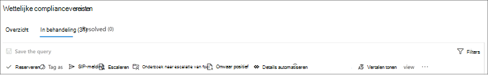
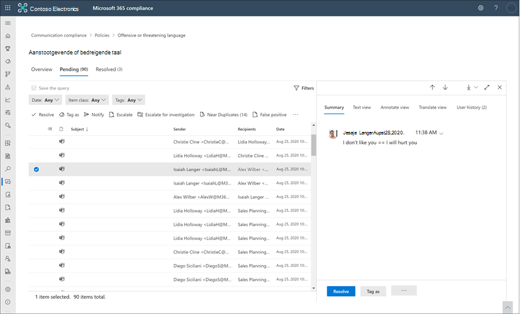

# Waarschuwingen voor communicatiecompliance onderzoeken en oplossenInvestigate and remediate communication compliance alerts

Nadat u uw communicatie-compliancebeleid hebt geconfigureerd, ontvangt u waarschuwingen in het Microsoft 365 compliancecentrum voor berichtproblemen die overeenkomen met uw beleidsvoorwaarden.After you've configured your communication compliance policies, you'll start to receive alerts in the Microsoft 365 compliance center for message issues that match your policy conditions. Volg de werkstroominstructies hier om problemen met waarschuwingen te onderzoeken en te verhelpen.Follow the workflow instructions here to investigate and remediate alert issues.

## Waarschuwingen onderzoekenInvestigate alerts

De eerste stap om problemen te onderzoeken die door uw beleid zijn gedetecteerd, is het controleren van waarschuwingen voor communicatie compliance in het Microsoft 365 compliancecentrum.The first step to investigate issues detected by your policies is to review communication compliance alerts in the Microsoft 365 compliance center. Er zijn verschillende gebieden in het gebied met oplossingen voor communicatie compliance om u te helpen waarschuwingen snel te onderzoeken, afhankelijk van de manier waarop u de groep waarschuwingen wilt bekijken:There are several areas in the communication compliance solution area to help you to quickly investigate alerts, depending on how you prefer to view alert grouping:

- **Pagina Communicatie compliancebeleid:** Wanneer u zich aanmeld bij het gebruik van referenties voor een beheerdersaccount in uw Microsoft 365 organisatie, selecteert u Communicatie compliance om de pagina Communicatie [https://compliance.microsoft.com](https://compliance.microsoft.com) **compliancebeleid weer te** geven. **Communication compliance policy page**: When you sign in to [https://compliance.microsoft.com](https://compliance.microsoft.com) using credentials for an admin account in your Microsoft 365 organization, select **Communication compliance** to display the communication compliance **Policy** page. Op deze pagina worden communicatiebeleidsregels weergegeven die zijn geconfigureerd voor Microsoft 365 organisatie en koppelingen naar aanbevolen beleidssjablonen.This page displays communication compliance policies configured for your Microsoft 365 organization and links to recommended policy templates. Elk beleid dat wordt vermeld, bevat het aantal waarschuwingen dat moet worden beoordeeld, het aantal geëscaleerde en opgeloste items, de status van het beleid en de datum en tijd van de laatste beleidsscan.Each policy listed includes the count of alerts that need review, the number of escalated and resolved items, status of the policy, and the date and time of the last policy scan. Als u een beleid selecteert, worden alle waarschuwingen weergegeven die in behandeling zijn voor overeenkomsten met het beleid, selecteert u een specifieke waarschuwing om de pagina met beleidsdetails te starten en herstelacties te starten.Selecting a policy displays all the pending alerts for matches to the policy, select a specific alert to launch the policy details page and to start remediation actions.
- **Waarschuwingen:** Navigeer naar **communicatie**  >  **compliancewaarschuwingen** om de laatste 30 dagen van waarschuwingen weer te geven die zijn gegroepeerd op beleidsvoorwaarden.**Alerts**: Navigate to **Communication compliance** > **Alerts** to display the last 30 days of alerts grouped by policy matches. In deze weergave kunt u snel zien welk communicatie compliancebeleid de meeste waarschuwingen genereert die zijn geordend op ernst.This view allows you to quickly see which communication compliance policies are generating the most alerts ordered by severity. Als u herstelacties wilt starten, selecteert u het beleid dat is gekoppeld aan de waarschuwing om de pagina **Beleidsdetails te** starten.To start remediation actions, select the policy associated with the alert to launch the **Policy details** page. Op de pagina **Beleidsdetails** kunt u een  overzicht van de activiteiten op  de pagina Overzicht bekijken, waarschuwingsberichten controleren en erop reageren op de pagina In behandeling of de geschiedenis van gesloten waarschuwingen op de pagina **Opgelost** bekijken.From the **Policy details** page, you can review a summary of the activities on the **Overview** page, review and act on alert messages on the **Pending** page, or review the history of closed alerts on the **Resolved** page.
- **Rapporten:** Navigeer naar **communicatie**  >  **compliancerapporten om** rapportwidgets voor communicatie compliance weer te geven.**Reports**: Navigate to **Communication compliance** > **Reports** to display communication compliance report widgets. Elke widget biedt een overzicht van activiteiten en statussen voor communicatie compliance, inclusief toegang tot diepere inzichten over beleidswedstrijden en herstelacties.Each widget provides an overview of communication compliance activities and statuses, including access to deeper insights about policy matches and remediation actions.

### Filters gebruikenUsing filters

De volgende stap is om de berichten te sorteren, zodat u de waarschuwingen gemakkelijker kunt onderzoeken.The next step is to sort the messages so that it's easier for you to investigate alerts. Vanaf de **pagina Beleidsdetails** ondersteunt communicatie-compliance filtering op meerdere niveau's voor verschillende berichtvelden, om u te helpen berichten snel te onderzoeken en te controleren met beleidswedstrijden.From the **Policy details** page, communication compliance supports multi-level filtering for several message fields to help you quickly investigate and review messages with policy matches. Filteren is beschikbaar voor in behandeling zijnde en opgeloste items voor elk geconfigureerd beleid.Filtering is available for pending and resolved items for each configured policy. U kunt filterquery's configureren voor een beleid of aangepaste en standaardfilterquery's configureren en opslaan voor gebruik in elk specifiek beleid.You can configure filter queries for a policy or configure and save custom and default filter queries for use in each specific policy. Nadat u velden voor een filter hebt geconfigureerd, ziet u de filtervelden boven aan de waarschuwingswachtrij die u kunt configureren voor specifieke filterwaarden.After configuring fields for a filter, you'll see the filter fields displayed on the top of the alert message queue that you can configure for specific filter values.

Zie Filters [in](communication-compliance-feature-reference.md#filters) het artikel functieverwijzing voor een volledige lijst met filters en velddetails.For a complete list of filters and field details, see [Filters](communication-compliance-feature-reference.md#filters) in the feature reference article.

#### Een filter configurerenTo configure a filter

1. Meld u [https://compliance.microsoft.com](https://compliance.microsoft.com) aan bij het gebruik van referenties voor een beheerdersaccount in uw Microsoft 365 organisatie.Sign into [https://compliance.microsoft.com](https://compliance.microsoft.com) using credentials for an admin account in your Microsoft 365 organization.

2. Ga in Microsoft 365 compliancecentrum naar **Communicatie compliance.**In the Microsoft 365 compliance center, go to **Communication compliance**.

3. Selecteer het **tabblad** Beleid en selecteer vervolgens een beleid voor onderzoek en dubbelklik om de pagina **Beleid te** openen.Select the **Policies** tab and then select a policy for investigation, double-click to open the **Policy** page.

4. Selecteer op **de pagina** Beleid het tabblad **In** behandeling **of Opgelost** om de items weer te geven die u wilt filteren.On the **Policy** page, select either the **Pending** or **Resolved** tab to display the items for filtering.

5. Selecteer het **besturingselement Filters** om de pagina **Filterdetails** te openen.Select the **Filters** control to open the **Filters** details page.

6. Schakel een of meer selectievakjes in om filters voor deze waarschuwingen in te stellen.Select one or more checkboxes to enable filters for these alerts. U kunt kiezen uit verschillende filters, waaronder *Datum,* *Afzender,* *Onderwerp/Titel,* *Classificaties* en meer.You can choose from numerous filters, including *Date*, *Sender*, *Subject/Title*, *Classifiers*, and more.

7. Als u het filter wilt opslaan dat is geselecteerd als standaardfilter, **selecteert** u Opslaan als standaard .If you'd like to save the filter selected as the default filter, select **Save as default**. Als u dit filter als opgeslagen filter wilt gebruiken, selecteert u **Klaar.**If you want to use this filter as a saved filter, select **Done**.

8. Als u de geselecteerde filters wilt opslaan als een filterquery, selecteert u Het **querybesturingselement** opslaan nadat u ten minste één filterwaarde hebt geconfigureerd.If you'd like to save the selected filters as a filter query, select **Save the query** control after you've configured at least one filter value. Voer een naam in voor de filterquery en selecteer **Opslaan.**Enter a name for the filter query and select **Save**. Dit filter is alleen beschikbaar voor dit beleid en wordt weergegeven in de sectie Opgeslagen filterquery's van de pagina Filterdetails.  This filter is available to use for only this policy and is listed in the **Saved filter queries** section of the **Filters** details page.

    

### Near and exact duplicate analysis (Near and Exact Duplicate Analysis) gebruikenUsing near and exact duplicate analysis

Communicatie compliancebeleid scant en groepeert automatisch dubbele berichten in de buurt en exact zonder extra configuratiestappen.Communication compliance policies automatically scan and pre-group near and exact message duplicates without any additional configuration steps. Met deze weergave kunt u snel reageren op vergelijkbare berichten één voor één of als een groep, waardoor de berichtonderzoekslast voor revisoren wordt verkleind.This view allows you to quickly act on similar messages one-by-one or as a group, reducing the message investigation burden for reviewers. Wanneer duplicaten worden gedetecteerd, worden de besturingselementen Near **Duplicates** en/of **Exact Duplicates** weergegeven op de werkbalk herstelactie.As duplicates are detected, the **Near Duplicates** and/or the **Exact Duplicates** controls are displayed in the remediation action toolbar. Deze weergave is niet beschikbaar als er geen near of exacte duplicaten worden gevonden.This view isn't available if near or exact duplicates aren't found.

#### Duplicaten herstellenTo remediate duplicates

1. Meld u [https://compliance.microsoft.com](https://compliance.microsoft.com) aan bij het gebruik van referenties voor een beheerdersaccount in uw Microsoft 365 organisatie.Sign into [https://compliance.microsoft.com](https://compliance.microsoft.com) using credentials for an admin account in your Microsoft 365 organization.

2. Ga in Microsoft 365 compliancecentrum naar **Communicatie compliance.**In the Microsoft 365 compliance center, go to **Communication compliance**.

3. Selecteer het **tabblad** Beleid en selecteer vervolgens een beleid voor onderzoek en dubbelklik om de pagina **Beleid te** openen.Select the **Policies** tab and then select a policy for investigation, double-click to open the **Policy** page.

4. Selecteer op **de** pagina Beleid het tabblad **In** behandeling **of Opgelost om** dubbele berichten weer te geven.On the **Policy** page, select either the **Pending** or **Resolved** tab to display duplicate messages.

5. Selecteer de **besturingselementen Near Duplicates** **of Exact Duplicates** om de pagina duplicatendetails te openen.Select the **Near Duplicates** or **Exact Duplicates** controls to open the duplicates details page.

6. Selecteer een of meer berichten om actiebesturingselementen voor deze berichten te corrigeren.Select one or more messages to remediation action controls for these messages.

7. Selecteer **Oplossen,** **Melden,** **Escaleren** of **Downloaden** om de actie toe te passen op de geselecteerde dubbele berichten als het standaardfilter.Select **Resolve**, **Notify**, **Escalate**, or **Download** to apply the action to the selected duplicate messages as the default filter.

8. Selecteer **Sluiten** na het voltooien van de herstelacties op de berichten.Select **Close** after completing the remediation actions on the messages.

    

## Waarschuwingen corrigerenRemediate alerts

Waar u ook waarschuwingen gaat bekijken of het filteren dat u configureert, de volgende stap is om actie te ondernemen om de waarschuwing te corrigeren.No matter where you start to review alerts or the filtering you configure, the next step is to take action to remediate the alert. Start de waarschuwingssanering met de volgende werkstroom op de **pagina's Beleid** **of Waarschuwingen.**Start your alert remediation using the following workflow on the **Policy** or **Alerts** pages.

### Stap 1: De basisprincipes van het bericht bekijkenStep 1: Examine the message basics

 Soms is het duidelijk uit de bron of het onderwerp dat een bericht direct kan worden gesaneerd.Sometimes it's obvious from the source or subject that a message can be immediately remediated. Het kan zijn dat het bericht onjuist of onjuist is afgestemd op een beleid en dat het moet worden opgelost als een onwaar positief bericht.It may be that the message is spurious or incorrectly matched to a policy and it should be resolved as a false positive. Selecteer het **besturingselement Onwaar** positief om de waarschuwing onmiddellijk op te lossen en uit de wachtrij met in behandeling zijnde waarschuwingen te verwijderen.Select the **False Positive** control to immediately resolve the alert and remove from the pending alert queue. Op basis van de bron- of afzendergegevens weet u mogelijk al hoe het bericht in deze omstandigheden moet worden gerouteerd of verwerkt.From the source or sender information, you may already know how the message should be routed or handled in these circumstances. U kunt de **besturingselementen Tag gebruiken** als of **Escaleren** om een tag toe te wijzen aan toepasselijke berichten of om berichten te verzenden naar een aangewezen revisor.Consider using the **Tag as** or **Escalate** controls to assign a tag to applicable messages or to send messages to a designated reviewer.

### Stap 2: De details van het bericht bekijkenStep 2: Examine the message details

Na het bekijken van de basisprincipes van het bericht, is het tijd om een bericht te openen om de details te bekijken en om verdere herstelacties te bepalen.After reviewing the message basics, it's time to open a message to examine the details and to determine further remediation actions. Selecteer een bericht om de volledige berichtkop- en hoofdtekstgegevens weer te geven.Select a message to view the complete message header and body information. Er zijn verschillende weergaven beschikbaar om u te helpen bij het bepalen van de juiste manier van handelen:Several different views are available to help you decide the proper course of action:

- **Bronweergave:** deze weergave is de standaardberichtweergave die vaak wordt weergegeven op de meeste webberichtenplatforms.**Source view**: This view is the standard message view commonly seen in most web-based messaging platforms. De koptekstgegevens zijn opgemaakt in de normale stijl en de hoofdtekst van het bericht ondersteunt niet-ingeveerde afbeeldingsbestanden en tekst met tekst die in word is gewikkeld.The header information is formatted in the normal style and the message body supports imbedded graphic files and word-wrapped text. Als [OCR (Optical Character Recognition)](communication-compliance-feature-reference.md#optical-character-recognition-ocr-preview) is ingeschakeld voor het beleid, worden afbeeldingen met afgedrukte of handgeschreven tekst die overeenkomen met beleid voorwaardelijke, weergegeven als een onderliggend item voor het bijbehorende bericht in deze weergave.If [optical character recognition (OCR)](communication-compliance-feature-reference.md#optical-character-recognition-ocr-preview) is enabled for the policy, images containing printed or handwritten text that match policy conditional are viewed as a child item for the associated message in this view.
- **Tekstweergave:** In de tekstweergave wordt een tekstweergave met alleen een regelnummer van het bericht weergegeven en worden trefwoorden in berichten en bijlagen weergegeven voor gevoelige informatietypetermen of trefwoorden die overeenkomen met het bijbehorende communicatiebeleid.**Text view**: Text view displays a line-numbered text-only view of the message and includes keyword highlighting in messages and attachments for sensitive info type terms or keywords matched in the associated communication compliance policy. Met trefwoord markeringen kunt u snel lange berichten en bijlagen scannen op het interessegebied.Keyword highlighting can help you quickly scan long messages and attachments for the area of interest. In sommige gevallen kan gemarkeerde tekst alleen worden weergegeven in bijlagen voor berichten die overeenkomen met beleidsvoorwaarden.In some cases, highlighted text may be only in attachments for messages matching policy conditions. Trefwoorden markeren wordt niet ondersteund voor termen die zijn geïdentificeerd door ingebouwde classificaties die aan een beleid zijn toegewezen.Keyword highlighting isn't supported for terms identified by built-in classifiers assigned to a policy. Ingesloten bestanden worden niet weergegeven en de regelnummering van deze weergave is handig voor het verwijzen naar relevante details tussen meerdere revisoren.Embedded files aren't displayed and the line numbering this view is helpful for referencing pertinent details among multiple reviewers.
- **Aantekeningen weergeven:** met deze weergave kunnen revisoren aantekeningen rechtstreeks toevoegen aan het bericht dat is opgeslagen in de weergave van het bericht.**Annotate view**: This view allows reviewers to add annotations directly on the message that are saved to the view of the message. Als [OCR is](communication-compliance-feature-reference.md#optical-character-recognition-ocr-preview) ingeschakeld voor het beleid, worden afbeeldingen met afgedrukte of handgeschreven tekst die overeenkomen met beleid voorwaardelijke, weergegeven als een onderliggend item voor het bijbehorende bericht in deze weergave en kunnen ze worden geannoteerd.If [OCR is enabled](communication-compliance-feature-reference.md#optical-character-recognition-ocr-preview) for the policy, images containing printed or handwritten text that match policy conditional are viewed as a child item for the associated message in this view and may be annotated.
- **Gebruikersgeschiedenis:** In de gebruikersgeschiedenisweergave worden alle andere waarschuwingen weergegeven die zijn gegenereerd door een communicatie-compliancebeleid voor de gebruiker die het bericht verstuurt.**User history**: User history view displays all other alerts generated by any communication compliance policy for the user sending the message.
- **Weergave berichtdetail:** Geavanceerde weergave van metagegevens en configuratiegegevens van berichten.**Message detail view**: Advanced view of message metadata and configuration information.
- **Patroon gedetecteerde melding:** Veel intimiderende en pestende acties in de tijd en omvatten terugkerende exemplaren van hetzelfde gedrag door een gebruiker.**Pattern detected notification**: Many harassing and bullying actions over time and involve reoccurring instances of the same behavior by a user. De *melding Patroon gedetecteerd* wordt weergegeven in de waarschuwingsdetails en trekt de aandacht voor de waarschuwing.The *Pattern detected* notification is displayed in the alert details and raises attention to the alert. Detectie van patronen gebeurt per beleid en evalueert het gedrag in de afgelopen 30 dagen wanneer ten minste twee berichten door een afzender naar dezelfde geadresseerde worden verzonden.Detection of patterns is on a per-policy basis and evaluates behavior over the last 30 days when at least two messages are sent to the same recipient by a sender. Revisoren en revisoren kunnen deze melding gebruiken om herhaald gedrag te identificeren om de waarschuwing zo nodig te evalueren.Investigators and reviewers can use this notification to identify repeated behavior to evaluate the alert as appropriate.
- **Weergave Vertalen weergeven:** met deze weergave wordt de tekst van  het waarschuwingsbericht automatisch geconververd naar de taal die is geconfigureerd in de instelling Weergegeven taal in het Microsoft 365 voor elke revisor.**Show Translate view**: This view automatically converts alert message text to the language configured in the *Displayed language* setting in the Microsoft 365 subscription for each reviewer. Met de weergave Vertalen kunt u onderzoeksondersteuning voor organisaties met meertalige gebruikers breder maken en hoeft u geen extra vertaalservices meer te gebruiken buiten het controleproces voor communicatie compliance.The Translate view helps broaden investigative support for organizations with multilingual users and eliminates the need for additional translation services outside of the communication compliance review process. Met Microsoft Translate-services kan de weergave Vertalen zo nodig worden in- en uitgeschakeld en wordt een breed scala aan talen ondersteund.Using Microsoft Translate services, the Translate view can be turned on and off as needed and supports a wide range of languages. Zie Microsoft Vertalen Talen voor een volledige lijst [met ondersteunde talen.](https://www.microsoft.com/translator/business/languages/)For a complete list of supported languages, see [Microsoft Translator Languages](https://www.microsoft.com/translator/business/languages/). Talen die worden weergegeven in de *Vertalen taallijst* worden ondersteund in de weergave Vertalen.Languages listed in the *Translator Language List* are supported in the Translate view.

    

### Stap 3: Een herstelactie bepalenStep 3: Decide on a remediation action

Nu u de details van het bericht voor de waarschuwing hebt bekeken, kunt u verschillende herstelacties kiezen:Now that you've reviewed the details of the message for the alert, you can choose several remediation actions:

- **Oplossen:** Als u **het** besturingselement Oplossen  selecteert, wordt het bericht onmiddellijk verwijderd uit de wachtrij met waarschuwingen in behandeling en kan er geen verdere actie worden ondernomen op het bericht.**Resolve**: Selecting the **Resolve** control immediately removes the message from the **Pending alerts** queue and no further action can be taken on the message. Door Oplossen **te** selecteren, hebt u de waarschuwing in feite zonder verdere classificatie gesloten en kan deze niet opnieuw worden geopend voor verdere acties.By selecting **Resolve**, you've essentially closed the alert without further classification and it can't be reopened for further actions. Alle opgeloste berichten worden weergegeven op **het tabblad** Opgelost.All resolved messages are displayed in the **Resolved** tab.
- **Onwaar positief:** u kunt een bericht altijd als een onwaar positief op elk moment tijdens de werkstroom voor berichtbeoordeling oplossen.**False Positive**: You can always resolve a message as a false positive at any point during the message review workflow. Fout-positief betekent dat de waarschuwing niet kan worden gebruikt of dat de waarschuwing onjuist is gegenereerd door het waarschuwingsproces.False positive signifies that the alert was non-actionable or that the alert was incorrectly generated by the alerting process. Het bericht kan niet opnieuw worden geopend en alle fout-positieve berichten worden weergegeven op **het tabblad** Opgelost.The message cannot be reopened and all false positive messages are displayed in the **Resolved** tab.
- **Power Automate (voorbeeld)**: Gebruik een Power Automate om procestaken voor een waarschuwingsbericht te automatiseren.**Power Automate (preview)**: Use a Power Automate flow to automate process tasks for an alert message. Communicatie compliance bevat standaard de *Meldingsmanager* wanneer een gebruiker een waarschuwingssjabloon communicatie compliance heeft die revisoren kunnen gebruiken om het meldingsproces voor gebruikers met berichtwaarschuwingen te automatiseren.By default, communication compliance includes the *Notify manager when a user has a communication compliance alert* flow template that reviewers can use to automate the notification process for users with message alerts. Voor meer informatie over het maken en beheren van Power Automate in communicatie compliance, zie [het](communication-compliance-feature-reference.md#power-automate-flows) artikel met de functie Communicatie compliance.For more information about creating and managing Power Automate flows in communication compliance, see the [Communication compliance feature reference](communication-compliance-feature-reference.md#power-automate-flows) article.
- **Tag als**: Tag het bericht als *compatibel*,  *niet-compatibel* of net zo twijfelachtig als het betrekking heeft op het beleid en de standaarden voor uw organisatie.**Tag as**: Tag the message as *compliant*, *non-compliant*, or as *questionable* as it relates to the policies and standards for your organization. Door tags toe te voegen en opmerkingen te labelen, kunt u beleidswaarschuwingen microfilteren voor escalaties of als onderdeel van andere interne controleprocessen.Adding tags and tagging comments helps you micro-filter policy alerts for escalations or as part of other internal review processes. Nadat het labelen is voltooid, kunt u er ook voor kiezen om het bericht op te lossen om het bericht uit de wachtrij voor in behandeling zijnde revisie te verplaatsen.After tagging is complete, you can also choose to resolve the message to move it out of the pending review queue.
- **Melding:** U kunt het besturingselement **Melding** gebruiken om een aangepaste kennisgevingssjabloon toe te wijzen aan de waarschuwing en om een waarschuwing naar de gebruiker te verzenden.**Notify**: You can use the **Notify** control to assign a custom notice template to the alert and to send a warning notice to the user. Kies de juiste kennisgevingssjabloon die  is geconfigureerd in het gebied Communicatie **compliance-instellingen** en selecteer Verzenden naar e-mail een herinnering naar de gebruiker die het bericht heeft verzonden en om het probleem op te lossen.Choose the appropriate notice template configured in the **Communication compliance settings** area and select **Send** to email a reminder to the user that sent the message and to resolve the issue.
- **Escaleren:** Met **het besturingselement Escaleren** kunt u kiezen wie er nog meer in uw organisatie het bericht moeten controleren.**Escalate**: Using the **Escalate** control, you can choose who else in your organization should review the message. Kies uit een lijst met revisoren die zijn geconfigureerd in het communicatiebeleid voor het verzenden van een e-mailmelding waarin u om aanvullende controle van de berichtmelding vraagt.Choose from a list of reviewers configured in the communication compliance policy to send an email notification requesting additional review of the message alert. De geselecteerde revisor kan een koppeling in de e-mailmelding gebruiken om rechtstreeks naar items te gaan die naar de revisor zijn geëscaleerd voor controle.The selected reviewer can use a link in the email notification to go directly to items escalated to them for review.
- **Escaleren voor onderzoek:** met behulp van het besturingselement Escaleren voor onderzoek kunt u een nieuwe Advanced eDiscovery [maken](overview-ediscovery-20.md) voor enkele of meerdere berichten. **Escalate for investigation**: Using the **Escalate for investigation** control, you can create a new [Advanced eDiscovery case](overview-ediscovery-20.md) for single or multiple messages. U geeft een naam en notities op voor de nieuwe zaak, en de gebruiker die het bericht heeft verzonden dat overeenkomt met het beleid, wordt automatisch toegewezen als bewaarder van de zaak.You'll provide a name and notes for the new case, and user who sent the message matching the policy is automatically assigned as the case custodian. U hebt geen extra machtigingen nodig om de zaak te beheren.You don't need any additional permissions to manage the case. Als u een zaak maakt, wordt het bericht niet opgelost of wordt er geen nieuwe tag voor het bericht aan het maken.Creating a case does not resolve or create a new tag for the message. U kunt in totaal 100 berichten selecteren bij het maken van een Advanced eDiscovery tijdens het herstelproces.You can select a total of 100 messages when creating an Advanced eDiscovery case during the remediation process. Berichten in alle communicatiekanalen die worden gecontroleerd op communicatie-compliance, worden ondersteund.Messages in all communication channels monitored by communication compliance are supported. U kunt bijvoorbeeld 50 Microsoft Teams-chats, 25 Exchange Online e-mailberichten en 25 Yammer-berichten selecteren wanneer u een nieuwe Advanced eDiscovery-case voor een gebruiker opent.For example, you could select 50 Microsoft Teams chats, 25 Exchange Online email messages, and 25 Yammer messages when you open a new Advanced eDiscovery case for a user.
- **Bericht verwijderen in Teams:** Met het besturingselement Bericht verwijderen **in Teams** kunt u ongepaste berichten en inhoud blokkeren die zijn geïdentificeerd in waarschuwingen van Microsoft Teams-kanalen en 1:1- en groepschats.**Remove message in Teams**: Using the **Remove message in Teams** control, you can block inappropriate messages and content identified in alerts from Microsoft Teams channels and 1:1 and group chats. Verwijderde berichten en inhoud worden vervangen door een beleidstip waarin wordt uitgelegd dat deze is geblokkeerd en het beleid dat van toepassing is op het verwijderen ervan uit de weergave.Removed messages and content are replaced with a policy tip that explains that it is blocked and the policy that applies to its removal from view. Geadresseerden krijgen een koppeling in de beleidstip voor meer informatie over het toepasselijke beleid en het revisieproces.Recipients are provided a link in the policy tip to learn more about the applicable policy and the review process. De afzender ontvangt een beleidstip voor het geblokkeerde bericht en de inhoud, maar kan de details van het geblokkeerde bericht en de inhoud bekijken voor context met betrekking tot de verwijdering.The sender receives a policy tip for the blocked message and content but can review the details of the blocked message and content for context regarding the removal.

    

### Stap 4: bepalen of berichtgegevens moeten worden gearchiveerd buiten communicatie-complianceStep 4: Determine if message details should be archived outside of communication compliance

Berichtdetails kunnen worden geëxporteerd of gedownload als u de berichten wilt archiveren in een aparte opslagoplossing.Message details can be exported or downloaded if you need to archive the messages in a separate storage solution. Als u **het besturingselement** Downloaden selecteert, worden automatisch geselecteerde berichten toegevoegd aan .ZIP bestand dat kan worden opgeslagen in opslag buiten Microsoft 365.Selecting the **Download** control automatically adds selected messages to a .ZIP file that can be saved to storage outside of Microsoft 365.
