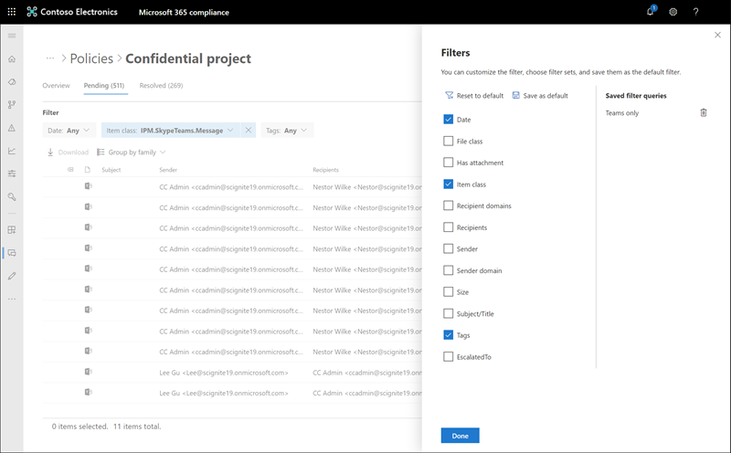

# Waarschuwingen voor communicatiecompliance onderzoeken en oplossen

Nadat u uw communicatie-compliancebeleid hebt geconfigureerd, ontvangt u waarschuwingen in het Microsoft 365 compliancecentrum voor berichtproblemen die overeenkomen met uw beleidsvoorwaarden. Volg de werkstroominstructies hier om problemen met waarschuwingen te onderzoeken en te verhelpen.

## Waarschuwingen onderzoeken

De eerste stap om problemen te onderzoeken die door uw beleid zijn gedetecteerd, is het controleren van waarschuwingen voor communicatie compliance in het Microsoft 365 compliancecentrum. Er zijn verschillende gebieden in het gebied met oplossingen voor communicatie compliance om u te helpen waarschuwingen snel te onderzoeken, afhankelijk van de manier waarop u de groep waarschuwingen wilt bekijken:

- **Pagina Communicatie compliancebeleid:** Wanneer u zich aanmeld bij het gebruik van referenties voor een beheerdersaccount in uw Microsoft 365 organisatie, selecteert u Communicatie compliance om de pagina Communicatie [https://compliance.microsoft.com](https://compliance.microsoft.com) **compliancebeleid weer te** geven.  Op deze pagina worden communicatiebeleidsregels weergegeven die zijn geconfigureerd voor Microsoft 365 organisatie en koppelingen naar aanbevolen beleidssjablonen. Elk beleid dat wordt vermeld, bevat het aantal waarschuwingen dat moet worden beoordeeld, het aantal geëscaleerde en opgeloste items, de status van het beleid en de datum en tijd van de laatste beleidsscan. Als u een beleid selecteert, worden alle waarschuwingen weergegeven die in behandeling zijn voor overeenkomsten met het beleid, selecteert u een specifieke waarschuwing om de pagina met beleidsdetails te starten en herstelacties te starten.
- **Waarschuwingen:** Navigeer naar **communicatie**  >  **compliancewaarschuwingen** om de laatste 30 dagen van waarschuwingen weer te geven die zijn gegroepeerd op beleidsvoorwaarden. In deze weergave kunt u snel zien welk communicatie compliancebeleid de meeste waarschuwingen genereert die zijn geordend op ernst. Als u herstelacties wilt starten, selecteert u het beleid dat is gekoppeld aan de waarschuwing om de pagina **Beleidsdetails te** starten. Op de pagina **Beleidsdetails** kunt u een  overzicht van de activiteiten op  de pagina Overzicht bekijken, waarschuwingsberichten controleren en erop reageren op de pagina In behandeling of de geschiedenis van gesloten waarschuwingen op de pagina **Opgelost** bekijken.
- **Rapporten:** Navigeer naar **communicatie**  >  **compliancerapporten om** rapportwidgets voor communicatie compliance weer te geven. Elke widget biedt een overzicht van activiteiten en statussen voor communicatie compliance, inclusief toegang tot diepere inzichten over beleidswedstrijden en herstelacties.

### Filters gebruiken

De volgende stap is om de berichten te sorteren, zodat u de waarschuwingen gemakkelijker kunt onderzoeken. Vanaf de **pagina Beleidsdetails** ondersteunt communicatie-compliance filtering op meerdere niveau's voor verschillende berichtvelden, om u te helpen berichten snel te onderzoeken en te controleren met beleidswedstrijden. Filteren is beschikbaar voor in behandeling zijnde en opgeloste items voor elk geconfigureerd beleid. U kunt filterquery's configureren voor een beleid of aangepaste en standaardfilterquery's configureren en opslaan voor gebruik in elk specifiek beleid. Nadat u velden voor een filter hebt geconfigureerd, ziet u de filtervelden boven aan de waarschuwingswachtrij die u kunt configureren voor specifieke filterwaarden.

Zie Filters [in](communication-compliance-feature-reference.md#filters) het artikel functieverwijzing voor een volledige lijst met filters en velddetails.

#### Een filter configureren

1. Meld u [https://compliance.microsoft.com](https://compliance.microsoft.com) aan bij het gebruik van referenties voor een beheerdersaccount in uw Microsoft 365 organisatie.

2. Ga in Microsoft 365 compliancecentrum naar **Communicatie compliance.**

3. Selecteer het **tabblad** Beleid en selecteer vervolgens een beleid voor onderzoek en dubbelklik om de pagina **Beleid te** openen.

4. Selecteer op **de pagina** Beleid het tabblad **In** behandeling **of Opgelost** om de items weer te geven die u wilt filteren.

5. Selecteer het **besturingselement Filters** om de pagina **Filterdetails** te openen.

6. Schakel een of meer selectievakjes in om filters voor deze waarschuwingen in te stellen. U kunt kiezen uit diverse filters, waaronder *Datum,* *Afzender,* *Onderwerp/Titel,* *Classificaties,* *Taal* en meer.

7. Als u het filter wilt opslaan dat is geselecteerd als standaardfilter, **selecteert** u Opslaan als standaard . Als u dit filter als opgeslagen filter wilt gebruiken, selecteert u **Klaar.**

8. Als u de geselecteerde filters wilt opslaan als een filterquery, selecteert u Het **querybesturingselement** opslaan nadat u ten minste één filterwaarde hebt geconfigureerd. Voer een naam in voor de filterquery en selecteer **Opslaan.** Dit filter is alleen beschikbaar voor dit beleid en wordt weergegeven in de sectie Opgeslagen filterquery's van de pagina Filterdetails.  

    

### Near and exact duplicate analysis (Near and Exact Duplicate Analysis) gebruiken

Communicatie compliancebeleid scant en groepeert automatisch dubbele berichten in de buurt en exact zonder extra configuratiestappen. Met deze weergave kunt u snel reageren op vergelijkbare berichten één voor één of als een groep, waardoor de berichtonderzoekslast voor revisoren wordt verkleind. Wanneer duplicaten worden gedetecteerd, worden de besturingselementen Near **Duplicates** en/of **Exact Duplicates** weergegeven op de werkbalk herstelactie. Deze weergave is niet beschikbaar als er geen near of exacte duplicaten worden gevonden.

#### Duplicaten herstellen

1. Meld u [https://compliance.microsoft.com](https://compliance.microsoft.com) aan bij het gebruik van referenties voor een beheerdersaccount in uw Microsoft 365 organisatie.

2. Ga in Microsoft 365 compliancecentrum naar **Communicatie compliance.**

3. Selecteer het **tabblad** Beleid en selecteer vervolgens een beleid voor onderzoek en dubbelklik om de pagina **Beleid te** openen.

4. Selecteer op **de** pagina Beleid het tabblad **In** behandeling **of Opgelost om** dubbele berichten weer te geven.

5. Selecteer de **besturingselementen Near Duplicates** **of Exact Duplicates** om de pagina duplicatendetails te openen.

6. Selecteer een of meer berichten om actiebesturingselementen voor deze berichten te corrigeren.

7. Selecteer **Oplossen,** **Melden,** **Escaleren** of **Downloaden** om de actie toe te passen op de geselecteerde dubbele berichten als het standaardfilter.

8. Selecteer **Sluiten** na het voltooien van de herstelacties op de berichten.

    

## Waarschuwingen corrigeren

Waar u ook waarschuwingen gaat bekijken of het filteren dat u configureert, de volgende stap is om actie te ondernemen om de waarschuwing te corrigeren. Start de waarschuwingssanering met de volgende werkstroom op de **pagina's Beleid** **of Waarschuwingen.**

### Stap 1: De basisprincipes van het bericht bekijken

 Soms is het duidelijk uit de bron of het onderwerp dat een bericht direct kan worden gesaneerd. Het kan zijn dat het bericht onjuist of onjuist is afgestemd op een beleid en dat het moet worden opgelost als een onwaar positief bericht. Selecteer het **besturingselement Onwaar** positief om de waarschuwing onmiddellijk op te lossen en uit de wachtrij met in behandeling zijnde waarschuwingen te verwijderen. Op basis van de bron- of afzendergegevens weet u mogelijk al hoe het bericht in deze omstandigheden moet worden gerouteerd of verwerkt. U kunt de **besturingselementen Tag gebruiken** als of **Escaleren** om een tag toe te wijzen aan toepasselijke berichten of om berichten te verzenden naar een aangewezen revisor.

### Stap 2: De details van het bericht bekijken

Na het bekijken van de basisprincipes van het bericht, is het tijd om een bericht te openen om de details te bekijken en om verdere herstelacties te bepalen. Selecteer een bericht om de volledige berichtkop- en hoofdtekstgegevens weer te geven. Er zijn verschillende weergaven beschikbaar om u te helpen bij het bepalen van de juiste manier van handelen:

- **Bronweergave:** deze weergave is de standaardberichtweergave die vaak wordt weergegeven op de meeste webberichtenplatforms. De koptekstgegevens zijn opgemaakt in de normale stijl en de hoofdtekst van het bericht ondersteunt niet-ingeveerde afbeeldingsbestanden en tekst met tekst die in word is gewikkeld. Als [OCR (Optical Character Recognition)](communication-compliance-feature-reference.md#optical-character-recognition-ocr) is ingeschakeld voor het beleid, worden afbeeldingen met afgedrukte of handgeschreven tekst die overeenkomen met beleid voorwaardelijke, weergegeven als een onderliggend item voor het bijbehorende bericht in deze weergave.
- **Tekstweergave:** In de tekstweergave wordt een tekstweergave met alleen een regelnummer van het bericht weergegeven en worden trefwoorden in berichten en bijlagen weergegeven voor gevoelige informatietypetermen of trefwoorden die overeenkomen met het bijbehorende communicatiebeleid. Met trefwoord markeringen kunt u snel lange berichten en bijlagen scannen op het interessegebied. In sommige gevallen kan gemarkeerde tekst alleen worden weergegeven in bijlagen voor berichten die overeenkomen met beleidsvoorwaarden. Trefwoorden markeren wordt niet ondersteund voor termen die zijn geïdentificeerd door ingebouwde classificaties die aan een beleid zijn toegewezen. Ingesloten bestanden worden niet weergegeven en de regelnummering van deze weergave is handig voor het verwijzen naar relevante details tussen meerdere revisoren.
- **Aantekeningen weergeven:** met deze weergave kunnen revisoren aantekeningen rechtstreeks toevoegen aan het bericht dat is opgeslagen in de weergave van het bericht. Als [OCR is](communication-compliance-feature-reference.md#optical-character-recognition-ocr) ingeschakeld voor het beleid, worden afbeeldingen met afgedrukte of handgeschreven tekst die overeenkomen met beleid voorwaardelijke, weergegeven als een onderliggend item voor het bijbehorende bericht in deze weergave en kunnen ze worden geannoteerd.
- **Gespreksweergave (voorbeeld)**: Deze weergave is beschikbaar voor Microsoft Teams chatberichten en bevat maximaal vijf berichten voor en na een waarschuwingsbericht om revisoren te helpen de activiteit in de gesprekscontext te bekijken. Deze context helpt revisoren om snel berichten te evalueren en beter geïnformeerde beslissingen te nemen over het oplossen van berichten. Realtime bericht toevoegingen aan gesprekken worden weergegeven, inclusief alle inlineafbeeldingen, emoji's en stickers die beschikbaar zijn in Teams. Afbeeldings- of tekstbestandsbijlagen bij berichten worden niet weergegeven. Meldingen worden automatisch weergegeven voor berichten die zijn bewerkt of voor berichten die zijn verwijderd uit het gespreksvenster. Wanneer een bericht is opgelost, blijven de bijbehorende gespreksberichten niet behouden met het opgeloste bericht. Gespreksberichten zijn beschikbaar tot 60 dagen nadat het waarschuwingsbericht is geïdentificeerd.
- **Gebruikersgeschiedenis:** In de gebruikersgeschiedenisweergave worden alle andere waarschuwingen weergegeven die zijn gegenereerd door een communicatie-compliancebeleid voor de gebruiker die het bericht verstuurt.
- **Patroon gedetecteerde melding:** Veel intimiderende en pestende acties in de tijd en omvatten terugkerende exemplaren van hetzelfde gedrag door een gebruiker. De *melding Patroon gedetecteerd* wordt weergegeven in de waarschuwingsdetails en trekt de aandacht voor de waarschuwing. Detectie van patronen gebeurt per beleid en evalueert het gedrag in de afgelopen 30 dagen wanneer ten minste twee berichten door een afzender naar dezelfde geadresseerde worden verzonden. Revisoren en revisoren kunnen deze melding gebruiken om herhaald gedrag te identificeren om de waarschuwing zo nodig te evalueren.
- **Weergave Vertalen weergeven:** met deze weergave wordt de tekst van  het waarschuwingsbericht automatisch geconververd naar de taal die is geconfigureerd in de instelling Weergegeven taal in het Microsoft 365 voor elke revisor. Met de weergave Vertalen kunt u onderzoeksondersteuning voor organisaties met meertalige gebruikers breder maken en hoeft u geen extra vertaalservices meer te gebruiken buiten het controleproces voor communicatie compliance. Met Microsoft Translate-services kan de weergave Vertalen zo nodig worden in- en uitgeschakeld en wordt een breed scala aan talen ondersteund. Zie Microsoft Vertalen Talen voor een volledige lijst [met ondersteunde talen.](https://www.microsoft.com/translator/business/languages/) Talen die worden weergegeven in de *Vertalen taallijst* worden ondersteund in de weergave Vertalen.

    

### Stap 3: Een herstelactie bepalen

Nu u de details van het bericht voor de waarschuwing hebt bekeken, kunt u verschillende herstelacties kiezen:

- **Oplossen:** Als u **het** besturingselement Oplossen  selecteert, wordt het bericht onmiddellijk verwijderd uit de wachtrij met waarschuwingen in behandeling en kan er geen verdere actie worden ondernomen op het bericht. Door Oplossen **te** selecteren, hebt u de waarschuwing in feite zonder verdere classificatie gesloten en kan deze niet opnieuw worden geopend voor verdere acties. Alle opgeloste berichten worden weergegeven op **het tabblad** Opgelost.
- **Onwaar positief:** u kunt een bericht altijd als een onwaar positief op elk moment tijdens de werkstroom voor berichtbeoordeling oplossen. Fout-positief betekent dat de waarschuwing niet kan worden gebruikt of dat de waarschuwing onjuist is gegenereerd door het waarschuwingsproces. Het bericht kan niet opnieuw worden geopend en alle fout-positieve berichten worden weergegeven op **het tabblad** Opgelost.
- **Power Automate (voorbeeld)**: Gebruik een Power Automate om procestaken voor een waarschuwingsbericht te automatiseren. Communicatie compliance bevat standaard de *Meldingsmanager* wanneer een gebruiker een waarschuwingssjabloon communicatie compliance heeft die revisoren kunnen gebruiken om het meldingsproces voor gebruikers met berichtwaarschuwingen te automatiseren. Voor meer informatie over het maken en beheren van Power Automate in communicatie compliance, zie [het](communication-compliance-feature-reference.md#power-automate-flows) artikel met de functie Communicatie compliance.
- **Tag als**: Tag het bericht als *compatibel*,  *niet-compatibel* of net zo twijfelachtig als het betrekking heeft op het beleid en de standaarden voor uw organisatie. Door tags toe te voegen en opmerkingen te labelen, kunt u beleidswaarschuwingen microfilteren voor escalaties of als onderdeel van andere interne controleprocessen. Nadat het labelen is voltooid, kunt u er ook voor kiezen om het bericht op te lossen om het bericht uit de wachtrij voor in behandeling zijnde revisie te verplaatsen.
- **Melding:** U kunt het besturingselement **Melding** gebruiken om een aangepaste kennisgevingssjabloon toe te wijzen aan de waarschuwing en om een waarschuwing naar de gebruiker te verzenden. Kies de juiste kennisgevingssjabloon die  is geconfigureerd in het gebied Communicatie **compliance-instellingen** en selecteer Verzenden naar e-mail een herinnering naar de gebruiker die het bericht heeft verzonden en om het probleem op te lossen.
- **Escaleren:** Met **het besturingselement Escaleren** kunt u kiezen wie er nog meer in uw organisatie het bericht moeten controleren. Kies uit een lijst met revisoren die zijn geconfigureerd in het communicatiebeleid voor het verzenden van een e-mailmelding waarin u om aanvullende controle van de berichtmelding vraagt. De geselecteerde revisor kan een koppeling in de e-mailmelding gebruiken om rechtstreeks naar items te gaan die naar de revisor zijn geëscaleerd voor controle.
- **Escaleren voor onderzoek:** met behulp van het besturingselement Escaleren voor onderzoek kunt u een nieuwe Advanced eDiscovery [maken](overview-ediscovery-20.md) voor enkele of meerdere berichten.  U geeft een naam en notities op voor de nieuwe zaak, en de gebruiker die het bericht heeft verzonden dat overeenkomt met het beleid, wordt automatisch toegewezen als bewaarder van de zaak. U hebt geen extra machtigingen nodig om de zaak te beheren. Als u een zaak maakt, wordt het bericht niet opgelost of wordt er geen nieuwe tag voor het bericht aan het maken. U kunt in totaal 100 berichten selecteren bij het maken van een Advanced eDiscovery tijdens het herstelproces. Berichten in alle communicatiekanalen die worden gecontroleerd op communicatie-compliance, worden ondersteund. U kunt bijvoorbeeld 50 Microsoft Teams-chats, 25 Exchange Online e-mailberichten en 25 Yammer-berichten selecteren wanneer u een nieuwe Advanced eDiscovery-case voor een gebruiker opent.
- **Bericht verwijderen in Teams:** Met het besturingselement Bericht verwijderen **in Teams** kunt u ongepaste berichten en inhoud blokkeren die zijn geïdentificeerd in waarschuwingen van Microsoft Teams-kanalen en 1:1- en groepschats. Verwijderde berichten en inhoud worden vervangen door een beleidstip waarin wordt uitgelegd dat deze is geblokkeerd en het beleid dat van toepassing is op het verwijderen ervan uit de weergave. Geadresseerden krijgen een koppeling in de beleidstip voor meer informatie over het toepasselijke beleid en het revisieproces. De afzender ontvangt een beleidstip voor het geblokkeerde bericht en de inhoud, maar kan de details van het geblokkeerde bericht en de inhoud bekijken voor context met betrekking tot de verwijdering.

    

### Stap 4: bepalen of berichtgegevens moeten worden gearchiveerd buiten communicatie-compliance

Berichtdetails kunnen worden geëxporteerd of gedownload als u de berichten wilt archiveren in een aparte opslagoplossing. Als u **het besturingselement** Downloaden selecteert, worden automatisch geselecteerde berichten toegevoegd aan .ZIP bestand dat kan worden opgeslagen in opslag buiten Microsoft 365.
