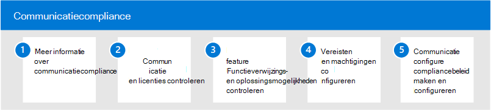

# Naleving van communicatie in Microsoft 365

Het beschermen van gevoelige informatie en het opsporen en optreden bij incidenten met pesterijen op het werk is een belangrijk onderdeel van de naleving van interne beleidsregels en standaarden. Communicatie compliance in Microsoft 365 helpt deze risico's te minimaliseren door u te helpen snel e-mail- en communicatieacties te detecteren, vast te leggen en te Microsoft Teams uitvoeren. Deze omvatten ongepaste communicatie met grof taalgebruik, bedreigingen en pesterijen en communicatie die gevoelige informatie binnen en buiten uw organisatie deelt.

## Communicatie compliance configureren voor Microsoft 365

Gebruik de volgende stappen om communicatie compliance voor uw organisatie te configureren:

1. Meer informatie [over communicatie compliance](communication-compliance.md) in Microsoft 365
2. [Communicatie-compliance plannen en](communication-compliance-plan.md) licenties [controleren](communication-compliance-configure.md#subscriptions-and-licensing)
3. [Functieverwijzings- en oplossingsmogelijkheden controleren](communication-compliance-feature-reference.md)
4. Vereisten [en](communication-compliance-configure.md#step-2-required-enable-the-audit-log) [machtigingen configureren](communication-compliance-configure.md#step-1-required-enable-permissions-for-communication-compliance)
5. Communicatie compliancebeleid [maken en configureren](communication-compliance-configure.md#step-5-required-create-a-communication-compliance-policy)

## Meer informatie over communicatie compliance

- [Waarschuwingen onderzoeken en corrigeren](communication-compliance-investigate-remediate.md)
- [Case study : Contoso configureert snel een aanstootgevend taalbeleid voor Microsoft Teams, Exchange en Yammer communicatie](communication-compliance-case-study.md)