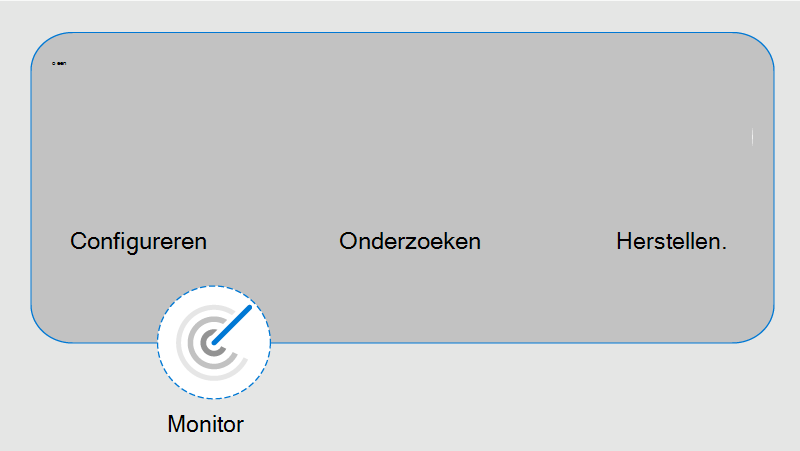

# Meer informatie over communicatie compliance in Microsoft 365Learn about communication compliance in Microsoft 365

Communicatie compliance is een insider-risicooplossing in Microsoft 365 waarmee communicatierisico's worden geminimaliseerd door u te helpen ongepaste berichten in uw organisatie te detecteren, vast te leggen en erop te reageren.Communication compliance is an insider risk solution in Microsoft 365 that helps minimize communication risks by helping you detect, capture, and act on inappropriate messages in your organization. Met vooraf gedefinieerde en aangepaste beleidsregels kunt u interne en externe communicatie scannen op beleidswedstrijden, zodat deze kunnen worden onderzocht door aangewezen revisoren.Pre-defined and custom policies allow you to scan internal and external communications for policy matches so they can be examined by designated reviewers. Revisoren kunnen gescande e-mail, Microsoft Teams- Yammer- of externe communicatie in uw organisatie onderzoeken en passende acties ondernemen om ervoor te zorgen dat ze voldoen aan de berichtstandaarden van uw organisatie.Reviewers can investigate scanned email, Microsoft Teams, Yammer, or third-party communications in your organization and take appropriate actions to make sure they're compliant with your organization's message standards.

Communicatie-compliancebeleid in Microsoft 365 helpen u veel moderne uitdagingen op het gebied van compliance en interne en externe communicatie het hoofd te bieden, zoals:Communication compliance policies in Microsoft 365 help you overcome many modern challenges associated with compliance and internal and external communications, including:

- Toenemende typen communicatiekanalen scannenScanning increasing types of communication channels
- Het toenemende volume van berichtgegevensThe increasing volume of message data
- Handhaving van regelgeving en het risico op boetesRegulatory enforcement and the risk of fines

Daarnaast kan er een scheiding van taken zijn tussen uw IT-beheerders en uw compliancebeheerteam.Additionally, there may be a separation of duties between your IT admins and your compliance management team. Communicatie compliance ondersteunt de scheiding tussen configuratie van beleidsregels en het onderzoeken en controleren van berichten.Communication compliance supports the separation between configuration of policies and the investigation and review of messages. De IT-groep voor uw organisatie kan bijvoorbeeld verantwoordelijk zijn voor het instellen van rolmachtigingen voor communicatie compliance, groepen en beleidsregels, en voor revisoren en revisoren die verantwoordelijk zijn voor het triage, controleren en beperken van berichten.For example, the IT group for your organization may be responsible for setting up communication compliance role permissions, groups, and policies and investigators and reviewers may be responsible for message triage, review, and mitigation actions.

Zie de volgende video's voor de meest recente Ignite-presentaties voor communicatie compliance:For the latest Ignite presentations for communication compliance, see the following videos:

- [Een cultuur van veiligheid en integratie met communicatie-compliance bevorderenFoster a culture of safety and inclusion with communication compliance](https://www.youtube.com/watch?v=oLVzxcaef3w)
- [Informatie over het beperken van communicatierisico's binnen uw organisatieLearn how to reduce communication risks within your organization](https://www.youtube.com/watch?v=vzARb1YaxGo)
- [Voldoen aan nalevingsvereisten voor regelgeving met communicatie-complianceFulfill regulatory compliance requirements with communication compliance](https://www.youtube.com/watch?v=gagOhtCBfgU)
- [Beter met Microsoft Teams - Meer informatie over de meest recente Teams geïntegreerde functies in communicatie complianceBetter with Microsoft Teams - Learn more about the latest native Teams integrated features in communication compliance](https://www.youtube.com/watch?v=m4jukD5Fh-o)

Zie voor een kort overzicht van communicatie compliance het kanaal [Pesterijen](https://youtu.be/z33ji7a7Zho) op de werkplek detecteren en reageren met Communicatie compliance in Microsoft 365 video op het [Microsoft-kanaal Mechanica.](https://www.youtube.com/user/OfficeGarageSeries)For a quick overview of communication compliance, see the [Detect workplace harassment and respond with Communication Compliance in Microsoft 365](https://youtu.be/z33ji7a7Zho) video on the [Microsoft Mechanics channel](https://www.youtube.com/user/OfficeGarageSeries).

## Scenario's voor communicatie complianceScenarios for communication compliance

Communicatie compliancebeleid kan helpen bij het controleren van berichten in uw organisatie op verschillende belangrijke compliancegebieden:Communication compliance policies can assist with reviewing messages in your organization in several important compliance areas:

- **Bedrijfsbeleid****Corporate policies**

    Gebruikers moeten voldoen aan acceptabel gebruik, ethische standaarden en ander bedrijfsbeleid in al hun zakelijke communicatie.Users must comply with acceptable use, ethical standards, and other corporate policies in all their business-related communications. Communicatie-compliancebeleid kan beleids matches detecteren en u helpen corrigerende acties te ondernemen om dit soort incidenten te beperken.Communication compliance policies can detect policy matches and help you take corrective actions to help mitigate these types of incidents. U kunt bijvoorbeeld gebruikerscommunicatie in uw organisatie scannen op mogelijke problemen met personeel, zoals pesterijen of het gebruik van ongepaste of aanstootgevende taal.For example, you could scan user communications in your organization for potential human resources concerns such as harassment or the use of inappropriate or offensive language.

- **Risicobeheer****Risk management**

    Organisaties zijn verantwoordelijk voor alle communicatie die wordt verspreid over hun infrastructuur en bedrijfsnetwerksystemen.Organizations are responsible to all communications distributed throughout their infrastructure and corporate network systems. Als u communicatie-compliancebeleid gebruikt om mogelijke juridische blootstelling en risico's te identificeren en te beheren, kunnen risico's worden geminimaliseerd voordat ze bedrijfsactiviteiten kunnen beschadigen.Using communication compliance policies to help identify and manage potential legal exposure and risk can help minimize risks before they can damage corporate operations. U kunt bijvoorbeeld berichten in uw organisatie scannen op ongeautoriseerde communicatie en conflicten over vertrouwelijke projecten, zoals aanstaande overnames, fusies, winstverschaffing, reorganisaties of leiderschapsteamwijzigingen.For example, you could scan messages in your organization for unauthorized communications and conflicts of interest about confidential projects such as upcoming acquisitions, mergers, earnings disclosures, reorganizations, or leadership team changes.

- **Naleving van regelgeving****Regulatory compliance**

    De meeste organisaties moeten voldoen aan een bepaald type nalevingsstandaard voor regelgeving als onderdeel van hun normale bedrijfsprocedures.Most organizations must comply with some type of regulatory compliance standards as part of their normal operating procedures. Deze voorschriften vereisen vaak dat organisaties een soort toezicht- of toezichtproces implementeren voor berichten die geschikt zijn voor hun branche.These regulations often require organizations to implement some type of supervisory or oversight process for messaging that is appropriate for their industry. Regel 3110 (Financial Industry Regulatory Authority) (FINRA) is een goed voorbeeld van de vereiste dat organisaties toezichtprocedures hebben voor het scannen van gebruikerscommunicatie en het type bedrijf waarin de onderneming actief is.The Financial Industry Regulatory Authority (FINRA) Rule 3110 is a good example of a requirement for organizations to have supervisory procedures in place to scan user communications and the types of businesses in which it engages. Een ander voorbeeld kan een noodzaak zijn om communicatie tussen makelaars en handelaars in uw organisatie te controleren om te beschermen tegen mogelijke witwaspraktijken, handel met voorkennis, collusie of omkopingsactiviteiten.Another example may be a need to review broker-dealer communications in your organization to safeguard against potential money laundering, insider trading, collusion, or bribery activities. Communicatie compliancebeleid kan uw organisatie helpen aan deze vereisten te voldoen door een proces aan te bieden voor zowel scannen als rapporteren over bedrijfscommunicatie.Communication compliance policies can help your organization meet these requirements by providing a process to both scan and report on corporate communications. Zie Belangrijke compliance- en beveiligingsoverwegingen voor de Amerikaanse bank- en kapitaalmarkten voor meer informatie over ondersteuning [voor financiële organisaties.](../solutions/financial-services-secure-collaboration.md)For more information on support for financial organizations, see [Key compliance and security considerations for US banking and capital markets](../solutions/financial-services-secure-collaboration.md).

## Belangrijke functiegebiedenKey feature areas

Communicatie compliance in Microsoft 365 biedt verschillende belangrijke functies om complianceproblemen op uw berichtenplatforms aan te pakken:Communication compliance in Microsoft 365 offers several important features to help address compliance concerns on your messaging platforms:

- Intelligente aanpasbare sjablonenIntelligent customizable templates
- Flexibele herstelwerkstromenFlexible remediation workflows
- Actie-inzichtenActionable insights

### Intelligente aanpasbare sjablonenIntelligent customizable templates

Met intelligente aanpasbare sjablonen in communicatie compliance kunt u machine learning toepassen om op intelligente wijze communicatieovertredingen in uw organisatie te detecteren.Intelligent customizable templates in communication compliance allow you to apply machine learning to intelligently detect communication violations in your organization.

- **Aanpasbare vooraf geconfigureerde sjablonen:** Met nieuwe beleidssjablonen kunt u de meest voorkomende communicatierisico's aanpakken.**Customizable pre-configured templates**: New policy templates help address the most common communications risks. De eerste beleidscreatie en follow-on-update gaan nu sneller met vooraf gedefinieerde anti-pesterijen en aanstootgevende taal, gevoelige informatie, conflicterende sjablonen en nalevingssjablonen voor regelgeving.Initial policy creation and follow-on updating are now quicker with pre-defined anti-harassment and offensive language, sensitive information, conflict of interest, and regulatory compliance templates.
- Nieuwe ondersteuning voor **machine learning:** Ingebouwde bedreigingen,  pesterijen, grof taalgebruik en classificaties voor afbeeldingen helpen bij het verminderen van fout-positieven in gescande berichten, waardoor revisoren tijd besparen tijdens het onderzoek en herstelproces.**New machine learning support**: Built-in threat, harassment, profanity, and image [classifiers](classifier-get-started-with.md) help reduce false positives in scanned messages, saving reviewers time during the investigation and remediation process.
- **Verbeterde opbouwer van** voorwaarden: Het configureren van beleidsvoorwaarden is nu gestroomlijnd in één geïntegreerde ervaring in de beleidswizard, waardoor verwarring over de manier waarop voorwaarden voor beleid worden toegepast, wordt verkleind.**Improved condition builder**: Configuring policy conditions is now streamlined into a single, integrated experience in the policy wizard, reducing confusion in how conditions are applied for policies.

### Flexibele herstelwerkstromenFlexible remediation workflows

Met ingebouwde herstelwerkstromen kunt u snel berichten identificeren en actie ondernemen met beleidswedstrijden in uw organisatie.Built-in remediation workflows allow you to quickly identify and take action on messages with policy matches in your organization. De volgende nieuwe functies verhogen de efficiëntie voor onderzoek- en herstelactiviteiten:The following new features increase efficiency for investigation and remediation activities:

- **Flexibele** herstelwerkstroom: met de nieuwe herstelwerkstroom kunt u snel actie ondernemen op beleidswedstrijden, waaronder nieuwe opties om berichten te escaleren naar andere revisoren en om e-mailmeldingen te verzenden naar gebruikers met beleidswedstrijden.**Flexible remediation workflow**: New remediation workflow helps you quickly take action on policy matches, including new options to escalate messages to other reviewers and to send email notifications to users with policy matches.
- **Gespreksbeleidsmatching:** Berichten in gesprekken worden gegroepeerd op beleidsmatchen om u meer inzicht te geven in hoe gesprekken zich verhouden tot uw communicatiebeleid.**Conversation policy matching**: Messages in conversations are grouped by policy matches to give you more visibility about how conversations relate to your communication policies. In de weergave Meldingen  in behandeling worden bijvoorbeeld automatisch alle berichten in een Teams-kanaal met overeenkomsten voor uw beleid voor aanstootgevende taal.For example, conversation policy matching in the *Pending Alerts* view will automatically show all messages in a Teams channel that have matches for your Offensive Language policy. Andere berichten in het gesprek die niet overeenkomen met het beleid voor aanstootgevende taal, worden niet weergegeven.Other messages in the conversation that don't match the Offensive Language policy would not be displayed.
- **Trefwoord markeren:** voorwaarden die overeenkomen met beleidsvoorwaarden zijn gemarkeerd in de tekstweergave van het bericht, om revisoren te helpen snel beleidswaarschuwingen te vinden en te corrigeren.**Keyword highlighting**: Terms matching policy conditions are highlighted in the message text view to help reviewers quickly locate and remediate policy alerts.
- **Exacte en bijna dubbele** detectie: Naast het scannen van exacte termen die overeenkomen met communicatie compliancebeleid, worden in de buurt van dubbele detectiegroepen tekstuele vergelijkbare termen en berichten bij elkaar gebruikt om uw controleproces te versnellen.**Exact and near duplicate detection**: In addition to scanning for exact terms matching communication compliance policies, near duplicate detection groups textually similar terms and messages together to help speed up your review process.
- **OcR (Optical Character Recognition) (preview)**: Afgedrukte en handgeschreven tekst scannen, detecteren en onderzoeken in afbeeldingen die zijn ingesloten of zijn gekoppeld aan e-mail of Microsoft Teams chatberichten.**Optical character recognition (OCR) (preview)**: Scan, detect, and investigate printed and handwritten text within images embedded or attached to email or Microsoft Teams chat messages.
- **Nieuwe filters:** beleidswaarschuwingen sneller onderzoeken en corrigeren met berichtfilters voor verschillende velden, waaronder afzender, geadresseerde, datum, domeinen en nog veel meer.**New filters**: Investigate and remediate policy alerts faster with message filters for several fields, including sender, recipient, date, domains, and many more.
- **Verbeterde berichtweergaven:** acties voor onderzoek en herstel zijn nu sneller met nieuwe berichtbron-, tekst- en aantekeningenweergaven.**Improved message views**: Investigation and remediation actions are now quicker with new message source, text, and annotation views. Berichtbijlagen kunnen nu worden weergegeven om volledige context te bieden bij het uitvoeren van herstelacties.Message attachments are now viewable to provide complete context when taking remediation actions.
- **Gebruikersgeschiedenisweergave:** Met de historische weergave van alle herstelactiviteiten van gebruikersberichten, zoals meldingen uit het verleden en escalaties voor beleidswedstrijden, krijgen revisoren nu meer context tijdens het herstelwerkstroomproces.**User history view**: Historical view of all user message remediation activities, such as past notifications and escalations for policy matches, now provides reviewers with more context during the remediation workflow process. Voor de eerste keer of terugkerende exemplaren van beleids matches voor gebruikers zijn nu gearchiveerd en gemakkelijk te bekijken.First-time or repeat instances of policy matches for users are now archived and easily viewable.
- **Melding van patroon gedetecteerd:** Veel pesterijen en pesten vinden plaats in de tijd en omvatten terugkerende exemplaren van hetzelfde gedrag door een gebruiker.**Pattern detected notification**: Many harassing and bullying actions take place over time and involve reoccurring instances of the same behavior by a user. Het nieuwe patroon gedetecteerde melding die wordt weergegeven in waarschuwingsdetails, helpt de aandacht te vestigen op deze waarschuwingen en dit type gedrag.The new pattern detected notification displayed in alert details helps raise attention to these alerts and this type of behavior.
- **Weergave Vertalen weergeven:** snel berichtdetails in acht talen onderzoeken met ondersteuning voor vertalen in de herstelwerkstroom.**Show Translate view**: Quickly investigate message details in eight languages using translate support in the remediation workflow. Berichten in andere talen worden automatisch geconverteerd naar de weergavetaal van de revisor.Messages in other languages are automatically converted to the display language of the reviewer.

### Actie-inzichtenActionable insights

Nieuwe interactieve dashboards voor waarschuwingen, beleidswedstrijden, acties en trends helpen u snel de status van in behandeling zijnde en opgeloste waarschuwingen in uw organisatie te bekijken.New interactive dashboards for alerts, policy matches, actions, and trends help you quickly view the status of pending and resolved alerts in your organization.

- **Proactieve intelligente waarschuwingen:** Waarschuwingen voor beleidswedstrijden die onmiddellijke aandacht vereisen, omvatten nieuwe dashboards voor items die zijn gesorteerd op ernst en nieuwe automatische e-mailmeldingen die zijn verzonden naar aangewezen revisoren.**Proactive intelligent alerts**: Alerts for policy matches requiring immediate attention include new dashboards for pending items sorted by severity and new automatic email notifications sent to designated reviewers.
- **Interactieve dashboards:** in nieuwe dashboards worden beleidswedstrijden, lopende en opgeloste acties en trends van gebruikers en beleid weergegeven.**Interactive dashboards**: New dashboards display policy matches, pending and resolved actions, and trends by users and policy.
- **Ondersteuning voor controle:** een volledig logboek met beleidsactiviteiten en controleactiviteiten wordt eenvoudig geëxporteerd vanuit het Microsoft 365 compliancecentrum om controleaanvragen te ondersteunen.**Auditing support**: A full log of policy and review activities is easily exported from the Microsoft 365 compliance center to help support audit review requests.

## Integratie met Microsoft 365 servicesIntegration with Microsoft 365 services

Communicatie compliancebeleid scant en legt berichten vast in verschillende communicatiekanalen om complianceproblemen snel te controleren en te verhelpen:Communication compliance policies scan and capture messages across several communication channels to help you quickly review and remediate compliance issues:

- **Microsoft Teams:** Chatcommunicatie voor openbare en persoonlijke [Microsoft Teams](/MicrosoftTeams/Teams-overview) kanalen en afzonderlijke chats worden ondersteund in communicatie compliance als een zelfstandige kanaalbron of met andere Microsoft 365 services.**Microsoft Teams**: Chat communications for public and private [Microsoft Teams](/MicrosoftTeams/Teams-overview) channels and individual chats are supported in communication compliance as a standalone channel source or with other Microsoft 365 services. U moet handmatig afzonderlijke gebruikers, distributiegroepen of specifieke Microsoft Teams-kanalen toevoegen wanneer u gebruikers en groepen selecteert om toezicht te houden in een communicatie compliancebeleid.You'll need to manually add individual users, distribution groups, or specific Microsoft Teams channels when you select users and groups to supervise in a communication compliance policy.
- **Exchange Online:** Alle postvakken die worden gehost op Exchange Online [in](/Exchange/exchange-online) uw Microsoft 365 komen in aanmerking voor scannen.**Exchange Online**: All mailboxes hosted on [Exchange Online](/Exchange/exchange-online) in your Microsoft 365 organization are eligible for scanning. E-mailberichten en bijlagen die overeenkomen met de voorwaarden voor communicatie compliancebeleid zijn direct beschikbaar voor monitoring en in compliancerapporten.Emails and attachments matching communication compliance policy conditions are instantly available for monitoring and in compliance reports. Exchange Online is nu een optioneel bronkanaal en is niet meer vereist in communicatie compliancebeleid.Exchange Online is now an optional source channel and is no longer required in communication compliance policies.
- **Yammer:** Privéberichten en openbare communitygesprekken [in](/yammer/yammer-landing-page) Yammer worden ondersteund in communicatie compliancebeleid.**Yammer**: Private messages and public community conversations in [Yammer](/yammer/yammer-landing-page) are supported in communication compliance policies. Yammer is een optioneel kanaal en moet in de native [modus zijn om](/yammer/configure-your-yammer-network/overview-native-mode) het scannen van berichten en bijlagen te ondersteunen.Yammer is an optional channel and must be in [native mode](/yammer/configure-your-yammer-network/overview-native-mode) to support scanning of messages and attachments.
- **Skype voor Bedrijven Online: Compliancebeleid** voor communicatie ondersteunt het scannen van chatcommunicatie en bijbehorende bijlagen in [Skype voor Bedrijven Online.](/SkypeForBusiness/skype-for-business-online)**Skype for Business Online**: Communication compliance policies support scanning chat communications and associated attachments in [Skype for Business Online](/SkypeForBusiness/skype-for-business-online).
- **Bronnen van derden:** U kunt  berichten van externe bronnen scannen op gegevens die zijn geïmporteerd in postvakken in uw Microsoft 365 organisatie.**Third-party sources**: You can scan messages from [third-party sources](archiving-third-party-data.md) for data imported into mailboxes in your Microsoft 365 organization. Communicatie compliance ondersteunt verbindingen met verschillende populaire platforms, waaronder Instant Bloomberg en andere.Communication compliance supports connections to several popular platforms, including Instant Bloomberg and others.

Zie Ondersteunde communicatietypen voor meer informatie over ondersteuning voor berichtenkanalen in communicatie [compliancebeleid.](communication-compliance-feature-reference.md#supported-communication-types)To learn more about messaging channel support in communication compliance policies, see [supported communication types](communication-compliance-feature-reference.md#supported-communication-types).

## WerkstroomWorkflow

Met communicatie-compliance kunt u veelvoorkomende pijnpunten aanpakken die samenhangen met het voldoen aan interne beleidsregels en nalevingsvereisten voor regelgeving.Communication compliance helps you address common pain points associated with complying with internal policies and regulatory compliance requirements. Met gerichte beleidssjablonen en een flexibele werkstroom kunt u actiegerichte inzichten gebruiken om gedetecteerde complianceproblemen snel op te lossen.With focused policy templates and a flexible workflow, you can use actionable insights to quickly resolve detected compliance issues.

Voor het identificeren en oplossen van complianceproblemen met communicatie-compliance in Microsoft 365 wordt de volgende werkstroom gebruikt:Identifying and resolving compliance issues with communication compliance in Microsoft 365 uses the following workflow:

### ConfigurerenConfigure

In deze werkstroomstap identificeert u uw nalevingsvereisten en configureert u toepasselijke communicatie-compliancebeleidsregels.In this workflow step, you identify your compliance requirements and configure applicable communication compliance policies. Beleidssjablonen zijn een uitstekende manier om niet alleen snel een nieuw compliancebeleid te configureren, maar ook om beleid snel te wijzigen en bij te werken naarmate uw vereisten veranderen.Policy templates are a great way to not only quickly configure a new compliance policy, but to also quickly modify and update policies as your requirements change. U kunt bijvoorbeeld snel een beleid voor aanstootgevende taal en ongewenste e-mail voor communicatie voor een kleine groep gebruikers testen voordat u een beleid configureert voor alle gebruikers in uw organisatie.For example, you may want to quickly test a policy for offensive language and anti-harassment on communications for a small group of users before configuring a policy for all users in your organization.

>[!Important]
>Globale beheerders hebben standaard geen toegang tot communicatie-compliancefuncties.By default, Global Administrators do not have access to communication compliance features. Zie Communicatie compliance beschikbaar maken in uw organisatie als u machtigingen voor communicatie compliancefuncties [wilt inschakelen.](communication-compliance-configure.md#step-1-required-enable-permissions-for-communication-compliance)To enable permissions for communication compliance features, see [Make communication compliance available in your organization](communication-compliance-configure.md#step-1-required-enable-permissions-for-communication-compliance).

U kunt kiezen uit de volgende beleidssjablonen in het Microsoft 365 compliancecentrum:You can choose from the following policy templates in the Microsoft 365 compliance center:

- **Aanstootgevende** of bedreigende taal: gebruik deze sjabloon om snel een beleid te maken dat gebruikmaakt van ingebouwde classificaties om automatisch inhoud te detecteren die kan worden beschouwd als beledigend of aanstootgevend.**Offensive or threatening language**: Use this template to quickly create a policy that uses built-in classifiers to automatically detect content that may be considered abusive or offensive.
- **Gevoelige informatie:** Gebruik deze sjabloon om snel een beleid te maken voor het scannen van communicatie met gedefinieerde typen gevoelige informatie of trefwoorden om ervoor te zorgen dat belangrijke gegevens niet worden gedeeld met personen die geen toegang moeten hebben.**Sensitive information**: Use this template to quickly create a policy to scan communications containing defined sensitive information types or keywords to help make sure that important data isn't shared with people that shouldn't have access.
- **Naleving van regelgeving:** Gebruik deze sjabloon om snel een beleid te maken om communicatie te scannen op verwijzingen naar standaard financiële voorwaarden die zijn gekoppeld aan wettelijke standaarden.**Regulatory compliance**: Use this template to quickly create a policy to scan communications for references to standard financial terms associated with regulatory standards.
- **Conflict van belang:** Gebruik deze sjabloon om snel een beleid te maken om de communicatie tussen twee groepen of twee gebruikers te controleren om conflicten te voorkomen.**Conflict of interest**: Use this template to quickly create a policy to monitor communications between two groups or two users to help avoid conflicts of interest.
- **Aangepast beleid:** Gebruik deze sjabloon om specifieke communicatiekanalen, afzonderlijke detectievoorwaarden en de hoeveelheid inhoud te configureren die u in uw organisatie wilt controleren en controleren.**Custom policy**: Use this template to configure specific communication channels, individual detection conditions, and the amount of content to monitor and review in your organization.

### OnderzoekenInvestigate

In deze stap gaat u dieper in op de problemen die zijn gedetecteerd als overeenkomend met uw communicatie-compliancebeleid.In this step, you look deeper into the issues detected as matching your communication compliance policies. Deze stap bevat de volgende acties die beschikbaar zijn in het Microsoft 365 compliancecentrum:This step includes the following actions available in the Microsoft 365 compliance center:

- **Waarschuwingen:** Wanneer een bericht overeenkomt met een beleidsvoorwaarde, wordt automatisch een waarschuwing gegenereerd.**Alerts**: When a message matches a policy condition, an alert is automatically generated. Voor elke waarschuwing ziet u de status, de ernst, de tijd die is gedetecteerd en of er een Advanced eDiscovery is toegewezen en de status.For each alert, you can see the status, the severity, the time detected, and if an Advanced eDiscovery case is assigned and its status. Nieuwe waarschuwingen worden weergegeven op de startpagina communicatie compliance en de **pagina Waarschuwingen** en worden weergegeven in volgorde van ernst.New alerts are displayed on the communication compliance home page and the **Alerts** page and are listed in order of severity.
- **Probleembeheer:** Voor elke waarschuwing kunt u onderzoekende acties uitvoeren om het probleem te verhelpen dat in het bericht is gedetecteerd.**Issue management**: For each alert, you can take investigative actions to help remediate the issue detected in the message.
- **Documentbeoordeling:** Tijdens het onderzoek naar een probleem kunt u verschillende weergaven van het bericht gebruiken om het gedetecteerde probleem correct te evalueren.**Document review**: During the investigation of an issue, you can use several views of the message to help properly evaluate the detected issue. De weergaven bevatten een gespreksoverzicht, alleen-tekst, aantekeningen en detailweergaven van het communicatiegesprek.The views include a conversation summary, text-only, annotated, and detail views of the communication conversation.
- **Gebruikersactiviteitsgeschiedenis controleren:** Bekijk de geschiedenis van activiteiten van gebruikersberichten en herstelacties, zoals meldingen uit het verleden en escalaties, voor beleidsafmeldingen.**Reviewing user activity history**: View the history of user message activities and remediation actions, such as past notifications and escalations, for policy matches.
- **Filters:** Gebruik filters zoals afzender, geadresseerde, datum en onderwerp om snel de berichtwaarschuwingen te beperken die u wilt controleren.**Filters**: Use filters such as sender, recipient, date, and subject to quickly narrow down the message alerts that you want to review.

### HerstelRemediate

De volgende stap is het oplossen van complianceproblemen met communicatie die u hebt onderzocht met de volgende opties:The next step is to remediate communication compliance issues you've investigated using the following options:

- **Oplossen:** Nadat u een probleem hebt beoordeeld, kunt u dit verhelpen door de waarschuwing op te lossen.**Resolve**: After reviewing an issue, you can remediate by resolving the alert. Als een waarschuwing wordt opgelost, wordt deze verwijderd uit de wachtrij met in behandeling zijnde waarschuwingen en blijft de actie behouden als een vermelding in de opgeloste wachtrij voor het overeenkomende beleid.Resolving an alert removes it from the pending alert queue, and the action is preserved as an entry in the Resolved queue for the matching policy. Waarschuwingen worden automatisch opgelost nadat de waarschuwing als onwaar positief is markeren, een melding naar een gebruiker over de waarschuwing wordt verzonden of een nieuw geval voor de waarschuwing wordt geopend.Alerts are automatically resolved after marking the alert as a false positive, sending a notice to a user about the alert, or opening a new case for the alert.
- **Een bericht** taggen: Als onderdeel van de oplossing van een probleem kunt u het gedetecteerde bericht taggen als compatibel, niet-compatibel of als twijfelachtig als het betrekking heeft op het beleid en de standaarden voor uw organisatie.**Tag a message**: As part of the resolution of an issue, you can tag the detected message as compliant, non-compliant, or as questionable as it relates to the policies and standards for your organization. Met labelen kunt u beleidswaarschuwingen voor microfilters voor escalaties of als onderdeel van andere interne controleprocessen gebruiken.Tagging can help you micro-filter policy alerts for escalations or as part of other internal review processes.
- **De gebruiker op de** hoogte stellen: gebruikers zijn vaak per ongeluk of per ongeluk in strijd met een communicatie-compliancebeleid.**Notify the user**: Often, users accidentally or inadvertently violate a communication compliance policy. U kunt de meldingsfunctie gebruiken om de gebruiker een waarschuwing te geven en het probleem op te lossen.You can use the notify feature to provide a warning notice to the user and to resolve the issue.
- **Escaleren naar een andere** revisor: Soms heeft de eerste revisor van een probleem input nodig van andere revisoren om het incident op te lossen.**Escalate to another reviewer**: Sometimes, the initial reviewer of an issue needs input from other reviewers to help resolve the incident. U kunt berichtproblemen eenvoudig escaleren naar revisoren in andere gebieden van uw organisatie als onderdeel van het oplossingsproces.You can easily escalate message issues to reviewers in other areas of your organization as part of the resolution process.
- **Markeren als een onwaar** positief: berichten die onjuist zijn gedetecteerd als overeenkomsten met compliancebeleid, worden af en toe door de controleprocedure geslipt.**Mark as a false positive**: Messages incorrectly detected as matches of compliance policies will occasionally slip through to the review process. U kunt dit type waarschuwingen markeren als onwaar-positieven en het probleem automatisch oplossen.You can mark these types of alerts as false positives and automatically resolve the issue.
- **Bericht verwijderen in Teams (voorbeeld)**: Ongepaste berichten kunnen worden verwijderd uit de weergave in Microsoft Teams kanalen of persoonlijke en groepschatberichten.**Remove message in Teams (preview)**: Inappropriate messages may be removed from displaying in Microsoft Teams channels or personal and group chat messages. Ongepaste berichten die worden verwijderd, worden vervangen door een melding dat het bericht is verwijderd vanwege een beleidsovertreding.Inappropriate messages that are removed are replaced with a notification that the message has been removed for a policy violation.
- **Escaleren voor onderzoek:** In de meest ernstige situaties moet u mogelijk informatie over communicatie compliance delen met andere revisoren in uw organisatie.**Escalate for investigation**: In the most serious situations, you may need to share communication compliance information with other reviewers in your organization. Communicatie compliance is nauw geïntegreerd met andere Microsoft 365 compliancefuncties om u te helpen bij het oplossen van end-to-endrisico's.Communication compliance is tightly integrated with other Microsoft 365 compliance features to help you with end-to-end risk resolution. Als u een zaak voor onderzoek escaleert, kunt u gegevens en het beheer van de zaak overbrengen naar Advanced eDiscovery in Microsoft 365.Escalating a case for investigation allows you to transfer data and management of the case to Advanced eDiscovery in Microsoft 365. Advanced eDiscovery biedt een end-to-end werkstroom voor het bewaren, verzamelen, controleren, analyseren en exporteren van inhoud die reageert op interne en externe onderzoeken van uw organisatie.Advanced eDiscovery provides an end-to-end workflow to preserve, collect, review, analyze, and export content that's responsive to your organization's internal and external investigations. Hiermee kunnen juridische teams de volledige werkstroom voor meldingen in juridische wacht houden beheren.It allows legal teams to manage the entire legal hold notification workflow. Zie Overzicht van Advanced eDiscovery in Microsoft 365 voor meer informatie over Advanced eDiscovery [gevallen.](overview-ediscovery-20.md)To learn more about Advanced eDiscovery cases, see [Overview of Advanced eDiscovery in Microsoft 365](overview-ediscovery-20.md).

### MonitorMonitor

Het bijhouden en beheren van complianceproblemen die zijn geïdentificeerd door communicatie compliancebeleid, gaat over het hele werkstroomproces.Keeping track and managing compliance issues identified by communication compliance policies spans the entire workflow process. Aangezien waarschuwingen worden gegenereerd en acties voor onderzoek en herstel worden geïmplementeerd, moeten bestaande beleidsregels mogelijk worden herzien en bijgewerkt en moeten er mogelijk nieuwe beleidsregels worden gemaakt.As alerts are generated and investigation and remediation actions are implemented, existing policies may need review and updates, and new policies may need to be created.

- **Controleren en rapporteren:** Gebruik dashboardwidgets voor communicatie compliance, exportlogboeken en gebeurtenissen die zijn opgenomen in de geïntegreerde auditlogboeken om uw nalevingsstatus voortdurend te evalueren en te verbeteren.**Monitor and report**: Use communication compliance dashboard widgets, export logs, and events recorded in the unified audit logs to continually evaluate and improve your compliance posture.

## Klaar om aan de slag te gaan?Ready to get started?

- Zie Plan voor communicatie-compliance voor [planningsinformatie.](communication-compliance-plan.md)For planning information, see [Plan for communication compliance](communication-compliance-plan.md).
- Bekijk de case study voor [Contoso](communication-compliance-case-study.md) en bekijk hoe ze snel een communicatie compliancebeleid hebben geconfigureerd om te controleren op aanstootgevende taal in Microsoft Teams, Exchange Online en Yammer communicatie.Check out the [case study for Contoso](communication-compliance-case-study.md) and see how they quickly configured a communication compliance policy to monitor for offensive language in Microsoft Teams, Exchange Online, and Yammer communications.
- Zie Communicatie compliance configureren voor Microsoft 365 organisatie voor [Microsoft 365.](communication-compliance-configure.md)To configure communication compliance for your Microsoft 365 organization, see [Configure communication compliance for Microsoft 365](communication-compliance-configure.md).
