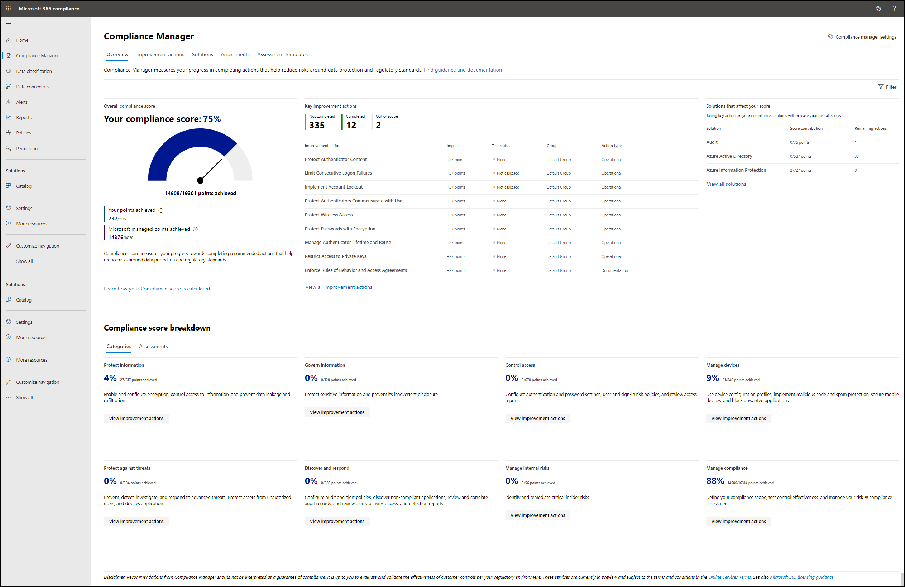

# Aan de slag met Compliancebeheer

**In dit artikel:** In dit artikel kunt u Compliance Manager instellen. Meer informatie over het **openen van** Compliance Manager, het instellen van rollen **en machtigingen** en het configureren van automatische **tests van verbeteracties.** Loop door **het dashboard van Compliance Manager** en begrijp de belangrijkste pagina's: de pagina met verbeteracties, de pagina met oplossingen, de evaluatiepagina en de pagina met beoordelingssjablonen.

## Wie hebt toegang tot Compliance Manager

Compliance Manager is beschikbaar voor organisaties met Office 365- en Microsoft 365-licenties en voor klanten van het Amerikaanse Government Community Cloud (GCC) Moderate, GCC High en Ministerie van Defensie (DoD). Beschikbaarheids- en beheermogelijkheden beoordelen is afhankelijk van uw licentieovereenkomst.  [Details van servicebeschrijving weergeven.](/office365/servicedescriptions/microsoft-365-service-descriptions/microsoft-365-tenantlevel-services-licensing-guidance/microsoft-365-security-compliance-licensing-guidance)

## Voordat u begint

De Microsoft 365 globale beheerder voor uw organisatie is waarschijnlijk de eerste gebruiker die toegang heeft tot Compliance Manager. We raden de globale beheerder aan om zich aan te melden en gebruikersmachtigingen in te stellen, zoals hieronder wordt beschreven bij het voor het eerst bezoeken van Compliance Manager.

## Aanmelden

1. Ga naar het [Microsoft 365 compliancecentrum](https://compliance.microsoft.com/) en meld **u aan** met uw Microsoft 365 globale beheerdersaccount.
2. Selecteer **Compliancebeheer** in het linkernavigatiedeelvenster. U komt aan op het [dashboard compliancebeheer.](#understand-the-compliance-manager-dashboard)

De directe koppeling naar Access Compliance Manager is [https://compliance.microsoft.com/compliancemanager](https://compliance.microsoft.com/compliancemanager) .

## Gebruikersmachtigingen instellen en rollen toewijzen

Compliance Manager gebruikt een RBAC-machtigingsmodel (Role-Based Access Control). Alleen gebruikers aan wie een rol is toegewezen, hebben toegang tot Compliance Manager en de acties die door elke gebruiker zijn toegestaan, worden beperkt op [roltype.](#role-types)

### Waar kunt u machtigingen instellen?

De persoon die de rol van globale beheerder voor uw organisatie heeft, kan gebruikersmachtigingen instellen voor Compliance Manager. Machtigingen kunnen worden ingesteld in het Office 365 beveiligingscentrum & compliancecentrum en in Azure Active Directory (Azure AD).

> [!NOTE]
> Klanten in de Amerikaanse government community (GCC) High and Department of Defense (DoD) omgevingen kunnen alleen gebruikersmachtigingen en rollen instellen voor Compliance Manager in Azure AD. Zie hieronder voor Azure AD-instructies en definities van rollentype.

Als u machtigingen wilt instellen en rollen wilt toewijzen in Office 365 beveiligingscentrum & compliancecentrum, volgt u de onderstaande stappen:

1. Ga naar het [Office 365 Beveiligings- & compliancecentrum](https://protection.office.com/) en selecteer **Machtigingen** aan de linkerkant van de navigatie.

2. Zoek de rollengroep waaraan u een of meer gebruikers wilt toevoegen en selectievakje links van de groepsnaam. (Zie de [lijst met rollen en gerelateerde functies hieronder.](#role-types) De namen van de rollengroep bootsen de rolnaam na.)

3. Selecteer bewerken onder de kop  Leden in het deelvenster flyout voor **die** groep.

4. Selecteer **Leden kiezen.** Er wordt een ander flyoutvenster weergegeven.

5. Selecteer **+ Toevoegen** om een of meer gebruikers te kiezen die u wilt toevoegen aan de groep.

6. Schakel het selectievakje in naast de namen die u wilt toevoegen en selecteer vervolgens **de** knop Toevoegen onderaan.

7. Wanneer u klaar bent met het toewijzen van gebruikers, **selecteert** u Klaar, **selecteert** u Opslaan en vervolgens **Sluiten.**

##### Meer informatie over het Office 365 beveiligings- & compliancecentrum

Meer informatie over [machtigingen in het Office 365 beveiligings- & Compliancecentrum.](../security/office-365-security/permissions-in-the-security-and-compliance-center.md)

Als u geen toegang hebt tot het Office 365-beveiligings- en compliancecentrum of als u toegang wilt tot de klassieke versie van Compliance Manager in de Microsoft Service Trust Portal, biedt de beheerinstellingen in de Service Trust Portal een andere manier om rollen toe te wijzen[(instructies](meet-data-protection-and-regulatory-reqs-using-microsoft-cloud.md#assigning-compliance-manager-roles-to-users)weergeven). Let op: dergelijke rollen zijn beperkter in hun functionaliteit.

##### Meer informatie over Azure AD

Zie Beheerders- en [niet-beheerdersrollen](/azure/active-directory/fundamentals/active-directory-users-assign-role-azure-portal)toewijzen aan gebruikers met een Azure Active Directory.

Gebruikers met Azure AD-identiteiten die geen Office 365 of Microsoft 365 hebben, hebben geen toegang tot Compliance Manager in het Microsoft 365 compliancecentrum. Neem contact op met [cmresearch@microsoft.com.](mailto:cmresearch@microsoft.com)

### Rollentypen

In de onderstaande tabel ziet u de functies die door elke rol in Compliance Manager zijn toegestaan. In de tabel ziet u ook hoe elke [Azure AD-rol wordt](/azure/active-directory/users-groups-roles/directory-assign-admin-roles#available-roles) toekend aan compliancebeheerrollen. Gebruikers hebben ten minste de leesrol Compliance Manager of de globale lezerrol van Azure AD nodig om toegang te krijgen tot Compliance Manager.

| Gebruiker kan: | Rol compliancebeheer | Azure AD-rol | 
| :------------- | :-------------: | :------------: |
| **Gegevens lezen, maar niet bewerken**| Compliancebeheer - Lezer  | Azure AD Global Reader, Beveiligingslezer | 
| **Gegevens bewerken**| Bijdrage compliancebeheer | Compliancebeheerder | 
| **Testresultaten bewerken**| Compliancebeheer - Beoordelaar | Compliancebeheerder | 
| **Evaluaties en sjabloon- en tenantgegevens beheren**| Beheer van compliancebeheer | Compliancebeheerder, compliancegegevensbeheerder, beveiligingsbeheerder  | 
| **Gebruikers toewijzen**| Globale beheerder | Globale beheerder | 

## Instellingen voor geautomatiseerde tests en gebruikersgeschiedenis

Met de compliancebeheerinstellingen in het Microsoft 365 compliancecentrum kunt u het automatisch testen van verbeteracties in- en uitschakelen. Met de instellingen kunt u ook de gegevens van gebruikers beheren die zijn gekoppeld aan verbeteracties, waaronder de mogelijkheid om verbeteracties opnieuw toe te passen aan een andere gebruiker.  Alleen personen met een globale beheerder of compliancebeheerder hebben toegang tot de instellingen van Compliance Manager.

> [!NOTE]
> De geautomatiseerde testfunctie is niet beschikbaar voor klanten in GCC High- en DoD-omgevingen, omdat Secure Score niet beschikbaar is in deze omgevingen. GCC Klanten met hoge en dod-activiteiten moeten hun verbeteracties handmatig implementeren en testen.

### Geautomatiseerde tests instellen

Sommige verbeteracties in Compliance Manager worden ook gecontroleerd door [Microsoft Secure Score.](../security/defender/microsoft-secure-score.md) U kunt geautomatiseerde tests instellen van acties die gezamenlijk worden gecontroleerd. Dit betekent dat wanneer een actie wordt getest en bijgewerkt in Secure Score, deze resultaten worden gesynchroniseerd met dezelfde acties in Compliance Manager en meetellen voor de nalevingsscore.

Automatisch testen is standaard ingeschakeld voor organisaties die nieuw zijn bij Compliance Manager. Wanneer u voor het eerst Microsoft 365 of Office 365 implementeren, duurt het ongeveer zeven dagen voordat Secure Score gegevens volledig verzamelt en in uw compliancescore meedenk.  Wanneer automatisch testen is ingeschakeld, wordt de testdatum van de actie niet bijgewerkt, maar wordt de teststatus bijgewerkt. Wanneer er nieuwe beoordelingen worden gemaakt, worden de scores automatisch gebruikt voor Microsoft-beheerscores en Secure Score-integratie.

De globale beheerder van uw organisatie kan de instellingen voor geautomatiseerde tests op elk moment wijzigen. U kunt geautomatiseerde tests uitschakelen voor algemene verbeteringsacties of deze in- of uitschakelen voor afzonderlijke acties. Volg de onderstaande instructies om uw geautomatiseerde testinstellingen te wijzigen.

#### Uw geautomatiseerde testinstellingen beheren:

1. Selecteer **Instellingen** linkernavigatie vanaf elke locatie in [het Microsoft 365 compliancecentrum.](https://compliance.microsoft.com/)

2. Selecteer compliancebeheer op de pagina **Instellingen.**

3. Selecteer **Automatisch testen** in de linkernavigatie.

4. Selecteer de toepasselijke knop om automatisch testen in te schakelen voor alle verbeteracties, deze uit te schakelen voor alle acties of in te schakelen per afzonderlijke actie.

5. Als u Per **verbeteringsactie in-/uit-** selecteert, worden in een lijst alle beschikbare verbeteringsacties weergegeven waar u uit kunt kiezen.  Schakelt het selectievakje in naast elke actie die u automatisch wilt testen.

6. Selecteer **Opslaan om** uw instellingen op te slaan. U ontvangt boven aan het scherm een bevestigingsbericht dat uw selectie is opgeslagen. Als u een foutbericht ontvangt, probeert u het opnieuw.

**Opmerking:** Alleen de globale beheerder kan automatische updates voor alle acties in- of uitschakelen. De beheerder van compliancebeheer kan automatische updates voor afzonderlijke acties in- en uit- zetten, maar niet voor alle acties wereldwijd.

### Gebruikersgeschiedenis beheren

Met **de instellingen voor gebruikersgeschiedenis** beheren kunt u snel bepalen welke gebruikers hebben gewerkt met verbeteracties in Compliance Manager. De identificeerbare gebruikersgegevens die zijn gekoppeld aan verbeteracties, omvatten alle implementatie- en testwerkzaamheden die zijn uitgevoerd, documenten die ze hebben geüpload en eventuele notities die ze hebben ingevoerd. Het kan nodig zijn om dit type gegevens te begrijpen en op te halen voor de eigen compliancebehoeften van uw organisatie.

Met de instellingen voor gebruikersgeschiedenis kunt u ook alle verbeteracties van de ene gebruiker naar de andere toewijzen.

**De instellingen voor gebruikersgeschiedenis zoeken:**

1. Selecteer Instellingen linkernavigatie vanaf elke locatie in [het Microsoft 365 compliancecentrum.](https://compliance.microsoft.com/)

2. Selecteer compliancebeheer op de pagina **Instellingen.**

3. Selecteer **Gebruikersgeschiedenis beheren** vanuit de linkernavigatie.

Op **de pagina Gebruikersgeschiedenis** beheren ziet u een lijst met alle gebruikers per e-mailadres die zijn toegewezen aan een verbeteringsactie. Gebruik de **knop Zoeken** om snel een specifieke gebruiker te vinden door het e-mailadres in te typen.

Rechts van het e-mailadres van  elke gebruiker bevat de vervolgkeuzelijst Selecteren opties voor het exporteren van een rapport, het opnieuw toewijzen van verbeteracties of het verwijderen van geschiedenis. Zie elke sectie hieronder voor meer informatie over elke optie.

#### Een rapport met gebruikersgeschiedenisgegevens exporteren

U kunt een bestand Excel met een lijst met verbeteracties die momenteel aan een gebruiker zijn toegewezen.  Het rapport bevat ook alle bewijsbestanden die door die gebruiker zijn geüpload. Met deze informatie kunt u open verbeteracties opnieuw toewijzen.

Het rapport geeft de status van de verbeteringsactie weer vanaf de aanmaakdatum. Het is geen historisch rapport van alle eerdere wijzigingen in de status of toewijzing (lees hoe u een rapport exporteert vanaf de pagina [verbeteracties).](compliance-manager-improvement-actions.md#export-a-report)

**Volg de onderstaande stappen om een rapport per gebruiker te exporteren:**

1. Selecteer **Instellingen** linkernavigatie vanaf elke locatie in [het Microsoft 365 compliancecentrum.](https://compliance.microsoft.com/)

2. Selecteer compliancebeheer op de pagina **Instellingen.**

3. Selecteer **Gebruikersgeschiedenis beheren** in de navigatie aan de linkerkant.

4. Zoek de beoogde gebruiker door in de e-mailadressen van de lijst te zoeken of door Zoeken te **selecteren** en het e-mailadres van de gebruiker in te geven.

5. Kies in **de** vervolgkeuzelijst Selecteren de optie **Rapport exporteren.**

6. Wanneer het Excel van het rapport is gegenereerd, kunt u het openen en opslaan op uw lokale computer.

#### Verbeteracties opnieuw toewijzen aan een andere gebruiker

U kunt verbeteracties van de ene gebruiker naar de andere toewijzen. Wanneer u een actie opnieuw toekent, wordt de uploadgeschiedenis van het document niet gewijzigd, maar de naam van de gebruiker die de documentatie oorspronkelijk heeft geüpload, wordt niet meer weergegeven in de verbeteringsactie.

**Volg de onderstaande stappen om verbeteracties opnieuw toe te passen op een andere gebruiker:**

1. Selecteer **Instellingen** linkernavigatie vanaf elke locatie in [het Microsoft 365 compliancecentrum.](https://compliance.microsoft.com/)

2. Selecteer compliancebeheer op de pagina **Instellingen.**

3. Selecteer **Gebruikersgeschiedenis beheren** in de navigatie aan de linkerkant.

4. Zoek een gebruiker door in de e-mailadressen van de lijst te zoeken of door **Zoeken te selecteren** en het e-mailadres van die gebruiker in te geven.

5. Kies in **de** vervolgkeuzelijst Selecteren de optie **Verbeteracties opnieuw toewijzen.** Het **flyoutvenster Verbeteracties opnieuw** toewijzen wordt weergegeven.

6. Voer in **het veld Gebruikers** zoeken de naam of het e-mailadres in van de gebruiker aan wie u de verbeteracties wilt *toewijzen.*

7. Wanneer u de naam van de beoogde gebruiker ziet onder **Acties** voor verbetering, selecteert u de gebruiker en selecteert u **Acties toewijzen.**

8. Wanneer de herplaatsing is voltooid, ziet u een bevestigingsbericht in het flyoutvenster waarin wordt bevestigd dat alle verbeteracties van de vorige gebruiker zijn toegewezen aan de nieuwe gebruiker. Als u een melding voor een fout bij het opnieuw toewijzen ontvangt, sluit u het venster en probeert u het opnieuw. Als u het deelvenster flyout wilt sluiten, selecteert u **Klaar**.

De nieuwe toegewezene ontvangt een e-mailbericht dat is toegewezen aan een verbeteringsactie. Het e-mailbericht bevat een directe koppeling naar de detailspagina van de actie voor de verbetering.
 
 > [!NOTE]
> Als u een actie met een update in behandeling opnieuw toekent, wordt de directe koppeling naar de actie in de e-mail voor de herplaatsing niet meer geaccepteerd als de update na de herplaatsing wordt geaccepteerd. U kunt dit oplossen door de actie opnieuw toe te wijzen aan de gebruiker nadat de update is geaccepteerd. Meer informatie over [updates voor verbeteracties.](compliance-manager-improvement-actions.md#accepting-updates-to-improvement-actions)

#### Gebruikersgeschiedenis verwijderen

Als u de geschiedenis van een gebruiker verwijdert, worden deze verwijderd als eigenaar van verbeteracties en wordt de naam verwijderd uit alle andere velden in Compliance Manager. Wanneer u de geschiedenis van een gebruiker verwijdert, wordt  de waarde toegewezen aan de verbeteracties pas weergegeven wanneer een nieuwe gebruiker is toegewezen. Als documenten zijn geüpload naar de actie voor verbetering, wordt de gebruiker **verwijderd** in plaats van de naam van de verwijderde gebruiker. Gebruikersgeschiedenis verwijderen is permanent.

Als u de geschiedenis van een gebruiker wilt verwijderen, volgt u de onderstaande stappen:

1. Selecteer **Instellingen** linkernavigatie vanaf elke locatie in [het Microsoft 365 compliancecentrum.](https://compliance.microsoft.com/)

2. Selecteer compliancebeheer op de pagina **Instellingen.**

3. Selecteer **Gebruikersgeschiedenis beheren** in de navigatie aan de linkerkant.

4. Zoek een gebruiker door in de e-mailadressen van de lijst te zoeken of door **Zoeken te selecteren** en het e-mailadres van die gebruiker in te geven.

5. Kies in **de** vervolgkeuzelijst Selecteren de optie **Geschiedenis verwijderen.**

6. Er wordt een venster weergegeven waarin u wordt gevraagd of u de geschiedenis van de gebruiker definitief wilt verwijderen. Als u verder wilt gaan met verwijderen, **selecteert u Geschiedenis verwijderen.** Als u wilt vertrekken zonder de geschiedenis te verwijderen, selecteert u **Annuleren.**

7. U komt terug op  de pagina Gebruikersgeschiedenis beheren met bovenaan een bevestigingsbericht dat de geschiedenis voor de gebruiker is verwijderd.

## Het compliancebeheerdashboard begrijpen

Het compliancebeheerdashboard is ontworpen om u een overzicht te geven van uw huidige compliance-houding.

### Algemene nalevingsscore

Uw nalevingsscore wordt prominent bovenaan vermeld. Het toont een percentage op basis van punten die kunnen worden bereikt voor het voltooien van verbeteracties die voldoen aan belangrijke gegevensbeschermingsstandaarden en -voorschriften. Punten uit [Microsoft-acties](compliance-manager-assessments.md#microsoft-actions-tab), die mijn Microsoft worden beheerd, tellen ook mee voor de nalevingsscore.

Wanneer u voor de eerste keer bij Compliance Manager bent, is de eerste score gebaseerd op de Microsoft 365 [basislijn voor gegevensbescherming.](compliance-manager-assessments.md#data-protection-baseline-default-assessment) Deze basislijnbeoordeling, die beschikbaar is voor alle organisaties, is een set besturingselementen die gemeenschappelijke industrievoorschriften en -standaarden bevat. Compliance Manager scant uw bestaande Microsoft 365 oplossingen en geeft u een eerste beoordeling op basis van uw huidige privacy- en beveiligingsinstellingen. Wanneer u beoordelingen toevoegt die relevant zijn voor uw organisatie, wordt uw score zinvoller voor u.

**Meer informatie:** [Meer informatie over de berekening van de nalevingsscore.](compliance-score-calculation.md)

### Belangrijke verbeteracties

In deze sectie vindt u de belangrijkste verbeteracties die u op dit moment kunt uitvoeren om de grootste positieve invloed te hebben op uw algemene nalevingsscore. Selecteer **Alle verbeteracties weergeven om** naar de pagina met verbeteracties te gaan.

### Oplossingen die van invloed zijn op uw score

In deze sectie worden oplossingen belicht met verbeteracties die een positieve invloed kunnen hebben op uw score en het aantal openstaande verbeteracties in deze oplossingen. Selecteer **Alle oplossingen weergeven om** naar de pagina met oplossingen te gaan.

### Uitsplitsing van compliancescore

In deze sectie krijgt u op twee verschillende manieren een gedetailleerdere weergave van uw score:

- **Categorieën:** toont het percentage van uw algemene score in categorieën voor gegevensbeveiliging, zoals 'gegevens beveiligen' of 'apparaten beheren'.
- Beoordelingen: toont het percentage van uw voortgang bij het beheren van beoordelingen voor bepaalde **nalevings-** en gegevensbeschermingsstandaarden, voorschriften of wetten, zoals AVG of NIST 800-53.

### De dashboardweergave filteren

U kunt de dashboardweergave filteren om alleen de items te zien die betrekking hebben op bepaalde voorschriften en standaarden, oplossingen, type actie, beoordelingsgroepen of gegevensbeschermingscategorieën. Als u uw weergave op deze manier filtert, wordt ook de score op het dashboard gefilterd, waarin wordt weergegeven hoeveel punten u hebt behaald buiten het totaal aantal mogelijke punten op basis van uw filtercriteria.

Filters toepassen:

1. Selecteer **Filteren** rechtsboven in het dashboard.
2. Selecteer de filtercriteria in het deelvenster **Filters** en selecteer **toepassen.**

Nadat u een filter hebt toegepast, wordt de score in realtime aangepast. Het compliancescorepercentage en de uitsplitsingsgegevens, en de verbeteracties en oplossingen, hebben nu alleen betrekking op gegevens die onder uw filtercriteria vallen. Als u zich afk melden bij Compliance Manager, blijft de gefilterde weergave staan wanneer u zich weer aan meld.

Filters verwijderen:

- Selecteer bij **de kop Toegepaste filters** boven de nalevingsscore de **X** naast het afzonderlijke filter dat u wilt verwijderen. of
- Selecteer **Filteren** rechtsboven in het dashboard en selecteer vervolgens in het deelvenster **Filters** de optie **Filters wissen.**

## Pagina Verbeteracties

[Verbeteracties zijn](compliance-manager-improvement-actions.md) acties die worden beheerd door uw organisatie. Het werken met verbeteracties helpt bij het centraliseren van uw complianceactiviteiten en het afstemmen op regelgeving en standaarden voor gegevensbescherming. Elke verbeteringsactie bevat gedetailleerde implementatie-richtlijnen en een koppeling om u te lanceren in de juiste oplossing. Verbeteracties kunnen worden toegewezen aan gebruikers in uw organisatie om implementatie- en testwerk uit te voeren. U kunt ook documentatie, notities en statusupdates opnemen in de actie voor verbetering.

### Uw verbeteracties weergeven

In het dashboard Compliancebeheer ziet u de **belangrijkste verbeteracties.** Als u al uw verbeteracties wilt bekijken, selecteert u het tabblad Acties voor verbetering op uw dashboard, waarmee u naar de pagina verbeteracties gaat. U kunt ook Alle verbeteracties weergeven onder de lijst met belangrijke verbeteracties op uw dashboard selecteren om naar de pagina met verbeteracties te gaan.

Op de pagina verbeteracties ziet u alle verbeteracties die door uw organisatie worden beheerd. Acties die door Microsoft worden beheerd, kunnen worden bekeken in elke beoordeling (meer informatie over [Microsoft-acties).](compliance-manager-assessments.md#microsoft-actions-tab)

Als u een lange lijst met acties op de pagina verbeteracties hebt, is het misschien handig om uw weergave te filteren. Selecteer **Filteren** in de rechterbovenhoek van de lijst met acties. Wanneer het **deelvenster Filters** wordt weergegeven, selecteert u uw criteria op basis van regelgeving en standaarden, oplossing en groep. U kunt uw weergave ook aanpassen door **Groeperen** in de rechterbovenhoek te selecteren. Selecteer in de vervolgkeuzelijst om te bekijken op groep, oplossing, categorie, actietype of status.

De standaardweergave voor deze pagina bevat geen verbeteracties met de teststatus **Geslaagd.** Als u acties wilt bekijken die zijn getest, gaat u naar het selectievakje **Doorgegeven** in het deelvenster Filters. Alleen acties met een teststatus van **Geslaagd tellen** mee voor uw score. Sommige acties kunnen een **updatelabel in behandeling laten zien.** Meer informatie over [updates voor verbeteracties.](compliance-manager-improvement-actions.md#accepting-updates-to-improvement-actions)

Op de pagina verbeteracties worden de volgende gegevenspunten weergegeven voor elke verbeteringsactie:

- **Behaalde punten:** het aantal punten dat is bereikt uit het totaal dat beschikbaar is door de actie uit te voeren
- **Voorschriften:** de voorschriften of standaarden met betrekking tot de actie
- **Groep:** de groep waaraan u de actie hebt toegewezen
- **Oplossingen:** de oplossing waar u naartoe kunt gaan om de actie uit te voeren
- **Beoordelingen:** de beoordelingen die de actie bevatten
- **Categorieën:** de gerelateerde categorie gegevensbeveiliging (zoals informatie beveiligen, apparaten beheren, enzovoort)
- **Teststatus**:
    - **Geen:** er is geen statusupdate opgenomen
    - **Niet beoordeeld:** het testen is nog niet gestart
    - **Geslaagd** - implementatie succesvol getest
    - **Mislukt laag risico-** testen mislukt, laag risico
    - **Mislukt gemiddeld risico:** testen mislukt, gemiddeld risico
    - **Mislukt hoog risico-** testen mislukt, hoog risico
    - **Buiten bereik:** de actie valt buiten het bereik van de beoordeling en heeft geen invloed op uw score
    - **Om te worden gedetecteerd:** voor handmatige test geeft u aan dat een actie is geïmplementeerd, maar niet is getest. voor geautomatiseerde test geeft aan dat er een actie wacht op het resultaat van automatisering
    - **Kan niet worden gedetecteerd:** de geautomatiseerde status kan niet worden bepaald
    - **Gedeeltelijk getest:** geautomatiseerde score die gedeeltelijke punten toekent

**Meer informatie:** Zie hoe [u verbeteracties kunt](compliance-manager-improvement-actions.md)toewijzen en uitvoeren.

## Pagina Oplossingen

Op de pagina Oplossingen ziet u het aantal verdiende en potentiële punten, zoals ingedeeld op oplossing. Als u vanuit deze weergave de resterende punten en verbeteracties bekijkt, begrijpt u welke oplossingen direct aandacht nodig hebben.

Zoek de pagina met oplossingen door het tabblad **Oplossingen te** selecteren op het dashboard compliancebeheer. U kunt ook Alle oplossingen **weergeven onder** Oplossingen selecteren die van invloed zijn op uw **score** in de rechterbovenhoek van het dashboard.

### De weergave Voor oplossingen filteren

Uw weergave van oplossingen filteren:

1. Selecteer **Filteren** in de linkerbovenhoek van de lijst met beoordelingen.
2. Plaats in **het** deelvenster Filters een controle naast de gewenste criteria (standaarden en voorschriften, oplossing, actietype, groep Compliancebeheer, categorie).
3. Selecteer de **knop Toepassen.** Het filtervenster wordt gesloten en u ziet de gefilterde weergave.

U kunt uw weergave ook wijzigen om beoordelingen per groep, product of regelgeving  te bekijken door het type groepering te selecteren in de vervolgkeuzelijst Groep boven uw lijst met beoordelingen.

### Actie ondernemen vanaf de oplossingspagina

Op de pagina oplossingen worden de oplossingen van uw organisatie weergegeven die zijn gekoppeld aan verbeteracties. De tabel bevat de bijdrage van elke oplossing aan uw totale score, de punten die binnen die oplossing zijn bereikt en mogelijk, en het resterende aantal verbeteracties dat in die oplossing is gegroepeerd om uw score te verhogen.

U kunt op twee manieren actie ondernemen vanaf dit scherm:

1. Selecteer in de rij van de beoogde oplossing onder de kolom **Resterende** acties het nummer met hyperlinks. U ziet een gefilterde weergave van het scherm verbeteracties met niet-geteste verbeteringsacties voor die oplossing.

2. Selecteer in de rij van de beoogde oplossing onder de **kolom Oplossing openen** de optie **Openen.** U ziet de oplossing of locatie in de Microsoft 365 en Office 365 beveiligings- en compliancecentra waar u de aanbevolen actie kunt ondernemen.

## Pagina Beoordelingen

De pagina Beoordelingen bevat alle [beoordelingen die](compliance-manager-assessments.md) u voor uw organisatie hebt ingesteld. De noemer nalevingsscore wordt bepaald door al uw bijgespoorde beoordelingen. Wanneer u meer evaluaties toevoegt, ziet u meer verbeteracties op de pagina verbeteracties en wordt de noemer voor nalevingsscores verhoogd.

In **de teller** geactiveerde sjablonen boven aan de pagina ziet u het aantal actieve beoordelingssjablonen dat momenteel wordt gebruikt buiten het totale aantal sjablonen dat uw organisatie kan gebruiken. Zie [Sjabloontype](compliance-manager-templates.md#template-types-included-and-premium-active-and-inactive) voor meer informatie.

De evaluatiepagina bevat belangrijke informatie over elke beoordeling:

- **Beoordeling**: naam van de beoordeling
- **Status**:
    - **Voltooid:** alle besturingselementen hebben de status 'doorgegeven', of er wordt ten minste één doorgegeven en de rest is 'buiten bereik'
    - **Onvolledig:** ten minste één besturingselement heeft de status 'mislukt'
    - **Geen:** alle besturingselementen zijn niet getest
    - **In uitvoering:** verbeteracties hebben een andere status, zoals 'in uitvoering', 'gedeeltelijk krediet' of 'niet gedetecteerd'
- **Voortgang van** de evaluatie: het percentage van het werk dat is uitgevoerd in de richting van voltooiing, gemeten aan de slag met het aantal besturingselementen dat is getest
- **Uw verbeteracties:** het aantal voltooide acties om te voldoen aan de implementatie van uw besturingselementen
- **Microsoft-acties:** het aantal voltooide acties om te voldoen aan de implementatie van Microsoft-besturingselementen
- **Groep:** naam van de groep van wie de beoordeling behoort
- **Product**: gekoppelde Microsoft 365 service
- **Verordening:** de wettelijke standaard, het beleid of de wetgeving die van toepassing is op de beoordeling

### De beoordelingsweergave filteren

U kunt de weergave van beoordelingen filteren:

1. Selecteer **Filteren** in de linkerbovenhoek van de lijst met beoordelingen.
2. Controleer in **het** deelvenster Filters de gewenste criteria.
3. Selecteer de **knop Toepassen.** Het filtervenster wordt gesloten en u ziet de gefilterde weergave.

U kunt uw weergave ook wijzigen om beoordelingen per groep, product of regelgeving  te bekijken door het type groepering te selecteren in de vervolgkeuzelijst Groep boven uw lijst met beoordelingen.

### Standaardbeoordeling

Standaard ziet u de beoordeling van [basislijn](compliance-manager-assessments.md#data-protection-baseline-default-assessment) gegevensbescherming op de pagina beoordelingen. Compliance Manager biedt ook verschillende vooraf gebouwde [sjablonen voor](compliance-manager-templates-list.md) gebouwbeoordelingen.

## Pagina Beoordelingssjablonen

Een sjabloon is een framework voor het maken van een beoordeling in Compliance Manager. Op de pagina beoordelingssjablonen ziet u een lijst met sjablonen en belangrijke details. De lijst bevat sjablonen die worden geleverd door Compliance Manager en alle sjablonen die uw organisatie heeft gewijzigd of gemaakt. U kunt filters toepassen om een sjabloon te zoeken op basis van certificering, productbereik, land, industrie en wie deze heeft gemaakt.

In **de teller** geactiveerde sjablonen boven aan de pagina ziet u het aantal actieve beoordelingssjablonen dat momenteel wordt gebruikt buiten het totale aantal sjablonen dat uw organisatie kan gebruiken. Zie [Sjabloontype](compliance-manager-templates.md#template-types-included-and-premium-active-and-inactive) voor meer informatie.

Selecteer een sjabloon in de rij om de detailspagina weer te geven, met een beschrijving van de sjabloon en meer informatie over certificering, bereik en besturingselementgegevens. Op deze pagina kunt u de juiste knoppen selecteren om een beoordeling te maken, de sjabloongegevens exporteren naar Excel of de sjabloon wijzigen.

**Meer informatie:** [Lees hoe u met beoordelingssjablonen werkt.](compliance-manager-templates.md)

## Volgende stap
Pas Compliance Manager aan door [evaluaties in te stellen.](compliance-manager-assessments.md)