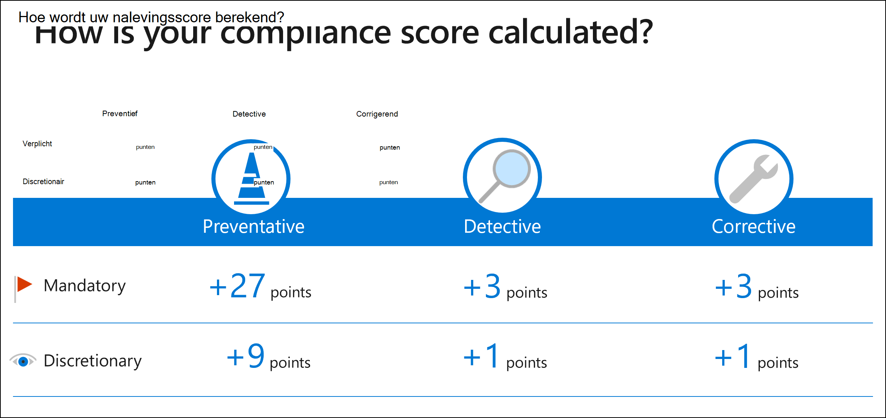

# Werken met beoordelingssjablonen in Compliance ManagerWorking with assessment templates in Compliance Manager

**In dit artikel:** Meer **informatie over hoe sjablonen werken** en hoe u deze kunt **beheren** vanaf de pagina beoordelingssjablonen.**In this article:** Understand **how templates work** and **how to manage them** from your assessment templates page. Instructies voor het **maken van** nieuwe sjablonen, **het** wijzigen van bestaande sjablonen, het opmaken van sjabloongegevens met Excel en het exporteren van **sjabloonrapporten.** Get instructions for **creating** new templates, **modifying** existing templates, **formatting your template data with Excel**, and exporting template **reports**.

> [!IMPORTANT]
> De beoordelingssjablonen die beschikbaar zijn voor uw organisatie, zijn afhankelijk van uw licentieovereenkomst.The assessment templates that are available to your organization depends on your licensing agreement. [Bekijk de details.](/office365/servicedescriptions/microsoft-365-service-descriptions/microsoft-365-tenantlevel-services-licensing-guidance/microsoft-365-security-compliance-licensing-guidance)[Review the details](/office365/servicedescriptions/microsoft-365-service-descriptions/microsoft-365-tenantlevel-services-licensing-guidance/microsoft-365-security-compliance-licensing-guidance).

## SjablonenoverzichtTemplates overview

Een sjabloon is een kader van besturingselementen voor het maken van een beoordeling in Compliance Manager.A template is a framework of controls for creating an assessment in Compliance Manager. Met onze uitgebreide set sjablonen kan uw organisatie voldoen aan nationale, regionale en branchespecifieke vereisten voor het verzamelen en gebruiken van gegevens.Our comprehensive set of templates can help your organization comply with national, regional, and industry-specific requirements governing the collection and use of data. We verwijzen naar sjablonen met dezelfde naam als de onderliggende certificering of regelgeving, zoals de AVG-sjabloon van de EU en de ISO 27001:2013-sjabloon.We refer to templates by the same name as their underlying certification or regulation, such as the EU GDPR template and the ISO 27001:2013 template.

 Bekijk de [volledige lijst met sjablonen.](compliance-manager-templates-list.md)View the [full list of templates](compliance-manager-templates-list.md).

## Sjabloontypen: inbegrepen en premium, actief en inactiefTemplate types: included and premium, active and inactive

#### Inbegrepen en premiumsjablonenIncluded and premium templates

De sjablonen die beschikbaar zijn voor gebruik, zijn gebaseerd op de licentieovereenkomst van uw organisatie[(bekijk licentiedetails).](/office365/servicedescriptions/microsoft-365-service-descriptions/microsoft-365-tenantlevel-services-licensing-guidance/microsoft-365-security-compliance-licensing-guidance#compliance-manager)The templates available for use are based on your organization’s licensing agreement ([view licensing details](/office365/servicedescriptions/microsoft-365-service-descriptions/microsoft-365-tenantlevel-services-licensing-guidance/microsoft-365-security-compliance-licensing-guidance#compliance-manager)). Er zijn twee categorieën sjablonen: inbegrepen en premium.There are two categories of templates: included and premium.

1. **Inbegrepen sjablonen** zijn beschikbaar voor gebruik als onderdeel van de licentieovereenkomst van uw organisatie.**Included templates** are available for use as part of your organization’s licensing agreement.
2. **Premium sjablonen** moeten worden aangeschaft om er beoordelingen van te maken.**Premium templates** must be purchased in order to create assessments from them. Wanneer u de sjabloon hebt aangeschaft, kunt u zo veel mogelijk beoordelingen maken op basis van een sjabloon.Once purchased, you may create as many assessments from a template as needed. [Meer informatie over hoe u premiumsjablonen kunt kopen.](/office365/servicedescriptions/microsoft-365-service-descriptions/microsoft-365-tenantlevel-services-licensing-guidance/microsoft-365-security-compliance-licensing-guidance#compliance-manager)[Learn how you can purchase premium templates](/office365/servicedescriptions/microsoft-365-service-descriptions/microsoft-365-tenantlevel-services-licensing-guidance/microsoft-365-security-compliance-licensing-guidance#compliance-manager).

#### Actieve en inactieve sjablonenActive and inactive templates

Sjablonen geven een activeringsstatus weer als actief of inactief:Templates will display an activation status as either active or inactive:

- Een sjabloon wordt als **actief beschouwd** wanneer u een evaluatie maakt op basis van die sjabloon.A template is considered **active** once you create an assessment from that template.
- Een sjabloon wordt **als inactief beschouwd** als uw organisatie deze niet gebruikt voor een evaluatie.A template is considered **inactive** if your organization isn’t using it for an assessment.

Wanneer u een premiumsjabloon koopt en er een evaluatie van maakt, is die sjabloon één jaar actief.When you purchase a premium template and create an assessment from it, that template is active for one year. Uw aankoop wordt automatisch verlengd, tenzij u verlenging annuleert.Your purchase will automatically renew unless you cancel renewal.

**Geactiveerde sjablonenteller****Activated templates counter**

De pagina beoordelingspagina en beoordelingssjablonen hebben een **geactiveerde** sjablonenteller bovenaan.Your assessment page and assessment templates page have an **activated templates** counter near the top. In de teller wordt het aantal sjablonen weergegeven dat wordt gebruikt buiten het aantal dat in aanmerking komt voor gebruik volgens uw licentieovereenkomst.The counter displays the number of templates in use out of the number eligible to use according to your licensing agreement.

Als de teller bijvoorbeeld 2/5 laat zien, betekent dit dat uw organisatie twee sjablonen van de 5 heeft geactiveerd die beschikbaar zijn voor gebruik.For example, if your counter shows 2/5, this means your organization has activated 2 templates out of the 5 that are available to use.

Als de teller 5/2 aangeeft, geeft dit aan dat uw organisatie de limieten overschrijdt en drie van de premiumsjablonen in gebruik moet kopen.If your counter shows 5/2, this indicates that your organization exceeds its limits and needs to purchase 3 of the premium templates in use.

Zie [Richtlijnen voor compliancebeheerlicenties](/office365/servicedescriptions/microsoft-365-service-descriptions/microsoft-365-tenantlevel-services-licensing-guidance/microsoft-365-security-compliance-licensing-guidance#compliance-manager) voor meer informatie.See [Compliance Manager licensing guidance](/office365/servicedescriptions/microsoft-365-service-descriptions/microsoft-365-tenantlevel-services-licensing-guidance/microsoft-365-security-compliance-licensing-guidance#compliance-manager) for further details.

## Sjablonen weergeven en beheren vanaf de pagina beoordelingssjablonenViewing and managing templates from the assessment templates page

Op de pagina beoordelingssjablonen in Compliance Manager ziet u een lijst met sjablonen en belangrijke details.The assessment templates page in Compliance Manager displays a list of templates and key details. De lijst bevat sjablonen die worden geleverd door Compliance Manager en alle sjablonen die uw organisatie heeft gewijzigd of gemaakt.The list includes templates provided by Compliance Manager as well as any templates your organization has modified or created. U kunt filters toepassen om een sjabloon te zoeken op basis van certificering, productbereik, land, industrie, wie deze heeft gemaakt en of de sjabloon is ingeschakeld voor het maken van beoordelingen.You can apply filters to find a template based on certification, product scope, country, industry, who created it, and whether the template is enabled for assessment creation.

Selecteer een sjabloon in de rij om de detailspagina weer te geven.Select a template from its row to bring up its details page. Deze pagina bevat een beschrijving van de sjabloon en meer informatie over certificering, bereik en besturingselementen.This page contains a description of the template and further information about certification, scope, and controls details. Op deze pagina kunt u de juiste knoppen selecteren om een beoordeling te maken, de sjabloongegevens exporteren naar Excel of de sjabloon wijzigen.From this page you can select the appropriate buttons to create an assessment, export the template data to Excel, or modify the template.

## Overzicht van sjablonen maken en wijzigenCreating and modifying templates overview

Als u een bestaande sjabloon wilt wijzigen of uw eigen nieuwe sjabloon wilt maken, gebruikt u een speciaal opgemaakt Excel spreadsheet[(download](https://go.microsoft.com/fwlink/?linkid=2124865)een voorbeeld) om de benodigde besturingsgegevens te verzamelen.To modify an existing template or to create your own new template, you’ll use a specially formatted Excel spreadsheet ([download an example](https://go.microsoft.com/fwlink/?linkid=2124865)) to assemble the necessary control data. Nadat u de spreadsheet hebt gemaakt, importeert u deze in Compliance Manager tijdens het maken of wijzigen van een sjabloon.After completing the spreadsheet, you import it into Compliance Manager during the process of creating or modifying a template.

> [!NOTE]
> De spreadsheet heeft een specifieke indeling en schema die moeten worden gebruikt, anders wordt het niet correct geïmporteerd in Compliance Manager.The spreadsheet has a specific format and schema that must be used, or it will not import correctly into Compliance Manager. De [opmaakinstructies](#formatting-your-template-data-with-excel) zijn hieronder.The [formatting instructions](#formatting-your-template-data-with-excel) are below.

**Vereiste rollen****Required roles**

Alleen gebruikers met een rol voor globale beheerder of compliancebeheer kunnen sjablonen maken en wijzigen.Only users who hold a Global Administrator or  Compliance Manager Administration role can create and modify templates. Meer informatie over [rollen en machtigingen.](compliance-manager-setup.md#set-user-permissions-and-assign-roles)Learn more about [roles and permissions](compliance-manager-setup.md#set-user-permissions-and-assign-roles).

## Een nieuwe sjabloon makenCreate a new template

Als u uw eigen nieuwe sjabloon wilt maken (die wordt gebruikt voor het maken van aangepaste beoordelingen), volgt u de onderstaande stappen.To create your own new template (used for building custom assessments), follow the steps below.

1. Ga naar de pagina **beoordelingssjablonen** in Compliance Manager.Go to your **assessment templates** page in Compliance Manager.
2. Selecteer **Nieuwe sjabloon maken.**Select **Create new template**. Er wordt een wizard voor het maken van een sjabloon geopend.A template creation wizard will open.
3. Kies het type sjabloon dat u wilt maken.Choose the type of template you want to create. Selecteer in dit geval **Een aangepaste sjabloon maken** en selecteer vervolgens **Volgende.**In this case, select **Create a custom template**, then select **Next**.
4. Selecteer **op Upload** scherm Bladeren  om het opgemaakte Excel-bestand met alle vereiste sjabloongegevens te zoeken en te uploaden (zie instructies voor het correct opmaken van [het bestand).](#formatting-your-template-data-with-excel)At the **Upload file** screen, select **Browse** to find and upload your formatted Excel file containing all the required template data (see [instructions for properly formatting your file](#formatting-your-template-data-with-excel)).
5. Als er geen problemen zijn met uw bestand, wordt de naam van het geüploade bestand weergegeven.If there are no problems with your file, the name of the file uploaded will be displayed. Selecteer **Volgende om** door te gaan.Select **Next** to continue. (Als u het bestand wilt wijzigen, selecteert **u Upload een ander bestand**).(If you need to change the file, select **Upload a different file**).
    - Als er een fout met het bestand is, wordt in een foutbericht bovenaan uitgelegd wat er mis is.If there’s an error with your file, an error message at the top explains what’s wrong. U moet het bestand herstellen en opnieuw uploaden.You’ll need to fix your file and upload it again. Er ontstaan fouten als uw spreadsheet onjuist is opgemaakt of als er ongeldige informatie in bepaalde velden staat (raadpleeg nogmaals de [opmaakinstructies).](#formatting-your-template-data-with-excel)Errors will result if your spreadsheet is formatted improperly, or if there’s invalid information in certain fields (refer again to the [formatting instructions](#formatting-your-template-data-with-excel)).  
    
6. In **het scherm Controleren en** voltooien ziet u het aantal verbeteracties en besturingselementen en de maximale score voor de sjabloon.The **Review and finish** screen shows the number of improvement actions and controls and the maximum score for the template. Wanneer u klaar bent om het goed te keuren, **selecteert u Sjabloon maken.**When ready to approve, select **Create template.** (Als u wijzigingen wilt aanbrengen, selecteert u **Terug**.)(If you need to make changes, select **Back**.)
7. Het laatste scherm bevestigt dat er een nieuwe sjabloon is gemaakt.The last screen confirms a new template has been created. Selecteer **Klaar om** de wizard te sluiten.Select **Done** to exit the wizard.
8. U komt op de detailspagina van de nieuwe sjabloon, waar u [uw beoordeling kunt maken.](compliance-manager-assessments.md#create-your-own-custom-assessment)You’ll arrive at your new template’s details page, where you can [create your assessment](compliance-manager-assessments.md#create-your-own-custom-assessment).

## Uw sjabloongegevens opmaken met ExcelFormatting your template data with Excel

Het Excel spreadsheet dat wordt gebruikt om sjablonen te maken, bevat vier tabbladen, waarvan er drie vereist zijn:The Excel spreadsheet used to create templates contains four tabs, three of which are required:

1. [Sjabloon](#template-tab) (vereist)[Template](#template-tab) (required)
2. [ControlFamily](#controlfamily-tab) (vereist)[ControlFamily](#controlfamily-tab) (required)
3. [Acties](#actions-tab) (vereist)[Actions](#actions-tab) (required)
4. [Afmetingen](#dimensions-tab) (optioneel)[Dimensions](#dimensions-tab) (optional)

Wanneer u uw spreadsheet invult met sjabloongegevens, moet het werkblad de tabbladen in de bovenstaande  **volgorde** bevatten, anders worden uw gegevens niet geïmporteerd in een sjabloon.When filling out your spreadsheet with template data, the spreadsheet  **must include the tabs in the order listed above**, otherwise your data won't successfully import to a template.

##### Tabblad SjabloonTemplate tab

Het **tabblad** Sjabloon is vereist.The **Template** tab is required. De informatie op dit tabblad bevat metagegevens over de sjabloon.The information in this tab provides metadata about the template. Er zijn vier vereiste kolommen.There are four required columns. De kolommen moeten de volgorde op het Excel behouden, zoals hieronder wordt vermeld.The columns must retain the order on the Excel sheet as listed below. U kunt na de vier **kolommen** uw eigen kolom toevoegen om uw eigen afmetingen te geven.You can add your own column **after** the four columns to provide your own dimensions. Als u dit doet, moet u deze toevoegen aan het tabblad **Dimensies** met de [onderstaande instructies.](#dimensions-tab)If you do this, be sure to add them to the **Dimensions** tab using the [instructions below](#dimensions-tab).

- **titel:** dit is de titel voor de sjabloon, die uniek moet zijn.**title**: This is the title for your template, which must be unique. Het kan geen naam delen met een andere sjabloon die u hebt in Compliance Manager, inclusief uw eigen sjablonen of een compliancebeheersjabloon.It can't share a name with another template you have in Compliance Manager, including your own templates or a Compliance Manager template.

- **product:** Dit is een vereiste dimensie.**product**: This is a required dimension. Vermeld het product dat aan de sjabloon is gekoppeld.List the product associated with the template.

- **certificering:** dit is de verordening die u gebruikt voor de sjabloon.**certification**: This is the regulation you're using for the template.

- **inScopeServices:** dit zijn de services binnen het product waar deze beoordeling op is gericht (als u bijvoorbeeld Office 365 als product hebt vermeld, kan Microsoft Teams een service binnen het bereik zijn).**inScopeServices**: These are the services within the product that this assessment addresses (for example, if you listed Office 365 as the product, Microsoft Teams could be an in-scope service). U kunt meerdere services op een lijst zetten die zijn gescheiden door twee dubbele punts.You can list multiple services separated by two semi-colons.

> [!NOTE]
> De gegevens die u  invoegt in **de product-** en certificeringscellen, kunnen niet worden bewerkt nadat u het werkblad hebt geïmporteerd om een sjabloon te maken of aan te passen.The data you insert in the **product** and **certification** cells can't be edited after you import the spreadsheet to create or customize a template. Een groep kan ook geen twee beoordelingen bevatten die dezelfde **combinatie van product/certificering** hebben.Also, a group can't contain two assessments that have the same **product/certification** combination. U kunt meerdere sjablonen met dezelfde product-/certificeringscombinatie hebben.You can have multiple templates with the same product/certification combination.

##### Tabblad ControlFamilyControlFamily tab

Het **tabblad ControlFamily** is vereist.The **ControlFamily** tab is required.  De vereiste kolommen op dit tabblad, die de volgorde moeten volgen die in het voorbeeldblad wordt weergegeven, zijn:The required columns in this tab, which must follow the order provided in the sample spreadsheet, are:

- **controlName:** dit is de naam van het besturingselement van de certificering, standaard of regelgeving, die meestal een bepaald type id is.**controlName**: This is the control name from the certification, standard, or regulation, which is typically some type of ID. Besturingselementnamen moeten uniek zijn in een sjabloon.Control names must be unique within a template. U kunt niet meerdere besturingselementen met dezelfde naam in het spreadsheet hebben.You can't have multiple controls with the same name in the spreadsheet.

- **controlFamily:** Geef een woord of woordgroep op voor het besturingselementFamily, waarmee een brede groep besturingselementen wordt geïdentificeerd.**controlFamily**: Provide a word or phrase for the controlFamily, which identifies a broad grouping of controls. Een controlFamily hoeft niet uniek te zijn. het kan meerdere keer in een spreadsheet worden weergegeven.A controlFamily doesn't have to be unique; it can be listed more than once in a spreadsheet. Hetzelfde besturingselementFamily kan ook worden weergegeven in meerdere sjablonen, maar ze hebben geen relatie met elkaar.The same controlFamily can also be listed in multiple templates, though they have no relation to each other. Elk besturingselementFamily moet aan ten minste één besturingselement zijn toegesneden.Every controlFamily must be mapped to at least one control.

- **controlTitle:** Geef een titel op voor het besturingselement.**controlTitle**: Provide a title for the control. Terwijl het besturingselementNaam een verwijzingscode is, is de titel een opmaak voor tekst met opmaak die meestal wordt gezien in de regelgeving.Whereas the controlName is a reference code, the title is a rich text format typically seen in the regulations.

- **controlDescription:** Geef een beschrijving van het besturingselement op.**controlDescription**: Provide a description of the control.

- **controlActionTitle:** dit is de titel van een actie die u wilt relateren aan dit besturingselement.**controlActionTitle**: This is the title of an action that you want to relate to this control. U kunt meerdere acties toevoegen door twee dubbele punts te scheiden zonder tussenruimte.You can add multiple actions by separating by two semi-colons with no space in between. Elk besturingselement dat u opneemt, moet ten minste één actie bevatten en de  actie moet bestaan (wat betekent dat u een actie kunt weergeven die u op het tabblad Acties van hetzelfde spreadsheet vermeldt, een actie die bestaat in een andere sjabloon of een actie die door Microsoft is gemaakt).Every control you list must include at least one action, and the action must exist (which means you can list an action that you list on the **Actions** tab of the same spreadsheet, an action that exists in a different template, or an action created by Microsoft). Verschillende besturingselementen kunnen verwijzen naar dezelfde actie.Different controls can reference the same action.

##### Tabblad ActiesActions tab

Het **tabblad** Acties is vereist.The **Actions** tab is required.  Het wijst verbeteracties aan die worden beheerd door uw organisatie en niet die van Microsoft, die al aanwezig zijn in Compliance Manager.It designates improvement actions managed by your organization and not those of Microsoft, which already exist in Compliance Manager. De vereiste kolommen voor dit tabblad, die de volgorde moeten volgen die in het voorbeeldblad wordt weergegeven, zijn:The required columns for this tab, which must follow the order provided in the sample spreadsheet, are:

- **actionTitle:** Dit is de titel voor uw actie en is een verplicht veld.**actionTitle**: This is the title for your action and is a required field. De door u op te geven titel moet uniek zijn.The title you provide must be unique. **Belangrijk:** als u verwijst naar een actie die al bestaat (zoals in een andere sjabloon) en u een van de elementen in de volgende kolommen wijzigt, worden deze wijzigingen doorgevoerd naar dezelfde actie in andere sjablonen.**Important**: if you reference an action you own that already exists (such as in another template) and you modify any of its elements in the subsequent columns, those changes will propagate to the same action in other templates.

- **implementationType:** In dit vereiste veld vermeldt u een van de drie onderstaande implementatietypen:**implementationType**: In this required field, list one of the three implementation types below:
    - **Operationeel:** acties die worden geïmplementeerd door personen en processen ter bescherming van de vertrouwelijkheid, integriteit en beschikbaarheid van organisatiesystemen, activa, gegevens en personeel (bijvoorbeeld: beveiligingsbewustzijn en training)**Operational** - actions implemented by people and processes to protect the confidentiality, integrity, and availability of organizational systems, assets, data, and personnel (example: security awareness and training)
    - **Technische** acties die zijn voltooid door het gebruik van technologie en mechanismen in de hardware-, software- of firmwareonderdelen van het informatiesysteem ter bescherming van de vertrouwelijkheid, integriteit en beschikbaarheid van organisatiesystemen en -gegevens (bijvoorbeeld: meervoudige verificatie)**Technical** - actions completed through the use of technology and mechanisms contained in the hardware, software, or firmware components of the information system to protect the confidentiality, integrity, and availability of organizational systems and data (example: multi-factor authentication)
    - **Documentatie:** acties die zijn geïmplementeerd via gedocumenteerd beleid en procedures voor het vaststellen en definiëren van de besturingselementen die nodig zijn om de vertrouwelijkheid, integriteit en beschikbaarheid van organisatiesystemen, activa, gegevens en personeel te beschermen (bijvoorbeeld: een informatiebeveiligingsbeleid)**Documentation** - actions implemented through documented policies and procedures establishing and defining the controls required to protect the confidentiality, integrity, and availability of organizational systems, assets, data, and personnel (example: an information security policy)

- **actionScore:** Geef in dit vereiste veld een numerieke scorewaarde op voor uw actie.**actionScore**: In this required field, provide a numeric score value for your action. Het moet een geheel getal zijn van 1 tot 99. het kan niet 0, null of leeg zijn.It must be a whole number ranging from 1 to 99; it cannot be 0, null, or blank. Hoe hoger het getal, hoe groter de waarde voor het verbeteren van de nalevingsstatus.The higher the number, the greater its value toward improving your compliance posture. In de onderstaande afbeelding wordt gedemonstreerd hoe Compliance Manager scores bepaalt:The image below demonstrates how Compliance Manager scores controls:

- **actionDescriptionTitle:** Dit is de titel van de beschrijving en is vereist.**actionDescriptionTitle**: This is the title of the description and is required. Met deze beschrijvingstitel kunt u dezelfde actie in meerdere sjablonen hebben en in elke sjabloon een andere beschrijving weergeven.This description title allows you to have the same action in multiple templates and surface a different description in each template.  Met dit veld kunt u verduidelijken welke sjabloon de beschrijving verwijst.This field helps you clarify what template the description is referencing. In de meeste gevallen kunt u de naam van de sjabloon die u maakt in dit veld zetten.In most cases, you can put the name of the template you're creating in this field.

- **actionDescription:** Geef een beschrijving van de actie op.**actionDescription**: Provide a description of the action. U kunt opmaak toepassen, zoals vetgedrukte tekst en hyperlinks.You can apply formatting such as bold text and hyperlinks. Dit is vereist veld.This is required field.

- **dimensie-actiedoel:** dit is een optioneel veld.**dimension-Action Purpose**: This is an optional field. Als u deze opvoegt, moet de koptekst het voorvoegsel 'dimensie-' bevatten.If you include it, the header must include the "dimension-" prefix. Alle dimensies die u hier op neemt, worden gebruikt als filters in Compliance Manager en worden weergegeven op de pagina details van verbeteracties in Compliance Manager.Any dimensions you include here will be used as filters in Compliance Manager and appear on the improvement actions details page in Compliance Manager.

##### Tabblad DimensiesDimensions tab

Het **tabblad Dimensies** is optioneel.The **Dimensions** tab is optional. Als u echter ergens anders naar een dimensie verwijst, moet u deze hier opgeven als deze niet aanwezig is in een sjabloon die u al hebt gemaakt of in een Microsoft-sjabloon.However, if you reference a dimension elsewhere, you need to specify it here if it does not exist in a template you've already created or in a Microsoft template. De kolommen voor dit tabblad worden hieronder weergegeven:The columns for this tab are listed below:

- **dimensionKey:** lijst als 'product', 'certificeringen', 'actiedoel'**dimensionKey**: list as "product", "certifications," "action purpose"
- **dimensieWaarde:** voorbeelden: Office 365, HIPPA, Preventative, Detective**dimensionValue**: examples: Office 365, HIPPA, Preventative, Detective

U kunt uw bestaande dimensies weergeven door naar **Tenantbeheer** te gaan en het tabblad **Dimensies te** selecteren. Wanneer u een bestaande sjabloon exporteert, heeft het geëxporteerde werkblad ook het tabblad **Dimensies,** waarin alle dimensies worden vermeld die in de sjabloon worden gebruikt.You can view your existing dimensions by going to **Tenant Management** and selecting the **Dimensions** tab. Also, anytime you export an existing template, the exported spreadsheet will have the **Dimensions** tab, which lists all the dimensions used in the template.

## Een sjabloon wijzigenModify a template

Mogelijk wilt u een sjabloon wijzigen die u al hebt gemaakt, zoals besturingselementen toevoegen of verbeteracties toevoegen of verwijderen.You may want to modify a template you’ve already created, such as to add controls, or add or remove improvement actions. Het proces is vergelijkbaar met het proces voor het maken van sjabloons, omdat u opgemaakte Excel met uw sjabloongegevens uploadt.The process is similar to the template creation process in that you’ll  upload formatted Excel file with your template data.

Er zijn echter specifieke details waar u rekening mee moet houden wanneer u het bestand opmaak met wijzigingen in bestaande sjabloongegevens.However, there are particular details to be aware of as you format your file with changes to existing template data. **U wordt aangeraden deze instructies zorgvuldig door te lezen om ervoor te zorgen dat u bestaande gegevens die u wilt behouden, niet overschrijft.****We recommend you review these instructions carefully to ensure you don’t overwrite any existing data that you want to retain.**

### Processtappen voor het wijzigen van sjabloonTemplate modification process steps

Als u een sjabloon wilt wijzigen, volgt u de onderstaande stappen:To modify a template, follow the steps below:

1. Selecteer op **de pagina** beoordelingssjablonen de sjabloon die u wilt wijzigen, waarna de pagina met details wordt weergegeven.From your **assessment templates** page, select the template you want to modify, which will bring up its details page.
2. Selecteer **Exporteren naar Excel.**Select **Export to Excel**. Een Excel bestand met al uw sjabloongegevens wordt gedownload.An Excel file with all your template data will download. Sla het bestand op uw lokale computer op.Save the file to your local machine.
3. Wijzig de sjabloon door [het Excel te wijzigen met de onderstaande instructies.](#formatting-your-excel-file-to-modify-a-template)Make your template changes by [modifying the Excel file using the instructions below](#formatting-your-excel-file-to-modify-a-template).
4. Wanneer u klaar bent met het aanbrengen van wijzigingen in Excel bestand, kunt u het bestand opslaan.When you're done making changes to your Excel file, save the file.
5. Selecteer op de pagina Details van de sjabloon de optie Sjabloon **wijzigen om** de wijzigingswizard te starten.At your template’s details page, select **Modify template** to initiate the modification wizard. 
6. Selecteer op **Upload scherm** Bladeren om **uw** bestand te zoeken en Excel uploaden.At the **Upload file** screen, select **Browse** to find and upload your Excel file.
7. Als er geen problemen zijn met het bestand, wordt in het volgende scherm de naam van het bestand weergegeven dat is geüpload.If there are no problems with your file, the next screen shows the name of the file uploaded. Selecteer **Volgende** om door te gaan (als u het bestand wilt wijzigen, **selecteert u Upload een ander bestand**).Select **Next** to continue (if you need to change the file, select **Upload a different file**).
    - Als er een probleem is met uw bestand, wordt in een foutbericht bovenaan uitgelegd wat er mis is.If there’s a problem with your file, an error message at the top explains what’s wrong. U moet het bestand herstellen en opnieuw uploaden.You’ll need to fix your file and upload it again. Er ontstaan fouten als uw spreadsheet onjuist is opgemaakt of als er ongeldige informatie in bepaalde velden staat.Errors will result if your spreadsheet is formatted improperly, or if there’s invalid information in certain fields.

8. In **het scherm Controleren en** voltooien ziet u het aantal verbeteracties en besturingselementen en de maximale score voor de sjabloon.The **Review and finish** screen shows the number of improvement actions and controls and the maximum score for the template. Wanneer u klaar bent om het goed te keuren, **selecteert** u Volgende .When ready to approve, select **Next**.
9. Het laatste scherm bevestigt dat de sjabloon is gewijzigd.The last screen confirms that the template has been modified. Selecteer **Klaar om** de wizard te sluiten.Select **Done** to exit the wizard.

De sjabloon bevat nu de wijzigingen die u hebt aangebracht.Your template will now include the changes you made. Alle beoordelingen die gebruikmaken van deze gewijzigde sjabloon, worden nu in behandeling zijnde updates weergegeven en u moet de updates voor de beoordelingen accepteren om de wijzigingen in de sjabloon weer te geven.Any assessments that use this modified template will now show pending updates, and you’ll need to accept the updates to the assessments to reflect the changes made in the template. Meer informatie over [updates voor beoordelingen.](compliance-manager-assessments.md#accepting-updates-to-assessments)Learn more about [updates to assessments](compliance-manager-assessments.md#accepting-updates-to-assessments).

> [!NOTE]
> Als u Compliance Manager gebruikt in een andere taal dan Engels, ziet u dat sommige tekst in het Engels wordt weergegeven wanneer u een sjabloon exporteert naar Excel.If you use Compliance Manager in a language other than English, you’ll notice that some text appears in English when you export a template to Excel. De titels van acties (zowel uw verbeteracties als Microsoft-acties) moeten in het Engels zijn om te worden herkend door besturingselementen.The titles of actions (both your improvement actions and Microsoft actions) must be in English to be recognized by controls. Als u wijzigingen aan een actietitel aanneemt, moet u deze in het Engels schrijven, zodat het bestand correct wordt geïmporteerd.If you make changes to an action title, be sure to write it in English so that the file imports correctly.

### Uw bestand opmaken Excel een sjabloon te wijzigenFormatting your Excel file to modify a template

Ga naar een sectie hieronder om snel de instructies te vinden die u nodig hebt:Jump to a section below to quickly find the instructions you need:

- [De hoofdsjabloonkenmerken bewerkenEdit the main template attributes](#edit-the-main-template-attributes)
- [Een verbeteringsactie toevoegenAdd an improvement action](#add-an-improvement-action)
- [De informatie van een verbeteringsactie bewerkenEdit an improvement action’s information](#edit-an-improvement-actions-information)
- [De naam van een verbeteringsactie wijzigenChange an improvement action’s name](#change-an-improvement-actions-name)
- [Een verbeteringsactie verwijderenRemove an improvement action](#remove-an-improvement-action)
- [Een besturingselement verwijderenRemove a control](#remove-a-control)

#### De hoofdsjabloonkenmerken bewerkenEdit the main template attributes

Op het **tabblad** Sjablonen kunt  u alles bewerken in de titelkolom, **de kolom inScopeServices** en in een andere kolom die u mogelijk hebt toegevoegd.On the **Templates** tab, you can edit anything in the **title** column, the **inScopeServices** column, and in any other column you may have added. U kunt echter niets bewerken in de **product-** of **certificeringskolommen.**However, you can't edit anything in the **product** or **certification** columns.

#### Een verbeteringsactie toevoegenAdd an improvement action

1. Ga naar het **tabblad** Acties. Voeg uw gegevens toe in de vereiste velden in de eerste lege rij onder uw bestaande acties.Go to the **Actions** tab. Add your information in the required fields in the first empty row underneath your existing actions.
2. Ga naar het **tabblad ControlFamily.** Zoek de rij met het besturingselement waar uw verbeteractiekaarten naar zijn opgeslagen.Go to your **ControlFamily** tab. Find the row containing the control your improvement action maps to. Voeg de nieuwe actie toe aan het **besturingselementActionTitle-kolom** in die rij (onthoud dat u meerdere acties in dit veld moet scheiden met twee dubbele punts, geen spatie ertussen).Add your new action to the **controlActionTitle** column in that row (remember to separate multiple actions in this field with two semi-colons, no space in between).
3. Sla uw spreadsheet op.Save your spreadsheet.

#### De informatie van een verbeteringsactie bewerkenEdit an improvement action's information

U kunt de informatie van elke verbeteringsactie *wijzigen, behalve de titel.*You can change any improvement action's information *except for its title*. U kunt elke cel bewerken vanuit kolom B en wanneer u het bestand weer importeert in de sjabloon, bevatten de verbeteracties in die sjabloon nu de bijgewerkte gegevens.You can edit any cell from columns B onward, and when you import the file back into the template, the improvement actions in that template will now contain the updated data.

U kunt de **actieTitel** (kolom A) niet bewerken, omdat compliancebeheer dit als een nieuwe verbeteringsactie beschouwt.You cannot edit the **actionTitle** (column A) because if you do, Compliance Manager considers this to be a new improvement action. Als u de naam van een verbeteringsactie wilt wijzigen, bekijkt u de onderstaande instructies.If you want to change an improvement action's name, see the instructions immediately below.

#### De naam van een verbeteringsactie wijzigenChange an improvement action’s name

Als u de naam van een verbeteringsactie wilt wijzigen, moet u in het spreadsheet expliciet aanwijzen dat u een bestaande naam vervangt door een nieuwe naam.If you want to change the name of an improvement action, you have to explicitly designate in the spreadsheet that you are replacing an existing name with a new name. Volg deze stappen:Follow these steps:

1. Voeg op **het** tabblad Acties van uw spreadsheet een nieuwe kolom toe aan het spreadsheet na kolom A.In the **Actions** tab of your spreadsheet, add a new column to the spreadsheet after column A.
2. Zet in deze nieuwe kolom, die nu kolom B is, als koptekst in rij 1: **oldActionTitle**.In this new column, which is now column B, put as its header in row 1: **oldActionTitle**.
3. Kopieer de inhoud van kolom A en plak deze in kolom B. Hiermee worden uw bestaande actietitels voor verbetering, die u wilt wijzigen, in kolom B.Copy the contents of column A and paste them into column B. This puts your existing improvement action titles, which are what you want to change, into column B.
4. In kolom A, **actionTitle,** verwijdert u de oude naam en vervangt u deze door de nieuwe naam voor uw verbeteringsactie.In column A, **actionTitle**, delete the old name and replace it with the new name for your improvement action.

Houd er rekening mee dat actietitels, zowel voor uw verbeteringsacties als voor Microsoft-acties, in het Engels moeten worden geschreven om te worden herkend wanneer in besturingselementen wordt verwezen.Note that action titles, both for your improvement actions and for Microsoft actions, must be written in English in order to be recognized when referenced in controls.

#### Een verbeteringsactie verwijderenRemove an improvement action

Als u een verbeteringsactie uit een sjabloon wilt verwijderen, moet u deze verwijderen uit elk besturingselement waarnaar wordt verwezen.To remove an improvement action from a template, you'll need to remove it from every control that references it. Volg de onderstaande stappen om uw spreadsheet te wijzigen:Follow the steps below to modify your spreadsheet:

1. Zoek op **het tabblad ControlFamily** naar de titel van de verbeteringsactie die u wilt verwijderen.On the **ControlFamily** tab, search for for the title of the improvement action you want to remove.
2. Verwijder de titel van de verbeteringsactie in de cellen waar deze wordt weergegeven.Delete the improvement action's title in the cells where it appears. Als de verbeteringsactie de enige actie in die rij is, verwijdert u de hele rij (waardoor het besturingselement wordt verwijderd).If the improvement action is the only action on that row, delete the entire row (which removes the control).
3. Verwijder op **het** tabblad Acties de rij met de verbeteringsactie die u verwijdert.On the **Actions** tab, delete the row that contains the improvement action you're deleting.
4. Sla uw spreadsheet op.Save your spreadsheet.

Wanneer u uw spreadsheet weer importeert in de sjabloon, wordt de verbeteringsactie verwijderd uit de sjabloon.When you import your spreadsheet back into the template, your improvement action will be removed from the template.

Als u een verbeteringsactie uit een sjabloon verwijdert, wordt de verbeteringsactie niet volledig verwijderd uit Compliance Manager.Removing an improvement action from a template does not completely remove the improvement action from Compliance Manager. Er kan nog steeds naar deze actie worden verwezen door een andere sjabloon.That action can still be referenced by another template.

#### Een besturingselement verwijderenRemove a control

Als u een besturingselement wilt verwijderen, wijzigt u uw spreadsheet door de onderstaande stappen te volgen en vervolgens uw spreadsheet opnieuw te importeren:To remove a control, modify your spreadsheet by following the steps below, then re-import your spreadsheet:

1. Zoek op **het tabblad ControlFamily** het besturingselement dat u wilt verwijderen in de **kolom ControlName.**On the **ControlFamily** tab, find the control you want to remove in the **controlName** column.
2. Verwijder de rij voor dat besturingselement.Delete the row for that control.
    - Als dit verwijderde besturingselement verbeteracties bevat waarnaar niet door een ander besturingselement wordt verwezen, moet u deze verbeteracties verwijderen van het **tabblad** Acties. Anders krijgt u een validatiefout.If this deleted control contains improvement actions that aren't referenced by any other control, you'll need to remove those improvement actions from the **Actions** tab. Otherwise, you'll receive a validation error.

3. Sla uw spreadsheet op.Save your spreadsheet.

Wanneer u uw spreadsheet weer importeert in de sjabloon, wordt uw besturingselement verwijderd uit de sjabloon.When you import your spreadsheet back into the template, your control will be removed from the template.

## Een sjabloon exporterenExport a template

U kunt een Excel met alle gegevens van een sjabloon exporteren.You can export an Excel file that contains all of a template’s data. U moet een sjabloon exporteren om de sjabloon te kunnen wijzigen, aangezien dit het Excel bestand is dat u bewerkt en uploadt in het [wijzigingsproces.](#modify-a-template)You’ll need to export a template in order to modify the template, as this will be the Excel file you edit and upload in the [modification process](#modify-a-template).

Als u de sjabloon wilt exporteren, gaat u naar de pagina met sjabloondetails en selecteert u de knop **Exporteren naar Excel** sjabloon.To export your template, go to your template details page and select the **Export to Excel** button.

Houd er rekening mee dat wanneer u een sjabloon exporteert die u hebt uitgebreid vanuit een compliancebeheersjabloon, het geëxporteerde bestand alleen de kenmerken bevat die u aan de sjabloon hebt toegevoegd.Note that when exporting a template you extended from a Compliance Manager template, the exported file will only contain the attributes you added to the template. Het geëxporteerde bestand bevat niet de oorspronkelijke sjabloongegevens van Microsoft.The exported file won’t include the original template data provided by Microsoft. Zie de instructies voor het exporteren van een [beoordelingsrapport](compliance-manager-assessments.md#export-an-assessment-report)voor een dergelijk rapport.To get such a report, see the instructions for [exporting an assessment report](compliance-manager-assessments.md#export-an-assessment-report).