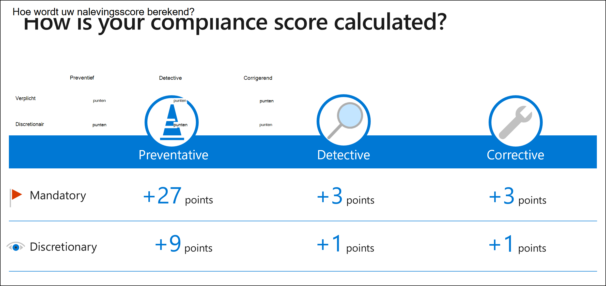

# Berekening van nalevingsscoreCompliance score calculation

**In dit artikel:** Lees hoe Compliance Manager een compliancescore voor uw organisatie berekent.**In this article:** Learn how Compliance Manager calculates a compliance score for your organization. In dit artikel wordt uitgelegd hoe  u uw **score** interpreteert, wat de beoordeling van de basislijn voor gegevensbescherming **omvat,** continue monitoring en hoe verschillende soorten acties worden beheerd **en beoordeeld.**This article explains how to **interpret your score**, what the **Data Protection Baseline assessment** includes, **continuous monitoring**, and **how different types of actions are managed and scored**.

> [!IMPORTANT]
> Aanbevelingen van Compliancebeheer mogen niet worden geïnterpreteerd als een garantie voor naleving.Recommendations from Compliance Manager should not be interpreted as a guarantee of compliance. Het is aan u om de effectiviteit van klantbesturingselementen per regelgevingsomgeving te evalueren en te valideren.It is up to you to evaluate and validate the effectiveness of customer controls per your regulatory environment. Deze services zijn onderworpen aan de voorwaarden in de [Voorwaarden voor onlineservices.](https://go.microsoft.com/fwlink/?linkid=2108910)These services are subject to the terms and conditions in the [Online Services Terms](https://go.microsoft.com/fwlink/?linkid=2108910). Zie ook [Microsoft 365 licentie-richtlijnen voor beveiliging en naleving](/office365/servicedescriptions/microsoft-365-service-descriptions/microsoft-365-tenantlevel-services-licensing-guidance/microsoft-365-security-compliance-licensing-guidance).See also [Microsoft 365 licensing guidance for security and compliance](/office365/servicedescriptions/microsoft-365-service-descriptions/microsoft-365-tenantlevel-services-licensing-guidance/microsoft-365-security-compliance-licensing-guidance).

## Uw compliancescore lezenHow to read your compliance score

Het compliancebeheerdashboard geeft uw algehele nalevingsscore weer.The Compliance Manager dashboard displays your overall compliance score. Deze score meet uw voortgang bij het voltooien van aanbevolen verbeteracties binnen besturingselementen.This score measures your progress in completing recommended improvement actions within controls. Uw score kan u helpen uw huidige nalevingshouding te begrijpen.Your score can help you understand your current compliance posture. Het kan u ook helpen om prioriteit te geven aan acties op basis van hun potentieel om risico's te beperken.It can also help you prioritize actions based on their potential to reduce risk.

Er wordt een scorewaarde toegewezen op drie niveaus:A score value is assigned at three levels:

1. **Actiescore voor verbetering:** elke actie heeft een andere invloed op uw score, afhankelijk van het mogelijke risico**Improvement action score**: each action has a different impact on your score depending on the potential risk involved

2. **Control score:** deze score is de som van de punten die zijn verdiend door het uitvoeren van verbeteracties binnen het besturingselement.**Control score**: this score is the sum of points earned by completing improvement actions within the control. Deze som wordt in zijn geheel toegepast op uw algemene nalevingsscore wanneer het besturingselement aan beide van de volgende voorwaarden voldoet:This sum is applied in its entirety to your overall compliance score when the control meets both of the following conditions:
    - **Implementatiestatus** is gelijk **aan Geïmplementeerd of** Alternatieve **implementatie** en**Implementation Status** equals **Implemented** or **Alternative Implementation**, and
    - **Testresultaat** is gelijk aan **Geslaagd**.**Test Result** equals **Passed**.

3. **Beoordelingsscore:** deze score is de som van uw controlescores.**Assessment score**: this score is the sum of your control scores. Deze wordt berekend aan de hand van actiescores.It is calculated using action scores. Elke Actie van Microsoft en elke verbeteringsactie die door uw organisatie wordt beheerd, wordt eenmaal geteld, ongeacht hoe vaak in een besturingselement wordt verwezen.Each Microsoft action and each improvement action managed by your organization is counted once, regardless of how often it is referenced in a control.

De algemene nalevingsscore wordt berekend met actiescores, waarbij elke Actie van Microsoft eenmaal wordt geteld, elke technische actie die u beheert één keer wordt geteld en elke niet-technische actie die u beheert, eenmaal per groep wordt geteld.The overall compliance score is calculated using action scores, where each Microsoft action is counted once, each technical action you manage is counted once, and each non-technical action you manage is counted once per group. Deze logica is ontworpen om de meest nauwkeurige boekhouding te bieden van de manier waarop acties worden geïmplementeerd en getest in uw organisatie.This logic is designed to provide the most accurate accounting of how actions are implemented and tested in your organization. U merkt mogelijk dat hierdoor uw algemene nalevingsscore kan afwijken van het gemiddelde van uw beoordelingsscores.You may notice that this can cause your overall compliance score to differ from the average of your assessment scores. Lees hieronder meer over [hoe acties worden gescoord.](#action-types-and-points)Read more below about [how actions are scored](#action-types-and-points).

## Eerste score op basis Microsoft 365 basislijn gegevensbeschermingInitial score based on Microsoft 365 data protection baseline
  
Compliance Manager geeft u een eerste score op basis van de Microsoft 365 basislijn voor gegevensbescherming.Compliance Manager gives you an initial score based on the Microsoft 365 data protection baseline. Deze basislijn is een set besturingselementen met belangrijke voorschriften en standaarden voor gegevensbescherming en algemeen gegevensbeheer.This baseline is a set of controls that includes key regulations and standards for data protection and general data governance. Deze basislijn haalt hoofdzakelijk elementen uit NIST CSF (National Institute of Standards and Technology Cyberbeveiligingskader) en ISO (International Organization for Standardization), evenals uit FedRAMP (Federal Risk and Authorization Management Program) en GDPR (General Data Protection Regulation of the European Union).This baseline draws elements primarily from NIST CSF (National Institute of Standards and Technology Cybersecurity Framework) and ISO (International Organization for Standardization), as well as from FedRAMP (Federal Risk and Authorization Management Program) and GDPR (General Data Protection Regulation of the European Union).

De eerste score wordt berekend op basis van de standaardbeoordeling basislijn gegevensbescherming die aan alle organisaties is verstrekt.Your initial score is calculated according to the default Data Protection Baseline assessment provided to all organizations. Bij uw eerste bezoek verzamelt Compliance Manager al signalen van uw Microsoft 365 oplossingen.Upon your first visit, Compliance Manager is already collecting signals from your Microsoft 365 solutions. U ziet in één oogopslag hoe uw organisatie presteert ten opzichte van belangrijke standaarden en voorschriften voor gegevensbescherming en ziet voorgestelde verbeteracties.You’ll see at a glance how your organization is performing relative to key data protection standards and regulations, and see suggested improvement actions to take.

Omdat elke organisatie specifieke behoeften heeft, vertrouwt Compliance Manager op u om beoordelingen in te stellen en te beheren om risico's zo veel mogelijk te minimaliseren en te beperken.Because every organization has specific needs, Compliance Manager relies on you to set up and manage assessments to help minimize and mitigate risk as comprehensively as possible.

## Hoe Compliance Manager besturingselementen continu beoordeeltHow Compliance Manager continuously assesses controls

Compliance Manager scant automatisch uw Microsoft 365 omgeving en detecteert uw systeeminstellingen, continu en automatisch uw technische actiestatus bijwerken.Compliance Manager automatically scans through your Microsoft 365 environment and detects your system settings, continuously and automatically updating your technical action status. Microsoft Secure Score is de onderliggende engine die de monitoring uitvoert.Microsoft Secure Score is the underlying engine that performs the monitoring.

Uw actiestatus wordt elke 24 uur bijgewerkt op uw dashboard.Your action status is updated on your dashboard every 24 hours. Wanneer u een aanbeveling volgt om een besturingselement te implementeren, ziet u meestal de status van het besturingselement dat de volgende dag wordt bijgewerkt.Once you follow a recommendation to implement a control, you’ll typically see the control status updated the next day.

Als u bijvoorbeeld meervoudige verificatie (MFA) inschakelen in de Azure AD-portal, wordt de instelling gedetecteerd en wordt deze weergegeven in de details van de oplossing voor besturingselementtoegang.For example, if you turn on multi-factor authentication (MFA) in the Azure AD portal, Compliance Manager detects the setting and reflects it in the control access solution details. Als u MFA echter niet hebt in- of uit- gezet, markeert Compliance Manager dit als een aanbevolen actie die u moet ondernemen.Conversely, if you didn’t turn on MFA, Compliance Manager flags that as a recommended action for you to take.

Meer informatie over [Secure Score en hoe deze werkt.](../security/defender/microsoft-secure-score.md)Learn more about [Secure Score and how it works](../security/defender/microsoft-secure-score.md).
  
## Actietypen en puntenAction types and points

Compliance manager houdt twee soorten acties bij:Compliance Manager tracks two types of actions:

1. **Uw verbeteracties:** acties die uw organisatie beheert.**Your improvement actions**: actions that your organization manages.
2. **Microsoft-acties:** acties die door Microsoft worden beheert.**Microsoft actions**: actions that Microsoft manages.

Beide typen acties hebben punten die meetellen voor de totale score wanneer ze zijn voltooid.Both types of actions have points that count toward your overall score when completed.

### Technische en niet-technische actiesTechnical and non-technical actions

Acties worden gegroepeerd op technische of niet-technische aard.Actions are grouped by whether they are technical or non-technical in nature. Het scoreeffect van elke actie verschilt per type.The scoring impact of each action differs by type.

- **Technische acties** worden geïmplementeerd door te werken met de technologie van een oplossing (bijvoorbeeld door een configuratie te wijzigen).**Technical actions** are implemented by interacting with the technology of a solution (for example, changing a configuration). De punten voor technische acties worden eenmaal per actie toegekend, ongeacht het aantal groepen.The points for technical actions are granted once per action, regardless of how many groups it belongs to.

- **Niet-technische acties** worden beheerd door uw organisatie en geïmplementeerd op andere manieren dan het werken met de technologie van een oplossing.**Non-technical actions** are managed by your organization and implemented in ways other than working with the technology of a solution. Er zijn twee soorten niet-technische acties: **documentatie** en **operationeel.**There are two types of non-technical actions: **documentation** and **operational**. De punten voor deze acties worden toegepast op de nalevingsscore op groepsniveau.The points for these actions are applied to your compliance score at a group level. Dit betekent dat als een actie in meerdere groepen bestaat, u de puntwaarde van de actie ontvangt telkens wanneer u deze in een groep implementeert.This means that if an action exists in multiple groups, you will receive the action's point value each time you implement it within a group.

**Voorbeeld van de manier waarop technische en niet-technische acties worden gescored:****Example of how technical and non-technical actions are scored:**

Stel dat u een technische actie hebt met een waarde van 3 punten die bestaat uit 5 groepen en dat u een niet-technische actie hebt met een waarde van 3 punten die bestaat uit dezelfde 5 groepen.Let's say you have a technical action worth 3 points that exists in 5 groups, and you have a non-technical action worth 3 points that exists in the same 5 groups.

Als u de technische actie hebt geïmplementeerd, is het totale aantal punten dat u ontvangt 3.If you successfully implement the technical action, the total number of points you receive is 3. Dit komt omdat u de actie slechts één keer hoeft te implementeren voor uw tenant.This is because you only need to implement the action once for your tenant. De implementatie- en teststatus voor de technische actie wordt in alle gevallen van die actie hetzelfde weergeven, in elke groep waar deze deel van uitmaken.The implementation and test status for the technical action will show the same in all instances of that action, in every group it belongs to.

Als u de niet-technische actie in elk van de 5 groepen hebt geïmplementeerd, is het totale aantal punten dat u ontvangt 15.If you successfully implement the non-technical action in each of the 5 groups, the total number of points you receive is 15. Dit komt omdat u de actie in elke groep moet implementeren.This is because you need to implement the action in each group. De implementatie- en teststatus voor de niet-technische actie verschilt per groep, omdat de actie afzonderlijk binnen elk van de groepen wordt geïmplementeerd.The implementation and test status for the non-technical action will differ across groups because the action is implemented separately within each of its groups.

Deze scorelogica is ontworpen om de meest nauwkeurige boekhouding te bieden van de manier waarop acties worden geïmplementeerd en getest in uw organisatie.This scoring logic is designed to provide the most accurate accounting of how actions are implemented and tested in your organization.

### De manier waarop scorewaarden worden bepaaldHow score values are determined
 
Acties krijgen een scorewaarde toegewezen op basis van of ze verplicht of discretionair zijn, en of ze preventief, foutief of corrigerend zijn.Actions are assigned a score value based on whether they’re mandatory or discretionary, and whether they’re preventative, detective, or corrective.

### Verplichte en discretionaire actiesMandatory and discretionary actions

 - **Verplichte acties** kunnen niet opzettelijk of per ongeluk worden overgeslagen.**Mandatory actions** can't be bypassed, either intentionally or accidentally. Een voorbeeld van een verplichte actie is een centraal beheerd wachtwoordbeleid dat vereisten stelt voor wachtwoordlengte, complexiteit en verloop.An example of a mandatory action is a centrally managed password policy that sets requirements for password length, complexity, and expiration. Gebruikers moeten deze vereisten volgen om toegang te krijgen tot het systeem.Users must follow these requirements to access the system.
  
 - **Discretionaire acties zijn** afhankelijk van gebruikers om een beleid te begrijpen en na te leven.**Discretionary actions** rely upon users to understand and adhere to a policy. Een beleid waarbij gebruikers bijvoorbeeld worden verplicht hun computer te vergrendelen wanneer ze de computer verlaten, is een discretionaire actie omdat deze afhankelijk is van de gebruiker.For example, a policy requiring users to lock their computer when they leave it is a discretionary action because it relies on the user.
  
### Preventieve, recherche- en corrigerende actiesPreventative, detective, and corrective actions
  
 - **Preventieve acties richten** zich op specifieke risico's.**Preventative actions** address specific risks. Het beveiligen van gegevens in rust met behulp van versleuteling is bijvoorbeeld een preventief middel tegen aanvallen en inbreuken.For example, protecting information at rest using encryption is a preventative action against attacks and breaches. Scheiding van rechten is een preventief optreden om belangenverstrengeling te beheren en fraude te beschermen.Separation of duties is a preventative action to manage conflict of interest and guard against fraud.
  
 - **Met detectieacties** worden systemen actief gecontroleerd om onregelmatige omstandigheden of gedragingen te identificeren die risico's vertegenwoordigen, of die kunnen worden gebruikt om inbraken of inbreuken op te sporen.**Detective actions** actively monitor systems to identify irregular conditions or behaviors that represent risk, or that can be used to detect intrusions or breaches. Voorbeelden hiervan zijn systeemtoegangscontrole en bevoorrechte beheeracties.Examples include system access auditing and privileged administrative actions. Nalevingsaudits voor regelgeving zijn een soort actie van de recherche die wordt gebruikt om procesproblemen op te lossen.Regulatory compliance audits are a type of detective action used to find process issues.
  
- **Corrigerende acties** proberen de negatieve effecten van een beveiligingsincident tot een minimum te beperken, corrigerende actie te ondernemen om het onmiddellijke effect te beperken en de schade zo mogelijk terug te draaien.**Corrective actions** try to keep the adverse effects of a security incident to a minimum, take corrective action to reduce the immediate effect, and reverse the damage if possible. Reactie op privacy-incidenten is een corrigerende actie om schade te beperken en systemen te herstellen naar een operationele status na een inbreuk.Privacy incident response is a corrective action to limit damage and restore systems to an operational state after a breach.
  
Elke actie heeft een toegewezen waarde in Compliance Manager op basis van het risico dat deze vertegenwoordigt:Each action has an assigned value in Compliance Manager based on the risk it represents:

|**Type****Type**|**Toegewezen score****Assigned score**|
|:-----|:-----|
| Preventief verplichtPreventative mandatory | 2727 |
| Preventief discretionairPreventative discretionary | 99 |
| Detective verplichtDetective mandatory | 33 |
| Discretionaire bevoegdheid van de rechercheDetective discretionary | 11 |
| Corrigerend verplichtCorrective mandatory | 33 |
| Correctieve discretionaire bevoegdheidCorrective discretionary | 11 |
  
