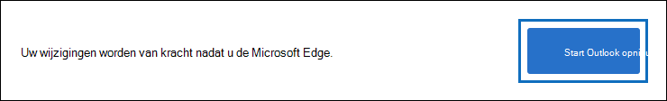
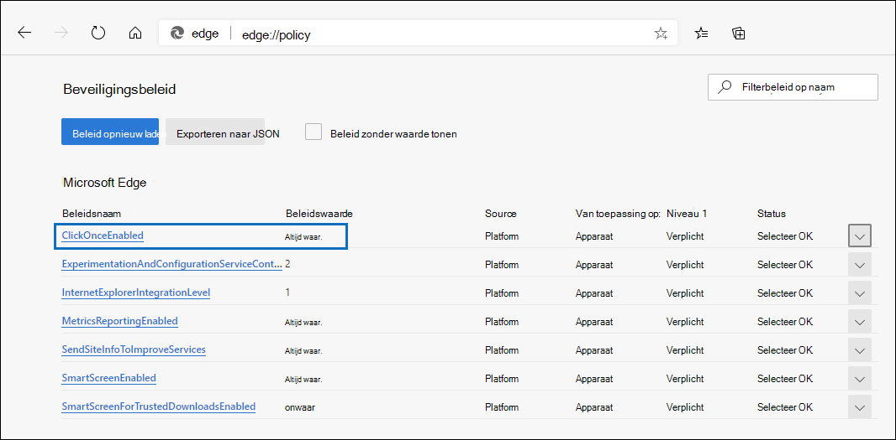
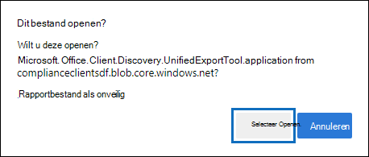
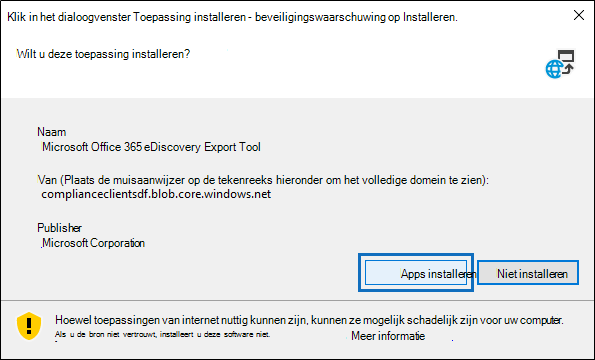

# Het eDiscovery-exporthulpmiddel gebruiken in Microsoft EdgeUse the eDiscovery Export Tool in Microsoft Edge

Als gevolg van recente wijzigingen in de nieuwste versie van Microsoft Edge is ClickOnce standaard niet meer ingeschakeld.As a result of recent changes to the newest version of Microsoft Edge, ClickOnce support is no longer enabled by default. Als u het hulpprogramma voor eDiscovery-export wilt blijven gebruiken om zoekresultaten voor Inhoud zoeken of eDiscovery te downloaden, moet u [Microsoft Internet Explorer](https://support.microsoft.com/help/17621/internet-explorer-downloads) gebruiken of ClickOnce-ondersteuning inschakelen in de nieuwste versie van Microsoft Edge.To continue using the eDiscovery Export Tool to download Content Search or eDiscovery search results, you either need to use [Microsoft Internet Explorer](https://support.microsoft.com/help/17621/internet-explorer-downloads) or enable ClickOnce support in the newest version of Microsoft Edge.

## Ondersteuning ClickOnce inschakelen in Microsoft EdgeEnable ClickOnce support in Microsoft Edge

1. Ga Microsoft Edge naar **edge://flags/#edge-click-once.**In Microsoft Edge, go to **edge://flags/#edge-click-once**.

2. Als de bestaande waarde is ingesteld op **Standaard of** **Uitgeschakeld** in de vervolgkeuzelijst, wijzigt u deze in **Ingeschakeld.**If the existing value is set to **Default** or **Disabled** in the dropdown list, change it to **Enabled**.

   

3. Schuif omlaag naar de onderkant van het browservenster en klik op Opnieuw starten **om** Edge opnieuw te starten.Scroll down to the bottom of the browser window and click **Restart** to restart Edge.

   

**Opmerking:** Organisaties kunnen groepsbeleid gebruiken om de ondersteuning ClickOnce uitschakelen.**Note:** Organizations can use Group Policy to disable ClickOnce support. Als u wilt controleren of er een organisatiebeleid is voor ClickOnce ondersteuning, gaat u naar **edge://policy.**To check if there is an organizational policy for ClickOnce support, go to **edge://policy**. In de volgende schermafbeelding ziet u ClickOnce is ingeschakeld in de hele organisatie.The following screenshot shows that ClickOnce is enabled across the entire organization. Als deze beleidswaarde is ingesteld op **onwaar,** moet u contact opnemen met een beheerder in uw organisatie.If this policy value is set to **false**, you will need to contact an admin in your organization.

## Het hulpprogramma voor eDiscovery-export installeren en uitvoerenInstall and run the eDiscovery Export Tool

1. Klik **op Resultaten downloaden** op de flyoutpagina van een export in Inhoud zoeken of een eDiscovery-zaak.Click **Download results** on the flyout page of an export in Content Search or an eDiscovery case.

   

2. U wordt gevraagd of u het hulpprogramma wilt starten, klik op **Openen.**You will be prompted with a confirmation to launch the tool, Click **Open**.

   

   Als het eDiscovery-exportprogramma niet is geïnstalleerd, wordt u gevraagd om een beveiligingswaarschuwing,If the eDiscovery Export Tool isn't installed, you will be prompted with a Security Warning, 

   

3. Klik op **Installeren**.Click **Install**. Nadat het hulpprogramma is geïnstalleerd, wordt het exportprogramma automatisch uitgevoerd.After it's installed, the export tool will launch automatically.

Zie de volgende onderwerpen voor meer informatie:For more information, see the following topics:

- [Inhoudszoekresultaten exporterenExport Content Search results](export-search-results.md)

- [Experimentvlaggen inschakelen in Microsoft EdgeHow to enable experiment flags in Microsoft Edge](https://microsoftedgesupport.microsoft.com/hc/articles/360034075294-How-to-enable-experiment-flags-in-Microsoft-Edge-Insider-channels)
