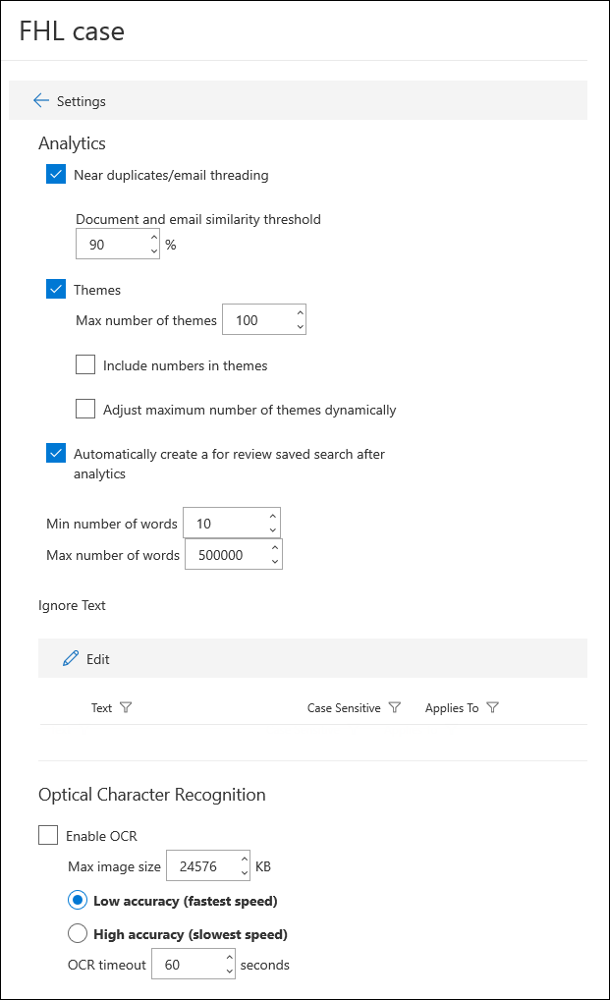

# Zoek- en analyseinstellingen configureren in Advanced eDiscoveryConfigure search and analytics settings in Advanced eDiscovery

U kunt instellingen configureren voor elke Advanced eDiscovery om de volgende functionaliteit te beheren.You can configure settings for each Advanced eDiscovery case to control the following functionality.

- In de buurt van duplicaten en e-mailthreadingNear duplicates and email threading

- Thema'sThemes

- Query automatisch gegenereerde revisiesetAutogenerated review set query

- Tekst negerenIgnore text

- Optische tekenherkenningOptical character recognition

Zoek- en analyse-instellingen configureren voor een zaak:To configure search and analytics settings for a case:

1. Selecteer op **Advanced eDiscovery** pagina het hoofdje.On the **Advanced eDiscovery** page, select the case.

2. Klik op **Instellingen** tabblad Zoeken & **op** **Selecteren.**On the **Settings** tab, under **Search & analytics**, click **Select**.

   De pagina met hoofd- en hoofdinstellingen wordt weergegeven.The case settings page is displayed. Deze instellingen worden toegepast op alle revisiesets in een zaak.These settings are applied to all review sets in a case.

   

## In de buurt van duplicaten en e-mailthreadingNear duplicates and email threading

In deze sectie kunt u parameters instellen voor dubbele detectie, bijna dubbele detectie en e-mailthreading.In this section, you can set parameters for duplicate detection, near duplicate detection, and email threading. Zie Near [duplicate detection and](near-duplicate-detection-in-advanced-ediscovery.md) Email threading (Bijna dubbele detectie en [E-mailthreading) voor meer informatie.](email-threading-in-advanced-ediscovery.md)For more information, see [Near duplicate detection](near-duplicate-detection-in-advanced-ediscovery.md) and [Email threading](email-threading-in-advanced-ediscovery.md).

- **Near duplicates/email threading:** Wanneer deze is ingeschakeld, worden dubbele detectie, bijna dubbele detectie en e-mailthreading opgenomen als onderdeel van de werkstroom wanneer u analyses op de gegevens in een revisieset uitwerkt.**Near duplicates/email threading:** When turned on, duplicate detection, near duplicate detection, and email threading are included as part of the workflow when you run analytics on the data in a review set.

- **Drempelwaarde voor document- en e-mail gelijkenis:** Als het vergelijkbaarheidsniveau voor twee documenten boven de drempelwaarde ligt, worden beide documenten in dezelfde bijna dubbele set gezet.**Document and email similarity threshold:** If the similarity level for two documents is above the threshold, both documents are put in the same near duplicate set.

- **Minimum/maximum aantal woorden:** In deze instellingen wordt aangegeven dat in de buurt van duplicaten en e-mailthreading alleen wordt uitgevoerd op documenten met ten minste het minimum aantal woorden en maximaal het maximum aantal woorden.**Minimum/maximum number of words:** These settings specify that near duplicates and email threading analysis are performed only on documents that have at least the minimum number of words and at most the maximum number of words.

## Thema'sThemes

In deze sectie kunt u parameters voor thema's instellen.In this section, you can set parameters for themes. Zie Thema's voor [meer informatie.](themes-in-advanced-ediscovery.md)For more information, see [Themes](themes-in-advanced-ediscovery.md).

- **Thema's:** Wanneer deze is ingeschakeld, wordt het clusteren van thema's uitgevoerd als onderdeel van de werkstroom wanneer u analyses op de gegevens in een revisieset uitwerkt.**Themes:** When turned on, themes clustering is performed as part of the workflow when you run analytics on the data in a review set.

- **Maximum aantal thema's:** Hiermee geeft u het maximum aantal thema's op dat kan worden gegenereerd wanneer u analyses op de gegevens in een revisieset uit te voeren.**Maximum number of themes:** Specifies the maximum number of themes that can be generated when you run analytics on the data in a review set.

- **Getallen opnemen in thema's:** Wanneer deze is ingeschakeld, worden getallen (waarmee een thema wordt vermeld) opgenomen bij het genereren van thema's.**Include numbers in themes:** When turned on, numbers (that identify a theme) are included when generating themes. 

- **Het maximum aantal thema's dynamisch aanpassen:** In bepaalde situaties zijn er mogelijk onvoldoende documenten in een revisieset om het gewenste aantal thema's te produceren.**Adjust maximum number of themes dynamically:** In certain situations, there may not be enough documents in a review set to produce the desired number of themes. Wanneer deze instelling is ingeschakeld, wordt Advanced eDiscovery het maximum aantal thema's dynamisch aangepast in plaats van het maximum aantal thema's af te dwingen.When this setting is enabled, Advanced eDiscovery adjusts the maximum number of themes dynamically rather than attempting to enforce the maximum number of themes.

## RevisiesetqueryReview set query

Als u het selectievakje **Automatisch een** opgeslagen zoekactie voor revisie maken na analyse in selecteert, Advanced eDiscovery query voor de autogenerates van de revisieset met de naam **Voor revisie.**If you select the **Automatically create a For Review saved search after analytics** checkbox, Advanced eDiscovery autogenerates review set query named **For Review.** 

Met deze query worden in feite dubbele items uit de revisieset gefilterd.This query basically filters out duplicate items from the review set. Hiermee kunt u de unieke items in de revisieset bekijken.This lets you review the unique items in the review set. Deze query wordt alleen gemaakt wanneer u analyses uitvoert voor een revisieset in de zaak.This query is created only when you run analytics for a review set in the case. Zie Query's uitvoeren op de gegevens in een revisieset voor meer informatie over [revisiesetquery's.](review-set-search.md)For more information, about review set queries, see [Query the data in a review set](review-set-search.md).

## Tekst negerenIgnore text

Er zijn situaties waarin bepaalde tekst de kwaliteit van de analyse vermindert, zoals lange vrijwaringen die worden toegevoegd aan e-mailberichten, ongeacht de inhoud van de e-mail.There are situations where certain text will diminish the quality of analytics, such as lengthy disclaimers that get added to email messages regardless of the content of the email. Als u weet van tekst die moet worden genegeerd, kunt u deze uitsluiten van analyse door de tekenreeks en de analysefunctionaliteit (Near-duplicates, Email threading, Themes en Relevantie) op te geven waarin de tekst moet worden uitgesloten.If you know of text that should be ignored, you can exclude it from analytics by specifying the text string and the analytics functionality (Near-duplicates, Email threading, Themes, and Relevance) that the text should be excluded for. Het gebruik van reguliere expressies (RegEx) als genegeerde tekst wordt ook ondersteund.Using regular expressions (RegEx) as ignored text is also supported.

## OcR (Optical Character Recognition)Optical character recognition (OCR)

Wanneer deze instelling is ingeschakeld, wordt OCR-verwerking uitgevoerd op afbeeldingsbestanden.When this setting is turned on, OCR processing will be run on image files. OCR-verwerking wordt uitgevoerd in de volgende situaties:OCR processing is run in the following situations:

- Wanneer bewaarders en [niet-bewaardergegevensbronnen](non-custodial-data-sources.md) aan een zaak worden toegevoegd.When custodians and [non-custodial data sources](non-custodial-data-sources.md) are added to a case. Wanneer OCR wordt toegepast op afbeeldingsbestanden, kan de tekst in die bestanden worden doorzocht tijdens een verzameling.When OCR is applied to image files, the text in those files will be searchable during a collection. OCR-verwerking wordt uitgevoerd tijdens het [proces voor geavanceerde indexering.](indexing-custodian-data.md)OCR processing is performed during the [Advanced indexing](indexing-custodian-data.md) process. OCR wordt alleen uitgevoerd op items die tijdens geavanceerde indexering worden verwerkt.OCR is only run on items that are processed during Advanced indexing. Als bijvoorbeeld een groot PDF-bestand dat gedeeltelijk is geïndexeerd of andere indexeringsfouten heeft gehad, wordt verwerkt tijdens geavanceerde indexering, wordt in het bestand ook OCR toegepast.For example, if a large PDF file that is partially indexed or had other indexing errors is processed during Advanced indexing, the file will also have OCR applied. Met andere woorden, OCR-verwerking vindt alleen plaats op bestanden die opnieuw worden geïndexeerd tijdens het proces voor geavanceerde indexering.In other words, OCR processing only occurs on files that are re-indexed during the Advanced indexing process. Dit betekent dat er situaties kunnen zijn waarin bewaarders aan een zaak worden toegevoegd, maar sommige e-mailbijlagen worden niet verwerkt voor OCR omdat deze bestanden niet worden verwerkt tijdens geavanceerde indexering.This means there may be situations where custodians are added to a case but some email attachments won't be processed for OCR because those files are not processed during Advanced indexing.

- Wanneer inhoud uit andere gegevensbronnen (die niet zijn gekoppeld aan een bewaarder en die in een niet-bewaardergegevensbron aan de zaak is toegevoegd) wordt toegevoegd aan een revisieset.When content from other data sources (that aren't associated with a custodian and added to the case in a non-custodial data source) is added to a review set.

Nadat gegevens aan een revisieset zijn toegevoegd, kan afbeeldingstekst worden gecontroleerd, doorzocht, gelabeld en geanalyseerd.After data is added to a review set, image text can be reviewed, searched, tagged, and analyzed. U kunt de uitgepakte tekst weergeven in de tekstviewer van het geselecteerde afbeeldingsbestand in de revisieset.You can view the extracted text in the Text viewer of the selected image file in the review set. Zie voor meer informatie:For more information, see:

- [Geavanceerde indexering van beheerdersgegevensAdvanced indexing of custodian data](indexing-custodian-data.md)

- [Zoekresultaten toevoegen aan een controlesetAdd search results to a review set](add-data-to-review-set.md#optical-character-recognition)

- [Ondersteunde afbeeldingsbestandstypenSupported image file types](supported-filetypes-ediscovery20.md#image)
