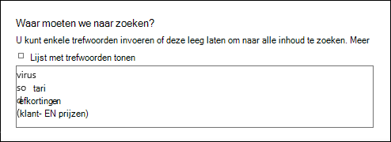
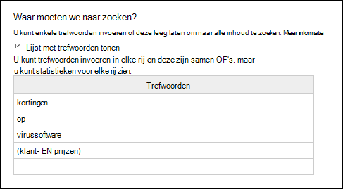
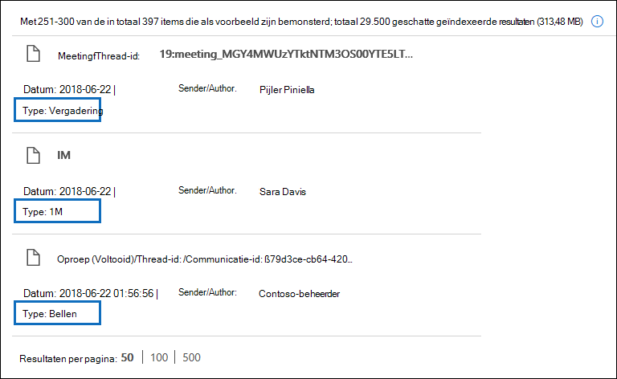
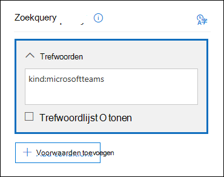
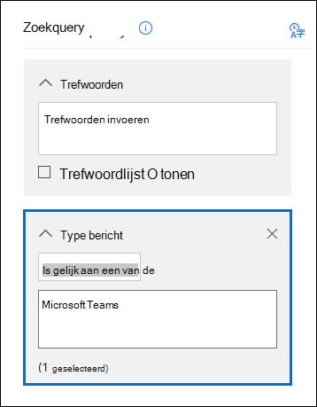
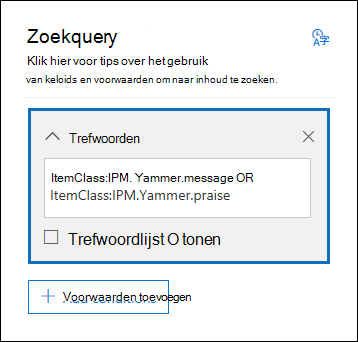
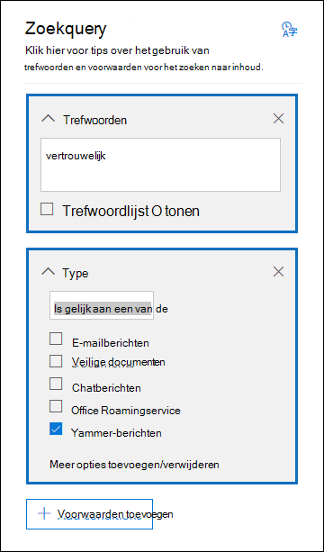

# <a name="content-search-reference"></a><span data-ttu-id="51b55-103">Verwijzing voor inhoud zoeken</span><span class="sxs-lookup"><span data-stu-id="51b55-103">Content search reference</span></span>

## <a name="content-search-limits"></a><span data-ttu-id="51b55-104">Limieten voor inhoud zoeken</span><span class="sxs-lookup"><span data-stu-id="51b55-104">Content search limits</span></span>

- <span data-ttu-id="51b55-105">Zie [Limieten voor Inhoud zoeken](limits-for-content-search.md) voor een beschrijving van de limieten die gelden voor Inhoud zoeken.</span><span class="sxs-lookup"><span data-stu-id="51b55-105">For a description of the limits that are applied to content searches, see [Limits for Content search](limits-for-content-search.md).</span></span>
  
- <span data-ttu-id="51b55-106">Microsoft verzamelt prestatiegegevens voor zoekopdrachten naar inhoud die worden uitgevoerd door alle organisaties in de service.</span><span class="sxs-lookup"><span data-stu-id="51b55-106">Microsoft collects performance information for Content searches run by all organizations in the service.</span></span> <span data-ttu-id="51b55-107">Hoewel de complexiteit van de zoekquery van invloed kan zijn op de zoektijd, is het aantal te doorzoeken postvakken de grootste factor die van invloed is op de zoektijd.</span><span class="sxs-lookup"><span data-stu-id="51b55-107">While the complexity of the search query can impact search times, the biggest factor that affects how long searches take is the number of mailboxes searched.</span></span> <span data-ttu-id="51b55-108">Hoewel Microsoft geen serviceovereenkomst voor zoektijden biedt, bevat de volgende tabel de gemiddelde zoektijden voor een inhoudzoekactie op basis van het aantal postvakken in de zoekopdracht.</span><span class="sxs-lookup"><span data-stu-id="51b55-108">Although Microsoft doesn't provide a Service Level Agreement for search times, the following table lists average search times for a Content Search based on the number of mailboxes included in the search.</span></span>
  
  |<span data-ttu-id="51b55-109">**Aantal postvakken**</span><span class="sxs-lookup"><span data-stu-id="51b55-109">**Number of mailboxes**</span></span>|<span data-ttu-id="51b55-110">**Gemiddelde zoektijd**</span><span class="sxs-lookup"><span data-stu-id="51b55-110">**Average search time**</span></span>|
  |:-----|:-----|
  |<span data-ttu-id="51b55-111">100</span><span class="sxs-lookup"><span data-stu-id="51b55-111">100</span></span>  <br/> |<span data-ttu-id="51b55-112">30 seconden</span><span class="sxs-lookup"><span data-stu-id="51b55-112">30 seconds</span></span>  <br/> |
  |<span data-ttu-id="51b55-113">1000</span><span class="sxs-lookup"><span data-stu-id="51b55-113">1,000</span></span>  <br/> |<span data-ttu-id="51b55-114">45 seconden</span><span class="sxs-lookup"><span data-stu-id="51b55-114">45 seconds</span></span>  <br/> |
  |<span data-ttu-id="51b55-115">10.000</span><span class="sxs-lookup"><span data-stu-id="51b55-115">10,000</span></span>  <br/> |<span data-ttu-id="51b55-116">4 minuten</span><span class="sxs-lookup"><span data-stu-id="51b55-116">4 minutes</span></span>  <br/> |
  |<span data-ttu-id="51b55-117">25.000</span><span class="sxs-lookup"><span data-stu-id="51b55-117">25,000</span></span>  <br/> |<span data-ttu-id="51b55-118">10 minuten</span><span class="sxs-lookup"><span data-stu-id="51b55-118">10 minutes</span></span>  <br/> |
  |<span data-ttu-id="51b55-119">50.000</span><span class="sxs-lookup"><span data-stu-id="51b55-119">50,000</span></span>  <br/> |<span data-ttu-id="51b55-120">20 minuten</span><span class="sxs-lookup"><span data-stu-id="51b55-120">20 minutes</span></span>  <br/> |
  |<span data-ttu-id="51b55-121">100.000</span><span class="sxs-lookup"><span data-stu-id="51b55-121">100,000</span></span>  <br/> |<span data-ttu-id="51b55-122">25 minuten</span><span class="sxs-lookup"><span data-stu-id="51b55-122">25 minutes</span></span>  <br/> |
  |||
  
## <a name="building-a-search-query"></a><span data-ttu-id="51b55-123">Een zoekquery maken</span><span class="sxs-lookup"><span data-stu-id="51b55-123">Building a search query</span></span>

<span data-ttu-id="51b55-124">Zie [Trefwoordquery's en zoekvoorwaarden voor Inhoud zoeken ](keyword-queries-and-search-conditions.md) voor meer informatie over het maken van een zoekquery, het gebruik van booleaanse zoekoperatoren en zoekvoorwaarden, en het zoeken naar gevoelige informatietypen en inhoud die met gebruikers van buiten uw organisatie worden gedeeld.</span><span class="sxs-lookup"><span data-stu-id="51b55-124">For detailed information about creating a search query, using Boolean search operators and search conditions, and searching for sensitive information types and content shared with users outside your organization, see [Keyword queries and search conditions for Content Search ](keyword-queries-and-search-conditions.md).</span></span>
  
<span data-ttu-id="51b55-125">Houd rekening met het volgende wanneer u de lijst met trefwoorden gebruikt om een zoekquery te maken.</span><span class="sxs-lookup"><span data-stu-id="51b55-125">Keep the following things in mind when using the keyword list to create a search query.</span></span>
  
- <span data-ttu-id="51b55-126">Schakel het selectievakje **Lijst met trefwoorden weergeven** in en typ elk trefwoord in een aparte rij om een zoekquery te maken waarin de trefwoorden (of trefwoordzinnen) in elke rij zijn gekoppeld aan de operator **OR**.</span><span class="sxs-lookup"><span data-stu-id="51b55-126">You have to select the **Show keyword list** checkbox and then type each keyword in a separate row to create a search query where the keywords (or keyword phrases) in each row are connected by the **OR** operator.</span></span> <span data-ttu-id="51b55-127">Als u een lijst met trefwoorden in het trefwoordenvak plakt of op de toets **Enter** drukt nadat u een trefwoord hebt getypt, worden deze niet aan de operator **OR** gekoppeld.</span><span class="sxs-lookup"><span data-stu-id="51b55-127">If you paste a list of keywords in the keyword box or press the **Enter** key after typing a keyword, they won't be connected by the **OR** operator.</span></span> <span data-ttu-id="51b55-128">Hier ziet u een aantal onjuiste en juiste voorbeelden van de manier waarop een lijst met trefwoorden wordt toegevoegd.</span><span class="sxs-lookup"><span data-stu-id="51b55-128">Here are incorrect and correct examples of how to add a list of keywords.</span></span>
    
    <span data-ttu-id="51b55-129">**Onjuist**</span><span class="sxs-lookup"><span data-stu-id="51b55-129">**Incorrect**</span></span>
    
    
  
    <span data-ttu-id="51b55-131">**Juist**</span><span class="sxs-lookup"><span data-stu-id="51b55-131">**Correct**</span></span>
    
    
  
- <span data-ttu-id="51b55-133">U kunt ook een lijst met trefwoorden of trefwoordzinnen maken in een Excel-bestand of een bestand met tekst zonder opmaak, en de lijst vervolgens in de lijst met trefwoorden kopiëren.</span><span class="sxs-lookup"><span data-stu-id="51b55-133">You can also prepare a list of keywords or keyword phrases in an Excel file or a plain text file, and then copy and paste your list into the keyword list.</span></span> <span data-ttu-id="51b55-134">Hiervoor moet u het selectievakje **Lijst met zoekwoorden weergeven** selecteren.</span><span class="sxs-lookup"><span data-stu-id="51b55-134">To do this, you have to select the **Show keyword list** check box.</span></span> <span data-ttu-id="51b55-135">Klik vervolgens op de eerste rij in de lijst met trefwoorden en plak er de lijst in.</span><span class="sxs-lookup"><span data-stu-id="51b55-135">Then, click the first row in the keyword list and paste your list.</span></span> <span data-ttu-id="51b55-136">Elke regel uit het Excel- of tekstbestand wordt in een aparte rij in de lijst met trefwoorden geplaatst.</span><span class="sxs-lookup"><span data-stu-id="51b55-136">Each line from the Excel or text file is pasted into separate row in the keyword list.</span></span> 
    
- <span data-ttu-id="51b55-137">Nadat u een query hebt gemaakt met behulp van de lijst met trefwoorden, controleert u de syntaxis van de zoekquery.</span><span class="sxs-lookup"><span data-stu-id="51b55-137">After you create a query using the keyword list, it's a good idea to verify the search query syntax to make the search query is what you intended.</span></span> <span data-ttu-id="51b55-138">In de zoekquery die onder **Query** in het detailvenster wordt weergegeven, worden de trefwoorden gescheiden door de tekst **(c:s)**.</span><span class="sxs-lookup"><span data-stu-id="51b55-138">In the search query that's displayed under **Query** in the details pane, the keywords are separated by the text **(c:s)**.</span></span> <span data-ttu-id="51b55-139">Dit geeft aan dat de trefwoorden zijn gekoppeld aan een logische operator die vergelijkbaar is met de operator **OR**.</span><span class="sxs-lookup"><span data-stu-id="51b55-139">This indicates that the keywords are connected by a logical operator similar in functionality to the **OR** operator.</span></span> <span data-ttu-id="51b55-140">Als uw zoekopdracht voorwaarden bevat, worden de trefwoorden en voorwaarden gescheiden door de tekst **(c:c)**.</span><span class="sxs-lookup"><span data-stu-id="51b55-140">Similarly, if your search query includes conditions, the keywords and the conditions are separated by the text **(c:c)**.</span></span> <span data-ttu-id="51b55-141">Dit geeft aan dat de trefwoorden aan de voorwaarden zijn gekoppeld met een logische operator die vergelijkbaar is met de operator **AND**.</span><span class="sxs-lookup"><span data-stu-id="51b55-141">This indicates that the keywords are connected to the conditions with a logical operator similar in functionality to the **AND** operator.</span></span> <span data-ttu-id="51b55-142">Hier ziet u een voorbeeld van de zoekquery (weergegeven in het deelvenster Details) die het resultaat is bij gebruik van de lijst met trefwoorden en een voorwaarde.</span><span class="sxs-lookup"><span data-stu-id="51b55-142">Here's an example of the search query (displayed in the Details pane) that results when using the keyword list and a condition.</span></span> 
    
    
  
- <span data-ttu-id="51b55-144">Wanneer u een inhoudszoekopdracht uitvoert, controleert Microsoft 365 automatisch uw zoekopdracht op niet-ondersteunde tekens en op Booleaanse operatoren die mogelijk niet in hoofdletters zijn geschreven.</span><span class="sxs-lookup"><span data-stu-id="51b55-144">When you run a content search, Microsoft 365 automatically checks your search query for unsupported characters and for Boolean operators that may not be capitalized.</span></span> <span data-ttu-id="51b55-145">Niet-ondersteunde tekens zijn vaak verborgen en veroorzaken gewoonlijk een zoekfout of geven onbedoelde resultaten.</span><span class="sxs-lookup"><span data-stu-id="51b55-145">Unsupported characters are often hidden and typically cause a search error or return unintended results.</span></span> <span data-ttu-id="51b55-146">Zie [De query van Inhoud zoeken op fouten controleren](check-your-content-search-query-for-errors.md) voor meer informatie over de niet-ondersteunde tekens die worden gecontroleerd.</span><span class="sxs-lookup"><span data-stu-id="51b55-146">For more information about the unsupported characters that are checked, see [Check your Content Search query for errors](check-your-content-search-query-for-errors.md).</span></span>
    
- <span data-ttu-id="51b55-147">Als u een zoekquery hebt met trefwoorden voor niet-Nederlandstalige tekens (bijvoorbeeld Chinese tekens ), kunt u op **Taal-land/regio voor query** klikken en een cultuurcodewaarde voor taal/regio voor de zoekopdracht selecteren.</span><span class="sxs-lookup"><span data-stu-id="51b55-147">If you have a search query that contains keywords for non-English characters (such as Chinese characters), you can click **Query language-country/region** and select a language-country culture code value for the search.</span></span> <span data-ttu-id="51b55-148">De standaardtaal/-regio is neutraal.</span><span class="sxs-lookup"><span data-stu-id="51b55-148">The default language/region is neutral.</span></span> <span data-ttu-id="51b55-149">Hoe weet ik of ik de taalinstelling voor een inhoudzoekactie moet wijzigen?</span><span class="sxs-lookup"><span data-stu-id="51b55-149">How can you tell if you need to change the language setting for a content search?</span></span> <span data-ttu-id="51b55-150">Als u er zeker van bent dat bepaalde inhoudslocaties de niet-Nederlandstalige tekens bevatten die u zoekt, maar de zoekopdracht geen resultaten oplevert, kan de taalinstelling de oorzaak zijn.</span><span class="sxs-lookup"><span data-stu-id="51b55-150">If you're certain content locations contain the non-English characters you're searching for, but the search returns no results, the language setting may be the cause.</span></span> 
  
## <a name="searching-onedrive-accounts"></a><span data-ttu-id="51b55-151">Zoeken in OneDrive-accounts</span><span class="sxs-lookup"><span data-stu-id="51b55-151">Searching OneDrive accounts</span></span>

- <span data-ttu-id="51b55-152">Zie [Een lijst maken van alle OneDrive-locaties in uw organisatie](/onedrive/list-onedrive-urls) voor het verzamelen van een lijst met de URL's voor de OneDrive-sites in uw organisatie.</span><span class="sxs-lookup"><span data-stu-id="51b55-152">To collect a list of the URLs for the OneDrive sites in your organization, see [Create a list of all OneDrive locations in your organization](/onedrive/list-onedrive-urls).</span></span> <span data-ttu-id="51b55-153">Met dit script in dit artikel maakt u een tekstbestand met een lijst met alle OneDrive-sites.</span><span class="sxs-lookup"><span data-stu-id="51b55-153">This script in this article creates a text file that contains a list of all OneDrive sites.</span></span> <span data-ttu-id="51b55-154">Als u dit script wilt uitvoeren, moet u SharePoint Online Management Shell installeren en gebruiken.</span><span class="sxs-lookup"><span data-stu-id="51b55-154">To run this script, you have to install and use the SharePoint Online Management Shell.</span></span> <span data-ttu-id="51b55-155">Koppel de URL voor het MySite-domein van uw organisatie aan elke OneDrive-site die u wilt doorzoeken.</span><span class="sxs-lookup"><span data-stu-id="51b55-155">Be sure to append the URL for your organization's MySite domain to each OneDrive site that you want to search.</span></span> <span data-ttu-id="51b55-156">Dit is het domein dat de inhoud van uw OneDrive bevat; bijvoorbeeld `https://contoso-my.sharepoint.com`.</span><span class="sxs-lookup"><span data-stu-id="51b55-156">This is the domain that contains all your OneDrive; for example,  `https://contoso-my.sharepoint.com`.</span></span> <span data-ttu-id="51b55-157">Hier is een voorbeeld van een URL voor de OneDrive-site van een gebruiker: `https://contoso-my.sharepoint.com/personal/sarad_contoso_onmicrosoft.com`.</span><span class="sxs-lookup"><span data-stu-id="51b55-157">Here's an example of a URL for a user's OneDrive site:  `https://contoso-my.sharepoint.com/personal/sarad_contoso_onmicrosoft.com`.</span></span>
    
    <span data-ttu-id="51b55-158">In het zeldzame geval dat iemands UPN (user principal name) wordt gewijzigd, wordt de URL voor de OneDrive-locatie van deze persoon gewijzigd in de nieuwe UPN.</span><span class="sxs-lookup"><span data-stu-id="51b55-158">In the rare case of a person's user principal name (UPN) being changed, the URL for their OneDrive location is changed to incorporate the new UPN.</span></span> <span data-ttu-id="51b55-159">Als dit gebeurt, moet u een inhoudzoekopdracht wijzigen door de nieuwe OneDrive-URL van de gebruiker toe te voegen en de oude te verwijderen.</span><span class="sxs-lookup"><span data-stu-id="51b55-159">If this happens, you have to modify a content search by adding the user's new OneDrive URL and removing the old one.</span></span> <span data-ttu-id="51b55-160">Zie [De invloed van wijzigingen aan de UPN op de URL van OneDrive](/onedrive/upn-changes) voor meer informatie.</span><span class="sxs-lookup"><span data-stu-id="51b55-160">For more information, see [How UPN changes affect the OneDrive URL](/onedrive/upn-changes).</span></span>
  
## <a name="searching-microsoft-teams-and-microsoft-365-groups"></a><span data-ttu-id="51b55-161">Microsoft Teams en Microsoft 365 Groepen doorzoeken</span><span class="sxs-lookup"><span data-stu-id="51b55-161">Searching Microsoft Teams and Microsoft 365 Groups</span></span>

<span data-ttu-id="51b55-162">U kunt zoeken in het postvak dat is gekoppeld aan een Microsoft-team of Microsoft 365-groep.</span><span class="sxs-lookup"><span data-stu-id="51b55-162">You can search the mailbox that's associated with a Microsoft Team or Microsoft 365 Group.</span></span> <span data-ttu-id="51b55-163">Microsoft Teams is gebaseerd op Microsoft 365 Groepen, dus is het doorzoeken van beide vergelijkbaar.</span><span class="sxs-lookup"><span data-stu-id="51b55-163">Because Microsoft Teams is built on Microsoft 365 Groups, searching them is similar.</span></span> <span data-ttu-id="51b55-164">In beide gevallen wordt alleen gezocht in de groep of het postvak van het team.</span><span class="sxs-lookup"><span data-stu-id="51b55-164">In both cases, only the group or team mailbox is searched.</span></span> <span data-ttu-id="51b55-165">Er wordt niet gezocht in de postvakken van de groep of teamleden.</span><span class="sxs-lookup"><span data-stu-id="51b55-165">The mailboxes of the group or team members aren't searched.</span></span> <span data-ttu-id="51b55-166">Als u deze wilt doorzoeken, moet u ze specifiek toevoegen aan de zoekopdracht.</span><span class="sxs-lookup"><span data-stu-id="51b55-166">To search them, you have to specifically add them to the search.</span></span>
  
<span data-ttu-id="51b55-167">Houd rekening met de volgende zaken bij het zoeken naar inhoud in Microsoft Teams en Microsoft 365 Groepen.</span><span class="sxs-lookup"><span data-stu-id="51b55-167">Keep the following things in mind when searching for content in Microsoft Teams and Microsoft 365 Groups.</span></span>
  
- <span data-ttu-id="51b55-168">Als u inhoud wilt zoeken in Teams en Microsoft 365 Groepen, moet u het postvak en de SharePoint-site opgeven die zijn gekoppeld aan een team of groep.</span><span class="sxs-lookup"><span data-stu-id="51b55-168">To search for content located in Teams and Microsoft 365 Groups, you have to specify the mailbox and SharePoint site that are associated with a team or group.</span></span>

- <span data-ttu-id="51b55-169">Inhoud van privékanalen wordt opgeslagen in het postvak van de gebruiker, niet in het teampostvak.</span><span class="sxs-lookup"><span data-stu-id="51b55-169">Content from private channels is stored in each user's mailbox, not the team mailbox.</span></span> <span data-ttu-id="51b55-170">Zie [eDiscovery van privékanalen](/microsoftteams/ediscovery-investigation#ediscovery-of-private-channels) als u inhoud wilt zoeken in privékanalen.</span><span class="sxs-lookup"><span data-stu-id="51b55-170">To search for content in private channels, see [eDiscovery of private channels](/microsoftteams/ediscovery-investigation#ediscovery-of-private-channels).</span></span>
    
- <span data-ttu-id="51b55-171">Voer de cmdlet **get-UnifiedGroup** in Exchange Online uit om eigenschappen voor een team of een Microsoft 365-groep weer te geven.</span><span class="sxs-lookup"><span data-stu-id="51b55-171">Run the **Get-UnifiedGroup** cmdlet in Exchange Online to view properties for a team or a Microsoft 365 Group.</span></span> <span data-ttu-id="51b55-172">Dit is een goede manier om de URL op te halen voor de site die is gekoppeld aan een team of groep.</span><span class="sxs-lookup"><span data-stu-id="51b55-172">This is a good way to get the URL for the site that's associated with a team or a group.</span></span> <span data-ttu-id="51b55-173">Bijvoorbeeld: met de volgende opdracht worden bepaalde eigenschappen weergegeven voor een Microsoft 365-groep met de naam Senior Leadership Team:</span><span class="sxs-lookup"><span data-stu-id="51b55-173">For example, the following command displays selected properties for a Microsoft 365 Group named Senior Leadership Team:</span></span> 
    
  ```text
  Get-UnifiedGroup "Senior Leadership Team" | FL DisplayName,Alias,PrimarySmtpAddress,SharePointSiteUrl
  DisplayName            : Senior Leadership Team
  Alias                  : seniorleadershipteam
  PrimarySmtpAddress     : seniorleadershipteam@contoso.onmicrosoft.com
  SharePointSiteUrl      : https://contoso.sharepoint.com/sites/seniorleadershipteam
  ```

    > [!NOTE]
    > <span data-ttu-id="51b55-174">Als u de cmdlet **Get-UnifiedGroup** wilt uitvoeren, moet u de rol View-Only Recipients toegewezen krijgen in Exchange Online of lid zijn van een rollengroep aan wie de rol View-Only Recipients is toegewezen.</span><span class="sxs-lookup"><span data-stu-id="51b55-174">To run the **Get-UnifiedGroup** cmdlet, you have to be assigned the View-Only Recipients role in Exchange Online or be a member of a role group that's assigned the View-Only Recipients role.</span></span> 
  
- <span data-ttu-id="51b55-175">Als het postvak van een gebruiker wordt doorzocht, wordt niet gezocht naar een team of Microsoft 365-groep waar de gebruiker lid van is.</span><span class="sxs-lookup"><span data-stu-id="51b55-175">When a user's mailbox is searched, any team or Microsoft 365 Group that the user is a member of won't be searched.</span></span> <span data-ttu-id="51b55-176">Wanneer u een team of Microsoft 365-groep doorzoekt, wordt alleen gezocht in het groepspostvak en de groepssite die u opgeeft.</span><span class="sxs-lookup"><span data-stu-id="51b55-176">Similarly, when you search a team or a Microsoft 365 Group, only the group mailbox and group site that you specify is searched.</span></span> <span data-ttu-id="51b55-177">Postvakken en OneDrive voor Bedrijven-accounts van groepsleden wordt alleen doorzocht als u ze expliciet aan de zoekopdracht toevoegt.</span><span class="sxs-lookup"><span data-stu-id="51b55-177">The mailboxes and OneDrive for Business accounts of group members aren't searched unless you explicitly add them to the search.</span></span>

- <span data-ttu-id="51b55-178">Voor een lijst met de leden van een team of een Microsoft 365-groep, kunt u de eigenschappen ervan bekijken op de pagina **Start \>Groepen** in het Microsoft 365-beheercentrum.</span><span class="sxs-lookup"><span data-stu-id="51b55-178">To get a list of the members of a team or a Microsoft 365 Group, you can view the properties on the **Home \> Groups** page in the Microsoft 365 admin center.</span></span> <span data-ttu-id="51b55-179">U kunt ook de volgende opdracht uitvoeren in Exchange Online PowerShell:</span><span class="sxs-lookup"><span data-stu-id="51b55-179">Alternatively, you can run the following command in Exchange Online PowerShell:</span></span> 

  ```powershell
  Get-UnifiedGroupLinks <group or team name> -LinkType Members | FL DisplayName,PrimarySmtpAddress
  ```

    > [!NOTE]
    > <span data-ttu-id="51b55-180">Als u de cmdlet **Get-UnifiedGroupLinks** wilt uitvoeren, moet u de rol View-Only Recipients toegewezen krijgen in Exchange Online of lid zijn van een rollengroep aan wie de rol View-Only Recipients is toegewezen.</span><span class="sxs-lookup"><span data-stu-id="51b55-180">To run the **Get-UnifiedGroupLinks** cmdlet, you have to be assigned the View-Only Recipients role in Exchange Online or be a member of a role group that's assigned the View-Only Recipients role.</span></span> 
  
- <span data-ttu-id="51b55-181">Gesprekken die deel uitmaken van een Teams-kanaal, worden opgeslagen in het postvak dat aan het team is gekoppeld.</span><span class="sxs-lookup"><span data-stu-id="51b55-181">Conversations that are part of a Teams channel are stored in the mailbox that's associated with the team.</span></span> <span data-ttu-id="51b55-182">En bestanden die teamleden delen in een kanaal, worden opgeslagen op de SharePoint-site van het team.</span><span class="sxs-lookup"><span data-stu-id="51b55-182">Similarly, files that team members share in a channel are stored on the team's SharePoint site.</span></span> <span data-ttu-id="51b55-183">Daarom moet u het teampostvak en de SharePoint-site toevoegen als een inhoudslocatie om gesprekken en bestanden in een kanaal te doorzoeken.</span><span class="sxs-lookup"><span data-stu-id="51b55-183">Therefore, you have to add the team mailbox and SharePoint site as a content location to search conversations and files in a channel.</span></span>
    
- <span data-ttu-id="51b55-184">Gesprekken die deel uitmaken van de chatlijst in Teams, worden opgeslagen in het Exchange Online-postvak van de gebruikers die aan de chat deelnemen.</span><span class="sxs-lookup"><span data-stu-id="51b55-184">Alternatively, conversations that are part of the Chat list in Teams are stored in the Exchange Online mailbox of the users who participate in the chat.</span></span> <span data-ttu-id="51b55-185">En bestanden die een gebruiker in chatgesprekken deelt, worden opgeslagen in het OneDrive voor Bedrijven-account van de gebruiker die het bestand deelt.</span><span class="sxs-lookup"><span data-stu-id="51b55-185">And files that a user shares in Chat conversations are stored in the OneDrive for Business account of the user who shares the file.</span></span> <span data-ttu-id="51b55-186">Daarom moet u de afzonderlijke gebruikerspostvakken en OneDrive voor Bedrijven-accounts toevoegen als inhoudslocaties om gesprekken en bestanden in de chatlijst te doorzoeken.</span><span class="sxs-lookup"><span data-stu-id="51b55-186">Therefore, you have to add the individual user mailboxes and OneDrive for Business accounts as content locations to search conversations and files in the Chat list.</span></span>
    
    > [!NOTE]
    > <span data-ttu-id="51b55-187">In een hybride Exchange-implementatie kunnen gebruikers met een on-premises postvak deelnemen aan gesprekken die deel uitmaken van de chatlijst in Microsoft Teams.</span><span class="sxs-lookup"><span data-stu-id="51b55-187">In an Exchange hybrid deployment, users with an on-premises mailbox might participate in conversations that are part of the Chat list in Teams.</span></span> <span data-ttu-id="51b55-188">In dit geval is inhoud van deze gesprekken ook doorzoekbaar omdat deze wordt opgeslagen in een opslaggebied in de cloud (een zogenaamd *cloud-postvak voor on-premises gebruikers*) voor gebruikers met een on-premises postvak.</span><span class="sxs-lookup"><span data-stu-id="51b55-188">In this case, content from these conversations is also searchable because it's saved to a cloud-based storage area (called a *cloud-based mailbox for on-premises users*) for users who have an on-premises mailbox.</span></span> <span data-ttu-id="51b55-189">Zie [Zoeken naar chatgegevens van Teams voor on-premises gebruikers](search-cloud-based-mailboxes-for-on-premises-users.md) voor meer informatie.</span><span class="sxs-lookup"><span data-stu-id="51b55-189">For more information, see [Search for Teams chat data for on-premises users](search-cloud-based-mailboxes-for-on-premises-users.md).</span></span>
  
- <span data-ttu-id="51b55-190">Elk team of teamkanaal bevat een Wiki om aantekeningen te maken en samen te werken.</span><span class="sxs-lookup"><span data-stu-id="51b55-190">Every team or team channel contains a Wiki for note-taking and collaboration.</span></span> <span data-ttu-id="51b55-191">De Wiki-inhoud wordt automatisch opgeslagen in een bestand met de MHT-indeling.</span><span class="sxs-lookup"><span data-stu-id="51b55-191">The Wiki content is automatically saved to a file with a .mht format.</span></span> <span data-ttu-id="51b55-192">Dit bestand wordt op de SharePoint-site van het team opgeslagen in de documentbibliotheek voor Wiki-gegevens van Teams.</span><span class="sxs-lookup"><span data-stu-id="51b55-192">This file is stored in the Teams Wiki Data document library on the team's SharePoint site.</span></span> <span data-ttu-id="51b55-193">U kunt het hulpprogramma Inhoud zoeken gebruiken om de Wiki te doorzoeken door de SharePoint-site van het team op te geven als de inhoudslocatie waarin u wilt zoeken.</span><span class="sxs-lookup"><span data-stu-id="51b55-193">You can use the Content Search tool to search the Wiki by specifying the team's SharePoint site as the content location to search.</span></span>

    > [!NOTE]
    > <span data-ttu-id="51b55-194">De mogelijkheid om in de Wiki te zoeken naar een team of kanaal (wanneer u de SharePoint-site van het team doorzoekt) is uitgebracht op 22 juni 2017.</span><span class="sxs-lookup"><span data-stu-id="51b55-194">The capability to search the Wiki for a team or channel (when you search the team's SharePoint site) was released on June 22, 2017.</span></span> <span data-ttu-id="51b55-195">Wikipagina's die op of na die datum zijn opgeslagen of bijgewerkt, kunnen worden doorzocht.</span><span class="sxs-lookup"><span data-stu-id="51b55-195">Wiki pages that were saved or updated on that date or after are available to be searched.</span></span> <span data-ttu-id="51b55-196">Wikipagina's die vóór die datum het laatst zijn opgeslagen of bijgewerkt, kunnen niet worden doorzocht.</span><span class="sxs-lookup"><span data-stu-id="51b55-196">Wiki pages last saved or updated before that date aren't available for search.</span></span>

- <span data-ttu-id="51b55-197">Overzichtsinformatie voor vergaderingen en gesprekken in een Teams-kanaal wordt ook opgeslagen in de postvakken van gebruikers die bij de vergadering of het gesprek hebben ingebeld.</span><span class="sxs-lookup"><span data-stu-id="51b55-197">Summary information for meetings and calls in a Teams channel are also stored in the mailboxes of users who dialed into the meeting or call.</span></span> <span data-ttu-id="51b55-198">Dit betekent dat u Inhoud zoeken kunt gebruiken om in deze overzichtsrecords te doorzoeken.</span><span class="sxs-lookup"><span data-stu-id="51b55-198">This means you can use Content Search to search these summary records.</span></span> <span data-ttu-id="51b55-199">Overzichtsinformatie omvat:</span><span class="sxs-lookup"><span data-stu-id="51b55-199">Summary information includes:</span></span>
  
  - <span data-ttu-id="51b55-200">Datum, begintijd, eindtijd en duur van een vergadering of gesprek</span><span class="sxs-lookup"><span data-stu-id="51b55-200">Date, start time, end time, and duration of a meeting or call</span></span>

  - <span data-ttu-id="51b55-201">De datum en het tijdstip waarop elke deelnemer aan de vergadering (of het gesprek) heeft deelgenomen of deze (dit) heeft verlaten</span><span class="sxs-lookup"><span data-stu-id="51b55-201">The date and time when each participant joined or left the meeting or call</span></span>

  - <span data-ttu-id="51b55-202">Naar voicemail verzonden oproepen</span><span class="sxs-lookup"><span data-stu-id="51b55-202">Calls sent to voice mail</span></span>

  - <span data-ttu-id="51b55-203">Gemiste of niet-beantwoorde oproepen</span><span class="sxs-lookup"><span data-stu-id="51b55-203">Missed or unanswered calls</span></span>

  - <span data-ttu-id="51b55-204">Doorverbonden oproepen, weergegeven als twee afzonderlijke oproepen</span><span class="sxs-lookup"><span data-stu-id="51b55-204">Call transfers, which are represented as two separate calls</span></span>

  <span data-ttu-id="51b55-205">Het kan acht uur duren voordat er samenvattingsrecords voor vergaderingen en gesprekken kunnen worden doorzocht.</span><span class="sxs-lookup"><span data-stu-id="51b55-205">It can take up to 8 hours for meeting and call summary records to be available to be searched.</span></span>

  <span data-ttu-id="51b55-206">In de zoekresultaten worden samenvattingen van vergaderingen aangegeven als **Vergadering** in het veld **Type**, en worden samenvattingen van gesprekken aangegeven als **Gesprek**.</span><span class="sxs-lookup"><span data-stu-id="51b55-206">In the search results, meeting summaries are identified as **Meeting** in the **Type field**, and call summaries are identified as **Call**.</span></span> <span data-ttu-id="51b55-207">Daarnaast worden gesprekken die deel uitmaken van een Teams-kanaal en 1xN-chats aangegeven als **Chatbericht** in het veld **Type**.</span><span class="sxs-lookup"><span data-stu-id="51b55-207">Also, conversations that are part of a Teams channel and 1xN chats are identified as **IM** in the **Type** field.</span></span>
  
  

   <span data-ttu-id="51b55-209">Zie [Microsoft Teams launches eDiscovery for calls and meetings](https://techcommunity.microsoft.com/t5/microsoft-teams-blog/microsoft-teams-launches-ediscovery-for-calling-and-meetings/ba-p/210947) (Microsoft Teams brengt eDiscovery uit voor gesprekken en vergaderingen) voor meer informatie.</span><span class="sxs-lookup"><span data-stu-id="51b55-209">For more information, see [Microsoft Teams launches eDiscovery for calls and meetings](https://techcommunity.microsoft.com/t5/microsoft-teams-blog/microsoft-teams-launches-ediscovery-for-calling-and-meetings/ba-p/210947).</span></span>

- <span data-ttu-id="51b55-210">Kaartinhoud die door apps in Teams-kanalen, 1:1-chats en 1xN-chats wordt gegenereerd, wordt opgeslagen in postvakken en kan worden doorzocht.</span><span class="sxs-lookup"><span data-stu-id="51b55-210">Card content generated by apps in Teams channels, 1:1 chats, and 1xN chats is stored in mailboxes and can be searched.</span></span> <span data-ttu-id="51b55-211">Een *kaart* is een UI-container voor korte stukken inhoud.</span><span class="sxs-lookup"><span data-stu-id="51b55-211">A *card* is a UI container for short pieces of content.</span></span> <span data-ttu-id="51b55-212">Kaarten kunnen meerdere eigenschappen en bijlagen hebben en kunnen knoppen bevatten waarmee kaartacties kunnen worden geactiveerd.</span><span class="sxs-lookup"><span data-stu-id="51b55-212">Cards can have multiple properties and attachments, and can include buttons that can trigger card actions.</span></span> <span data-ttu-id="51b55-213">Zie [Kaarten](/microsoftteams/platform/task-modules-and-cards/what-are-cards) voor meer informatie.</span><span class="sxs-lookup"><span data-stu-id="51b55-213">For more information, see [Cards](/microsoftteams/platform/task-modules-and-cards/what-are-cards)</span></span>

  <span data-ttu-id="51b55-214">Waar kaartinhoud wordt opgeslagen, hangt net als bij andere inhoud van Teams, af van de plaats waar de kaart is gebruikt.</span><span class="sxs-lookup"><span data-stu-id="51b55-214">Like other Teams content, where card content is stored is based on where the card was used.</span></span> <span data-ttu-id="51b55-215">Inhoud voor kaarten die wordt gebruikt in een Teams-kanaal, wordt opgeslagen in het postvak van de Teams-groep.</span><span class="sxs-lookup"><span data-stu-id="51b55-215">Content for cards used in a Teams channel is stored in the Teams group mailbox.</span></span> <span data-ttu-id="51b55-216">Kaartinhoud voor 1:1- en 1xN-chats wordt opgeslagen in de postvakken van de deelnemers aan de chat.</span><span class="sxs-lookup"><span data-stu-id="51b55-216">Card content for 1:1 and 1xN chats are stored in the mailboxes of the chat participants.</span></span>

  <span data-ttu-id="51b55-217">Als u naar kaartinhoud wilt zoeken, kunt u gebruikmaken van de zoekvoorwaarden `kind:microsoftteams` of `itemclass:IPM.SkypeTeams.Message`.</span><span class="sxs-lookup"><span data-stu-id="51b55-217">To search for card content, you can use the `kind:microsoftteams` or `itemclass:IPM.SkypeTeams.Message` search conditions.</span></span> <span data-ttu-id="51b55-218">Bij het doornemen van zoekresultaten heeft kaartinhoud die is gegenereerd door bots in een Teams-kanaal de e-maileigenschap **Afzender/auteur** als `<appname>@teams.microsoft.com`, waarbij `appname` de naam is van de app die de kaartinhoud heeft gegenereerd.</span><span class="sxs-lookup"><span data-stu-id="51b55-218">When reviewing search results, card content generated by bots in a Teams channel have the **Sender/Author** email property as `<appname>@teams.microsoft.com`, where `appname` is the name of the app that generated the card content.</span></span> <span data-ttu-id="51b55-219">Als kaartinhoud door een gebruiker is gegenereerd, wordt de gebruiker geïdentificeerd door de waarde **Afzender/auteur**.</span><span class="sxs-lookup"><span data-stu-id="51b55-219">If card content was generated by a user, the value of **Sender/Author** identifies the user.</span></span>

  <span data-ttu-id="51b55-220">Wanneer u kaartinhoud bekijkt in resultaten van Inhoud zoeken, verschijnt de inhoud als bijlage bij het bericht.</span><span class="sxs-lookup"><span data-stu-id="51b55-220">When viewing card content in Content search results, the content appears as an attachment to the message.</span></span> <span data-ttu-id="51b55-221">De bijlage heeft de naam `appname.html`, waarin `appname` de naam is van de app waarmee de kaartinhoud is gegenereerd.</span><span class="sxs-lookup"><span data-stu-id="51b55-221">The attachment is named `appname.html`, where `appname` is the name of the app that generated the card content.</span></span> <span data-ttu-id="51b55-222">In de volgende schermafbeeldingen ziet u hoe kaartinhoud (voor een app met de naam Asana) in Teams en in de resultaten van een zoekopdracht wordt weergegeven.</span><span class="sxs-lookup"><span data-stu-id="51b55-222">The following screenshots show how card content (for an app named Asana) appears in Teams and in the results of a search.</span></span>

  <span data-ttu-id="51b55-223">**Kaartinhoud in Teams**</span><span class="sxs-lookup"><span data-stu-id="51b55-223">**Card content in Teams**</span></span>

  

  <span data-ttu-id="51b55-225">**Kaartinhoud in zoekresultaten**</span><span class="sxs-lookup"><span data-stu-id="51b55-225">**Card content in search results**</span></span>
  
  

  > [!NOTE]
  > <span data-ttu-id="51b55-227">Als u op dit moment afbeeldingen van kaartinhoud in zoekresultaten wilt weergeven (zoals de vinkjes in de vorige schermafbeelding), moet u op een ander tabblad zijn aangemeld bij Teams (op https://teams.microsoft.com)) in dezelfde browsersessie die u gebruikt om de zoekresultaten te bekijken.</span><span class="sxs-lookup"><span data-stu-id="51b55-227">To display images from card content in search results at this time (such as the checkmarks in the previous screenshot), you have to be signed into Teams (at https://teams.microsoft.com) in a different tab in the same browser session that you use to view the search results.</span></span> <span data-ttu-id="51b55-228">Anders worden tijdelijke aanduidingen voor afbeeldingen weergegeven.</span><span class="sxs-lookup"><span data-stu-id="51b55-228">Otherwise, image placeholders are displayed.</span></span>

- <span data-ttu-id="51b55-229">U kunt de e-maileigenschap **Soort** of de zoekvoorwaarde **Type bericht** gebruiken om specifiek naar inhoud in Teams te zoeken.</span><span class="sxs-lookup"><span data-stu-id="51b55-229">You can use the **Kind** email property or the **Message kind** search condition to search specifically for content in Teams.</span></span>
  
  - <span data-ttu-id="51b55-230">Als u de eigenschap **Soort** wilt gebruiken als onderdeel van de zoekquery op trefwoord, typt u `kind:microsoftteams` in het vak **Trefwoorden** van een zoekquery.</span><span class="sxs-lookup"><span data-stu-id="51b55-230">To use the **Kind** property as part of the keyword search query, in the **Keywords** box of a search query, type `kind:microsoftteams`.</span></span>

    
  
  - <span data-ttu-id="51b55-232">Als u een zoekvoorwaarde wilt gebruiken, voegt u de voorwaarde **Type bericht** toe en gebruikt u de waarde `microsoftteams`.</span><span class="sxs-lookup"><span data-stu-id="51b55-232">To use a search condition, add the **Message kind** condition and use the value `microsoftteams`.</span></span>

    

   <span data-ttu-id="51b55-234">Voorwaarden zijn logisch gekoppeld aan de trefwoordquery door de operator **AND**.</span><span class="sxs-lookup"><span data-stu-id="51b55-234">Conditions are logically connected to the keyword query by the **AND** operator.</span></span> <span data-ttu-id="51b55-235">Dat betekent dat een item overeen moet komen met zowel de trefwoordquery als de zoekvoorwaarde om in de zoekresultaten te worden geretourneerd.</span><span class="sxs-lookup"><span data-stu-id="51b55-235">That means an item must match both the keyword query and the search condition to be returned in the search results.</span></span> <span data-ttu-id="51b55-236">Zie de sectie Richtlijnen voor het gebruik van voorwaarden in [Trefwoordquery's en zoekvoorwaarden voor Inhoud zoeken](keyword-queries-and-search-conditions.md#guidelines-for-using-conditions) voor meer informatie.</span><span class="sxs-lookup"><span data-stu-id="51b55-236">For more information, see the "Guidelines for using conditions" section in [Keyword queries and search conditions for Content Search.](keyword-queries-and-search-conditions.md#guidelines-for-using-conditions)</span></span>
  
## <a name="searching-yammer-groups"></a><span data-ttu-id="51b55-237">Zoeken in Yammer-groepen</span><span class="sxs-lookup"><span data-stu-id="51b55-237">Searching Yammer Groups</span></span>

<span data-ttu-id="51b55-238">U kunt de e-maileigenschap **Itemclass** of de zoekvoorwaarde **Type** gebruiken om specifiek te zoeken naar gespreksitems in Yammer-groepen.</span><span class="sxs-lookup"><span data-stu-id="51b55-238">You can use the **ItemClass** email property or the **Type** search condition to search specifically for conversation items in Yammer Groups.</span></span>

  - <span data-ttu-id="51b55-239">Als u de eigenschap **ItemClass** wilt gebruiken als onderdeel van de zoekquery op trefwoord, kunt u in het vak **Trefwoorden** van een zoekquery één (of alle) van de volgende eigenschap:waardeparen typen:</span><span class="sxs-lookup"><span data-stu-id="51b55-239">To use the **ItemClass** property as part of the keyword search query, in the **Keywords** box of a search query, you can type one (or all) of the following property:value pairs:</span></span>

     - <span data-ttu-id="51b55-240">ItemClass:IPM.Yammer.message</span><span class="sxs-lookup"><span data-stu-id="51b55-240">ItemClass:IPM.Yammer.message</span></span>
     - <span data-ttu-id="51b55-241">ItemClass:IPM.Yammer.poll</span><span class="sxs-lookup"><span data-stu-id="51b55-241">ItemClass:IPM.Yammer.poll</span></span>
     - <span data-ttu-id="51b55-242">ItemClass:IPM.Yammer.praise</span><span class="sxs-lookup"><span data-stu-id="51b55-242">ItemClass:IPM.Yammer.praise</span></span>
     - <span data-ttu-id="51b55-243">ItemClass:IPM.Yammer.question</span><span class="sxs-lookup"><span data-stu-id="51b55-243">ItemClass:IPM.Yammer.question</span></span>
  
    <span data-ttu-id="51b55-244">U kunt bijvoorbeeld de volgende zoekquery gebruiken om Yammer-berichten en Yammer-complimentitems te retourneren:</span><span class="sxs-lookup"><span data-stu-id="51b55-244">For example, you can use the following search query to return Yammer messages and Yammer praise items:</span></span>

    
  
  - <span data-ttu-id="51b55-246">U kunt ook de e-mailvoorwaarde **Type** gebruiken en **Yammer-berichten** selecteren om Yammer-items te retourneren.</span><span class="sxs-lookup"><span data-stu-id="51b55-246">Alternatively, you can use the **Type** email condition and select **Yammer messages** to return Yammer items.</span></span> <span data-ttu-id="51b55-247">Bijvoorbeeld: met de volgende zoekquery worden alle Yammer-gespreksitems met het trefwoord 'vertrouwelijk' geretourneerd.</span><span class="sxs-lookup"><span data-stu-id="51b55-247">For example, the following search query will return all Yammer conversation items that contain the keyword "confidential".</span></span> 

    

## <a name="searching-inactive-mailboxes"></a><span data-ttu-id="51b55-249">Zoeken in inactieve postvakken</span><span class="sxs-lookup"><span data-stu-id="51b55-249">Searching inactive mailboxes</span></span>

<span data-ttu-id="51b55-250">U kunt inactieve postvakken doorzoeken in een inhoudzoekactie.</span><span class="sxs-lookup"><span data-stu-id="51b55-250">You can search inactive mailboxes in a content search.</span></span> <span data-ttu-id="51b55-251">Voor een lijst met inactieve postvakken in uw organisatie, kunt u de opdracht  `Get-Mailbox -InactiveMailboxOnly` uitvoeren in Exchange Online PowerShell.</span><span class="sxs-lookup"><span data-stu-id="51b55-251">To get a list of the inactive mailboxes in your organization, run the command  `Get-Mailbox -InactiveMailboxOnly` in Exchange Online PowerShell.</span></span> <span data-ttu-id="51b55-252">U kunt ook naar **Informatiebeheer** \> **Retentie** gaan in het beveiligings- en compliancecentrum en vervolgens op **Meer** \> **Inactieve postvakken** klikken.</span><span class="sxs-lookup"><span data-stu-id="51b55-252">Alternatively, you can go to **Information governance** \> **Retention** in the Security & Compliance Center, and then click **More** \> **Inactive mailboxes**.</span></span>
  
<span data-ttu-id="51b55-253">Houd u rekening met de volgende zaken bij het zoeken in inactieve postvakken.</span><span class="sxs-lookup"><span data-stu-id="51b55-253">Here are a few things to keep in mind when searching inactive mailboxes.</span></span>

- <span data-ttu-id="51b55-254">Als een bestaande inhoudzoekopdracht een gebruikerspostvak omvat en dat postvak is inactief gemaakt, wordt doorgegaan met zoeken in het inactieve postvak wanneer u de zoekopdracht opnieuw runt nadat deze inactief is geworden.</span><span class="sxs-lookup"><span data-stu-id="51b55-254">If an existing content search includes a user mailbox and that mailbox is made inactive, the content search will continue to search the inactive mailbox when you rerun the search after it becomes inactive.</span></span>

- <span data-ttu-id="51b55-255">Soms heeft een gebruiker een actief postvak en een inactief postvak met hetzelfde SMTP-adres.</span><span class="sxs-lookup"><span data-stu-id="51b55-255">Sometimes a user may have an active mailbox and an inactive mailbox that have the same SMTP address.</span></span> <span data-ttu-id="51b55-256">In dit geval wordt alleen gezocht in het specifieke postvak dat u als locatie voor een inhoudzoekopdracht selecteert.</span><span class="sxs-lookup"><span data-stu-id="51b55-256">In this case, only the specific mailbox that you select as a location for a content search is searched.</span></span> <span data-ttu-id="51b55-257">Met andere woorden, als u het postvak van een gebruiker toevoegt aan een zoekopdracht, kunt u er niet vanuit gaan dat zowel de actieve als de inactieve postvakken worden doorzocht.</span><span class="sxs-lookup"><span data-stu-id="51b55-257">In other words, if you add a user's mailbox to a search, you can't assume that both their active and inactive mailboxes are searched.</span></span> <span data-ttu-id="51b55-258">Alleen het postvak dat u expliciet aan de zoekopdracht toevoegt, wordt doorzocht.</span><span class="sxs-lookup"><span data-stu-id="51b55-258">Only the mailbox that you explicitly add to the search is searched.</span></span>

- <span data-ttu-id="51b55-259">U kunt Beveiligings- en compliancecentrum PowerShell gebruiken om een inhoudzoekopdracht te maken om een inactief postvak te doorzoeken.</span><span class="sxs-lookup"><span data-stu-id="51b55-259">You can use Security & Compliance Center PowerShell to create a content search to search an inactive mailbox.</span></span> <span data-ttu-id="51b55-260">Hiervoor moet u vooraf een punt (.</span><span class="sxs-lookup"><span data-stu-id="51b55-260">To do this, you have to pre-append a period ( .</span></span> <span data-ttu-id="51b55-261">) aan het e-mailadres van het inactieve postvak toevoegen.</span><span class="sxs-lookup"><span data-stu-id="51b55-261">) to the email address of the inactive mailbox.</span></span> <span data-ttu-id="51b55-262">Bijvoorbeeld: met de volgende opdracht wordt een inhoudzoekopdracht gemaakt waarmee wordt gezocht in een inactief postvak met het e-mailadres pavelb@contoso.onmicrosoft.com:</span><span class="sxs-lookup"><span data-stu-id="51b55-262">For example, the following command creates a content search that searches an inactive mailbox with the email address pavelb@contoso.onmicrosoft.com:</span></span>

   ```powershell
   New-ComplianceSearch -Name InactiveMailboxSearch -ExchangeLocation .pavelb@contoso.onmicrosoft.com -AllowNotFoundExchangeLocationsEnabled $true
   ```

- <span data-ttu-id="51b55-263">Het wordt ten zeerste aangeraden dat u geen actief postvak en inactief postvak met hetzelfde SMTP-adres gebruikt.</span><span class="sxs-lookup"><span data-stu-id="51b55-263">We strongly recommend that you avoid having an active mailbox and inactive mailbox with the same SMTP address.</span></span> <span data-ttu-id="51b55-264">Als u het SMTP-adres dat is toegewezen aan een inactief postvak, opnieuw wilt gebruiken, wordt u aangeraden het inactieve postvak te herstellen of de inhoud van een inactief postvak terug te zetten naar een actief postvak (of naar het archief van een actief postvak) en vervolgens het inactieve postvak te verwijderen.</span><span class="sxs-lookup"><span data-stu-id="51b55-264">If you need to reuse the SMTP address that is assigned to an inactive mailbox, we recommend that you recover the inactive mailbox or restore the contents of an inactive mailbox to an active mailbox (or the archive of an active mailbox), and then delete the inactive mailbox.</span></span> <span data-ttu-id="51b55-265">Zie een van de volgende onderwerpen voor meer informatie:</span><span class="sxs-lookup"><span data-stu-id="51b55-265">For more information, see one of the following topics:</span></span>

  - [<span data-ttu-id="51b55-266">Een inactief postvak in Office 365 herstellen</span><span class="sxs-lookup"><span data-stu-id="51b55-266">Recover an inactive mailbox in Office 365</span></span>](recover-an-inactive-mailbox.md)

  - [<span data-ttu-id="51b55-267">Een inactief postvak in Office 365 terugzetten</span><span class="sxs-lookup"><span data-stu-id="51b55-267">Restore an inactive mailbox in Office 365</span></span>](restore-an-inactive-mailbox.md)

  - [<span data-ttu-id="51b55-268">Een inactief postvak in Office 365 verwijderen</span><span class="sxs-lookup"><span data-stu-id="51b55-268">Delete an inactive mailbox in Office 365</span></span>](delete-an-inactive-mailbox.md)

## <a name="searching-disconnected-or-de-licensed-mailboxes"></a><span data-ttu-id="51b55-269">Zoeken in losgekoppelde of niet meer gelicentieerde postvakken</span><span class="sxs-lookup"><span data-stu-id="51b55-269">Searching disconnected or de-licensed mailboxes</span></span>

<span data-ttu-id="51b55-270">Als de Exchange Online-licentie (of de volledige Microsoft 365-licentie) wordt verwijderd uit een gebruikersaccount of uit Azure Active Directory, wordt het postvak van de gebruiker een *losgekoppeld* postvak.</span><span class="sxs-lookup"><span data-stu-id="51b55-270">If the Exchange Online license (or the entire Microsoft 365 license) is removed from a user account or in Azure Active Directory, the user's mailbox becomes a *disconnected* mailbox.</span></span> <span data-ttu-id="51b55-271">Dit betekent dat het postvak niet meer is gekoppeld aan het gebruikersaccount.</span><span class="sxs-lookup"><span data-stu-id="51b55-271">This means that the mailbox is no longer associated with the user account.</span></span> <span data-ttu-id="51b55-272">Dit is wat er gebeurt bij het doorzoeken van losgekoppelde postvakken:</span><span class="sxs-lookup"><span data-stu-id="51b55-272">Here's what happens when searching disconnected mailboxes:</span></span>

- <span data-ttu-id="51b55-273">Als de licentie uit een postvak wordt verwijderd, kan het postvak niet meer worden doorzocht.</span><span class="sxs-lookup"><span data-stu-id="51b55-273">If the license is removed from a mailbox, the mailbox is no longer searchable.</span></span> 

- <span data-ttu-id="51b55-274">Als een bestaande inhoudzoekopdracht een postvak omvat waarvoor de licentie is verwijderd, worden er geen zoekresultaten van het losgekoppelde postvak geretourneerd als u de inhoudzoekactie opnieuw uitvoert.</span><span class="sxs-lookup"><span data-stu-id="51b55-274">If an existing content search includes a mailbox in which the license is removed, no search results from the disconnected mailbox will be returned if you rerun the content search.</span></span>

- <span data-ttu-id="51b55-275">Als u de cmdlet **New-ComplianceSearch** gebruikt om een inhoudzoekactie te maken en een losgekoppeld postvak op te geven als de te doorzoeken Exchange-inhoudslocatie, retourneert de inhoudzoekopdracht geen zoekresultaten voor het losgekoppelde postvak.</span><span class="sxs-lookup"><span data-stu-id="51b55-275">If you use the **New-ComplianceSearch** cmdlet to create a content search and specify a disconnected mailbox as the Exchange content location to search, the content search won't return any search results from the disconnected mailbox.</span></span>

<span data-ttu-id="51b55-276">Als u de gegevens in een losgekoppeld postvak wilt bewaren zodat deze doorzoekbaar is, moet u een bewaring voor het postvak instellen voordat u de licentie verwijdert.</span><span class="sxs-lookup"><span data-stu-id="51b55-276">If you need to preserve the data in a disconnected mailbox so that it's searchable, you must place a hold on the mailbox before removing the license.</span></span> <span data-ttu-id="51b55-277">Hierdoor blijven de gegevens behouden en blijft het losgekoppelde postvak doorzoekbaar totdat de bewaring wordt verwijderd.</span><span class="sxs-lookup"><span data-stu-id="51b55-277">This preserves the data and keeps the disconnected mailbox searchable until the hold is removed.</span></span> <span data-ttu-id="51b55-278">Zie [Het type bewaring vaststellen dat op een Exchange Online-postvak is ingesteld](identify-a-hold-on-an-exchange-online-mailbox.md) voor meer informatie over bewaringen.</span><span class="sxs-lookup"><span data-stu-id="51b55-278">For more information about holds, see [How to identify the type of hold placed on an Exchange Online mailbox](identify-a-hold-on-an-exchange-online-mailbox.md).</span></span>

## <a name="partially-indexed-items"></a><span data-ttu-id="51b55-279">Gedeeltelijk geïndexeerde items</span><span class="sxs-lookup"><span data-stu-id="51b55-279">Partially indexed items</span></span>

- <span data-ttu-id="51b55-280">Zoals eerder uitgelegd, worden gedeeltelijk geïndexeerde items in postvakken opgenomen in de geschatte zoekresultaten.</span><span class="sxs-lookup"><span data-stu-id="51b55-280">As previously explained, partially indexed items in mailboxes are included in the estimated search results.</span></span> <span data-ttu-id="51b55-281">Gedeeltelijk geïndexeerde items uit SharePoint en OneDrive worden niet in de geschatte zoekresultaten opgenomen.</span><span class="sxs-lookup"><span data-stu-id="51b55-281">Partially indexed items from SharePoint and OneDrive aren't included in the estimated search results.</span></span>

- <span data-ttu-id="51b55-282">Als een gedeeltelijk geïndexeerd item overeenkomt met de zoekquery (omdat andere bericht- of documenteigenschappen aan de zoekcriteria voldoen), wordt het niet opgenomen in het geschatte aantal niet-geïndexeerde items.</span><span class="sxs-lookup"><span data-stu-id="51b55-282">If a partially indexed item matches the search query (because other message or document properties meet the search criteria), it isn't included in the estimated number of unindexed items.</span></span> <span data-ttu-id="51b55-283">Als een gedeeltelijk geïndexeerd item door de zoekcriteria wordt uitgesloten, wordt het niet opgenomen in het geschatte aantal niet-geïndexeerde items.</span><span class="sxs-lookup"><span data-stu-id="51b55-283">If a partially indexed item is excluded by the search criteria, it isn't included in the estimated number of unindexed items.</span></span> <span data-ttu-id="51b55-284">Zie [Gedeeltelijk geïndexeerde items in Inhoud zoeken in Office 365](partially-indexed-items-in-content-search.md) voor meer informatie.</span><span class="sxs-lookup"><span data-stu-id="51b55-284">For more information, see [Partially indexed items in Content Search in Office 365](partially-indexed-items-in-content-search.md).</span></span>

## <a name="searching-for-content-in-a-sharepoint-multi-geo-environment"></a><span data-ttu-id="51b55-285">Zoeken naar inhoud in een SharePoint Multi-Geo-omgeving</span><span class="sxs-lookup"><span data-stu-id="51b55-285">Searching for content in a SharePoint Multi-Geo environment</span></span>

<span data-ttu-id="51b55-286">Als een eDiscovery-beheerder in een [SharePoint Multi-Geo-omgeving](../enterprise/multi-geo-capabilities-in-onedrive-and-sharepoint-online-in-microsoft-365.md) moet zoeken naar inhoud in SharePoint en OneDrive in verschillende regio's, moet u het volgende doen om dit mogelijk te maken:</span><span class="sxs-lookup"><span data-stu-id="51b55-286">If it's necessary for an eDiscovery manager to search for content in SharePoint and OneDrive in different regions in a [SharePoint multi-geo environment](../enterprise/multi-geo-capabilities-in-onedrive-and-sharepoint-online-in-microsoft-365.md), then you need to do the following things to make that happen:</span></span>

1. <span data-ttu-id="51b55-287">Maak een afzonderlijk gebruikersaccount voor elke geografische satellietlocatie die de eDiscovery-beheerder wil doorzoeken.</span><span class="sxs-lookup"><span data-stu-id="51b55-287">Create a separate user account for each satellite geo location that the eDiscovery manager needs to search.</span></span> <span data-ttu-id="51b55-288">Voor het zoeken naar inhoud in die geografische locatie, moet de eDiscovery-beheerder zich aanmelden bij het account dat u voor die locatie hebt gemaakt en vervolgens een inhoudzoekactie uitvoeren.</span><span class="sxs-lookup"><span data-stu-id="51b55-288">To search for content in sites in that geo location, the eDiscovery manager must sign in to the account you created for that location and then run a content search.</span></span>

2. <span data-ttu-id="51b55-289">Maak een zoekmachtigingsfilter voor elke geografische satellietlocatie (en het bijbehorende gebruikersaccount) dat de eDiscovery-beheerder wil doorzoeken.</span><span class="sxs-lookup"><span data-stu-id="51b55-289">Create a search permissions filter for each satellite geo location (and corresponding user account) the eDiscovery manager needs to search.</span></span> <span data-ttu-id="51b55-290">Elk van deze zoekmachtigingsfilters beperkt het bereik van de inhoudzoekactie tot een specifieke geografische locatie wanneer de eDiscovery-beheerder is aangemeld bij het gebruikersaccount dat aan die locatie is gekoppeld.</span><span class="sxs-lookup"><span data-stu-id="51b55-290">Each of these search permissions filters limits the scope of the content search to a specific geo location when the eDiscovery manager is signed in to the user account associated with that location.</span></span>

> [!TIP]
> <span data-ttu-id="51b55-291">U hoeft deze strategie niet te gebruiken wanneer u het zoekhulpmiddel gebruikt in [Geavanceerde eDiscovery](overview-ediscovery-20.md).</span><span class="sxs-lookup"><span data-stu-id="51b55-291">You don't have to use this strategy when using the search tool in [Advanced eDiscovery](overview-ediscovery-20.md).</span></span> <span data-ttu-id="51b55-292">Dat komt omdat alle datacenters wordt doorzocht wanneer u SharePoint-sites en OneDrive-accounts in Geavanceerde eDiscovery doorzoekt.</span><span class="sxs-lookup"><span data-stu-id="51b55-292">That's because all datacenters are searched when you search SharePoint sites and OneDrive accounts in Advanced eDiscovery.</span></span> <span data-ttu-id="51b55-293">U hoeft deze strategie van regiospecifieke gebruikersaccounts en zoekmachtigingsfilters alleen te gebruiken wanneer u het hulpprogramma Inhoud zoeken gebruikt en zoekopdrachten uitvoert die zijn gekoppeld aan [eDiscovery-gevallen](./get-started-core-ediscovery.md).</span><span class="sxs-lookup"><span data-stu-id="51b55-293">You have to use this strategy of region-specific user accounts and search permissions filters only when using the Content Search tool and running searches associated with [eDiscovery cases](./get-started-core-ediscovery.md).</span></span>

<span data-ttu-id="51b55-294">Stel dat een eDiscovery-beheerder inhoud van SharePoint en OneDrive moet zoeken op satellietlocaties in Noord-Amerika, Europa en Azië en Stille Oceaan.</span><span class="sxs-lookup"><span data-stu-id="51b55-294">For example, let's say that an eDiscovery manager needs to search for SharePoint and OneDrive content in satellite locations in North American, Europe, and Asia Pacific.</span></span> <span data-ttu-id="51b55-295">De eerste stap bestaat uit het maken van drie gebruikersaccounts, een voor elke locatie.</span><span class="sxs-lookup"><span data-stu-id="51b55-295">The first step is to create three users accounts, one for each location.</span></span> <span data-ttu-id="51b55-296">De volgende stap bestaat uit het maken van drie zoekmachtigingsfilters: een voor elke locatie *en* bijbehorend gebruikersaccount.</span><span class="sxs-lookup"><span data-stu-id="51b55-296">The next step is to create three search permissions filters, one for each location *and* corresponding user account.</span></span> <span data-ttu-id="51b55-297">Hier ziet u voorbeelden van de drie zoekmachtigingsfilters voor dit scenario.</span><span class="sxs-lookup"><span data-stu-id="51b55-297">Here are examples of the three search permissions filters for this scenario.</span></span> <span data-ttu-id="51b55-298">In elk van deze voorbeelden geeft **Region** de locatie van het SharePoint-datacenter voor die geografische locatie aan en met de parameter **Users** wordt het bijbehorende gebruikersaccount opgegeven.</span><span class="sxs-lookup"><span data-stu-id="51b55-298">In each of these examples, the **Region** specifies the SharePoint datacenter location for that geo and the **Users** parameter specifies the corresponding user account.</span></span>

<span data-ttu-id="51b55-299">**Noord-Amerika**</span><span class="sxs-lookup"><span data-stu-id="51b55-299">**North America**</span></span>

```powershell
New-ComplianceSecurityFilter -FilterName "SPMultiGeo-NAM" -Users ediscovery-nam@contoso.com -Region NAM -Action ALL
```

<span data-ttu-id="51b55-300">**Europa**</span><span class="sxs-lookup"><span data-stu-id="51b55-300">**Europe**</span></span>

```powershell
New-ComplianceSecurityFilter -FilterName "SPMultiGeo-EUR" -Users ediscovery-eur@contoso.com -Region EUR -Action ALL
```

<span data-ttu-id="51b55-301">**Azië en Stille Oceaan**</span><span class="sxs-lookup"><span data-stu-id="51b55-301">**Asia Pacific**</span></span>

```powershell
New-ComplianceSecurityFilter -FilterName "SPMultiGeo-APC" -Users ediscovery-apc@contoso.com -Region APC -Action ALL
```

<span data-ttu-id="51b55-302">Houd rekening met het volgende bij het gebruik van zoekmachtigingsfilters om te zoeken naar inhoud in omgevingen met meerdere geografische gebieden:</span><span class="sxs-lookup"><span data-stu-id="51b55-302">Keep the following things in mind when using search permissions filters to search for content in multi-geo environments:</span></span>

- <span data-ttu-id="51b55-303">Met de parameter **Region** worden zoekopdrachten naar de opgegeven satellietlocatie geleid.</span><span class="sxs-lookup"><span data-stu-id="51b55-303">The **Region** parameter directs searches to the specified satellite location.</span></span> <span data-ttu-id="51b55-304">Als een eDiscovery-beheerder alleen SharePoint- en OneDrive-sites doorzoekt buiten de regio die is opgegeven in het zoekmachtigingsfilter, worden er geen zoekresultaten geretourneerd.</span><span class="sxs-lookup"><span data-stu-id="51b55-304">If an eDiscovery manager only searches SharePoint and OneDrive sites outside of the region specified in the search permissions filter, no search results are returned.</span></span> 

- <span data-ttu-id="51b55-305">Met de parameter **Region** kunt u geen zoekopdrachten in Exchange-postvakken beheren.</span><span class="sxs-lookup"><span data-stu-id="51b55-305">The **Region** parameter doesn't control searches of Exchange mailboxes.</span></span> <span data-ttu-id="51b55-306">Alle datacenters worden doorzocht wanneer u in postvakken zoekt.</span><span class="sxs-lookup"><span data-stu-id="51b55-306">All datacenters are searched when you search mailboxes.</span></span>

<span data-ttu-id="51b55-307">Zie de sectie Inhoud zoeken en exporteren in omgevingen met meerdere geografische gebieden in [Nalevingsgrenzen instellen voor eDiscovery-onderzoeken](set-up-compliance-boundaries.md#searching-and-exporting-content-in-multi-geo-environments) voor meer informatie over het gebruik van zoekmachtigingsfilters in een omgeving met meerdere geografische gebieden.</span><span class="sxs-lookup"><span data-stu-id="51b55-307">For more information about using search permissions filters in a multi-geo environment, see the "Searching and exporting content in Multi-Geo environments" section in [Set up compliance boundaries for eDiscovery investigations](set-up-compliance-boundaries.md#searching-and-exporting-content-in-multi-geo-environments).</span></span>
