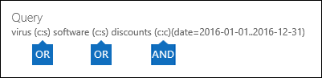

# <a name="feature-reference-for-content-search"></a>Functienaslag voor Inhoud zoeken

Dit artikel beschrijft functies en functionaliteit van Inhoud zoeken.

## <a name="content-search-limits"></a>Limieten voor Inhoud zoeken

Zie [Limieten voor Inhoud zoeken](limits-for-content-search.md) voor een beschrijving van de limieten die gelden voor Inhoud zoeken.
  
## <a name="building-a-search-query"></a>Een zoekquery maken

Zie [Trefwoordquery's en zoekvoorwaarden voor Inhoud zoeken ](keyword-queries-and-search-conditions.md) voor meer informatie over het maken van een zoekquery, het gebruik van booleaanse zoekoperatoren en zoekvoorwaarden, en het zoeken naar gevoelige informatietypen en inhoud die met gebruikers van buiten uw organisatie worden gedeeld.
  
Houd rekening met het volgende wanneer u de lijst met trefwoorden gebruikt om een zoekquery te maken.
  
- Schakel het selectievakje **Lijst met trefwoorden weergeven** in en typ elk trefwoord in een aparte rij om een zoekquery te maken waarin de trefwoorden (of trefwoordzinnen) in elke rij zijn gekoppeld aan de operator **OR**. Als u een lijst met trefwoorden in het trefwoordenvak plakt of op de toets **Enter** drukt nadat u een trefwoord hebt getypt, worden deze niet aan de operator **OR** gekoppeld. Hier ziet u een aantal onjuiste en juiste voorbeelden van de manier waarop een lijst met trefwoorden wordt toegevoegd.
    
    **Onjuist**
    
    
  
    **Juist**
    
    
  
- U kunt ook een lijst met trefwoorden of trefwoordzinnen maken in een Excel-bestand of een bestand met tekst zonder opmaak, en de lijst vervolgens in de lijst met trefwoorden kopiëren. Hiervoor moet u het selectievakje **Lijst met zoekwoorden weergeven** selecteren. Klik vervolgens op de eerste rij in de lijst met trefwoorden en plak er de lijst in. Elke regel uit het Excel- of tekstbestand wordt in een aparte rij in de lijst met trefwoorden geplaatst. 
    
- Nadat u een query hebt gemaakt met behulp van de lijst met trefwoorden, controleert u de syntaxis van de zoekquery. In de zoekquery die onder **Query** in het detailvenster wordt weergegeven, worden de trefwoorden gescheiden door de tekst **(c:s)**. Dit geeft aan dat de trefwoorden zijn gekoppeld aan een logische operator die vergelijkbaar is met de operator **OR**. Als uw zoekopdracht voorwaarden bevat, worden de trefwoorden en voorwaarden gescheiden door de tekst **(c:c)**. Dit geeft aan dat de trefwoorden aan de voorwaarden zijn gekoppeld met een logische operator die vergelijkbaar is met de operator **AND**. Hier ziet u een voorbeeld van de zoekquery (weergegeven in het deelvenster Details) die het resultaat is bij gebruik van de lijst met trefwoorden en een voorwaarde. 
    
    
  
- Wanneer u een inhoudszoekopdracht uitvoert, controleert Microsoft 365 automatisch uw zoekopdracht op niet-ondersteunde tekens en op Booleaanse operatoren die mogelijk niet in hoofdletters zijn geschreven. Niet-ondersteunde tekens zijn vaak verborgen en veroorzaken gewoonlijk een zoekfout of geven onbedoelde resultaten. Zie [De query van Inhoud zoeken op fouten controleren](check-your-content-search-query-for-errors.md) voor meer informatie over de niet-ondersteunde tekens die worden gecontroleerd.
    
- Als u een zoekquery hebt met trefwoorden voor niet-Nederlandstalige tekens (bijvoorbeeld Chinese tekens ), kunt u op **Taal-land/regio voor query** klikken en een cultuurcodewaarde voor taal/regio voor de zoekopdracht selecteren. De standaardtaal/-regio is neutraal. Hoe weet ik of ik de taalinstelling voor een inhoudzoekactie moet wijzigen? Als je er zeker van bent dat bepaalde inhoudslocaties de niet-Nederlandse tekens bevatten die je zoekt, maar de zoekopdracht geen resultaten oplevert, kan de taalinstelling de oorzaak zijn.
  
## <a name="partially-indexed-items"></a>Gedeeltelijk geïndexeerde items

- Gedeeltelijk geïndexeerde items in postvakken worden opgenomen in de geschatte zoekresultaten. Gedeeltelijk geïndexeerde items uit SharePoint en OneDrive worden niet opgenomen in de geschatte zoekresultaten. Zie [Gedeeltelijk geïndexeerde items in eDiscovery](partially-indexed-items-in-content-search.md) voor meer informatie.

## <a name="searching-onedrive-accounts"></a>Zoeken in OneDrive-accounts

- Zie [Een lijst maken van alle OneDrive-locaties in uw organisatie](/onedrive/list-onedrive-urls) voor het verzamelen van een lijst met de URL's voor de OneDrive-sites in uw organisatie. Met dit script in dit artikel maakt u een tekstbestand met een lijst met alle OneDrive-sites. Als u dit script wilt uitvoeren, moet u SharePoint Online Management Shell installeren en gebruiken. Koppel de URL voor het MySite-domein van uw organisatie aan elke OneDrive-site die u wilt doorzoeken. Dit is het domein dat de inhoud van uw OneDrive bevat; bijvoorbeeld `https://contoso-my.sharepoint.com`. Hier is een voorbeeld van een URL voor de OneDrive-site van een gebruiker: `https://contoso-my.sharepoint.com/personal/sarad_contoso_onmicrosoft.com`.
    
    In het zeldzame geval dat iemands UPN (user principal name) wordt gewijzigd, wordt de URL voor de OneDrive-locatie van deze persoon gewijzigd in de nieuwe UPN. Als dit gebeurt, moet u een inhoudzoekopdracht wijzigen door de nieuwe OneDrive-URL van de gebruiker toe te voegen en de oude te verwijderen. Zie [De invloed van wijzigingen aan de UPN op de URL van OneDrive](/onedrive/upn-changes) voor meer informatie.
  
## <a name="searching-microsoft-teams-and-microsoft-365-groups"></a>Microsoft Teams en Microsoft 365 Groepen doorzoeken

U kunt zoeken in het postvak dat is gekoppeld aan een Microsoft-team of Microsoft 365-groep. Microsoft Teams is gebaseerd op Microsoft 365 Groepen, dus is het doorzoeken van beide vergelijkbaar. In beide gevallen wordt alleen gezocht in de groep of het postvak van het team. Er wordt niet gezocht in de postvakken van de groep of teamleden. Als u deze wilt doorzoeken, moet u ze specifiek toevoegen aan de zoekopdracht.
  
Houd rekening met de volgende zaken bij het zoeken naar inhoud in Microsoft Teams en Microsoft 365 Groepen.
  
- Als u inhoud wilt zoeken in Teams en Microsoft 365 Groepen, moet u het postvak en de SharePoint-site opgeven die zijn gekoppeld aan een team of groep.

- Inhoud van privékanalen wordt opgeslagen in het postvak van de gebruiker, niet in het teampostvak. Zie [eDiscovery van privékanalen](/microsoftteams/ediscovery-investigation#ediscovery-of-private-channels) als u inhoud wilt zoeken in privékanalen.
    
- Voer de cmdlet **get-UnifiedGroup** in Exchange Online uit om eigenschappen voor een team of een Microsoft 365-groep weer te geven. Dit is een goede manier om de URL op te halen voor de site die is gekoppeld aan een team of groep. Bijvoorbeeld: met de volgende opdracht worden bepaalde eigenschappen weergegeven voor een Microsoft 365-groep met de naam Senior Leadership Team: 
    
  ```text
  Get-UnifiedGroup "Senior Leadership Team" | FL DisplayName,Alias,PrimarySmtpAddress,SharePointSiteUrl
  DisplayName            : Senior Leadership Team
  Alias                  : seniorleadershipteam
  PrimarySmtpAddress     : seniorleadershipteam@contoso.onmicrosoft.com
  SharePointSiteUrl      : https://contoso.sharepoint.com/sites/seniorleadershipteam
  ```

    > [!NOTE]
    > Als u de cmdlet **Get-UnifiedGroup** wilt uitvoeren, moet u de rol View-Only Recipients toegewezen krijgen in Exchange Online of lid zijn van een rollengroep aan wie de rol View-Only Recipients is toegewezen. 
  
- Als het postvak van een gebruiker wordt doorzocht, wordt niet gezocht naar een team of Microsoft 365-groep waar de gebruiker lid van is. Wanneer u een team of Microsoft 365-groep doorzoekt, wordt alleen gezocht in het groepspostvak en de groepssite die u opgeeft. Postvakken en OneDrive voor Bedrijven-accounts van groepsleden wordt alleen doorzocht als u ze expliciet aan de zoekopdracht toevoegt.

- Voor een lijst met de leden van een team of een Microsoft 365-groep, kunt u de eigenschappen ervan bekijken op de pagina **Start \>Groepen** in het Microsoft 365-beheercentrum. U kunt ook de volgende opdracht uitvoeren in Exchange Online PowerShell: 

  ```powershell
  Get-UnifiedGroupLinks <group or team name> -LinkType Members | FL DisplayName,PrimarySmtpAddress
  ```

    > [!NOTE]
    > Als u de cmdlet **Get-UnifiedGroupLinks** wilt uitvoeren, moet u de rol View-Only Recipients toegewezen krijgen in Exchange Online of lid zijn van een rollengroep aan wie de rol View-Only Recipients is toegewezen. 
  
- Gesprekken die deel uitmaken van een Teams-kanaal, worden opgeslagen in het postvak dat aan het team is gekoppeld. En bestanden die teamleden delen in een kanaal, worden opgeslagen op de SharePoint-site van het team. Daarom moet u het teampostvak en de SharePoint-site toevoegen als een inhoudslocatie om gesprekken en bestanden in een kanaal te doorzoeken.
    
- Gesprekken die deel uitmaken van de chatlijst in Teams, worden opgeslagen in het Exchange Online-postvak van de gebruikers die aan de chat deelnemen. En bestanden die een gebruiker in chatgesprekken deelt, worden opgeslagen in het OneDrive voor Bedrijven-account van de gebruiker die het bestand deelt. Daarom moet u de afzonderlijke gebruikerspostvakken en OneDrive voor Bedrijven-accounts toevoegen als inhoudslocaties om gesprekken en bestanden in de chatlijst te doorzoeken.
    
    > [!NOTE]
    > In een hybride Exchange-implementatie kunnen gebruikers met een on-premises postvak deelnemen aan gesprekken die deel uitmaken van de chatlijst in Microsoft Teams. In dit geval is inhoud van deze gesprekken ook doorzoekbaar omdat deze wordt opgeslagen in een opslaggebied in de cloud (een zogenaamd *cloud-postvak voor on-premises gebruikers*) voor gebruikers met een on-premises postvak. Zie [Zoeken naar chatgegevens van Teams voor on-premises gebruikers](search-cloud-based-mailboxes-for-on-premises-users.md) voor meer informatie.
  
- Elk team of teamkanaal bevat een Wiki om aantekeningen te maken en samen te werken. De Wiki-inhoud wordt automatisch opgeslagen in een bestand met de MHT-indeling. Dit bestand wordt op de SharePoint-site van het team opgeslagen in de documentbibliotheek voor Wiki-gegevens van Teams. U kunt het hulpprogramma Inhoud zoeken gebruiken om de Wiki te doorzoeken door de SharePoint-site van het team op te geven als de inhoudslocatie waarin u wilt zoeken.

    > [!NOTE]
    > De mogelijkheid om in de Wiki te zoeken naar een team of kanaal (wanneer u de SharePoint-site van het team doorzoekt) is uitgebracht op 22 juni 2017. Wikipagina's die op of na die datum zijn opgeslagen of bijgewerkt, kunnen worden doorzocht. Wikipagina's die vóór die datum het laatst zijn opgeslagen of bijgewerkt, kunnen niet worden doorzocht.

- Overzichtsinformatie voor vergaderingen en gesprekken in een Teams-kanaal wordt ook opgeslagen in de postvakken van gebruikers die bij de vergadering of het gesprek hebben ingebeld. Dit betekent dat u Inhoud zoeken kunt gebruiken om in deze overzichtsrecords te doorzoeken. Overzichtsinformatie omvat:
  
  - Datum, begintijd, eindtijd en duur van een vergadering of gesprek

  - De datum en het tijdstip waarop elke deelnemer aan de vergadering (of het gesprek) heeft deelgenomen of deze (dit) heeft verlaten

  - Naar voicemail verzonden oproepen

  - Gemiste of niet-beantwoorde oproepen

  - Doorverbonden oproepen, weergegeven als twee afzonderlijke oproepen

  Het kan acht uur duren voordat er samenvattingsrecords voor vergaderingen en gesprekken kunnen worden doorzocht.

  In de zoekresultaten worden samenvattingen van vergaderingen aangegeven als **Vergadering** in het veld **Type**, en worden samenvattingen van gesprekken aangegeven als **Gesprek**. Daarnaast worden gesprekken die deel uitmaken van een Teams-kanaal en 1xN-chats aangegeven als **Chatbericht** in het veld **Type**.
  
  

   Zie [Microsoft Teams launches eDiscovery for calls and meetings](https://techcommunity.microsoft.com/t5/microsoft-teams-blog/microsoft-teams-launches-ediscovery-for-calling-and-meetings/ba-p/210947) (Microsoft Teams brengt eDiscovery uit voor gesprekken en vergaderingen) voor meer informatie.

- Kaartinhoud die door apps in Teams-kanalen, 1:1-chats en 1xN-chats wordt gegenereerd, wordt opgeslagen in postvakken en kan worden doorzocht. Een *kaart* is een UI-container voor korte stukken inhoud. Kaarten kunnen meerdere eigenschappen en bijlagen hebben en kunnen knoppen bevatten waarmee kaartacties kunnen worden geactiveerd. Zie [Kaarten](/microsoftteams/platform/task-modules-and-cards/what-are-cards) voor meer informatie.

  Waar kaartinhoud wordt opgeslagen, hangt net als bij andere inhoud van Teams, af van de plaats waar de kaart is gebruikt. Inhoud voor kaarten die wordt gebruikt in een Teams-kanaal, wordt opgeslagen in het postvak van de Teams-groep. Kaartinhoud voor 1:1- en 1xN-chats wordt opgeslagen in de postvakken van de deelnemers aan de chat.

  Als u naar kaartinhoud wilt zoeken, kunt u gebruikmaken van de zoekvoorwaarden `kind:microsoftteams` of `itemclass:IPM.SkypeTeams.Message`. Bij het doornemen van zoekresultaten heeft kaartinhoud die is gegenereerd door bots in een Teams-kanaal de e-maileigenschap **Afzender/auteur** als `<appname>@teams.microsoft.com`, waarbij `appname` de naam is van de app die de kaartinhoud heeft gegenereerd. Als kaartinhoud door een gebruiker is gegenereerd, wordt de gebruiker geïdentificeerd door de waarde **Afzender/auteur**.

  Wanneer u kaartinhoud bekijkt in resultaten van Inhoud zoeken, verschijnt de inhoud als bijlage bij het bericht. De bijlage heeft de naam `appname.html`, waarin `appname` de naam is van de app waarmee de kaartinhoud is gegenereerd. In de volgende schermafbeeldingen ziet u hoe kaartinhoud (voor een app met de naam Asana) in Teams en in de resultaten van een zoekopdracht wordt weergegeven.

  **Kaartinhoud in Teams**

  

  **Kaartinhoud in zoekresultaten**
  
  

  > [!NOTE]
  > Als u op dit moment afbeeldingen van kaartinhoud in zoekresultaten wilt weergeven (zoals de vinkjes in de vorige schermafbeelding), moet u op een ander tabblad zijn aangemeld bij Teams (op https://teams.microsoft.com)) in dezelfde browsersessie die u gebruikt om de zoekresultaten te bekijken. Anders worden tijdelijke aanduidingen voor afbeeldingen weergegeven.

- U kunt de e-maileigenschap **Soort** of de zoekvoorwaarde **Type bericht** gebruiken om specifiek naar inhoud in Teams te zoeken.
  
  - Als u de eigenschap **Soort** wilt gebruiken als onderdeel van de zoekquery op trefwoord, typt u `kind:microsoftteams` in het vak **Trefwoorden** van een zoekquery.

    
  
  - Als u een zoekvoorwaarde wilt gebruiken, voegt u de voorwaarde **Type bericht** toe en gebruikt u de waarde `microsoftteams`.

    

   Voorwaarden zijn logisch gekoppeld aan de trefwoordquery door de operator **AND**. Dat betekent dat een item overeen moet komen met zowel de trefwoordquery als de zoekvoorwaarde om in de zoekresultaten te worden geretourneerd. Zie de sectie Richtlijnen voor het gebruik van voorwaarden in [Trefwoordquery's en zoekvoorwaarden voor Inhoud zoeken](keyword-queries-and-search-conditions.md#guidelines-for-using-conditions) voor meer informatie.
  
## <a name="searching-yammer-groups"></a>Zoeken in Yammer-groepen

U kunt de e-maileigenschap **Itemclass** of de zoekvoorwaarde **Type** gebruiken om specifiek te zoeken naar gespreksitems in Yammer-groepen.

  - Als u de eigenschap **ItemClass** wilt gebruiken als onderdeel van de zoekquery op trefwoord, kunt u in het vak **Trefwoorden** van een zoekquery één (of alle) van de volgende eigenschap:waardeparen typen:

     - ItemClass:IPM.Yammer.message
     - ItemClass:IPM.Yammer.poll
     - ItemClass:IPM.Yammer.praise
     - ItemClass:IPM.Yammer.question
  
    U kunt bijvoorbeeld de volgende zoekquery gebruiken om Yammer-berichten en Yammer-complimentitems te retourneren:

    
  
  - U kunt ook de e-mailvoorwaarde **Type** gebruiken en **Yammer-berichten** selecteren om Yammer-items te retourneren. Bijvoorbeeld: met de volgende zoekquery worden alle Yammer-gespreksitems met het trefwoord 'vertrouwelijk' geretourneerd. 

    

## <a name="searching-inactive-mailboxes"></a>Zoeken in inactieve postvakken

U kunt inactieve postvakken doorzoeken in een inhoudzoekactie. Voor een lijst met inactieve postvakken in uw organisatie, kunt u de opdracht  `Get-Mailbox -InactiveMailboxOnly` uitvoeren in Exchange Online PowerShell. U kunt ook naar **Informatiebeheer** \> **Retentie** gaan in het beveiligings- en compliancecentrum en vervolgens op **Meer** \> **Inactieve postvakken** klikken.
  
Houd u rekening met de volgende zaken bij het zoeken in inactieve postvakken.

- Als een bestaande inhoudzoekopdracht een gebruikerspostvak omvat en dat postvak is inactief gemaakt, wordt doorgegaan met zoeken in het inactieve postvak wanneer u de zoekopdracht opnieuw runt nadat deze inactief is geworden.

- Soms heeft een gebruiker een actief postvak en een inactief postvak met hetzelfde SMTP-adres. In dit geval wordt alleen gezocht in het specifieke postvak dat u als locatie voor een inhoudzoekopdracht selecteert. Met andere woorden, als u het postvak van een gebruiker toevoegt aan een zoekopdracht, kunt u er niet vanuit gaan dat zowel de actieve als de inactieve postvakken worden doorzocht. Alleen het postvak dat u expliciet aan de zoekopdracht toevoegt, wordt doorzocht.

- U kunt Beveiligings- en compliancecentrum PowerShell gebruiken om een inhoudzoekopdracht te maken om een inactief postvak te doorzoeken. Hiervoor moet u vooraf een punt (. ) aan het e-mailadres van het inactieve postvak toevoegen. Bijvoorbeeld: met de volgende opdracht wordt een inhoudzoekopdracht gemaakt waarmee wordt gezocht in een inactief postvak met het e-mailadres pavelb@contoso.onmicrosoft.com:

   ```powershell
   New-ComplianceSearch -Name InactiveMailboxSearch -ExchangeLocation .pavelb@contoso.onmicrosoft.com -AllowNotFoundExchangeLocationsEnabled $true
   ```

- Het wordt ten zeerste aangeraden dat u geen actief postvak en inactief postvak met hetzelfde SMTP-adres gebruikt. Als u het SMTP-adres dat is toegewezen aan een inactief postvak, opnieuw wilt gebruiken, wordt u aangeraden het inactieve postvak te herstellen of de inhoud van een inactief postvak terug te zetten naar een actief postvak (of naar het archief van een actief postvak) en vervolgens het inactieve postvak te verwijderen. Zie een van de volgende onderwerpen voor meer informatie:

  - [Een inactief postvak in Office 365 herstellen](recover-an-inactive-mailbox.md)

  - [Een inactief postvak in Office 365 terugzetten](restore-an-inactive-mailbox.md)

  - [Een inactief postvak in Office 365 verwijderen](delete-an-inactive-mailbox.md)

## <a name="searching-disconnected-or-de-licensed-mailboxes"></a>Zoeken in losgekoppelde of niet meer gelicentieerde postvakken

Als de Exchange Online-licentie (of de volledige Microsoft 365-licentie) wordt verwijderd uit een gebruikersaccount of uit Azure Active Directory, wordt het postvak van de gebruiker een *losgekoppeld* postvak. Dit betekent dat het postvak niet meer is gekoppeld aan het gebruikersaccount. Dit is wat er gebeurt bij het doorzoeken van losgekoppelde postvakken:

- Als de licentie uit een postvak wordt verwijderd, kan het postvak niet meer worden doorzocht. 

- Als een bestaande inhoudzoekopdracht een postvak omvat waarvoor de licentie is verwijderd, worden er geen zoekresultaten van het losgekoppelde postvak geretourneerd als u de inhoudzoekactie opnieuw uitvoert.

- Als u de cmdlet **New-ComplianceSearch** gebruikt om een inhoudzoekactie te maken en een losgekoppeld postvak op te geven als de te doorzoeken Exchange-inhoudslocatie, retourneert de inhoudzoekopdracht geen zoekresultaten voor het losgekoppelde postvak.

Als u de gegevens in een losgekoppeld postvak wilt bewaren zodat deze doorzoekbaar is, moet u een bewaring voor het postvak instellen voordat u de licentie verwijdert. Hierdoor blijven de gegevens behouden en blijft het losgekoppelde postvak doorzoekbaar totdat de bewaring wordt verwijderd. Zie [Bepalen welk type bewaring geldt voor een Exchange Online-postvak](identify-a-hold-on-an-exchange-online-mailbox.md) voor meer informatie over bewaringen.

## <a name="searching-for-content-in-a-sharepoint-multi-geo-environment"></a>Inhoud zoeken in een SharePoint Multi-Geo-omgeving

Als een eDiscovery-beheerder in een [SharePoint Multi-Geo-omgeving](../enterprise/multi-geo-capabilities-in-onedrive-and-sharepoint-online-in-microsoft-365.md) moet zoeken naar inhoud in SharePoint en OneDrive in verschillende regio's, moet u het volgende doen om dit mogelijk te maken:

1. Maak een afzonderlijk gebruikersaccount voor elke geografische satellietlocatie die de eDiscovery-beheerder wil doorzoeken. Voor het zoeken naar inhoud in die geografische locatie, moet de eDiscovery-beheerder zich aanmelden bij het account dat u voor die locatie hebt gemaakt en vervolgens een inhoudzoekactie uitvoeren.

2. Maak een zoekmachtigingsfilter voor elke geografische satellietlocatie (en het bijbehorende gebruikersaccount) dat de eDiscovery-beheerder wil doorzoeken. Elk van deze zoekmachtigingsfilters beperkt het bereik van de inhoudzoekactie tot een specifieke geografische locatie wanneer de eDiscovery-beheerder is aangemeld bij het gebruikersaccount dat aan die locatie is gekoppeld.

> [!TIP]
> U hoeft deze strategie niet te gebruiken wanneer u het zoekhulpmiddel gebruikt in [Geavanceerde eDiscovery](overview-ediscovery-20.md). Dat komt omdat alle datacenters wordt doorzocht wanneer u SharePoint-sites en OneDrive-accounts in Geavanceerde eDiscovery doorzoekt. U hoeft deze strategie van regiospecifieke gebruikersaccounts en zoekmachtigingsfilters alleen te gebruiken wanneer u het hulpprogramma Inhoud zoeken gebruikt en zoekopdrachten uitvoert die zijn gekoppeld aan [eDiscovery-gevallen](./get-started-core-ediscovery.md).

Stel dat een eDiscovery-beheerder inhoud van SharePoint en OneDrive moet zoeken op satellietlocaties in Noord-Amerika, Europa en Azië en Stille Oceaan. De eerste stap bestaat uit het maken van drie gebruikersaccounts, een voor elke locatie. De volgende stap bestaat uit het maken van drie zoekmachtigingsfilters: een voor elke locatie *en* bijbehorend gebruikersaccount. Hier ziet u voorbeelden van de drie zoekmachtigingsfilters voor dit scenario. In elk van deze voorbeelden geeft **Region** de locatie van het SharePoint-datacenter voor die geografische locatie aan en met de parameter **Users** wordt het bijbehorende gebruikersaccount opgegeven.

**Noord-Amerika**

```powershell
New-ComplianceSecurityFilter -FilterName "SPMultiGeo-NAM" -Users ediscovery-nam@contoso.com -Region NAM -Action ALL
```

**Europa**

```powershell
New-ComplianceSecurityFilter -FilterName "SPMultiGeo-EUR" -Users ediscovery-eur@contoso.com -Region EUR -Action ALL
```

**Azië en Stille Oceaan**

```powershell
New-ComplianceSecurityFilter -FilterName "SPMultiGeo-APC" -Users ediscovery-apc@contoso.com -Region APC -Action ALL
```

Houd rekening met het volgende bij het gebruik van zoekmachtigingsfilters om te zoeken naar inhoud in omgevingen met meerdere geografische gebieden:

- Met de parameter **Region** worden zoekopdrachten naar de opgegeven satellietlocatie geleid. Als een eDiscovery-beheerder alleen SharePoint- en OneDrive-sites doorzoekt buiten de regio die is opgegeven in het zoekmachtigingsfilter, worden er geen zoekresultaten geretourneerd. 

- Met de parameter **Region** kunt u geen zoekopdrachten in Exchange-postvakken beheren. Alle datacenters worden doorzocht wanneer u in postvakken zoekt.

Zie de sectie Inhoud zoeken en exporteren in omgevingen met meerdere geografische gebieden in [Nalevingsgrenzen instellen voor eDiscovery-onderzoeken](set-up-compliance-boundaries.md#searching-and-exporting-content-in-multi-geo-environments) voor meer informatie over het gebruik van zoekmachtigingsfilters in een omgeving met meerdere geografische gebieden.
