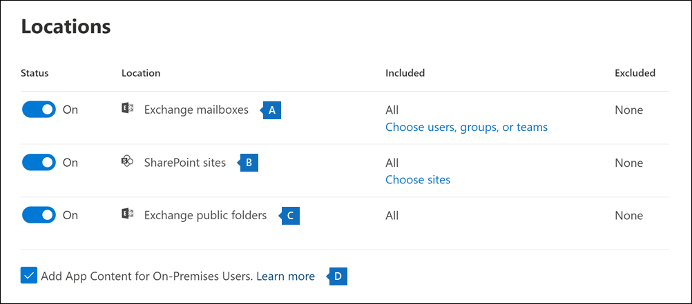

# Een zoekactie maken

U kunt het eDiscovery-hulpprogramma Inhoud zoeken in het Microsoft 365-compliancecentrum gebruiken om naar in-place inhoud te zoeken, zoals e-mail, documenten en chatgesprekken in uw organisatie. Gebruik deze functie om te zoeken naar inhoud in deze Microsoft 365-gegevensbronnen:
  
- Exchange Online-postvakken

- SharePoint Online-sites en OneDrive voor Bedrijven-accounts

- Microsoft Teams

- Microsoft 365 Groepen

- Yammer-groepen

Nadat u een zoekactie hebt uitgevoerd, wordt het aantal inhoudslocaties en een geschat aantal zoekresultaten in de flyoutpagina voor zoeken weergegeven. U kunt snel statistieken bekijken, zoals de inhoudslocaties met de meeste items die overeenkomen met de zoekquery. Nadat u een zoekopdracht hebt uitgevoerd, kunt u de resultaten vooraf bekijken of deze naar een lokale computer exporteren.

## Een zoekactie maken en uitvoeren

Voor toegang tot de pagina **Inhoud zoeken** in het Microsoft 365-compliancecentrum (om zoekopdrachten uit te voeren en zoekresultaten vooraf te bekijken en te exporteren), moet een beheerder, compliance officer of eDiscovery-beheerder lid zijn van de rollengroep eDiscovery-manager in het Beveiligings- en compliancecentrum. Zie [eDiscovery-machtigingen toewijzen](assign-ediscovery-permissions.md) voor meer informatie.
  
1. Ga naar <https://compliance.microsoft.com> en meld u aan met de referenties van een account waaraan de juiste machtigingen zijn toegewezen.

2. Klik in het linker navigatiedeelvenster van het Microsoft 365-compliancecentrum op **Alles weergeven** en klik vervolgens op **Inhoud zoeken**.

3. Klik op de pagina **Inhoud zoeken** op **Nieuwe zoekopdracht**.

   > [!NOTE]
   > Met de optie **Zoeken op lijst-id** kunt u zoeken naar specifieke e-mailberichten en andere postvakitems met behulp van een lijst met Exchange-id's. Als u een zoekopdracht voor een lijst met id's wilt maken, dient u een bestand met door komma's gescheiden waarden (CSV) in dat de specifieke postvakitems identificeert waar u naar wilt zoeken. Zie [Een CSV-bestand voorbereiden voor het zoeken naar een lijst met id's](csv-file-for-an-id-list-content-search.md) voor instructies.

4. Typ een naam voor de zoekopdracht en een optionele beschrijving waarmee de zoekopdracht wordt geïdentificeerd. De naam van de zoekopdracht moet uniek zijn in uw organisatie.

5. Kies op de pagina **Locaties** de inhoud die u wilt doorzoeken. U kunt zoeken in postvakken, sites en openbare mappen.

    
  
   1. **Exchange-postvakken**: Stel de wisselknop in op **Aan** en klik vervolgens op **Kies gebruikers, groepen of teams** om de postvakken op te geven die u vast wilt zetten. Gebruik het zoekvak om gebruikerspostvakken en distributiegroepen te zoeken (om de postvakken van groepsleden vast te zetten) die u vast wilt zetten. U kunt ook zoeken in het postvak dat is gekoppeld aan een Microsoft Team (voor kanaalberichten), Office 365-groep en Yammer-groep. Zie voor meer informatie over de toepassingsgegevens die zijn opgeslagen in postvakken [Inhoud die is opgeslagen in postvakken voor eDiscovery](what-is-stored-in-exo-mailbox.md).

   2. **SharePoint-sites**: Stel de wisselknop in op **Aan** en klik vervolgens op **Sites kiezen** om SharePoint-sites en OneDrive-accounts op te geven die u vast wilt zetten. Typ de URL voor elke site die u vast wilt zetten. U kunt ook de URL toevoegen voor de SharePoint-site voor een Microsoft Team, Office 365-groep of Yammer-groep.
  
   3. **Openbare Mappen in Exchange**: Stel de wisselknop in op **Aan** om alle openbare mappen in uw Exchange Online-organisatie vast te zetten. U kunt geen specifieke openbare mappen kiezen die u vast wilt zetten. Zet de wisselknop uit als u geen openbare mappen vast wilt zetten.
  
   4. Laat dit selectievakje ingeschakeld als u wilt zoeken naar inhoud van Teams voor on-premises gebruikers. Als u bijvoorbeeld alle Exchange-postvakken in de organisatie doorzoekt en ook dit selectievakje inschakelt, wordt cloud-opslag voor het opslaan van chatgegevens van Teams voor on-premises gebruikers opgenomen in het bereik van de zoekopdracht. Zie [Zoeken naar chatgegevens van Teams voor on-premises gebruikers](search-cloud-based-mailboxes-for-on-premises-users.md) voor meer informatie.

6. Typ op de pagina **Uw zoekvoorwaarden definiëren** een trefwoordquery en voeg zo nodig voorwaarden aan de zoekquery toe.

   

   1. Specificeer trefwoorden, berichteigenschappen (zoals verzend- en ontvangstdatums) of documenteigenschappen (zoals bestandsnamen of de datum waarop een document voor het laatst is gewijzigd). U kunt complexere query's gebruiken die gebruikmaken van een booleaanse operator, zoals **AND**, **OR**, **NOT** en **NEAR**. Als u het vak met trefwoorden leeg laat, wordt alle inhoud op de opgegeven inhoudslocaties opgenomen in de zoekresultaten. Zie [Trefwoordquery's en zoekvoorwaarden voor eDiscovery](keyword-queries-and-search-conditions.md) voor meer informatie.

   2. U kunt ook het selectievakje **Lijst met zoekwoorden weergeven** selecteren en in elke rij een trefwoord typen. Als u dit doet, worden de trefwoorden in elke rij gekoppeld aan een logische operator (**c:s**) die qua functie vergelijkbaar is met de operator **OR** in de zoekquery die wordt gemaakt.

      Waarom wordt de lijst met trefwoorden gebruikt? U kunt statistieken krijgen die laten zien hoeveel items overeenkomen met elk trefwoord. Zo kunt u snel bepalen welke trefwoorden het meest (en minst) effectief zijn. U kunt ook een trefwoordzin (tussen haakjes) gebruiken in een rij. Zie [Trefwoordstatistieken weergeven voor zoekopdrachten](view-keyword-statistics-for-content-search.md#get-keyword-statistics-for-searches) voor meer informatie over de trefwoordlijst en zoekstatistieken.

      > [!NOTE]
      > Eventuele problemen die worden veroorzaakt door grote trefwoordlijsten, worden verminderd door het aantal rijen in de lijst met trefwoorden tot twintig te beperken.

   3. U kunt zoekvoorwaarden toevoegen om een zoekopdracht te verfijnen en een kleiner aantal resultaten te retourneren. Elke voorwaarde verbindt een clausule aan de zoekquery die wordt gemaakt. Deze wordt uitgevoerd wanneer u de zoekopdracht start. Een voorwaarde is logisch gekoppeld aan de trefwoordquery (aangegeven in het trefwoordvak) door middel van een logische operator (**c:c**). Deze is vergelijkbaar met de operator **AND**. Dit betekent dat items moeten voldoen aan zowel de trefwoordquery als een of meer voorwaarden die in de resultaten moeten worden opgenomen. Op die manier kunt u door middel van voorwaarden de resultaten beperken. Zie voor een lijst en beschrijving van voorwaarden die u in een zoekquery kunt gebruiken [Zoekvoorwaarden](keyword-queries-and-search-conditions.md#search-conditions).

7. Controleer de zoekinstellingen (en bewerk deze indien nodig) en verzend de zoekopdracht vervolgens om deze te starten.
  
Als u deze inhoudzoekactie opnieuw wilt openen of toegang wilt hebben tot andere inhoudzoekacties die op de pagina **Inhoud zoeken** worden weergegeven, selecteert u de zoekopdracht en klikt u op **Openen**.

## Volgende stappen

Hier ziet u een lijst met de volgende stappen die u moet uitvoeren nadat u een inhoudszoekactie hebt gemaakt en uitgevoerd.

- [Zoekresultaten vooraf bekijken](preview-ediscovery-search-results.md)

- [Statistieken voor zoekresultaten weergeven](view-keyword-statistics-for-content-search.md)

- [Zoekresultaten exporteren](export-search-results.md)

- [Een zoekrapport exporteren](export-a-content-search-report.md)

## Meer informatie

Zie [Naslaginformatie over het zoeken van inhoud](content-search-reference.md) voor meer informatie over het zoeken van inhoud, zoals het zoeken naar inhoud in verschillende Microsoft 365-services.
