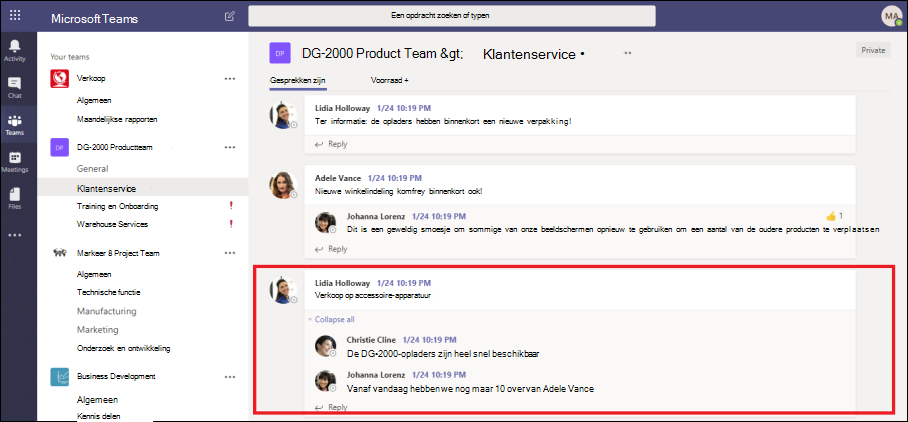
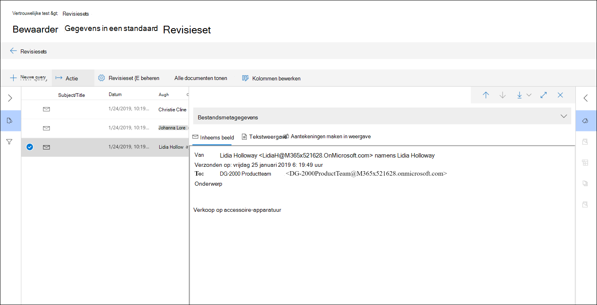
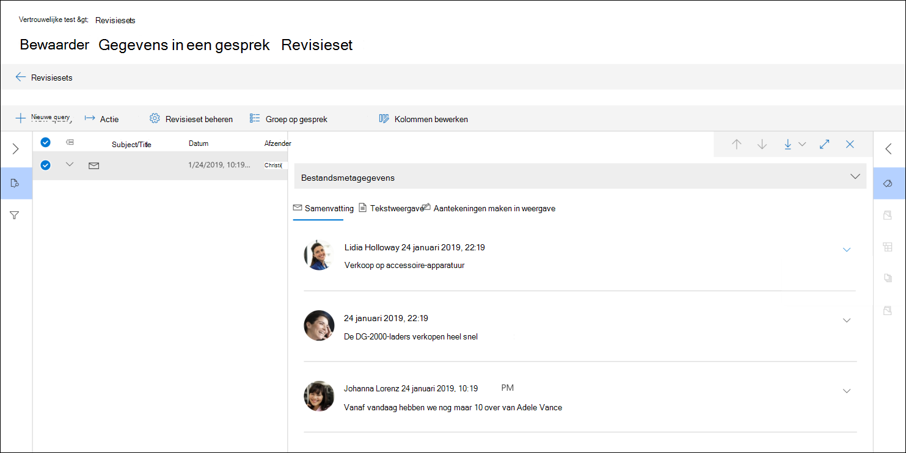
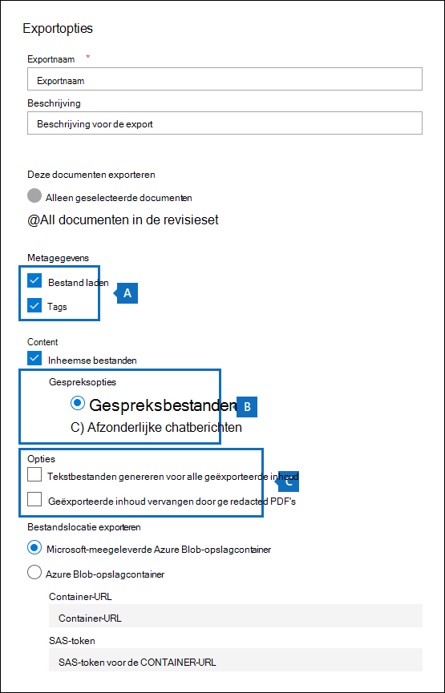

# Gespreksthreading in Advanced eDiscovery

Chatten is een handige manier om vragen te stellen, ideeën te delen of snel te communiceren tussen grote doelgroepen. Aangezien chatplatforms, zoals Microsoft Teams en Yammer-groepen, de basis vormen voor samenwerking tussen ondernemingen, moeten organisaties evalueren hoe hun eDiscovery-werkstroom deze nieuwe vormen van communicatie en samenwerking adresseert.

De functie Gespreksreconstructie in Advanced eDiscovery is ontworpen om contextuele inhoud te identificeren en verschillende gespreksweergaven te produceren. Met deze mogelijkheid kunt u snel en efficiënt volledige chatgesprekken (ook wel discussielijngesprekken *genoemd)* bekijken die worden gegenereerd op platforms zoals Microsoft Teams.

Met Gespreksreconstructie kunt u ingebouwde mogelijkheden gebruiken om gesprekken met discussielijn te reconstrueren, te bekijken en te exporteren. Gebruik Advanced eDiscovery Gespreksreconstructie om:

- Behoud unieke metagegevens op berichtniveau voor alle berichten in een gesprek.

- Verzamel contextuele berichten rond uw zoekresultaten.

- Discussielijngesprekken controleren, aantekeningen maken en redacteren.

- Afzonderlijke berichten of discussielijngesprekken exporteren

## Terminologie

Hier volgen enkele definities om u te helpen aan de slag te gaan met Gespreksreconstructie.

- **Berichten:** Vertegenwoordig de kleinste eenheid van een gesprek. Berichten kunnen variëren in grootte, structuur en metagegevens.

- **Gesprek:** Vertegenwoordigt een groepering van een of meer berichten. In verschillende toepassingen kunnen gesprekken op verschillende manieren worden weergegeven. In sommige toepassingen is er een expliciete actie die het resultaat is van het beantwoorden van een bestaand bericht. Gesprekken worden expliciet gevormd als gevolg van deze gebruikersactie. Hier is bijvoorbeeld een schermafbeelding van een kanaalgesprek in Microsoft Teams.

   

   In andere apps (zoals 1xN-chatberichten in Teams) is er geen formele antwoordketen en worden berichten in plaats daarvan weergegeven als een 'platte rivier met berichten' in één thread. In deze typen apps worden gesprekken afgeleid van een groep berichten die binnen een bepaalde tijd plaatsvinden. Deze 'soft-grouping' van berichten (in tegenstelling tot een antwoordketen) vertegenwoordigt het 'heen en weer' gesprek over een specifiek onderwerp dat interessant is.

## Stap 1: Een conceptverzameling maken

Nadat u relevante beheerders en inhoudslocaties hebt geïdentificeerd, kunt u een zoekopdracht maken om mogelijk relevante inhoud te vinden. Op het **tabblad Verzamelingen** in het Advanced eDiscovery kunt u een verzameling maken door op **Nieuwe verzameling** te klikken en de wizard te volgen. Zie Een conceptverzameling maken voor informatie over hoe u een verzameling kunt maken, een zoekquery kunt maken en een voorbeeld van de zoekresultaten [kunt bekijken.](create-draft-collection.md)

## Stap 2: Een conceptverzameling verbinden met een revisieset

Nadat u de zoekquery in een verzameling hebt bekeken en afgerond, kunt u de zoekresultaten toevoegen aan een revisieset. Wanneer u de zoekresultaten toevoegt aan een revisieset, worden de oorspronkelijke gegevens gekopieerd naar een Azure Storage gebied om het controle- en analyseproces te vergemakkelijken. Zie Een conceptverzameling aan een revisieset toevoegen voor meer informatie over het toevoegen van zoekresultaten aan [een revisieset.](commit-draft-collection.md)

Wanneer u items uit gesprekken toevoegt aan een revisieset, kunt u de optie Gesprekken met discussielijn gebruiken om contextuele berichten te verzamelen uit gesprekken die items bevatten die voldoen aan de zoekcriteria van de verzameling. Nadat u de optie discussielijngesprekken hebt geselecteerd, kunnen de volgende dingen gebeuren:

  

1. Met behulp van een trefwoord- en datumbereikquery heeft de zoekopdracht een treffer geretourneerd in *Bericht 3.* Dit bericht maakte deel uit van een groter gesprek, geïllustreerd door *CRC1.*

2. Wanneer u de gegevens toevoegt aan een revisieset en de opties voor het ophalen van gesprekken inschakelen, Advanced eDiscovery u terug en verzamelt u andere items in *CRC1.*

3. Nadat de items zijn toegevoegd aan de revisieset, kunt u alle afzonderlijke berichten van *CRC1 bekijken.*

Zie Een conceptverzameling aan een revisieset verbinden als u de optie gesprekken met discussielijn [wilt inschakelen.](commit-draft-collection.md#commit-a-draft-collection-to-a-review-set)

## Stap 3: Discussielijngesprekken bekijken en exporteren

Nadat de inhoud is verwerkt en toegevoegd aan de revisieset, kunt u beginnen met het controleren van de gegevens in de revisieset. De controlemogelijkheden zijn verschillend, afhankelijk van of de inhoud is toegevoegd aan een standaardbeoordelingsset of een gespreksbeoordelingsset.

### Gesprekken bekijken in een standaardbeoordelingsset

In een standaardbeoordelingsset worden berichten verwerkt en weergegeven als afzonderlijke items, vergelijkbaar met hoe ze worden opgeslagen in een postvakmap. In deze werkstroom wordt elk bericht verwerkt als een afzonderlijk item. Hierdoor zijn de overzichts- en exportopties met discussielijn niet beschikbaar in een standaardbeoordelingsset.

  

### Gesprekken bekijken in een gespreksbeoordelingsset

In een gespreksoverzichtsset worden afzonderlijke berichten met elkaar verbonden en gepresenteerd als gesprekken. Op deze manier kunt u contextuele gesprekken bekijken en exporteren.

  

In de volgende secties wordt beschreven hoe u gesprekken kunt bekijken en exporteren in een gespreksbeoordelingsset.

#### Gesprekken bekijken

In een gespreksbeoordelingsset kunt u de volgende opties gebruiken om het revisieproces te vergemakkelijken.

- **Groep op gesprek:** Groepen berichten in hetzelfde gesprek samen om gebruikers te helpen hun controleproces te vereenvoudigen en te versnellen.

- **Overzichtsweergave:** Hiermee wordt het gesprek met discussielijn weergegeven. In deze weergave ziet u het hele gesprek en hebt u ook toegang tot de metagegevens voor elk afzonderlijk bericht.

   - Metagegevens voor afzonderlijke berichten weergeven

   - Afzonderlijke berichten downloaden

- **Tekstweergave:** Geeft de uitgepakte tekst voor het hele gesprek weer.

- **Aantekeningen maken:** Hiermee kunt u een discussielijnweergave van het gesprek markeren. Alle berichten in het gesprek delen hetzelfde document met aantekeningen.

- **Labelen:** Wanneer u gesprekken in een revisieset bekijkt, kunt u tags weergeven en toepassen door te klikken op **Het deelvenster Labelen** in het deelvenster Codering.

- **Gespreksconversie opnieuw starten:** Wanneer berichten worden toegevoegd aan een gespreksbeoordelingsset, wordt automatisch een conversieklus uitgevoerd om de samenvatting met discussielijn te maken en aantekeningen te maken. Als de taak Gespreksreconstructie mislukt, kunt u deze taak opnieuw doen door te klikken op **Actie > Gespreks-PDF's** maken in de revisieset.

#### Gesprekken exporteren

In een gespreksbeoordelingsset kunt u de volgende opties instellen voor het exporteren van gesprekken:

1. Opties voor metagegevens:
   - **Bestand laden:** Metagegevens zijn opgenomen voor elk afzonderlijk bericht, e-mailbericht en document. Er is één rij voor elk bericht in een gesprek.
   - **Tags:** Tags uit uw revisieproces worden opgenomen in het metagegevensbestand. Berichten in een gesprek delen dezelfde tags.

2. Gespreksopties:
   - **Gespreksbestanden:** Wanneer u gespreksbestanden exporteert, wordt de weergave met aantekeningen geconverteerd naar een PDF-bestand en gedownload naar de exportmap. Berichten in één gespreksbestand wijzen naar de PDF-versie van hetzelfde gespreksbestand.
   - **Afzonderlijke chatberichten:** Wanneer u afzonderlijke berichten exporteert, wordt elk uniek bericht in het gesprek geëxporteerd als een zelfstandig item. Het bestand wordt geëxporteerd in dezelfde indeling als in het postvak. Voor een specifiek gesprek ontvangt u meerdere MSG-bestanden.

     > [!NOTE]
     > Als u aantekeningen hebt toegepast op het gespreksbestand, worden deze aantekeningen niet overgebracht naar de afzonderlijke berichten.

3. Andere opties:
   - **Tekstbestanden genereren voor alle geëxporteerde inhoud:** Genereert een tekstbestand voor elk gesprek dat wordt geëxporteerd uit de revisieset.
   - **Geëxporteerde inhoud vervangen door opnieuw uitgevoerde PDF-bestanden:** Als tijdens het revisieproces redacted conversation files worden gegenereerd, zijn deze bestanden beschikbaar tijdens het exporteren. U kunt bepalen of u alleen de oorspronkelijke bestanden wilt exporteren (door deze optie niet te selecteren) of om de oorspronkelijke bestanden te vervangen door de heruitvoerde versies van de oorspronkelijke bestanden (door deze optie te selecteren), die als PDF-bestanden worden geëxporteerd.

## Meer informatie

Zie de volgende artikelen voor meer informatie over hoe u casegegevens in Advanced eDiscovery bekijkt:

- [Casegegevens weergeven](view-documents-in-review-set.md)
- [Casegegevens analyseren](analyzing-data-in-review-set.md)
- [Casegegevens exporteren](exporting-data-ediscover20.md)
