# <a name="create-a-custom-sensitive-information-type-using-powershell"></a>Een aangepast type voor vertrouwelijke gegevens maken met PowerShell

In dit onderwerp leert u hoe u PowerShell kunt gebruiken om een XML-*regelpakket* bestand te maken waarin uw eigen aangepaste [typen voor vertrouwelijke gegevens](sensitive-information-type-entity-definitions.md) worden omschreven. U moet weten hoe u een normale expressie maakt. Dit onderwerp maakt als voorbeeld een aangepast type voor vertrouwelijke gegevens dat een medewerkers-ID identificeert. U kunt dit voorbeeld-XML-bestand gebruiken als beginpunt voor uw eigen XML-bestand. Zie [Meer informatie over typen voor vertrouwelijke gegevens](sensitive-information-type-learn-about.md) als typen voor vertrouwelijke gegevens nieuw voor u zijn.

Nadat u een goed opgebouwd XML-bestand hebt gemaakt, kunt u het uploaden naar Microsoft 365 via Microsoft 365 PowerShell. Vervolgens bent u er klaar voor om uw aangepaste type voor vertrouwelijke gegevens in uw beleid te gebruiken en te testen of de vertrouwelijke gegevens worden gedetecteerd zoal u wilt.

> [!NOTE]
> Als u geen behoefte hebt aan de fijngevoelige controle die PowerShell biedt, kunt u aangepaste typen voor vertrouwelijke gegevens maken in het compliancecentrum. Zie [Een aangepast type voor vertrouwelijke gegevens maken](create-a-custom-sensitive-information-type.md) voor meer informatie.

## <a name="important-disclaimer"></a>Belangrijke vrijwaring

Vanwege de verschillende klantomgevingen en vereisten voor inhoud kan Microsoft-ondersteuning niet helpen door definities te bieden voor aangepaste inhoudsovereenkomsten, zoals bijvoorbeeld aangepaste classificaties of normale expressiepatronen (ook wel RegEx genoemd) definiëren. Voor de ontwikkeling, het testen en de foutopsporing van inhoudsovereenkomsten moeten Microsoft 365-klanten vertrouwen op interne IT-bronnen of een externe bron gebruiken, zoals MCS (Microsoft Consulting Services). Ondersteuningstechnici kunnen beperkte ondersteuning bieden voor de functie, maar niet garanderen dat de ontwikkeling van aangepaste inhoudsovereenkomsten voldoet aan de vereisten of verplichtingen van de klant.  Als voorbeeld van het soort ondersteuning dat kan worden geboden, kunnen voor testdoeleinden voorbeelden van normale expressiepatronen worden aangeboden. Of de ondersteuning kan helpen bij het oplossen van problemen met een bestaand RegEx-patroon dat niet zoals verwacht wordt geactiveerd met een enkel voorbeeld met specifieke inhoud.

Zie [Mogelijke validatieproblemen om rekening mee te houden](#potential-validation-issues-to-be-aware-of) in dit onderwerp.

Zie [Boost.Regex 5.1.3](https://www.boost.org/doc/libs/1_68_0/libs/regex/doc/html/) voor meer informatie over de engine Boost.RegEx (voorheen bekend als RegEx++) die wordt gebruikt voor het verwerken van tekst.

> [!NOTE]
> Als u een ampersandteken (&) gebruikt als onderdeel van een trefwoord in uw aangepaste gevoelige informatietype, is er een bekend probleem. U moet een extra term toevoegen met spaties rond het teken om ervoor te zorgen dat het teken correct is geïdentificeerd, bijvoorbeeld L & P _niet_ L&P.

## <a name="sample-xml-of-a-rule-package"></a>Voorbeeld-XML van een regelpakket

Dit is de voorbeeld-XML van het regelpakket dat we in dit onderwerp gaan maken. In onderstaande gedeelten worden elementen en kenmerken uitgelegd.
  
```xml
<?xml version="1.0" encoding="UTF-16"?>
<RulePackage xmlns="http://schemas.microsoft.com/office/2011/mce">
<RulePack id="DAD86A92-AB18-43BB-AB35-96F7C594ADAA">
  <Version build="0" major="1" minor="0" revision="0"/>
  <Publisher id="619DD8C3-7B80-4998-A312-4DF0402BAC04"/>
  <Details defaultLangCode="en-us">
    <LocalizedDetails langcode="en-us">
      <PublisherName>Contoso</PublisherName>
      <Name>Employee ID Custom Rule Pack</Name>
      <Description>
      This rule package contains the custom Employee ID entity.
      </Description>
    </LocalizedDetails>
  </Details>
</RulePack>
<Rules>
<!-- Employee ID -->
  <Entity id="E1CC861E-3FE9-4A58-82DF-4BD259EAB378" patternsProximity="300" recommendedConfidence="75">
    <Pattern confidenceLevel="65">
      <IdMatch idRef="Regex_employee_id"/>
    </Pattern>
    <Pattern confidenceLevel="75">
      <IdMatch idRef="Regex_employee_id"/>
      <Match idRef="Func_us_date"/>
    </Pattern>
    <Pattern confidenceLevel="85">
      <IdMatch idRef="Regex_employee_id"/>
      <Match idRef="Func_us_date"/>
      <Any minMatches="1">
        <Match idRef="Keyword_badge" minCount="2"/>
        <Match idRef="Keyword_employee"/>
      </Any>
      <Any minMatches="0" maxMatches="0">
        <Match idRef="Keyword_false_positives_local"/>
        <Match idRef="Keyword_false_positives_intl"/>
      </Any>
    </Pattern>
  </Entity>
  <Regex id="Regex_employee_id">(\s)(\d{9})(\s)</Regex>
  <Keyword id="Keyword_employee">
    <Group matchStyle="word">
      <Term>Identification</Term>
      <Term>Contoso Employee</Term>
    </Group>
  </Keyword>
  <Keyword id="Keyword_badge">
    <Group matchStyle="string">
      <Term>card</Term>
      <Term>badge</Term>
      <Term caseSensitive="true">ID</Term>
    </Group>
  </Keyword>
  <Keyword id="Keyword_false_positives_local">
    <Group matchStyle="word">
      <Term>credit card</Term>
      <Term>national ID</Term>
    </Group>
  </Keyword>
  <Keyword id="Keyword_false_positives_intl">
    <Group matchStyle="word">
      <Term>identity card</Term>
      <Term>national ID</Term>
      <Term>EU debit card</Term>
    </Group>
  </Keyword>
  <LocalizedStrings>
    <Resource idRef="E1CC861E-3FE9-4A58-82DF-4BD259EAB378">
      <Name default="true" langcode="en-us">Employee ID</Name>
      <Description default="true" langcode="en-us">
      A custom classification for detecting Employee IDs.
      </Description>
      <Description default="false" langcode="de-de">
      Description for German locale.
      </Description>
    </Resource>
  </LocalizedStrings>
</Rules>
</RulePackage>
```

## <a name="what-are-your-key-requirements-rule-entity-pattern-elements"></a>Wat zijn uw belangrijkste vereisten? [Regel, Entiteit, Patroonelementen]

Voordat u begint is het handig om de basisstructuur van het XML-schema voor een regel te begrijpen en hoe u deze structuur kunt gebruiken om uw aangepaste type voor vertrouwelijke gegevens te definiëren, zodat u de juiste inhoud identificeert.
  
Een regel definieert een of meer entiteiten (typen voor vertrouwelijke gegevens) en elke entiteit definieert een of meer patronen. Een patroon is waar beleid naar zoekt bij het evalueren van inhoud als e-mail en documenten.

In dit onderwerp worden in XML regels beschouwd als de patronen die een entiteit bepalen, ook wel bekend als een type voor vertrouwelijke gegevens. Dus wanneer u in dit onderwerp een regel ziet, denk dan aan entiteit of type voor vertrouwelijke gegevens en niet aan voorwaarden en acties.
  
### <a name="simplest-scenario-entity-with-one-pattern"></a>Eenvoudigste scenario: entiteit met één patroon

Hier volgt het eenvoudigste scenario. U wilt dat uw beleid de inhoud identificeert die de medewerkers-ID, die bestaat uit negen cijfers, van uw organisatie bevat. Het patroon verwijst dus naar een normale expressie in de regel die getallen met negen cijfers identificeert. Alle inhoud met een getal van negen cijfers voldoet aan het patroon.
  
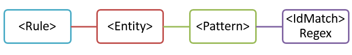
  
Hoewel het heel eenvoudig is, kan dit patroon veel fout-positieven identificeren door overeenkomende inhoud die een willekeurig negencijferig getal bevat dat niet noodzakelijkerwijs een medewerkers-ID is. 
  
### <a name="more-common-scenario-entity-with-multiple-patterns"></a>Vaker voorkomend scenario: entiteit met meerdere patronen

Daarom is het gebruikelijker een entiteit te definiëren door meer dan één patroon te gebruiken, waarbij de patronen niet alleen de entiteit identificeren (zoals een negencijferig getal), maar ook ondersteunende gegevens (zoals een trefwoord of datum).
  
Als u de waarschijnlijkheid wilt vergroten om inhoud te identificeren die een medewerkers-ID bevat, kunt u een ander patroon definiëren dat naast het negencijferige getal ook een aanstellingsdatum bevat en nog een ander patroon dat zowel de aanstellingsdatum als een trefwoord (zoals 'medewerkers-ID') identificeert.
  

  
Er zitten een aantal belangrijke aspecten aan deze structuur:
  
- Patronen die meer bewijs nodig hebben, hebben een hoger betrouwbaarheidsniveau. Dit is handig, want wanneer u later dit type voor vertrouwelijke gegevens gebruikt in beleid kunt u meer beperkende acties gebruiken (zoals inhoud blokkeren) met alleen de overeenkomsten met een hogere betrouwbaarheid en minder beperkende acties (zoals het verzenden van een melding) bij overeenkomsten met een lagere betrouwbaarheid.

- De ondersteunende IdMatch- en trefferelementen verwijzen naar regexes en trefwoorden die onderliggende elementen zijn van het regelelement, niet het patroon. Deze ondersteunende elementen worden aangeduid door het patroon, maar opgenomen in de regel. Dit betekent dat naar een enkele definitie van een ondersteunend element, zoals een normale expressie of een lijst met trefwoorden, kan worden verwezen door meerdere entiteiten en patronen.

## <a name="what-entity-do-you-need-to-identify-entity-element-id-attribute"></a>Welke entiteit moet u identificeren? [Entiteitselement, ID-kenmerk]

Een entiteit is een type voor vertrouwelijke gegevens, zoals een creditcardnummer, met een goed gedefinieerd patroon. Elke entiteit heeft een unieke GUID als ID.
  
### <a name="name-the-entity-and-generate-its-guid"></a>De entiteit een naam geven en de bijbehorende GUID genereren

1. Voeg in de XML-editor van uw keuze de regels en entiteitelementen toe.
2. Voeg een opmerking toe waarin de naam van uw aangepaste entiteit staat, in dit voorbeeld Medewerkers-ID. Later zult u de entiteitsnaam toevoegen aan het gedeelte met gelokaliseerde tekenreeksen en verschijnt de naam in de UI wanneer u beleid maakt.
3. Genereer een GUID voor uw entiteit. Er zijn verschillende manieren om GUID's te genereren, maar u kunt het eenvoudig in PowerShell doen door **[guid]::NewGuid()** te typen. Later voegt u ook de entiteits-GUID toe aan het gedeelte gelokaliseerde tekenreeksen.
  
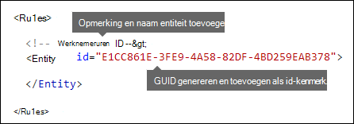
  
## <a name="what-pattern-do-you-want-to-match-pattern-element-idmatch-element-regex-element"></a>Welk patroon wilt u vergelijken? [Patroonelement, IdMatch-element. Regex-element]

Het patroon bevat de lijst met waar het type voor vertrouwelijke gegevens naar zoekt. Dit kan regexes, trefwoorden en ingebouwde functies omvatten (die taken uitvoeren als het uitvoeren van regexes om datums of adressen te vinden). Typen voor vertrouwelijke gegevens kunnen meerdere patronen met unieke betrouwbaarheden.
  
Wat alle onderstaande patronen gemeen hebben is dat ze allemaal verwijzen naar dezelfde normale expressie die zoekt naar een negencijferig getal (\d{9}) omgeven door witruimte (\s)... (\s). Het element IdMatch verwijst naar deze normale expressie en de expressie is de algemene vereiste voor alle patronen die zoeken naar de entiteit Medewerkers-ID. IdMatch is de aanduiding dat het patroon probeert te vinden, zoals Medewerkers-ID of creditcardnummer of burgerservicenummer. Een patroonelement moet precies één IdMatch-element hebben.
  
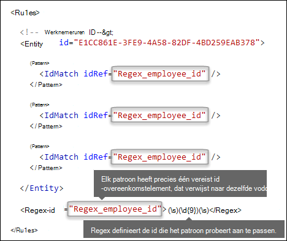
  
Wanneer aan de voorwaarden wordt voldaan, retourneert een patroon een telling en betrouwbaarheidsniveau die u kunt gebruiken in de voorwaarden in uw beleid. Wanneer u aan beleid een voorwaarde toevoegt voor de detectie van een type voor vertrouwelijke gegevens, kunt u de telling en het betrouwbaarheidsniveau bewerken, zoals hier wordt aangegeven. Het betrouwbaarheidsniveau (ook genaamd nauwkeurigheid van overeenkomst) wordt later in dit onderwerp uitgelegd.
  

  
Wanneer u een normale expressie maakt, houd er dan rekening mee dat er potentiële problemen zijn waar u op moet letten. Als u bijvoorbeeld een regex maakt en uploadt die te veel inhoud identificeert, kan dit van invloed zijn op de prestaties. Zie [Mogelijke validatieproblemen om op te letten](#potential-validation-issues-to-be-aware-of) verderop voor meer informatie over deze potentiële problemen.
  
## <a name="do-you-want-to-require-additional-evidence-match-element-mincount-attribute"></a>Wilt u aanvullend bewijs eisen? [Trefferelement, minCount-kenmerk]

Naast de IdMatch kan een patroon het trefferelement gebruiken om aanvullende ondersteunende gegevens te eisen, zoals een trefwoord, regex, datum of adres.
  
Een patroon kan meerdere trefferelementen bevatten. Ze kunnen direct in het patroonelement worden opgenomen of gecombineerd door het Any-element te gebruiken. Trefferelementen worden gecombineerd door een impliciete AND-operator, er moet aan alle trefferelementen worden voldaan voordat het patroon overeenkomt. U kunt het Any-element gebruiken om AND- of OR-operatoren in te zetten (meer hierover in een later gedeelte).
  
U kunt het optionele attribuut minCount gebruiken om op te geven hoeveel exemplaren van een overeenkomst moeten worden gevonden voor elk van de trefferelementen. U kunt bijvoorbeeld specificeren dat pas aan een patroon wordt voldaan wanneer ten minste twee trefwoorden van een lijst met trefwoorden kunnen worden gevonden.
  
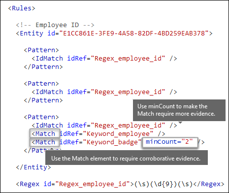
  
### <a name="keywords-keyword-group-and-term-elements-matchstyle-and-casesensitive-attributes"></a>Trefwoorden [trefwoord, groep en termelementen, matchStyle en caseSensitive-attributen]

Wanneer u vertrouwelijke gegevens identificeert, zoals een medewerkers-ID, wilt u vaak trefwoorden eisen als ondersteunende gegevens. Zo kunt u bijvoorbeeld naast het zoeken naar een negencijferig nummber, zoeken naar woorden als 'kaart', 'badge' of 'ID'. Hiervoor gebruikt u het element Trefwoord. Het element Trefwoord heeft een ID-attribuut waarnaar kan worden verwezen door meerdere trefferelementen in meerdere patronen of entiteiten.
  
Trefwoorden worden opgenomen als een lijst van Termelementen in een Groepselement. Het Groepselement heeft een kenmerk matchStyle met twee mogelijke waarden:
  
- **matchStyle="word"** een woordovereenkomst identificeert hele woorden omgeven door witruimte of andere scheidingstekens. U moet altijd woord gebruiken tenzij u delen van woorden of woorden in Aziatische talen wilt vergelijken. 
    
- **matchStyle="string"** een tekenreeksovereenkomst identificeert tekenreeksen, ongeacht waardoor ze worden omgeven. 'id' komt bijvoorbeeld overeen met 'bid' en 'idee'. Gebruik alleen tekenreeks wanneer u Aziatische woorden moet vergelijken of als uw trefwoord deel kan uitmaken van andere tekenreeksen. 
    
Tenslotte kunt u het kenmerk caseSensitive van het termelement gebruiken om op te geven dat de inhoud precies met het trefwoord moet overeenkomen, inclusief kleine en hoofdletters.
  
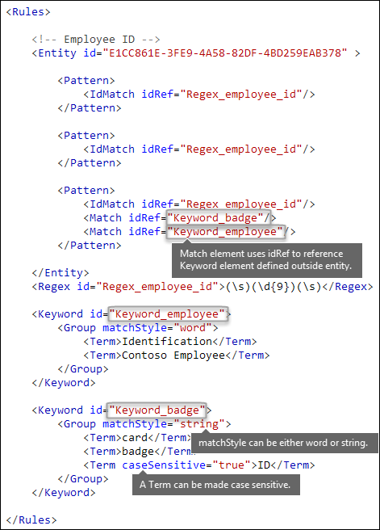
  
### <a name="regular-expressions-regex-element"></a>Normale expressies [Regex-element]

In dit voorbeeld gebruikt de entiteit medewerkers-ID al het element IdMatch om te verwijzen naar een regex voor een patroon, een negencijferig getal omgeven door witruimte. Daarnaast kan een patroon een trefferelement gebruiken om te verwijzen naar een aanvullend regex-element om ondersteunende gegevens te identificeren, zoals een vijf- of negencijferig getal in de indeling van een Amerikaanse postcode.
  
### <a name="additional-patterns-such-as-dates-or-addresses-built-in-functions"></a>Aanvullende patronen, zoals datums of adressen [ingebouwde functies]

Naast de ingebouwde typen voor vertrouwelijke gegevens, kunnen typen voor vertrouwelijke gegevens ook ingebouwde functies gebruiken die ondersteunende gegevens kunnen identificeren, zoals een Amerikaanse datum, Europese datum, vervaldatum of Amerikaans adres. Microsoft 365 ondersteunt het uploaden van uw eigen aangepaste functies niet, maar wanneer u een aangepast type voor vertrouwelijke gegevens maakt, kan uw entiteit verwijzen naar de ingebouwde functies.
  
Een medewerkers-ID-badge heeft bijvoorbeeld een datum in dienst, dan kan deze aangepaste entiteit de ingebouwde functie gebruiken `Func_us_date`een datum identificeren in de indeling die normaliter in de VS wordt gebruikt. 
  
Zie [Doel van de DLP-functies](what-the-dlp-functions-look-for.md) voor meer informatie.
  
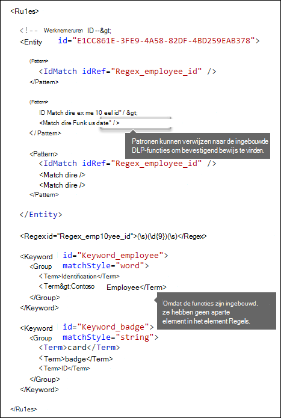
  
## <a name="different-combinations-of-evidence-any-element-minmatches-and-maxmatches-attributes"></a>Verschillende combinaties van bewijs [Any-element, minMatches- en maxMatches-kenmerken]

In een patroonelement worden alle IdMatch- en trefferelementen gecombineerd door een impliciete AND-operator, er moet aan alle voorwaarden worden voldaan voordat het patroon overeenkomt. U kunt echter flexibelere overeenkomstlogica maken door het Any-element te gebruiken om trefferelementen te groeperen. U kunt bijvoorbeeld het Any-element gebruiken om alle, geen of een exacte subset van de onderliggende trefferelementen te vergelijken.
  
Het Any-element heeft optionele minMatches- en maxMatches-kenmerken die ukunt gebruiken om op te geven aan hoeveel van de onderliggende trefferelementen moet worden voldaan voordat het patroon overeenkomt. Houd er rekening mee dat deze kenmerken het aantal trefferelementen definiëren waaraan moet worden voldaan, niet het aantal exemplaren van bewijs dat wordt gevonden voor de overeenkomsten. Om een minimaal aantal exemplaren op te geven voor een specifieke overeenkomst, zoals twee trefwoorden uit een lijst, gebruikt u het kenmerk minCount voor een trefferelement (zie hierboven).
  
### <a name="match-at-least-one-child-match-element"></a>Ten minste één overeenkomend onderliggend trefferlement

Wanneer u wilt eisen dat er maar een minimaal aantal trefferelementen moet overeenkomen, kunt u het kenmerk minMatches gebruiken. Deze trefferelementen worden in feite gecombineerd door een impliciete OR-operator. Aan dit Any-element wordt voldaan als een Amerikaanse datum of een trefwoord uit één van de lijsten wordt gevonden.

```xml
<Any minMatches="1" >
     <Match idRef="Func_us_date" />
     <Match idRef="Keyword_employee" />
     <Match idRef="Keyword_badge" />
</Any>
```
    
### <a name="match-an-exact-subset-of-any-children-match-elements"></a>Een exact overeekomende subset van onderliggende trefferelementen 

Als u wilt dat aan een exact aantal trefferelementen moet worden voldaan, kunt u minMatches en maxMatches op dezelfde waarde instellen. Aan dit Any-element wordt alleen voldaan als precies één datum of trefwoord wordt gevonden, meer dan dat en het patroon komt niet overeen.

```xml
<Any minMatches="1" maxMatches="1" >
     <Match idRef="Func_us_date" />
     <Match idRef="Keyword_employee" />
     <Match idRef="Keyword_badge" />
</Any>
```
  
### <a name="match-none-of-children-match-elements"></a>Geen overeenkomende onderliggende trefferelementen

Wanneer u wilt eisen dat er geen bepaald bewijs wordt gevonden om aan een patroon te voldoen, kunt u minMatches en maxMatches beide op 0 instellen. Dit kan handig zijn wanneer u een lijst met trefwoorden hebt of ander bewijs dat waarschijnlijk duidt op een fout-positief.
  
De entiteit medewerkers-ID zoekt bijvoorbeeld naar het trefwoord 'kaart', omdat dat mogelijk naar 'ID-kaart' verwijst. Als kaart echter alleen voorkomt in 'bankkaart', betekent 'kaart' in deze inhoud waarschijnlijk niet 'ID-kaart'. U kunt dus 'bankkaart' toevoegen als trefwoord in een lijst met termen die u wilt uitsluiten om aan het patroon te voldoen.
  
```xml
<Any minMatches="0" maxMatches="0" >
    <Match idRef="Keyword_false_positives_local" />
    <Match idRef="Keyword_false_positives_intl" />
</Any>
```

### <a name="match-a-number-of-unique-terms"></a>Een aantal unieke overeenkomende termen

Wanneer u een aantal unieke termen wilt vergelijken, gebruikt u de parameter *uniqueResults*, ingesteld op *waar*, zoals weergegeven in het volgende voorbeeld:

```xml
<Pattern confidenceLevel="75">
    <IdMatch idRef="Salary_Revision_terms" />
    <Match idRef=" Salary_Revision_ID " minCount="3" uniqueResults="true" />
</Pattern>
```

In dit voorbeeld is een patroon gedefinieerd voor een salariswijziging die gebruikmaakt van ten minste drie unieke overeenkomsten. 
  
## <a name="how-close-to-the-entity-must-the-other-evidence-be-patternsproximity-attribute"></a>Hoe dicht bij de entiteit moet het andere bewijs zijn? [patternsProximity-attribuut]

Uw type voor vertrouwelijke gegevens zoekt naar een patroon dat een medewerkers-ID vertegenwoordigt en als onderdeel van dat patroon zoekt het ook naar ondersteunende gegevens, zoals een trefwoord als 'ID'. Het is logisch dat des te meer het bewijs overeenkomt, des te groter de kans is dat het patroon een medewerkers-ID is. U kunt bepalen hoe dicht bij de entiteit het andere bewijs in het patroon moet zijn, door het vereiste attribuut patternsProximity van het entiteitselement te gebruiken.
  
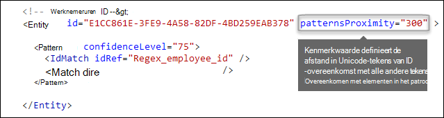
  
Voor elk patroon in de entiteit definieert de waarde van het attribuut patternsProximity de afstand (in Unicode-tekens) van de IdMatch-locatie voor alle andere overeenkomsten opgegeven voor dat patroon. De nabijheidsmarge is verankerd aan de IdMatch-locatie, waarbij de marge links en rechts van IdMatch kan worden uitgebreid.
  
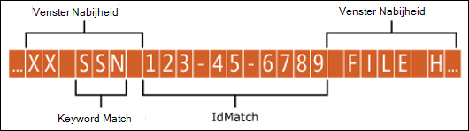
  
Onderstaande voorbeeld toont hoe de nabijheidsmargevan invloed is op de manier waarop IdMatch-element voor de aangepaste entiteit medewerkers-ID ten minste één overeenkomst van trefwoord of datum vereist. Alleen ID1 komt overeen, omdat voor ID2 en ID3 geen of alleen gedeeltelijk ondersteunende gegevens kunnen worden gevonden binnen de nabijheidsmarge.
  
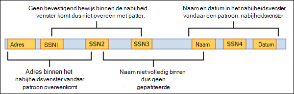
  
Houd er rekening mee dat voor e-mailberichten, het bericht zelf en elke bijlage als afzonderlijke items worden behandeld. Dit betekent dat de nabijheidsmarge niet wordt uitgebreid na het einde van elk van deze items. Voor elk item (bijlage of bericht) moeten zowel de IdMatch en ondersteunende gegevens zich in dat item bevinden.
  
## <a name="what-are-the-right-confidence-levels-for-different-patterns-confidencelevel-attribute-recommendedconfidence-attribute"></a>Wat zijn de juiste betrouwbaarheidsniveaus voor verschillende patronen? [confidenceLevel-attribuut, recommendedConfidence-attribuut]

Des te meer bewijs is vereist voor een patroon, des te betrouwbaarder het is dat een werkelijke entiteit (zoals medewerkers-ID) is geïdentificeerd wanneer het patroon overeenkomt. U hebt bijvoorbeeld meer vertrouwen in een patroon dat een negencijferig ID-nummer, datum in dienst en trefwoord dicht bij elkaar vereist, dan in een patroon dat alleen een negencijferig ID-nummer vereist.
  
Het patroonelement heeft een vereist kenmerk confidenceLevel. U kunt de waarde van confidenceLevel (een integer tussen 1 en 100) beschouwen als een uniek ID voor elk patroon in een entitei. De patronen in een entiteit moeten verschillende betrouwbaarheidsniveaus hebben die u toewijst. De exacte waarde van de integer maakt niet uit, kies eenvoudig nummers die logisch zijn voor uw nalevingsteam. Nadat u uw aangepaste type vertrouwelijke gegevens hebt geüpload en daarna beleid hebt gemaakt, kunt u naar deze betrouwbaarheidsniveaus verwijzen in de voorwaarden van de regels die u maakt.
  

  
Naast confidenceLevel voor elk patroon heeft de entiteit ook een kenmerk recommendedConfidence. Het kenmerk recommendedConfidence kan worden beschouwd als het standaardbetrouwbaarheidsniveau voor de regel. Wanneer u een beleidsregel maakt, vergelijkt de regel op basis van het aanbevolen betrouwbaarheidsniveau voor de entiteit, tenzij u een betrouwbaarheidsniveau voor de regel opgeeft. Houd er rekening mee dat het kenmerk recommendedConfidence verplicht is voor elke entiteits-ID in het regelpakket. Als het kenmerk ontbreekt, kunt u geen beleid opslaan dat gebruikmaakt van het type vertrouwelijke gegevens. 
  
## <a name="do-you-want-to-support-other-languages-in-the-ui-of-the-compliance-center-localizedstrings-element"></a>Wilt u andere talen ondersteunen in de gebruikersinterface van het compliancecentrum? [LocalizedStrings-element]

Als uw complianceteam het Microsoft 365-compliancecentrum gebruikt om beleid in verschillende landen en talen te maken, kunt u gelokaliseerde versies van de naam en beschrijving van uw aangepaste type vertrouwelijke gegevens geven. Wanneer uw complianceteam Microsoft 365 gebruikt in een taal die u ondersteunt, zien ze de gelokaliseerde naam in de gebruikersinterface.
  
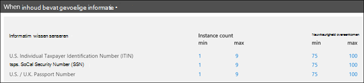
  
Het element regels moet een LocalizedStrings-element bevatten, dat een Resource-element bevat dat verwijst naar de GUID van uw aangepaste entiteit. Elk Resource-element bevat een of meer Naam- en Beschrijving-elementen die elk het kenmerk taalcode gebruiken om een gelokaliseerde tekenreeks te geven voor een specifieke taal.
  
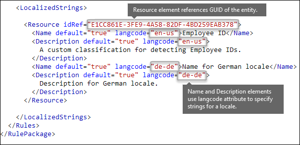
  
Houd er rekening mee dat u gelokaliseerde tekenreeksen alleen gebruikt om te bepalen hoe uw aangepaste type vertrouwelijke gegevens wordt weergegeven in de gebruikersinterface van het compliancecentrum. U kunt gelokaliseerde tekenreeksen niet gebruiken om verschillende gelokaliseerde versies van een lijst trefwoorden of normale expressie te bieden.
  
## <a name="other-rule-package-markup-rulepack-guid"></a>Ander regelpakket [RulePack GUID]

Ten slotte bevat het begin van elk RulePackage algemene gegevens die u moet invullen. U kunt de volgende tekst gebruiken als sjabloon en de "  . ." vervangen met tijdelijke aanduidingen met uw eigen gegevens.
  
Het belangrijkste is dat u een GUID moet genereren voor het RulePack. Hierboven hebt u een GUID gegenereerd voor de entiteit, dit is een tweede GUID voor het RulePack. Er zijn verschillende manieren om GUID's te genereren, maar u kunt het eenvoudig in PowerShell doen door [guid]::NewGuid() te typen.
  
Het element Versie is ook belangrijk. WAnneer u uw regelpakket de eerste keer upload, wordt in Microsoft 365 het versienummer genoteerd. Later, wanneer u het regelpakket bijwerkt en een nieuwe versie uploadt, zorg er dan voor dat u het versienummer bijwerkt, anders implementeert Microsoft 365 het regelpakket niet.
  
```xml
<?xml version="1.0" encoding="utf-16"?>
<RulePackage xmlns="http://schemas.microsoft.com/office/2011/mce">
  <RulePack id=". . .">
    <Version major="1" minor="0" build="0" revision="0" />
    <Publisher id=". . ." /> 
    <Details defaultLangCode=". . .">
      <LocalizedDetails langcode=" . . . ">
         <PublisherName>. . .</PublisherName>
         <Name>. . .</Name>
         <Description>. . .</Description>
      </LocalizedDetails>
    </Details>
  </RulePack>
  
 <Rules>
  . . .
 </Rules>
</RulePackage>

```

Wanneer het klaar is, zou uw RulePack-element er als volgt uit moeten zien.
  
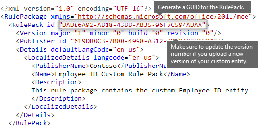

## <a name="validators"></a>Validators

Microsoft 365 worden functieprocessors voor veelgebruikte SIT's als validators gebruikt. Hier is een lijst met deze. 

### <a name="list-of-validators-currently-available"></a>Lijst met validators die momenteel beschikbaar zijn

- Func_credit_card
- Func_ssn
- Func_unformatted_ssn
- Func_randomized_formatted_ssn
- Func_randomized_unformatted_ssn
- Func_aba_routing
- Func_south_africa_identification_number
- Func_brazil_cpf
- Func_iban
- Func_brazil_cnpj
- Func_swedish_national_identifier
- Func_india_aadhaar
- Func_uk_nhs_number
- Func_Turkish_National_Id
- Func_australian_tax_file_number
- Func_usa_uk_passport
- Func_canadian_sin
- Func_formatted_itin
- Func_unformatted_itin
- Func_dea_number_v2
- Func_dea_number
- Func_japanese_my_number_personal
- Func_japanese_my_number_corporate

Hierdoor kunt u uw eigen regex definiëren en valideren. Als u validators wilt gebruiken, definieert u uw eigen regex en terwijl u de regex definieert, gebruikt u de eigenschap validator om de functieverwerker van uw keuze toe te voegen. Nadat u deze regex hebt gedefinieerd, kunt u deze regex gebruiken in een SIT. 

In het onderstaande voorbeeld wordt een normale expressie - Regex_credit_card_AdditionalDelimiters gedefinieerd voor creditcard die vervolgens wordt gevalideerd met behulp van de functie checksum voor creditcard met behulp van Func_credit_card als validator.

```xml
<Regex id="Regex_credit_card_AdditionalDelimiters" validators="Func_credit_card"> (?:^|[\s,;\:\(\)\[\]"'])([0-9]{4}[ -_][0-9]{4}[ -_][0-9]{4}[ -_][0-9]{4})(?:$|[\s,;\:\(\)\[\]"'])</Regex>
<Entity id="675634eb7-edc8-4019-85dd-5a5c1f2bb085" patternsProximity="300" recommendedConfidence="85">
<Pattern confidenceLevel="85">
<IdMatch idRef="Regex_credit_card_AdditionalDelimiters" />
<Any minMatches="1">
<Match idRef="Keyword_cc_verification" />
<Match idRef="Keyword_cc_name" />
<Match idRef="Func_expiration_date" />
</Any>
</Pattern>
</Entity>
```

Microsoft 365 biedt twee algemene validators

### <a name="checksum-validator"></a>Checksum-validator

In dit voorbeeld wordt een checksum validator voor werknemers-id gedefinieerd om de regex voor EmployeeID te valideren.

```xml
<Validators id="EmployeeIDChecksumValidator">
<Validator type="Checksum">
<Param name="Weights">2, 2, 2, 2, 2, 1</Param>
<Param name="Mod">28</Param>
<Param name="CheckDigit">2</Param> <!-- Check 2nd digit -->
<Param name="AllowAlphabets">1</Param> <!— 0 if no Alphabets -->
</Validator>
</Validators>
<Regex id="Regex_EmployeeID" validators="ChecksumValidator">(\d{5}[A-Z])</Regex>
<Entity id="675634eb7-edc8-4019-85dd-5a5c1f2bb085" patternsProximity="300" recommendedConfidence="85">
<Pattern confidenceLevel="85">
<IdMatch idRef="Regex_EmployeeID"/>
</Pattern>
</Entity>
```

### <a name="date-validator"></a>Datum validator

In dit voorbeeld wordt een datum-validator gedefinieerd voor een regex-deel waarvan datum is.

```xml
<Validators id="date_validator_1"> <Validator type="DateSimple"> <Param name="Pattern">DDMMYYYY</Param> <!—supported patterns DDMMYYYY, MMDDYYYY, YYYYDDMM, YYYYMMDD, DDMMYYYY, DDMMYY, MMDDYY, YYDDMM, YYMMDD --> </Validator> </Validators>
<Regex id="date_regex_1" validators="date_validator_1">\d{8}</Regex>
```
  
## <a name="changes-for-exchange-online"></a>Wijzigingen voor Exchange Online

Voorheen gebruikte u mogelijk Exchange Online PowerShell om uw aangepaste typen vertrouwelijke gegevens voor DLP te importeren. Nu kunnen uw typen vertrouwelijke gegevens worden gebruikt in zowel het Exchange-beheercentrum als het compliancecentrum. Als onderdeel van deze verbetering moet u compliancecentrum PowerShell gebruiken om uw aangepaste typen vertrouwelijke gegevens te importeren, u kunt ze niet meer importeren vanuit Exchange PowerShell. Uw aangepaste typen vertrouwelijke gegevens blijven gewoon werken als voorheen, het kan echter maximaal een uur duren voordat wijzigingen die zijn aangebracht aan typen vertrouwelijke gegevens in het compliancecentrum verschijnen in het Exchange-beheercentrum.
  
Houd er rekening mee dat u in het compliancecentrum de cmdlet **[New-DlpSensitiveInformationTypeRulePackage](/powershell/module/exchange/new-dlpsensitiveinformationtyperulepackage)** gebruikt om een regelpakket te uploaden. (Voorheen in het Exchange-beheercentrum gebruikte u de cmdlet **ClassificationRuleCollection**.) 
  
## <a name="upload-your-rule-package"></a>Uw regelpakket uploaden

Om uw regelpakket te uploaden, moet u de volgende stappen uitvoeren:
  
1. Het pakket opslaan als .XML-bestand met Unicode-codering.
    
2. [Verbinding maken met compliancecentrum PowerShell](/powershell/exchange/exchange-online-powershell)
    
3. Gebruik de volgende syntaxis:

   ```powershell
   New-DlpSensitiveInformationTypeRulePackage -FileData (Get-Content -Path "PathToUnicodeXMLFile" -Encoding Byte -ReadCount 0)
   ```

   In dit voorbeeld wordt het Unicode XML-bestand met de naam MyNewRulePack.xml geüpload vanaf C:\Mijn documenten.

   ```powershell
   New-DlpSensitiveInformationTypeRulePackage -FileData (Get-Content -Path "C:\My Documents\MyNewRulePack.xml" -Encoding Byte -ReadCount 0)
   ```

   Zie [New-DlpSensitiveInformationTypeRulePackage](/powershell/module/exchange/new-dlpsensitiveinformationtyperulepackage) voor meer gedetailleerde syntaxis- en parameterinformatie.

   > [!NOTE]
   > Er worden maximaal 10 regelpakketten ondersteund, maar ieder pakket kan de definitie van meerdere typen vertrouwelijke gegevens bevatten.

4. Voer een van de volgende stappen uit om er zeker van te zijn dat u een nieuw type vertrouwelijke gegevens hebt gemaakt:

   - Voer de cmdlet [Get-DlpSensitiveInformationTypeRulePackage](/powershell/module/exchange/get-dlpsensitiveinformationtyperulepackage) uit om te verifiëren dat het nieuwe regelpakket op de lijst wordt vermeld:

     ```powershell
     Get-DlpSensitiveInformationTypeRulePackage
     ``` 

   - Voer de cmdlet [Get-DlpSensitiveInformationType](/powershell/module/exchange/get-dlpsensitiveinformationtype) uit om te verifiëren dat het nieuwe regelpakket op de lijst wordt vermeld:

     ```powershell
     Get-DlpSensitiveInformationType
     ``` 

     Voor aangepaste typen vertrouwelijke gegevens wordt de waarde van de eigenschap Uitgever iets anders dan Microsoft Corporation.

   - Vervang \<Name\> met de Naamwaarde van het type vertrouwelijke gegevens (bijvoorbeeld: Medewerkers-ID) en voer de cmdlet [Get-DlpSensitiveInformationType](/powershell/module/exchange/get-dlpsensitiveinformationtype) uit:

     ```powershell
     Get-DlpSensitiveInformationType -Identity "<Name>"
     ```
    
## <a name="potential-validation-issues-to-be-aware-of"></a>Mogelijke validatieproblemen om rekening mee te houden

Wanneer u uw regelpakket-XML-bestand uploadt, wordt door het systeem de XML gevalideerd en gecontroleerd op bekende onjuiste patronen en voor de hand liggende prestatieproblemen. Hier zijn een aantal bekende problemen waar de validatie op controleert, een normale expressie:
  
- mag niet beginnen of eindigen met een "|" die overeenkomt met alles, omdat het wordt beschouwd als lege overeenkomst.
    
  Bijvoorbeeld: "|a" of "|b" komt niet door de validatie.
    
- mag niet beginnen of eindigen met een ".{0,}"-patroon dat geen functioneel doel heeft en alleen de prestatie nadelig beïnvloedt.
    
  Bijvoorbeeld: ".{0,50}ASDF" or "ASDF.{0,50}" komt niet door de validatie.
    
- mag geen ".{0,m}" of ".{1,m}" in groepen hebben en geen ".\*" or ".+" in groepen.
    
  Bijvoorbeeld: "(.{0,50000})" komt niet door de validatie.
    
- mag geen tekens hebben met "{0,m}"- of "{1,m}"-herhalingen in groepen. 
    
  Bijvoorbeeld: "(a\*)" komt niet door de validatie.
    
- mag niet beginnen of eindigen met ".{1,m}", gebruik hiervoor in de plaats gewoon "."
    
  Bijvoorbeeld: ".{1,m}asdf" komt niet door de validatie, gebruik in plaats daarvan ".asdf".
    
- mag geen onafhankelijke herhaling (zoals "\*" of "+") hebben in een groep.
    
  Bijvoorbeeld: "(xx)\*" en "(xx)+" komen niet door de validatie.
  
- Trefwoorden mogen maximaal 50 tekens lang zijn.  Als u in een groep een trefwoord hebt dat langer is, wordt voorgesteld een groep met termen te maken als een [trefwoordenlijst](./create-a-keyword-dictionary.md) en de GUID van de trefwoordenboek te verwijzen binnen de XML-structuur als onderdeel van de entiteit voor overeenkomst of idMatch in het bestand.

- Elk aangepaste type vertrouwelijke gegevens mag maximaal 2048 trefwoorden hebben.

- De maximale grootte van trefwoordenboeken in een enkele tenant is 1 MB gecomprimeerd. Verwijs zo vaak als nodig is naar hetzelfde boek bij het maken van typen vertrouwelijke gegevens. Begin met het maken van aangepaste trefwoordenlijsten in het type vertrouwelijke gegevens en gebruik trefwoordenboeken als u meer dan 2048 trefwoord in een trefwoordenlijst hebt of als een trefwoord langer is dan 50 tekens.

- Er zijn maximaal 50 typen vertrouwelijke gegevens op basis van trefwoordenboeken toegestaan in een tenant.

- Zorg ervoor dat elke entiteitselement een kenmerk recommendedConfidence bevat.

- Bij het gebruik van de cmdlet PowerShell is er een maximale retourgrootte van de gedeserialiseerde gegevens van ongeveer 1 megabyte.   Dit is van invloed op de grootte van het XML-bestand van uw regelpakket. Houd het geüploade bestand beperkt tot maximaal 770 kilobyte, als voorgestelde limiet voor consistente resultaten zonder fouten tijdens de uitvoering.

- De XML-structuur vereist geen opmaaktekens zoals spaties, tabs of Enter-tekens.  Houd hier rekening mee bij het optimaliseren van ruimte voor uploads. Hulpprogramma's zoals Microsoft Visual Code bieden join-lijnfuncties om het XML-bestand te comprimeren.
    
Als een aangepast type vertrouwelijke gegevens een probleem bevat dat de prestaties kan beïnvloeden, wordt het niet geüpload en krijgt u mogelijk een van deze foutberichten te zien:
  
- **Algemene bepalers komen overeen met meer inhoud dan verwacht (bijvoorbeeld '+', '\*')**
    
- **Lookaround assertions**
    
- **Gecompliceerde groepering in combinatie met algemene bepalers**
    
## <a name="recrawl-your-content-to-identify-the-sensitive-information"></a>Uw inhoud opnieuw bekijken om de vertrouwelijke gegevens te identificeren

Microsoft 365 gebruikt de zoekverkenner om vertrouwelijke gegevens te identificeren en te classificeren in site-inhoud. Inhoud in SharePoint Online- en OneDrive Bedrijven-sites wordt automatisch opnieuw verkend bij het bijwerken. Maar om uw nieuwe aangepaste type vertrouwelijke gegevens te identificeren in alle bestaande inhoud, moet die inhoud opnieuw worden verkend.
  
In Microsoft 365 kunt u niet handmatig de verkenning van een hele tenant aanvragen, maar u kunt dit wel doen voor een siteverzameling, lijst of bibliotheek. Zie [Het verkennen en opnieuw indexeren van een site, bibliotheek of lijst handmatig aanvragen](/sharepoint/crawl-site-content).
  
## <a name="reference-rule-package-xml-schema-definition"></a>Verwijzing: definitie van het XML-schema van het regelpakket

U kunt deze tekst kopiëren, opslaan als XSD-bestand en gebruiken om het XML-bestand van uw regelpakket te valideren.
  
```xml
<?xml version="1.0" encoding="utf-8"?>
<xs:schema xmlns:mce="http://schemas.microsoft.com/office/2011/mce"
           targetNamespace="http://schemas.microsoft.com/office/2011/mce"
           xmlns:xs="https://www.w3.org/2001/XMLSchema"
           elementFormDefault="qualified"
           attributeFormDefault="unqualified"
           id="RulePackageSchema">
  <!-- Use include if this schema has the same target namespace as the schema being referenced, otherwise use import -->
  <xs:element name="RulePackage" type="mce:RulePackageType"/>
  <xs:simpleType name="LangType">
    <xs:union memberTypes="xs:language">
      <xs:simpleType>
        <xs:restriction base="xs:string">
          <xs:enumeration value=""/>
        </xs:restriction>
      </xs:simpleType>
    </xs:union>
  </xs:simpleType>
  <xs:simpleType name="GuidType" final="#all">
    <xs:restriction base="xs:token">
      <xs:pattern value="[0-9a-fA-F]{8}\-([0-9a-fA-F]{4}\-){3}[0-9a-fA-F]{12}"/>
    </xs:restriction>
  </xs:simpleType>
  <xs:complexType name="RulePackageType">
    <xs:sequence>
      <xs:element name="RulePack" type="mce:RulePackType"/>
      <xs:element name="Rules" type="mce:RulesType">
        <xs:key name="UniqueRuleId">
          <xs:selector xpath="mce:Entity|mce:Affinity|mce:Version/mce:Entity|mce:Version/mce:Affinity"/>
          <xs:field xpath="@id"/>
        </xs:key>
        <xs:key name="UniqueProcessorId">
          <xs:selector xpath="mce:Regex|mce:Keyword|mce:Fingerprint"></xs:selector>
          <xs:field xpath="@id"/>
        </xs:key>
        <xs:key name="UniqueResourceIdRef">
          <xs:selector xpath="mce:LocalizedStrings/mce:Resource"/>
          <xs:field xpath="@idRef"/>
        </xs:key>
        <xs:keyref name="ReferencedRuleMustExist" refer="mce:UniqueRuleId">
          <xs:selector xpath="mce:LocalizedStrings/mce:Resource"/>
          <xs:field xpath="@idRef"/>
        </xs:keyref>
        <xs:keyref name="RuleMustHaveResource" refer="mce:UniqueResourceIdRef">
          <xs:selector xpath="mce:Entity|mce:Affinity|mce:Version/mce:Entity|mce:Version/mce:Affinity"/>
          <xs:field xpath="@id"/>
        </xs:keyref>
      </xs:element>
    </xs:sequence>
  </xs:complexType>
  <xs:complexType name="RulePackType">
    <xs:sequence>
      <xs:element name="Version" type="mce:VersionType"/>
      <xs:element name="Publisher" type="mce:PublisherType"/>
      <xs:element name="Details" type="mce:DetailsType">
        <xs:key name="UniqueLangCodeInLocalizedDetails">
          <xs:selector xpath="mce:LocalizedDetails"/>
          <xs:field xpath="@langcode"/>
        </xs:key>
        <xs:keyref name="DefaultLangCodeMustExist" refer="mce:UniqueLangCodeInLocalizedDetails">
          <xs:selector xpath="."/>
          <xs:field xpath="@defaultLangCode"/>
        </xs:keyref>
      </xs:element>
      <xs:element name="Encryption" type="mce:EncryptionType" minOccurs="0" maxOccurs="1"/>
    </xs:sequence>
    <xs:attribute name="id" type="mce:GuidType" use="required"/>
  </xs:complexType>
  <xs:complexType name="VersionType">
    <xs:attribute name="major" type="xs:unsignedShort" use="required"/>
    <xs:attribute name="minor" type="xs:unsignedShort" use="required"/>
    <xs:attribute name="build" type="xs:unsignedShort" use="required"/>
    <xs:attribute name="revision" type="xs:unsignedShort" use="required"/>
  </xs:complexType>
  <xs:complexType name="PublisherType">
    <xs:attribute name="id" type="mce:GuidType" use="required"/>
  </xs:complexType>
  <xs:complexType name="LocalizedDetailsType">
    <xs:sequence>
      <xs:element name="PublisherName" type="mce:NameType"/>
      <xs:element name="Name" type="mce:RulePackNameType"/>
      <xs:element name="Description" type="mce:OptionalNameType"/>
    </xs:sequence>
    <xs:attribute name="langcode" type="mce:LangType" use="required"/>
  </xs:complexType>
  <xs:complexType name="DetailsType">
    <xs:sequence>
      <xs:element name="LocalizedDetails" type="mce:LocalizedDetailsType" maxOccurs="unbounded"/>
    </xs:sequence>
    <xs:attribute name="defaultLangCode" type="mce:LangType" use="required"/>
  </xs:complexType>
  <xs:complexType name="EncryptionType">
    <xs:sequence>
      <xs:element name="Key" type="xs:normalizedString"/>
      <xs:element name="IV" type="xs:normalizedString"/>
    </xs:sequence>
  </xs:complexType>
  <xs:simpleType name="RulePackNameType">
    <xs:restriction base="xs:token">
      <xs:minLength value="1"/>
      <xs:maxLength value="64"/>
    </xs:restriction>
  </xs:simpleType>
  <xs:simpleType name="NameType">
    <xs:restriction base="xs:normalizedString">
      <xs:minLength value="1"/>
      <xs:maxLength value="256"/>
    </xs:restriction>
  </xs:simpleType>
  <xs:simpleType name="OptionalNameType">
    <xs:restriction base="xs:normalizedString">
      <xs:minLength value="0"/>
      <xs:maxLength value="256"/>
    </xs:restriction>
  </xs:simpleType>
  <xs:simpleType name="RestrictedTermType">
    <xs:restriction base="xs:string">
      <xs:minLength value="1"/>
      <xs:maxLength value="100"/>
    </xs:restriction>
  </xs:simpleType>
  <xs:complexType name="RulesType">
    <xs:sequence>
      <xs:choice maxOccurs="unbounded">
        <xs:element name="Entity" type="mce:EntityType"/>
        <xs:element name="Affinity" type="mce:AffinityType"/>
        <xs:element name="Version" type="mce:VersionedRuleType"/>
      </xs:choice>
      <xs:choice minOccurs="0" maxOccurs="unbounded">
        <xs:element name="Regex" type="mce:RegexType"/>
        <xs:element name="Keyword" type="mce:KeywordType"/>
        <xs:element name="Fingerprint" type="mce:FingerprintType"/>
        <xs:element name="ExtendedKeyword" type="mce:ExtendedKeywordType"/>
      </xs:choice>
      <xs:element name="LocalizedStrings" type="mce:LocalizedStringsType"/>
    </xs:sequence>
  </xs:complexType>
  <xs:complexType name="EntityType">
    <xs:sequence>
      <xs:element name="Pattern" type="mce:PatternType" maxOccurs="unbounded"/>
      <xs:element name="Version" type="mce:VersionedPatternType" minOccurs="0" maxOccurs="unbounded" />
    </xs:sequence>
    <xs:attribute name="id" type="mce:GuidType" use="required"/>
    <xs:attribute name="patternsProximity" type="mce:ProximityType" use="required"/>
    <xs:attribute name="recommendedConfidence" type="mce:ProbabilityType"/>
    <xs:attribute name="workload" type="mce:WorkloadType"/>
  </xs:complexType>
  <xs:complexType name="PatternType">
    <xs:sequence>
      <xs:element name="IdMatch" type="mce:IdMatchType"/>
      <xs:choice minOccurs="0" maxOccurs="unbounded">
        <xs:element name="Match" type="mce:MatchType"/>
        <xs:element name="Any" type="mce:AnyType"/>
      </xs:choice>
    </xs:sequence>
    <xs:attribute name="confidenceLevel" type="mce:ProbabilityType" use="required"/>
  </xs:complexType>
  <xs:complexType name="AffinityType">
    <xs:sequence>
      <xs:element name="Evidence" type="mce:EvidenceType" maxOccurs="unbounded"/>
      <xs:element name="Version" type="mce:VersionedEvidenceType" minOccurs="0" maxOccurs="unbounded" />
    </xs:sequence>
    <xs:attribute name="id" type="mce:GuidType" use="required"/>
    <xs:attribute name="evidencesProximity" type="mce:ProximityType" use="required"/>
    <xs:attribute name="thresholdConfidenceLevel" type="mce:ProbabilityType" use="required"/>
    <xs:attribute name="workload" type="mce:WorkloadType"/>
  </xs:complexType>
  <xs:complexType name="EvidenceType">
    <xs:sequence>
      <xs:choice maxOccurs="unbounded">
        <xs:element name="Match" type="mce:MatchType"/>
        <xs:element name="Any" type="mce:AnyType"/>
      </xs:choice>
    </xs:sequence>
    <xs:attribute name="confidenceLevel" type="mce:ProbabilityType" use="required"/>
  </xs:complexType>
  <xs:complexType name="IdMatchType">
    <xs:attribute name="idRef" type="xs:string" use="required"/>
  </xs:complexType>
  <xs:complexType name="MatchType">
    <xs:attribute name="idRef" type="xs:string" use="required"/>
    <xs:attribute name="minCount" type="xs:positiveInteger" use="optional"/>
    <xs:attribute name="uniqueResults" type="xs:boolean" use="optional"/>
  </xs:complexType>
  <xs:complexType name="AnyType">
    <xs:sequence>
      <xs:choice maxOccurs="unbounded">
        <xs:element name="Match" type="mce:MatchType"/>
        <xs:element name="Any" type="mce:AnyType"/>
      </xs:choice>
    </xs:sequence>
    <xs:attribute name="minMatches" type="xs:nonNegativeInteger" default="1"/>
    <xs:attribute name="maxMatches" type="xs:nonNegativeInteger" use="optional"/>
  </xs:complexType>
  <xs:simpleType name="ProximityType">
    <xs:union>
      <xs:simpleType>
        <xs:restriction base='xs:string'>
          <xs:enumeration value="unlimited"/>
        </xs:restriction>
      </xs:simpleType>
      <xs:simpleType>
        <xs:restriction base="xs:positiveInteger">
          <xs:minInclusive value="1"/>
        </xs:restriction>
      </xs:simpleType>
    </xs:union>
  </xs:simpleType>
  <xs:simpleType name="ProbabilityType">
    <xs:restriction base="xs:integer">
      <xs:minInclusive value="1"/>
      <xs:maxInclusive value="100"/>
    </xs:restriction>
  </xs:simpleType>
  <xs:simpleType name="WorkloadType">
    <xs:restriction base="xs:string">
      <xs:enumeration value="Exchange"/>
      <xs:enumeration value="Outlook"/>
    </xs:restriction>
  </xs:simpleType>
  <xs:simpleType name="EngineVersionType">
    <xs:restriction base="xs:token">
      <xs:pattern value="^\d{2}\.01?\.\d{3,4}\.\d{1,3}$"/>
    </xs:restriction>
  </xs:simpleType>
  <xs:complexType name="VersionedRuleType">
    <xs:choice maxOccurs="unbounded">
      <xs:element name="Entity" type="mce:EntityType"/>
      <xs:element name="Affinity" type="mce:AffinityType"/>
    </xs:choice>
    <xs:attribute name="minEngineVersion" type="mce:EngineVersionType" use="required" />
  </xs:complexType>
  <xs:complexType name="VersionedPatternType">
    <xs:sequence>
      <xs:element name="Pattern" type="mce:PatternType" maxOccurs="unbounded"/>
    </xs:sequence>
    <xs:attribute name="minEngineVersion" type="mce:EngineVersionType" use="required" />
  </xs:complexType>
  <xs:complexType name="VersionedEvidenceType">
    <xs:sequence>
      <xs:element name="Evidence" type="mce:EvidenceType" maxOccurs="unbounded"/>
    </xs:sequence>
    <xs:attribute name="minEngineVersion" type="mce:EngineVersionType" use="required" />
  </xs:complexType>
  <xs:simpleType name="FingerprintValueType">
    <xs:restriction base="xs:string">
      <xs:minLength value="2732"/>
      <xs:maxLength value="2732"/>
    </xs:restriction>
  </xs:simpleType>
  <xs:complexType name="FingerprintType">
    <xs:simpleContent>
      <xs:extension base="mce:FingerprintValueType">
        <xs:attribute name="id" type="xs:token" use="required"/>
        <xs:attribute name="threshold" type="mce:ProbabilityType" use="required"/>
        <xs:attribute name="shingleCount" type="xs:positiveInteger" use="required"/>
        <xs:attribute name="description" type="xs:string" use="optional"/>
      </xs:extension>
    </xs:simpleContent>
  </xs:complexType>
  <xs:complexType name="RegexType">
    <xs:simpleContent>
      <xs:extension base="xs:string">
        <xs:attribute name="id" type="xs:token" use="required"/>
      </xs:extension>
    </xs:simpleContent>
  </xs:complexType>
  <xs:complexType name="KeywordType">
    <xs:sequence>
      <xs:element name="Group" type="mce:GroupType" maxOccurs="unbounded"/>
    </xs:sequence>
    <xs:attribute name="id" type="xs:token" use="required"/>
  </xs:complexType>
  <xs:complexType name="GroupType">
    <xs:sequence>
      <xs:choice>
        <xs:element name="Term" type="mce:TermType" maxOccurs="unbounded"/>
      </xs:choice>
    </xs:sequence>
    <xs:attribute name="matchStyle" default="word">
      <xs:simpleType>
        <xs:restriction base="xs:NMTOKEN">
          <xs:enumeration value="word"/>
          <xs:enumeration value="string"/>
        </xs:restriction>
      </xs:simpleType>
    </xs:attribute>
  </xs:complexType>
  <xs:complexType name="TermType">
    <xs:simpleContent>
      <xs:extension base="mce:RestrictedTermType">
        <xs:attribute name="caseSensitive" type="xs:boolean" default="false"/>
      </xs:extension>
    </xs:simpleContent>
  </xs:complexType>
  <xs:complexType name="ExtendedKeywordType">
    <xs:simpleContent>
      <xs:extension base="xs:string">
        <xs:attribute name="id" type="xs:token" use="required"/>
      </xs:extension>
    </xs:simpleContent>
  </xs:complexType>
  <xs:complexType name="LocalizedStringsType">
    <xs:sequence>
      <xs:element name="Resource" type="mce:ResourceType" maxOccurs="unbounded">
      <xs:key name="UniqueLangCodeUsedInNamePerResource">
        <xs:selector xpath="mce:Name"/>
        <xs:field xpath="@langcode"/>
      </xs:key>
      <xs:key name="UniqueLangCodeUsedInDescriptionPerResource">
        <xs:selector xpath="mce:Description"/>
        <xs:field xpath="@langcode"/>
      </xs:key>
    </xs:element>
    </xs:sequence>
  </xs:complexType>
  <xs:complexType name="ResourceType">
    <xs:sequence>
      <xs:element name="Name" type="mce:ResourceNameType" maxOccurs="unbounded"/>
      <xs:element name="Description" type="mce:DescriptionType" minOccurs="0" maxOccurs="unbounded"/>
    </xs:sequence>
    <xs:attribute name="idRef" type="mce:GuidType" use="required"/>
  </xs:complexType>
  <xs:complexType name="ResourceNameType">
    <xs:simpleContent>
      <xs:extension base="xs:string">
        <xs:attribute name="default" type="xs:boolean" default="false"/>
        <xs:attribute name="langcode" type="mce:LangType" use="required"/>
      </xs:extension>
    </xs:simpleContent>
  </xs:complexType>
  <xs:complexType name="DescriptionType">
    <xs:simpleContent>
      <xs:extension base="xs:string">
        <xs:attribute name="default" type="xs:boolean" default="false"/>
        <xs:attribute name="langcode" type="mce:LangType" use="required"/>
      </xs:extension>
    </xs:simpleContent>
  </xs:complexType>
</xs:schema>
```

## <a name="more-information"></a>Meer informatie

- [Meer informatie over preventie van gegevensverlies](dlp-learn-about-dlp.md)

- [Definities van entiteiten van het type vertrouwelijke gegevens](sensitive-information-type-entity-definitions.md)

- [Doel van de DLP-functies](what-the-dlp-functions-look-for.md)
