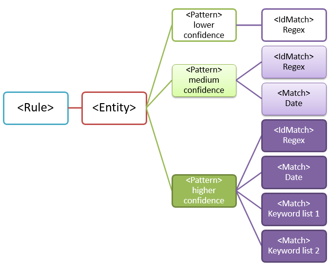
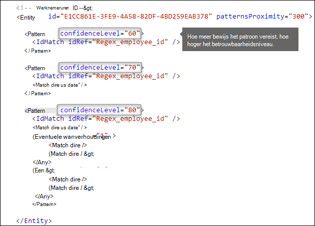

# <a name="create-a-custom-sensitive-information-type-using-powershell"></a><span data-ttu-id="7bebc-103">Een aangepast type voor vertrouwelijke gegevens maken met PowerShell</span><span class="sxs-lookup"><span data-stu-id="7bebc-103">Create a custom sensitive information type using PowerShell</span></span>

<span data-ttu-id="7bebc-104">In dit onderwerp leert u hoe u PowerShell kunt gebruiken om een XML-*regelpakket* bestand te maken waarin uw eigen aangepaste [typen voor vertrouwelijke gegevens](sensitive-information-type-entity-definitions.md) worden omschreven.</span><span class="sxs-lookup"><span data-stu-id="7bebc-104">This topic shows you how to use PowerShell to create an XML *rule package* file that defines your own custom [sensitive information types](sensitive-information-type-entity-definitions.md).</span></span> <span data-ttu-id="7bebc-105">U moet weten hoe u een normale expressie maakt.</span><span class="sxs-lookup"><span data-stu-id="7bebc-105">You need to know how to create a regular expression.</span></span> <span data-ttu-id="7bebc-106">Dit onderwerp maakt als voorbeeld een aangepast type voor vertrouwelijke gegevens dat een medewerkers-ID identificeert.</span><span class="sxs-lookup"><span data-stu-id="7bebc-106">As an example, this topic creates a custom sensitive information type that identifies an employee ID.</span></span> <span data-ttu-id="7bebc-107">U kunt dit voorbeeld-XML-bestand gebruiken als beginpunt voor uw eigen XML-bestand.</span><span class="sxs-lookup"><span data-stu-id="7bebc-107">You can use this example XML as a starting point for your own XML file.</span></span> <span data-ttu-id="7bebc-108">Zie [Meer informatie over typen voor vertrouwelijke gegevens](sensitive-information-type-learn-about.md) als typen voor vertrouwelijke gegevens nieuw voor u zijn.</span><span class="sxs-lookup"><span data-stu-id="7bebc-108">If you are new to sensitive information types, see [Learn about sensitive information types](sensitive-information-type-learn-about.md).</span></span>

<span data-ttu-id="7bebc-109">Nadat u een goed opgebouwd XML-bestand hebt gemaakt, kunt u het uploaden naar Microsoft 365 via Microsoft 365 PowerShell.</span><span class="sxs-lookup"><span data-stu-id="7bebc-109">After you've created a well-formed XML file, you can upload it to Microsoft 365 by using Microsoft 365 PowerShell.</span></span> <span data-ttu-id="7bebc-110">Vervolgens bent u er klaar voor om uw aangepaste type voor vertrouwelijke gegevens in uw beleid te gebruiken en te testen of de vertrouwelijke gegevens worden gedetecteerd zoal u wilt.</span><span class="sxs-lookup"><span data-stu-id="7bebc-110">Then you're ready to use your custom sensitive information type in your policies and test that it's detecting the sensitive information as you intended.</span></span>

> [!NOTE]
> <span data-ttu-id="7bebc-111">Als u geen behoefte hebt aan de fijngevoelige controle die PowerShell biedt, kunt u aangepaste typen voor vertrouwelijke gegevens maken in het compliancecentrum.</span><span class="sxs-lookup"><span data-stu-id="7bebc-111">If you don't need the fine grained control that PowerShell provides, you can create custom sensitive information types in the Compliance center.</span></span> <span data-ttu-id="7bebc-112">Zie [Een aangepast type voor vertrouwelijke gegevens maken](create-a-custom-sensitive-information-type.md) voor meer informatie.</span><span class="sxs-lookup"><span data-stu-id="7bebc-112">For more information, see [Create a custom sensitive information type](create-a-custom-sensitive-information-type.md).</span></span>

## <a name="important-disclaimer"></a><span data-ttu-id="7bebc-113">Belangrijke vrijwaring</span><span class="sxs-lookup"><span data-stu-id="7bebc-113">Important disclaimer</span></span>

<span data-ttu-id="7bebc-114">Vanwege de verschillende klantomgevingen en vereisten voor inhoud kan Microsoft-ondersteuning niet helpen door definities te bieden voor aangepaste inhoudsovereenkomsten, zoals bijvoorbeeld aangepaste classificaties of normale expressiepatronen (ook wel RegEx genoemd) definiëren.</span><span class="sxs-lookup"><span data-stu-id="7bebc-114">Due to the variances in customer environments and content match requirements, Microsoft Support cannot assist in providing custom content-matching definitions; e.g., defining custom classifications or regular expression (also known as RegEx) patterns.</span></span> <span data-ttu-id="7bebc-115">Voor de ontwikkeling, het testen en de foutopsporing van inhoudsovereenkomsten moeten Microsoft 365-klanten vertrouwen op interne IT-bronnen of een externe bron gebruiken, zoals MCS (Microsoft Consulting Services).</span><span class="sxs-lookup"><span data-stu-id="7bebc-115">For custom content-matching development, testing, and debugging, Microsoft 365 customers will need to rely upon internal IT resources, or use an external consulting resource such as Microsoft Consulting Services (MCS).</span></span> <span data-ttu-id="7bebc-116">Ondersteuningstechnici kunnen beperkte ondersteuning bieden voor de functie, maar niet garanderen dat de ontwikkeling van aangepaste inhoudsovereenkomsten voldoet aan de vereisten of verplichtingen van de klant.</span><span class="sxs-lookup"><span data-stu-id="7bebc-116">Support engineers can provide limited support for the feature, but cannot provide assurances that any custom content-matching development will fulfill the customer's requirements or obligations.</span></span>  <span data-ttu-id="7bebc-117">Als voorbeeld van het soort ondersteuning dat kan worden geboden, kunnen voor testdoeleinden voorbeelden van normale expressiepatronen worden aangeboden.</span><span class="sxs-lookup"><span data-stu-id="7bebc-117">As an example of the type of support that can be provided, sample regular expression patterns may be provided for testing purposes.</span></span> <span data-ttu-id="7bebc-118">Of de ondersteuning kan helpen bij het oplossen van problemen met een bestaand RegEx-patroon dat niet zoals verwacht wordt geactiveerd met een enkel voorbeeld met specifieke inhoud.</span><span class="sxs-lookup"><span data-stu-id="7bebc-118">Or, support can assist with troubleshooting an existing RegEx pattern which is not triggering as expected with a single specific content example.</span></span>

<span data-ttu-id="7bebc-119">Zie [Mogelijke validatieproblemen om rekening mee te houden](#potential-validation-issues-to-be-aware-of) in dit onderwerp.</span><span class="sxs-lookup"><span data-stu-id="7bebc-119">See [Potential validation issues to be aware of](#potential-validation-issues-to-be-aware-of) in this topic.</span></span>

<span data-ttu-id="7bebc-120">Zie [Boost.Regex 5.1.3](https://www.boost.org/doc/libs/1_68_0/libs/regex/doc/html/) voor meer informatie over de engine Boost.RegEx (voorheen bekend als RegEx++) die wordt gebruikt voor het verwerken van tekst.</span><span class="sxs-lookup"><span data-stu-id="7bebc-120">For more information about the Boost.RegEx (formerly known as RegEx++) engine that's used for processing the text, see [Boost.Regex 5.1.3](https://www.boost.org/doc/libs/1_68_0/libs/regex/doc/html/).</span></span>

## <a name="sample-xml-of-a-rule-package"></a><span data-ttu-id="7bebc-121">Voorbeeld-XML van een regelpakket</span><span class="sxs-lookup"><span data-stu-id="7bebc-121">Sample XML of a rule package</span></span>

<span data-ttu-id="7bebc-122">Dit is de voorbeeld-XML van het regelpakket dat we in dit onderwerp gaan maken.</span><span class="sxs-lookup"><span data-stu-id="7bebc-122">Here's the sample XML of the rule package that we'll create in this topic.</span></span> <span data-ttu-id="7bebc-123">In onderstaande gedeelten worden elementen en kenmerken uitgelegd.</span><span class="sxs-lookup"><span data-stu-id="7bebc-123">Elements and attributes are explained in the sections below.</span></span>
  
```xml
<?xml version="1.0" encoding="UTF-16"?>
<RulePackage xmlns="http://schemas.microsoft.com/office/2011/mce">
<RulePack id="DAD86A92-AB18-43BB-AB35-96F7C594ADAA">
    <Version build="0" major="1" minor="0" revision="0"/>
    <Publisher id="619DD8C3-7B80-4998-A312-4DF0402BAC04"/>
    <Details defaultLangCode="en-us">
        <LocalizedDetails langcode="en-us">
            <PublisherName>Contoso</PublisherName>
            <Name>Employee ID Custom Rule Pack</Name>
            <Description>
            This rule package contains the custom Employee ID entity.
            </Description>
        </LocalizedDetails>
    </Details>
</RulePack>
<Rules>
<!-- Employee ID -->
    <Entity id="E1CC861E-3FE9-4A58-82DF-4BD259EAB378" patternsProximity="300" recommendedConfidence="75">
        <Pattern confidenceLevel="65">
            <IdMatch idRef="Regex_employee_id"/>
        </Pattern>
        <Pattern confidenceLevel="75">
            <IdMatch idRef="Regex_employee_id"/>
            <Match idRef="Func_us_date"/>
        </Pattern>
        <Pattern confidenceLevel="85">
            <IdMatch idRef="Regex_employee_id"/>
            <Match idRef="Func_us_date"/>
            <Any minMatches="1">
                <Match idRef="Keyword_badge" minCount="2"/>
                <Match idRef="Keyword_employee"/>
            </Any>
            <Any minMatches="0" maxMatches="0">
                <Match idRef="Keyword_false_positives_local"/>
                <Match idRef="Keyword_false_positives_intl"/>
            </Any>
        </Pattern>
    </Entity>
    <Regex id="Regex_employee_id">(\s)(\d{9})(\s)</Regex>
    <Keyword id="Keyword_employee">
        <Group matchStyle="word">
            <Term>Identification</Term>
            <Term>Contoso Employee</Term>
        </Group>
    </Keyword>
    <Keyword id="Keyword_badge">
        <Group matchStyle="string">
            <Term>card</Term>
            <Term>badge</Term>
            <Term caseSensitive="true">ID</Term>
        </Group>
    </Keyword>
    <Keyword id="Keyword_false_positives_local">
        <Group matchStyle="word">
            <Term>credit card</Term>
            <Term>national ID</Term>
        </Group>
    </Keyword>
    <Keyword id="Keyword_false_positives_intl">
        <Group matchStyle="word">
            <Term>identity card</Term>
            <Term>national ID</Term>
            <Term>EU debit card</Term>
        </Group>
    </Keyword>
    <LocalizedStrings>
        <Resource idRef="E1CC861E-3FE9-4A58-82DF-4BD259EAB378">
            <Name default="true" langcode="en-us">Employee ID</Name>
            <Description default="true" langcode="en-us">
            A custom classification for detecting Employee IDs.
            </Description>
            <Description default="false" langcode="de-de">
            Description for German locale.
            </Description>
        </Resource>
    </LocalizedStrings>
</Rules>
</RulePackage>
```

## <a name="what-are-your-key-requirements-rule-entity-pattern-elements"></a><span data-ttu-id="7bebc-124">Wat zijn uw belangrijkste vereisten?</span><span class="sxs-lookup"><span data-stu-id="7bebc-124">What are your key requirements?</span></span> <span data-ttu-id="7bebc-125">[Regel, Entiteit, Patroonelementen]</span><span class="sxs-lookup"><span data-stu-id="7bebc-125">[Rule, Entity, Pattern elements]</span></span>

<span data-ttu-id="7bebc-126">Voordat u begint is het handig om de basisstructuur van het XML-schema voor een regel te begrijpen en hoe u deze structuur kunt gebruiken om uw aangepaste type voor vertrouwelijke gegevens te definiëren, zodat u de juiste inhoud identificeert.</span><span class="sxs-lookup"><span data-stu-id="7bebc-126">Before you get started, it's helpful to understand the basic structure of the XML schema for a rule, and how you can use this structure to define your custom sensitive information type so that it will identify the right content.</span></span>
  
<span data-ttu-id="7bebc-127">Een regel definieert een of meer entiteiten (typen voor vertrouwelijke gegevens) en elke entiteit definieert een of meer patronen.</span><span class="sxs-lookup"><span data-stu-id="7bebc-127">A rule defines one or more entities (sensitive information types), and each entity defines one or more patterns.</span></span> <span data-ttu-id="7bebc-128">Een patroon is waar beleid naar zoekt bij het evalueren van inhoud als e-mail en documenten.</span><span class="sxs-lookup"><span data-stu-id="7bebc-128">A pattern is what a policy looks for when it evaluates content such as email and documents.</span></span>

<span data-ttu-id="7bebc-129">In dit onderwerp worden in XML regels beschouwd als de patronen die een entiteit bepalen, ook wel bekend als een type voor vertrouwelijke gegevens.</span><span class="sxs-lookup"><span data-stu-id="7bebc-129">In this topic, the XML markup uses rule to mean the patterns that define an entity, also known as a sensitive information type.</span></span> <span data-ttu-id="7bebc-130">Dus wanneer u in dit onderwerp een regel ziet, denk dan aan entiteit of type voor vertrouwelijke gegevens en niet aan voorwaarden en acties.</span><span class="sxs-lookup"><span data-stu-id="7bebc-130">So in this topic, when you see rule, think entity or sensitive information type, not conditions and actions.</span></span>
  
### <a name="simplest-scenario-entity-with-one-pattern"></a><span data-ttu-id="7bebc-131">Eenvoudigste scenario: entiteit met één patroon</span><span class="sxs-lookup"><span data-stu-id="7bebc-131">Simplest scenario: entity with one pattern</span></span>

<span data-ttu-id="7bebc-132">Hier volgt het eenvoudigste scenario.</span><span class="sxs-lookup"><span data-stu-id="7bebc-132">Here's the simplest scenario.</span></span> <span data-ttu-id="7bebc-133">U wilt dat uw beleid de inhoud identificeert die de medewerkers-ID, die bestaat uit negen cijfers, van uw organisatie bevat.</span><span class="sxs-lookup"><span data-stu-id="7bebc-133">You want your policy to identify content that contains your organization's employee ID, which is formatted as a nine-digit number.</span></span> <span data-ttu-id="7bebc-134">Het patroon verwijst dus naar een normale expressie in de regel die getallen met negen cijfers identificeert.</span><span class="sxs-lookup"><span data-stu-id="7bebc-134">So the pattern refers to a regular expression contained in the rule that identifies nine-digit numbers.</span></span> <span data-ttu-id="7bebc-135">Alle inhoud met een getal van negen cijfers voldoet aan het patroon.</span><span class="sxs-lookup"><span data-stu-id="7bebc-135">Any content containing a nine-digit number satisfies the pattern.</span></span>
  

  
<span data-ttu-id="7bebc-137">Hoewel het heel eenvoudig is, kan dit patroon veel fout-positieven identificeren door overeenkomende inhoud die een willekeurig negencijferig getal bevat dat niet noodzakelijkerwijs een medewerkers-ID is. </span><span class="sxs-lookup"><span data-stu-id="7bebc-137">However, while simple, this pattern may identify many false positives by matching content that contains any nine-digit number that is not necessarily an employee ID.</span></span>
  
### <a name="more-common-scenario-entity-with-multiple-patterns"></a><span data-ttu-id="7bebc-138">Vaker voorkomend scenario: entiteit met meerdere patronen</span><span class="sxs-lookup"><span data-stu-id="7bebc-138">More common scenario: entity with multiple patterns</span></span>

<span data-ttu-id="7bebc-139">Daarom is het gebruikelijker een entiteit te definiëren door meer dan één patroon te gebruiken, waarbij de patronen niet alleen de entiteit identificeren (zoals een negencijferig getal), maar ook ondersteunende gegevens (zoals een trefwoord of datum).</span><span class="sxs-lookup"><span data-stu-id="7bebc-139">For this reason, it's more common to define an entity by using more than one pattern, where the patterns identify supporting evidence (such as a keyword or date) in addition to the entity (such as a nine-digit number).</span></span>
  
<span data-ttu-id="7bebc-140">Als u de waarschijnlijkheid wilt vergroten om inhoud te identificeren die een medewerkers-ID bevat, kunt u een ander patroon definiëren dat naast het negencijferige getal ook een aanstellingsdatum bevat en nog een ander patroon dat zowel de aanstellingsdatum als een trefwoord (zoals 'medewerkers-ID') identificeert.</span><span class="sxs-lookup"><span data-stu-id="7bebc-140">For example, to increase the likelihood of identifying content that contains an employee ID, you can define another pattern that also identifies a hire date, and define yet another pattern that identifies both a hire date and a keyword (such as "employee ID"), in addition to the nine-digit number.</span></span>
  

  
<span data-ttu-id="7bebc-142">Er zitten een aantal belangrijke aspecten aan deze structuur:</span><span class="sxs-lookup"><span data-stu-id="7bebc-142">Note a couple of important aspects of this structure:</span></span>
  
- <span data-ttu-id="7bebc-143">Patronen die meer bewijs nodig hebben, hebben een hoger betrouwbaarheidsniveau.</span><span class="sxs-lookup"><span data-stu-id="7bebc-143">Patterns that require more evidence have a higher confidence level.</span></span> <span data-ttu-id="7bebc-144">Dit is handig, want wanneer u later dit type voor vertrouwelijke gegevens gebruikt in beleid kunt u meer beperkende acties gebruiken (zoals inhoud blokkeren) met alleen de overeenkomsten met een hogere betrouwbaarheid en minder beperkende acties (zoals het verzenden van een melding) bij overeenkomsten met een lagere betrouwbaarheid.</span><span class="sxs-lookup"><span data-stu-id="7bebc-144">This is useful because when you later use this sensitive information type in a policy, you can use more restrictive actions (such as block content) with only the higher-confidence matches, and you can use less restrictive actions (such as send notification) with the lower-confidence matches.</span></span>

- <span data-ttu-id="7bebc-145">De ondersteunende IdMatch- en trefferelementen verwijzen naar regexes en trefwoorden die onderliggende elementen zijn van het regelelement, niet het patroon.</span><span class="sxs-lookup"><span data-stu-id="7bebc-145">The supporting IdMatch and Match elements reference regexes and keywords that are actually children of the Rule element, not the Pattern.</span></span> <span data-ttu-id="7bebc-146">Deze ondersteunende elementen worden aangeduid door het patroon, maar opgenomen in de regel.</span><span class="sxs-lookup"><span data-stu-id="7bebc-146">These supporting elements are referenced by the Pattern but included in the Rule.</span></span> <span data-ttu-id="7bebc-147">Dit betekent dat naar een enkele definitie van een ondersteunend element, zoals een normale expressie of een lijst met trefwoorden, kan worden verwezen door meerdere entiteiten en patronen.</span><span class="sxs-lookup"><span data-stu-id="7bebc-147">This means that a single definition of a supporting element, like a regular expression or a keyword list, can be referenced by multiple entities and patterns.</span></span>

## <a name="what-entity-do-you-need-to-identify-entity-element-id-attribute"></a><span data-ttu-id="7bebc-148">Welke entiteit moet u identificeren?</span><span class="sxs-lookup"><span data-stu-id="7bebc-148">What entity do you need to identify?</span></span> <span data-ttu-id="7bebc-149">[Entiteitselement, ID-kenmerk]</span><span class="sxs-lookup"><span data-stu-id="7bebc-149">[Entity element, id attribute]</span></span>

<span data-ttu-id="7bebc-150">Een entiteit is een type voor vertrouwelijke gegevens, zoals een creditcardnummer, met een goed gedefinieerd patroon.</span><span class="sxs-lookup"><span data-stu-id="7bebc-150">An entity is a sensitive information type, such as a credit card number, that has a well-defined pattern.</span></span> <span data-ttu-id="7bebc-151">Elke entiteit heeft een unieke GUID als ID.</span><span class="sxs-lookup"><span data-stu-id="7bebc-151">Each entity has a unique GUID as its ID.</span></span>
  
### <a name="name-the-entity-and-generate-its-guid"></a><span data-ttu-id="7bebc-152">De entiteit een naam geven en de bijbehorende GUID genereren</span><span class="sxs-lookup"><span data-stu-id="7bebc-152">Name the entity and generate its GUID</span></span>

1. <span data-ttu-id="7bebc-153">Voeg in de XML-editor van uw keuze de regels en entiteitelementen toe.</span><span class="sxs-lookup"><span data-stu-id="7bebc-153">In your XML editor of choice, add the Rules and Entity elements.</span></span>
2. <span data-ttu-id="7bebc-154">Voeg een opmerking toe waarin de naam van uw aangepaste entiteit staat, in dit voorbeeld Medewerkers-ID.</span><span class="sxs-lookup"><span data-stu-id="7bebc-154">Add a comment that contains the name of your custom entity — in this example, Employee ID.</span></span> <span data-ttu-id="7bebc-155">Later zult u de entiteitsnaam toevoegen aan het gedeelte met gelokaliseerde tekenreeksen en verschijnt de naam in de UI wanneer u beleid maakt.</span><span class="sxs-lookup"><span data-stu-id="7bebc-155">Later, you'll add the entity name to the localized strings section, and that name is what appears in the UI when you create a policy.</span></span>
3. <span data-ttu-id="7bebc-156">Genereer een GUID voor uw entiteit.</span><span class="sxs-lookup"><span data-stu-id="7bebc-156">Generate a GUID for your entity.</span></span> <span data-ttu-id="7bebc-157">Er zijn verschillende manieren om GUID's te genereren, maar u kunt het eenvoudig in PowerShell doen door **[guid]::NewGuid()** te typen.</span><span class="sxs-lookup"><span data-stu-id="7bebc-157">There are several ways to generate GUIDs, but you can do it easily in PowerShell by typing **[guid]::NewGuid()**.</span></span> <span data-ttu-id="7bebc-158">Later voegt u ook de entiteits-GUID toe aan het gedeelte gelokaliseerde tekenreeksen.</span><span class="sxs-lookup"><span data-stu-id="7bebc-158">Later, you'll also add the entity GUID to the localized strings section.</span></span>
  

  
## <a name="what-pattern-do-you-want-to-match-pattern-element-idmatch-element-regex-element"></a><span data-ttu-id="7bebc-160">Welk patroon wilt u vergelijken?</span><span class="sxs-lookup"><span data-stu-id="7bebc-160">What pattern do you want to match?</span></span> <span data-ttu-id="7bebc-161">[Patroonelement, IdMatch-element. Regex-element]</span><span class="sxs-lookup"><span data-stu-id="7bebc-161">[Pattern element, IdMatch element, Regex element]</span></span>

<span data-ttu-id="7bebc-162">Het patroon bevat de lijst met waar het type voor vertrouwelijke gegevens naar zoekt.</span><span class="sxs-lookup"><span data-stu-id="7bebc-162">The pattern contains the list of what the sensitive information type is looking for.</span></span> <span data-ttu-id="7bebc-163">Dit kan regexes, trefwoorden en ingebouwde functies omvatten (die taken uitvoeren als het uitvoeren van regexes om datums of adressen te vinden).</span><span class="sxs-lookup"><span data-stu-id="7bebc-163">This can include regexes, keywords, and built-in functions (which perform tasks like running regexes to find dates or addresses).</span></span> <span data-ttu-id="7bebc-164">Typen voor vertrouwelijke gegevens kunnen meerdere patronen met unieke betrouwbaarheden.</span><span class="sxs-lookup"><span data-stu-id="7bebc-164">Sensitive information types can have multiple patterns with unique confidences.</span></span>
  
<span data-ttu-id="7bebc-165">Wat alle onderstaande patronen gemeen hebben is dat ze allemaal verwijzen naar dezelfde normale expressie die zoekt naar een negencijferig getal (\d{9}) omgeven door witruimte (\s)...</span><span class="sxs-lookup"><span data-stu-id="7bebc-165">What all of the below patterns have in common is that they all reference the same regular expression, which looks for a nine-digit number (\d{9}) surrounded by white space (\s) …</span></span> <span data-ttu-id="7bebc-166">(\s).</span><span class="sxs-lookup"><span data-stu-id="7bebc-166">(\s).</span></span> <span data-ttu-id="7bebc-167">Het element IdMatch verwijst naar deze normale expressie en de expressie is de algemene vereiste voor alle patronen die zoeken naar de entiteit Medewerkers-ID.</span><span class="sxs-lookup"><span data-stu-id="7bebc-167">This regular expression is referenced by the IdMatch element and is the common requirement for all patterns that look for the Employee ID entity.</span></span> <span data-ttu-id="7bebc-168">IdMatch is de aanduiding dat het patroon probeert te vinden, zoals Medewerkers-ID of creditcardnummer of burgerservicenummer.</span><span class="sxs-lookup"><span data-stu-id="7bebc-168">IdMatch is the identifier that the pattern is to trying to match, such as Employee ID or credit card number or social security number.</span></span> <span data-ttu-id="7bebc-169">Een patroonelement moet precies één IdMatch-element hebben.</span><span class="sxs-lookup"><span data-stu-id="7bebc-169">A Pattern element must have exactly one IdMatch element.</span></span>
  

  
<span data-ttu-id="7bebc-171">Wanneer aan de voorwaarden wordt voldaan, retourneert een patroon een telling en betrouwbaarheidsniveau die u kunt gebruiken in de voorwaarden in uw beleid.</span><span class="sxs-lookup"><span data-stu-id="7bebc-171">When satisfied, a pattern returns a count and confidence level, which you can use in the conditions in your policy.</span></span> <span data-ttu-id="7bebc-172">Wanneer u aan beleid een voorwaarde toevoegt voor de detectie van een type voor vertrouwelijke gegevens, kunt u de telling en het betrouwbaarheidsniveau bewerken, zoals hier wordt aangegeven.</span><span class="sxs-lookup"><span data-stu-id="7bebc-172">When you add a condition for detecting a sensitive information type to a policy, you can edit the count and confidence level as shown here.</span></span> <span data-ttu-id="7bebc-173">Het betrouwbaarheidsniveau (ook genaamd nauwkeurigheid van overeenkomst) wordt later in dit onderwerp uitgelegd.</span><span class="sxs-lookup"><span data-stu-id="7bebc-173">Confidence level (also called match accuracy) is explained later in this topic.</span></span>
  

  
<span data-ttu-id="7bebc-175">Wanneer u een normale expressie maakt, houd er dan rekening mee dat er potentiële problemen zijn waar u op moet letten.</span><span class="sxs-lookup"><span data-stu-id="7bebc-175">When you create your regular expression, keep in mind that there are potential issues to be aware of.</span></span> <span data-ttu-id="7bebc-176">Als u bijvoorbeeld een regex maakt en uploadt die te veel inhoud identificeert, kan dit van invloed zijn op de prestaties.</span><span class="sxs-lookup"><span data-stu-id="7bebc-176">For example, if you write and upload a regex that identifies too much content, this can impact performance.</span></span> <span data-ttu-id="7bebc-177">Zie [Mogelijke validatieproblemen om op te letten](#potential-validation-issues-to-be-aware-of) verderop voor meer informatie over deze potentiële problemen.</span><span class="sxs-lookup"><span data-stu-id="7bebc-177">To learn more about these potential issues, see the later section [Potential validation issues to be aware of](#potential-validation-issues-to-be-aware-of).</span></span>
  
## <a name="do-you-want-to-require-additional-evidence-match-element-mincount-attribute"></a><span data-ttu-id="7bebc-178">Wilt u aanvullend bewijs eisen?</span><span class="sxs-lookup"><span data-stu-id="7bebc-178">Do you want to require additional evidence?</span></span> <span data-ttu-id="7bebc-179">[Trefferelement, minCount-kenmerk]</span><span class="sxs-lookup"><span data-stu-id="7bebc-179">[Match element, minCount attribute]</span></span>

<span data-ttu-id="7bebc-180">Naast de IdMatch kan een patroon het trefferelement gebruiken om aanvullende ondersteunende gegevens te eisen, zoals een trefwoord, regex, datum of adres.</span><span class="sxs-lookup"><span data-stu-id="7bebc-180">In addition to the IdMatch, a pattern can use the Match element to require additional supporting evidence, such as a keyword, regex, date, or address.</span></span>
  
<span data-ttu-id="7bebc-181">Een patroon kan meerdere trefferelementen bevatten. Ze kunnen direct in het patroonelement worden opgenomen of gecombineerd door het Any-element te gebruiken.</span><span class="sxs-lookup"><span data-stu-id="7bebc-181">A Pattern can include multiple Match elements; they can be included directly in the Pattern element or combined by using the Any element.</span></span> <span data-ttu-id="7bebc-182">Trefferelementen worden gecombineerd door een impliciete AND-operator, er moet aan alle trefferelementen worden voldaan voordat het patroon overeenkomt.</span><span class="sxs-lookup"><span data-stu-id="7bebc-182">Match elements are joined by an implicit AND operator; all Match elements must be satisfied for the pattern to be matched.</span></span> <span data-ttu-id="7bebc-183">U kunt het Any-element gebruiken om AND- of OR-operatoren in te zetten (meer hierover in een later gedeelte).</span><span class="sxs-lookup"><span data-stu-id="7bebc-183">You can use the Any element to introduce AND or OR operators (more on that in a later section).</span></span>
  
<span data-ttu-id="7bebc-184">U kunt het optionele attribuut minCount gebruiken om op te geven hoeveel exemplaren van een overeenkomst moeten worden gevonden voor elk van de trefferelementen.</span><span class="sxs-lookup"><span data-stu-id="7bebc-184">You can use the optional minCount attribute to specify how many instances of a match need to be found for each of the Match elements.</span></span> <span data-ttu-id="7bebc-185">U kunt bijvoorbeeld specificeren dat pas aan een patroon wordt voldaan wanneer ten minste twee trefwoorden van een lijst met trefwoorden kunnen worden gevonden.</span><span class="sxs-lookup"><span data-stu-id="7bebc-185">For example, you can specify that a pattern is satisfied only when at least two keywords from a keyword list are found.</span></span>
  

  
### <a name="keywords-keyword-group-and-term-elements-matchstyle-and-casesensitive-attributes"></a><span data-ttu-id="7bebc-187">Trefwoorden [trefwoord, groep en termelementen, matchStyle en caseSensitive-attributen]</span><span class="sxs-lookup"><span data-stu-id="7bebc-187">Keywords [Keyword, Group, and Term elements, matchStyle and caseSensitive attributes]</span></span>

<span data-ttu-id="7bebc-188">Wanneer u vertrouwelijke gegevens identificeert, zoals een medewerkers-ID, wilt u vaak trefwoorden eisen als ondersteunende gegevens.</span><span class="sxs-lookup"><span data-stu-id="7bebc-188">When you identify sensitive information, like an employee ID, you often want to require keywords as corroborative evidence.</span></span> <span data-ttu-id="7bebc-189">Zo kunt u bijvoorbeeld naast het zoeken naar een negencijferig nummber, zoeken naar woorden als 'kaart', 'badge' of 'ID'.</span><span class="sxs-lookup"><span data-stu-id="7bebc-189">For example, in addition to matching a nine-digit number, you may want to look for words like "card", "badge", or "ID".</span></span> <span data-ttu-id="7bebc-190">Hiervoor gebruikt u het element Trefwoord.</span><span class="sxs-lookup"><span data-stu-id="7bebc-190">To do this, you use the Keyword element.</span></span> <span data-ttu-id="7bebc-191">Het element Trefwoord heeft een ID-attribuut waarnaar kan worden verwezen door meerdere trefferelementen in meerdere patronen of entiteiten.</span><span class="sxs-lookup"><span data-stu-id="7bebc-191">The Keyword element has an ID attribute that can be referenced by multiple Match elements in multiple patterns or entities.</span></span>
  
<span data-ttu-id="7bebc-192">Trefwoorden worden opgenomen als een lijst van Termelementen in een Groepselement.</span><span class="sxs-lookup"><span data-stu-id="7bebc-192">Keywords are included as a list of Term elements in a Group element.</span></span> <span data-ttu-id="7bebc-193">Het Groepselement heeft een kenmerk matchStyle met twee mogelijke waarden:</span><span class="sxs-lookup"><span data-stu-id="7bebc-193">The Group element has a matchStyle attribute with two possible values:</span></span>
  
- <span data-ttu-id="7bebc-194">**matchStyle="word"** een woordovereenkomst identificeert hele woorden omgeven door witruimte of andere scheidingstekens.</span><span class="sxs-lookup"><span data-stu-id="7bebc-194">**matchStyle="word"** Word match identifies whole words surrounded by white space or other delimiters.</span></span> <span data-ttu-id="7bebc-195">U moet altijd woord gebruiken tenzij u delen van woorden of woorden in Aziatische talen wilt vergelijken.</span><span class="sxs-lookup"><span data-stu-id="7bebc-195">You should always use word unless you need to match parts of words or match words in Asian languages.</span></span> 
    
- <span data-ttu-id="7bebc-196">**matchStyle="string"** een tekenreeksovereenkomst identificeert tekenreeksen, ongeacht waardoor ze worden omgeven.</span><span class="sxs-lookup"><span data-stu-id="7bebc-196">**matchStyle="string"** String match identifies strings no matter what they're surrounded by.</span></span> <span data-ttu-id="7bebc-197">'id' komt bijvoorbeeld overeen met 'bid' en 'idee'.</span><span class="sxs-lookup"><span data-stu-id="7bebc-197">For example, "id" will match "bid" and "idea".</span></span> <span data-ttu-id="7bebc-198">Gebruik alleen tekenreeks wanneer u Aziatische woorden moet vergelijken of als uw trefwoord deel kan uitmaken van andere tekenreeksen.</span><span class="sxs-lookup"><span data-stu-id="7bebc-198">Use string only when you need to match Asian words or if your keyword may be included as part of other strings.</span></span> 
    
<span data-ttu-id="7bebc-199">Tenslotte kunt u het kenmerk caseSensitive van het termelement gebruiken om op te geven dat de inhoud precies met het trefwoord moet overeenkomen, inclusief kleine en hoofdletters.</span><span class="sxs-lookup"><span data-stu-id="7bebc-199">Finally, you can use the caseSensitive attribute of the Term element to specify that the content must match the keyword exactly, including lower- and upper-case letters.</span></span>
  

  
### <a name="regular-expressions-regex-element"></a><span data-ttu-id="7bebc-201">Normale expressies [Regex-element]</span><span class="sxs-lookup"><span data-stu-id="7bebc-201">Regular expressions [Regex element]</span></span>

<span data-ttu-id="7bebc-202">In dit voorbeeld gebruikt de entiteit medewerkers-ID al het element IdMatch om te verwijzen naar een regex voor een patroon, een negencijferig getal omgeven door witruimte.</span><span class="sxs-lookup"><span data-stu-id="7bebc-202">In this example, the employee ID entity already uses the IdMatch element to reference a regex for the pattern — a nine-digit number surrounded by whitespace.</span></span> <span data-ttu-id="7bebc-203">Daarnaast kan een patroon een trefferelement gebruiken om te verwijzen naar een aanvullend regex-element om ondersteunende gegevens te identificeren, zoals een vijf- of negencijferig getal in de indeling van een Amerikaanse postcode.</span><span class="sxs-lookup"><span data-stu-id="7bebc-203">In addition, a pattern can use a Match element to reference an additional Regex element to identify corroborative evidence, such as a five- or nine-digit number in the format of a US zip code.</span></span>
  
### <a name="additional-patterns-such-as-dates-or-addresses-built-in-functions"></a><span data-ttu-id="7bebc-204">Aanvullende patronen, zoals datums of adressen [ingebouwde functies]</span><span class="sxs-lookup"><span data-stu-id="7bebc-204">Additional patterns such as dates or addresses [built-in functions]</span></span>

<span data-ttu-id="7bebc-205">Naast de ingebouwde typen voor vertrouwelijke gegevens, kunnen typen voor vertrouwelijke gegevens ook ingebouwde functies gebruiken die ondersteunende gegevens kunnen identificeren, zoals een Amerikaanse datum, Europese datum, vervaldatum of Amerikaans adres.</span><span class="sxs-lookup"><span data-stu-id="7bebc-205">In addition to the built-in sensitive information types, sensitive information types can also use built-in functions that can identify corroborative evidence such as a US date, EU date, expiration date, or US address.</span></span> <span data-ttu-id="7bebc-206">Microsoft 365 ondersteunt het uploaden van uw eigen aangepaste functies niet, maar wanneer u een aangepast type voor vertrouwelijke gegevens maakt, kan uw entiteit verwijzen naar de ingebouwde functies.</span><span class="sxs-lookup"><span data-stu-id="7bebc-206">Microsoft 365 does not support uploading your own custom functions, but when you create a custom sensitive information type, your entity can reference the built-in functions.</span></span>
  
<span data-ttu-id="7bebc-207">Een medewerkers-ID-badge heeft bijvoorbeeld een datum in dienst, dan kan deze aangepaste entiteit de ingebouwde functie gebruiken `Func_us_date`een datum identificeren in de indeling die normaliter in de VS wordt gebruikt.</span><span class="sxs-lookup"><span data-stu-id="7bebc-207">For example, an employee ID badge has a hire date on it, so this custom entity can use the built-in function  `Func_us_date` to identify a date in the format commonly used in the US.</span></span> 
  
<span data-ttu-id="7bebc-208">Zie [Doel van de DLP-functies](what-the-dlp-functions-look-for.md) voor meer informatie.</span><span class="sxs-lookup"><span data-stu-id="7bebc-208">For more information, see [What the DLP functions look for](what-the-dlp-functions-look-for.md).</span></span>
  

  
## <a name="different-combinations-of-evidence-any-element-minmatches-and-maxmatches-attributes"></a><span data-ttu-id="7bebc-210">Verschillende combinaties van bewijs [Any-element, minMatches- en maxMatches-kenmerken]</span><span class="sxs-lookup"><span data-stu-id="7bebc-210">Different combinations of evidence [Any element, minMatches and maxMatches attributes]</span></span>

<span data-ttu-id="7bebc-211">In een patroonelement worden alle IdMatch- en trefferelementen gecombineerd door een impliciete AND-operator, er moet aan alle voorwaarden worden voldaan voordat het patroon overeenkomt.</span><span class="sxs-lookup"><span data-stu-id="7bebc-211">In a Pattern element, all IdMatch and Match elements are joined by an implicit AND operator — all of the matches must be satisfied before the pattern can be satisfied.</span></span> <span data-ttu-id="7bebc-212">U kunt echter flexibelere overeenkomstlogica maken door het Any-element te gebruiken om trefferelementen te groeperen.</span><span class="sxs-lookup"><span data-stu-id="7bebc-212">However, you can create more flexible matching logic by using the Any element to group Match elements.</span></span> <span data-ttu-id="7bebc-213">U kunt bijvoorbeeld het Any-element gebruiken om alle, geen of een exacte subset van de onderliggende trefferelementen te vergelijken.</span><span class="sxs-lookup"><span data-stu-id="7bebc-213">For example, you can use the Any element to match all, none, or an exact subset of its children Match elements.</span></span>
  
<span data-ttu-id="7bebc-214">Het Any-element heeft optionele minMatches- en maxMatches-kenmerken die ukunt gebruiken om op te geven aan hoeveel van de onderliggende trefferelementen moet worden voldaan voordat het patroon overeenkomt.</span><span class="sxs-lookup"><span data-stu-id="7bebc-214">The Any element has optional minMatches and maxMatches attributes that you can use to define how many of the children Match elements must be satisfied before the pattern is matched.</span></span> <span data-ttu-id="7bebc-215">Houd er rekening mee dat deze kenmerken het aantal trefferelementen definiëren waaraan moet worden voldaan, niet het aantal exemplaren van bewijs dat wordt gevonden voor de overeenkomsten.</span><span class="sxs-lookup"><span data-stu-id="7bebc-215">Note that these attributes define the number of Match elements that must be satisfied, not the number of instances of evidence found for the matches.</span></span> <span data-ttu-id="7bebc-216">Om een minimaal aantal exemplaren op te geven voor een specifieke overeenkomst, zoals twee trefwoorden uit een lijst, gebruikt u het kenmerk minCount voor een trefferelement (zie hierboven).</span><span class="sxs-lookup"><span data-stu-id="7bebc-216">To define a minimum number of instances for a specific match, such as two keywords from a list, use the minCount attribute for a Match element (see above).</span></span>
  
### <a name="match-at-least-one-child-match-element"></a><span data-ttu-id="7bebc-217">Ten minste één overeenkomend onderliggend trefferlement</span><span class="sxs-lookup"><span data-stu-id="7bebc-217">Match at least one child Match element</span></span>

<span data-ttu-id="7bebc-218">Wanneer u wilt eisen dat er maar een minimaal aantal trefferelementen moet overeenkomen, kunt u het kenmerk minMatches gebruiken.</span><span class="sxs-lookup"><span data-stu-id="7bebc-218">If you want to require that only a minimum number of Match elements must be met, you can use the minMatches attribute.</span></span> <span data-ttu-id="7bebc-219">Deze trefferelementen worden in feite gecombineerd door een impliciete OR-operator.</span><span class="sxs-lookup"><span data-stu-id="7bebc-219">In effect, these Match elements are joined by an implicit OR operator.</span></span> <span data-ttu-id="7bebc-220">Aan dit Any-element wordt voldaan als een Amerikaanse datum of een trefwoord uit één van de lijsten wordt gevonden.</span><span class="sxs-lookup"><span data-stu-id="7bebc-220">This Any element is satisfied if a US-formatted date or a keyword from either list is found.</span></span>

```xml
<Any minMatches="1" >
     <Match idRef="Func_us_date" />
     <Match idRef="Keyword_employee" />
     <Match idRef="Keyword_badge" />
</Any>
```
    
### <a name="match-an-exact-subset-of-any-children-match-elements"></a><span data-ttu-id="7bebc-221">Een exact overeekomende subset van onderliggende trefferelementen </span><span class="sxs-lookup"><span data-stu-id="7bebc-221">Match an exact subset of any children Match elements</span></span>

<span data-ttu-id="7bebc-222">Als u wilt dat aan een exact aantal trefferelementen moet worden voldaan, kunt u minMatches en maxMatches op dezelfde waarde instellen.</span><span class="sxs-lookup"><span data-stu-id="7bebc-222">If you want to require that an exact number of Match elements must be met, you can set minMatches and maxMatches to the same value.</span></span> <span data-ttu-id="7bebc-223">Aan dit Any-element wordt alleen voldaan als precies één datum of trefwoord wordt gevonden, meer dan dat en het patroon komt niet overeen.</span><span class="sxs-lookup"><span data-stu-id="7bebc-223">This Any element is satisfied only if exactly one date or keyword is found — any more than that, and the pattern won't be matched.</span></span>

```xml
<Any minMatches="1" maxMatches="1" >
     <Match idRef="Func_us_date" />
     <Match idRef="Keyword_employee" />
     <Match idRef="Keyword_badge" />
</Any>
```
  
### <a name="match-none-of-children-match-elements"></a><span data-ttu-id="7bebc-224">Geen overeenkomende onderliggende trefferelementen</span><span class="sxs-lookup"><span data-stu-id="7bebc-224">Match none of children Match elements</span></span>

<span data-ttu-id="7bebc-225">Wanneer u wilt eisen dat er geen bepaald bewijs wordt gevonden om aan een patroon te voldoen, kunt u minMatches en maxMatches beide op 0 instellen.</span><span class="sxs-lookup"><span data-stu-id="7bebc-225">If you want to require the absence of specific evidence for a pattern to be satisfied, you can set both minMatches and maxMatches to 0.</span></span> <span data-ttu-id="7bebc-226">Dit kan handig zijn wanneer u een lijst met trefwoorden hebt of ander bewijs dat waarschijnlijk duidt op een fout-positief.</span><span class="sxs-lookup"><span data-stu-id="7bebc-226">This can be useful if you have a keyword list or other evidence that are likely to indicate a false positive.</span></span>
  
<span data-ttu-id="7bebc-227">De entiteit medewerkers-ID zoekt bijvoorbeeld naar het trefwoord 'kaart', omdat dat mogelijk naar 'ID-kaart' verwijst.</span><span class="sxs-lookup"><span data-stu-id="7bebc-227">For example, the employee ID entity looks for the keyword "card" because it might refer to an "ID card".</span></span> <span data-ttu-id="7bebc-228">Als kaart echter alleen voorkomt in 'bankkaart', betekent 'kaart' in deze inhoud waarschijnlijk niet 'ID-kaart'.</span><span class="sxs-lookup"><span data-stu-id="7bebc-228">However, if card appears only in the phrase "credit card", "card" in this content is unlikely to mean "ID card".</span></span> <span data-ttu-id="7bebc-229">U kunt dus 'bankkaart' toevoegen als trefwoord in een lijst met termen die u wilt uitsluiten om aan het patroon te voldoen.</span><span class="sxs-lookup"><span data-stu-id="7bebc-229">So you can add "credit card" as a keyword to a list of terms that you want to exclude from satisfying the pattern.</span></span>
  
```xml
<Any minMatches="0" maxMatches="0" >
    <Match idRef="Keyword_false_positives_local" />
    <Match idRef="Keyword_false_positives_intl" />
</Any>
```

### <a name="match-a-number-of-unique-terms"></a><span data-ttu-id="7bebc-230">Een aantal unieke overeenkomende termen</span><span class="sxs-lookup"><span data-stu-id="7bebc-230">Match a number of unique terms</span></span>

<span data-ttu-id="7bebc-231">Wanneer u een aantal unieke termen wilt vergelijken, gebruikt u de parameter *uniqueResults*, ingesteld op *waar*, zoals weergegeven in het volgende voorbeeld:</span><span class="sxs-lookup"><span data-stu-id="7bebc-231">If you want to match a number of unique terms, use the *uniqueResults* parameter, set to *true*, as shown in the following example:</span></span>

```xml
<Pattern confidenceLevel="75">
    <IdMatch idRef="Salary_Revision_terms" />
    <Match idRef=" Salary_Revision_ID " minCount="3" uniqueResults="true" />
</Pattern>
```

<span data-ttu-id="7bebc-232">In dit voorbeeld is een patroon gedefinieerd voor een salariswijziging die gebruikmaakt van ten minste drie unieke overeenkomsten.</span><span class="sxs-lookup"><span data-stu-id="7bebc-232">In this example, a pattern is defined for salary revision using at least three unique matches.</span></span> 
  
## <a name="how-close-to-the-entity-must-the-other-evidence-be-patternsproximity-attribute"></a><span data-ttu-id="7bebc-233">Hoe dicht bij de entiteit moet het andere bewijs zijn?</span><span class="sxs-lookup"><span data-stu-id="7bebc-233">How close to the entity must the other evidence be?</span></span> <span data-ttu-id="7bebc-234">[patternsProximity-attribuut]</span><span class="sxs-lookup"><span data-stu-id="7bebc-234">[patternsProximity attribute]</span></span>

<span data-ttu-id="7bebc-235">Uw type voor vertrouwelijke gegevens zoekt naar een patroon dat een medewerkers-ID vertegenwoordigt en als onderdeel van dat patroon zoekt het ook naar ondersteunende gegevens, zoals een trefwoord als 'ID'.</span><span class="sxs-lookup"><span data-stu-id="7bebc-235">Your sensitive information type is looking for a pattern that represents an employee ID, and as part of that pattern it's also looking for corroborative evidence like a keyword such as "ID".</span></span> <span data-ttu-id="7bebc-236">Het is logisch dat des te meer het bewijs overeenkomt, des te groter de kans is dat het patroon een medewerkers-ID is.</span><span class="sxs-lookup"><span data-stu-id="7bebc-236">It makes sense that the closer together this evidence is, the more likely the pattern is to be an actual employee ID.</span></span> <span data-ttu-id="7bebc-237">U kunt bepalen hoe dicht bij de entiteit het andere bewijs in het patroon moet zijn, door het vereiste attribuut patternsProximity van het entiteitselement te gebruiken.</span><span class="sxs-lookup"><span data-stu-id="7bebc-237">You can determine how close other evidence in the pattern must be to the entity by using the required patternsProximity attribute of the Entity element.</span></span>
  

  
<span data-ttu-id="7bebc-239">Voor elk patroon in de entiteit definieert de waarde van het attribuut patternsProximity de afstand (in Unicode-tekens) van de IdMatch-locatie voor alle andere overeenkomsten opgegeven voor dat patroon.</span><span class="sxs-lookup"><span data-stu-id="7bebc-239">For each pattern in the entity, the patternsProximity attribute value defines the distance (in Unicode characters) from the IdMatch location for all other Matches specified for that Pattern.</span></span> <span data-ttu-id="7bebc-240">De nabijheidsmarge is verankerd aan de IdMatch-locatie, waarbij de marge links en rechts van IdMatch kan worden uitgebreid.</span><span class="sxs-lookup"><span data-stu-id="7bebc-240">The proximity window is anchored by the IdMatch location, with the window extending to the left and right of the IdMatch.</span></span>
  

  
<span data-ttu-id="7bebc-242">Onderstaande voorbeeld toont hoe de nabijheidsmargevan invloed is op de manier waarop IdMatch-element voor de aangepaste entiteit medewerkers-ID ten minste één overeenkomst van trefwoord of datum vereist.</span><span class="sxs-lookup"><span data-stu-id="7bebc-242">The example below illustrates how the proximity window affects the pattern matching where IdMatch element for the employee ID custom entity requires at least one corroborating match of keyword or date.</span></span> <span data-ttu-id="7bebc-243">Alleen ID1 komt overeen, omdat voor ID2 en ID3 geen of alleen gedeeltelijk ondersteunende gegevens kunnen worden gevonden binnen de nabijheidsmarge.</span><span class="sxs-lookup"><span data-stu-id="7bebc-243">Only ID1 matches because for ID2 and ID3, either no or only partial corroborating evidence is found within the proximity window.</span></span>
  

  
<span data-ttu-id="7bebc-245">Houd er rekening mee dat voor e-mailberichten, het bericht zelf en elke bijlage als afzonderlijke items worden behandeld.</span><span class="sxs-lookup"><span data-stu-id="7bebc-245">Note that for email, the message body and each attachment are treated as separate items.</span></span> <span data-ttu-id="7bebc-246">Dit betekent dat de nabijheidsmarge niet wordt uitgebreid na het einde van elk van deze items.</span><span class="sxs-lookup"><span data-stu-id="7bebc-246">This means that the proximity window does not extend beyond the end of each of these items.</span></span> <span data-ttu-id="7bebc-247">Voor elk item (bijlage of bericht) moeten zowel de IdMatch en ondersteunende gegevens zich in dat item bevinden.</span><span class="sxs-lookup"><span data-stu-id="7bebc-247">For each item (attachment or body), both the idMatch and corroborative evidence needs to reside in that item.</span></span>
  
## <a name="what-are-the-right-confidence-levels-for-different-patterns-confidencelevel-attribute-recommendedconfidence-attribute"></a><span data-ttu-id="7bebc-248">Wat zijn de juiste betrouwbaarheidsniveaus voor verschillende patronen?</span><span class="sxs-lookup"><span data-stu-id="7bebc-248">What are the right confidence levels for different patterns?</span></span> <span data-ttu-id="7bebc-249">[confidenceLevel-attribuut, recommendedConfidence-attribuut]</span><span class="sxs-lookup"><span data-stu-id="7bebc-249">[confidenceLevel attribute, recommendedConfidence attribute]</span></span>

<span data-ttu-id="7bebc-250">Des te meer bewijs is vereist voor een patroon, des te betrouwbaarder het is dat een werkelijke entiteit (zoals medewerkers-ID) is geïdentificeerd wanneer het patroon overeenkomt.</span><span class="sxs-lookup"><span data-stu-id="7bebc-250">The more evidence that a pattern requires, the more confidence you have that an actual entity (such as employee ID) has been identified when the pattern is matched.</span></span> <span data-ttu-id="7bebc-251">U hebt bijvoorbeeld meer vertrouwen in een patroon dat een negencijferig ID-nummer, datum in dienst en trefwoord dicht bij elkaar vereist, dan in een patroon dat alleen een negencijferig ID-nummer vereist.</span><span class="sxs-lookup"><span data-stu-id="7bebc-251">For example, you have more confidence in a pattern that requires a nine-digit ID number, hire date, and keyword in close proximity, than you do in a pattern that requires only a nine-digit ID number.</span></span>
  
<span data-ttu-id="7bebc-252">Het patroonelement heeft een vereist kenmerk confidenceLevel.</span><span class="sxs-lookup"><span data-stu-id="7bebc-252">The Pattern element has a required confidenceLevel attribute.</span></span> <span data-ttu-id="7bebc-253">U kunt de waarde van confidenceLevel (een integer tussen 1 en 100) beschouwen als een uniek ID voor elk patroon in een entitei. De patronen in een entiteit moeten verschillende betrouwbaarheidsniveaus hebben die u toewijst.</span><span class="sxs-lookup"><span data-stu-id="7bebc-253">You can think of the value of confidenceLevel (an integer between 1 and 100) as a unique ID for each pattern in an entity — the patterns in an entity must have different confidence levels that you assign.</span></span> <span data-ttu-id="7bebc-254">De exacte waarde van de integer maakt niet uit, kies eenvoudig nummers die logisch zijn voor uw nalevingsteam.</span><span class="sxs-lookup"><span data-stu-id="7bebc-254">The precise value of the integer doesn't matter — simply pick numbers that make sense to your compliance team.</span></span> <span data-ttu-id="7bebc-255">Nadat u uw aangepaste type vertrouwelijke gegevens hebt geüpload en daarna beleid hebt gemaakt, kunt u naar deze betrouwbaarheidsniveaus verwijzen in de voorwaarden van de regels die u maakt.</span><span class="sxs-lookup"><span data-stu-id="7bebc-255">After you upload your custom sensitive information type and then create a policy, you can reference these confidence levels in the conditions of the rules that you create.</span></span>
  

  
<span data-ttu-id="7bebc-257">Naast confidenceLevel voor elk patroon heeft de entiteit ook een kenmerk recommendedConfidence.</span><span class="sxs-lookup"><span data-stu-id="7bebc-257">In addition to confidenceLevel for each Pattern, the Entity has a recommendedConfidence attribute.</span></span> <span data-ttu-id="7bebc-258">Het kenmerk recommendedConfidence kan worden beschouwd als het standaardbetrouwbaarheidsniveau voor de regel.</span><span class="sxs-lookup"><span data-stu-id="7bebc-258">The recommended confidence attribute can be thought of as the default confidence level for the rule.</span></span> <span data-ttu-id="7bebc-259">Wanneer u een beleidsregel maakt, vergelijkt de regel op basis van het aanbevolen betrouwbaarheidsniveau voor de entiteit, tenzij u een betrouwbaarheidsniveau voor de regel opgeeft.</span><span class="sxs-lookup"><span data-stu-id="7bebc-259">When you create a rule in a policy, if you don't specify a confidence level for the rule to use, that rule will match based on the recommended confidence level for the entity.</span></span> <span data-ttu-id="7bebc-260">Houd er rekening mee dat het kenmerk recommendedConfidence verplicht is voor elke entiteits-ID in het regelpakket. Als het kenmerk ontbreekt, kunt u geen beleid opslaan dat gebruikmaakt van het type vertrouwelijke gegevens.</span><span class="sxs-lookup"><span data-stu-id="7bebc-260">Please note that the recommendedConfidence attribute is mandatory for each Entity ID in the Rule Package, if missing you won't be able to save policies that use the Sensitive Information Type.</span></span> 
  
## <a name="do-you-want-to-support-other-languages-in-the-ui-of-the-compliance-center-localizedstrings-element"></a><span data-ttu-id="7bebc-261">Wilt u andere talen ondersteunen in de gebruikersinterface van het compliancecentrum?</span><span class="sxs-lookup"><span data-stu-id="7bebc-261">Do you want to support other languages in the UI of the Compliance center?</span></span> <span data-ttu-id="7bebc-262">[LocalizedStrings-element]</span><span class="sxs-lookup"><span data-stu-id="7bebc-262">[LocalizedStrings element]</span></span>

<span data-ttu-id="7bebc-263">Als uw complianceteam het Microsoft 365-compliancecentrum gebruikt om beleid in verschillende landen en talen te maken, kunt u gelokaliseerde versies van de naam en beschrijving van uw aangepaste type vertrouwelijke gegevens geven.</span><span class="sxs-lookup"><span data-stu-id="7bebc-263">If your compliance team uses the Microsoft 365 Compliance center to create polices policies in different locales and in different languages, you can provide localized versions of the name and description of your custom sensitive information type.</span></span> <span data-ttu-id="7bebc-264">Wanneer uw complianceteam Microsoft 365 gebruikt in een taal die u ondersteunt, zien ze de gelokaliseerde naam in de gebruikersinterface.</span><span class="sxs-lookup"><span data-stu-id="7bebc-264">When your compliance team uses Microsoft 365 in a language that you support, they'll see the localized name in the UI.</span></span>
  

  
<span data-ttu-id="7bebc-266">Het element regels moet een LocalizedStrings-element bevatten, dat een Resource-element bevat dat verwijst naar de GUID van uw aangepaste entiteit.</span><span class="sxs-lookup"><span data-stu-id="7bebc-266">The Rules element must contain a LocalizedStrings element, which contains a Resource element that references the GUID of your custom entity.</span></span> <span data-ttu-id="7bebc-267">Elk Resource-element bevat een of meer Naam- en Beschrijving-elementen die elk het kenmerk taalcode gebruiken om een gelokaliseerde tekenreeks te geven voor een specifieke taal.</span><span class="sxs-lookup"><span data-stu-id="7bebc-267">In turn, each Resource element contains one or more Name and Description elements that each use the langcode attribute to provide a localized string for a specific language.</span></span>
  

  
<span data-ttu-id="7bebc-269">Houd er rekening mee dat u gelokaliseerde tekenreeksen alleen gebruikt om te bepalen hoe uw aangepaste type vertrouwelijke gegevens wordt weergegeven in de gebruikersinterface van het compliancecentrum.</span><span class="sxs-lookup"><span data-stu-id="7bebc-269">Note that you use localized strings only for how your custom sensitive information type appears in the UI of the Compliance center.</span></span> <span data-ttu-id="7bebc-270">U kunt gelokaliseerde tekenreeksen niet gebruiken om verschillende gelokaliseerde versies van een lijst trefwoorden of normale expressie te bieden.</span><span class="sxs-lookup"><span data-stu-id="7bebc-270">You can't use localized strings to provide different localized versions of a keyword list or regular expression.</span></span>
  
## <a name="other-rule-package-markup-rulepack-guid"></a><span data-ttu-id="7bebc-271">Ander regelpakket [RulePack GUID]</span><span class="sxs-lookup"><span data-stu-id="7bebc-271">Other rule package markup [RulePack GUID]</span></span>

<span data-ttu-id="7bebc-272">Ten slotte bevat het begin van elk RulePackage algemene gegevens die u moet invullen.</span><span class="sxs-lookup"><span data-stu-id="7bebc-272">Finally, the beginning of each RulePackage contains some general information that you need to fill in.</span></span> <span data-ttu-id="7bebc-273">U kunt de volgende tekst gebruiken als sjabloon en de " </span><span class="sxs-lookup"><span data-stu-id="7bebc-273">You can use the following markup as a template and replace the ".</span></span> <span data-ttu-id="7bebc-274">.</span><span class="sxs-lookup"><span data-stu-id="7bebc-274">.</span></span> <span data-ttu-id="7bebc-275">."</span><span class="sxs-lookup"><span data-stu-id="7bebc-275">."</span></span> <span data-ttu-id="7bebc-276">vervangen met tijdelijke aanduidingen met uw eigen gegevens.</span><span class="sxs-lookup"><span data-stu-id="7bebc-276">placeholders with your own info.</span></span>
  
<span data-ttu-id="7bebc-277">Het belangrijkste is dat u een GUID moet genereren voor het RulePack.</span><span class="sxs-lookup"><span data-stu-id="7bebc-277">Most importantly, you'll need to generate a GUID for the RulePack.</span></span> <span data-ttu-id="7bebc-278">Hierboven hebt u een GUID gegenereerd voor de entiteit, dit is een tweede GUID voor het RulePack.</span><span class="sxs-lookup"><span data-stu-id="7bebc-278">Above, you generated a GUID for the entity; this is a second GUID for the RulePack.</span></span> <span data-ttu-id="7bebc-279">Er zijn verschillende manieren om GUID's te genereren, maar u kunt het eenvoudig in PowerShell doen door [guid]::NewGuid() te typen.</span><span class="sxs-lookup"><span data-stu-id="7bebc-279">There are several ways to generate GUIDs, but you can do it easily in PowerShell by typing [guid]::NewGuid().</span></span>
  
<span data-ttu-id="7bebc-280">Het element Versie is ook belangrijk.</span><span class="sxs-lookup"><span data-stu-id="7bebc-280">The Version element is also important.</span></span> <span data-ttu-id="7bebc-281">WAnneer u uw regelpakket de eerste keer upload, wordt in Microsoft 365 het versienummer genoteerd.</span><span class="sxs-lookup"><span data-stu-id="7bebc-281">When you upload your rule package for the first time, Microsoft 365 notes the version number.</span></span> <span data-ttu-id="7bebc-282">Later, wanneer u het regelpakket bijwerkt en een nieuwe versie uploadt, zorg er dan voor dat u het versienummer bijwerkt, anders implementeert Microsoft 365 het regelpakket niet.</span><span class="sxs-lookup"><span data-stu-id="7bebc-282">Later, if you update the rule package and upload a new version, make sure to update the version number or Microsoft 365 won't deploy the rule package.</span></span>
  
```xml
<?xml version="1.0" encoding="utf-16"?>
<RulePackage xmlns="http://schemas.microsoft.com/office/2011/mce">
  <RulePack id=". . .">
    <Version major="1" minor="0" build="0" revision="0" />
    <Publisher id=". . ." /> 
    <Details defaultLangCode=". . .">
      <LocalizedDetails langcode=" . . . ">
         <PublisherName>. . .</PublisherName>
         <Name>. . .</Name>
         <Description>. . .</Description>
      </LocalizedDetails>
    </Details>
  </RulePack>
  
 <Rules>
    . . .
 </Rules>
</RulePackage>

```

<span data-ttu-id="7bebc-283">Wanneer het klaar is, zou uw RulePack-element er als volgt uit moeten zien.</span><span class="sxs-lookup"><span data-stu-id="7bebc-283">When complete, your RulePack element should look like this.</span></span>
  

  
## <a name="changes-for-exchange-online"></a><span data-ttu-id="7bebc-285">Wijzigingen voor Exchange Online</span><span class="sxs-lookup"><span data-stu-id="7bebc-285">Changes for Exchange Online</span></span>

<span data-ttu-id="7bebc-286">Voorheen gebruikte u mogelijk Exchange Online PowerShell om uw aangepaste typen vertrouwelijke gegevens voor DLP te importeren.</span><span class="sxs-lookup"><span data-stu-id="7bebc-286">Previously, you might have used Exchange Online PowerShell to import your custom sensitive information types for DLP.</span></span> <span data-ttu-id="7bebc-287">Nu kunnen uw typen vertrouwelijke gegevens worden gebruikt in zowel het Exchange-beheercentrum als het compliancecentrum.</span><span class="sxs-lookup"><span data-stu-id="7bebc-287">Now your custom sensitive information types can be used in both the Exchange admin center and the Compliance center.</span></span> <span data-ttu-id="7bebc-288">Als onderdeel van deze verbetering moet u compliancecentrum PowerShell gebruiken om uw aangepaste typen vertrouwelijke gegevens te importeren, u kunt ze niet meer importeren vanuit Exchange PowerShell.</span><span class="sxs-lookup"><span data-stu-id="7bebc-288">As part of this improvement, you should use Compliance center PowerShell to import your custom sensitive information types — you can't import them from the Exchange PowerShell anymore.</span></span> <span data-ttu-id="7bebc-289">Uw aangepaste typen vertrouwelijke gegevens blijven gewoon werken als voorheen, het kan echter maximaal een uur duren voordat wijzigingen die zijn aangebracht aan typen vertrouwelijke gegevens in het compliancecentrum verschijnen in het Exchange-beheercentrum.</span><span class="sxs-lookup"><span data-stu-id="7bebc-289">Your custom sensitive information types will continue to work just like before; however, it may take up to one hour for changes made to custom sensitive information types in the Compliance center to appear in the Exchange admin center.</span></span>
  
<span data-ttu-id="7bebc-290">Houd er rekening mee dat u in het compliancecentrum de cmdlet **[New-DlpSensitiveInformationTypeRulePackage](/powershell/module/exchange/new-dlpsensitiveinformationtyperulepackage)** gebruikt om een regelpakket te uploaden.</span><span class="sxs-lookup"><span data-stu-id="7bebc-290">Note that in the Compliance center, you use the **[New-DlpSensitiveInformationTypeRulePackage](/powershell/module/exchange/new-dlpsensitiveinformationtyperulepackage)** cmdlet to upload a rule package.</span></span> <span data-ttu-id="7bebc-291">(Voorheen in het Exchange-beheercentrum gebruikte u de cmdlet **ClassificationRuleCollection**.)</span><span class="sxs-lookup"><span data-stu-id="7bebc-291">(Previously, in the Exchange admin center, you used the  **ClassificationRuleCollection**\` cmdlet.)</span></span> 
  
## <a name="upload-your-rule-package"></a><span data-ttu-id="7bebc-292">Uw regelpakket uploaden</span><span class="sxs-lookup"><span data-stu-id="7bebc-292">Upload your rule package</span></span>


<span data-ttu-id="7bebc-293">Om uw regelpakket te uploaden, moet u de volgende stappen uitvoeren:</span><span class="sxs-lookup"><span data-stu-id="7bebc-293">To upload your rule package, do the following steps:</span></span>
  
1. <span data-ttu-id="7bebc-294">Het pakket opslaan als .XML-bestand met Unicode-codering.</span><span class="sxs-lookup"><span data-stu-id="7bebc-294">Save it as an .xml file with Unicode encoding.</span></span>
    
2. [<span data-ttu-id="7bebc-295">Verbinding maken met compliancecentrum PowerShell</span><span class="sxs-lookup"><span data-stu-id="7bebc-295">Connect to Compliance center PowerShell</span></span>](/powershell/exchange/exchange-online-powershell)
    
3. <span data-ttu-id="7bebc-296">Gebruik de volgende syntaxis:</span><span class="sxs-lookup"><span data-stu-id="7bebc-296">Use the following syntax:</span></span>

   ```powershell
   New-DlpSensitiveInformationTypeRulePackage -FileData (Get-Content -Path "PathToUnicodeXMLFile" -Encoding Byte -ReadCount 0)
   ```

   <span data-ttu-id="7bebc-297">In dit voorbeeld wordt het Unicode XML-bestand met de naam MyNewRulePack.xml geüpload vanaf C:\Mijn documenten.</span><span class="sxs-lookup"><span data-stu-id="7bebc-297">This example uploads the Unicode XML file named MyNewRulePack.xml from C:\My Documents.</span></span>

   ```powershell
   New-DlpSensitiveInformationTypeRulePackage -FileData (Get-Content -Path "C:\My Documents\MyNewRulePack.xml" -Encoding Byte -ReadCount 0)
   ```

   <span data-ttu-id="7bebc-298">Zie [New-DlpSensitiveInformationTypeRulePackage](/powershell/module/exchange/new-dlpsensitiveinformationtyperulepackage) voor meer gedetailleerde syntaxis- en parameterinformatie.</span><span class="sxs-lookup"><span data-stu-id="7bebc-298">For detailed syntax and parameter information, see [New-DlpSensitiveInformationTypeRulePackage](/powershell/module/exchange/new-dlpsensitiveinformationtyperulepackage).</span></span>

   > [!NOTE]
   > <span data-ttu-id="7bebc-299">Er worden maximaal 10 regelpakketten ondersteund, maar ieder pakket kan de definitie van meerdere typen vertrouwelijke gegevens bevatten.</span><span class="sxs-lookup"><span data-stu-id="7bebc-299">The maximum number of rule packages supported is 10, but each package can contain the definition of multiple sensitive information types.</span></span>

4. <span data-ttu-id="7bebc-300">Voer een van de volgende stappen uit om er zeker van te zijn dat u een nieuw type vertrouwelijke gegevens hebt gemaakt:</span><span class="sxs-lookup"><span data-stu-id="7bebc-300">To verify that you've successfully created a new sensitive information type, do any of the following steps:</span></span>

   - <span data-ttu-id="7bebc-301">Voer de cmdlet [Get-DlpSensitiveInformationTypeRulePackage](/powershell/module/exchange/get-dlpsensitiveinformationtyperulepackage) uit om te verifiëren dat het nieuwe regelpakket op de lijst wordt vermeld:</span><span class="sxs-lookup"><span data-stu-id="7bebc-301">Run the [Get-DlpSensitiveInformationTypeRulePackage](/powershell/module/exchange/get-dlpsensitiveinformationtyperulepackage) cmdlet to verify the new rule package is listed:</span></span>

     ```powershell
     Get-DlpSensitiveInformationTypeRulePackage
     ``` 

   - <span data-ttu-id="7bebc-302">Voer de cmdlet [Get-DlpSensitiveInformationType](/powershell/module/exchange/get-dlpsensitiveinformationtype) uit om te verifiëren dat het nieuwe regelpakket op de lijst wordt vermeld:</span><span class="sxs-lookup"><span data-stu-id="7bebc-302">Run the [Get-DlpSensitiveInformationType](/powershell/module/exchange/get-dlpsensitiveinformationtype) cmdlet to verify the sensitive information type is listed:</span></span>

     ```powershell
     Get-DlpSensitiveInformationType
     ``` 

     <span data-ttu-id="7bebc-303">Voor aangepaste typen vertrouwelijke gegevens wordt de waarde van de eigenschap Uitgever iets anders dan Microsoft Corporation.</span><span class="sxs-lookup"><span data-stu-id="7bebc-303">For custom sensitive information types, the Publisher property value will be something other than Microsoft Corporation.</span></span>

   - <span data-ttu-id="7bebc-304">Vervang \<Name\> met de Naamwaarde van het type vertrouwelijke gegevens (bijvoorbeeld: Medewerkers-ID) en voer de cmdlet [Get-DlpSensitiveInformationType](/powershell/module/exchange/get-dlpsensitiveinformationtype) uit:</span><span class="sxs-lookup"><span data-stu-id="7bebc-304">Replace \<Name\> with the Name value of the sensitive information type (example: Employee ID) and run the [Get-DlpSensitiveInformationType](/powershell/module/exchange/get-dlpsensitiveinformationtype) cmdlet:</span></span>

     ```powershell
     Get-DlpSensitiveInformationType -Identity "<Name>"
     ```
    
## <a name="potential-validation-issues-to-be-aware-of"></a><span data-ttu-id="7bebc-305">Mogelijke validatieproblemen om rekening mee te houden</span><span class="sxs-lookup"><span data-stu-id="7bebc-305">Potential validation issues to be aware of</span></span>

<span data-ttu-id="7bebc-306">Wanneer u uw regelpakket-XML-bestand uploadt, wordt door het systeem de XML gevalideerd en gecontroleerd op bekende onjuiste patronen en voor de hand liggende prestatieproblemen.</span><span class="sxs-lookup"><span data-stu-id="7bebc-306">When you upload your rule package XML file, the system validates the XML and checks for known bad patterns and obvious performance issues.</span></span> <span data-ttu-id="7bebc-307">Hier zijn een aantal bekende problemen waar de validatie op controleert, een normale expressie:</span><span class="sxs-lookup"><span data-stu-id="7bebc-307">Here are some known issues that the validation checks for — a regular expression:</span></span>
  
- <span data-ttu-id="7bebc-308">mag niet beginnen of eindigen met een "|" die overeenkomt met alles, omdat het wordt beschouwd als lege overeenkomst.</span><span class="sxs-lookup"><span data-stu-id="7bebc-308">Cannot begin or end with alternator "|", which matches everything because it's considered an empty match.</span></span>
    
  <span data-ttu-id="7bebc-309">Bijvoorbeeld: "|a" of "|b" komt niet door de validatie.</span><span class="sxs-lookup"><span data-stu-id="7bebc-309">For example, "|a" or "b|" will not pass validation.</span></span>
    
- <span data-ttu-id="7bebc-310">mag niet beginnen of eindigen met een ".{0,}"-patroon dat geen functioneel doel heeft en alleen de prestatie nadelig beïnvloedt.</span><span class="sxs-lookup"><span data-stu-id="7bebc-310">Cannot begin or end with a ".{0,m}" pattern, which has no functional purpose and only impairs performance.</span></span>
    
  <span data-ttu-id="7bebc-311">Bijvoorbeeld: ".{0,50}ASDF" or "ASDF.{0,50}" komt niet door de validatie.</span><span class="sxs-lookup"><span data-stu-id="7bebc-311">For example, ".{0,50}ASDF" or "ASDF.{0,50}" will not pass validation.</span></span>
    
- <span data-ttu-id="7bebc-312">mag geen ".{0,m}" of ".{1,m}" in groepen hebben en geen ".\*" or ".+" in groepen.</span><span class="sxs-lookup"><span data-stu-id="7bebc-312">Cannot have ".{0,m}" or ".{1,m}" in groups, and cannot have ".\*" or ".+" in groups.</span></span>
    
  <span data-ttu-id="7bebc-313">Bijvoorbeeld: "(.{0,50000})" komt niet door de validatie.</span><span class="sxs-lookup"><span data-stu-id="7bebc-313">For example, "(.{0,50000})" will not pass validation.</span></span>
    
- <span data-ttu-id="7bebc-314">mag geen tekens hebben met "{0,m}"- of "{1,m}"-herhalingen in groepen. </span><span class="sxs-lookup"><span data-stu-id="7bebc-314">Cannot have any character with "{0,m}" or "{1,m}" repeaters in groups.</span></span>
    
  <span data-ttu-id="7bebc-315">Bijvoorbeeld: "(a\*)" komt niet door de validatie.</span><span class="sxs-lookup"><span data-stu-id="7bebc-315">For example, "(a\*)" will not pass validation.</span></span>
    
- <span data-ttu-id="7bebc-316">mag niet beginnen of eindigen met ".{1,m}", gebruik hiervoor in de plaats gewoon "."</span><span class="sxs-lookup"><span data-stu-id="7bebc-316">Cannot begin or end with ".{1,m}"; instead, use just "."</span></span>
    
  <span data-ttu-id="7bebc-317">Bijvoorbeeld: ".{1,m}asdf" komt niet door de validatie, gebruik in plaats daarvan ".asdf".</span><span class="sxs-lookup"><span data-stu-id="7bebc-317">For example, ".{1,m}asdf" will not pass validation; instead, use just ".asdf".</span></span>
    
- <span data-ttu-id="7bebc-318">mag geen onafhankelijke herhaling (zoals "\*" of "+") hebben in een groep.</span><span class="sxs-lookup"><span data-stu-id="7bebc-318">Cannot have an unbounded repeater (such as "\*" or "+") on a group.</span></span>
    
  <span data-ttu-id="7bebc-319">Bijvoorbeeld: "(xx)\*" en "(xx)+" komen niet door de validatie.</span><span class="sxs-lookup"><span data-stu-id="7bebc-319">For example, "(xx)\*" and "(xx)+" will not pass validation.</span></span>
  
- <span data-ttu-id="7bebc-320">Trefwoorden mogen maximaal 50 tekens lang zijn.</span><span class="sxs-lookup"><span data-stu-id="7bebc-320">Keywords have a maximum of 50 characters in Length.</span></span>  <span data-ttu-id="7bebc-321">Als u in een groep een trefwoord hebt dat langer is, wordt voorgesteld een groep met termen te maken als een [trefwoordenlijst](./create-a-keyword-dictionary.md) en de GUID van de trefwoordenboek te verwijzen binnen de XML-structuur als onderdeel van de entiteit voor overeenkomst of idMatch in het bestand.</span><span class="sxs-lookup"><span data-stu-id="7bebc-321">If you have a keyword within a Group exceeding this, a suggested solution is to create the Group of terms as a [Keyword Dictionary](./create-a-keyword-dictionary.md) and reference the GUID of the Keyword Dictionary within the XML structure as part of the Entity for Match or idMatch in the file.</span></span>

- <span data-ttu-id="7bebc-322">Elk aangepaste type vertrouwelijke gegevens mag maximaal 2048 trefwoorden hebben.</span><span class="sxs-lookup"><span data-stu-id="7bebc-322">Each Custom Sensitive Information Type can have a maximum of 2048 keywords total.</span></span>

- <span data-ttu-id="7bebc-323">De maximale grootte van trefwoordenboeken in een enkele tenant is 1 MB gecomprimeerd.</span><span class="sxs-lookup"><span data-stu-id="7bebc-323">The maximum size of Keyword Dictionaries in a single tenant is 1 MB compressed.</span></span> <span data-ttu-id="7bebc-324">Verwijs zo vaak als nodig is naar hetzelfde boek bij het maken van typen vertrouwelijke gegevens.</span><span class="sxs-lookup"><span data-stu-id="7bebc-324">Reference the same dictionary as many times as necessary when creating custom sensitive information types.</span></span> <span data-ttu-id="7bebc-325">Begin met het maken van aangepaste trefwoordenlijsten in het type vertrouwelijke gegevens en gebruik trefwoordenboeken als u meer dan 2048 trefwoord in een trefwoordenlijst hebt of als een trefwoord langer is dan 50 tekens.</span><span class="sxs-lookup"><span data-stu-id="7bebc-325">Start with creating custom keyword lists in the sensitive information type and use keyword dictionaries if you have more than 2048 keywords in a keyword list or a keyword is larger than 50 characters in length.</span></span>

- <span data-ttu-id="7bebc-326">Er zijn maximaal 50 typen vertrouwelijke gegevens op basis van trefwoordenboeken toegestaan in een tenant.</span><span class="sxs-lookup"><span data-stu-id="7bebc-326">A maximum of 50 keyword dictionary based sensitive information types are allowed in a tenant.</span></span>

- <span data-ttu-id="7bebc-327">Zorg ervoor dat elke entiteitselement een kenmerk recommendedConfidence bevat.</span><span class="sxs-lookup"><span data-stu-id="7bebc-327">Ensure each Entity element contains a recommendedConfidence attribute.</span></span>

- <span data-ttu-id="7bebc-328">Bij het gebruik van de cmdlet PowerShell is er een maximale retourgrootte van de gedeserialiseerde gegevens van ongeveer 1 megabyte.</span><span class="sxs-lookup"><span data-stu-id="7bebc-328">When using the PowerShell Cmdlet there is a maximum return size of the Deserialized Data of approximately 1 megabyte.</span></span>   <span data-ttu-id="7bebc-329">Dit is van invloed op de grootte van het XML-bestand van uw regelpakket.</span><span class="sxs-lookup"><span data-stu-id="7bebc-329">This will affect the size of your rule pack XML file.</span></span> <span data-ttu-id="7bebc-330">Houd het geüploade bestand beperkt tot maximaal 770 kilobyte, als voorgestelde limiet voor consistente resultaten zonder fouten tijdens de uitvoering.</span><span class="sxs-lookup"><span data-stu-id="7bebc-330">Keep the uploaded file limited to a 770 kilobyte maximum as a suggested limit for consistent results without error when processing.</span></span>

- <span data-ttu-id="7bebc-331">De XML-structuur vereist geen opmaaktekens zoals spaties, tabs of Enter-tekens.</span><span class="sxs-lookup"><span data-stu-id="7bebc-331">The XML structure does not require formatting characters such as spaces, tabs, or carriage return/linefeed entries.</span></span>  <span data-ttu-id="7bebc-332">Houd hier rekening mee bij het optimaliseren van ruimte voor uploads.</span><span class="sxs-lookup"><span data-stu-id="7bebc-332">Take note of this when optimizing for space on uploads.</span></span> <span data-ttu-id="7bebc-333">Hulpprogramma's zoals Microsoft Visual Code bieden join-lijnfuncties om het XML-bestand te comprimeren.</span><span class="sxs-lookup"><span data-stu-id="7bebc-333">Tools such as Microsoft Visual Code provide join line features to compact the XML file.</span></span>
    
<span data-ttu-id="7bebc-334">Als een aangepast type vertrouwelijke gegevens een probleem bevat dat de prestaties kan beïnvloeden, wordt het niet geüpload en krijgt u mogelijk een van deze foutberichten te zien:</span><span class="sxs-lookup"><span data-stu-id="7bebc-334">If a custom sensitive information type contains an issue that may affect performance, it won't be uploaded and you may see one of these error messages:</span></span>
  
- <span data-ttu-id="7bebc-335">**Algemene bepalers komen overeen met meer inhoud dan verwacht (bijvoorbeeld '+', '\*')**</span><span class="sxs-lookup"><span data-stu-id="7bebc-335">**Generic quantifiers which match more content than expected (e.g., '+', '\*')**</span></span>
    
- <span data-ttu-id="7bebc-336">**Lookaround assertions**</span><span class="sxs-lookup"><span data-stu-id="7bebc-336">**Lookaround assertions**</span></span>
    
- <span data-ttu-id="7bebc-337">**Gecompliceerde groepering in combinatie met algemene bepalers**</span><span class="sxs-lookup"><span data-stu-id="7bebc-337">**Complex grouping in conjunction with general quantifiers**</span></span>
    
## <a name="recrawl-your-content-to-identify-the-sensitive-information"></a><span data-ttu-id="7bebc-338">Uw inhoud opnieuw bekijken om de vertrouwelijke gegevens te identificeren</span><span class="sxs-lookup"><span data-stu-id="7bebc-338">Recrawl your content to identify the sensitive information</span></span>

<span data-ttu-id="7bebc-339">Microsoft 365 gebruikt de zoekverkenner om vertrouwelijke gegevens te identificeren en te classificeren in site-inhoud.</span><span class="sxs-lookup"><span data-stu-id="7bebc-339">Microsoft 365 uses the search crawler to identify and classify sensitive information in site content.</span></span> <span data-ttu-id="7bebc-340">Inhoud in SharePoint Online- en OneDrive Bedrijven-sites wordt automatisch opnieuw verkend bij het bijwerken.</span><span class="sxs-lookup"><span data-stu-id="7bebc-340">Content in SharePoint Online and OneDrive for Business sites is recrawled automatically whenever it's updated.</span></span> <span data-ttu-id="7bebc-341">Maar om uw nieuwe aangepaste type vertrouwelijke gegevens te identificeren in alle bestaande inhoud, moet die inhoud opnieuw worden verkend.</span><span class="sxs-lookup"><span data-stu-id="7bebc-341">But to identify your new custom type of sensitive information in all existing content, that content must be recrawled.</span></span>
  
<span data-ttu-id="7bebc-342">In Microsoft 365 kunt u niet handmatig de verkenning van een hele tenant aanvragen, maar u kunt dit wel doen voor een siteverzameling, lijst of bibliotheek. Zie [Het verkennen en opnieuw indexeren van een site, bibliotheek of lijst handmatig aanvragen](/sharepoint/crawl-site-content).</span><span class="sxs-lookup"><span data-stu-id="7bebc-342">In Microsoft 365, you can't manually request a recrawl of an entire tenant, but you can do this for a site collection, list, or library — see [Manually request crawling and re-indexing of a site, a library or a list](/sharepoint/crawl-site-content).</span></span>
  
## <a name="remove-a-custom-sensitive-information-type"></a><span data-ttu-id="7bebc-343">Een aangepast type vertrouwelijke gegevens verwijderen</span><span class="sxs-lookup"><span data-stu-id="7bebc-343">Remove a custom sensitive information type</span></span>

> [!NOTE]
> <span data-ttu-id="7bebc-344">Controleer voordat u een aangepast type vertrouwelijke gegevens verwijdert dat er geen DLP-beleid of Exchange-berichtenstroomregels (ook wel transportregels genoemd) meer verwijzen naar het type vertrouwelijke gegevens.</span><span class="sxs-lookup"><span data-stu-id="7bebc-344">Before your remove a custom sensitive information type, verify that no DLP policies or Exchange mail flow rules (also known as transport rules) still reference the sensitive information type.</span></span>

<span data-ttu-id="7bebc-345">In compliancecentrum PowerShell zijn er twee methoden om aangepaste typen vertrouwelijke gegevens te verwijderen:</span><span class="sxs-lookup"><span data-stu-id="7bebc-345">In Compliance center PowerShell, there are two methods to remove custom sensitive information types:</span></span>

- <span data-ttu-id="7bebc-346">**Afzonderlijke aangepaste type vertrouwelijke gegevens verwijderen**: gebruik de methode die wordt beschreven in [Een aangepast type vertrouwelijke gegevens bewerken](#modify-a-custom-sensitive-information-type).</span><span class="sxs-lookup"><span data-stu-id="7bebc-346">**Remove individual custom sensitive information types**: Use the method documented in [Modify a custom sensitive information type](#modify-a-custom-sensitive-information-type).</span></span> <span data-ttu-id="7bebc-347">U exporteert het aangepaste regelpakket dat het aangepaste type vertrouwelijke gegevens bevat, verwijdert het type vertrouwelijke gegevens uit het XML-bestand en importeert het bijgewerkte XML-bestand in het bestaande aangepaste regelpakket.</span><span class="sxs-lookup"><span data-stu-id="7bebc-347">You export the custom rule package that contains the custom sensitive information type, remove the sensitive information type from the XML file, and import the updated XML file back into the existing custom rule package.</span></span>

- <span data-ttu-id="7bebc-348">**Een aangepast regelpakket en alle aangepaste typen vertrouwelijke gegevens die het bevat, verwijderen**: deze methode wordt in dit gedeelte beschreven.</span><span class="sxs-lookup"><span data-stu-id="7bebc-348">**Remove a custom rule package and all custom sensitive information types that it contains**: This method is documented in this section.</span></span>

1. [<span data-ttu-id="7bebc-349">Verbinding maken met compliancecentrum PowerShell</span><span class="sxs-lookup"><span data-stu-id="7bebc-349">Connect to Compliance center PowerShell</span></span>](/powershell/exchange/exchange-online-powershell)

2. <span data-ttu-id="7bebc-350">Om een aangepast regelpakket te verwijderen, gebruikt u de cmdlet [Remove-DlpSensitiveInformationTypeRulePackage](/powershell/module/exchange/remove-dlpsensitiveinformationtyperulepackage):</span><span class="sxs-lookup"><span data-stu-id="7bebc-350">To remove a custom rule package, use the [Remove-DlpSensitiveInformationTypeRulePackage](/powershell/module/exchange/remove-dlpsensitiveinformationtyperulepackage) cmdlet:</span></span>

   ```powershell
   Remove-DlpSensitiveInformationTypeRulePackage -Identity "RulePackageIdentity"
   ```

   <span data-ttu-id="7bebc-351">U kunt de naamwaarde (voor elke taal) gebruiken of de `RulePack id`-waarde (GUID) om het regelpakket te identificeren.</span><span class="sxs-lookup"><span data-stu-id="7bebc-351">You can use the Name value (for any language) or the `RulePack id` (GUID) value to identify the rule package.</span></span>

   <span data-ttu-id="7bebc-352">In dit voorbeeld wordt het regelpakket met de naam 'Medewerkers-ID aangepast regelpakket' verwijderd.</span><span class="sxs-lookup"><span data-stu-id="7bebc-352">This example removes the rule package named "Employee ID Custom Rule Pack".</span></span>

   ```powershell
   Remove-DlpSensitiveInformationTypeRulePackage -Identity "Employee ID Custom Rule Pack"
   ```

   <span data-ttu-id="7bebc-353">Zie [Remove-DlpSensitiveInformationTypeRulePackage](/powershell/module/exchange/remove-dlpsensitiveinformationtyperulepackage) voor meer gedetailleerde syntaxis- en parameterinformatie.</span><span class="sxs-lookup"><span data-stu-id="7bebc-353">For detailed syntax and parameter information, see [Remove-DlpSensitiveInformationTypeRulePackage](/powershell/module/exchange/remove-dlpsensitiveinformationtyperulepackage).</span></span>

3. <span data-ttu-id="7bebc-354">Voer een van de volgende stappen uit om er zeker van te zijn dat u een aangepast type vertrouwelijke gegevens hebt verwijderd:</span><span class="sxs-lookup"><span data-stu-id="7bebc-354">To verify that you've successfully removed a custom sensitive information type, do any of the following steps:</span></span>

   - <span data-ttu-id="7bebc-355">Voer de cmdlet [Get-DlpSensitiveInformationTypeRulePackage](/powershell/module/exchange/get-dlpsensitiveinformationtyperulepackage) uit en controleer dat het regelpakket niet meer in de lijst wordt vermeld:</span><span class="sxs-lookup"><span data-stu-id="7bebc-355">Run the [Get-DlpSensitiveInformationTypeRulePackage](/powershell/module/exchange/get-dlpsensitiveinformationtyperulepackage) cmdlet and verify the rule package is no longer listed:</span></span>

     ```powershell
     Get-DlpSensitiveInformationTypeRulePackage
     ```

   - <span data-ttu-id="7bebc-356">Voer de cmdlet [Get-DlpSensitiveInformationType](/powershell/module/exchange/get-dlpsensitiveinformationtype) uit om te verifiëren dat de typen vertrouwelijke gegevens in het verwijderde regelpakket niet meer in de lijst worden vermeld:</span><span class="sxs-lookup"><span data-stu-id="7bebc-356">Run the [Get-DlpSensitiveInformationType](/powershell/module/exchange/get-dlpsensitiveinformationtype) cmdlet to verify the sensitive information types in the removed rule package are no longer listed:</span></span>

     ```powershell
     Get-DlpSensitiveInformationType
     ```

     <span data-ttu-id="7bebc-357">Voor aangepaste typen vertrouwelijke gegevens wordt de waarde van de eigenschap Uitgever iets anders dan Microsoft Corporation.</span><span class="sxs-lookup"><span data-stu-id="7bebc-357">For custom sensitive information types, the Publisher property value will be something other than Microsoft Corporation.</span></span>

   - <span data-ttu-id="7bebc-358">Vervang \<Name\> met de naamwaarde van het type vertrouwelijke gegevens (bijvoorbeeld Medewerkers-ID) en voer de cmdlet [Get-DlpSensitiveInformationType](/powershell/module/exchange/get-dlpsensitiveinformationtype) uit om te verifiëren dat het type vertrouwelijke gegevens niet meer in de lijst wordt vermeld:</span><span class="sxs-lookup"><span data-stu-id="7bebc-358">Replace \<Name\> with the Name value of the sensitive information type (for example, Employee ID) and run the [Get-DlpSensitiveInformationType](/powershell/module/exchange/get-dlpsensitiveinformationtype) cmdlet to verify the sensitive information type is no longer listed:</span></span>

     ```powershell
     Get-DlpSensitiveInformationType -Identity "<Name>"
     ```

## <a name="modify-a-custom-sensitive-information-type"></a><span data-ttu-id="7bebc-359">Een aangepast type vertrouwelijke gegevens bewerken</span><span class="sxs-lookup"><span data-stu-id="7bebc-359">Modify a custom sensitive information type</span></span>

<span data-ttu-id="7bebc-360">Om in compliancecentrum PowerShell een aangepast type vertrouwelijke gegevens te bewerken, moet u:</span><span class="sxs-lookup"><span data-stu-id="7bebc-360">In Compliance center PowerShell, modifying a custom sensitive information type requires you to:</span></span>

1. <span data-ttu-id="7bebc-361">het bestaande regelpakket dat het aangepaste type vertrouwelijke gegevens bevat exporteren naar een XML-bestand (of het bestaande XML-bestand gebruiken als u dat hebt).</span><span class="sxs-lookup"><span data-stu-id="7bebc-361">Export the existing rule package that contains the custom sensitive information type to an XML file (or use the existing XML file if you have it).</span></span>

2. <span data-ttu-id="7bebc-362">het aangepaste type vertrouwelijke gegevens in het geëxporteerde XML-bestand bewerken.</span><span class="sxs-lookup"><span data-stu-id="7bebc-362">Modify the custom sensitive information type in the exported XML file.</span></span>

3. <span data-ttu-id="7bebc-363">het bijgewerkte XML-bestand importeren in het bestaande regelpakket.</span><span class="sxs-lookup"><span data-stu-id="7bebc-363">Import the updated XML file back into the existing rule package.</span></span>

<span data-ttu-id="7bebc-364">Zie [Verbinding maken met compliancecentrum PowerShell](/powershell/exchange/exchange-online-powershell) om verbinding te maken met compliancecentrum PowerShell. </span><span class="sxs-lookup"><span data-stu-id="7bebc-364">To connect to Compliance Center PowerShell, see [Connect to Compliance Center PowerShell](/powershell/exchange/exchange-online-powershell).</span></span>

### <a name="step-1-export-the-existing-rule-package-to-an-xml-file"></a><span data-ttu-id="7bebc-365">Stap 1: Het bestaande regelpakket exporteren naar een XML-bestand</span><span class="sxs-lookup"><span data-stu-id="7bebc-365">Step 1: Export the existing rule package to an XML file</span></span>

> [!NOTE]
> <span data-ttu-id="7bebc-366">Als u een kopie van het XML-bestand hebt (bijvoorbeeld als u het net hebt gemaakt en geïmporteerd) kunt u verdergaan met de volgende stap om het XML-bestand te bewerken.</span><span class="sxs-lookup"><span data-stu-id="7bebc-366">If you have a copy of the XML file (for example, you just created and imported it), you can skip to the next step to modify the XML file.</span></span>

1. <span data-ttu-id="7bebc-367">Voer de cmdlet [Get-DlpSensitiveInformationTypeRulePackage](/powershell/module/exchange/get-dlpsensitiveinformationtype) uit om de naam van het aangepaste regelpakket te vinden als u die nog niet weet:</span><span class="sxs-lookup"><span data-stu-id="7bebc-367">If you don't already know it, run the [Get-DlpSensitiveInformationTypeRulePackage](/powershell/module/exchange/get-dlpsensitiveinformationtype) cmdlet to find the name of the custom rule package:</span></span>

   ```powershell
   Get-DlpSensitiveInformationTypeRulePackage
   ```

   > [!NOTE]
   > <span data-ttu-id="7bebc-368">Het ingebouwde regelpakket dat de ingebouwde typen vertrouwelijke gegevens bevat heet Microsoft Regelpakket.</span><span class="sxs-lookup"><span data-stu-id="7bebc-368">The built-in rule package that contains the built-in sensitive information types is named Microsoft Rule Package.</span></span> <span data-ttu-id="7bebc-369">Het regelpakket dat de aangepaste typen vertrouwelijke gegevens bevat die u hebt gemaakt in de compliancecentrum-gebruikersinterface heet Microsoft.SCCManaged.CustomRulePack.</span><span class="sxs-lookup"><span data-stu-id="7bebc-369">The rule package that contains the custom sensitive information types that you created in the Compliance center UI is named Microsoft.SCCManaged.CustomRulePack.</span></span>

2. <span data-ttu-id="7bebc-370">Gebruik de cmdlet [Get-DlpSensitiveInformationTypeRulePackage](/powershell/module/exchange/get-dlpsensitiveinformationtyperulepackage) om het aangepaste regelpakket op te slaan in een variabele:</span><span class="sxs-lookup"><span data-stu-id="7bebc-370">Use the [Get-DlpSensitiveInformationTypeRulePackage](/powershell/module/exchange/get-dlpsensitiveinformationtyperulepackage) cmdlet to store the custom rule package to a variable:</span></span>

   ```powershell
   $rulepak = Get-DlpSensitiveInformationTypeRulePackage -Identity "RulePackageName"
   ```

   <span data-ttu-id="7bebc-371">Als de naam van het regelpakket bijvoorbeeld 'Medewerkers-ID aangepast regelpakket' is, voert u de volgende cmdlet uit:</span><span class="sxs-lookup"><span data-stu-id="7bebc-371">For example, if the name of the rule package is "Employee ID Custom Rule Pack", run the following cmdlet:</span></span>

   ```powershell
   $rulepak = Get-DlpSensitiveInformationTypeRulePackage -Identity "Employee ID Custom Rule Pack"
   ```

3. <span data-ttu-id="7bebc-372">Gebruik de cmdlet [Set-Content](/powershell/module/microsoft.powershell.management/set-content?view=powershell-6) om het aangepaste regelpakket te exporteren naar een XML-bestand:</span><span class="sxs-lookup"><span data-stu-id="7bebc-372">Use the [Set-Content](/powershell/module/microsoft.powershell.management/set-content?view=powershell-6) cmdlet to export the custom rule package to an XML file:</span></span>

   ```powershell
   Set-Content -Path "XMLFileAndPath" -Encoding Byte -Value $rulepak.SerializedClassificationRuleCollection
   ```

   <span data-ttu-id="7bebc-373">In dit voorbeeld wordt het regelpakket geëxporteerd naar een bestand met de naam ExportedRulePackage.xml in de map C:\Mijn documenten.</span><span class="sxs-lookup"><span data-stu-id="7bebc-373">This example export the rule package to the file named ExportedRulePackage.xml in the C:\My Documents folder.</span></span>

   ```powershell
   Set-Content -Path "C:\My Documents\ExportedRulePackage.xml" -Encoding Byte -Value $rulepak.SerializedClassificationRuleCollection
   ```

#### <a name="step-2-modify-the-sensitive-information-type-in-the-exported-xml-file"></a><span data-ttu-id="7bebc-374">Stap 2: het type vertrouwelijke gegevens in het geëxporteerde XML-bestand bewerken</span><span class="sxs-lookup"><span data-stu-id="7bebc-374">Step 2: Modify the sensitive information type in the exported XML file</span></span>

<span data-ttu-id="7bebc-375">Typen vertrouwelijke gegevens in het XML-bestand en andere elementen in het bestand worden eerder in dit onderwerp beschreven.</span><span class="sxs-lookup"><span data-stu-id="7bebc-375">Sensitive information types in the XML file and other elements in the file are described earlier in this topic.</span></span>

#### <a name="step-3-import-the-updated-xml-file-back-into-the-existing-rule-package"></a><span data-ttu-id="7bebc-376">Stap 3: het bijgewerkte XML-bestand importeren in het bestaande regelpakket</span><span class="sxs-lookup"><span data-stu-id="7bebc-376">Step 3: Import the updated XML file back into the existing rule package</span></span>

<span data-ttu-id="7bebc-377">Gebruik de cmdlet [Set-DlpSensitiveInformationTypeRulePackage](/powershell/module/exchange/set-dlpsensitiveinformationtyperulepackage) om het bijgewerkte XML-bestand te importeren in het bestaande regelpakket:</span><span class="sxs-lookup"><span data-stu-id="7bebc-377">To import the updated XML back into the existing rule package, use the [Set-DlpSensitiveInformationTypeRulePackage](/powershell/module/exchange/set-dlpsensitiveinformationtyperulepackage) cmdlet:</span></span>

```powershell
Set-DlpSensitiveInformationTypeRulePackage -FileData ([Byte[]]$(Get-Content -Path "C:\My Documents\External Sensitive Info Type Rule Collection.xml" -Encoding Byte -ReadCount 0))
```

<span data-ttu-id="7bebc-378">Zie [Set-DlpSensitiveInformationTypeRulePackage](/powershell/module/exchange/set-dlpsensitiveinformationtyperulepackage) voor meer gedetailleerde syntaxis- en parameterinformatie.</span><span class="sxs-lookup"><span data-stu-id="7bebc-378">For detailed syntax and parameter information, see [Set-DlpSensitiveInformationTypeRulePackage](/powershell/module/exchange/set-dlpsensitiveinformationtyperulepackage).</span></span>

## <a name="reference-rule-package-xml-schema-definition"></a><span data-ttu-id="7bebc-379">Verwijzing: definitie van het XML-schema van het regelpakket</span><span class="sxs-lookup"><span data-stu-id="7bebc-379">Reference: Rule package XML schema definition</span></span>

<span data-ttu-id="7bebc-380">U kunt deze tekst kopiëren, opslaan als XSD-bestand en gebruiken om het XML-bestand van uw regelpakket te valideren.</span><span class="sxs-lookup"><span data-stu-id="7bebc-380">You can copy this markup, save it as an XSD file, and use it to validate your rule package XML file.</span></span>
  
```xml
<?xml version="1.0" encoding="utf-8"?>
<xs:schema xmlns:mce="http://schemas.microsoft.com/office/2011/mce"
           targetNamespace="http://schemas.microsoft.com/office/2011/mce"
           xmlns:xs="https://www.w3.org/2001/XMLSchema"
           elementFormDefault="qualified"
           attributeFormDefault="unqualified"
           id="RulePackageSchema">
  <!-- Use include if this schema has the same target namespace as the schema being referenced, otherwise use import -->
  <xs:element name="RulePackage" type="mce:RulePackageType"/>
  <xs:simpleType name="LangType">
    <xs:union memberTypes="xs:language">
      <xs:simpleType>
        <xs:restriction base="xs:string">
          <xs:enumeration value=""/>
        </xs:restriction>
      </xs:simpleType>
    </xs:union>
  </xs:simpleType>
  <xs:simpleType name="GuidType" final="#all">
    <xs:restriction base="xs:token">
      <xs:pattern value="[0-9a-fA-F]{8}\-([0-9a-fA-F]{4}\-){3}[0-9a-fA-F]{12}"/>
    </xs:restriction>
  </xs:simpleType>
  <xs:complexType name="RulePackageType">
    <xs:sequence>
      <xs:element name="RulePack" type="mce:RulePackType"/>
      <xs:element name="Rules" type="mce:RulesType">
        <xs:key name="UniqueRuleId">
          <xs:selector xpath="mce:Entity|mce:Affinity|mce:Version/mce:Entity|mce:Version/mce:Affinity"/>
          <xs:field xpath="@id"/>
        </xs:key>
        <xs:key name="UniqueProcessorId">
          <xs:selector xpath="mce:Regex|mce:Keyword|mce:Fingerprint"></xs:selector>
          <xs:field xpath="@id"/>
        </xs:key>
        <xs:key name="UniqueResourceIdRef">
          <xs:selector xpath="mce:LocalizedStrings/mce:Resource"/>
          <xs:field xpath="@idRef"/>
        </xs:key>
        <xs:keyref name="ReferencedRuleMustExist" refer="mce:UniqueRuleId">
          <xs:selector xpath="mce:LocalizedStrings/mce:Resource"/>
          <xs:field xpath="@idRef"/>
        </xs:keyref>
        <xs:keyref name="RuleMustHaveResource" refer="mce:UniqueResourceIdRef">
          <xs:selector xpath="mce:Entity|mce:Affinity|mce:Version/mce:Entity|mce:Version/mce:Affinity"/>
          <xs:field xpath="@id"/>
        </xs:keyref>
      </xs:element>
    </xs:sequence>
  </xs:complexType>
  <xs:complexType name="RulePackType">
    <xs:sequence>
      <xs:element name="Version" type="mce:VersionType"/>
      <xs:element name="Publisher" type="mce:PublisherType"/>
      <xs:element name="Details" type="mce:DetailsType">
        <xs:key name="UniqueLangCodeInLocalizedDetails">
          <xs:selector xpath="mce:LocalizedDetails"/>
          <xs:field xpath="@langcode"/>
        </xs:key>
        <xs:keyref name="DefaultLangCodeMustExist" refer="mce:UniqueLangCodeInLocalizedDetails">
          <xs:selector xpath="."/>
          <xs:field xpath="@defaultLangCode"/>
        </xs:keyref>
      </xs:element>
      <xs:element name="Encryption" type="mce:EncryptionType" minOccurs="0" maxOccurs="1"/>
    </xs:sequence>
    <xs:attribute name="id" type="mce:GuidType" use="required"/>
  </xs:complexType>
  <xs:complexType name="VersionType">
    <xs:attribute name="major" type="xs:unsignedShort" use="required"/>
    <xs:attribute name="minor" type="xs:unsignedShort" use="required"/>
    <xs:attribute name="build" type="xs:unsignedShort" use="required"/>
    <xs:attribute name="revision" type="xs:unsignedShort" use="required"/>
  </xs:complexType>
  <xs:complexType name="PublisherType">
    <xs:attribute name="id" type="mce:GuidType" use="required"/>
  </xs:complexType>
  <xs:complexType name="LocalizedDetailsType">
    <xs:sequence>
      <xs:element name="PublisherName" type="mce:NameType"/>
      <xs:element name="Name" type="mce:RulePackNameType"/>
      <xs:element name="Description" type="mce:OptionalNameType"/>
    </xs:sequence>
    <xs:attribute name="langcode" type="mce:LangType" use="required"/>
  </xs:complexType>
  <xs:complexType name="DetailsType">
    <xs:sequence>
      <xs:element name="LocalizedDetails" type="mce:LocalizedDetailsType" maxOccurs="unbounded"/>
    </xs:sequence>
    <xs:attribute name="defaultLangCode" type="mce:LangType" use="required"/>
  </xs:complexType>
  <xs:complexType name="EncryptionType">
    <xs:sequence>
      <xs:element name="Key" type="xs:normalizedString"/>
      <xs:element name="IV" type="xs:normalizedString"/>
    </xs:sequence>
  </xs:complexType>
  <xs:simpleType name="RulePackNameType">
    <xs:restriction base="xs:token">
      <xs:minLength value="1"/>
      <xs:maxLength value="64"/>
    </xs:restriction>
  </xs:simpleType>
  <xs:simpleType name="NameType">
    <xs:restriction base="xs:normalizedString">
      <xs:minLength value="1"/>
      <xs:maxLength value="256"/>
    </xs:restriction>
  </xs:simpleType>
  <xs:simpleType name="OptionalNameType">
    <xs:restriction base="xs:normalizedString">
      <xs:minLength value="0"/>
      <xs:maxLength value="256"/>
    </xs:restriction>
  </xs:simpleType>
  <xs:simpleType name="RestrictedTermType">
    <xs:restriction base="xs:string">
      <xs:minLength value="1"/>
      <xs:maxLength value="100"/>
    </xs:restriction>
  </xs:simpleType>
  <xs:complexType name="RulesType">
    <xs:sequence>
      <xs:choice maxOccurs="unbounded">
        <xs:element name="Entity" type="mce:EntityType"/>
        <xs:element name="Affinity" type="mce:AffinityType"/>
        <xs:element name="Version" type="mce:VersionedRuleType"/>
      </xs:choice>
      <xs:choice minOccurs="0" maxOccurs="unbounded">
        <xs:element name="Regex" type="mce:RegexType"/>
        <xs:element name="Keyword" type="mce:KeywordType"/>
        <xs:element name="Fingerprint" type="mce:FingerprintType"/>
        <xs:element name="ExtendedKeyword" type="mce:ExtendedKeywordType"/>
      </xs:choice>
      <xs:element name="LocalizedStrings" type="mce:LocalizedStringsType"/>
    </xs:sequence>
  </xs:complexType>
  <xs:complexType name="EntityType">
    <xs:sequence>
      <xs:element name="Pattern" type="mce:PatternType" maxOccurs="unbounded"/>
      <xs:element name="Version" type="mce:VersionedPatternType" minOccurs="0" maxOccurs="unbounded" />
    </xs:sequence>
    <xs:attribute name="id" type="mce:GuidType" use="required"/>
    <xs:attribute name="patternsProximity" type="mce:ProximityType" use="required"/>
    <xs:attribute name="recommendedConfidence" type="mce:ProbabilityType"/>
    <xs:attribute name="workload" type="mce:WorkloadType"/>
  </xs:complexType>
  <xs:complexType name="PatternType">
    <xs:sequence>
      <xs:element name="IdMatch" type="mce:IdMatchType"/>
      <xs:choice minOccurs="0" maxOccurs="unbounded">
        <xs:element name="Match" type="mce:MatchType"/>
        <xs:element name="Any" type="mce:AnyType"/>
      </xs:choice>
    </xs:sequence>
    <xs:attribute name="confidenceLevel" type="mce:ProbabilityType" use="required"/>
  </xs:complexType>
  <xs:complexType name="AffinityType">
    <xs:sequence>
      <xs:element name="Evidence" type="mce:EvidenceType" maxOccurs="unbounded"/>
      <xs:element name="Version" type="mce:VersionedEvidenceType" minOccurs="0" maxOccurs="unbounded" />
    </xs:sequence>
    <xs:attribute name="id" type="mce:GuidType" use="required"/>
    <xs:attribute name="evidencesProximity" type="mce:ProximityType" use="required"/>
    <xs:attribute name="thresholdConfidenceLevel" type="mce:ProbabilityType" use="required"/>
    <xs:attribute name="workload" type="mce:WorkloadType"/>
  </xs:complexType>
  <xs:complexType name="EvidenceType">
    <xs:sequence>
      <xs:choice maxOccurs="unbounded">
        <xs:element name="Match" type="mce:MatchType"/>
        <xs:element name="Any" type="mce:AnyType"/>
      </xs:choice>
    </xs:sequence>
    <xs:attribute name="confidenceLevel" type="mce:ProbabilityType" use="required"/>
  </xs:complexType>
  <xs:complexType name="IdMatchType">
    <xs:attribute name="idRef" type="xs:string" use="required"/>
  </xs:complexType>
  <xs:complexType name="MatchType">
    <xs:attribute name="idRef" type="xs:string" use="required"/>
    <xs:attribute name="minCount" type="xs:positiveInteger" use="optional"/>
    <xs:attribute name="uniqueResults" type="xs:boolean" use="optional"/>
  </xs:complexType>
  <xs:complexType name="AnyType">
    <xs:sequence>
      <xs:choice maxOccurs="unbounded">
        <xs:element name="Match" type="mce:MatchType"/>
        <xs:element name="Any" type="mce:AnyType"/>
      </xs:choice>
    </xs:sequence>
    <xs:attribute name="minMatches" type="xs:nonNegativeInteger" default="1"/>
    <xs:attribute name="maxMatches" type="xs:nonNegativeInteger" use="optional"/>
  </xs:complexType>
  <xs:simpleType name="ProximityType">
    <xs:union>
      <xs:simpleType>
        <xs:restriction base='xs:string'>
          <xs:enumeration value="unlimited"/>
        </xs:restriction>
      </xs:simpleType>
      <xs:simpleType>
        <xs:restriction base="xs:positiveInteger">
          <xs:minInclusive value="1"/>
        </xs:restriction>
      </xs:simpleType>
    </xs:union>
  </xs:simpleType>
  <xs:simpleType name="ProbabilityType">
    <xs:restriction base="xs:integer">
      <xs:minInclusive value="1"/>
      <xs:maxInclusive value="100"/>
    </xs:restriction>
  </xs:simpleType>
  <xs:simpleType name="WorkloadType">
    <xs:restriction base="xs:string">
      <xs:enumeration value="Exchange"/>
      <xs:enumeration value="Outlook"/>
    </xs:restriction>
  </xs:simpleType>
  <xs:simpleType name="EngineVersionType">
    <xs:restriction base="xs:token">
      <xs:pattern value="^\d{2}\.01?\.\d{3,4}\.\d{1,3}$"/>
    </xs:restriction>
  </xs:simpleType>
  <xs:complexType name="VersionedRuleType">
    <xs:choice maxOccurs="unbounded">
      <xs:element name="Entity" type="mce:EntityType"/>
      <xs:element name="Affinity" type="mce:AffinityType"/>
    </xs:choice>
    <xs:attribute name="minEngineVersion" type="mce:EngineVersionType" use="required" />
  </xs:complexType>
  <xs:complexType name="VersionedPatternType">
    <xs:sequence>
      <xs:element name="Pattern" type="mce:PatternType" maxOccurs="unbounded"/>
    </xs:sequence>
    <xs:attribute name="minEngineVersion" type="mce:EngineVersionType" use="required" />
  </xs:complexType>
  <xs:complexType name="VersionedEvidenceType">
    <xs:sequence>
      <xs:element name="Evidence" type="mce:EvidenceType" maxOccurs="unbounded"/>
    </xs:sequence>
    <xs:attribute name="minEngineVersion" type="mce:EngineVersionType" use="required" />
  </xs:complexType>
  <xs:simpleType name="FingerprintValueType">
    <xs:restriction base="xs:string">
      <xs:minLength value="2732"/>
      <xs:maxLength value="2732"/>
    </xs:restriction>
  </xs:simpleType>
  <xs:complexType name="FingerprintType">
    <xs:simpleContent>
      <xs:extension base="mce:FingerprintValueType">
        <xs:attribute name="id" type="xs:token" use="required"/>
        <xs:attribute name="threshold" type="mce:ProbabilityType" use="required"/>
        <xs:attribute name="shingleCount" type="xs:positiveInteger" use="required"/>
        <xs:attribute name="description" type="xs:string" use="optional"/>
      </xs:extension>
    </xs:simpleContent>
  </xs:complexType>
  <xs:complexType name="RegexType">
    <xs:simpleContent>
      <xs:extension base="xs:string">
        <xs:attribute name="id" type="xs:token" use="required"/>
      </xs:extension>
    </xs:simpleContent>
  </xs:complexType>
  <xs:complexType name="KeywordType">
    <xs:sequence>
      <xs:element name="Group" type="mce:GroupType" maxOccurs="unbounded"/>
    </xs:sequence>
    <xs:attribute name="id" type="xs:token" use="required"/>
  </xs:complexType>
  <xs:complexType name="GroupType">
    <xs:sequence>
      <xs:choice>
        <xs:element name="Term" type="mce:TermType" maxOccurs="unbounded"/>
      </xs:choice>
    </xs:sequence>
    <xs:attribute name="matchStyle" default="word">
      <xs:simpleType>
        <xs:restriction base="xs:NMTOKEN">
          <xs:enumeration value="word"/>
          <xs:enumeration value="string"/>
        </xs:restriction>
      </xs:simpleType>
    </xs:attribute>
  </xs:complexType>
  <xs:complexType name="TermType">
    <xs:simpleContent>
      <xs:extension base="mce:RestrictedTermType">
        <xs:attribute name="caseSensitive" type="xs:boolean" default="false"/>
      </xs:extension>
    </xs:simpleContent>
  </xs:complexType>
  <xs:complexType name="ExtendedKeywordType">
    <xs:simpleContent>
      <xs:extension base="xs:string">
        <xs:attribute name="id" type="xs:token" use="required"/>
      </xs:extension>
    </xs:simpleContent>
  </xs:complexType>
  <xs:complexType name="LocalizedStringsType">
    <xs:sequence>
      <xs:element name="Resource" type="mce:ResourceType" maxOccurs="unbounded">
      <xs:key name="UniqueLangCodeUsedInNamePerResource">
        <xs:selector xpath="mce:Name"/>
        <xs:field xpath="@langcode"/>
      </xs:key>
      <xs:key name="UniqueLangCodeUsedInDescriptionPerResource">
        <xs:selector xpath="mce:Description"/>
        <xs:field xpath="@langcode"/>
      </xs:key>
    </xs:element>
    </xs:sequence>
  </xs:complexType>
  <xs:complexType name="ResourceType">
    <xs:sequence>
      <xs:element name="Name" type="mce:ResourceNameType" maxOccurs="unbounded"/>
      <xs:element name="Description" type="mce:DescriptionType" minOccurs="0" maxOccurs="unbounded"/>
    </xs:sequence>
    <xs:attribute name="idRef" type="mce:GuidType" use="required"/>
  </xs:complexType>
  <xs:complexType name="ResourceNameType">
    <xs:simpleContent>
      <xs:extension base="xs:string">
        <xs:attribute name="default" type="xs:boolean" default="false"/>
        <xs:attribute name="langcode" type="mce:LangType" use="required"/>
      </xs:extension>
    </xs:simpleContent>
  </xs:complexType>
  <xs:complexType name="DescriptionType">
    <xs:simpleContent>
      <xs:extension base="xs:string">
        <xs:attribute name="default" type="xs:boolean" default="false"/>
        <xs:attribute name="langcode" type="mce:LangType" use="required"/>
      </xs:extension>
    </xs:simpleContent>
  </xs:complexType>
</xs:schema>
```

## <a name="more-information"></a><span data-ttu-id="7bebc-381">Meer informatie</span><span class="sxs-lookup"><span data-stu-id="7bebc-381">More information</span></span>

- [<span data-ttu-id="7bebc-382">Meer informatie over preventie van gegevensverlies</span><span class="sxs-lookup"><span data-stu-id="7bebc-382">Learn about data loss prevention</span></span>](dlp-learn-about-dlp.md)

- [<span data-ttu-id="7bebc-383">Definities van entiteiten van het type vertrouwelijke gegevens</span><span class="sxs-lookup"><span data-stu-id="7bebc-383">Sensitive information type entity definitions</span></span>](sensitive-information-type-entity-definitions.md)

- [<span data-ttu-id="7bebc-384">Doel van de DLP-functies</span><span class="sxs-lookup"><span data-stu-id="7bebc-384">What the DLP functions look for</span></span>](what-the-dlp-functions-look-for.md)
