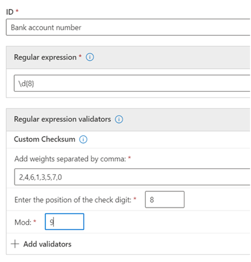

# Aan de slag met aangepaste typen vertrouwelijke informatieGet started with custom sensitive information types

Als de vooraf geconfigureerde typen gevoelige informatie niet aan uw behoeften voldoen, kunt u uw eigen aangepaste typen gevoelige informatie maken die u volledig definieert of u kunt een van de vooraf geconfigureerde typen kopiëren en wijzigen.If the pre-configured sensitive information types don't meet your needs, you can create your own custom sensitive information types that you fully define or you can copy one of the pre-configured ones and modify it.

De aangepaste typen vertrouwelijke informatie die u met deze methode maakt, worden toegevoegd aan het regelpakket met de naam `Microsoft.SCCManaged.CustomRulePack`.The custom sensitive information types that you create by using this method are added to the rule package named `Microsoft.SCCManaged.CustomRulePack`.

Er zijn twee manieren om een nieuw type gevoelige informatie te maken:There are two ways to create a new sensitive information type:

- [waarbij u alle elementen volledig definieertfrom scratch where you fully define all elements](#create-a-custom-sensitive-information-type)
- [een bestaand type vertrouwelijke informatie kopiëren en wijzigencopy and modify an existing sensitive information type](#copy-and-modify-a-sensitive-information-type)

## Voordat u begintBefore you begin

- U moet bekend zijn met typen vertrouwelijke informatie en waar ze uit bestaan.You should be familiar with sensitive information types and what they are composed of. Zie [Meer informatie over typen gevoelige informatie](sensitive-information-type-learn-about.md).See, [Learn about sensitive information types](sensitive-information-type-learn-about.md). Het is essentieel dat u inzicht heeft in de rollen van:It is critical to understand the roles of:
    - [reguliere expressies](https://www.boost.org/doc/libs/1_68_0/libs/regex/doc/html/) - Microsoft 365-typen gevoelige informatie gebruikt de engine Boost.RegEx 5.1.3[regular expressions](https://www.boost.org/doc/libs/1_68_0/libs/regex/doc/html/) - Microsoft 365 sensitive information types uses the Boost.RegEx 5.1.3 engine
    - trefwoordlijsten: u kunt uw eigen lijst maken terwijl u het type gevoelige informatie definieert of een keuze maken uit bestaande trefwoordlijstenkeyword lists - you can create your own as you define your sensitive information type or choose from existing keyword lists
    - [Trefwoordenlijstkeyword dictionary](create-a-keyword-dictionary.md)
    - [functiesfunctions](what-the-dlp-functions-look-for.md)
    - [betrouwbaarheidsniveausconfidence levels](sensitive-information-type-learn-about.md#more-on-confidence-levels)
 
- U moet globale beheerdersmachtigingen of beheerdersmachtigingen voor compliance hebben om een aangepast type gevoelige informatie te maken, testen en implementeren via de gebruikersinterface.You must have Global admin or Compliance admin permissions to create, test, and deploy a custom sensitive information type through the UI. Zie [Over beheerdersrollen](/office365/admin/add-users/about-admin-roles) in Office 365.See [About admin roles](/office365/admin/add-users/about-admin-roles) in Office 365.

- Uw organisatie moet een abonnement hebben, zoals Office 365 Enterprise, dat preventie van gegevensverlies (DLP) omvat.Your organization must have a subscription, such as Office 365 Enterprise, that includes Data Loss Prevention (DLP). Zie [berichtenbeleid en nalevingsservicedescription](/office365/servicedescriptions/exchange-online-protection-service-description/messaging-policy-and-compliance-servicedesc).See [Messaging Policy and Compliance ServiceDescription](/office365/servicedescriptions/exchange-online-protection-service-description/messaging-policy-and-compliance-servicedesc). 

> [!IMPORTANT]
> Microsoft Klantenservice & Ondersteuning kan u niet helpen bij het maken van aangepaste classificaties of reguliere expressiepatronen.Microsoft Customer Service & Support can't assist with creating custom classifications or regular expression patterns. Ondersteunings technici kunnen beperkte ondersteuning bieden voor de functie, zoals het aanbieden van voorbeelden van reguliere expressiepatronen voor testdoeleinden of het oplossen van het oplossen van problemen met een bestaand standaardexpressiepatroon dat niet zoals verwacht wordt uitgevoerd, maar dat niet kan garanderen dat aangepaste ontwikkeling van inhoudsaanpassing voldoet aan uw vereisten of verplichtingen.Support engineers can provide limited support for the feature, such as, providing sample regular expression patterns for testing purposes, or assisting with troubleshooting an existing regular expression pattern that's not triggering as expected, but can't provide assurances that any custom content-matching development will fulfill your requirements or obligations.

## Een aangepast type gevoelige informatie makenCreate a custom sensitive information type

Gebruik deze procedure om een nieuw type gevoelige informatie te maken dat u volledig definieert.Use this procedure to create a new sensitive information type that you fully define. 

1. Ga in het Compliancecentrum naar **Classificatie van gegevens** \> **Gevoelige informatietypen** en kies **Gegevenstype**.In the Compliance Center, go to **Data classification** \> **Sensitive info types** and choose **Create info type**.
2. Vul waarden in voor **Naam** en **Beschrijving** in en kies **Volgende**.Fill in values for **Name** and **Description** and choose **Next**.
3. Kies **Patroon maken**.Choose **Create pattern**. U kunt meerdere patronen maken, elk met verschillende elementen en betrouwbaarheidsniveaus, terwijl u het nieuwe type gevoelige informatie definieert.You can create multiple patterns, each with different elements and confidence levels, as you define your new sensitive information type.
4. Kies het standaard betrouwbaarheidsniveau voor het patroon.Choose the default confidence level for the pattern. De waarden zijn **Lage betrouwbaarheid**, **Gemiddelde betrouwbaarheid** en **Hoge betrouwbaarheid**.The values are **Low confidence**, **Medium confidence**, and **High confidence**.
5. Kies en definieer **Primaire element**.Choose and define **Primary element**. Het primaire element kan een **Reguliere expressie** met een optionele validator, een **Lijst met trefwoorden**, een **Trefwoordenlijst** of een van de vooraf geconfigureerde **Functies**.The primary element can be a **Regular expression** with an optional validator, a **Keyword list**, a **Keyword dictionary**, or one of the pre-configured **Functions**. Zie [Doel van de DLP-functies](what-the-dlp-functions-look-for.md) voor meer informatie over DLP-functies.For more information on DLP functions, see [What the DLP functions look for](what-the-dlp-functions-look-for.md). Zie Meer informatie over validators voor reguliere expressies voor meer informatie over de datum en de checksum [validators.](#more-information-on-regular-expression-validators)For more information on the date and the checksum validators, see [More information on regular expression validators](#more-information-on-regular-expression-validators).
6. Vul een waarde in voor **Nabijheid van tekens**.Fill in a value for **Character proximity**.
7. (Optioneel) Voeg zo nodig ondersteunende elementen toe.(Optional) Add supporting elements if you have any. Het primaire element kan een Reguliere expressie met een optionele validator, een Lijst met trefwoorden, een Trefwoordenlijst of een van de vooraf geconfigureerde Functies.Supporting elements can be a regular expression with an optional validator, a keyword list, a keyword dictionary or one of the pre-defined functions. Ondersteunende elementen kunnen een eigen karakter **naderingsconfiguratie** hebben.Supporting elements can have their own **Character proximity** configuration. 
8. (Optioneel) Voeg alle [**aanvullende controles toe die**](#more-information-on-additional-checks) worden weergegeven in de lijst met beschikbare controles.(Optional) Add any [**additional checks**](#more-information-on-additional-checks) from the list of available checks.
9. Kies **Maken**.Choose **Create**.
10. Kies **Volgende**.Choose **Next**.
11. Kies de **aanbevolen betrouwbaarheidsniveau** dit type gevoelige informatie.Choose the **recommended confidence level** for this sensitive information type.
12. Controleer uw instellingen en kies **Verzenden**.Check your setting and choose **Submit**.

> [!IMPORTANT]
> Microsoft 365 gebruikt de zoekverkenner om vertrouwelijke gegevens te identificeren en te classificeren in SHarePoint Online en OneDrive voor Bedrijven.Microsoft 365 uses the search crawler to identify and classify sensitive information in SharePoint Online and OneDrive for Business sites. Maar om uw nieuwe aangepaste type vertrouwelijke gegevens te identificeren in alle bestaande inhoud, moet die inhoud opnieuw worden verkend.To identify your new custom sensitive information type in existing content, the content must be re-crawled. Inhoud wordt verkend op basis van een planning, maar u kunt inhoud voor een siteverzameling, lijst of bibliotheek handmatig opnieuw crawlen.Content is crawled based on a schedule, but you can manually re-crawl content for a site collection, list, or library. Zie voor meer informatie [Het verkennen en opnieuw indexeren van een site, bibliotheek of lijst handmatig aanvragen](/sharepoint/crawl-site-content).For more information, see [Manually request crawling and re-indexing of a site, a library or a list](/sharepoint/crawl-site-content).

13. Op de pagina **Gegevensclassificatie** worden alle typen gevoelige informatie weergegeven.On the **Data classification** page, you'll see all the sensitive information types listed. Kies **Vernieuwen** en blader naar het zoekhulpmiddel of gebruik het zoekprogramma om het type gevoelige informatie te zoeken dat u hebt gemaakt.Choose **Refresh** and then browse for or use the search tool to find the sensitive information type you created.

## Een gevoelig informatietype makenTest a sensitive information type

U kunt elk type gevoelige informatie in de lijst testen.You can test any sensitive information type in the list. Het is aan te raden elk type gevoelige informatie dat u maakt te testen voordat u het in een beleid gebruikt.We suggest that you test every sensitive information type that you create before using it in a policy.

1. Maak twee bestanden, zoals een Word-document.Prepare two files, like a Word document. Een met inhoud die overeenkomt met de elementen die u hebt opgegeven in uw type gevoelige informatie en een die niet overeenkomt.One with content that matches the elements you specified in your sensitive information type and one that doesn't match.
2. Ga in het Compliancecentrum naar **Gegevensclassificatie** \> **Gevoelige informatietypen** en kies het type gevoelige informatie in de lijst om het detailvenster te openen en kies **Testen**.In the Compliance Center, go to **Data classification** \> **Sensitive info types** and choose the sensitive information type from the list to open the details pane and choose **Test**.
3. Upload een bestand en kies **Testen**.Upload a file and choose **Test**.
4. Bekijk de resultaten op de pagina **Overeenkomsten resultaten** en kies **Voltooien**.On the **Matches results** page, review the results and choose **Finish**.

## Een aangepast type gevoelige informatie wijzigen in het compliancecentrumModify custom sensitive information types in the Compliance Center

1. Ga in het Compliancecentrum naar **Gegevensclassificatie** \> **Gevoelige informatietypen** en kies het type gevoelige informatie die u wilt wijzigen en kies **Bewerken**.In the Compliance Center, go to **Data classification** \> **Sensitive info types** and choose the sensitive information type from the list that you want to modify choose **Edit**.
2. U kunt andere patronen toevoegen, met unieke primaire en ondersteunende elementen, betrouwbaarheidsniveaus, nabijheid van tekens en [**Extra controles**](#more-information-on-additional-checks) de bestaande te bewerken of te verwijderen.You can add other patterns, with unique primary and supporting elements, confidence levels, character proximity, and [**additional checks**](#more-information-on-additional-checks) or edit/remove the existing ones.

## Een aangepast type gevoelige informatie verwijderen in het compliancecentrumRemove custom sensitive information types in the Compliance Center 

> [!NOTE]
> U kunt enkel aangepaste typen gevoelige informatie verwijderen: u kunt ingebouwde typen gevoelige informatie niet verwijderen.You can only remove custom sensitive information types; you can't remove built-in sensitive information types.

> [!IMPORTANT]
> Controleer voordat u een aangepast type vertrouwelijke gegevens verwijdert dat er geen DLP-beleid of Exchange-berichtenstroomregels (ook wel transportregels genoemd) meer verwijzen naar het type vertrouwelijke gegevens.Before your remove a custom sensitive information type, verify that no DLP policies or Exchange mail flow rules (also known as transport rules) still reference the sensitive information type.

1. Ga in het Compliancecentrum naar **Gegevensclassificatie** \> **Gevoelige informatietypen** en kies het type gevoelige informatie die u wilt verwijderen.In the Compliance Center, go to **Data classification** \> **Sensitive info types** and choose the sensitive information type from the list that you want to remove.
2. Kies in de flyout die wordt geopend **Verwijderen**.In the fly-out that opens, choose **Delete**.

## En type vertrouwelijke informatie kopiëren en wijzigenCopy and modify a sensitive information type

Gebruik deze procedure om een nieuw type gevoelige informatie te maken dat is gebaseerd op een bestaand type gevoelige informatie.Use this procedure to create a new sensitive information type that is based on an existing sensitive information type. 

1. Ga in het Compliancecentrum naar **Gegevensclassificatie** \> **Gevoelige informatietypen** en kies het type gevoelige informatie die u wilt kopiëren.In the Compliance Center, go to **Data classification** \> **Sensitive info types** and choose the sensitive information type that you want to copy.
2. Kies in de flyout de optie **Kopiëren**.In the flyout, choose **Copy**.
3. Kies **Vernieuwen** in de lijst met typen gevoelige informatie en blader of zoek de kopie die u zojuist hebt gemaakt.Choose **Refresh** in the list of sensitive information types and either browse or search for the copy you just made. Gedeeltelijke zoekopdrachten in een zoekopdracht werken, dus u kunt alleen zoeken naar `copy` en de zoekopdracht zou alle typen gevoelige informatie retourneren met het woord `copy` in de naam.Partial sting searches work, so you could just search for `copy` and search would return all the sensitive information types with the word `copy` in the name. 
4. Vul waarden in voor **Naam** en **Beschrijving** in en kies **Volgende**.Fill in values for **Name** and **Description** and choose **Next**.
5. Kies het type kopie van uw gevoelige informatie en kies **Bewerken**.Choose your sensitive information type copy and choose **Edit**. 
6. Geef uw nieuw type vertrouwelijke informatie een nieuwe **Naam** en **Beschrijving**.Give your new sensitive information type a new **Name** and **Description**.
7. U kunt de bestaande patronen bewerken of verwijderen en nieuwe patronen toevoegen.You can choose to edit or remove the existing patterns and add new ones. Kies het standaard betrouwbaarheidsniveau voor het nieuwe patroon.Choose the default confidence level for the new pattern. De waarden zijn **Lage betrouwbaarheid**, **Gemiddelde betrouwbaarheid** en **Hoge betrouwbaarheid**.The values are **Low confidence**, **Medium confidence**, and **High confidence**.
8. Kies en definieer **Primaire element**.Choose and define **Primary element**. Het primaire element kan een **Reguliere expressie**, een **Lijst met trefwoorden**, een **Trefwoordenlijst** of een van de vooraf geconfigureerde **Functies**.The primary element can be a **Regular expression**, a **Keyword list**, a **Keyword dictionary**, or one of the pre-configured **Functions**. Zoe [Doel van de DLP-functies](what-the-dlp-functions-look-for.md).See, [What the DLP functions look for](what-the-dlp-functions-look-for.md).
9. Vul een waarde in voor **Nabijheid van tekens**.Fill in a value for **Character proximity**.
10. (Optioneel) Als u **Ondersteuningselementen** of [**Aanvullende controles**](#more-information-on-additional-checks) heeft, voeg ze dan toe.(Optional) If you have **Supporting elements** or any [**Additional checks**](#more-information-on-additional-checks) add them. U kunt zo nodig de verschillende **Ondersteunende elementen** groeperen.If needed you can group your **Supporting elements**.
11. Kies **Maken**.Choose **Create**.
12. Kies **Volgende**.Choose **Next**.
13. Kies de **aanbevolen betrouwbaarheidsniveau** dit type gevoelige informatie.Choose the **recommended confidence level** for this sensitive information type.
14. Controleer uw instellingen en kies **Verzenden**.Check your setting and choose **Submit**.

U kunt ook aangepaste typen gevoelige informatie maken met behulp van powershell- en exacte gegevensmatchingsfuncties.You can also create custom sensitive information types by using PowerShell and Exact Data Match capabilities. Zie voor meer informatie over deze methoden:To learn more about those methods, see:
- [Een aangepast type gevoelige informatie maken in het Beveiligings- en compliancecentrum PowerShellCreate a custom sensitive information type in Security & Compliance Center PowerShell](create-a-custom-sensitive-information-type-in-scc-powershell.md)
- [Aangepast type gevoelige informatie voor DLP maken met exacte gegevensovereenkomsten (EDM)Create a custom sensitive information type for DLP with Exact Data Match (EDM)](create-custom-sensitive-information-types-with-exact-data-match-based-classification.md)

## Meer informatie over reguliere expressie-validatorsMore information on regular expression validators

### Checksum-validatorChecksum validator

Als u een checksum wilt uitvoeren op een cijfer in een normale expressie, kunt u de *checksum validator gebruiken.*If you need to run a checksum on a digit in a regular expression, you can use the *checksum validator*. Stel dat u een SIT moet maken voor een licentienummer met acht cijfers, waarbij het laatste cijfer een checksumcijfer is dat wordt gevalideerd met een mod 9-berekening.For example, say you need to create a SIT for an eight digit license number where the last digit is a checksum digit that is validated using a mod 9 calculation. U hebt het algoritme checksum als dit ingesteld:You've set up the checksum algorithm like this:
 
Som = cijfer 1 \* 1 + cijfer 2 \* 2 + cijfer 3 \* 3 \* 3 + cijfer 4 \* gewicht 4 + cijfer 5 \* 5 \* 5 + cijfer 6 \* gewicht 6 + cijfer 7 \* gewicht 7 + cijfer 8 \* gewicht 8 Mod waarde = Som % 9 Als Mod-waarde == cijfer 8 Accountnummer geldig is Als Mod-waarde != cijfer 8 Accountnummer ongeldig isSum = digit 1 \* Weight 1 + digit 2 \* weight 2 + digit 3 \* weight 3 + digit 4 \* weight 4 + digit 5 \* weight 5 + digit 6 \* weight 6 + digit 7 \* weight 7 + digit 8 \* weight 8 Mod value = Sum % 9 If Mod value == digit 8 Account number is valid If Mod value != digit 8 Account number is invalid

1. Definieer het primaire element met deze normale expressie:Define the primary element with this regular expression:

`\d{8}`

2. Voeg vervolgens de checksum-validator toe.Then add the checksum validator.
3. Voeg de gewogen waarden toe die zijn gescheiden door komma's, de positie van het controlecijfer en de waarde Mod.Add the weight values separated by commas, the position of the check digit and the Mod value. Zie Modulo-bewerking voor meer informatie over de bewerking [Modulo.](https://en.wikipedia.org/wiki/Modulo_operation)For more information on the Modulo operation, see [Modulo operation](https://en.wikipedia.org/wiki/Modulo_operation).

> [!NOTE]
> Als het controlecijfer geen deel uitmaakt van de checksumberekening, gebruikt u 0 als het gewicht voor het controlecijfer.If the check digit is not part of the checksum calculation then use 0 as the weight for the check digit. In het bovenstaande geval is 8 bijvoorbeeld gelijk aan 0 als het controlecijfer niet moet worden gebruikt voor het berekenen van het controlecijfer.For example, in the above case weight 8 will be equal to 0 if the check digit is not to be used for calculating the check digit.  Modulo_operation).Modulo_operation).

### Datum validatorDate validator

Als een datumwaarde die is ingesloten in normale expressie, deel uitmaakt van een nieuw patroon dat u maakt, kunt u de *datum-validator* gebruiken om te testen of deze voldoet aan uw criteria.If a date value that is embedded in regular expression is part of a new pattern you are creating, you can use the *date validator* to test that it meets your criteria. Stel dat u een SIT wilt maken voor een werknemeridentificatienummer met negen cijfers.For example, say you want to create a SIT for a nine digit employee identification number. De eerste zes cijfers zijn de datum van inhuur in DDMMYY-indeling en de laatste drie zijn willekeurig gegenereerde getallen.The first six digits are the date of hire in DDMMYY format and the last three are randomly generated numbers. Controleer of de eerste zes cijfers de juiste notatie hebben.To validate that the first six digits are in the correct format. 

1. Definieer het primaire element met deze normale expressie:Define the primary element with this regular expression:

`\d{9}`

2. Voeg vervolgens de datum-validator toe.Then add the date validator.
3. Selecteer de datumnotatie en de begin verschuiving.Select the date format and the start offset. Aangezien de datumreeks de eerste zes cijfers is, is de verschuiving `0` .Since the date string is the first six digits, the offset is `0`.

### Functionele processors als validatorsFunctional processors as validators

U kunt functieprocessors gebruiken voor een aantal van de meest gebruikte ST's als validators.You can use function processors for some of the most commonly used SITs as validators. Op deze manier kunt u uw eigen reguliere expressie definiëren en ervoor zorgen dat ze de extra controles door de SIT kunnen uitvoeren.This allows you to define your own regular expression while ensuring they pass the additional checks required by the SIT. Zo zorgt Func_India_Aadhar ervoor dat de aangepaste reguliere expressie die door u is gedefinieerd, de validatielogica doorstaat die vereist is voor De Indiase Aadhar-kaart.For example, Func_India_Aadhar will ensure that the custom regular expression defined by you passes the validation logic required for Indian Aadhar card. Zie Wat [de DLP-functies zoeken](what-the-dlp-functions-look-for.md#what-the-dlp-functions-look-for)voor meer informatie over DLP-functies die als validators kunnen worden gebruikt.For more information on DLP functions that can be used as validators, see [What the DLP functions look for](what-the-dlp-functions-look-for.md#what-the-dlp-functions-look-for). 

### Validator van Luhn-controleLuhn check validator

U kunt de Luhn-controle-validator gebruiken als u een aangepast type gevoelige informatie hebt dat een normale expressie bevat die door het [Luhn-algoritme moet worden gebruikt.](https://en.wikipedia.org/wiki/Luhn_algorithm)You can use the Luhn check validator if you have a custom Sensitive information type that includes a regular expression which should pass the [Luhn algorithm](https://en.wikipedia.org/wiki/Luhn_algorithm).

## Meer informatie over extra controlesMore information on additional checks

Hier zijn de definities en enkele voorbeelden voor de beschikbare extra controles.Here are the definitions and some examples for the available additional checks.

**Specifieke overeenkomsten uitsluiten**: met deze controle kunt u trefwoorden definiëren die u wilt uitsluiten bij het detecteren van overeenkomsten voor het patroon dat u bewerkt.**Exclude specific matches**: This check lets you define keywords to exclude when detecting matches for the pattern you are editing. Testnummers zoals '4111111111111111' kunnen bijvoorbeeld worden uitgesloten, zodat deze niet worden gematcht als een geldig getal.For example, you might exclude test credit card numbers like '4111111111111111' so that they're not matched as a valid number.

**Begint of begint niet met tekens**: met deze controle kunt u de tekens definiëren waarmee de overeenkomende items moeten beginnen.**Starts or doesn't start with characters**: This check lets you define the characters that the matched items must or must not start with. Als u bijvoorbeeld wilt dat met het patroon alleen creditcardnummers worden gedetecteerd die beginnen met 41, 42 of 43, selecteert u **Begint met** en voegt u 41, 42 en 43 toe aan de lijst, gescheiden door komma's.For example, if you want the pattern to detect only credit card numbers that start with 41, 42, or 43, select **Starts with** and add 41, 42, and 43 to the list, separated by commas. 

**Eindigt of begint niet met tekens**: met deze controle kunt u de tekens definiëren waarmee de overeenkomende items moeten eindigen.**Ends or doesn't end with characters**: This check lets you define the characters that the matched items must or must not end with. Als uw werknemersnummer bijvoorbeeld niet kan eindigen op 0 of 1, selecteert u **Niet eindigt op** en voegt u 0 en 1 toe aan de lijst, gescheiden door komma's.For example, if your Employee ID number cannot end with 0 or 1, select **Doesn't end with** and add 0 and 1 to the list, separated by commas.

**Dubbele tekens uitsluiten**: met deze controle kunt u overeenkomsten negeren waarbij alle cijfers hetzelfde zijn.**Exclude duplicate characters**: This check lets you ignore matches in which all the digits are the same. Als het werknemer-id-nummer van zes cijfers bijvoorbeeld niet alle cijfers hetzelfde kan hebben, kunt u **Dubbele tekens uitsluiten**: 111111, 222222, 333333, 444444, 555555, 666666, 777777, 888888, 999999 en 000000 van de lijst met geldige overeenkomsten voor de werknemer-id.For example, if the six digit employee ID number cannot have all the digits be the same, you can select **Exclude duplicate characters** to exclude 111111, 222222, 333333, 444444, 555555, 666666, 777777, 888888, 999999, and 000000 from the list of valid matches for the employee ID.

**Voorvoegsels opnemen of uitsluiten**: met deze controle kunt u de trefwoorden definiëren die direct vóór de overeenkomende entiteit moeten worden gevonden of niet mogen worden gevonden.**Include or exclude prefixes**: This check lets you define the keywords that must or must not be found immediately before the matching entity. Afhankelijk van uw selectie worden entiteiten gematcht of niet gematcht als ze worden voorafgegaan door de voorvoegsels die u hier op neemt.Depending on your selection, entities will be matched or not matched if they're preceded by the prefixes you include here. Als u bijvoorbeeld het voorvoegsel **GUID:** **Uitsluit** wordt elke entiteit die wordt voorafgegaan door **GUID:** niet beschouwd als een overeenkomst.For example, if you **Exclude** the prefix **GUID:**, any entity that's preceded by **GUID:** won't be considered a match.

**Achtervoegsels opnemen of uitsluiten**: met deze controle kunt u de trefwoorden definiëren die direct na de overeenkomende entiteit moeten worden gevonden of niet mogen worden gevonden.**Include or exclude suffixes** This check lets you define the keywords that must or must not be found immediately after the matching entity. Afhankelijk van uw selectie worden entiteiten gematcht of niet gematcht als ze worden gevolgd door de achtervoegsels die u hier op neemt.Depending on your selection, entities will be matched or not matched if they're followed by the suffixes you include here. Als u bijvoorbeeld het achtervoegsel **:GUID** **Uitsluit**, wordt alle tekst die wordt gevolgd door **:GUID** niet gematcht.For example, if you **Exclude** the suffix **:GUID**, any text that's followed by **:GUID** won't be matched.

> [!NOTE]
> Microsoft 365 Information Protection ondersteunt talen voor preview van dubbel-byte-tekensets voor:Microsoft 365 Information Protection supports, in preview, double byte character set languages for:
> - Vereenvoudigd ChineesChinese (simplified)
> - Traditioneel ChineesChinese (traditional)
> - KoreaksKorean
> - JapansJapanese
>
>Deze ondersteuning is beschikbaar voor typen gevoelige informatie.This support is available for sensitive information types. Zie [Ondersteuning voor Information Protection voor releaseopmerkingen bij dubbel-bytetekensets (preview)](mip-dbcs-relnotes.md) voor meer informatie.See, [Information protection support for double byte character sets release notes (preview)](mip-dbcs-relnotes.md) for more information.