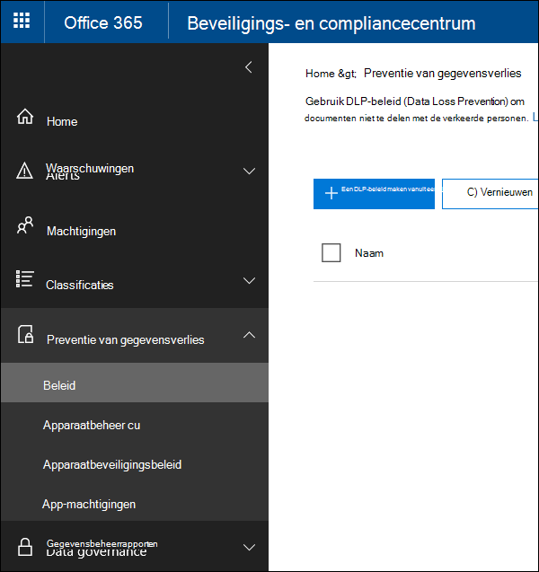
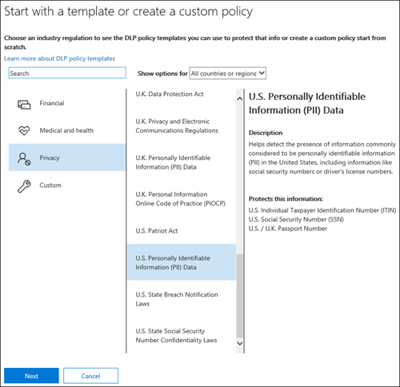
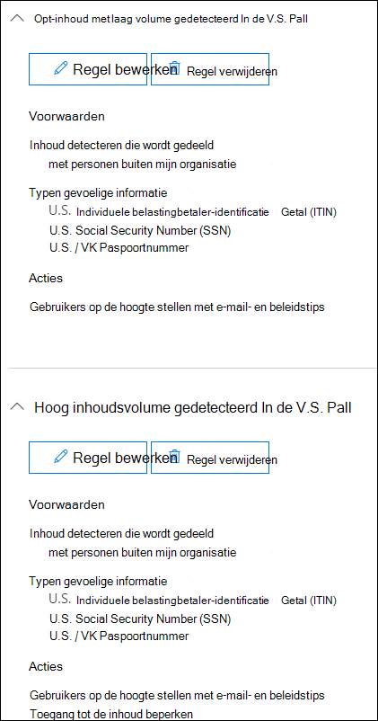
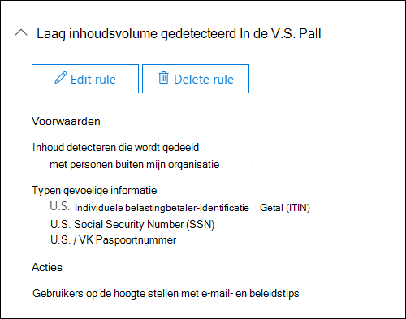
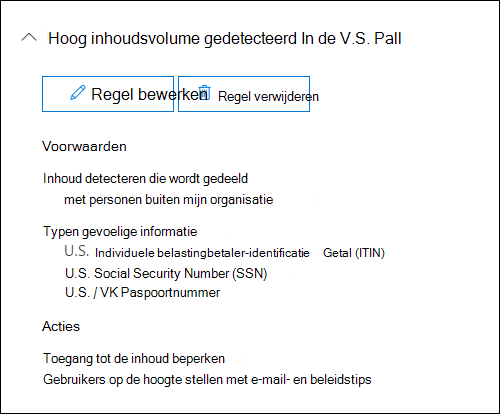
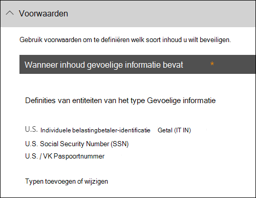
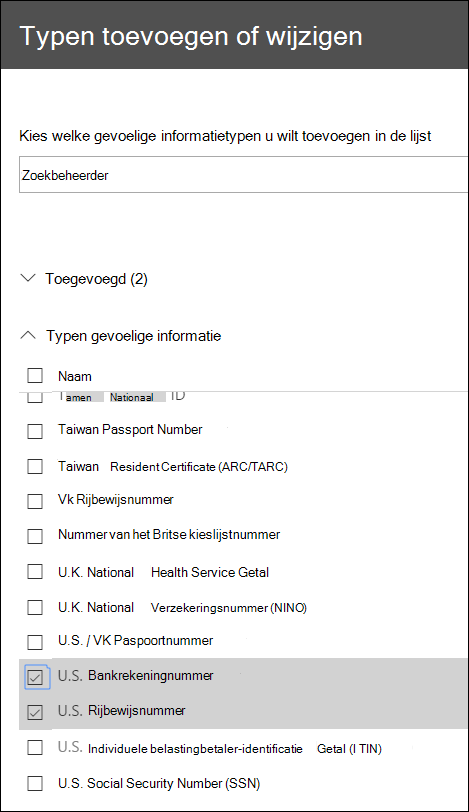
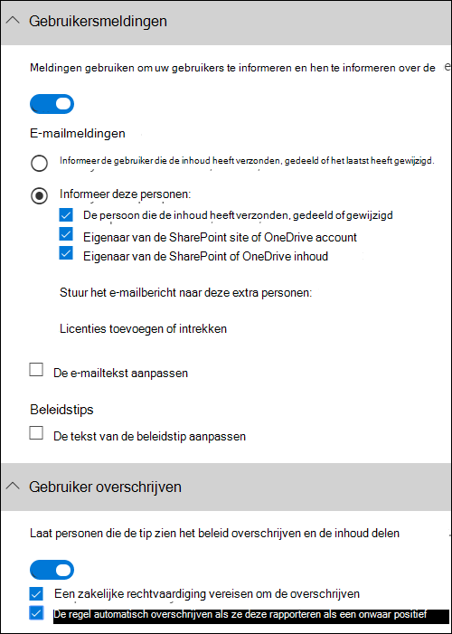
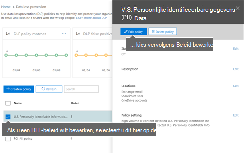

# Een DLP-beleid maken vanuit een sjabloon

De eenvoudigste, meest voorkomende manier om aan de slag te gaan met DLP-beleid is door een van de sjablonen te gebruiken die zijn opgenomen in Office 365. U kunt een van deze sjablonen gebruiken of de regels aanpassen aan de specifieke nalevingsvereisten van uw organisatie.
  
Microsoft 365 bevat meer dan 40 kant-en-klare sjablonen die u kunnen helpen voldoen aan een breed scala aan gemeenschappelijke behoeften op het gebied van regelgeving en zakelijk beleid. Er zijn bijvoorbeeld DLP-beleidsjablonen voor:
  
- Gramm-Leach-Bliley Act (GLBA)
    
- Payment Card Industry Data Security Standard (PCI-DSS)
    
- Persoonlijke identificeerbare gegevens in de Verenigde Staten (AMERIKAANSE PII)
    
- United States Health Insurance Act (HIPAA)
    
U kunt een sjabloon aanpassen door een van de bestaande regels te wijzigen of nieuwe regels toe te voegen. U kunt bijvoorbeeld nieuwe typen gevoelige informatie aan een regel toevoegen, de tellingen in een regel wijzigen om het moeilijker of gemakkelijker te maken om te activeren, personen toestaan de acties in een regel te overschrijven door een zakelijke rechtvaardiging op te geven of te wijzigen naar wie meldingen en incidentenrapporten worden verzonden. Een DLP-beleidssjabloon is een flexibel uitgangspunt voor veel veelvoorkomende compliancescenario's.
  
U kunt ook de aangepaste sjabloon kiezen, die geen standaardregels bevat, en uw DLP-beleid helemaal opnieuw configureren om te voldoen aan de specifieke nalevingsvereisten voor uw organisatie.
  
## Voorbeeld: Identificeer gevoelige informatie op alle OneDrive voor Bedrijven sites en beperk de toegang voor personen buiten uw organisatie

OneDrive voor Bedrijven accounts maken het gemakkelijk voor mensen in uw organisatie om samen te werken en documenten te delen. Maar een veelvoorkomende zorg voor compliancemedewerkers is dat gevoelige informatie die is opgeslagen in OneDrive voor Bedrijven accounts per ongeluk kan worden gedeeld met personen buiten uw organisatie. Een DLP-beleid kan dit risico helpen beperken.
  
In dit voorbeeld maakt u een DLP-beleid waarmee U.S. PII-gegevens worden geïdentificeerd, waaronder Itin (Individual Taxpayer Identification Numbers), Social Security Numbers en Amerikaanse paspoortnummers. U gaat aan de slag met een sjabloon en vervolgens wijzigt u de sjabloon om te voldoen aan de nalevingsvereisten van uw organisatie, met name:
  
- Voeg een paar typen gevoelige gegevens toe, zoals Amerikaanse bankrekeningnummers en Amerikaanse nummertjes van het rijbewijs, zodat het DLP-beleid nog meer gevoelige gegevens beschermt.
    
- Maak het beleid gevoeliger, zodat één enkel voorkomen van gevoelige informatie voldoende is om de toegang voor externe gebruikers te beperken.
    
- Sta gebruikers toe de acties te overschrijven door een zakelijke rechtvaardiging te geven of een onwaar positief te rapporteren. Op deze manier voorkomt uw DLP-beleid niet dat personen in uw organisatie hun werk kunnen doen, mits ze een geldige zakelijke reden hebben om de gevoelige informatie te delen.
    
### Een DLP-beleid maken vanuit een sjabloon

1. Ga naar [https://protection.office.com](https://protection.office.com).
    
2. Meld u aan met uw werk- of schoolaccount. U bent nu in het Beveiligings &amp; compliancecentrum.
    
3. In het linkernavigatienavigatiecentrum van het Beveiligings &amp; compliancecentrum \> wordt het \>  \> **preventiebeleid** \> **voor gegevensverlies + Een beleid maken.**
    
    
  
4. Kies de DLP-beleidssjabloon die de typen gevoelige informatie beschermt die u volgende \> **nodig hebt.**
    
    In dit voorbeeld selecteert u **Privacy** \> **U.S. Pii-gegevens (Persoonlijk** identificeerbare gegevens), omdat deze gegevens al de meeste typen gevoelige informatie bevatten die u wilt beveiligen. U voegt er later een paar toe. 
    
    Wanneer u een sjabloon selecteert, kunt u de beschrijving aan de rechterkant lezen om te zien welke typen gevoelige informatie de sjabloon beschermt.
    
    
  
5. Noem het beleid \> **Volgende**.
    
6. Als u de locaties wilt kiezen die u wilt beveiligen met het DLP-beleid, gaat u op een van de volgende gebieden te werk:
    
  - Kies **Alle locaties in Office 365** \> **Volgende**.
    
  - Kies **Laat me specifieke locaties kiezen** \> **Volgende.** Kies dit voorbeeld.
    
    Als u een hele locatie wilt opnemen of uitsluiten, zoals alle e-Exchange of alle OneDrive accounts, schakelt u de **status** van die locatie in of uit. 
    
    Als u alleen specifieke SharePoint of OneDrive voor Bedrijven accounts wilt opnemen, schakelt u de **status** in en klikt u op de koppelingen onder Opnemen om specifieke sites of accounts te kiezen.  Wanneer u een beleid op een site toe past, worden de regels die in dat beleid zijn geconfigureerd, automatisch toegepast op alle subsites van die site. 
    
    
  
    Als u in dit voorbeeld gevoelige informatie wilt beveiligen die  is opgeslagen in alle OneDrive voor Bedrijven-accounts, schakelt  u de status uit voor zowel Exchange-e-mail- als **SharePoint-sites** en laat u de status aan voor  **OneDrive-accounts.**
    
7. Kies **Volgende geavanceerde instellingen** \> **gebruiken.**
    
8. Een DLP-beleidssjabloon bevat vooraf gedefinieerde regels met voorwaarden en acties die specifieke typen gevoelige informatie detecteren en erop reageren. U kunt bestaande regels bewerken, verwijderen of uitschakelen of nieuwe regels toevoegen. Wanneer u klaar bent, klikt u op **Volgende.**
    
    
  
    In dit voorbeeld bevat de Amerikaanse PII-gegevenssjabloon twee vooraf gedefinieerde regels:
    
  - **Laag inhoudsvolume gedetecteerd In de V.S. PII** Met deze regel worden bestanden met tussen de 1 en 10 exemplaren van elk van de drie typen gevoelige informatie (ITIN, SSN en Amerikaanse paspoortnummers) opgeslagen, waarbij de bestanden worden gedeeld met personen buiten de organisatie. Als de regel wordt gevonden, wordt een e-mailmelding verzonden naar de beheerder van de primaire siteverzameling, de eigenaar van het document en de persoon die het document het laatst heeft gewijzigd. 
    
  - **Hoog inhoudsvolume gedetecteerd In de V.S. PII** Deze regel zoekt naar bestanden met tien of meer exemplaren van elk van dezelfde drie typen gevoelige informatie, waarbij de bestanden worden gedeeld met personen buiten de organisatie. Als deze actie wordt gevonden, wordt er ook een e-mailmelding verzonden, plus dat de toegang tot het bestand wordt beperkt. Voor inhoud in een OneDrive voor Bedrijven account betekent dit dat machtigingen voor het document zijn beperkt voor iedereen, behalve de primaire beheerder van de siteverzameling, de eigenaar van het document en de persoon die het document het laatst heeft gewijzigd. 
    
    Als u wilt voldoen aan de specifieke vereisten van uw organisatie, kunt u de regels gemakkelijker activeren, zodat één enkel exemplaar van gevoelige informatie voldoende is om toegang voor externe gebruikers te blokkeren. Nadat u deze regels hebt doorgekeken, begrijpt u dat u geen regels voor laag en hoog aantal nodig hebt. U hebt slechts één regel nodig die toegang blokkeert als er gevoelige informatie wordt gevonden.
    
    U vouwt dus de regel uit met de naam **Laag inhoudsvolume gedetecteerde Amerikaanse PII** \> **Delete-regel.**
    
    
  
9. In dit voorbeeld moet u nu twee typen gevoelige informatie toevoegen (Amerikaanse bankrekeningnummers en Amerikaanse nummertjes voor het rijbewijs), personen toestaan een regel te overschrijven en het aantal te wijzigen in een gebeurtenis. U kunt dit allemaal doen door één regel te bewerken, dus selecteer **Hoog volume** aan gedetecteerde Amerikaanse \> **pii-bewerkingsregel.**
    
    
  
10. Als u een type gevoelige informatie wilt toevoegen, gaat u naar **de** sectie Voorwaarden \> **Typen toevoegen of wijzigen.** Kies vervolgens onder **Typen toevoegen** of wijzigen de optie Toevoegen selecteer Amerikaans bankrekeningnummer en Amerikaans rijbewijsnummer \>  \>   \> **Add** \> **Done**.
    
    
  
    
  
11. Als u het aantal wilt wijzigen (het aantal exemplaren  van gevoelige gegevens dat nodig is om de regel te activeren), kiest u onder Aantal exemplaren de minwaarde voor elk \> type enter  \> 1. Het minimum aantal kan niet leeg zijn. Het maximum aantal kan leeg zijn. een lege **maximumwaarde** converteren naar **een** waarde .
    
    Wanneer u klaar bent, moet het aantal mins voor alle gevoelige informatietypen **1** zijn en moet het maximum aantal **worden geteld.** Met andere woorden: elk voorkomen van dit type gevoelige informatie voldoet aan deze voorwaarde.
    
    
  
12. Voor de laatste aanpassing wilt u niet dat uw DLP-beleid mensen blokkeert om hun werk te doen wanneer ze een geldige zakelijke rechtvaardiging hebben of een onwaar positief resultaat ondervinden, dus wilt u dat de melding van de gebruiker opties bevat om de blokkeringsactie te overschrijven.
    
    In de **sectie Gebruikersmeldingen** kunt u zien dat e-mailmeldingen en beleidstips standaard zijn ingeschakeld voor deze regel in de sjabloon. 
    
    In de **sectie Gebruiker overschrijven** kunt u zien dat overschrijvingen voor een zakelijke rechtvaardiging zijn ingeschakeld, maar overschrijven om fout-positieven te rapporteren niet. Kies **De regel automatisch overschrijven als ze deze rapporteren als een onwaar positief**.
    
    
  
13. Wijzig boven aan de regeleditor de naam van deze regel van het standaard hoge inhoudsvolume dat **U.S. PII** heeft gedetecteerd in Inhoud die is gedetecteerd met de Amerikaanse **pii** omdat deze nu wordt geactiveerd door het voorkomen van de gevoelige informatietypen. 
    
14. Onder aan de regeleditor \> **Opslaan**.
    
15. Bekijk de voorwaarden en acties voor deze regel \> **Volgende**.
    
    Aan de rechterkant ziet u de **statusknop voor** de regel. Als u een volledig beleid uit schakelen, zijn alle regels in het beleid ook uitgeschakeld. Hier kunt u echter een specifieke regel uitschakelen zonder het hele beleid uit te schakelen. Dit kan handig zijn wanneer u een regel moet onderzoeken die een groot aantal onwaar-positieven genereert. 
    
16. Lees op de volgende pagina het volgende en begrijp het volgende en kies vervolgens of u de regel wilt in- of testen eerst \> **Volgende.**
    
     Voordat u uw DLP-beleid maakt, moet u overwegen deze geleidelijk uit te rollen om de impact ervan te beoordelen en de effectiviteit ervan te testen voordat u ze volledig afdwingt. U wilt bijvoorbeeld niet dat een nieuw DLP-beleid onbedoeld toegang blokkeert tot duizenden documenten die mensen nodig hebben om hun werk te kunnen doen. 
    
    Als u DLP-beleid maakt met een grote potentiële impact, raden we u aan de volgende volgorde te volgen:
    
17. Start in de testmodus zonder Tips en gebruik vervolgens de DLP-rapporten om de impact te beoordelen. U kunt DLP-rapporten gebruiken om het nummer, de locatie, het type en de ernst van beleidswedstrijden weer te geven. Op basis van de resultaten kunt u de regels zo nodig afstemmen. In de testmodus heeft DLP-beleid geen invloed op de productiviteit van personen die in uw organisatie werken. 
    
18. Ga naar de testmodus met meldingen en beleidsregels Tips zodat u gebruikers kunt leren over uw compliancebeleid en ze kunt voorbereiden op de regels die worden toegepast. In dit stadium kunt u gebruikers ook vragen om fout-positieven te melden, zodat u de regels verder kunt verfijnen.
    
19. Schakel het beleid in, zodat de regels worden afgedwongen en de inhoud is beveiligd. Blijf de DLP-rapporten en eventuele incidentenrapporten of meldingen controleren om ervoor te zorgen dat de resultaten zijn wat u van plan bent. 
    
    
  
20. Controleer de instellingen voor dit beleid \> en kies **Maken.**
    
Nadat u een DLP-beleid hebt gemaakt en ingeschakeld, wordt het geïmplementeerd voor inhoudsbronnen die het bevat, zoals SharePoint Online-sites of OneDrive voor Bedrijven-accounts, waar het beleid automatisch de regels voor die inhoud gaat afdwingen.
  
## De status van een DLP-beleid weergeven

U kunt op elk moment de status van  uw DLP-beleid bekijken op de pagina Beleid in de sectie **Preventie** van gegevensverlies van het Beveiligings &amp; compliancecentrum. Hier vindt u belangrijke informatie, zoals of een beleid is ingeschakeld of uitgeschakeld, of dat het beleid in de testmodus staat. 
  
Hier zijn de verschillende statussen en wat ze betekenen.
  
|**Status**|**Uitleg**|
|:-----|:-----|
|**In- en uitschakelen...**   |Het beleid wordt geïmplementeerd in de inhoudsbronnen die het bevat. Het beleid wordt nog niet voor alle bronnen afgedwongen.    |
|**Testen, met meldingen**   |Het beleid is in de testmodus. De acties in een regel worden niet toegepast, maar beleidswedstrijden worden verzameld en kunnen worden bekeken met behulp van de DLP-rapporten. Meldingen over beleids matches worden verzonden naar de opgegeven geadresseerden.    |
|**Testen, zonder meldingen**   |Het beleid is in de testmodus. De acties in een regel worden niet toegepast, maar beleidswedstrijden worden verzameld en kunnen worden bekeken met behulp van de DLP-rapporten. Meldingen over beleids matches worden niet verzonden naar de opgegeven geadresseerden.    |
|**Aan**   |Het beleid is actief en afgedwongen. Het beleid is geïmplementeerd op alle inhoudsbronnen.    |
|**Uitschakelen...**   |Het beleid wordt verwijderd uit de inhoudsbronnen die het bevat. Het beleid is mogelijk nog steeds actief en afgedwongen op sommige bronnen. Het uitschakelen van een beleid kan maximaal 45 minuten duren.    |
|**Uit**   |Het beleid is niet actief en niet afgedwongen. De instellingen voor het beleid (bronnen, trefwoorden, duur, enzovoort) worden opgeslagen.    |
|**Verwijderen...**   |Het beleid wordt nu verwijderd. Het beleid is niet actief en niet afgedwongen. Het duurt normaal gesproken een uur voordat een beleid wordt verwijderd   |
   
## Een DLP-beleid uitschakelen

U kunt een DLP-beleid op elk moment bewerken of uitschakelen. Als u een beleid uit schakelt, worden alle regels in het beleid uitgeschakeld.
  
Als u een DLP-beleid wilt bewerken of uitschakelen, selecteert u op **de pagina** Beleid het beleid \> Beleid \> **bewerken.**
  

  
Bovendien kunt u elke regel afzonderlijk uitschakelen door het beleid te bewerken en vervolgens de **status** van die regel uit te schakelen, zoals hierboven is beschreven. 
  
## Meer informatie

- [Meer informatie over preventie van gegevensverlies](dlp-learn-about-dlp.md)
- [Meldingen verzenden en beleidstips voor DLP-beleid tonen](use-notifications-and-policy-tips.md)
- [Een DLP-beleid maken om documenten te beveiligen met FCI of andere eigenschappen](protect-documents-that-have-fci-or-other-properties.md)
- [Wat zijn de DLP-beleidssjablonen?](what-the-dlp-policy-templates-include.md)
- [Definities van entiteiten van het type Gevoelige informatie](sensitive-information-type-entity-definitions.md)
