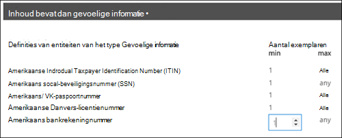

# Een DLP-beleid maken vanuit een sjabloonCreate a DLP policy from a template

De eenvoudigste, meest voorkomende manier om aan de slag te gaan met DLP-beleid is door een van de sjablonen te gebruiken die zijn opgenomen in Office 365.The easiest, most common way to get started with DLP policies is to use one of the templates included in Office 365. U kunt een van deze sjablonen gebruiken of de regels aanpassen aan de specifieke nalevingsvereisten van uw organisatie.You can use one of these templates as is, or customize the rules to meet your organization's specific compliance requirements.
  
Microsoft 365 bevat meer dan 40 kant-en-klare sjablonen die u kunnen helpen voldoen aan een breed scala aan gemeenschappelijke behoeften op het gebied van regelgeving en zakelijk beleid.Microsoft 365 includes over 40 ready-to-use templates that can help you meet a wide range of common regulatory and business policy needs. Er zijn bijvoorbeeld DLP-beleidsjablonen voor:For example, there are DLP policy templates for:
  
- Gramm-Leach-Bliley Act (GLBA)Gramm-Leach-Bliley Act (GLBA)
    
- Payment Card Industry Data Security Standard (PCI-DSS)Payment Card Industry Data Security Standard (PCI-DSS)
    
- Persoonlijke identificeerbare gegevens in de Verenigde Staten (AMERIKAANSE PII)United States Personally Identifiable Information (U.S. PII)
    
- United States Health Insurance Act (HIPAA)United States Health Insurance Act (HIPAA)
    
U kunt een sjabloon aanpassen door een van de bestaande regels te wijzigen of nieuwe regels toe te voegen.You can fine tune a template by modifying any of the existing rules or adding new ones. U kunt bijvoorbeeld nieuwe typen gevoelige informatie aan een regel toevoegen, de tellingen in een regel wijzigen om het moeilijker of gemakkelijker te maken om te activeren, personen toestaan de acties in een regel te overschrijven door een zakelijke rechtvaardiging op te geven of te wijzigen naar wie meldingen en incidentenrapporten worden verzonden.For example, you can add new types of sensitive information to a rule, modify the counts in a rule to make it harder or easier to trigger, allow people to override the actions in a rule by providing a business justification, or change who notifications and incident reports are sent to. Een DLP-beleidssjabloon is een flexibel uitgangspunt voor veel veelvoorkomende compliancescenario's.A DLP policy template is a flexible starting point for many common compliance scenarios.
  
U kunt ook de aangepaste sjabloon kiezen, die geen standaardregels bevat, en uw DLP-beleid helemaal opnieuw configureren om te voldoen aan de specifieke nalevingsvereisten voor uw organisatie.You can also choose the Custom template, which has no default rules, and configure your DLP policy from scratch, to meet the specific compliance requirements for your organization.
  
## Voorbeeld: Identificeer gevoelige informatie op alle OneDrive voor Bedrijven sites en beperk de toegang voor personen buiten uw organisatieExample: Identify sensitive information across all OneDrive for Business sites and restrict access for people outside your organization

OneDrive voor Bedrijven accounts maken het gemakkelijk voor mensen in uw organisatie om samen te werken en documenten te delen.OneDrive for Business accounts make it easy for people across your organization to collaborate and share documents. Maar een veelvoorkomende zorg voor compliancemedewerkers is dat gevoelige informatie die is opgeslagen in OneDrive voor Bedrijven accounts per ongeluk kan worden gedeeld met personen buiten uw organisatie.But a common concern for compliance officers is that sensitive information stored in OneDrive for Business accounts may be inadvertently shared with people outside your organization. Een DLP-beleid kan dit risico helpen beperken.A DLP policy can help mitigate this risk.
  
In dit voorbeeld maakt u een DLP-beleid waarmee U.S. PII-gegevens worden geïdentificeerd, waaronder Itin (Individual Taxpayer Identification Numbers), Social Security Numbers en Amerikaanse paspoortnummers.In this example, you'll create a DLP policy that identifies U.S. PII data, which includes Individual Taxpayer Identification Numbers (ITIN), Social Security Numbers, and U.S. passport numbers. U gaat aan de slag met een sjabloon en vervolgens wijzigt u de sjabloon om te voldoen aan de nalevingsvereisten van uw organisatie, met name:You'll get started by using a template, and then you'll modify the template to meet your organization's compliance requirements—specifically, you'll:
  
- Voeg een paar typen gevoelige gegevens toe, zoals Amerikaanse bankrekeningnummers en Amerikaanse nummertjes van het rijbewijs, zodat het DLP-beleid nog meer gevoelige gegevens beschermt.Add a couple of types of sensitive information—U.S. bank account numbers and U.S. driver's license numbers—so that the DLP policy protects even more of your sensitive data.
    
- Maak het beleid gevoeliger, zodat één enkel voorkomen van gevoelige informatie voldoende is om de toegang voor externe gebruikers te beperken.Make the policy more sensitive, so that a single occurrence of sensitive information is enough to restrict access for external users.
    
- Sta gebruikers toe de acties te overschrijven door een zakelijke rechtvaardiging te geven of een onwaar positief te rapporteren.Allow users to override the actions by providing a business justification or reporting a false positive. Op deze manier voorkomt uw DLP-beleid niet dat personen in uw organisatie hun werk kunnen doen, mits ze een geldige zakelijke reden hebben om de gevoelige informatie te delen.This way, your DLP policy won't prevent people in your organization from getting their work done, provided they have a valid business reason for sharing the sensitive information.
    
### Een DLP-beleid maken vanuit een sjabloonCreate a DLP policy from a template

1. Ga naar [https://protection.office.com](https://protection.office.com).Go to [https://protection.office.com](https://protection.office.com).
    
2. Meld u aan met uw werk- of schoolaccount.Sign in using your work or school account. U bent nu in het Beveiligings &amp; compliancecentrum.You're now in the Security &amp; Compliance Center.
    
3. In het linkernavigatienavigatiecentrum van het Beveiligings &amp; compliancecentrum \> wordt het \>  \> **preventiebeleid** \> **voor gegevensverlies + Een beleid maken.**In the Security &amp; Compliance Center \> left navigation \> **Data loss prevention** \> **Policy** \> **+ Create a policy**.
    
    
  
4. Kies de DLP-beleidssjabloon die de typen gevoelige informatie beschermt die u volgende \> **nodig hebt.**Choose the DLP policy template that protects the types of sensitive information that you need \> **Next**.
    
    In dit voorbeeld selecteert u **Privacy** \> **U.S. Pii-gegevens (Persoonlijk** identificeerbare gegevens), omdat deze gegevens al de meeste typen gevoelige informatie bevatten die u wilt beveiligen. U voegt er later een paar toe.In this example, you'll select **Privacy** \> **U.S. Personally Identifiable Information ‎(PII)‎ Data** because it already includes most of the types of sensitive information that you want to protect—you'll add a couple later. 
    
    Wanneer u een sjabloon selecteert, kunt u de beschrijving aan de rechterkant lezen om te zien welke typen gevoelige informatie de sjabloon beschermt.When you select a template, you can read the description on the right to learn what types of sensitive information the template protects.
    
    
  
5. Noem het beleid \> **Volgende**.Name the policy \> **Next**.
    
6. Als u de locaties wilt kiezen die u wilt beveiligen met het DLP-beleid, gaat u op een van de volgende gebieden te werk:To choose the locations that you want the DLP policy to protect, do one of the following:
    
  - Kies **Alle locaties in Office 365** \> **Volgende**.Choose **All locations in Office 365** \> **Next**.
    
  - Kies **Laat me specifieke locaties kiezen** \> **Volgende.**Choose **Let me choose specific locations** \> **Next**. Kies dit voorbeeld.For this example, choose this.
    
    Als u een hele locatie wilt opnemen of uitsluiten, zoals alle e-Exchange of alle OneDrive accounts, schakelt u de **status** van die locatie in of uit.To include or exclude an entire location such as all Exchange email or all OneDrive accounts, switch the **Status** of that location on or off. 
    
    Als u alleen specifieke SharePoint of OneDrive voor Bedrijven accounts wilt opnemen, schakelt u de **status** in en klikt u op de koppelingen onder Opnemen om specifieke sites of accounts te kiezen. To include only specific SharePoint sites or OneDrive for Business accounts, switch the **Status** to on, and then click the links under **Include** to choose specific sites or accounts. Wanneer u een beleid op een site toe past, worden de regels die in dat beleid zijn geconfigureerd, automatisch toegepast op alle subsites van die site.When you apply a policy to a site, the rules configured in that policy are automatically applied to all subsites of that site. 
    
    
  
    Als u in dit voorbeeld gevoelige informatie wilt beveiligen die  is opgeslagen in alle OneDrive voor Bedrijven-accounts, schakelt  u de status uit voor zowel Exchange-e-mail- als **SharePoint-sites** en laat u de status aan voor  **OneDrive-accounts.**In this example, to protect sensitive information stored in all OneDrive for Business accounts, turn off the **Status** for both **Exchange email** and **SharePoint sites**, and leave the **Status** on for **OneDrive accounts**.
    
7. Kies **Volgende geavanceerde instellingen** \> **gebruiken.**Choose **Use advanced settings** \> **Next**.
    
8. Een DLP-beleidssjabloon bevat vooraf gedefinieerde regels met voorwaarden en acties die specifieke typen gevoelige informatie detecteren en erop reageren.A DLP policy template contains predefined rules with conditions and actions that detect and act upon specific types of sensitive information. U kunt bestaande regels bewerken, verwijderen of uitschakelen of nieuwe regels toevoegen.You can edit, delete, or turn off any of the existing rules, or add new ones. Wanneer u klaar bent, klikt u op **Volgende.**When done, click **Next**.
    
    
  
    In dit voorbeeld bevat de Amerikaanse PII-gegevenssjabloon twee vooraf gedefinieerde regels:In this example, the U.S. PII Data template includes two predefined rules:
    
  - **Laag inhoudsvolume gedetecteerd In de V.S. PII** Met deze regel worden bestanden met tussen de 1 en 10 exemplaren van elk van de drie typen gevoelige informatie (ITIN, SSN en Amerikaanse paspoortnummers) opgeslagen, waarbij de bestanden worden gedeeld met personen buiten de organisatie.**Low volume of content detected U.S. PII** This rule looks for files containing between 1 and 10 occurrences of each of three types of sensitive information (ITIN, SSN, and U.S. passport numbers), where the files are shared with people outside the organization. Als de regel wordt gevonden, wordt een e-mailmelding verzonden naar de beheerder van de primaire siteverzameling, de eigenaar van het document en de persoon die het document het laatst heeft gewijzigd.If found, the rule sends an email notification to the primary site collection administrator, document owner, and person who last modified the document. 
    
  - **Hoog inhoudsvolume gedetecteerd In de V.S. PII** Deze regel zoekt naar bestanden met tien of meer exemplaren van elk van dezelfde drie typen gevoelige informatie, waarbij de bestanden worden gedeeld met personen buiten de organisatie.**High volume of content detected U.S. PII** This rule looks for files containing 10 or more occurrences of each of the same three sensitive information types, where the files are shared with people outside the organization. Als deze actie wordt gevonden, wordt er ook een e-mailmelding verzonden, plus dat de toegang tot het bestand wordt beperkt.If found, this action also sends an email notification, plus it restricts access to the file. Voor inhoud in een OneDrive voor Bedrijven account betekent dit dat machtigingen voor het document zijn beperkt voor iedereen, behalve de primaire beheerder van de siteverzameling, de eigenaar van het document en de persoon die het document het laatst heeft gewijzigd.For content in a OneDrive for Business account, this means that permissions for the document are restricted for everyone except the primary site collection administrator, document owner, and person who last modified the document. 
    
    Als u wilt voldoen aan de specifieke vereisten van uw organisatie, kunt u de regels gemakkelijker activeren, zodat één enkel exemplaar van gevoelige informatie voldoende is om toegang voor externe gebruikers te blokkeren.To meet your organization's specific requirements, you may want to make the rules easier to trigger, so that a single occurrence of sensitive information is enough to block access for external users. Nadat u deze regels hebt doorgekeken, begrijpt u dat u geen regels voor laag en hoog aantal nodig hebt. U hebt slechts één regel nodig die toegang blokkeert als er gevoelige informatie wordt gevonden.After looking at these rules, you understand that you don't need low and high count rules—you need only a single rule that blocks access if any occurrence of sensitive information is found.
    
    U vouwt dus de regel uit met de naam **Laag inhoudsvolume gedetecteerde Amerikaanse PII** \> **Delete-regel.**So you expand the rule named **Low volume of content detected U.S. PII** \> **Delete rule**.
    
    
  
9. In dit voorbeeld moet u nu twee typen gevoelige informatie toevoegen (Amerikaanse bankrekeningnummers en Amerikaanse nummertjes voor het rijbewijs), personen toestaan een regel te overschrijven en het aantal te wijzigen in een gebeurtenis.Now, in this example, you need to add two sensitive information types (U.S. bank account numbers and U.S. driver's license numbers), allow people to override a rule, and change the count to any occurrence. U kunt dit allemaal doen door één regel te bewerken, dus selecteer **Hoog volume** aan gedetecteerde Amerikaanse \> **pii-bewerkingsregel.**You can do all of this by editing one rule, so select **High volume of content detected U.S. PII** \> **Edit rule**.
    
    
  
10. Als u een type gevoelige informatie wilt toevoegen, gaat u naar **de** sectie Voorwaarden \> **Typen toevoegen of wijzigen.**To add a sensitive information type, in the **Conditions** section \> **Add or change types**. Kies vervolgens onder **Typen toevoegen** of wijzigen de optie Toevoegen selecteer Amerikaans bankrekeningnummer en Amerikaans rijbewijsnummer \>  \>   \> **Add** \> **Done**.Then, under **Add or change types** \> choose **Add** \> select **U.S. Bank Account Number** and **U.S. Driver's License Number** \> **Add** \> **Done**.
    
    
  
    
  
11. Als u het aantal wilt wijzigen (het aantal exemplaren  van gevoelige gegevens dat nodig is om de regel te activeren), kiest u onder Aantal exemplaren de minwaarde voor elk \> type enter  \> 1.To change the count (the number of instances of sensitive information required to trigger the rule), under **Instance count** \> choose the **min** value for each type \> enter 1. Het minimum aantal kan niet leeg zijn.The minimum count cannot be empty. Het maximum aantal kan leeg zijn. een lege **maximumwaarde** converteren naar **een** waarde .The maximum count can be empty; an empty **max** value convert to **any**.
    
    Wanneer u klaar bent, moet het aantal mins voor alle gevoelige informatietypen **1** zijn en moet het maximum aantal **worden geteld.**When finished, the min count for all of the sensitive information types should be **1** and the max count should be **any**. Met andere woorden: elk voorkomen van dit type gevoelige informatie voldoet aan deze voorwaarde.In other words, any occurrence of this type of sensitive information will satisfy this condition.
    
    
  
12. Voor de laatste aanpassing wilt u niet dat uw DLP-beleid mensen blokkeert om hun werk te doen wanneer ze een geldige zakelijke rechtvaardiging hebben of een onwaar positief resultaat ondervinden, dus wilt u dat de melding van de gebruiker opties bevat om de blokkeringsactie te overschrijven.For the final customization, you don't want your DLP policies to block people from doing their work when they have a valid business justification or encounter a false positive, so you want the user notification to include options to override the blocking action.
    
    In de **sectie Gebruikersmeldingen** kunt u zien dat e-mailmeldingen en beleidstips standaard zijn ingeschakeld voor deze regel in de sjabloon.In the **User notifications** section, you can see that email notifications and policy tips are turned on by default for this rule in the template. 
    
    In de **sectie Gebruiker overschrijven** kunt u zien dat overschrijvingen voor een zakelijke rechtvaardiging zijn ingeschakeld, maar overschrijven om fout-positieven te rapporteren niet.In the **User overrides** section, you can see that overrides for a business justification are turned on, but overrides to report false positives are not. Kies **De regel automatisch overschrijven als ze deze rapporteren als een onwaar positief**.Choose **Override the rule automatically if they report it as a false positive**.
    
    
  
13. Wijzig boven aan de regeleditor de naam van deze regel van het standaard hoge inhoudsvolume dat **U.S. PII** heeft gedetecteerd in Inhoud die is gedetecteerd met de Amerikaanse **pii** omdat deze nu wordt geactiveerd door het voorkomen van de gevoelige informatietypen.At the top of the rule editor, change the name of this rule from the default **High volume of content detected U.S. PII** to **Any content detected with U.S. PII** because it's now triggered by any occurrence of its sensitive information types. 
    
14. Onder aan de regeleditor \> **Opslaan**.At the bottom of the rule editor \> **Save**.
    
15. Bekijk de voorwaarden en acties voor deze regel \> **Volgende**.Review the conditions and actions for this rule \> **Next**.
    
    Aan de rechterkant ziet u de **statusknop voor** de regel.On the right, notice the **Status** switch for the rule. Als u een volledig beleid uit schakelen, zijn alle regels in het beleid ook uitgeschakeld.If you turn off an entire policy, all rules contained in the policy are also turned off. Hier kunt u echter een specifieke regel uitschakelen zonder het hele beleid uit te schakelen.However, here you can turn off a specific rule without turning off the entire policy. Dit kan handig zijn wanneer u een regel moet onderzoeken die een groot aantal onwaar-positieven genereert.This can be useful when you need to investigate a rule that is generating a large number of false positives. 
    
16. Lees op de volgende pagina het volgende en begrijp het volgende en kies vervolgens of u de regel wilt in- of testen eerst \> **Volgende.**On the next page, read and understand the following, and then choose whether to turn on the rule or test it out first \> **Next**.
    
     Voordat u uw DLP-beleid maakt, moet u overwegen deze geleidelijk uit te rollen om de impact ervan te beoordelen en de effectiviteit ervan te testen voordat u ze volledig afdwingt.Before you create your DLP policies, you should consider rolling them out gradually to assess their impact and test their effectiveness before you fully enforce them. U wilt bijvoorbeeld niet dat een nieuw DLP-beleid onbedoeld toegang blokkeert tot duizenden documenten die mensen nodig hebben om hun werk te kunnen doen.For example, you don't want a new DLP policy to unintentionally block access to thousands of documents that people require to get their work done. 
    
    Als u DLP-beleid maakt met een grote potentiële impact, raden we u aan de volgende volgorde te volgen:If you're creating DLP policies with a large potential impact, we recommend following this sequence:
    
17. Start in de testmodus zonder Tips en gebruik vervolgens de DLP-rapporten om de impact te beoordelen.Start in test mode without Policy Tips and then use the DLP reports to assess the impact. U kunt DLP-rapporten gebruiken om het nummer, de locatie, het type en de ernst van beleidswedstrijden weer te geven.You can use DLP reports to view the number, location, type, and severity of policy matches. Op basis van de resultaten kunt u de regels zo nodig afstemmen.Based on the results, you can fine tune the rules as needed. In de testmodus heeft DLP-beleid geen invloed op de productiviteit van personen die in uw organisatie werken.In test mode, DLP policies will not impact the productivity of people working in your organization. 
    
18. Ga naar de testmodus met meldingen en beleidsregels Tips zodat u gebruikers kunt leren over uw compliancebeleid en ze kunt voorbereiden op de regels die worden toegepast.Move to Test mode with notifications and Policy Tips so that you can begin to teach users about your compliance policies and prepare them for the rules that are going to be applied. In dit stadium kunt u gebruikers ook vragen om fout-positieven te melden, zodat u de regels verder kunt verfijnen.At this stage, you can also ask users to report false positives so that you can further refine the rules.
    
19. Schakel het beleid in, zodat de regels worden afgedwongen en de inhoud is beveiligd.Turn on the policies so that the rules are enforced and the content's protected. Blijf de DLP-rapporten en eventuele incidentenrapporten of meldingen controleren om ervoor te zorgen dat de resultaten zijn wat u van plan bent.Continue to monitor the DLP reports and any incident reports or notifications to make sure that the results are what you intend. 
    
    
  
20. Controleer de instellingen voor dit beleid \> en kies **Maken.**Review your settings for this policy \> choose **Create**.
    
Nadat u een DLP-beleid hebt gemaakt en ingeschakeld, wordt het geïmplementeerd voor inhoudsbronnen die het bevat, zoals SharePoint Online-sites of OneDrive voor Bedrijven-accounts, waar het beleid automatisch de regels voor die inhoud gaat afdwingen.After you create and turn on a DLP policy, it's deployed to any content sources that it includes, such as SharePoint Online sites or OneDrive for Business accounts, where the policy begins automatically enforcing its rules on that content.
  
## De status van een DLP-beleid weergevenView the status of a DLP policy

U kunt op elk moment de status van  uw DLP-beleid bekijken op de pagina Beleid in de sectie **Preventie** van gegevensverlies van het Beveiligings &amp; compliancecentrum.At any time, you can view the status of your DLP policies on the **Policy** page in the **Data loss prevention** section of the Security &amp; Compliance Center. Hier vindt u belangrijke informatie, zoals of een beleid is ingeschakeld of uitgeschakeld, of dat het beleid in de testmodus staat.Here you can find important information, such as whether a policy was successfully enabled or disabled, or whether the policy is in test mode. 
  
Hier zijn de verschillende statussen en wat ze betekenen.Here are the different statuses and what they mean.
  
|**Status****Status**|**Uitleg****Explanation**|
|:-----|:-----|
|**In- en uitschakelen...****Turning on…**   |Het beleid wordt geïmplementeerd in de inhoudsbronnen die het bevat.The policy is being deployed to the content sources that it includes. Het beleid wordt nog niet voor alle bronnen afgedwongen.The policy is not yet enforced on all sources.    |
|**Testen, met meldingen****Testing, with notifications**   |Het beleid is in de testmodus.The policy is in test mode. De acties in een regel worden niet toegepast, maar beleidswedstrijden worden verzameld en kunnen worden bekeken met behulp van de DLP-rapporten.The actions in a rule are not applied, but policy matches are collected and can be viewed by using the DLP reports. Meldingen over beleids matches worden verzonden naar de opgegeven geadresseerden.Notifications about policy matches are sent to the specified recipients.    |
|**Testen, zonder meldingen****Testing, without notifications**   |Het beleid is in de testmodus.The policy is in test mode. De acties in een regel worden niet toegepast, maar beleidswedstrijden worden verzameld en kunnen worden bekeken met behulp van de DLP-rapporten.The actions in a rule are not applied, but policy matches are collected and can be viewed by using the DLP reports. Meldingen over beleids matches worden niet verzonden naar de opgegeven geadresseerden.Notifications about policy matches are not sent to the specified recipients.    |
|**Aan****On**   |Het beleid is actief en afgedwongen.The policy is active and enforced. Het beleid is geïmplementeerd op alle inhoudsbronnen.The policy was successfully deployed to all its content sources.    |
|**Uitschakelen...****Turning off…**   |Het beleid wordt verwijderd uit de inhoudsbronnen die het bevat.The policy is being removed from the content sources that it includes. Het beleid is mogelijk nog steeds actief en afgedwongen op sommige bronnen.The policy may still be active and enforced on some sources. Het uitschakelen van een beleid kan maximaal 45 minuten duren.Turning off a policy may take up to 45 minutes.    |
|**Uit****Off**   |Het beleid is niet actief en niet afgedwongen.The policy is not active and not enforced. De instellingen voor het beleid (bronnen, trefwoorden, duur, enzovoort) worden opgeslagen.The settings for the policy (sources, keywords, duration, etc) are saved.    |
|**Verwijderen...****Deleting…**   |Het beleid wordt nu verwijderd.The policy is in the process of being deleted. Het beleid is niet actief en niet afgedwongen.The policy is not active and not enforced. Het duurt normaal gesproken een uur voordat een beleid wordt verwijderdIt normally takes an hour for a policy to delet   |
   
## Een DLP-beleid uitschakelenTurn off a DLP policy

U kunt een DLP-beleid op elk moment bewerken of uitschakelen.You can edit or turn off a DLP policy at any time. Als u een beleid uit schakelt, worden alle regels in het beleid uitgeschakeld.Turning off a policy disables all of the rules in the policy.
  
Als u een DLP-beleid wilt bewerken of uitschakelen, selecteert u op **de pagina** Beleid het beleid \> Beleid \> **bewerken.**To edit or turn off a DLP policy, on the **Policy** page \> select the policy \> **Edit policy**.
  

  
Bovendien kunt u elke regel afzonderlijk uitschakelen door het beleid te bewerken en vervolgens de **status** van die regel uit te schakelen, zoals hierboven is beschreven.In addition, you can turn off each rule individually by editing the policy and then toggling off the **Status** of that rule, as described above. 
  
## Meer informatieMore information

- [Meer informatie over preventie van gegevensverliesLearn about data loss prevention](dlp-learn-about-dlp.md)
- [Meldingen verzenden en beleidstips voor DLP-beleid tonenSend notifications and show policy tips for DLP policies](use-notifications-and-policy-tips.md)
- [Een DLP-beleid maken om documenten te beveiligen met FCI of andere eigenschappenCreate a DLP policy to protect documents with FCI or other properties](protect-documents-that-have-fci-or-other-properties.md)
- [Wat zijn de DLP-beleidssjablonen?What the DLP policy templates include](what-the-dlp-policy-templates-include.md)
- [Definities van entiteiten van het type vertrouwelijke gegevensSensitive information type entity definitions](sensitive-information-type-entity-definitions.md)
