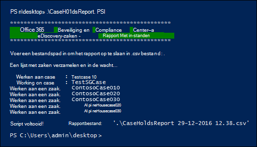

# <a name="create-a-report-on-holds-in-ediscovery-cases"></a><span data-ttu-id="ad555-103">Een rapport maken over inonthoudt in eDiscovery-zaken</span><span class="sxs-lookup"><span data-stu-id="ad555-103">Create a report on holds in eDiscovery cases</span></span>

<span data-ttu-id="ad555-104">Met het script in dit artikel kunnen eDiscovery-beheerders en eDiscovery-beheerders een rapport genereren dat informatie bevat over alle in- en uitbatingen die zijn gekoppeld aan eDiscovery-gevallen in het compliancecentrum in Office 365 of Microsoft 365.</span><span class="sxs-lookup"><span data-stu-id="ad555-104">The script in this article lets eDiscovery administrators and eDiscovery managers generate a report that contains information about all holds that are associated with eDiscovery cases in the the compliance center in Office 365 or Microsoft 365.</span></span> <span data-ttu-id="ad555-105">Het rapport bevat informatie, zoals de naam van de zaak aan een wachtplaats, de inhoudslocaties die in de wacht worden gezet en of de wacht op query's is gebaseerd.</span><span class="sxs-lookup"><span data-stu-id="ad555-105">The report contains information such as the name of the case a hold is associated with, the content locations that are placed on hold, and whether the hold is query-based.</span></span> <span data-ttu-id="ad555-106">Als er gevallen zijn die geen gebruiksreportages hebben, wordt in het script een extra rapport gemaakt met een lijst met zaken zonder wacht.</span><span class="sxs-lookup"><span data-stu-id="ad555-106">If there are cases that don't have any holds, the script will create an additional report with a list of cases without holds.</span></span>

<span data-ttu-id="ad555-107">Zie de [sectie Meer informatie](#more-information) voor een gedetailleerde beschrijving van de informatie in het rapport.</span><span class="sxs-lookup"><span data-stu-id="ad555-107">See the [More information](#more-information) section for a detailed description of the information included in the report.</span></span>

## <a name="admin-requirements-and-script-information"></a><span data-ttu-id="ad555-108">Beheerdersvereisten en scriptgegevens</span><span class="sxs-lookup"><span data-stu-id="ad555-108">Admin requirements and script information</span></span>

- <span data-ttu-id="ad555-109">Als u een rapport wilt genereren over alle eDiscovery-zaken in uw organisatie, moet u een eDiscovery-beheerder in uw organisatie zijn.</span><span class="sxs-lookup"><span data-stu-id="ad555-109">To generate a report on all eDiscovery cases in your organization, you have to be an eDiscovery Administrator in your organization.</span></span> <span data-ttu-id="ad555-110">Als u een eDiscovery Manager bent, bevat het rapport alleen informatie over de zaken die u kunt openen.</span><span class="sxs-lookup"><span data-stu-id="ad555-110">If you are an eDiscovery Manager, the report will only include information about the cases that you can access.</span></span> <span data-ttu-id="ad555-111">Zie eDiscovery-machtigingen toewijzen voor meer informatie over [eDiscovery-machtigingen.](assign-ediscovery-permissions.md)</span><span class="sxs-lookup"><span data-stu-id="ad555-111">For more information about eDiscovery permissions, see [Assign eDiscovery permissions](assign-ediscovery-permissions.md).</span></span>

- <span data-ttu-id="ad555-112">Het script in dit artikel heeft minimale foutafhandeling.</span><span class="sxs-lookup"><span data-stu-id="ad555-112">The script in this article has minimal error handling.</span></span> <span data-ttu-id="ad555-113">Het primaire doel is om snel rapport te maken over de inhoudt die zijn gekoppeld aan de eDiscovery-zaken in uw organisatie.</span><span class="sxs-lookup"><span data-stu-id="ad555-113">The primary purpose is to quickly create report about the holds that are associated with the eDiscovery cases in your organization.</span></span>

- <span data-ttu-id="ad555-114">De voorbeeldscripts in dit onderwerp worden niet ondersteund onder een standaardondersteuningsprogramma of -service van Microsoft.</span><span class="sxs-lookup"><span data-stu-id="ad555-114">The sample scripts provided in this topic aren't supported under any Microsoft standard support program or service.</span></span> <span data-ttu-id="ad555-115">De voorbeeldscripts worden geleverd als IS zonder enige garantie.</span><span class="sxs-lookup"><span data-stu-id="ad555-115">The sample scripts are provided AS IS without warranty of any kind.</span></span> <span data-ttu-id="ad555-116">Microsoft wijst alle impliciete garanties verder af, inclusief, zonder beperking, impliciete garanties van verkoopbaarheid of geschiktheid voor een bepaald doel.</span><span class="sxs-lookup"><span data-stu-id="ad555-116">Microsoft further disclaims all implied warranties including, without limitation, any implied warranties of merchantability or of fitness for a particular purpose.</span></span> <span data-ttu-id="ad555-117">Het volledige risico dat voortvloeit uit het gebruik of de prestaties van de voorbeeldscripts en documentatie blijft bij u.</span><span class="sxs-lookup"><span data-stu-id="ad555-117">The entire risk arising out of the use or performance of the sample scripts and documentation remains with you.</span></span> <span data-ttu-id="ad555-118">In geen geval zijn Microsoft, de auteurs of anderen die betrokken zijn bij het maken, produceren of leveren van de scripts aansprakelijk voor enige schade (met inbegrip van, zonder beperking, schade voor verlies van bedrijfswinsten, bedrijfsonderbreking, verlies van bedrijfsgegevens of ander geldverlies) als gevolg van het gebruik van of het onvermogen om de voorbeeldscripts of documentatie te gebruiken, zelfs als Microsoft op de hoogte is gesteld van de mogelijkheid van dergelijke schade.</span><span class="sxs-lookup"><span data-stu-id="ad555-118">In no event shall Microsoft, its authors, or anyone else involved in the creation, production, or delivery of the scripts be liable for any damages whatsoever (including, without limitation, damages for loss of business profits, business interruption, loss of business information, or other pecuniary loss) arising out of the use of or inability to use the sample scripts or documentation, even if Microsoft has been advised of the possibility of such damages.</span></span>

## <a name="step-1-connect-to-the-security--compliance-center-powershell"></a><span data-ttu-id="ad555-119">Stap 1: Verbinding maken naar het beveiligingscentrum & Compliance center PowerShell</span><span class="sxs-lookup"><span data-stu-id="ad555-119">Step 1: Connect to the Security & Compliance Center PowerShell</span></span>

<span data-ttu-id="ad555-120">De eerste stap is om verbinding te maken met Security & Compliance Center PowerShell voor uw organisatie.</span><span class="sxs-lookup"><span data-stu-id="ad555-120">The first step is to connect to Security & Compliance Center PowerShell for your organization.</span></span> <span data-ttu-id="ad555-121">Zie voor stapsgewijs instructies Verbinding maken [Beveiligingscentrum & PowerShell](/powershell/exchange/connect-to-scc-powershell).</span><span class="sxs-lookup"><span data-stu-id="ad555-121">For step-by-step instructions, see [Connect to Security & Compliance Center PowerShell](/powershell/exchange/connect-to-scc-powershell).</span></span>

## <a name="step-2-run-the-script-to-report-on-holds-associated-with-ediscovery-cases"></a><span data-ttu-id="ad555-122">Stap 2: Voer het script uit om te rapporteren over in- en uit te voeren die zijn gekoppeld aan eDiscovery-zaken</span><span class="sxs-lookup"><span data-stu-id="ad555-122">Step 2: Run the script to report on holds associated with eDiscovery cases</span></span>

<span data-ttu-id="ad555-123">Nadat u verbinding hebt gemaakt met Security & Compliance Center PowerShell, is de volgende stap het maken en uitvoeren van het script dat informatie verzamelt over de eDiscovery-gevallen in uw organisatie.</span><span class="sxs-lookup"><span data-stu-id="ad555-123">After you've connected to Security & Compliance Center PowerShell, the next step is to create and run the script that collects information about the eDiscovery cases in your organization.</span></span>

1. <span data-ttu-id="ad555-124">Sla de volgende tekst op in een Windows PowerShell scriptbestand met behulp van een achtervoegsel voor bestandsnaam van .ps1; bijvoorbeeld CaseHoldsReport.ps1.</span><span class="sxs-lookup"><span data-stu-id="ad555-124">Save the following text to a Windows PowerShell script file by using a filename suffix of .ps1; for example, CaseHoldsReport.ps1.</span></span>

   ```powershell
   #script begin
   " "
   write-host "***********************************************"
   write-host "   Security & Compliance Center   " -foregroundColor yellow -backgroundcolor darkgreen
   write-host "        eDiscovery cases - Holds report         " -foregroundColor yellow -backgroundcolor darkgreen
   write-host "***********************************************"
   " "
   #prompt users to specify a path to store the output files
   $time=get-date
   $Path = Read-Host 'Enter a file path to save the report to a .csv file'
   $outputpath=$Path+'\'+'CaseHoldsReport'+' '+$time.day+'-'+$time.month+'-'+$time.year+' '+$time.hour+'.'+$time.minute+'.csv'
   $noholdsfilepath=$Path+'\'+'CaseswithNoHolds'+' '+$time.day+'-'+$time.month+'-'+$time.year+' '+$time.hour+'.'+$time.minute+'.csv'
   #add case details to the csv file
   function add-tocasereport{
   Param([string]$casename,
   [String]$casestatus,
   [datetime]$casecreatedtime,
   [string]$casemembers,
   [datetime]$caseClosedDateTime,
   [string]$caseclosedby,
   [string]$holdname,
   [String]$Holdenabled,
   [string]$holdcreatedby,
   [string]$holdlastmodifiedby,
   [string]$ExchangeLocation,
   [string]$sharePointlocation,
   [string]$ContentMatchQuery,
   [datetime]$holdcreatedtime,
   [datetime]$holdchangedtime
   )
   $addRow = New-Object PSObject
   Add-Member -InputObject $addRow -MemberType NoteProperty -Name "Case name" -Value $casename
   Add-Member -InputObject $addRow -MemberType NoteProperty -Name "Case status" -Value $casestatus
   Add-Member -InputObject $addRow -MemberType NoteProperty -Name "Case members" -Value $casemembers
   Add-Member -InputObject $addRow -MemberType NoteProperty -Name "Case created time" -Value $casecreatedtime
   Add-Member -InputObject $addRow -MemberType NoteProperty -Name "Case closed time" -Value $caseClosedDateTime
   Add-Member -InputObject $addRow -MemberType NoteProperty -Name "Case closed by" -Value $caseclosedby
   Add-Member -InputObject $addRow -MemberType NoteProperty -Name "Hold name" -Value $holdname
   Add-Member -InputObject $addRow -MemberType NoteProperty -Name "Hold enabled" -Value $Holdenabled
   Add-Member -InputObject $addRow -MemberType NoteProperty -Name "Hold created by" -Value $holdcreatedby
   Add-Member -InputObject $addRow -MemberType NoteProperty -Name "Hold last changed by" -Value $holdlastmodifiedby
   Add-Member -InputObject $addRow -MemberType NoteProperty -Name "Exchange locations" -Value  $ExchangeLocation
   Add-Member -InputObject $addRow -MemberType NoteProperty -Name "SharePoint locations" -Value $sharePointlocation
   Add-Member -InputObject $addRow -MemberType NoteProperty -Name "Hold query" -Value $ContentMatchQuery
   Add-Member -InputObject $addRow -MemberType NoteProperty -Name "Hold created time (UTC)" -Value $holdcreatedtime
   Add-Member -InputObject $addRow -MemberType NoteProperty -Name "Hold changed time (UTC)" -Value $holdchangedtime
   $allholdreport = $addRow | Select-Object "Case name","Case status","Hold name","Hold enabled","Case members", "Case created time","Case closed time","Case closed by","Exchange locations","SharePoint locations","Hold query","Hold created by","Hold created time (UTC)","Hold last changed by","Hold changed time (UTC)"
   $allholdreport | export-csv -path $outputPath -notypeinfo -append -Encoding ascii
   }
   #get information on the cases and pass values to the case report function
   " "
   write-host "Gathering a list of cases and holds..."
   " "
   $edc =Get-ComplianceCase -ErrorAction SilentlyContinue
   foreach($cc in $edc)
   {
   write-host "Working on case :" $cc.name
   if($cc.status -eq 'Closed')
   {
   $cmembers = ((Get-ComplianceCaseMember -Case $cc.name).windowsLiveID)-join ';'
   add-tocasereport -casename $cc.name -casestatus $cc.Status -caseclosedby $cc.closedby -caseClosedDateTime $cc.ClosedDateTime -casemembers $cmembers
   }
   else{
   $cmembers = ((Get-ComplianceCaseMember -Case $cc.name).windowsLiveID)-join ';'
   $policies = Get-CaseHoldPolicy -Case $cc.Name | %{ Get-CaseHoldPolicy $_.Name -Case $_.CaseId -DistributionDetail}
   if ($policies -ne $NULL)
   {
   foreach ($policy in $policies)
   {
   $rule=Get-CaseHoldRule -Policy $policy.name
   add-tocasereport -casename $cc.name -casemembers $cmembers -casestatus $cc.Status -casecreatedtime $cc.CreatedDateTime -holdname $policy.name -holdenabled $policy.enabled -holdcreatedby $policy.CreatedBy -holdlastmodifiedby $policy.LastModifiedBy -ExchangeLocation (($policy.exchangelocation.name)-join ';') -SharePointLocation (($policy.sharePointlocation.name)-join ';') -ContentMatchQuery $rule.ContentMatchQuery -holdcreatedtime $policy.WhenCreatedUTC -holdchangedtime $policy.WhenChangedUTC
   }
   }
   else{
   write-host "No hold policies found in case:" $cc.name -foregroundColor 'Yellow'
   " "
   [string]$cc.name | out-file -filepath $noholdsfilepath -append
   }
   }
   }

   " "
   Write-host "Script complete! Report files saved to this folder: '$Path'"
   " "
   #script end
   ```

2. <span data-ttu-id="ad555-125">Ga in Windows PowerShell sessie die is geopend in stap 1 naar de map waar u het script hebt opgeslagen.</span><span class="sxs-lookup"><span data-stu-id="ad555-125">In the Windows PowerShell session that opened in Step 1, go to the folder where you saved the script.</span></span>

3. <span data-ttu-id="ad555-126">Voer het script uit; bijvoorbeeld:</span><span class="sxs-lookup"><span data-stu-id="ad555-126">Run the script; for example:</span></span>

   ```powershell
   .\CaseHoldsReport.ps1
   ```

   <span data-ttu-id="ad555-127">Het script vraagt om een doelmap om het rapport op te slaan.</span><span class="sxs-lookup"><span data-stu-id="ad555-127">The script will prompt for a target folder to save the report to.</span></span>

4. <span data-ttu-id="ad555-128">Typ de volledige padnaam van de map waarin u het rapport wilt opslaan en druk vervolgens op **Enter.**</span><span class="sxs-lookup"><span data-stu-id="ad555-128">Type the full path name of the folder to save the report to, and then press **Enter**.</span></span>

   > [!TIP]
   > <span data-ttu-id="ad555-129">Als u het rapport wilt opslaan in dezelfde map waarin het script zich bevindt, typt u een punt (".") wanneer u wordt gevraagd om een doelmap.</span><span class="sxs-lookup"><span data-stu-id="ad555-129">To save the report in the same folder that the script is located in, type a period (".") when prompted for a target folder.</span></span> <span data-ttu-id="ad555-130">Als u het rapport wilt opslaan in een submap in de map waar het script zich bevindt, typt u de naam van de submap.</span><span class="sxs-lookup"><span data-stu-id="ad555-130">To save the report in a subfolder in the folder where the script is located, just type the name of the subfolder.</span></span>

   <span data-ttu-id="ad555-131">Het script begint met het verzamelen van informatie over alle eDiscovery-gevallen in uw organisatie.</span><span class="sxs-lookup"><span data-stu-id="ad555-131">The script starts to collect information about all the eDiscovery cases in your organization.</span></span> <span data-ttu-id="ad555-132">Krijg geen toegang tot het rapportbestand terwijl het script wordt uitgevoerd.</span><span class="sxs-lookup"><span data-stu-id="ad555-132">Don't access the report file while the script is running.</span></span> <span data-ttu-id="ad555-133">Nadat het script is voltooid, wordt er een bevestigingsbericht weergegeven in de Windows PowerShell sessie.</span><span class="sxs-lookup"><span data-stu-id="ad555-133">After the script is complete, a confirmation message is displayed in the Windows PowerShell session.</span></span> <span data-ttu-id="ad555-134">Nadat dit bericht is weergegeven, hebt u toegang tot het rapport in de map die u hebt opgegeven in stap 4.</span><span class="sxs-lookup"><span data-stu-id="ad555-134">After this message is displayed, you can access the report in the folder that you specified in Step 4.</span></span> <span data-ttu-id="ad555-135">De bestandsnaam voor het rapport is `CaseHoldsReport<DateTimeStamp>.csv` .</span><span class="sxs-lookup"><span data-stu-id="ad555-135">The file name for the report is `CaseHoldsReport<DateTimeStamp>.csv`.</span></span>

   <span data-ttu-id="ad555-136">Bovendien wordt met het script ook een rapport gemaakt met een lijst met zaken die niet in gebruik zijn.</span><span class="sxs-lookup"><span data-stu-id="ad555-136">Addtionally, the script also creates a report with a list of cases that don't have any holds.</span></span> <span data-ttu-id="ad555-137">De bestandsnaam voor dit rapport is `CaseswithNoHolds<DateTimeStamp>.csv` .</span><span class="sxs-lookup"><span data-stu-id="ad555-137">The file name for this report is `CaseswithNoHolds<DateTimeStamp>.csv`.</span></span>

   <span data-ttu-id="ad555-138">Hier is een voorbeeld van het uitvoeren van het CaseHoldsReport.ps1 script.</span><span class="sxs-lookup"><span data-stu-id="ad555-138">Here's an example of running the CaseHoldsReport.ps1 script.</span></span>

   

## <a name="more-information"></a><span data-ttu-id="ad555-140">Meer informatie</span><span class="sxs-lookup"><span data-stu-id="ad555-140">More information</span></span>

<span data-ttu-id="ad555-141">De zaak bevat rapport dat is gemaakt wanneer u het script in dit artikel uit te voeren, bevat de volgende informatie over elke wacht.</span><span class="sxs-lookup"><span data-stu-id="ad555-141">The case holds report that's created when you run the script in this article contains the following information about each hold.</span></span> <span data-ttu-id="ad555-142">Zoals eerder is uitgelegd, moet u een eDiscovery-beheerder zijn om informatie te retourneren voor alle in uw organisatie op te vragen.</span><span class="sxs-lookup"><span data-stu-id="ad555-142">As previously explained, you have to be an eDiscovery Administrator to return information for all holds in your organization.</span></span> <span data-ttu-id="ad555-143">Zie [eDiscovery-zaken](./get-started-core-ediscovery.md)voor meer informatie over case holds.</span><span class="sxs-lookup"><span data-stu-id="ad555-143">For more information about case holds, see [eDiscovery cases](./get-started-core-ediscovery.md).</span></span>

- <span data-ttu-id="ad555-144">De naam van de wacht en de naam van de eDiscovery-zaak waar de wacht aan is gekoppeld.</span><span class="sxs-lookup"><span data-stu-id="ad555-144">The name of the hold and the name of the eDiscovery case that the hold is associated with.</span></span>

- <span data-ttu-id="ad555-145">Ongeacht of de eDiscovery-zaak actief of gesloten is.</span><span class="sxs-lookup"><span data-stu-id="ad555-145">Whether or not the eDiscovery case is active or closed.</span></span>

- <span data-ttu-id="ad555-146">Ongeacht of de wacht in- of uitgeschakeld is.</span><span class="sxs-lookup"><span data-stu-id="ad555-146">Whether or not the hold is enabled or disabled.</span></span>

- <span data-ttu-id="ad555-147">De leden van de eDiscovery-zaak waar de wacht aan is gekoppeld.</span><span class="sxs-lookup"><span data-stu-id="ad555-147">The members of the eDiscovery case that the hold is associated with.</span></span> <span data-ttu-id="ad555-148">Caseleden kunnen een zaak bekijken of beheren, afhankelijk van de eDiscovery-machtigingen die aan hen zijn toegewezen.</span><span class="sxs-lookup"><span data-stu-id="ad555-148">Case members can view or manage a case, depending on the eDiscovery permissions they've been assigned.</span></span>

- <span data-ttu-id="ad555-149">De tijd en datum waarop de zaak is gemaakt.</span><span class="sxs-lookup"><span data-stu-id="ad555-149">The time and date the case was created.</span></span>

- <span data-ttu-id="ad555-150">Als een zaak is gesloten, de persoon die het heeft gesloten en de tijd en datum waarop het is gesloten.</span><span class="sxs-lookup"><span data-stu-id="ad555-150">If a case is closed, the person who closed it and the time and date it was closed.</span></span>

- <span data-ttu-id="ad555-151">De Exchange postvakken en SharePoint sites die in de wacht staan.</span><span class="sxs-lookup"><span data-stu-id="ad555-151">The Exchange mailboxes and SharePoint sites locations that are on hold.</span></span>

- <span data-ttu-id="ad555-152">Als de wacht op query's is gebaseerd, wordt de syntaxis van de query gebruikt.</span><span class="sxs-lookup"><span data-stu-id="ad555-152">If the hold is query-based, the query syntax.</span></span>

- <span data-ttu-id="ad555-153">De tijd en datum waarop de wacht wordt gehouden en de persoon die deze heeft gemaakt.</span><span class="sxs-lookup"><span data-stu-id="ad555-153">The time and date the hold was created and the person who created it.</span></span>

- <span data-ttu-id="ad555-154">De tijd en datum waarop de wacht voor het laatst is gewijzigd en de persoon die deze heeft gewijzigd.</span><span class="sxs-lookup"><span data-stu-id="ad555-154">The time and date the hold was last changed and the person who changed it.</span></span>